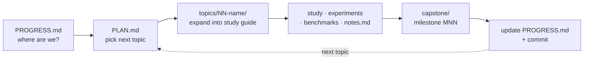

# Contributing

The most valuable contribution to this repo is **a claim that does not reproduce**.
Everything here is meant to be checkable; if `./verify.sh` prints a number that
contradicts a guide, or a paper is summarised wrongly, please
[open an issue](https://github.com/AviAvni/database-learning-path/issues) with the
output. Second most valuable: a topic that is missing, or a reading guide for a
paper or codebase that belongs in an existing topic.

## The workflow



1. Open [PROGRESS.md](PROGRESS.md) to see where things stand.
2. Pick a topic from [PLAN.md](PLAN.md) — order is a suggestion, not a rule.
3. Create `topics/NN-topic-name/` and expand the PLAN.md section into a full study
   guide: concepts with worked examples, guided code-reading of the reference repos,
   exercises, and benchmarks.
4. Study, implement the experiments, benchmark, and record predictions vs
   measurements in `notes.md`.
5. Implement the topic's capstone milestone in [capstone/](capstone/).
6. Update PROGRESS.md (status + one-line takeaway), add a
   [SESSION-LOG.md](SESSION-LOG.md) entry, and commit.

## What a topic package contains

Every topic follows the same shape, because the shape is what makes it checkable:

- **`README.md`** — the study guide. Opens with *the problem, measured*: the output
  of the provided benchmark lane, so the topic starts from a number rather than a
  claim. Then the concepts, a production-shape table with `file:line` anchors into
  the real codebase, links to the reading guides, the experiments, exercises, and
  cross-topic threads.
- **`reading-*.md`** — one guide per paper or codebase, in a fixed concept-first
  format: an H1 with the idea in it, a framing lead, **the problem in one sentence**,
  then `### Step N` sections that build each concept using only terms defined in
  earlier steps, then how to read the source material with the concepts in hand,
  questions to answer, a "done when" checklist, and references. The depth rules
  that make "using only terms defined in earlier steps" enforceable — define every
  term at first use, declare each step's input and output, work every formula on
  concrete numbers — are in
  [CLAUDE.md](https://github.com/AviAvni/database-learning-path/blob/master/CLAUDE.md#reading-guide-depth)
  (an absolute link because `CLAUDE.md` is not a book chapter), with
  [reading-criterion.md](topics/00-performance-toolbox/reading-criterion.md) as the
  reference chapter. Their mechanical half is checked by
  `python3 tools/check-reading-depth.py` — run it on a guide before committing, and
  see [Building the book](#building-the-book) for the CI gate.
- **`notes.md`** — a `## Baseline (provided lane, <machine>, measured <date>)` section
  recording the provided lane's real output with the analysis, then a
  predictions-vs-measurements worksheet. **The worksheet's cells are meant to be
  empty**: they are the reader's exercise, filled in before running the benchmark, not
  a gap to be backfilled. Then the paper numbers worth keeping, cross-topic threads,
  and open questions.
- **`experiments/`** — a Rust crate with **lane 1 implemented** and **two lanes
  stubbed**. The stub tests are the specification; the reference numbers live in
  `notes.md`. A bench binary must print its provided lanes and a `[stub — ...]` note
  for the unimplemented ones, then exit 0 — a `todo!()` panic must never take down a
  measurement above it.

Two topics (4 and 10) deliberately have no provided lane, because their benchmarks
measure only the reader's own implementation. Their READMEs open by saying so and by
giving the arithmetic or the external oracle to predict against instead. That is a
legitimate shape for a topic; inventing a number to fill the slot is not.

## Conventions

- **Language: Rust** for all implementations and benchmarks (criterion + flamegraph
  where a microbenchmark needs them; plain seeded `main`s where determinism matters
  more than statistics).
- **Every topic ends with a benchmark.** Numbers over intuition, and a prediction
  recorded before the measurement.
- **Every cited number gets a source.** A section or table number, not "the paper
  says". If a figure cannot be verified against the actual PDF, it does not go in.
- **Report the negative result.** If a published technique does not reproduce on the
  local generator, that is the finding — say so, explain why the premise is absent,
  and add an exercise to construct the case where it holds. (See topic 42's
  multi-hit booster for the worked example.)
- **Code reading is done against pinned clones** under `~/repos/` rather than vendored
  here. The commit each clone was read at is recorded **once**, in the pin table at
  the end of [resources/codebases.md](resources/codebases.md), so the thousands of
  `file:line` anchors in the guides mean something. Regenerate it with
  `python3 tools/pin-table.py` after cloning or updating a reference repo — putting
  a SHA in each guide instead would mean thousands of them drifting separately.
  To read a file at that pinned commit — to write an anchor, or to check one that
  is already there — use `python3 tools/pinned-source.py`:

  ```bash
  tools/pinned-source.py show lmdb mdb.c -r 1350:1365     # with real line numbers
  tools/pinned-source.py grep lmdb 'mdb_env_pick_meta' --path mdb.c
  tools/pinned-source.py check lmdb mdb.c:1356 --contains 'meta page'
  ```

  It reads your clone when you have one and otherwise fetches the same commit into
  a gitignored `.cache/`, so anchors stay checkable without cloning every upstream
  repo the guides cite.
- **Generators are seeded.** Anyone must be able to reproduce a figure exactly.
- **Notes capture *why* a design wins** and what it trades away — not summaries.

## Building the book

```bash
cargo install mdbook mdbook-mermaid
mdbook-mermaid install .
mdbook serve                      # or: mdbook build
```

CI ([.github/workflows/book.yml](.github/workflows/book.yml)) builds HTML and PDF on
every push to `master` and deploys to GitHub Pages. Before committing content, build
locally and check that mermaid diagrams render and internal links resolve — a broken
link is invisible in markdown and obvious in the book. The same workflow runs
`tools/check-reading-depth.py --check`, which holds every reading guide that has
started following the depth rules to all of them:

```bash
python3 tools/check-reading-depth.py topics/03-btree-internals/   # one topic
python3 tools/check-reading-depth.py --stats                      # rollout progress
```

A second workflow ([verify.yml](.github/workflows/verify.yml)) runs
`./verify.sh --summary` and a `-D warnings` build of all 46 crates on every push and
pull request. It is the gate that keeps the repo's central claim true, so a lane that
stops running is a red build. Note that `cargo test` is deliberately **not** a gate:
the stub tests are the specification and are supposed to fail on a fresh clone.

One mdbook wrinkle worth knowing: `src = "."`, so mdbook copies every non-markdown
file under the repo root into `book/`. It honours neither `.gitignore` nor any exclude
list, which is why cargo artifacts are pushed outside the clone by
[.cargo/config.toml](.cargo/config.toml). If you remove that file, run `cargo clean`
before `mdbook build` or you will copy gigabytes of build output into the book.

## Running the experiments

```bash
./verify.sh                       # every measured lane, with output
./verify.sh --summary             # just the pass/fail table
./verify.sh --list                # every lane and what it measures, run nothing
./verify.sh --criterion           # also the slow criterion lanes (topic 0)
./verify.sh 40 41                 # only these topics

cd topics/40-security-attack-graphs/experiments
cargo test                        # provided tests pass; stub tests are the spec
cargo run --release --bin attack_bench
```

## A note on AI assistance

This repo was written with heavy use of Claude Code, and pull requests written the
same way are welcome. The bar is not *how* it was produced but whether it holds up:
papers actually read and cited by section, numbers actually measured by committed
code, and negative results reported rather than smoothed over. If you add a topic,
run `./verify.sh` and make sure your lane is in it.
