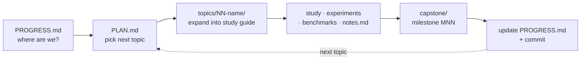

# Contributing

The most valuable contribution to this repo is **a claim that does not reproduce**.
Everything here is meant to be checkable; if `./verify.sh` prints a number that
contradicts a guide, or a paper is summarised wrongly, please
[open an issue](https://github.com/AviAvni/database-learning-path/issues) with the
output. Second most valuable: a topic that is missing, or a reading guide for a
paper or codebase that belongs in an existing topic.

## The workflow



1. Open [PROGRESS.md](PROGRESS.md) to see where things stand.
2. Pick a topic from [PLAN.md](PLAN.md) — order is a suggestion, not a rule.
3. Create `topics/NN-topic-name/` and expand the PLAN.md section into a full study
   guide: concepts with worked examples, guided code-reading of the reference repos,
   exercises, and benchmarks.
4. Study, implement the experiments, benchmark, and record predictions vs
   measurements in `notes.md`.
5. Implement the topic's capstone milestone in [capstone/](capstone/).
6. Update PROGRESS.md (status + one-line takeaway), add a
   [SESSION-LOG.md](SESSION-LOG.md) entry, and commit.

## What a topic package contains

Every topic follows the same shape, because the shape is what makes it checkable:

- **`README.md`** — the study guide. Opens with *the problem, measured*: the output
  of the provided benchmark lane, so the topic starts from a number rather than a
  claim. Then the concepts, a production-shape table with `file:line` anchors into
  the real codebase, links to the reading guides, the experiments, exercises, and
  cross-topic threads.
- **`reading-*.md`** — one guide per paper or codebase, in a fixed concept-first
  format: an H1 with the idea in it, a framing lead, **the problem in one sentence**,
  then `### Step N` sections that build each concept using only terms defined in
  earlier steps, then how to read the source material with the concepts in hand,
  questions to answer, a "done when" checklist, and references.
- **`notes.md`** — a predictions-vs-measurements table (write the prediction *before*
  running the benchmark), the paper numbers worth keeping, worked cross-topic threads,
  and open questions.
- **`experiments/`** — a Rust crate with **lane 1 implemented** and **two lanes
  stubbed**. The stub tests are the specification; the reference numbers live in
  `notes.md`.

## Conventions

- **Language: Rust** for all implementations and benchmarks (criterion + flamegraph
  where a microbenchmark needs them; plain seeded `main`s where determinism matters
  more than statistics).
- **Every topic ends with a benchmark.** Numbers over intuition, and a prediction
  recorded before the measurement.
- **Every cited number gets a source.** A section or table number, not "the paper
  says". If a figure cannot be verified against the actual PDF, it does not go in.
- **Report the negative result.** If a published technique does not reproduce on the
  local generator, that is the finding — say so, explain why the premise is absent,
  and add an exercise to construct the case where it holds. (See topic 42's
  multi-hit booster for the worked example.)
- **Code reading is done against pinned clones** under `~/repos/` rather than vendored
  here, with the commit recorded in the guide so the `file:line` anchors mean
  something.
- **Generators are seeded.** Anyone must be able to reproduce a figure exactly.
- **Notes capture *why* a design wins** and what it trades away — not summaries.

## Building the book

```bash
cargo install mdbook mdbook-mermaid
mdbook-mermaid install .
mdbook serve                      # or: mdbook build
```

CI ([.github/workflows/book.yml](.github/workflows/book.yml)) builds HTML and PDF on
every push to `master` and deploys to GitHub Pages. Before committing content, build
locally and check that mermaid diagrams render and internal links resolve — a broken
link is invisible in markdown and obvious in the book.

## Running the experiments

```bash
./verify.sh                       # every measured lane, with output
./verify.sh --summary             # just the pass/fail table
./verify.sh 40 41                 # only these topics

cd topics/40-security-attack-graphs/experiments
cargo test                        # provided tests pass; stub tests are the spec
cargo run --release --bin attack_bench
```

## A note on AI assistance

This repo was written with heavy use of Claude Code, and pull requests written the
same way are welcome. The bar is not *how* it was produced but whether it holds up:
papers actually read and cited by section, numbers actually measured by committed
code, and negative results reported rather than smoothed over. If you add a topic,
run `./verify.sh` and make sure your lane is in it.
