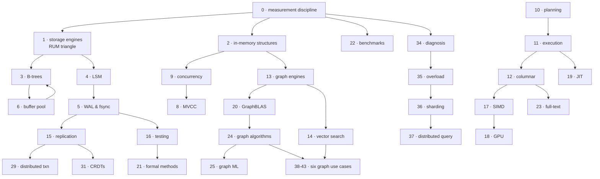

# Findings

One measured headline per topic, and the command that re-derives it. This is the
whole argument for this format over a reading list in one table: a link
collection cannot be wrong in a way you can detect, and every row below can.

Every figure here comes from a benchmark in this repo, measured on an **Apple M3
Pro (5P + 6E, 36 GB)** on 2026-07-28. Generators are seeded, so counts,
ratios and distributions reproduce exactly; timings will differ on your
hardware. Run everything with `./verify.sh`, one topic with `./verify.sh 12`, or
`./verify.sh --list` to see every lane.

Two topics have no row: **4 (LSM deep dive)** and **10 (query planning)** are the
two whose benchmarks measure only *your* implementation, so there is nothing to
report on a fresh clone. Their READMEs say so and explain what to predict
instead.

| # | Topic | Measured finding | Lane |
|---|---|---|---|
| 0 | [Performance Toolbox](topics/00-performance-toolbox/README.md) | The DRAM latency ladder verified at ~1 / 5 / 100 ns — and `cache_ladder` measured its own 8 MB working set until the pointer chase was fixed to carry state. **21%** of a HashMap lookup is SipHash. | `./verify.sh --criterion 00` |
| 1 | [Storage Engine Landscape](topics/01-storage-engine-landscape/README.md) | Same 108 MB of records: fjall (LSM) writes **48 MB**, redb (CoW B-tree) writes **6.8 GB** — space amp **0.45× vs 63.28×**, a 140× spread. | `./verify.sh 01` |
| 2 | [In-Memory Structures](topics/02-in-memory-structures/README.md) | hashbrown insert: p50 **42 ns**, max **58.4 ms**. A 1.4-millionfold spread inside one operation, invisible to any throughput number. | `./verify.sh 02` |
| 3 | [B-Tree Internals](topics/03-btree-internals/README.md) | The "height is the metric" story fails: lookups climb **862 → 1101 ns** from 1e6 to 4e6 keys while height stays at 3. Height sets pages touched; cache residency sets what a touch costs. | `./verify.sh 03` |
| 5 | [Durability & WAL](topics/05-durability-wal/README.md) | `write()` **857k/s**, `fsync` **44k/s**, `F_FULLFSYNC` **337/s** — a 2540× spread, and only the last is durable on this drive. | `./verify.sh 05` |
| 6 | [Buffer Pool](topics/06-buffer-pool/README.md) | mmap page reads: p50 **42 ns**, max **182 µs**. A 4300× spread, entirely minor page faults the database cannot see or schedule. | `./verify.sh 06` |
| 7 | [Networking & Protocols](topics/07-networking-protocols/README.md) | Identical zero-work requests: **44k ops/s at P=1**, **12.3M at P=256** — a **279×** swing that is pure syscalls and round trips. | `./verify.sh 07` |
| 8 | [Transactions & MVCC](topics/08-transactions-mvcc/README.md) | A global mutex delivers ~**600k txn/s** on read-heavy, write-heavy and hot-key workloads alike. Flat, because it already serialized everything. | `./verify.sh 08` |
| 9 | [Concurrency](topics/09-concurrency/README.md) | A global mutex gets **2.9× slower** from 1 to 16 threads (8.65 → 2.96 Mops/s). Padding "independent" counters to 128 B is worth **17.8×**; 64 B only half-fixes it on M-series. | `./verify.sh 09` |
| 11 | [Execution Models](topics/11-execution-models/README.md) | Volcano tops out at **103 M rows/s**, and gets *slower* as selectivity rises (74.7 M at 95%) — surviving the filter is what costs, not the filter. | `./verify.sh 11` |
| 12 | [Columnar Analytics](topics/12-columnar-analytics/README.md) | The scan floor is **24–57 GB/s** on a 150 GB/s machine. This lane previously printed **19,047,619 GB/s** — a hoisted loop, caught by its own implausibility. | `./verify.sh 12` |
| 13 | [Graph Engines](topics/13-graph-engines/README.md) | The same two-hop query is **101× slower** from supernodes than from random nodes (4.9 µs → 495 µs) — and reaches *fewer* distinct nodes. | `./verify.sh 13` |
| 14 | [Vector Search](topics/14-vector-search/README.md) | Brute force: **117 QPS** at recall 1.000. That single point is what every ANN index is betting against. | `./verify.sh 14` |
| 15 | [Replication & Consensus](topics/15-replication-consensus/README.md) | Follower fsync policy alone spans **59×** (341 → 20,174 entries/s). Batching fixes the median and leaves the p99 at 2980 µs. | `./verify.sh 15` |
| 16 | [Testing & Correctness](topics/16-testing-correctness/README.md) | Seeded crash testing catches planted bugs at **48.8% to 99.6%** per seed — same harness, four wildly different odds of ever finding out. | `./verify.sh 16` |
| 17 | [SIMD](topics/17-simd/README.md) | Eight accumulators and no intrinsics: **8.88 → 26.32 GB/s**. Branchy filtering collapses to **0.95 GB/s** at 50% selectivity while branchless stays flat at ~10. | `./verify.sh 17` |
| 18 | [GPU Acceleration](topics/18-gpu/README.md) | **No crossover up to 2^24 elements.** At 16 M, upload alone costs 7197 µs against a 2723 µs CPU total — the transfer tax, measured. | `./verify.sh 18` |
| 19 | [JIT & Compilation](topics/19-jit/README.md) | Interpretation cost compounds with expression size: 7 → 511 nodes costs the interpreter **94×** but the vectorized evaluator only **47×**, so the gap widens from 6× to 12×. | `./verify.sh 19` |
| 20 | [GraphBLAS](topics/20-graphblas/README.md) | SpMV bandwidth decays **20.7 → 12.3 GB/s** as the graph grows. Hypersparse indexing is **50× smaller** (80.4 MB → 1.59 MB) and sweeps rows **175× faster**. | `./verify.sh 20` |
| 21 | [Formal Methods](topics/21-formal/README.md) | The hand-ordered rewriter answers `(a*2)/2` with `(a << 1) / 2` and stops. One locally-excellent rewrite destroys the cancellation — the phase-ordering trap, in four lines. | `./verify.sh 21` |
| 22 | [Standard Benchmarks](topics/22-benchmarks/README.md) | TPC-H Q1 and Q6 measured at **5.2–5.7** and **9.0–14.4 GB/s** effective; YCSB-E's p999 is **12.9 µs** against read-only's 4.0 µs. | `./verify.sh 22` |
| 23 | [Full-Text Search](topics/23-fulltext/README.md) | Exhaustive BM25 spans **0.009 ms to 10.378 ms** across four two-term queries — 272,310 postings against 159. Term rarity, not query complexity. | `./verify.sh 23` |
| 24 | [Graph Algorithms](topics/24-graph-algorithms/README.md) | Same node and edge count, RMAT vs uniform: **15.6 M triangles vs 5428**, and 447 ms vs 195 ms. Degree skew is the workload. | `./verify.sh 24` |
| 25 | [Graph ML](topics/25-graph-ml/README.md) | The message-passing kernel *is* an SpMM: **4.31 ms at 16.82 GFLOP/s**, against 5.65 ms for the dense transform beside it. | `./verify.sh 25` |
| 26 | [Probabilistic Structures](topics/26-probabilistic/README.md) | A point miss costs **246 ns** (binary search) or **299 ns** (BTreeMap); a 224 MB HashSet does it in **28 ns**. That gap is what a filter is bidding for. | `./verify.sh 26` |
| 27 | [Streaming & IVM](topics/27-streaming/README.md) | 100 edge changes to a 500k-edge graph costs **1111 ms** to re-derive a wedge join — the batch is 0.02% of the graph, the work is 100% of it. | `./verify.sh 27` |
| 28 | [Cloud-Native Storage](topics/28-cloud-native/README.md) | Local NVMe p50 **0.10 ms**; raw S3 p50 **14.17 ms**, p99 **112.99 ms**. A 140× median gap and a far worse tail. | `./verify.sh 28` |
| 29 | [Distributed Transactions](topics/29-distributed-txn/README.md) | The workload's own conflict rate goes **0.3% → 99.6%** as Zipf θ moves 0.5 → 1.3. Contention is a property of the data, before any protocol. | `./verify.sh 29` |
| 30 | [Time-Series](topics/30-timeseries/README.md) | delta+varint gives **11.00 B/sample for all four shapes** — a constant series compresses exactly as well as random noise, because only the timestamp is being compressed. | `./verify.sh 30` |
| 31 | [CRDTs](topics/31-crdts/README.md) | Last-write-wins on 10 keys with per-write sync loses **94.98%** of writes — 37,991 of 40,000 acknowledged writes that no replica remembers. | `./verify.sh 31` |
| 32 | [HTAP](topics/32-htap/README.md) | One copy, one coarse lock: adding full scans takes writes from **10.5 M per 2 s to 94**, and p99 from 334 ns to **2.7 s**. Every scan is a write outage. | `./verify.sh 32` |
| 33 | [Temporal Graphs](topics/33-temporal-graphs/README.md) | Static reachability reports 25,031 reachable pairs where time-respecting paths number **137** — **99.5% false positives** on the sparse contact graph. | `./verify.sh 33` |
| 34 | [Debugging & Diagnosis](topics/34-debugging/README.md) | A closed-loop benchmark reports **p99 = 1.0 µs** where an open-loop one reports **90 ms** on identical work — coordinated omission, a 90,000× lie. | `./verify.sh 34` |
| 35 | [Overload Control](topics/35-overload/README.md) | A 10-second outage ends at t=40 s. At 140 QPS (of 300 capacity) goodput stays at **zero until t=161 s**; at 280 QPS it **never recovers** — the outage outlives its own trigger. | `./verify.sh 35` |
| 36 | [Sharding & Rebalancing](topics/36-sharding/README.md) | Growing 16 shards to 17 moves **94.1% of all keys** (ideal: 5.9%), and it gets *worse* the larger you are. | `./verify.sh 36` |
| 37 | [Distributed Query](topics/37-distributed-query/README.md) | With 1-in-100 slow leaves, **63.4% of 100-leaf** fan-outs hit at least one. Waiting for 95% of leaves instead of all: p99 **10.0 → 9.9 ms**, p50 5.6 → 9.6. | `./verify.sh 37` |
| 38 | [GraphRAG & Agent Memory](topics/38-graphrag-agent-memory/README.md) | Independent passage ranking finds the answer at rank **1.00** at one hop and **9.21** — chance — at two. Vector RAG's multi-hop collapse. | `./verify.sh 38` |
| 39 | [Fraud & Identity Graphs](topics/39-fraud-identity-graphs/README.md) | Two row-based rankers fail in *opposite* regimes: degree ranking scores **0.00** precision without camouflage, obscurity ranking **0.00** with it. | `./verify.sh 39` |
| 40 | [Security & Attack Graphs](topics/40-security-attack-graphs/README.md) | A directory reporting **8 privileged accounts, forever** has **1969 of 2000 users** holding a path to Domain Admin — and your exposure number depends on how long the collector ran. | `./verify.sh 40` |
| 41 | [On-Chain Analytics](topics/41-onchain-analytics/README.md) | The industry-default haircut rule marks **98% of addresses** tainted from one theft; 658 of them are under 0.1% tainted. An 1816 court case does better. | `./verify.sh 41` |
| 42 | [Recommendations & Social](topics/42-recommendations-social/README.md) | Recommending bestsellers to everyone gets **35.3% hit-rate@50** with **92.2% overlap** between users' lists. Popularity is not a weak baseline. | `./verify.sh 42` |
| 43 | [Ops Dependency Graphs](topics/43-ops-dependency-graphs/README.md) | One gray failure: **34 of 55 services alert** and the broken one is not among them — it ranks 35th by failure count, 41st by error rate, at exactly the baseline. | `./verify.sh 43` |

## How to read this table

Some rows are pleasant confirmations of theory. The interesting ones are not:

- **Row 3 and row 12 contradict their own topic's tidy story.** The B-tree ladder
  is not a step function, and the columnar scan lane once printed a number
  20,000× faster than the memory bus. Both are in the guides as the finding,
  because a curriculum that only reports confirmations is not measuring anything.
- **Rows 8, 22, 30 and 42 are baselines that refuse to be weak.** A global mutex
  is flat rather than bad; delta+varint compresses noise as well as constants;
  bestseller lists get a third of users right. If your improvement cannot beat
  these, that is worth knowing before you build it.
- **Rows 34 through 43 are all measurement failures rather than system
  failures** — the closed loop, the alert storm, the per-node statistic, the
  compliance report. The system is fine; the number you were looking at was not.

If a row does not reproduce on your machine beyond timing differences, that is
the most useful bug report this repo can receive —
[open an issue](https://github.com/AviAvni/database-learning-path/issues) with
the output.

## Which topics lean on which

The order is a suggestion, not a prerequisite chain — but the guides do thread,
and some threads carry real weight. Solid arrows are dependencies worth
respecting; the clusters are just groupings.

Three threads are worth following deliberately, because the same wall shows up
in each of them under a different name:

1. **The fsync wall.** Topic 5 measures 337 durable commits/s. Topic 15's
   per-entry follower fsync lands at 341 entries/s. Topic 28 finds the same
   physics at 14 ms per S3 GET. One constant, three architectures built to dodge it.
2. **Skew.** Topic 13's 101× supernode gap, topic 24's 15.6 M-vs-5428 triangle
   counts, topic 36's hot shard at 3.8× ideal, topic 20's load-balancing menu.
   Uniform data is the exception in every one of them.
3. **The measurement itself lying.** Topic 0 states the failure modes, topic 12
   contains one (a hoisted loop printing 19 million GB/s), topic 34 quantifies
   the closed-loop version at 90,000×, and topics 39–43 are each a different
   statistic pointing confidently at the wrong thing.
