# The Plan — Database Internals Curriculum

32 topics, self-paced, deliberately diverse: storage / in-memory / query / graph /
vector / distributed / hardware topics are interleaved so it stays fun. Each topic has: why it
matters, core concepts, reference code to read, key papers, and a build+bench exercise
that also advances the **capstone** (`capstone/README.md`).

Order is a recommendation. Topics 0–6 are the foundation; after that, jump around freely.

## The map

```mermaid
flowchart TD
    subgraph FOUNDATION["Foundation — do in order"]
        direction LR
        T0["0 perf<br/>toolbox"] --> T1["1 B-tree<br/>vs LSM"] --> T2["2 in-memory<br/>structures"] --> T3["3 B-tree<br/>internals"] --> T4["4 LSM<br/>deep dive"] --> T5["5 WAL &<br/>recovery"] --> T6["6 buffer<br/>pool"]
    end
    subgraph CORE["Systems core"]
        T7["7 networking"]
        T8["8 MVCC"]
        T9["9 concurrency"]
    end
    subgraph QUERY["Query engine"]
        T10["10 parse/plan/optimize"] --> T11["11 execution models"] --> T19["19 JIT"]
        T12["12 columnar"]
    end
    subgraph GRAPH["Graph — home turf"]
        T13["13 graph engines"] --> T20["20 GraphBLAS internals"] --> T24["24 graph algorithms"] --> T25["25 graph ML"]
    end
    subgraph SEARCH["Indexes & search"]
        T14["14 vector"]
        T23["23 full-text"]
        T26["26 probabilistic"]
    end
    subgraph HW["Hardware"]
        T17["17 SIMD"] --> T18["18 GPU"]
    end
    subgraph DIST["Distributed"]
        T15["15 replication/Raft"] --> T29["29 distributed txns"]
        T28["28 cloud-native"]
        T31["31 CRDTs"]
    end
    subgraph CORRECT["Correctness"]
        T16["16 testing"] --> T21["21 formal methods"]
    end
    subgraph STREAM["Streaming & temporal"]
        T27["27 incremental views"]
        T30["30 time-series"]
        T27 --> T32["32 HTAP"]
    end
    T22["22 standard benchmarks — the yardstick for everything"]
    FOUNDATION --> CORE
    FOUNDATION --> QUERY
    FOUNDATION --> GRAPH
    FOUNDATION --> SEARCH
    FOUNDATION --> HW
    FOUNDATION --> DIST
    FOUNDATION --> CORRECT
    FOUNDATION --> STREAM
    QUERY --> T22
    GRAPH --> T22
```

---

## 0. The Performance Toolbox

**Why:** You care about performance — so learn to measure before learning to build. Everything after this topic gets benchmarked properly.

- **Concepts:** microbenchmark pitfalls (warmup, variance, coordinated omission), CPU caches & memory hierarchy, branch prediction, TLB, `perf` counters, flamegraphs, latency percentiles vs throughput, roofline thinking.
- **Read code:** `criterion.rs` internals (how it fights noise), RocksDB `db_bench`, redis `redis-benchmark.c`.
- **Papers/reading:** "Systems Performance" (Gregg) ch. 1–2; "Fair Benchmarking Considered Difficult" (DBTest '18); "How NOT to Measure Latency" (Tene talk); Drepper §3–4.
- **Build & bench:** Rust bench harness comparing `Vec` scan vs `HashMap` lookup vs `BTreeMap` across sizes; produce flamegraphs; observe cache-line effects (seq vs random access).
- **Capstone milestone M0:** scaffold the `falkordb-scratch` workspace + criterion bench harness + graph workload generator; record baseline numbers from the real falkordb-rs-next-gen to chase.

## 1. Storage Engine Landscape: B-Tree vs LSM

**Why:** The single most consequential design decision in a database. Frames everything else.

- **Concepts:** read/write/space amplification triangle (RUM conjecture), in-place vs out-of-place updates, page-oriented vs log-structured, where each engine family wins.
- **Read code:** fjall (small, clean Rust LSM), turso (`core/storage/` — SQLite-style B-tree in Rust), tidesdb (C LSM), RocksDB high-level layout.
- **Papers:** "The LSM-Tree" (O'Neil '96), "The Ubiquitous B-Tree" (Comer '79), "Designing Access Methods: The RUM Conjecture" (2016), "Architecture of a Database System" (Hellerstein/Stonebraker).
- **Build & bench:** benchmark fjall vs a raw B-tree (e.g. `redb`/sled) on write-heavy vs read-heavy vs scan workloads; explain results in terms of amplification.
- **Capstone M1:** define the storage-backend abstraction (compare with the reference's `graph/src/storage/backend.rs` *after* designing yours) — in-memory first, persistent backends swap in later.

## 2. In-Memory Structures: Hash Tables, Skip Lists, Tries

**Why:** Redis's dict and FalkorDB's core structures — the workhorses of every in-memory DB.

- **Concepts:** open addressing vs chaining, incremental rehashing (redis), SwissTable/SIMD probing (hashbrown), skip lists (why LSM memtables use them), radix trees / ART, cache-conscious layout.
- **Read code:** redis `dict.c` (incremental rehash!) + valkey's changes, redis `t_zset.c` (skiplist), hashbrown, RocksDB `memtable/` (concurrent skiplist), redis `rax.c` (radix tree).
- **Papers:** "The Adaptive Radix Tree" (Leis ICDE'13), Google SwissTable talk (CppCon 2017).
- **Build & bench:** implement a skip list and an incremental-rehash hash table in Rust; bench vs `hashbrown` and `crossbeam-skiplist`; measure rehash latency spikes vs redis-style incremental approach.
- **Capstone M2:** attribute store + string pool + node/edge ID datablocks (hash index + interning) — the reference's `attribute_store.rs`/`string_pool.rs`, your way.

## 3. B-Tree Internals & Paged Storage

**Why:** SQLite/Postgres/LMDB/most-embedded-DBs. Pages are how disks think.

- **Concepts:** slotted pages, node splits/merges, B+tree vs B-tree, prefix compression, copy-on-write B-trees (LMDB), overflow pages, page checksums, varint encoding.
- **Read code:** turso `core/storage/btree.rs` + pager (Rust re-implementation of SQLite — ideal), SQLite `btree.c` (the classic), LMDB `mdb.c` (COW).
- **Papers:** "Modern B-Tree Techniques" (Graefe — the survey), SQLite file-format doc.
- **Build & bench:** implement a slotted-page disk B+tree in Rust (fixed 4KB pages); bench point lookups & range scans vs `redb`; try prefix truncation and measure.
- **Capstone M3:** disk-backed B+tree backend for properties + range indexes behind the storage abstraction.

## 4. LSM-Tree Deep Dive

**Why:** RocksDB powers half the industry (including graph DBs like TiKV-based ones). Compaction is a fascinating scheduling problem.

- **Concepts:** memtable→SST lifecycle, leveled vs tiered vs FIFO compaction, bloom filters (and Monkey's optimal allocation), fractional cascading, compaction debt/write stalls, SST formats & block cache.
- **Read code:** fjall (read it ALL — it's small), RocksDB `db/compaction/`, `table/block_based/`.
- **Papers:** "Monkey: Optimal Navigable Key-Value Store" (SIGMOD'17), "Dostoevsky" (SIGMOD'18), RocksDB paper (TODS'21), "Constructing and Analyzing the LSM Compaction Design Space" (VLDB'21).
- **Build & bench:** implement a mini-LSM (memtable + SSTs + leveled compaction + bloom filters) — optionally follow skyzh/mini-lsm course; measure write amp with different compaction strategies.
- **Capstone M4:** LSM-backed alternative persistence (graph snapshots as SSTs); benchmark B+tree vs LSM backends on graph mutation + bulk-load workloads.

## 5. Durability: WAL, fsync, Crash Recovery

**Why:** The hardest part to get right. Where correctness meets performance.

- **Concepts:** write-ahead logging, ARIES (redo/undo, LSNs, fuzzy checkpoints), group commit, fsync vs fdatasync vs O_DIRECT, torn pages (full-page writes / double-write buffer), io_uring.
- **Read code:** postgres `xlog.c` (skim, it's huge), turso WAL, redis AOF (`aof.c`) vs RDB, RocksDB WAL.
- **Papers:** "ARIES" (Mohan '92 — read a summary first, then the paper), "Scalability of write-ahead logging on multicore" (Aether, VLDB'10).
- **Build & bench:** add WAL + crash recovery to your B+tree; write a crash-injection test (kill -9 mid-write, verify recovery); bench fsync-per-commit vs group commit vs O_DIRECT.
- **Capstone M5:** WAL + crash recovery for graph mutations (contrast with FalkorDB's reliance on redis RDB/AOF); crash-injection test suite.

## 6. Buffer Pool & Memory Management

**Why:** mmap-vs-buffer-pool is one of the great debates; allocation strategy dominates in-memory DB performance.

- **Concepts:** buffer pool design, eviction (LRU, CLOCK, LRU-K, 2Q), pointer swizzling (LeanStore), why mmap is (usually) wrong for DBs, jemalloc/arena allocation, NUMA.
- **Read code:** postgres `bufmgr.c` + CLOCK sweep, redis `zmalloc.c`, DuckDB buffer manager, LeanStore (C++).
- **Papers:** "Are You Sure You Want to Use MMAP in Your DBMS?" (CIDR'22), "LeanStore" (ICDE'18), "Virtual-Memory Assisted Buffer Management" (vmcache, SIGMOD'23).
- **Build & bench:** build a buffer pool (CLOCK) for the B+tree; bench vs mmap on datasets larger than RAM; reproduce mmap's write-back unpredictability.
- **Capstone M6:** buffer pool under the persistent backends — graphs larger than RAM.

## 7. Networking, Protocols & Event Loops

**Why:** Redis's speed is as much about the event loop and RESP as about data structures. You know the module side of FalkorDB; own the server side.

- **Concepts:** RESP2/RESP3 design (why so parseable), event loops (ae.c) vs thread-per-core vs async, pipelining, io-threads in redis/valkey, pgwire protocol, neo4j's Bolt protocol (versioned handshake, PackStream binary serialization, explicit result streaming via PULL/DISCARD + cursors) — RESP vs pgwire vs Bolt as three answers to framing/typing/streaming, backpressure.
- **Read code:** redis `ae.c` + `networking.c`, valkey's io-threads rework (great perf PRs to study), `pgwire` (Rust crate), qdrant's gRPC/tonic setup, FalkorDB's own `src/bolt/` (it already speaks Bolt — reread it with server-side eyes).
- **Papers/reading:** "The C10K problem", valkey blog posts on multithreading perf, Glauber Costa on thread-per-core, Bolt Protocol + PackStream specifications (neo4j docs).
- **Build & bench:** implement a RESP server in Rust (tokio) speaking GET/SET; bench with `redis-benchmark` and `memtier_benchmark` against real redis; find your bottleneck with flamegraphs.
- **Capstone M7:** RESP server exposing `GRAPH.QUERY`/`GRAPH.RO_QUERY` — wire-compatible with existing FalkorDB clients; bench with falkordb-py against the real thing. Stretch: a Bolt listener on a second port so neo4j drivers connect too (PackStream encoding of the graph result types).

## 8. Transactions & MVCC

**Why:** The intellectual core of OLTP. Postgres MVCC vs in-memory designs is a masterclass in trade-offs.

- **Concepts:** ACID, isolation levels & anomalies (read this twice), 2PL vs OCC vs MVCC, snapshot isolation & write skew, SSI, postgres tuple versioning + vacuum, HOT updates, timestamp ordering, Hekaton-style MVCC.
- **Read code:** postgres `heapam.c` + visibility rules (`HeapTupleSatisfiesMVCC`), surrealdb transaction layer, RocksDB `utilities/transactions/`.
- **Papers:** "A Critique of ANSI SQL Isolation Levels" (Berenson '95), "Serializable Snapshot Isolation in PostgreSQL" (VLDB'12), "An Empirical Evaluation of In-Memory MVCC" (Wu/Pavlo VLDB'17), "Hekaton" (SIGMOD'13).
- **Build & bench:** implement MVCC with snapshot isolation over your KV engine; write tests that demonstrate (and then prevent) write skew; bench txn throughput vs a single global lock.
- **Capstone M8:** MVCC graph — copy-on-write + versioned reads (design yours, then study the reference's `mvcc_graph.rs`/`cow.rs`).

## 9. Concurrency: Latches, Lock-Free & Epochs

**Why:** Scaling a storage engine across cores is where the hardest bugs and biggest wins live.

- **Concepts:** latches vs locks, lock coupling / optimistic lock coupling, lock-free structures & memory reclamation (epochs, hazard pointers), Bw-Tree, atomics & memory ordering in Rust, contention profiling.
- **Read code:** crossbeam-epoch, RocksDB concurrent memtable inserts, memgraph skip-list, postgres lwlock.c.
- **Papers:** "The Bw-Tree" (ICDE'13) + "Building a Bw-Tree Takes More Than Just Buzz Words" (SIGMOD'18 — the reality check), "Optimistic Lock Coupling" (Leis).
- **Build & bench:** make your skip list concurrent (epoch reclamation); bench scaling 1→16 threads; compare mutex-sharded vs lock-free; measure with `perf c2c` for false sharing.
- **Capstone M9:** threadpool + concurrent readers with single writer; parallel query execution (compare with the reference's `threadpool.rs` design).

## 10. Query Engines I: Parsing, Planning, Optimization

**Why:** The optimizer is the database's brain. Directly relevant to Cypher planning in FalkorDB.

- **Concepts:** logical vs physical plans, relational algebra rewrites (predicate pushdown, join reordering), cost models & cardinality estimation (where it all goes wrong), dynamic programming join ordering, Cascades framework.
- **Read code:** DuckDB `src/optimizer/` (readable!), postgres `optimizer/` (join search), sqlparser-rs, datafusion optimizer, polars lazy-frame optimizer (`crates/polars-plan/`).
- **Papers:** "Access Path Selection" (Selinger '79 — the founding paper), "How Good Are Query Optimizers, Really?" (VLDB'15 — humbling), "The Cascades Framework" (Graefe '95).
- **Build & bench:** write a mini planner: parse SQL subset → logical plan → apply pushdown + join reordering; verify plans change with table sizes; compare against DuckDB's `EXPLAIN`.
- **Capstone M10:** Cypher-subset parser + binder + logical plan tree + rewrite rules (the reference's `parser/` + `planner/` — including its optimizer dir — are your after-the-fact mirror).

## 11. Query Engines II: Execution Models

**Why:** Volcano vs vectorized vs compiled — the defining performance battle of modern analytics.

- **Concepts:** iterator (Volcano) model, vectorized execution (X100/DuckDB), query compilation (HyPer), morsel-driven parallelism, hash joins & aggregation internals, SIMD in query processing.
- **Read code:** DuckDB `src/execution/` (vectors, pipelines), polars streaming engine + SIMD compute kernels (`crates/polars-compute/`), datafusion (Arrow-based), postgres `executor/` (classic Volcano).
- **Papers:** "MonetDB/X100: Hyper-Pipelining Query Execution" (CIDR'05), "Everything You Always Wanted to Know About Compiled and Vectorized Queries" (VLDB'18), "Morsel-Driven Parallelism" (SIGMOD'14).
- **Build & bench:** implement the same aggregation query (scan+filter+group-by) three ways: tuple-at-a-time, vectorized (1024-row batches), and with SIMD; bench — the gap is the whole lesson.
- **Capstone M11:** vectorized runtime: batched rows + operator pipeline + expression eval (mirror of `runtime/batch.rs`, `vectorized.rs`, `eval.rs`).

## 12. Columnar Storage & Analytics

**Why:** DuckDB/ClickHouse-style OLAP. Compression IS performance here.

- **Concepts:** row vs column layout, encodings (RLE, dictionary, bit-packing, delta, FSST for strings), zone maps / min-max pruning, Parquet & Arrow formats, late materialization, columnar-store architectures compared: ClickHouse MergeTree (LSM-flavored parts + sparse primary index, materialized views) vs DuckDB (embedded, single-file) vs real-time OLAP (Pinot/Druid ingest-time indexing).
- **Read code:** DuckDB `src/storage/compression/`, ClickHouse `MergeTree/` (parts, granules, sparse index — pick narrow slices), polars (Arrow memory layout in practice), arrow-rs, parquet-rs.
- **Papers:** "C-Store" (VLDB'05), "Integrating Compression and Execution in Column-Oriented Database Systems" (SIGMOD'06), "BtrBlocks" (SIGMOD'23), "FSST" (VLDB'20), "ClickHouse: Lightning Fast Analytics for Everyone" (VLDB'24).
- **Build & bench:** implement RLE + dictionary + bit-packing encoders; bench scan speed on encoded vs raw data (decompression can be *faster* than reading raw — verify); run ClickBench queries on DuckDB and profile.
- **Capstone M12:** columnar attribute storage + zone-map pruning for property filters.

## 13. Graph Engines (Home Turf, Deeper)

**Why:** Compare FalkorDB's sparse-matrix approach against the alternatives you compete with — with benchmarks.

- **Concepts:** adjacency representations (CSR/CSC, adjacency lists, sparse matrices/GraphBLAS), neo4j's fixed-size record store + pointer chasing, memgraph's in-memory skip-list store, BFS as SpMV, worst-case optimal joins for pattern matching, LDBC benchmarks; **the query-language landscape**: Cypher/openCypher vs GQL (ISO/IEC 39075:2024 — the first new ISO database language since SQL) vs SQL/PGQ (property graphs *inside* SQL) vs SPARQL over RDF vs Gremlin vs Datalog — data models (property graph vs triples: where do edge properties go in RDF? reification/RDF-star), pattern-matching semantics (homomorphism vs isomorphism vs trail — same query, different answers!), path objects & quantified path patterns, composability (can a query's output feed another query — Cypher's weakness, Datalog's strength), and what each language lets the planner push down.
- **Read code:** SuiteSparse:GraphBLAS internals (you know the API — go deeper into masks/complement handling), neo4j record format (`kernel/impl/store/`), memgraph `storage/v2/`, kuzu (WCOJ + columnar graph — very relevant), FalkorDB's Cypher grammar vs the openCypher grammar spec (what's missing/extra).
- **Papers:** "GraphBLAS: SuiteSparse" (Davis, TOMS), "Kùzu: A Database Management System For 'Beyond Relational' Workloads" (CIDR'23), "EmptyHeaded" (worst-case optimal joins on graphs), LDBC SNB spec, "Graph Pattern Matching in GQL and SQL/PGQ" (SIGMOD'22), "G-CORE: A Core for Future Graph Query Languages" (SIGMOD'18), the GQL standard overview (gqlstandards.org / Deutsch et al.).
- **Build & bench:** implement 2-hop neighborhood query over CSR vs adjacency-list vs GrB sparse matrix; bench on LDBC-scale data; compare with FalkorDB and neo4j on the same query; write the same three queries (filtered 2-hop, shortest path, group-by aggregation) in Cypher, GQL, SPARQL, and Gremlin — note where the language forces a different plan (path semantics, lack of pushdown) rather than just different syntax.
- **Capstone M13:** first graph core: adjacency-list/CSR node+edge store with basic pattern matching — the deliberately-naive baseline that M20's sparse-matrix core will replace (and be measured against). Language-wise: target openCypher now, but keep the AST GQL-shaped (quantified path patterns as first-class) so M10's parser doesn't need a rewrite when GQL compatibility matters.

## 14. Vector Search

**Why:** qdrant/helix-db territory; every DB is adding this. Beautiful algorithms, very benchmarkable.

- **Concepts:** ANN problem & recall/latency trade-off, HNSW (and its memory hunger), IVF, product quantization, scalar/binary quantization, DiskANN/Vamana for on-disk, filtered search (the hard part — qdrant's specialty).
- **Read code:** qdrant `lib/segment/` (HNSW + filtering + quantization), helix-db vector side, usearch (compact HNSW).
- **Papers:** "HNSW" (arXiv:1603.09320), "Product Quantization" (Jégou PAMI'11), "DiskANN" (NeurIPS'19), qdrant blog on filtered HNSW.
- **Build & bench:** implement HNSW in Rust from the paper; measure recall@10 vs QPS curves against qdrant on ann-benchmarks datasets (sift-1m); add scalar quantization, re-measure.
- **Capstone M14:** vector index on node properties + distance kernels (the reference's `vec_distance.rs` territory).

## 15. Replication, Consensus & Distribution

**Why:** From single node to system. Raft is table stakes; the interesting part is what each DB does differently.

- **Concepts:** replication topologies (leader/follower, async vs sync), redis/valkey replication + failover, Raft (leader election, log replication, snapshots, membership), consistency models (linearizability → eventual), sharding (hash slots vs ranges).
- **Read code:** valkey `replication.c` + cluster, qdrant raft-based consensus (`consensus/`), openraft or tikv/raft-rs, surrealdb+tikv layering.
- **Papers:** "In Search of an Understandable Consensus Algorithm" (Raft, ATC'14), "ZooKeeper" or "Viewstamped Replication Revisited" (for contrast), Kleppmann DDIA ch. 5, 8, 9 (read thoroughly).
- **Build & bench:** implement Raft leader election + log replication (or work through the raft-rs / talent-plan labs); inject partitions and observe; measure replication-lag impact of fsync policies.
- **Capstone M15:** ship the WAL to a follower node; then upgrade to Raft.

## 16. Testing & Correctness Engineering

**Why:** The topic that separates hobby DBs from production DBs. Turso and FoundationDB made this their identity.

- **Concepts:** deterministic simulation testing (DST), fault injection, property-based testing (proptest), fuzzing (cargo-fuzz/AFL), metamorphic testing (SQLancer's pivoted queries / TLP), Jepsen & elle (checking linearizability), model checking with TLA+ (taste of), SMT solvers (Z3): proving query rewrites equivalent (Cosette-style), checking optimizer rules and constraint/invariant satisfiability.
- **Read code:** turso's simulator + DST setup (they blog about it), FoundationDB simulation docs, SQLancer, antithesis blog posts, redis `test/` harness, Z3 (`z3.rs` bindings; skim the tactic/solver architecture — treat Z3 itself as a masterclass codebase: it's a high-performance search engine over logic).
- **Papers:** "Testing Database Engines via Pivoted Query Synthesis" (OSDI'20), "Finding Logic Bugs via TLP" (OOPSLA'20), Jepsen analyses (pick redis-raft and a graph DB one), "Z3: An Efficient SMT Solver" (TACAS'08), "Cosette: An Automated Prover for SQL" (CIDR'17).
- **Build & bench:** add proptest model-checking to the capstone (graph ops vs an in-memory model oracle); build a mini DST harness (simulated clock + fault-injecting IO layer); fuzz your parsers (Cypher + page/SST decoders); use Z3 to verify two of your topic-10 rewrite rules are equivalent (and to find a counterexample when you break one on purpose).
- **Capstone M16:** openCypher TCK subset runner as the correctness oracle + DST harness + fuzzers (the reference's `fuzz/` and `tck_done.txt` show the bar). Graduation of the correctness spine.

## 17. SIMD & Hardware-Conscious Data Processing

**Why:** The last 10x on a single core. Touched in topic 11 — this is the dedicated deep dive: writing kernels that saturate the CPU.

- **Concepts:** SIMD fundamentals (AVX2/AVX-512 vs ARM NEON/SVE — know both, you're on ARM), autovectorization and why it fails, Rust portable SIMD (`std::simd`) vs intrinsics, branchless selection (masks + compress), SIMD hash probing (SwissTable), SIMD string parsing/comparison, bit-packed decoding at SIMD speed (FastLanes), gather/scatter costs, instruction-level parallelism & dependency chains, Mojo's SIMD-first design (`SIMD[type, width]` as a first-class parametric type — compare its ergonomics vs `std::simd` and intrinsics).
- **Read code:** polars `crates/polars-compute/` kernels, simdjson (the masterclass — read with the paper), hashbrown SIMD group probing, DuckDB compressed-scan kernels, usearch/SimSIMD distance functions, memchr crate, Mojo stdlib + Modular's matmul optimization blog series.
- **Papers:** "Rethinking SIMD Vectorization for In-Memory Databases" (SIGMOD'15), "Parsing Gigabytes of JSON per Second" (simdjson, VLDB'19), "The FastLanes Compression Layout" (VLDB'23).
- **Build & bench:** write filter-selection and dot-product kernels four ways: naive scalar, autovectorized, `std::simd`, NEON intrinsics; bench with `perf stat` (IPC, vector-lane utilization); then SIMD-ize a bit-packing decoder and compare against topic 12's scalar version; port one kernel to Mojo and compare both the numbers and the code you had to write.
- **Capstone M17:** SIMD-accelerated kernels in the vectorized runtime + vector-distance functions; keep scalar fallbacks and a bench comparing them.

## 18. GPU Acceleration for Databases

**Why:** GPUs are reshaping analytics, graph algorithms, and vector search — directly relevant to FalkorDB's future (GraphBLAS on GPU exists). Learn when the PCIe tax is worth paying.

- **Concepts:** GPU architecture for DB people (SIMT, warps, occupancy, memory coalescing, shared memory), the data-transfer bottleneck (PCIe vs NVLink vs unified memory on Apple Silicon), GPU hash joins & aggregation, GPU graph processing (Gunrock, cuGraph, GraphBLAST — SpMV on GPU!), GPU vector search (Faiss GPU, cuVS/CAGRA), programming models: CUDA vs Metal vs wgpu/WebGPU (portable, works on your Mac) vs Mojo/MLIR (one language targeting CPU SIMD *and* GPU — the portability bet worth understanding).
- **Read code:** cuVS/RAFT (vector search kernels), libcudf (GPU columnar ops), Gunrock or GraphBLAST (graph frontier expansion), HeavyDB query compilation to GPU, Rust: `wgpu` compute examples, `cudarc`.
- **Papers:** "A Study of the Fundamental Performance Characteristics of GPUs and CPUs for Database Analytics" (Crystal, SIGMOD'20), "Billion-scale similarity search with GPUs" (Faiss, arXiv:1702.08734), "Gunrock" (PPoPP'16), "CAGRA: Highly Parallel Graph Construction for GPU ANN" (ICDE'24).
- **Build & bench:** implement filter+aggregate and batch vector-distance as wgpu compute shaders (runs on Apple Silicon Metal); bench vs your topic-17 SIMD kernels *including transfer time* — find the crossover batch size where GPU wins; run BFS via SpMV on GPU vs SuiteSparse CPU.
- **Capstone M18:** experimental GPU backend for one hot path (SpMV traversal or vector distance scoring) behind a feature flag, with CPU-vs-GPU crossover benchmark.

## 19. JIT & Query Compilation

**Why:** The other answer to interpretation overhead (vs vectorization, topic 11). HyPer/Umbra made it famous; SQLite has quietly used a bytecode VM forever; SuiteSparse:GraphBLAS JIT-compiles kernels.

- **Concepts:** interpreter → bytecode VM → native JIT spectrum, SQLite's VDBE, produce/consume compilation model (HyPer), compilation latency vs execution speed (why Umbra built its own IR — "Tidy Tuples"), copy-and-patch compilation, adaptive execution (start interpreting, JIT when hot), LLVM vs cranelift vs hand-rolled backends, expression JIT vs whole-pipeline JIT, postgres's LLVM JIT (and why it's often a regression).
- **Read code:** SQLite `vdbe.c` (bytecode design), postgres `src/backend/jit/llvm/`, cranelift-jit examples, SuiteSparse:GraphBLAS JIT kernel generation (`Source/jit*`), DuckDB's *absence* of a JIT (find the discussions — vectorization as the counter-argument).
- **Papers:** "Efficiently Compiling Efficient Query Plans for Modern Hardware" (Neumann, VLDB'11 — the paper), "Tidy Tuples and Flying Start" (Umbra, VLDBJ'21), "Copy-and-Patch Compilation" (OOPSLA'21), "Adaptive Execution of Compiled Queries" (ICDE'18), "Everything You Always Wanted to Know About Compiled and Vectorized Queries" (VLDB'18 — re-read after topic 11).
- **Build & bench:** JIT-compile filter expressions with cranelift; three-way bench: AST-walking interpreter vs vectorized (topic 11 kernel) vs JIT — including compile time; find the query length/selectivity crossover where each wins.
- **Capstone M19:** cranelift JIT for Cypher expressions (vs the `eval.rs`-style interpreter) with fallback and a compile-time budget heuristic.

## 20. Sparse Linear Algebra & GraphBLAS Internals (Deep Home Turf)

**Why:** You use the GraphBLAS API daily in FalkorDB — this topic is about owning what's *underneath*: the kernels, formats, and scheduling decisions SuiteSparse makes for you.

- **Concepts:** sparse formats and when SuiteSparse switches between them (CSR/CSC, bitmap, full, hypersparse), SpMV vs SpMSpV, SpGEMM algorithms (Gustavson, hash-based, heap-based), masks/accumulators/semirings as an execution model, push vs pull BFS = SpMV vs masked SpMSpV (direction-optimizing), non-blocking mode & lazy evaluation, FalkorDB's delta-matrix pattern, JIT'd kernels (ties to topic 19), GPU GraphBLAS (ties to topic 18), **how SuiteSparse parallelizes: OpenMP** (saxpy3's coarse/fine task scheduling, `#pragma omp parallel for` static vs dynamic/guided loops, nthreads heuristics from flop counts) **and the Rust alternatives**: rayon work-stealing vs OpenMP static scheduling (irregular nnz-per-row is exactly where the difference shows), `std::thread::scope`, morsel-driven scheduling built by hand (topic 11) — note there is no mature native-Rust GraphBLAS: the crates (`rustgraphblas`, `graphblas_sparse_linear_algebra`) are FFI bindings to SuiteSparse, so a Rust rebuild must bring its own parallel runtime.
- **Read code:** SuiteSparse:GraphBLAS internals — format-switch heuristics, `GB_AxB_*` SpGEMM variants, mask handling, the OpenMP scheduling in `GB_AxB_saxpy3` (how nthreads/ntasks are derived from the flopcount pre-pass); LAGraph algorithm implementations (BFS, triangle counting, PageRank); FalkorDB's own delta-matrix layer with fresh eyes; rayon internals (join/scope, work-stealing deques) as the OpenMP counterpart.
- **Papers:** Davis "Algorithm 1000: SuiteSparse:GraphBLAS" (TOMS'19) + the v2 update (TOMS'23), Gustavson '78 (two-pointer SpGEMM), Buluç & Gilbert SpGEMM survey, Beamer "Direction-Optimizing BFS" (SC'12), GraphBLAS C API spec (read cover to cover once).
- **Build & bench:** implement CSR SpMV and Gustavson SpGEMM in Rust; parallelize both with rayon and bench scaling 1→N cores against SuiteSparse's OpenMP on the same matrices (SuiteSparse Matrix Collection) — measure where work-stealing beats/loses to static row partitioning on skewed (RMAT) vs uniform matrices; implement direction-optimizing BFS with masks; measure where hypersparse representation pays off.
- **Capstone M20:** the heart: your own sparse-matrix/GraphBLAS-subset kernels + delta matrices replace the M13 adjacency-list core; parallelism via rayon (document the OpenMP→rayon mapping decisions); benchmark both on LDBC queries, and against the reference's `graph/src/graph/graphblas` layer.

## 21. Formal Methods & Verification

**Why:** Testing (topic 16) finds bugs you imagined; formal methods find the ones you didn't. AWS, MongoDB, and CockroachDB all spec their protocols in TLA+. Also: e-graphs are quietly powering modern query optimizers.

- **Concepts:** SAT → SMT (DPLL(T), theories), Z3's architecture (tactics, e-matching, the congruence closure e-graph), TLA+ & PlusCal (specify, then let TLC model-check), safety vs liveness, refinement, equality saturation with e-graphs (egg) for rewrite-rule optimizers, lightweight formal methods (spec only the scary parts), protocol testing languages (P, Ivy) as a lighter alternative, theorem proving with Lean 4 (proofs vs model checking — and Lean's runtime itself: Perceus reference counting, functional-but-in-place updates, a systems-performance story in its own right).
- **Read code:** Z3 internals (`src/smt/`, the e-graph — a high-performance search engine over logic), egg (Rust equality saturation — read fully, it's small), published TLA+ specs: Raft (Ongaro's), MongoDB replication, CockroachDB's specs repo, Lean 4 (`leanprover/lean4` — the compiler/runtime in `src/runtime/`, and how mathlib scales proof search).
- **Papers:** "How Amazon Web Services Uses Formal Methods" (CACM'15 — the motivation paper), "egg: Fast and Extensible Equality Saturation" (POPL'21), "Z3: An Efficient SMT Solver" (TACAS'08), Lamport's "Specifying Systems" (part I) + the TLA+ video course, "Cosette" (CIDR'17 — revisit from topic 16), "Counting Immutable Beans" + "Perceus: Garbage-Free Reference Counting" (the Lean/Koka runtime papers).
- **Build & bench:** write a TLA+ spec of the capstone's WAL-replication protocol (topic 15) and model-check it — then remove an ack and watch TLC find the data-loss trace; build an expression-rewrite pass with egg and compare plans vs your hand-ordered rules from topic 10; in Lean 4, formalize and prove a small invariant (e.g., your B+tree ordering property or a delta-matrix merge property) — taste the proof-vs-test trade-off.
- **Capstone M21:** TLA+ spec of the MVCC visibility rules (or replication) checked by TLC in CI; Lean proof of a delta-matrix invariant; optional egg-based rewrite stage in the planner.

## 22. Standard Benchmarks: TPC-H, TPC-C, YCSB, LDBC & Friends

**Why:** The industry's shared yardsticks — and their hidden messages. Knowing *what each query actually stresses* turns benchmarks from marketing into engineering tools.

- **Concepts:** OLTP vs OLAP benchmark design, TPC-C (contention, think times, and why nobody runs it honestly), TPC-H choke-point analysis (which of the 22 queries stress joins vs aggregation vs expression eval), TPC-DS, Join Order Benchmark (JOB — real data, real cardinality pain), SSB, YCSB workloads A–F & Zipfian skew, LDBC SNB + Graphalytics (graph), ann-benchmarks (vector), ClickBench, fair-benchmarking methodology & benchmarketing sins, scale factors and data generators.
- **Read code/run:** DuckDB's built-in TPC-H/TPC-DS extensions, BenchBase (CMU), HammerDB, `dbgen`/`dsdgen`, LDBC SNB datagen + driver, go-ycsb/memtier.
- **Papers:** "TPC-H Analyzed: Hidden Messages and Lessons Learned" (Boncz — the choke-point paper, read alongside running it), "Fair Benchmarking Considered Difficult" (DBTest'18), "OLTP-Bench" (VLDB'13), "How Good Are Query Optimizers, Really?" (VLDB'15 — the JOB paper, revisit), LDBC SNB paper.
- **Build & bench:** run TPC-H SF10 on DuckDB and postgres, profile three choke-point queries and explain the gap; run YCSB against redis and your topic-7 RESP server; run LDBC SNB interactive on FalkorDB vs neo4j and analyze where each wins.
- **Capstone M22:** standing benchmark suite — LDBC SNB interactive, graph micro-benches, ann-benchmarks recall/QPS — with regression tracking across milestones, and a three-way shootout: `falkordb-scratch` vs falkordb-rs-next-gen vs FalkorDB.

## 23. Full-Text Search & Inverted Indexes (Elasticsearch / Lucene / tantivy)

**Why:** The third great index family after trees and hash tables. Lucene is a 25-year masterclass, tantivy is its readable Rust rival, and RediSearch is home turf.

- **Concepts:** inverted index anatomy (term dictionary, posting lists), text analysis pipelines (tokenizers, stemming), posting-list compression (varint, bit-packing, roaring bitmaps), FSTs for term dictionaries, BM25 scoring, top-k retrieval with WAND / block-max WAND, Lucene's LSM-like segment architecture + merge policies (compare with topic 4!), doc values (Lucene's columnar side), Elasticsearch distribution layer (shards, scatter-gather, relevance vs recall), hybrid search (BM25 + vectors, reciprocal rank fusion — ties to topic 14).
- **Read code:** tantivy (Rust, the best read — postings, FST dictionary, block-max WAND), Lucene core (`codecs/`, segment merging), RediSearch (redis-module perspective you know), quickwit (tantivy over object storage), Elasticsearch mostly at the architecture-docs level.
- **Papers:** "Inverted Files for Text Search Engines" (Zobel & Moffat, CSUR'06 — the survey), BM25 origins (Robertson & Zaragoza "The Probabilistic Relevance Framework"), "Faster Top-k Document Retrieval Using Block-Max Indexes" (SIGIR'11), "Roaring Bitmaps" (arXiv:1603.06549).
- **Build & bench:** build a mini inverted index in Rust: tokenize → posting lists → BM25 → top-k with block-max WAND; bench vs tantivy on a Wikipedia dump; compare roaring vs raw-vec posting lists for AND/OR queries.
- **Capstone M23:** full-text index on node/edge properties + hybrid search fusing BM25 with the M14 vector index (RRF) — what FalkorDB delegates to RediSearch, built in.

## 24. Advanced Graph Algorithms & Analytics

**Why:** Traversal (topic 13/20) is table stakes; the value is in analytics — centrality, communities, components — and in knowing when the algebraic (LAGraph) formulation beats the frontier-based one.

- **Concepts:** SSSP (delta-stepping), betweenness centrality (Brandes; batched algebraic variant), PageRank (and convergence tricks), connected components (label propagation, Afforest), community detection (Louvain → Leiden, and why Louvain's communities can be broken), triangle counting & k-truss (masked SpGEMM!), push vs pull direction switching (Ligra), algebraic vs frontier formulations trade-offs, the GAP benchmark suite as the yardstick.
- **Read code:** LAGraph (the algorithm collection over GraphBLAS — study how each algorithm maps to masks/semirings; you have `lagraph_lib` in the reference repo already), GAP benchmark reference implementations, Ligra.
- **Papers:** "A Faster Algorithm for Betweenness Centrality" (Brandes '01), "From Louvain to Leiden" (Sci. Reports '19), "Ligra: A Lightweight Graph Processing Framework" (PPoPP'13), "The GAP Benchmark Suite" (arXiv:1508.03619), "Delta-Stepping" (Meyer & Sanders), Azad & Buluç masked-SpGEMM triangle counting.
- **Build & bench:** implement Brandes betweenness and Leiden in Rust over your M20 sparse core; compare against LAGraph on the same matrices (note LAGraph's parallelism is also OpenMP — your rayon-based kernels from topic 20 carry over here); run the GAP suite (BFS, SSSP, PR, CC, BC, TC) and profile where the algebraic formulation wins/loses vs frontier-based.
- **Capstone M24:** LAGraph-style algorithm library over the sparse core, exposed as Cypher procedures (`CALL algo.pagerank(...)` — FalkorDB-style).

## 25. Graph Neural Networks & Graph ML

**Why:** Message passing *is* SpMM over a semiring — your GraphBLAS core is already a GNN engine waiting to happen. And GraphRAG (which you know from GraphRAG-SDK) is pulling graph DBs into the ML serving path.

- **Concepts:** node embeddings (DeepWalk, node2vec — random walks + skip-gram), message passing as generalized SpMM, GCN / GraphSAGE / GAT (and what each adds), mini-batch neighbor sampling for graphs that don't fit (GraphSAGE's real contribution), knowledge-graph embeddings (TransE family), GNN systems view: how PyG/DGL kernels map to sparse ops, embeddings-in-the-database (compute → store in vector index → hybrid query), GraphRAG architectures.
- **Read code:** DGL / PyTorch Geometric sparse kernels (the SpMM/SDDMM ops underneath), candle or burn (Rust ML — for implementing), your own GraphRAG-SDK with fresh systems eyes.
- **Papers:** "node2vec" (KDD'16), "Semi-Supervised Classification with GCNs" (Kipf & Welling, ICLR'17), "Inductive Representation Learning on Large Graphs" (GraphSAGE, NeurIPS'17), "Graph Attention Networks" (ICLR'18), "TransE" (NeurIPS'13), "Graph Neural Networks meet Databases" survey (pick a recent arXiv one when starting).
- **Build & bench:** implement node2vec and a 2-layer GCN in Rust (candle/burn) using your own M20 SpMM as the aggregation kernel; train on Cora and ogbn-arxiv; bench your SpMM against DGL's on the same graphs; store the learned embeddings in your M14 vector index and measure end-to-end hybrid query latency.
- **Capstone M25:** embeddings pipeline — compute node2vec/GCN embeddings with your own kernels, store them in the vector index, and answer GraphRAG-style hybrid queries (pattern match + semantic similarity) in one Cypher query.

## 26. Indexing & Probabilistic Data Structures

**Why:** Indexes are bets — you pay write amplification for read speed. And the probabilistic structures (bloom filters, HLL — redis's PFCOUNT is one) buy huge wins by being *slightly wrong*.

- **Concepts:** secondary index design and its write cost, composite/covering indexes & index-only scans, hash vs B-tree vs bitmap vs BRIN (≈ zone maps), partial & expression indexes, index maintenance under MVCC (postgres HOT, index bloat), index selection ("what-if" analysis), **learned indexes** (RMI, ALEX, PGM — do they survive contact with updates?); **spatial/geo indexes**: R-tree & R*-tree (bounding-box hierarchy, node splits), quadtrees & kd-trees, space-filling curves that turn 2-D into a 1-D B-tree problem (Z-order/geohash, Hilbert — and why Hilbert clusters better), S2/H3 cell coverings, redis GEO (a 52-bit geohash stuffed into a zset — indexes-you-already-have reuse), postgres GiST/SP-GiST as the *extensible* index framework spatial rides on (nearest-neighbor via priority-queue traversal); **compressed bitmaps**: roaring internals (array/bitmap/run containers, galloping intersection), WAH/EWAH ancestry, SIMD-accelerated set operations, where they power real systems (Lucene doc sets, ClickHouse, Druid, Pilosa); succinct structures (rank/select, Elias-Fano encoding of sorted IDs — postings and adjacency lists both); probabilistic filters: bloom filter math (FPR vs bits/key), blocked bloom (cache-line friendly), cuckoo, xor, ribbon filters (RocksDB's evolution); sketches: HyperLogLog (dense/sparse), count-min, t-digest, top-k.
- **Read code:** postgres index access methods (`nbtree/`, `gin/`, `brin/`, `gist/` + PostGIS's R-tree-over-GiST), redis `geo.c`/`geohash.c` (the zset trick end-to-end), s2geometry or h3 (cell covering APIs), RocksDB `util/bloom*` + ribbon filter, redis `hyperloglog.c` (the dense/sparse encoding dance — a classic), RedisBloom module, CRoaring + roaring-rs (container switching, SIMD intersections), Lucene `RoaringDocIdSet`, PGM-index and ALEX repos.
- **Papers:** "The Case for Learned Index Structures" (SIGMOD'18), "ALEX" (SIGMOD'20), "The PGM-index" (VLDB'20), "R-trees: A Dynamic Index Structure for Spatial Searching" (Guttman, SIGMOD'84), "The R*-tree" (SIGMOD'90), "Better bitmap performance with Roaring bitmaps" (SPE'16) + "Roaring Bitmaps: Implementation of an Optimized Software Library" (SPE'18), "Cuckoo Filter: Practically Better Than Bloom" (CoNEXT'14), "Xor Filters" (JEA'20), "Ribbon Filter" (arXiv:2103.02515), "HyperLogLog in Practice" (Google, EDBT'13).
- **Build & bench:** implement a mini roaring bitmap (three container types + adaptive switching) and bench intersect/union vs `roaring-rs` and a plain `HashSet<u32>` across densities — find where each container wins; implement blocked-bloom, cuckoo, and xor filters — bench FPR vs bits-per-key vs lookup latency in one chart; implement HLL and verify the error bound empirically; implement a Z-order/geohash index over your M3 B+tree plus a small in-memory R-tree — bench point-in-radius and bounding-box queries vs full scan across selectivities, and measure where the curve's "cell boundary" false positives hurt; race a PGM-index against your M3 B+tree, then add updates and watch the story change.
- **Capstone M26:** secondary range indexes maintained under MVCC + bloom filters in the LSM backend + roaring bitmaps for label/type filtering in pattern matching + HLL fast path for approximate `count(DISTINCT ...)` in Cypher + geo index for point properties (Z-order over the range index) answering `WHERE distance(n.loc, $p) < r` — FalkorDB has a point type; make it indexable.

## 27. Streaming & Incremental View Maintenance

**Why:** Recomputing from scratch is the enemy. Differential dataflow and DBSP made incremental computation rigorous — and FalkorDB's delta matrices are already halfway there conceptually.

- **Concepts:** dataflow model (timely), differential dataflow (deltas all the way down), DBSP (the algebraic theory of incremental computation — Z-sets will feel familiar after semirings), materialized view maintenance, watermarks & out-of-order data, exactly-once semantics, the log as the database (Kafka), incremental graph queries (registered/standing Cypher queries).
- **Read code:** differential-dataflow + timely (Rust, Frank McSherry), Feldera (DBSP implementation, Rust), Materialize architecture, RisingWave (Rust streaming DB).
- **Papers:** "Naiad: A Timely Dataflow System" (SOSP'13), "Differential Dataflow" (CIDR'13), "DBSP: Automatic Incremental View Maintenance for Rich Query Languages" (VLDB'23 best paper), "Kafka" (NetDB'11).
- **Build & bench:** incremental PageRank and triangle counting with differential-dataflow — stream edge insertions and compare incremental-update cost vs full recompute as the graph grows; write a delta-join operator by hand to demystify it.
- **Capstone M27:** standing Cypher queries — register a query, keep its result incrementally maintained under graph mutations via delta matrices, push changes to subscribers.

## 28. Cloud-Native & Disaggregated Storage

**Why:** The architecture every serious DB is converging on: compute is stateless, the log/object store is the database. Aurora, Neon, Snowflake — and it changes every design trade-off you learned in topics 3–6.

- **Concepts:** compute–storage separation, Aurora's "the log is the database", Neon's pageserver + WAL-redo model, object storage as substrate (S3 latency/cost/consistency model), caching tiers & request hedging, snapshots and copy-on-write branching, serverless & scale-to-zero, shared-data vs shared-nothing, LSM tiering to object storage.
- **Read code:** neon (Rust — pageserver, safekeepers), slatedb (Rust LSM on object storage — small and current), quickwit (search over S3), turso's object-store work.
- **Papers:** "Amazon Aurora: Design Considerations for High Throughput Cloud-Native Relational Databases" (SIGMOD'17), "Socrates: The New SQL Server in the Cloud" (SIGMOD'19), "The Snowflake Elastic Data Warehouse" (SIGMOD'16), "Building a Database on S3" (SIGMOD'08 — prescient), Neon architecture posts.
- **Build & bench:** move your LSM backend's SSTs to object storage (MinIO locally) with a local NVMe cache tier; measure p50/p99 read latencies vs local-only and tune the cache; implement copy-on-write graph branching (Neon-style branches for graphs).
- **Capstone M28:** tiered storage backend — hot data local, SSTs on object storage — plus instant graph snapshots/branches.

## 29. Distributed Transactions

**Why:** The layer above topic 15's Raft: making *transactions* span shards. The gap between 2PC-in-a-textbook and Spanner/FoundationDB is where the deep understanding lives.

- **Concepts:** 2PC and its blocking failure mode, Percolator (transactions over a KV store — TiKV's model), Spanner's TrueTime + external consistency, hybrid logical clocks (HLC — CockroachDB's answer to no atomic clocks), Calvin & deterministic databases (Abadi's counterpoint), FoundationDB's decomposed architecture (sequencer/resolvers/storage), contention & abort-rate dynamics, the cross-shard graph traversal problem (why graph partitioning is hard).
- **Read code:** tikv (`txn/` — Percolator in Rust), FoundationDB (with the SIGMOD'21 paper as the map), CockroachDB `kv/txn` coordinator + HLC.
- **Papers:** "Spanner" (OSDI'12), "Large-scale Incremental Processing Using Distributed Transactions" (Percolator, OSDI'10), "Calvin" (SIGMOD'12), "FoundationDB: A Distributed Unbundled Transactional Key Value Store" (SIGMOD'21), "Logical Physical Clocks" (HLC, OPODIS'14).
- **Build & bench:** shard your graph across two processes; implement 2PC, then Percolator-style transactions over the KV layer; drive both with the M16 DST harness injecting crashes at every 2PC state; measure abort rates vs contention (Zipfian hot keys).
- **Capstone M29:** cross-shard transactions + cross-shard pattern matching over a partitioned graph.

## 30. Time-Series Engines

**Why:** Small, beautiful, and immediately useful: Gorilla's encodings are the best compression-ratio-per-line-of-code in databases. And temporal graphs are an open frontier for FalkorDB.

- **Concepts:** Gorilla compression (delta-of-delta timestamps, XOR floats), time-partitioned storage & retention/downsampling, out-of-order ingestion (the hard part), tag inverted index (series lookup — topic 23 reappears), high-cardinality pain, IOx architecture (DataFusion + Parquet + object storage — topics 11/12/28 combined), TSBS benchmarking.
- **Read code:** influxdb (IOx engine, Rust), prometheus `tsdb/` (Go, very readable — head block + WAL + compaction), VictoriaMetrics (ruthless efficiency).
- **Papers:** "Gorilla: A Fast, Scalable, In-Memory Time Series Database" (VLDB'15 — read first), "Monarch: Google's Planet-Scale In-Memory Time Series Database" (VLDB'20), "BtrDB" (FAST'16).
- **Build & bench:** implement the Gorilla codec (delta-of-delta + XOR floats) in Rust; bench compression ratio and decode throughput on real metrics (node_exporter dumps) vs Parquet+zstd; handle out-of-order writes and measure the cost.
- **Capstone M30:** temporal graph support — edge/property history with Gorilla-compressed values and time-travel pattern matching (`MATCH ... AT TIME t`).

## 31. CRDTs & Multi-Master Replication

**Why:** The anti-consensus: let replicas diverge and merge deterministically. Redis Enterprise's active-active CRDB is built on this — an active-active *graph* is a genuinely hard, genuinely interesting design problem.

- **Concepts:** strong eventual consistency, state-based vs op-based CRDTs, the classics (G-Counter, PN-Counter, LWW-Register, OR-Set), causality tracking (vector clocks, dots), sequence CRDTs (RGA, Fugue — why collaborative text is the hard case), JSON/tree CRDTs and the move-operation problem, when CRDTs beat consensus and when they quietly lose data (LWW's lie), local-first software, graph CRDTs: OR-Set nodes/edges + LWW property maps, and the dangling-edge problem.
- **Read code:** automerge (Rust), loro (Rust — fast, modern engine), yrs (Yjs port), cr-sqlite (CRDT layer bolted onto SQLite — instructive architecture), diamond-types.
- **Papers:** "Conflict-free Replicated Data Types" (Shapiro et al., SSS'11 — the founding paper + the INRIA comprehensive study), "A Conflict-Free Replicated JSON Datatype" (Kleppmann & Beresford '17), "A Highly-Available Move Operation for Replicated Trees" (Kleppmann '21), "Local-First Software" (Onward! '19), Loro/Fugue blog series on sequence CRDT performance.
- **Build & bench:** implement PN-Counter and OR-Set, property-test convergence (proptest: any permutation of concurrent ops merges to the same state — a beautiful proptest target); bench automerge vs loro on the editing-trace benchmarks; design a graph CRDT on paper first: what happens to an edge when one replica deletes its endpoint?
- **Capstone M31:** active-active mode — two masters accepting writes, OR-Set nodes/edges + LWW properties, deterministic merge; contrast its guarantees and latency with the M15 Raft path on the same workload.

## 32. HTAP Architectures

**Why:** Every earlier topic picked a side — row/OLTP (3, 8) or column/OLAP (12). HTAP is the refusal to pick: transactional writes AND analytical scans on the same (logical) data. FalkorDB has the same split waiting: OLTP graph mutations vs topic-24 analytics that want a stable, columnar-ish view.

- **Concepts:** the freshness/isolation/interference triangle (the HTAP trilemma); the architecture menu — separate copies wired by replication (TiDB→TiFlash: columnar replicas as **Raft learners**, consistent reads via learner-read + Raft index wait), dual formats in one engine (SAP HANA delta+main, Oracle Database In-Memory dual-format, SingleStore rowstore→columnstore), snapshot-the-memory (HyPer's fork()-based virtual-memory snapshots), lakehouse-ish decoupled (F1 Lightning: CDC into a read-optimized store); delta-main merge policies (rhymes hard with FalkorDB delta matrices AND topic 4's LSM); planner routing — one optimizer choosing row vs columnar replica per (sub)query with a freshness bound; resource isolation so scans don't starve p99 writes; CDC/changelog as the universal glue (topic 27's log-is-the-database, applied).
- **Read code:** TiFlash (DeltaTree storage — delta layer + stable layer, the merge), TiDB planner's TiKV-vs-TiFlash cost-based routing + learner-read wait, SingleStore/HANA architecture docs (no source, read the papers/blogs as specs), DuckDB-inside-Postgres extensions (pg_duckdb/pg_analytics) as the budget HTAP pattern.
- **Papers:** "TiDB: A Raft-based HTAP Database" (VLDB'20 — the must-read), "Hyper: A Hybrid OLTP&OLAP Main Memory Database System Based on Virtual Memory Snapshots" (ICDE'11), "SAP HANA Database: Data Management for Modern Business Applications" (SIGMOD Record '12), "F1 Lightning: HTAP as a Service" (VLDB'20), "Real-Time Analytics: The HTAP Survey" (Özcan et al., SIGMOD'17 tutorial).
- **Build & bench:** measure the interference first — run topic 22's YCSB-style write workload concurrently with full-column scans on one engine and chart p99-write vs scan-throughput; then split: maintain a columnar replica from your WAL/changelog and re-measure both sides + the freshness lag; implement learner-read semantics (reads wait for a replication watermark) and price the wait.
- **Capstone M32:** HTAP FalkorDB — the M27 changelog feeds a read-optimized analytical replica (columnar property store from M12 + stable GraphBLAS matrices without delta overlays from M20); route topic-24 `CALL algo.*` and heavy aggregations to it with a declared freshness bound (`AS OF` watermark), keep OLTP mutations on the primary; bench interference eliminated vs the single-copy engine, TiDB-style.

---

## After the plan (ideas backlog)

- FPGA / SmartNIC / computational storage offload (beyond GPU)
