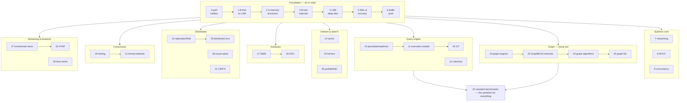

# The Plan — Database Internals Curriculum

32 topics, self-paced, deliberately diverse: storage / in-memory / query / graph /
vector / distributed / hardware topics are interleaved so it stays fun. Each topic has: why it
matters, core concepts, reference code to read, key papers, and a build+bench exercise
that also advances the **capstone** (`capstone/README.md`).

Order is a recommendation. Topics 0–6 are the foundation; after that, jump around freely.

## The map

```mermaid
flowchart TD
    subgraph FOUNDATION["Foundation — do in order"]
        direction LR
        T0["0 perf<br/>toolbox"] --> T1["1 B-tree<br/>vs LSM"] --> T2["2 in-memory<br/>structures"] --> T3["3 B-tree<br/>internals"] --> T4["4 LSM<br/>deep dive"] --> T5["5 WAL &<br/>recovery"] --> T6["6 buffer<br/>pool"]
    end
    subgraph CORE["Systems core"]
        T7["7 networking"]
        T8["8 MVCC"]
        T9["9 concurrency"]
    end
    subgraph QUERY["Query engine"]
        T10["10 parse/plan/optimize"] --> T11["11 execution models"] --> T19["19 JIT"]
        T12["12 columnar"]
    end
    subgraph GRAPH["Graph — home turf"]
        T13["13 graph engines"] --> T20["20 GraphBLAS internals"] --> T24["24 graph algorithms"] --> T25["25 graph ML"]
    end
    subgraph SEARCH["Indexes & search"]
        T14["14 vector"]
        T23["23 full-text"]
        T26["26 probabilistic"]
    end
    subgraph HW["Hardware"]
        T17["17 SIMD"] --> T18["18 GPU"]
    end
    subgraph DIST["Distributed"]
        T15["15 replication/Raft"] --> T29["29 distributed txns"]
        T28["28 cloud-native"]
        T31["31 CRDTs"]
    end
    subgraph CORRECT["Correctness"]
        T16["16 testing"] --> T21["21 formal methods"]
    end
    subgraph STREAM["Streaming & temporal"]
        T27["27 incremental views"]
        T30["30 time-series"]
        T27 --> T32["32 HTAP"]
    end
    T22["22 standard benchmarks — the yardstick for everything"]
    FOUNDATION --> CORE
    FOUNDATION --> QUERY
    FOUNDATION --> GRAPH
    FOUNDATION --> SEARCH
    FOUNDATION --> HW
    FOUNDATION --> DIST
    FOUNDATION --> CORRECT
    FOUNDATION --> STREAM
    QUERY --> T22
    GRAPH --> T22
```

---

## 0. The Performance Toolbox

**Why:** You care about performance — so learn to measure before learning to build. Everything after this topic gets benchmarked properly.

- **Concepts:** microbenchmark pitfalls (warmup, variance, coordinated omission), CPU caches & memory hierarchy, branch prediction, TLB, `perf` counters, flamegraphs, latency percentiles vs throughput, roofline thinking.
- **Read code:** `criterion.rs` internals (how it fights noise), RocksDB `db_bench`, redis `redis-benchmark.c`.
- **Papers/reading:** "Systems Performance" (Gregg) ch. 1–2; "Fair Benchmarking Considered Difficult" (DBTest '18); "How NOT to Measure Latency" (Tene talk); Drepper §3–4.
- **Build & bench:** Rust bench harness comparing `Vec` scan vs `HashMap` lookup vs `BTreeMap` across sizes; produce flamegraphs; observe cache-line effects (seq vs random access).
- **Capstone milestone M0:** scaffold the `falkordb-scratch` workspace + criterion bench harness + graph workload generator; record baseline numbers from the real falkordb-rs-next-gen to chase.

## 1. Storage Engine Landscape: B-Tree vs LSM

**Why:** The single most consequential design decision in a database. Frames everything else.

- **Concepts:** read/write/space amplification triangle (RUM conjecture), in-place vs out-of-place updates, page-oriented vs log-structured, where each engine family wins.
- **Read code:** fjall (small, clean Rust LSM), turso (`core/storage/` — SQLite-style B-tree in Rust), tidesdb (C LSM), RocksDB high-level layout.
- **Papers:** "The LSM-Tree" (O'Neil '96), "The Ubiquitous B-Tree" (Comer '79), "Designing Access Methods: The RUM Conjecture" (2016), "Architecture of a Database System" (Hellerstein/Stonebraker).
- **Build & bench:** benchmark fjall vs a raw B-tree (e.g. `redb`/sled) on write-heavy vs read-heavy vs scan workloads; explain results in terms of amplification.
- **Capstone M1:** define the storage-backend abstraction (compare with the reference's `graph/src/storage/backend.rs` *after* designing yours) — in-memory first, persistent backends swap in later.

## 2. In-Memory Structures: Hash Tables, Skip Lists, Tries

**Why:** Redis's dict and FalkorDB's core structures — the workhorses of every in-memory DB.

- **Concepts:** open addressing vs chaining, incremental rehashing (redis), SwissTable/SIMD probing (hashbrown), skip lists (why LSM memtables use them), radix trees / ART, cache-conscious layout.
- **Read code:** redis `dict.c` (incremental rehash!) + valkey's changes, redis `t_zset.c` (skiplist), hashbrown, RocksDB `memtable/` (concurrent skiplist), redis `rax.c` (radix tree).
- **Papers:** "The Adaptive Radix Tree" (Leis ICDE'13), Google SwissTable talk (CppCon 2017).
- **Build & bench:** implement a skip list and an incremental-rehash hash table in Rust; bench vs `hashbrown` and `crossbeam-skiplist`; measure rehash latency spikes vs redis-style incremental approach.
- **Capstone M2:** attribute store + string pool + node/edge ID datablocks (hash index + interning) — the reference's `attribute_store.rs`/`string_pool.rs`, your way.

## 3. B-Tree Internals & Paged Storage

**Why:** SQLite/Postgres/LMDB/most-embedded-DBs. Pages are how disks think.

- **Concepts:** slotted pages, node splits/merges, B+tree vs B-tree, prefix compression, copy-on-write B-trees (LMDB), overflow pages, page checksums, varint encoding.
- **Read code:** turso `core/storage/btree.rs` + pager (Rust re-implementation of SQLite — ideal), SQLite `btree.c` (the classic), LMDB `mdb.c` (COW).
- **Papers:** "Modern B-Tree Techniques" (Graefe — the survey), SQLite file-format doc.
- **Build & bench:** implement a slotted-page disk B+tree in Rust (fixed 4KB pages); bench point lookups & range scans vs `redb`; try prefix truncation and measure.
- **Capstone M3:** disk-backed B+tree backend for properties + range indexes behind the storage abstraction.

## 4. LSM-Tree Deep Dive

**Why:** RocksDB powers half the industry (including graph DBs like TiKV-based ones). Compaction is a fascinating scheduling problem.

- **Concepts:** memtable→SST lifecycle, leveled vs tiered vs FIFO compaction, bloom filters (and Monkey's optimal allocation), fractional cascading, compaction debt/write stalls, SST formats & block cache.
- **Read code:** fjall (read it ALL — it's small), RocksDB `db/compaction/`, `table/block_based/`.
- **Papers:** "Monkey: Optimal Navigable Key-Value Store" (SIGMOD'17), "Dostoevsky" (SIGMOD'18), RocksDB paper (TODS'21), "Constructing and Analyzing the LSM Compaction Design Space" (VLDB'21).
- **Build & bench:** implement a mini-LSM (memtable + SSTs + leveled compaction + bloom filters) — optionally follow skyzh/mini-lsm course; measure write amp with different compaction strategies.
- **Capstone M4:** LSM-backed alternative persistence (graph snapshots as SSTs); benchmark B+tree vs LSM backends on graph mutation + bulk-load workloads.

## 5. Durability: WAL, fsync, Crash Recovery

**Why:** The hardest part to get right. Where correctness meets performance.

- **Concepts:** write-ahead logging, ARIES (redo/undo, LSNs, fuzzy checkpoints), group commit, fsync vs fdatasync vs O_DIRECT, torn pages (full-page writes / double-write buffer), io_uring.
- **Read code:** postgres `xlog.c` (skim, it's huge), turso WAL, redis AOF (`aof.c`) vs RDB, RocksDB WAL.
- **Papers:** "ARIES" (Mohan '92 — read a summary first, then the paper), "Scalability of write-ahead logging on multicore" (Aether, VLDB'10).
- **Build & bench:** add WAL + crash recovery to your B+tree; write a crash-injection test (kill -9 mid-write, verify recovery); bench fsync-per-commit vs group commit vs O_DIRECT.
- **Capstone M5:** WAL + crash recovery for graph mutations (contrast with FalkorDB's reliance on redis RDB/AOF); crash-injection test suite.

## 6. Buffer Pool & Memory Management

**Why:** mmap-vs-buffer-pool is one of the great debates; allocation strategy dominates in-memory DB performance.

- **Concepts:** buffer pool design, eviction (LRU, CLOCK, LRU-K, 2Q), pointer swizzling (LeanStore), why mmap is (usually) wrong for DBs, jemalloc/arena allocation, NUMA.
- **Read code:** postgres `bufmgr.c` + CLOCK sweep, redis `zmalloc.c`, DuckDB buffer manager, LeanStore (C++).
- **Papers:** "Are You Sure You Want to Use MMAP in Your DBMS?" (CIDR'22), "LeanStore" (ICDE'18), "Virtual-Memory Assisted Buffer Management" (vmcache, SIGMOD'23).
- **Build & bench:** build a buffer pool (CLOCK) for the B+tree; bench vs mmap on datasets larger than RAM; reproduce mmap's write-back unpredictability.
- **Capstone M6:** buffer pool under the persistent backends — graphs larger than RAM.

## 7. Networking, Protocols & Event Loops

**Why:** Redis's speed is as much about the event loop and RESP as about data structures. You know the module side of FalkorDB; own the server side.

- **Concepts:** RESP2/RESP3 design (why so parseable), event loops (ae.c) vs thread-per-core vs async, pipelining, io-threads in redis/valkey, pgwire protocol, neo4j's Bolt protocol (versioned handshake, PackStream binary serialization, explicit result streaming via PULL/DISCARD + cursors) — RESP vs pgwire vs Bolt as three answers to framing/typing/streaming, backpressure.
- **Read code:** redis `ae.c` + `networking.c`, valkey's io-threads rework (great perf PRs to study), `pgwire` (Rust crate), qdrant's gRPC/tonic setup, FalkorDB's own `src/bolt/` (it already speaks Bolt — reread it with server-side eyes).
- **Papers/reading:** "The C10K problem", valkey blog posts on multithreading perf, Glauber Costa on thread-per-core, Bolt Protocol + PackStream specifications (neo4j docs).
- **Build & bench:** implement a RESP server in Rust (tokio) speaking GET/SET; bench with `redis-benchmark` and `memtier_benchmark` against real redis; find your bottleneck with flamegraphs.
- **Capstone M7:** RESP server exposing `GRAPH.QUERY`/`GRAPH.RO_QUERY` — wire-compatible with existing FalkorDB clients; bench with falkordb-py against the real thing. Stretch: a Bolt listener on a second port so neo4j drivers connect too (PackStream encoding of the graph result types).

## 8. Transactions & MVCC

**Why:** The intellectual core of OLTP. Postgres MVCC vs in-memory designs is a masterclass in trade-offs.

- **Concepts:** ACID, isolation levels & anomalies (read this twice), 2PL vs OCC vs MVCC, snapshot isolation & write skew, SSI, postgres tuple versioning + vacuum, HOT updates, timestamp ordering, Hekaton-style MVCC.
- **Read code:** postgres `heapam.c` + visibility rules (`HeapTupleSatisfiesMVCC`), surrealdb transaction layer, RocksDB `utilities/transactions/`.
- **Papers:** "A Critique of ANSI SQL Isolation Levels" (Berenson '95), "Serializable Snapshot Isolation in PostgreSQL" (VLDB'12), "An Empirical Evaluation of In-Memory MVCC" (Wu/Pavlo VLDB'17), "Hekaton" (SIGMOD'13).
- **Build & bench:** implement MVCC with snapshot isolation over your KV engine; write tests that demonstrate (and then prevent) write skew; bench txn throughput vs a single global lock.
- **Capstone M8:** MVCC graph — copy-on-write + versioned reads (design yours, then study the reference's `mvcc_graph.rs`/`cow.rs`).

## 9. Concurrency: Latches, Lock-Free & Epochs

**Why:** Scaling a storage engine across cores is where the hardest bugs and biggest wins live.

- **Concepts:** latches vs locks, lock coupling / optimistic lock coupling, lock-free structures & memory reclamation (epochs, hazard pointers), Bw-Tree, atomics & memory ordering in Rust, contention profiling.
- **Read code:** crossbeam-epoch, RocksDB concurrent memtable inserts, memgraph skip-list, postgres lwlock.c.
- **Papers:** "The Bw-Tree" (ICDE'13) + "Building a Bw-Tree Takes More Than Just Buzz Words" (SIGMOD'18 — the reality check), "Optimistic Lock Coupling" (Leis).
- **Build & bench:** make your skip list concurrent (epoch reclamation); bench scaling 1→16 threads; compare mutex-sharded vs lock-free; measure with `perf c2c` for false sharing.
- **Capstone M9:** threadpool + concurrent readers with single writer; parallel query execution (compare with the reference's `threadpool.rs` design).

## 10. Query Engines I: Parsing, Planning, Optimization

**Why:** The optimizer is the database's brain. Directly relevant to Cypher planning in FalkorDB.

- **Concepts:** logical vs physical plans, relational algebra rewrites (predicate pushdown, join reordering), cost models & cardinality estimation (where it all goes wrong), dynamic programming join ordering, Cascades framework.
- **Read code:** DuckDB `src/optimizer/` (readable!), postgres `optimizer/` (join search), sqlparser-rs, datafusion optimizer, polars lazy-frame optimizer (`crates/polars-plan/`).
- **Papers:** "Access Path Selection" (Selinger '79 — the founding paper), "How Good Are Query Optimizers, Really?" (VLDB'15 — humbling), "The Cascades Framework" (Graefe '95).
- **Build & bench:** write a mini planner: parse SQL subset → logical plan → apply pushdown + join reordering; verify plans change with table sizes; compare against DuckDB's `EXPLAIN`.
- **Capstone M10:** Cypher-subset parser + binder + logical plan tree + rewrite rules (the reference's `parser/` + `planner/` — including its optimizer dir — are your after-the-fact mirror).

## 11. Query Engines II: Execution Models

**Why:** Volcano vs vectorized vs compiled — the defining performance battle of modern analytics.

- **Concepts:** iterator (Volcano) model, vectorized execution (X100/DuckDB), query compilation (HyPer), morsel-driven parallelism, hash joins & aggregation internals, SIMD in query processing.
- **Read code:** DuckDB `src/execution/` (vectors, pipelines), polars streaming engine + SIMD compute kernels (`crates/polars-compute/`), datafusion (Arrow-based), postgres `executor/` (classic Volcano).
- **Papers:** "MonetDB/X100: Hyper-Pipelining Query Execution" (CIDR'05), "Everything You Always Wanted to Know About Compiled and Vectorized Queries" (VLDB'18), "Morsel-Driven Parallelism" (SIGMOD'14).
- **Build & bench:** implement the same aggregation query (scan+filter+group-by) three ways: tuple-at-a-time, vectorized (1024-row batches), and with SIMD; bench — the gap is the whole lesson.
- **Capstone M11:** vectorized runtime: batched rows + operator pipeline + expression eval (mirror of `runtime/batch.rs`, `vectorized.rs`, `eval.rs`).

## 12. Columnar Storage & Analytics

**Why:** DuckDB/ClickHouse-style OLAP. Compression IS performance here.

- **Concepts:** row vs column layout, encodings (RLE, dictionary, bit-packing, delta, FSST for strings), zone maps / min-max pruning, Parquet & Arrow formats, late materialization, columnar-store architectures compared: ClickHouse MergeTree (LSM-flavored parts + sparse primary index, materialized views) vs DuckDB (embedded, single-file) vs real-time OLAP (Pinot/Druid ingest-time indexing).
- **Read code:** DuckDB `src/storage/compression/`, ClickHouse `MergeTree/` (parts, granules, sparse index — pick narrow slices), polars (Arrow memory layout in practice), arrow-rs, parquet-rs.
- **Papers:** "C-Store" (VLDB'05), "Integrating Compression and Execution in Column-Oriented Database Systems" (SIGMOD'06), "BtrBlocks" (SIGMOD'23), "FSST" (VLDB'20), "ClickHouse: Lightning Fast Analytics for Everyone" (VLDB'24).
- **Build & bench:** implement RLE + dictionary + bit-packing encoders; bench scan speed on encoded vs raw data (decompression can be *faster* than reading raw — verify); run ClickBench queries on DuckDB and profile.
- **Capstone M12:** columnar attribute storage + zone-map pruning for property filters.

## 13. Graph Engines (Home Turf, Deeper)

**Why:** Compare FalkorDB's sparse-matrix approach against the alternatives you compete with — with benchmarks.

- **Concepts:** adjacency representations (CSR/CSC, adjacency lists, sparse matrices/GraphBLAS), neo4j's fixed-size record store + pointer chasing, memgraph's in-memory skip-list store, BFS as SpMV, worst-case optimal joins for pattern matching, LDBC benchmarks; **the query-language landscape**: Cypher/openCypher vs GQL (ISO/IEC 39075:2024 — the first new ISO database language since SQL) vs SQL/PGQ (property graphs *inside* SQL) vs SPARQL over RDF vs Gremlin vs Datalog — data models (property graph vs triples: where do edge properties go in RDF? reification/RDF-star), pattern-matching semantics (homomorphism vs isomorphism vs trail — same query, different answers!), path objects & quantified path patterns, composability (can a query's output feed another query — Cypher's weakness, Datalog's strength), and what each language lets the planner push down.
- **Read code:** SuiteSparse:GraphBLAS internals (you know the API — go deeper into masks/complement handling), neo4j record format (`kernel/impl/store/`), memgraph `storage/v2/`, kuzu (WCOJ + columnar graph — very relevant), FalkorDB's Cypher grammar vs the openCypher grammar spec (what's missing/extra).
- **Papers:** "GraphBLAS: SuiteSparse" (Davis, TOMS), "Kùzu: A Database Management System For 'Beyond Relational' Workloads" (CIDR'23), "EmptyHeaded" (worst-case optimal joins on graphs), LDBC SNB spec, "Graph Pattern Matching in GQL and SQL/PGQ" (SIGMOD'22), "G-CORE: A Core for Future Graph Query Languages" (SIGMOD'18), the GQL standard overview (gqlstandards.org / Deutsch et al.).
- **Build & bench:** implement 2-hop neighborhood query over CSR vs adjacency-list vs GrB sparse matrix; bench on LDBC-scale data; compare with FalkorDB and neo4j on the same query; write the same three queries (filtered 2-hop, shortest path, group-by aggregation) in Cypher, GQL, SPARQL, and Gremlin — note where the language forces a different plan (path semantics, lack of pushdown) rather than just different syntax.
- **Capstone M13:** first graph core: adjacency-list/CSR node+edge store with basic pattern matching — the deliberately-naive baseline that M20's sparse-matrix core will replace (and be measured against). Language-wise: target openCypher now, but keep the AST GQL-shaped (quantified path patterns as first-class) so M10's parser doesn't need a rewrite when GQL compatibility matters.

## 14. Vector Search

**Why:** qdrant/helix-db territory; every DB is adding this. Beautiful algorithms, very benchmarkable.

- **Concepts:** ANN problem & recall/latency trade-off, HNSW (and its memory hunger), IVF, product quantization, scalar/binary quantization, DiskANN/Vamana for on-disk, filtered search (the hard part — qdrant's specialty).
- **Read code:** qdrant `lib/segment/` (HNSW + filtering + quantization), helix-db vector side, usearch (compact HNSW).
- **Papers:** "HNSW" (arXiv:1603.09320), "Product Quantization" (Jégou PAMI'11), "DiskANN" (NeurIPS'19), qdrant blog on filtered HNSW.
- **Build & bench:** implement HNSW in Rust from the paper; measure recall@10 vs QPS curves against qdrant on ann-benchmarks datasets (sift-1m); add scalar quantization, re-measure.
- **Capstone M14:** vector index on node properties + distance kernels (the reference's `vec_distance.rs` territory).

## 15. Replication, Consensus & Distribution

**Why:** From single node to system. Raft is table stakes; the interesting part is what each DB does differently.

- **Concepts:** replication topologies (leader/follower, async vs sync), redis/valkey replication + failover, Raft (leader election, log replication, snapshots, membership), consistency models (linearizability → eventual), sharding (hash slots vs ranges).
- **Read code:** valkey `replication.c` + cluster, qdrant raft-based consensus (`consensus/`), openraft or tikv/raft-rs, surrealdb+tikv layering.
- **Papers:** "In Search of an Understandable Consensus Algorithm" (Raft, ATC'14), "ZooKeeper" or "Viewstamped Replication Revisited" (for contrast), Kleppmann DDIA ch. 5, 8, 9 (read thoroughly).
- **Build & bench:** implement Raft leader election + log replication (or work through the raft-rs / talent-plan labs); inject partitions and observe; measure replication-lag impact of fsync policies.
- **Capstone M15:** ship the WAL to a follower node; then upgrade to Raft.

## 16. Testing & Correctness Engineering

**Why:** The topic that separates hobby DBs from production DBs. Turso and FoundationDB made this their identity.

- **Concepts:** deterministic simulation testing (DST), fault injection, property-based testing (proptest), fuzzing (cargo-fuzz/AFL), metamorphic testing (SQLancer's pivoted queries / TLP), Jepsen & elle (checking linearizability), model checking with TLA+ (taste of), SMT solvers (Z3): proving query rewrites equivalent (Cosette-style), checking optimizer rules and constraint/invariant satisfiability.
- **Read code:** turso's simulator + DST setup (they blog about it), FoundationDB simulation docs, SQLancer, antithesis blog posts, redis `test/` harness, Z3 (`z3.rs` bindings; skim the tactic/solver architecture — treat Z3 itself as a masterclass codebase: it's a high-performance search engine over logic).
- **Papers:** "Testing Database Engines via Pivoted Query Synthesis" (OSDI'20), "Finding Logic Bugs via TLP" (OOPSLA'20), Jepsen analyses (pick redis-raft and a graph DB one), "Z3: An Efficient SMT Solver" (TACAS'08), "Cosette: An Automated Prover for SQL" (CIDR'17).
- **Build & bench:** add proptest model-checking to the capstone (graph ops vs an in-memory model oracle); build a mini DST harness (simulated clock + fault-injecting IO layer); fuzz your parsers (Cypher + page/SST decoders); use Z3 to verify two of your topic-10 rewrite rules are equivalent (and to find a counterexample when you break one on purpose).
- **Capstone M16:** openCypher TCK subset runner as the correctness oracle + DST harness + fuzzers (the reference's `fuzz/` and `tck_done.txt` show the bar). Graduation of the correctness spine.

## 17. SIMD & Hardware-Conscious Data Processing

**Why:** The last 10x on a single core. Touched in topic 11 — this is the dedicated deep dive: writing kernels that saturate the CPU.

- **Concepts:** SIMD fundamentals (AVX2/AVX-512 vs ARM NEON/SVE — know both, you're on ARM), autovectorization and why it fails, Rust portable SIMD (`std::simd`) vs intrinsics, branchless selection (masks + compress), SIMD hash probing (SwissTable), SIMD string parsing/comparison, bit-packed decoding at SIMD speed (FastLanes), gather/scatter costs, instruction-level parallelism & dependency chains, Mojo's SIMD-first design (`SIMD[type, width]` as a first-class parametric type — compare its ergonomics vs `std::simd` and intrinsics).
- **Read code:** polars `crates/polars-compute/` kernels, simdjson (the masterclass — read with the paper), hashbrown SIMD group probing, DuckDB compressed-scan kernels, usearch/SimSIMD distance functions, memchr crate, Mojo stdlib + Modular's matmul optimization blog series.
- **Papers:** "Rethinking SIMD Vectorization for In-Memory Databases" (SIGMOD'15), "Parsing Gigabytes of JSON per Second" (simdjson, VLDB'19), "The FastLanes Compression Layout" (VLDB'23).
- **Build & bench:** write filter-selection and dot-product kernels four ways: naive scalar, autovectorized, `std::simd`, NEON intrinsics; bench with `perf stat` (IPC, vector-lane utilization); then SIMD-ize a bit-packing decoder and compare against topic 12's scalar version; port one kernel to Mojo and compare both the numbers and the code you had to write.
- **Capstone M17:** SIMD-accelerated kernels in the vectorized runtime + vector-distance functions; keep scalar fallbacks and a bench comparing them.

## 18. GPU Acceleration for Databases

**Why:** GPUs are reshaping analytics, graph algorithms, and vector search — directly relevant to FalkorDB's future (GraphBLAS on GPU exists). Learn when the PCIe tax is worth paying.

- **Concepts:** GPU architecture for DB people (SIMT, warps, occupancy, memory coalescing, shared memory), the data-transfer bottleneck (PCIe vs NVLink vs unified memory on Apple Silicon), GPU hash joins & aggregation, GPU graph processing (Gunrock, cuGraph, GraphBLAST — SpMV on GPU!), GPU vector search (Faiss GPU, cuVS/CAGRA), programming models: CUDA vs Metal vs wgpu/WebGPU (portable, works on your Mac) vs Mojo/MLIR (one language targeting CPU SIMD *and* GPU — the portability bet worth understanding).
- **Read code:** cuVS/RAFT (vector search kernels), libcudf (GPU columnar ops), Gunrock or GraphBLAST (graph frontier expansion), cuGraph/pygraphistry (RAPIDS' production graph analytics + GPU ETL/visualization layer over cuDF/cuGraph), HeavyDB query compilation to GPU, Rust: `wgpu` compute examples, `cudarc`.
- **Papers:** "A Study of the Fundamental Performance Characteristics of GPUs and CPUs for Database Analytics" (Crystal, SIGMOD'20), "Billion-scale similarity search with GPUs" (Faiss, arXiv:1702.08734), "Gunrock" (PPoPP'16), "CAGRA: Highly Parallel Graph Construction for GPU ANN" (ICDE'24).
- **Build & bench:** implement filter+aggregate and batch vector-distance as wgpu compute shaders (runs on Apple Silicon Metal); bench vs your topic-17 SIMD kernels *including transfer time* — find the crossover batch size where GPU wins; run BFS via SpMV on GPU vs SuiteSparse CPU.
- **Capstone M18:** experimental GPU backend for one hot path (SpMV traversal or vector distance scoring) behind a feature flag, with CPU-vs-GPU crossover benchmark.

## 19. JIT & Query Compilation

**Why:** The other answer to interpretation overhead (vs vectorization, topic 11). HyPer/Umbra made it famous; SQLite has quietly used a bytecode VM forever; SuiteSparse:GraphBLAS JIT-compiles kernels.

- **Concepts:** interpreter → bytecode VM → native JIT spectrum, SQLite's VDBE, produce/consume compilation model (HyPer), compilation latency vs execution speed (why Umbra built its own IR — "Tidy Tuples"), copy-and-patch compilation, adaptive execution (start interpreting, JIT when hot), LLVM vs cranelift vs hand-rolled backends, expression JIT vs whole-pipeline JIT, postgres's LLVM JIT (and why it's often a regression).
- **Read code:** SQLite `vdbe.c` (bytecode design), postgres `src/backend/jit/llvm/`, cranelift-jit examples, SuiteSparse:GraphBLAS JIT kernel generation (`Source/jit*`), DuckDB's *absence* of a JIT (find the discussions — vectorization as the counter-argument).
- **Papers:** "Efficiently Compiling Efficient Query Plans for Modern Hardware" (Neumann, VLDB'11 — the paper), "Tidy Tuples and Flying Start" (Umbra, VLDBJ'21), "Copy-and-Patch Compilation" (OOPSLA'21), "Adaptive Execution of Compiled Queries" (ICDE'18), "Everything You Always Wanted to Know About Compiled and Vectorized Queries" (VLDB'18 — re-read after topic 11).
- **Build & bench:** JIT-compile filter expressions with cranelift; three-way bench: AST-walking interpreter vs vectorized (topic 11 kernel) vs JIT — including compile time; find the query length/selectivity crossover where each wins.
- **Capstone M19:** cranelift JIT for Cypher expressions (vs the `eval.rs`-style interpreter) with fallback and a compile-time budget heuristic.

## 20. Sparse Linear Algebra & GraphBLAS Internals (Deep Home Turf)

**Why:** You use the GraphBLAS API daily in FalkorDB — this topic is about owning what's *underneath*: the kernels, formats, and scheduling decisions SuiteSparse makes for you.

- **Concepts:** sparse formats and when SuiteSparse switches between them (CSR/CSC, bitmap, full, hypersparse), SpMV vs SpMSpV, SpGEMM algorithms (Gustavson, hash-based, heap-based), masks/accumulators/semirings as an execution model, push vs pull BFS = SpMV vs masked SpMSpV (direction-optimizing), non-blocking mode & lazy evaluation, FalkorDB's delta-matrix pattern, JIT'd kernels (ties to topic 19), GPU GraphBLAS (ties to topic 18), **how SuiteSparse parallelizes: OpenMP** (saxpy3's coarse/fine task scheduling, `#pragma omp parallel for` static vs dynamic/guided loops, nthreads heuristics from flop counts) **and the Rust alternatives**: rayon work-stealing vs OpenMP static scheduling (irregular nnz-per-row is exactly where the difference shows), `std::thread::scope`, morsel-driven scheduling built by hand (topic 11) — note there is no mature native-Rust GraphBLAS: the crates (`rustgraphblas`, `graphblas_sparse_linear_algebra`) are FFI bindings to SuiteSparse, so a Rust rebuild must bring its own parallel runtime.
- **Read code:** SuiteSparse:GraphBLAS internals — format-switch heuristics, `GB_AxB_*` SpGEMM variants, mask handling, the OpenMP scheduling in `GB_AxB_saxpy3` (how nthreads/ntasks are derived from the flopcount pre-pass); LAGraph algorithm implementations (BFS, triangle counting, PageRank); FalkorDB's own delta-matrix layer with fresh eyes; rayon internals (join/scope, work-stealing deques) as the OpenMP counterpart.
- **Papers:** Davis "Algorithm 1000: SuiteSparse:GraphBLAS" (TOMS'19) + the v2 update (TOMS'23), Gustavson '78 (two-pointer SpGEMM), Buluç & Gilbert SpGEMM survey, Beamer "Direction-Optimizing BFS" (SC'12), GraphBLAS C API spec (read cover to cover once).
- **Build & bench:** implement CSR SpMV and Gustavson SpGEMM in Rust; parallelize both with rayon and bench scaling 1→N cores against SuiteSparse's OpenMP on the same matrices (SuiteSparse Matrix Collection) — measure where work-stealing beats/loses to static row partitioning on skewed (RMAT) vs uniform matrices; implement direction-optimizing BFS with masks; measure where hypersparse representation pays off.
- **Capstone M20:** the heart: your own sparse-matrix/GraphBLAS-subset kernels + delta matrices replace the M13 adjacency-list core; parallelism via rayon (document the OpenMP→rayon mapping decisions); benchmark both on LDBC queries, and against the reference's `graph/src/graph/graphblas` layer.

## 21. Formal Methods & Verification

**Why:** Testing (topic 16) finds bugs you imagined; formal methods find the ones you didn't. AWS, MongoDB, and CockroachDB all spec their protocols in TLA+. Also: e-graphs are quietly powering modern query optimizers.

- **Concepts:** SAT → SMT (DPLL(T), theories), Z3's architecture (tactics, e-matching, the congruence closure e-graph), TLA+ & PlusCal (specify, then let TLC model-check), safety vs liveness, refinement, equality saturation with e-graphs (egg) for rewrite-rule optimizers, lightweight formal methods (spec only the scary parts), protocol testing languages (P, Ivy) as a lighter alternative, theorem proving with Lean 4 (proofs vs model checking — and Lean's runtime itself: Perceus reference counting, functional-but-in-place updates, a systems-performance story in its own right).
- **Read code:** Z3 internals (`src/smt/`, the e-graph — a high-performance search engine over logic), egg (Rust equality saturation — read fully, it's small), published TLA+ specs: Raft (Ongaro's), MongoDB replication, CockroachDB's specs repo, Lean 4 (`leanprover/lean4` — the compiler/runtime in `src/runtime/`, and how mathlib scales proof search).
- **Papers:** "How Amazon Web Services Uses Formal Methods" (CACM'15 — the motivation paper), "egg: Fast and Extensible Equality Saturation" (POPL'21), "Z3: An Efficient SMT Solver" (TACAS'08), Lamport's "Specifying Systems" (part I) + the TLA+ video course, "Cosette" (CIDR'17 — revisit from topic 16), "Counting Immutable Beans" + "Perceus: Garbage-Free Reference Counting" (the Lean/Koka runtime papers).
- **Build & bench:** write a TLA+ spec of the capstone's WAL-replication protocol (topic 15) and model-check it — then remove an ack and watch TLC find the data-loss trace; build an expression-rewrite pass with egg and compare plans vs your hand-ordered rules from topic 10; in Lean 4, formalize and prove a small invariant (e.g., your B+tree ordering property or a delta-matrix merge property) — taste the proof-vs-test trade-off.
- **Capstone M21:** TLA+ spec of the MVCC visibility rules (or replication) checked by TLC in CI; Lean proof of a delta-matrix invariant; optional egg-based rewrite stage in the planner.

## 22. Standard Benchmarks: TPC-H, TPC-C, YCSB, LDBC & Friends

**Why:** The industry's shared yardsticks — and their hidden messages. Knowing *what each query actually stresses* turns benchmarks from marketing into engineering tools.

- **Concepts:** OLTP vs OLAP benchmark design, TPC-C (contention, think times, and why nobody runs it honestly), TPC-H choke-point analysis (which of the 22 queries stress joins vs aggregation vs expression eval), TPC-DS, Join Order Benchmark (JOB — real data, real cardinality pain), SSB, YCSB workloads A–F & Zipfian skew, LDBC SNB + Graphalytics (graph), ann-benchmarks (vector), ClickBench, fair-benchmarking methodology & benchmarketing sins, scale factors and data generators.
- **Read code/run:** DuckDB's built-in TPC-H/TPC-DS extensions, BenchBase (CMU), HammerDB, `dbgen`/`dsdgen`, LDBC SNB datagen + driver, go-ycsb/memtier.
- **Papers:** "TPC-H Analyzed: Hidden Messages and Lessons Learned" (Boncz — the choke-point paper, read alongside running it), "Fair Benchmarking Considered Difficult" (DBTest'18), "OLTP-Bench" (VLDB'13), "How Good Are Query Optimizers, Really?" (VLDB'15 — the JOB paper, revisit), LDBC SNB paper.
- **Build & bench:** run TPC-H SF10 on DuckDB and postgres, profile three choke-point queries and explain the gap; run YCSB against redis and your topic-7 RESP server; run LDBC SNB interactive on FalkorDB vs neo4j and analyze where each wins.
- **Capstone M22:** standing benchmark suite — LDBC SNB interactive, graph micro-benches, ann-benchmarks recall/QPS — with regression tracking across milestones, and a three-way shootout: `falkordb-scratch` vs falkordb-rs-next-gen vs FalkorDB.

## 23. Full-Text Search & Inverted Indexes (Elasticsearch / Lucene / tantivy)

**Why:** The third great index family after trees and hash tables. Lucene is a 25-year masterclass, tantivy is its readable Rust rival, and RediSearch is home turf.

- **Concepts:** inverted index anatomy (term dictionary, posting lists), text analysis pipelines (tokenizers, stemming), posting-list compression (varint, bit-packing, roaring bitmaps), FSTs for term dictionaries, BM25 scoring, top-k retrieval with WAND / block-max WAND, Lucene's LSM-like segment architecture + merge policies (compare with topic 4!), doc values (Lucene's columnar side), Elasticsearch distribution layer (shards, scatter-gather, relevance vs recall), hybrid search (BM25 + vectors, reciprocal rank fusion — ties to topic 14).
- **Read code:** tantivy (Rust, the best read — postings, FST dictionary, block-max WAND), Lucene core (`codecs/`, segment merging), RediSearch (redis-module perspective you know), quickwit (tantivy over object storage), Elasticsearch mostly at the architecture-docs level.
- **Papers:** "Inverted Files for Text Search Engines" (Zobel & Moffat, CSUR'06 — the survey), BM25 origins (Robertson & Zaragoza "The Probabilistic Relevance Framework"), "Faster Top-k Document Retrieval Using Block-Max Indexes" (SIGIR'11), "Roaring Bitmaps" (arXiv:1603.06549).
- **Build & bench:** build a mini inverted index in Rust: tokenize → posting lists → BM25 → top-k with block-max WAND; bench vs tantivy on a Wikipedia dump; compare roaring vs raw-vec posting lists for AND/OR queries.
- **Capstone M23:** full-text index on node/edge properties + hybrid search fusing BM25 with the M14 vector index (RRF) — what FalkorDB delegates to RediSearch, built in.

## 24. Advanced Graph Algorithms & Analytics

**Why:** Traversal (topic 13/20) is table stakes; the value is in analytics — centrality, communities, components — and in knowing when the algebraic (LAGraph) formulation beats the frontier-based one.

- **Concepts:** SSSP (delta-stepping), betweenness centrality (Brandes; batched algebraic variant), PageRank (and convergence tricks), connected components (label propagation, Afforest), community detection (Louvain → Leiden, and why Louvain's communities can be broken), triangle counting & k-truss (masked SpGEMM!), push vs pull direction switching (Ligra), algebraic vs frontier formulations trade-offs, the GAP benchmark suite as the yardstick.
- **Read code:** LAGraph (the algorithm collection over GraphBLAS — study how each algorithm maps to masks/semirings; you have `lagraph_lib` in the reference repo already), GAP benchmark reference implementations, Ligra.
- **Papers:** "A Faster Algorithm for Betweenness Centrality" (Brandes '01), "From Louvain to Leiden" (Sci. Reports '19), "Ligra: A Lightweight Graph Processing Framework" (PPoPP'13), "The GAP Benchmark Suite" (arXiv:1508.03619), "Delta-Stepping" (Meyer & Sanders), Azad & Buluç masked-SpGEMM triangle counting.
- **Build & bench:** implement Brandes betweenness and Leiden in Rust over your M20 sparse core; compare against LAGraph on the same matrices (note LAGraph's parallelism is also OpenMP — your rayon-based kernels from topic 20 carry over here); run the GAP suite (BFS, SSSP, PR, CC, BC, TC) and profile where the algebraic formulation wins/loses vs frontier-based.
- **Capstone M24:** LAGraph-style algorithm library over the sparse core, exposed as Cypher procedures (`CALL algo.pagerank(...)` — FalkorDB-style).

## 25. Graph Neural Networks & Graph ML

**Why:** Message passing *is* SpMM over a semiring — your GraphBLAS core is already a GNN engine waiting to happen. And GraphRAG (which you know from GraphRAG-SDK) is pulling graph DBs into the ML serving path.

- **Concepts:** node embeddings (DeepWalk, node2vec — random walks + skip-gram), message passing as generalized SpMM, GCN / GraphSAGE / GAT (and what each adds), mini-batch neighbor sampling for graphs that don't fit (GraphSAGE's real contribution), knowledge-graph embeddings (TransE family), GNN systems view: how PyG/DGL kernels map to sparse ops, embeddings-in-the-database (compute → store in vector index → hybrid query), GraphRAG architectures.
- **Read code:** DGL / PyTorch Geometric sparse kernels (the SpMM/SDDMM ops underneath), candle or burn (Rust ML — for implementing), your own GraphRAG-SDK with fresh systems eyes.
- **Papers:** "node2vec" (KDD'16), "Semi-Supervised Classification with GCNs" (Kipf & Welling, ICLR'17), "Inductive Representation Learning on Large Graphs" (GraphSAGE, NeurIPS'17), "Graph Attention Networks" (ICLR'18), "TransE" (NeurIPS'13), "Graph Neural Networks meet Databases" survey (pick a recent arXiv one when starting).
- **Build & bench:** implement node2vec and a 2-layer GCN in Rust (candle/burn) using your own M20 SpMM as the aggregation kernel; train on Cora and ogbn-arxiv; bench your SpMM against DGL's on the same graphs; store the learned embeddings in your M14 vector index and measure end-to-end hybrid query latency.
- **Capstone M25:** embeddings pipeline — compute node2vec/GCN embeddings with your own kernels, store them in the vector index, and answer GraphRAG-style hybrid queries (pattern match + semantic similarity) in one Cypher query.

## 26. Indexing & Probabilistic Data Structures

**Why:** Indexes are bets — you pay write amplification for read speed. And the probabilistic structures (bloom filters, HLL — redis's PFCOUNT is one) buy huge wins by being *slightly wrong*.

- **Concepts:** secondary index design and its write cost, composite/covering indexes & index-only scans, hash vs B-tree vs bitmap vs BRIN (≈ zone maps), partial & expression indexes, index maintenance under MVCC (postgres HOT, index bloat), index selection ("what-if" analysis), **learned indexes** (RMI, ALEX, PGM — do they survive contact with updates?); **spatial/geo indexes**: R-tree & R*-tree (bounding-box hierarchy, node splits), quadtrees & kd-trees, space-filling curves that turn 2-D into a 1-D B-tree problem (Z-order/geohash, Hilbert — and why Hilbert clusters better), S2/H3 cell coverings, redis GEO (a 52-bit geohash stuffed into a zset — indexes-you-already-have reuse), postgres GiST/SP-GiST as the *extensible* index framework spatial rides on (nearest-neighbor via priority-queue traversal); **compressed bitmaps**: roaring internals (array/bitmap/run containers, galloping intersection), WAH/EWAH ancestry, SIMD-accelerated set operations, where they power real systems (Lucene doc sets, ClickHouse, Druid, Pilosa); succinct structures (rank/select, Elias-Fano encoding of sorted IDs — postings and adjacency lists both); probabilistic filters: bloom filter math (FPR vs bits/key), blocked bloom (cache-line friendly), cuckoo, xor, ribbon filters (RocksDB's evolution); sketches: HyperLogLog (dense/sparse), count-min, t-digest, top-k.
- **Read code:** postgres index access methods (`nbtree/`, `gin/`, `brin/`, `gist/` + PostGIS's R-tree-over-GiST), redis `geo.c`/`geohash.c` (the zset trick end-to-end), s2geometry or h3 (cell covering APIs), RocksDB `util/bloom*` + ribbon filter, redis `hyperloglog.c` (the dense/sparse encoding dance — a classic), RedisBloom module, CRoaring + roaring-rs (container switching, SIMD intersections), Lucene `RoaringDocIdSet`, PGM-index and ALEX repos.
- **Papers:** "The Case for Learned Index Structures" (SIGMOD'18), "ALEX" (SIGMOD'20), "The PGM-index" (VLDB'20), "R-trees: A Dynamic Index Structure for Spatial Searching" (Guttman, SIGMOD'84), "The R*-tree" (SIGMOD'90), "Better bitmap performance with Roaring bitmaps" (SPE'16) + "Roaring Bitmaps: Implementation of an Optimized Software Library" (SPE'18), "Cuckoo Filter: Practically Better Than Bloom" (CoNEXT'14), "Xor Filters" (JEA'20), "Ribbon Filter" (arXiv:2103.02515), "HyperLogLog in Practice" (Google, EDBT'13).
- **Build & bench:** implement a mini roaring bitmap (three container types + adaptive switching) and bench intersect/union vs `roaring-rs` and a plain `HashSet<u32>` across densities — find where each container wins; implement blocked-bloom, cuckoo, and xor filters — bench FPR vs bits-per-key vs lookup latency in one chart; implement HLL and verify the error bound empirically; implement a Z-order/geohash index over your M3 B+tree plus a small in-memory R-tree — bench point-in-radius and bounding-box queries vs full scan across selectivities, and measure where the curve's "cell boundary" false positives hurt; race a PGM-index against your M3 B+tree, then add updates and watch the story change.
- **Capstone M26:** secondary range indexes maintained under MVCC + bloom filters in the LSM backend + roaring bitmaps for label/type filtering in pattern matching + HLL fast path for approximate `count(DISTINCT ...)` in Cypher + geo index for point properties (Z-order over the range index) answering `WHERE distance(n.loc, $p) < r` — FalkorDB has a point type; make it indexable.

## 27. Streaming & Incremental View Maintenance

**Why:** Recomputing from scratch is the enemy. Differential dataflow and DBSP made incremental computation rigorous — and FalkorDB's delta matrices are already halfway there conceptually.

- **Concepts:** dataflow model (timely), differential dataflow (deltas all the way down), DBSP (the algebraic theory of incremental computation — Z-sets will feel familiar after semirings), materialized view maintenance, watermarks & out-of-order data, exactly-once semantics, the log as the database (Kafka), incremental graph queries (registered/standing Cypher queries).
- **Read code:** differential-dataflow + timely (Rust, Frank McSherry), Feldera (DBSP implementation, Rust), Materialize architecture, RisingWave (Rust streaming DB).
- **Papers:** "Naiad: A Timely Dataflow System" (SOSP'13), "Differential Dataflow" (CIDR'13), "DBSP: Automatic Incremental View Maintenance for Rich Query Languages" (VLDB'23 best paper), "Kafka" (NetDB'11).
- **Build & bench:** incremental PageRank and triangle counting with differential-dataflow — stream edge insertions and compare incremental-update cost vs full recompute as the graph grows; write a delta-join operator by hand to demystify it.
- **Capstone M27:** standing Cypher queries — register a query, keep its result incrementally maintained under graph mutations via delta matrices, push changes to subscribers.

## 28. Cloud-Native & Disaggregated Storage

**Why:** The architecture every serious DB is converging on: compute is stateless, the log/object store is the database. Aurora, Neon, Snowflake — and it changes every design trade-off you learned in topics 3–6.

- **Concepts:** compute–storage separation, Aurora's "the log is the database", Neon's pageserver + WAL-redo model, object storage as substrate (S3 latency/cost/consistency model), caching tiers & request hedging, snapshots and copy-on-write branching, serverless & scale-to-zero, shared-data vs shared-nothing, LSM tiering to object storage.
- **Read code:** neon (Rust — pageserver, safekeepers), slatedb (Rust LSM on object storage — small and current), quickwit (search over S3), turso's object-store work.
- **Papers:** "Amazon Aurora: Design Considerations for High Throughput Cloud-Native Relational Databases" (SIGMOD'17), "Socrates: The New SQL Server in the Cloud" (SIGMOD'19), "The Snowflake Elastic Data Warehouse" (SIGMOD'16), "Building a Database on S3" (SIGMOD'08 — prescient), Neon architecture posts.
- **Build & bench:** move your LSM backend's SSTs to object storage (MinIO locally) with a local NVMe cache tier; measure p50/p99 read latencies vs local-only and tune the cache; implement copy-on-write graph branching (Neon-style branches for graphs).
- **Capstone M28:** tiered storage backend — hot data local, SSTs on object storage — plus instant graph snapshots/branches.

## 29. Distributed Transactions

**Why:** The layer above topic 15's Raft: making *transactions* span shards. The gap between 2PC-in-a-textbook and Spanner/FoundationDB is where the deep understanding lives.

- **Concepts:** 2PC and its blocking failure mode, Percolator (transactions over a KV store — TiKV's model), Spanner's TrueTime + external consistency, hybrid logical clocks (HLC — CockroachDB's answer to no atomic clocks), Calvin & deterministic databases (Abadi's counterpoint), FoundationDB's decomposed architecture (sequencer/resolvers/storage), contention & abort-rate dynamics, the cross-shard graph traversal problem (why graph partitioning is hard).
- **Read code:** tikv (`txn/` — Percolator in Rust), FoundationDB (with the SIGMOD'21 paper as the map), CockroachDB `kv/txn` coordinator + HLC.
- **Papers:** "Spanner" (OSDI'12), "Large-scale Incremental Processing Using Distributed Transactions" (Percolator, OSDI'10), "Calvin" (SIGMOD'12), "FoundationDB: A Distributed Unbundled Transactional Key Value Store" (SIGMOD'21), "Logical Physical Clocks" (HLC, OPODIS'14).
- **Build & bench:** shard your graph across two processes; implement 2PC, then Percolator-style transactions over the KV layer; drive both with the M16 DST harness injecting crashes at every 2PC state; measure abort rates vs contention (Zipfian hot keys).
- **Capstone M29:** cross-shard transactions + cross-shard pattern matching over a partitioned graph.

## 30. Time-Series Engines

**Why:** Small, beautiful, and immediately useful: Gorilla's encodings are the best compression-ratio-per-line-of-code in databases. And temporal graphs are an open frontier for FalkorDB.

- **Concepts:** Gorilla compression (delta-of-delta timestamps, XOR floats), time-partitioned storage & retention/downsampling, out-of-order ingestion (the hard part), tag inverted index (series lookup — topic 23 reappears), high-cardinality pain, IOx architecture (DataFusion + Parquet + object storage — topics 11/12/28 combined), TSBS benchmarking.
- **Read code:** influxdb (IOx engine, Rust), prometheus `tsdb/` (Go, very readable — head block + WAL + compaction), VictoriaMetrics (ruthless efficiency).
- **Papers:** "Gorilla: A Fast, Scalable, In-Memory Time Series Database" (VLDB'15 — read first), "Monarch: Google's Planet-Scale In-Memory Time Series Database" (VLDB'20), "BtrDB" (FAST'16).
- **Build & bench:** implement the Gorilla codec (delta-of-delta + XOR floats) in Rust; bench compression ratio and decode throughput on real metrics (node_exporter dumps) vs Parquet+zstd; handle out-of-order writes and measure the cost.
- **Capstone M30:** temporal graph support — edge/property history with Gorilla-compressed values and time-travel pattern matching (`MATCH ... AT TIME t`).

## 31. CRDTs & Multi-Master Replication

**Why:** The anti-consensus: let replicas diverge and merge deterministically. Redis Enterprise's active-active CRDB is built on this — an active-active *graph* is a genuinely hard, genuinely interesting design problem.

- **Concepts:** strong eventual consistency, state-based vs op-based CRDTs, the classics (G-Counter, PN-Counter, LWW-Register, OR-Set), causality tracking (vector clocks, dots), sequence CRDTs (RGA, Fugue — why collaborative text is the hard case), JSON/tree CRDTs and the move-operation problem, when CRDTs beat consensus and when they quietly lose data (LWW's lie), local-first software, graph CRDTs: OR-Set nodes/edges + LWW property maps, and the dangling-edge problem.
- **Read code:** automerge (Rust), loro (Rust — fast, modern engine), yrs (Yjs port), cr-sqlite (CRDT layer bolted onto SQLite — instructive architecture), diamond-types.
- **Papers:** "Conflict-free Replicated Data Types" (Shapiro et al., SSS'11 — the founding paper + the INRIA comprehensive study), "A Conflict-Free Replicated JSON Datatype" (Kleppmann & Beresford '17), "A Highly-Available Move Operation for Replicated Trees" (Kleppmann '21), "Local-First Software" (Onward! '19), Loro/Fugue blog series on sequence CRDT performance.
- **Build & bench:** implement PN-Counter and OR-Set, property-test convergence (proptest: any permutation of concurrent ops merges to the same state — a beautiful proptest target); bench automerge vs loro on the editing-trace benchmarks; design a graph CRDT on paper first: what happens to an edge when one replica deletes its endpoint?
- **Capstone M31:** active-active mode — two masters accepting writes, OR-Set nodes/edges + LWW properties, deterministic merge; contrast its guarantees and latency with the M15 Raft path on the same workload.

## 32. HTAP Architectures

**Why:** Every earlier topic picked a side — row/OLTP (3, 8) or column/OLAP (12). HTAP is the refusal to pick: transactional writes AND analytical scans on the same (logical) data. FalkorDB has the same split waiting: OLTP graph mutations vs topic-24 analytics that want a stable, columnar-ish view.

- **Concepts:** the freshness/isolation/interference triangle (the HTAP trilemma); the architecture menu — separate copies wired by replication (TiDB→TiFlash: columnar replicas as **Raft learners**, consistent reads via learner-read + Raft index wait), dual formats in one engine (SAP HANA delta+main, Oracle Database In-Memory dual-format, SingleStore rowstore→columnstore), snapshot-the-memory (HyPer's fork()-based virtual-memory snapshots), lakehouse-ish decoupled (F1 Lightning: CDC into a read-optimized store); delta-main merge policies (rhymes hard with FalkorDB delta matrices AND topic 4's LSM); planner routing — one optimizer choosing row vs columnar replica per (sub)query with a freshness bound; resource isolation so scans don't starve p99 writes; CDC/changelog as the universal glue (topic 27's log-is-the-database, applied).
- **Read code:** TiFlash (DeltaTree storage — delta layer + stable layer, the merge), TiDB planner's TiKV-vs-TiFlash cost-based routing + learner-read wait, SingleStore/HANA architecture docs (no source, read the papers/blogs as specs), DuckDB-inside-Postgres extensions (pg_duckdb/pg_analytics) as the budget HTAP pattern.
- **Papers:** "TiDB: A Raft-based HTAP Database" (VLDB'20 — the must-read), "Hyper: A Hybrid OLTP&OLAP Main Memory Database System Based on Virtual Memory Snapshots" (ICDE'11), "SAP HANA Database: Data Management for Modern Business Applications" (SIGMOD Record '12), "F1 Lightning: HTAP as a Service" (VLDB'20), "Real-Time Analytics: The HTAP Survey" (Özcan et al., SIGMOD'17 tutorial).
- **Build & bench:** measure the interference first — run topic 22's YCSB-style write workload concurrently with full-column scans on one engine and chart p99-write vs scan-throughput; then split: maintain a columnar replica from your WAL/changelog and re-measure both sides + the freshness lag; implement learner-read semantics (reads wait for a replication watermark) and price the wait.
- **Capstone M32:** HTAP FalkorDB — the M27 changelog feeds a read-optimized analytical replica (columnar property store from M12 + stable GraphBLAS matrices without delta overlays from M20); route topic-24 `CALL algo.*` and heavy aggregations to it with a declared freshness bound (`AS OF` watermark), keep OLTP mutations on the primary; bench interference eliminated vs the single-copy engine, TiDB-style.

## 33. Temporal Graphs

**Why:** M30 promises time-travel over graph history (`AT TIME t`), but storage is only half of it — a graph with time is a *different mathematical object*: reachability stops being transitive, "shortest path" splits into four different questions, and a static condensation of a temporal graph gives confidently wrong answers. This topic supplies the semantics, the algorithms, and the storage designs (anchor+delta, event-log-first) that make graph history queryable. An open frontier for FalkorDB.

- **Concepts:** temporal vs dynamic graphs (time as *data* you query vs time as *change* you absorb — topic 13 solved the latter); the contact model — edge = (u, v, t, λ) — vs interval edges [t_start, t_end); valid time vs transaction time (bitemporal); **time-respecting paths** and why condensing to a static graph over-reports reachability; the four minimum temporal paths (earliest-arrival, latest-departure, fastest, shortest — Wu et al.) and their one-pass streaming algorithms; δ-temporal motifs (ordered event patterns within a window); storage designs — anchor+delta (AeonG: periodic snapshots + change deltas, retrieval starts at the nearest anchor), event-log-first (Raphtory: per-vertex temporal adjacency, windowed views), and the free lunch nobody eats: topic 8's MVCC begin_ts/end_ts already IS a transaction-time temporal store — GC is the only thing destroying history; temporal query surface: `AT TIME` / `BETWEEN`, windowing, T-Cypher-style path predicates.
- **Read code:** raphtory (Rust — temporal adjacency lists, windowed graph views, the `at()`/`window()` API), AeonG's memgraph-based implementation read as a spec against topic 13's vertex/delta structs.
- **Papers:** "Path Problems in Temporal Graphs" (Wu et al., VLDB'14 — read first, it breaks the static intuition), "Motifs in Temporal Networks" (Paranjape/Benson/Leskovec, WSDM'17), "AeonG: An Efficient Built-in Temporal Support in Graph Databases" (Hou et al., VLDB'24), "Temporal Networks" (Holme & Saramäki, Physics Reports 2012 — the survey, skim for vocabulary).
- **Build & bench:** generate a temporal edge stream; measure how wrong static reachability is on it (condensed-graph false positives — the lane-1 number); implement one-pass earliest-arrival and bench against a (node, time)-state Dijkstra oracle; build a snapshot+delta time-travel store and price checkpoint spacing vs `AT TIME` reconstruction latency.
- **Capstone M33:** temporal pattern matching over M30's history store — time-respecting `MATCH` (edge timestamps must be non-decreasing along a matched path, with a `WITHIN δ` constraint), `AT TIME`/`BETWEEN` graph views, earliest-arrival as a path function; bench temporal queries against the naive alternative (re-run the static query on a reconstructed snapshot per timestamp).

## 34. Debugging & Production Diagnosis

**Why:** Topic 16 is about preventing bugs from shipping; this topic is what you do when one ships anyway — and, just as often, when nothing is *wrong* but production is slow and someone has to say why. Databases are the worst-case debugging target (long-lived processes, latency-sensitive, state too big to print) and the best-case one (every mature engine has grown a self-diagnosis surface — slow logs, latency monitors, perf counters — worth studying as *designed artifacts*). Directly actionable for FalkorDB: GRAPH.SLOWLOG/GRAPH.PROFILE exist in C; the Rust engine needs its own observability surface, with the overhead measured.

- **Concepts:** the reproduce-first workflow and why heisenbugs resist it; deterministic record-and-replay (rr: syscall results + async-event timing are the only nondeterminism, one-thread-at-a-time scheduling, retired-conditional-branch counters to re-deliver signals at the exact instruction — reverse-execution debugging on top); sanitizers as diagnosis tools (ASAN/TSAN/MSAN cost model, why TSAN needs the race to *fire*); crash forensics (core dumps, symbolization, redis's SIGSEGV/watchdog stack-trace machinery); corruption postmortems (pg_waldump, amcheck, sqlite `.recover` — topic 5's WAL as the forensic record); **measurement that lies** — coordinated omission (closed-loop load generators hide queueing delay behind stalls; Gil Tene), percentile aggregation errors, log-bucketed histograms (HdrHistogram, RocksDB's 109-bucket HistogramStat); production profiling — sampling profilers, flame graphs (on-CPU vs off-CPU, Gregg), eBPF/USDT probes; engine self-diagnosis surfaces as a design space — slow logs (redis slowlog.c ring buffer), event latency monitors (redis latency.c 160-sample rings + LATENCY DOCTOR advice engine), per-op perf contexts (RocksDB PerfContext thread-local + PerfLevel gating), always-on stats (RocksDB Statistics per-core tickers) — and the observability tax each one pays.
- **Read code:** redis `slowlog.c` (threshold ring buffer), `latency.c` (per-event sample rings, LATENCY DOCTOR), `debug.c` (software watchdog: SIGALRM → stack trace), `object.c` getMemoryDoctorReport; rocksdb `include/rocksdb/perf_context.h` + `monitoring/perf_context_imp.h` (thread-local counters, PERF_TIMER_GUARD compiled/level-gated), `monitoring/histogram.{h,cc}` (HistogramBucketMapper), `monitoring/statistics_impl.h`; FalkorDB `src/slow_log/` (the C surface M34 ports).
- **Papers:** "Engineering Record And Replay For Deployability" (rr — O'Callahan et al., USENIX ATC'17 / arXiv:1705.05937), "The Flame Graph" (Gregg, CACM 59(6) 2016), Gil Tene "How NOT to Measure Latency" (talk + HdrHistogram docs — the coordinated-omission source).
- **Build & bench:** simulate a service with rare stalls on a virtual clock; measure latency closed-loop vs open-loop and watch coordinated omission hide the stall from p99.9 (the lane-1 lie); build a log-bucketed histogram and price its error/memory/throughput against sorting all samples; build a redis-shaped slow log; measure the observability tax — ns/op of a hot loop bare vs with timestamps vs with histogram+slowlog recording.
- **Capstone M34:** observability surface for the Rust engine — slow log + per-query perf context (parse/plan/execute/serialize timers, matrix-op counters) + latency histograms behind a runtime level knob (PerfLevel-style); GRAPH.SLOWLOG parity with the C implementation; the deliverable number: measured overhead of the always-on level on the M11 benchmark suite (target <5%).

---

## 35. Overload Control & Resource Governance

**Why:** Topic 34 diagnoses a production database; this topic keeps it standing when the diagnosis is "too much load." Every mature engine eventually learns to say *no* — reject, shed, pause, evict — because the alternative is metastable collapse: a transient trigger (outage, stall, retry storm) pushes the system into a zero-goodput state that persists after the trigger is gone, sustained by its own work amplification. The knobs are all admission decisions: redis rejects DENYOOM commands and evicts keys at maxmemory, disconnects clients whose output buffers grow unbounded; CockroachDB queues every request behind slot/token grants tuned by goroutine-runnable and Pebble-L0 signals; WeChat's DAGOR sheds by (business, user) priority using queuing time as the overload signal. Directly actionable for FalkorDB: the Rust engine has no admission control at all — every GRAPH.QUERY is admitted, however overloaded the executor threadpool is.

- **Concepts:** the queueing hockey stick and why goodput (not throughput) is the metric; **metastable failures** (Bronson et al., HotOS'21: stable/vulnerable/metastable states, trigger vs sustaining feedback loop, work amplification, hidden capacity vs advertised capacity, characteristic metrics); retry storms as the canonical loop (1 retry halves hidden capacity) and retry budgets/circuit breakers as the fix; overload *detection* signals — queuing time (DAGOR's 20 ms threshold; why not response time: it's recursive along the call path; why not CPU: busy ≠ overloaded) vs CoDel's min-sojourn-over-window; admission *policy* — priority shedding (DAGOR's compound (business, user) levels, cursor adjustment α=5%/β=1%), slots vs tokens (CockroachDB grantKind), dynamic slot counts from scheduler signals (kvSlotAdjuster runnable-goroutines threshold), IO admission from LSM shape (io_load_listener L0 file/sub-level thresholds — topic 4's write stalls, formalized); backpressure mechanics — redis maxmemory eviction (sampled approx-LRU, EVPOOL), client output-buffer limits, CLIENT PAUSE, -BUSY script protection; FIFO vs LIFO under overload; fairness across tenants/priorities.
- **Read code:** redis `evict.c` (getMaxmemoryState, performEvictions, evictionPoolPopulate — the honest budget), `server.c` processCommand OOM rejection (DENYOOM + performEvictions()==EVICT_FAIL → -OOM), `networking.c` output-buffer limits (checkClientOutputBufferLimits → async disconnect), `script.c` busy_reply_threshold; cockroach `pkg/util/admission/` (admission.go package doc — shift queueing out of the goroutine scheduler into reorderable queues; work_queue.go WorkQueue.Admit, kv_slot_adjuster.go CPULoad additive increase/decrease, io_load_listener.go L0 thresholds, admissionpb WorkPriority ladder).
- **Papers:** "Metastable Failures in Distributed Systems" (Bronson, Aghayev, Charapko, Zhu — HotOS'21), "Overload Control for Scaling WeChat Microservices" (DAGOR — Zhou et al., SoCC'18 / arXiv:1806.04075); background: Nichols & Van Jacobson "Controlling Queue Delay" (CoDel, ACM Queue 2012), Maurer "Fail at Scale" (ACM Queue 2015).
- **Build & bench:** deterministic queueing simulator on a virtual clock (open-loop arrivals, capacity-limited server, client timeout + retry) — reproduce the metastable-failures paper's Figure 2: a 10 s outage at 280 QPS against a 300 QPS server with one retry collapses goodput to zero *permanently*, the same outage at 140 QPS heals; implement a token-bucket retry budget and watch it break the sustaining loop; implement queuing-time admission control with priority shedding (DAGOR-lite) and measure per-priority success rates and admitted-work p99 under 2× overload vs no control.
- **Capstone M35:** admission control for the Rust engine — per-query priority (statement-level hint + user default), queuing-time overload detection on the executor threadpool queue (DAGOR-style window: every second or every N requests), shed-lowest-first with adaptive level adjustment, retry budget on client reconnect/retry paths, memory budget rejecting DENYOOM-class writes past maxmemory; the deliverable numbers: goodput under 2× overload with vs without admission (target: sustain ≥ 80% of saturated throughput), and the lane-1 metastable scenario reproduced then fixed on the real engine.

---

## 36. Sharding, Partitioning & Rebalancing

**Why:** Every distributed topic so far (15, 28, 29, 31, 32) assumed the data was already split across nodes; this topic is the split itself. The obvious scheme — `hash(key) mod N` — moves 80% of all keys when you grow 4 nodes to 5, and hashing can't split a hot key at all. Placement determines three costs at once: data movement during elasticity, load balance under skew, and (for graphs) the communication every distributed query pays — PowerGraph proves random placement on p machines cuts an expected 1−1/p of all edges, so a naive 8-way graph shard sends ~87% of edges over the network. Directly actionable for FalkorDB: distributing a graph is a *vertex-cut* problem, and the greedy streaming heuristic that beats random by an order of magnitude is ~50 lines.

- **Concepts:** hash vs range partitioning and what each buys (point lookup vs scans/locality); the mod-N resharding catastrophe (closed form: 4→5 moves exactly 80% of keys) and why movement cost is the metric; **consistent hashing** + virtual nodes (Dynamo's strategy 1→2→3 evolution: T random tokens → equal-size partitions with random tokens → Q/S tokens per node — 3-orders-of-magnitude membership-metadata reduction, partition-as-file transfer); slot-based sharding (redis: 16384 slots, CRC16, hash tags `{...}` for multi-key co-location, MOVED vs ASK redirects, SETSLOT MIGRATING/IMPORTING live migration); range-based auto-sharding (CockroachDB: 512 MB size splits, load-based splits at 2500 QPS or 500 ms CPU/s, merge queue, allocator + store rebalancer moving leases toward balance); skew — Zipf workloads, hot shards that hashing provably can't fix (same key → same shard); **graph partitioning** — edge-cut vs vertex-cut, power-law degree distributions (natural graphs α≈2) make balanced edge-cuts hopeless while good vertex-cuts exist (PowerGraph Theorems 5.1–5.3), greedy streaming edge placement (Cases 1–4), LDG/Fennel-style one-pass heuristics with balance slack; rebalancing mechanics — Dynamo's sloppy quorum + hinted handoff + Merkle anti-entropy vs redis's per-slot state machine vs cockroach's queues; why rebalancing must be throttled (topic 35's lesson: the migration is load too).
- **Read code:** redis `cluster.h` keyHashSlot (CRC16 & 0x3FFF, the hash-tag carve-out), `cluster.c` getNodeByQuery → clusterRedirectClient (MOVED vs ASK decision), `cluster_legacy.c` SETSLOT (the 4-verb migration state machine); cockroach `pkg/kv/kvserver/replica_split_load.go` (QPS + CPU thresholds), `split/decider.go` (windowed load measurement + split-key finding), `merge_queue.go`, `allocatorimpl/allocator.go` AllocatorAction + `store_rebalancer.go` (store-level load rebalancing via lease transfers).
- **Papers:** "Dynamo: Amazon's Highly Available Key-value Store" (SOSP'07 — §4.2–4.3 ring + replication, §6.2 the partitioning-strategy evolution), "PowerGraph: Distributed Graph-Parallel Computation on Natural Graphs" (OSDI'12 — GAS, vertex-cuts, the greedy placement rules); background: Karger et al. consistent hashing (STOC'97), Stanton & Kliot streaming graph partitioning (KDD'12), "FENNEL" (WSDM'14).
- **Build & bench:** lane 1 provided — mod-N movement measured exactly (4→5 = 80%) and Zipf hot-shard share on 16 hash shards vs the 6.25% ideal; implement a consistent-hash ring with virtual nodes (contracts: add-node moves ≈1/N of keys, remove moves only the removed node's share, balance improves with vnode count — table at 1/8/64/512 vnodes); implement a one-pass greedy graph partitioner (LDG-style, balance slack) and measure edge-cut vs random placement's (k−1)/k on community-structured and power-law graphs at k=8.
- **Capstone M36:** shard the Rust engine's graph across processes — slot-style vertex placement (hash of vertex key, hash tags for forced co-location), greedy streaming edge placement to cut replication, MOVED/ASK-style redirects in the protocol, and live resharding that migrates one slot at a time with ASK dual-routing; deliverable numbers: edge-cut and replication factor vs random placement on a power-law graph, keys moved during 4→5 growth vs mod-N, p99 during a live slot migration vs steady state.

---

## 37. Distributed Query Execution

**Why:** Topic 36 placed the data; this topic runs one query across all of it. Two ideas carry the whole field. First, Volcano's **exchange operator** (1989): parallelism as *one more iterator* — plug it between any two operators and the single-process query code runs partitioned, pipelined, and parallel *without any change*. Every modern engine is a descendant (DataFusion's `RepartitionExec` is exchange in Rust; CockroachDB's DistSQL flows are exchange over gRPC). Second, the **tail at scale**: a distributed query is a fan-out, and fan-out turns rare slowness into common slowness — with 100 leaves, a 1-in-100 slow server makes 63% of queries slow. Dean & Barroso's hedged/tied requests cut a BigTable fan-out's p99.9 from 1,800 ms to 74 ms for 2% extra load. Directly actionable for FalkorDB: a sharded graph query is exactly a scatter-gather with an exchange in the middle.

- **Concepts:** the iterator model recap and why exchange fits anywhere (anonymous inputs — an operator can't tell a process boundary from a child operator); **vertical, bushy, and intra-operator parallelism** from one module; demand-driven dataflow within a process vs data-driven between processes, and back-pressure as a semaphore counting slack packets; partitioning the stream (round-robin / hash / range support functions — the same trio as topic 36, now applied to intermediate results); exchange variants — broadcast (pin, don't copy), merging exchange for parallel sort (must track records per producer), exchange-in-the-middle making flow control obsolete; packet-size economics (Volcano §5: 1 record/packet = 171 s, 83/packet = 13.7 s on 100K records); **plan distribution** — cockroach's physical planning: which nodes get which processors (span partitioning), routers (pass-through / mirror / by-hash / by-range), flows wired by gRPC streams (Outbox/Inbox); **the tail** — why p99 matters at fan-out (63% math), component variability sources (queueing, daemons, GC, thermal throttling, SSD GC ×100 reads), hedged requests (defer to p95, ~5% extra), tied requests (enqueue on two servers + cross-server cancel, 2× network-delay stagger), micro-partitions (~20/machine = shed load in 5% steps), selective replication, latency-induced probation, good-enough results, canary requests; why mutations are easier (quorums are inherently tail-tolerant).
- **Read code:** datafusion `physical-plan/src/repartition/mod.rs` `RepartitionExec` (`BatchPartitioner` round-robin vs hash on a fixed seed, `pull_from_input` driver tasks, `preserve_order` merging mode) + `distributor_channels.rs` (the back-pressure gate: unbounded per-output buffers, senders park when *all* are non-empty) + `physical-optimizer/src/ensure_requirements/` (the rule that decides *where* exchanges go — `EnforceDistribution` retired into `EnsureRequirements`); cockroach `pkg/sql/distsql_physical_planner.go` (`PartitionSpans`, `createPhysPlan`) + `distsql_check.go` `checkSupportForPlanNode` (can this plan distribute at all?), `execinfrapb/data.proto` `OutputRouterSpec` (PASS_THROUGH/MIRROR/BY_HASH/BY_RANGE), `flowinfra/flow.go` (Flow setup/run lifecycle), `colflow/colrpc/outbox.go` + `inbox.go` (exchange over gRPC: `sendBatches`, `RunWithStream`).
- **Papers:** Graefe, "Encapsulation of Parallelism in the Volcano Query Processing System" (SIGMOD'90; TR CS/E 89-007 — the exchange operator, §4 vertical/horizontal parallelism + variants, §5 overhead numbers), Dean & Barroso, "The Tail at Scale" (CACM 2013 — variability sources, hedged/tied requests, Tables 1-2); background: DeWitt & Gray "Parallel Database Systems" (CACM'92), GAMMA (VLDB'86), Exchanging-without-copying follow-ups (Volcano TR 89-010 shared-memory dataflow).
- **Build & bench:** lane 1 provided — the fan-out tail measured: simulate a scatter-gather with per-leaf latency distributions and show P(slow) = 1−(1−p)^n vs n (the 63% curve), plus the Table-1 shape (p99 of one leaf vs all leaves); implement an exchange operator over channels (contracts: hash partitioning is deterministic and complete, round-robin balances, back-pressure bounds memory, merging exchange preserves sorted runs); implement hedged requests on the simulated fan-out (contracts: hedge-at-p95 cuts tail with ≤5% extra requests, cancellation caps duplicated work) and measure p99/p99.9 vs hedge delay.
- **Capstone M37:** scatter-gather queries across M36's slot-sharded graph — an exchange operator in the Rust engine (hash partition on vertex key between plan stages, broadcast for small sides), a coordinator that plans per-shard subqueries and merges (order-preserving merge when the subplan sorts), hedged reads to slot replicas with cross-shard cancellation; deliverable numbers: scale-up on 1→2→4→8 shards for a traversal that partitions cleanly vs one that crosses shards every hop (edge-cut from M36 as the predictor), and p99.9 with vs without hedging under one deliberately slow shard.

---

## 38. GraphRAG & Agent Memory (graph use-case deep dive 1/6)

**Why:** Topics 1–37 built the engine; topics 38–43 are what people build *on* it — and GraphRAG is FalkorDB's core market. Vector RAG encodes passages in isolation, so it fails two ways: it cannot answer *global* questions ("what are the themes of this corpus?" — a summarization task, not retrieval) and it cannot answer *multi-hop* questions whose evidence never co-occurs in one passage ("which Stanford professor works on Alzheimer's?" when no passage mentions both). Three papers fix this with three graph mechanisms: Microsoft GraphRAG pre-summarizes a **Leiden community hierarchy** and map-reduces over it (72–83% comprehensiveness win rate vs vector RAG, and root-level summaries answer with 97% fewer context tokens); HippoRAG runs **Personalized PageRank** over an OpenIE knowledge graph, seeded by query entities, doing multi-hop retrieval in a *single step* (up to +20% R@5 over ColBERTv2, 10–30× cheaper than iterative retrieval); Zep/Graphiti makes the graph a **bi-temporal agent memory** — four timestamps per edge, contradiction-driven invalidation, no deletes — cutting LongMemEval latency ~90% (28.9→2.58 s) while raising accuracy up to 18.5%.

- **Concepts:** why vector RAG fails at sensemaking (QFS, not retrieval) and at path-finding multi-hop (evidence in disjoint passages); **GraphRAG pipeline** — 600-token chunks → LLM entity/relationship/claim extraction with descriptions → exact-match entity aggregation (duplicate count = edge weight) → hierarchical Leiden → bottom-up community summaries (leaf: element summaries prioritized by combined node degree; higher: substitute sub-community summaries when the window overflows) → query-time map-reduce (shuffle+chunk summaries, score partial answers 0–100, filter 0s, reduce in helpfulness order); the C0–C3 level trade (root: 9–43× fewer tokens/query); **HippoRAG as hippocampal index** — schemaless OpenIE triples (2-step: NER then triples), synonymy edges at cosine ≥ τ=0.8 (the parahippocampal layer), query NER → query nodes → PPR with damping 0.5 restricted to seed restarts, node specificity sᵢ=|Pᵢ|⁻¹ as neurobiologically-plausible IDF, passage score = PPR mass × node-occurrence matrix; path-following vs **path-finding** multi-hop (iterative retrieval handles the first, only graph association handles the second); all-recall (AR@k) as the multi-hop metric that separates partial from complete evidence; **Graphiti's bi-temporal model** — episode/semantic/community subgraph tiers, T (event time) vs T' (ingestion time), four timestamps per edge (t_valid/t_invalid, t'_created/t'_expired), LLM edge invalidation on temporal-overlap contradiction (new info wins, old edge kept expired — audit trail, as-of queries), label-propagation communities with dynamic single-node extension instead of full Leiden refreshes; retrieval as φ→ρ→χ (search: cosine + BM25 + BFS from recent episodes; rerank: RRF/MMR/episode-mentions/node-distance/cross-encoder; construct: facts+dates, entity summaries, community summaries); the one regression worth knowing — Zep *loses* 17.7% on single-session-assistant questions (structured memory can drop verbatim detail).
- **Read code:** GraphRAG-SDK (FalkorDB's, `~/repos/GraphRAG-SDK`) `ingestion/pipeline.py` `IngestionPipeline` (fixed 9-step: load → chunk → *mandatory* lexical graph → extract → quality-filter → prune → resolve → write → mentions ∥ index), `extraction_strategies/graph_extraction.py` `GraphExtraction` (2-step: pluggable GLiNER NER, then LLM verify + relations — HippoRAG's NER-then-triples shape), `resolution_strategies/` (exact → description-merge → semantic → LLM-verified: the same embedding-then-LLM escalation as Graphiti dedup), `storage/vector_store.py` (entity/relationship/chunk vector + fulltext indices *inside* FalkorDB), `storage/deduplicator.py` (post-hoc exact+fuzzy dedup, `_remap_entity_edges` survivor pattern), `retrieval/strategies/multi_path.py` `MultiPathRetrieval` (9-step query path: keywords → embed once → RELATES edge vector search → entity discovery → 1/2-hop expansion → 4-path chunk retrieval → cosine rerank → assembly; defaults chunk_top_k=15, max_entities=30), `retrieval/router.py` `SemanticRouter` (rule-based strategy routing).
- **Papers:** Edge et al., "From Local to Global: A GraphRAG Approach to Query-Focused Summarization" (arXiv 2404.16130 — pipeline, C0–C3 vs TS/SS win-rate matrices, token-cost Table 2), Jiménez Gutiérrez et al., "HippoRAG: Neurobiologically Inspired Long-Term Memory for LLMs" (NeurIPS'24 — hippocampal indexing theory, PPR retrieval, node specificity, ablations Table 5, all-recall Table 6), Rasmussen et al., "Zep: A Temporal Knowledge Graph Architecture for Agent Memory" (arXiv 2501.13956 — Graphiti's bi-temporal model, edge invalidation, DMR 94.8%, LongMemEval breakdowns).
- **Build & bench:** lane 1 provided — a synthetic corpus of entity-linked facts where multi-hop answers never co-occur in one passage; measure direct-mention (vector-RAG-shaped) retrieval recall collapsing with hop count while BFS-over-the-KG recovers it; implement **Personalized PageRank retrieval** (contracts: PPR sums to 1, restart mass concentrates near seeds, 2-hop evidence outranked direct-mention baseline on path-finding queries, node specificity boosts rare entities) and measure recall@k vs the baseline by hops; implement a **bi-temporal edge store** (contracts: contradiction sets t_invalid without deleting, as-of queries reconstruct any past state, current-view excludes expired edges) and measure as-of query cost vs snapshot count.
- **Capstone M38:** GraphRAG-shaped retrieval on the Rust engine — ingest a document set into the M31 graph via entity extraction, PPR-based retrieval as a graph procedure (the FalkorDB-relevant kernel: seeded sparse PageRank over the CSR from topic 18), bi-temporal edge versioning on the storage layer with as-of reads; deliverable numbers: recall@5 on 2-hop questions for direct-mention vs BFS vs PPR retrieval, PPR latency on a 100k-node graph, as-of read overhead vs current-view reads.

---

## 39. Fraud Rings & Identity Graphs (graph use-case deep dive 2/6)

**Why:** Fraud is the graph workload with an *adversary in the loop* — every score you publish, the fraudster optimizes against. Two problems carry the field. **Find the ring:** fraud rings are dense bipartite blocks (fake accounts × boosted targets), and naive suspicion scores (degree, obscurity of targets) are *row* properties the fraudster controls — camouflage (also reviewing popular products) defeats them. FRAUDAR (KDD'16) makes density camouflage-resistant with column weights 1/log(d+5): camouflage lands on honest popular columns worth ~0, and the block's own columns never change (Theorem 3), with a greedy peel that is O(|E| log |V|) and provably within ½ of optimal (Theorem 2) — on Twitter's 1.47B-edge follower graph it found a 4031×4313 block at 68% density, 57% hand-labeled fraudulent. **Resolve the identity:** "is this the same person?" is Fellegi–Sunter's likelihood-ratio test over field-agreement patterns — log2 R = Σ ±bits per field — with multi-pass blocking to avoid n² (Winkler: 10¹⁷ pairs → 10¹² keeping 99.5% of matches) and EM to learn the weights *unlabeled*; splink is this model in production SQL on four engines. FlowScope (AAAI'20) extends dense-block to dense *flow* for laundering: mule accounts must both receive and send, so the metric is min(in, out) with an imbalance penalty.

- **Concepts:** why row scores fail (degree-rank misses economical fraud, obscurity-rank dies to camouflage — the fraudster tunes camo to slip between them); the density-metric family g(S) = f(S)/|S| and why unweighted average degree glues the fraud block to the power-users × hit-products core; **column weighting** 1/log(d_j + 5) as tf-idf for suspicion, and Theorem 3's camouflage-resistance argument; **greedy peeling** with a lazy min-heap ("exonerate the least suspicious"), the ½-approximation (Theorem 2), peel = k-core-style degree-ordered elimination; **Fellegi–Sunter**: agreement pattern γ, R = P(γ|M)/P(γ|U), per-field log2(m/u) match weights, T_λ/T_μ thresholds and the clerical-review band; **blocking** as multi-pass hash partitioning (one typo cannot hide a duplicate), the n² → blocked-pairs arithmetic; **estimation without labels** — u from random pairs (≈ 1/pool-size), one EM session per blocking pass with the blocked field *excluded* (every candidate agrees on it by construction — including it degenerates the fit to p → 1); string comparators (Jaro-Winkler) and term-frequency adjustments ("Smith" agreement is worth less); union-find clustering over above-threshold pairs; **FlowScope**: k-partite transfer graph, f_i = min(in, out), λ-imbalance penalty, why FRAUDAR misses laundering (no single bipartite block is dense).
- **Read code:** splink (`~/repos/splink`, `splink/internals/`) `linker.py:66` `Linker` (settings = comparisons + blocking rules), `linker_components/training.py:163` `estimate_u_using_random_sampling` / `:231` `estimate_parameters_using_expectation_maximisation(blocking_rule)` (one session per pass), `expectation_maximisation.py:225` (E-step `:18`, M-step `:193`), `comparison_level.py:148` `ComparisonLevel` (m/u params, match weight log2(m/u) at `:426`, `_tf_adjustment_sql:667`), `comparison_level_library.py:406/:458/:493` (Levenshtein/Jaro-Winkler/Jaro graded agreement), `predict.py:203` (prior + match weights → probability), `blocking.py:747` `block_using_rules_sqls` (passes as SQL self-joins), `linker_components/clustering.py:43` → `connected_components.py:121` (threshold → clusters), `dialects.py:24` (one model, four engines: DuckDB/Spark/SQLite/PostgreSQL).
- **Papers:** Hooi et al., "FRAUDAR: Bounding Graph Fraud in the Face of Camouflage" (KDD'16 — axioms, column weights, Theorems 2–3, Twitter catch), Winkler, "Overview of Record Linkage and Current Research Directions" (2006 survey — FS decision rule, string comparators, EM, blocking, BigMatch), Li et al., "FlowScope: Spotting Money Laundering Based on Graphs" (AAAI'20 — k-partite flow metric, CBank results); background: Fellegi & Sunter 1969, Winkler 1988 (EM).
- **Build & bench:** lane 1 provided — synthetic review graph (Zipf background, planted 25×100 block, popularity-biased camouflage) where degree-rank and obscurity-rank fail in opposite regimes (0.00→0.76 vs 0.52→0.00 as camo grows); implement **FRAUDAR peeling** (contracts: log-weighted F ≥ 0.9 with and without camouflage, unweighted F < 0.7 at camo 2 — the popular core swallows it, g(returned) ≥ g(planted)/2) and measure F vs camo {0, 0.5, 1, 2} plus peel throughput on a 100k×50k-node ~1M-edge graph (~0.2 s); implement **Fellegi–Sunter linkage** (contracts: sampled u ≈ 1/pool, per-pass EM recovers labeled p and m within 0.05 with the blocked field masked, match-weight gap > 20 bits, blocking ≥ 20×, precision ≥ 0.95 / recall ≥ 0.9) and measure the 415× blocking table plus precision 0.989 / recall 0.992 at 12 bits in ~50 ms on 15k records.
- **Capstone M39:** fraud primitives on the Rust graph engine — dense-block scan as a graph procedure over M31's storage (weighted degrees from the topic-18 CSR, lazy-heap peel, returns (users, objects, g)); identity resolution at write time (blocking keys as indexed properties, FS match weights in the property layer, union-find cluster ids maintained incrementally on insert); deliverable numbers: peel throughput (edges/s) on a 10M-edge synthetic vs fraud_bench lane 2, per-insert resolution latency at 1M records with two blocking indexes, precision/recall vs lane 3.

---

## 40. Security & Attack Graphs (graph use-case deep dive 3/6)

**Why:** Security is the use case where the graph *is* the answer and the list is the lie. "Who is a Domain Admin?" is a membership query returning five names; "who can *become* Domain Admin?" is a reachability query returning most of the company, and the gap between those two numbers is what BloodHound has been selling since 2016 — defenders think in lists of objects, attackers think in paths between them, and the attacker is right because privilege composes. Three ideas carry the field. **Attack paths**: model every right as a directed edge meaning "control of the source yields control of the target" (`MemberOf`, `AdminTo`, `HasSession`, 60+ ACL kinds), and the pentest report becomes a shortest-path query — measured lane 1: a directory whose console reports **8 privileged accounts forever** has **1969 of 2000 users (98.5%)** with an attack path once 100 sessions are collected, at a mean of 6 hops. **Monotonicity**: attack-graph generation was exponential (Sheyner's model checker: 5 hosts, 8 exploits → **5,948 nodes / 68,364 edges after 2 hours**, a 229-bit state space) until Ammann et al. (CCS'02) observed that attackers never need to backtrack — a satisfied precondition never becomes unsatisfied — which collapses "enumerate reachable states" into "compute a fixpoint over attributes", **229 nodes instead of 2²²⁹**, and MulVAL (CCS'06) then wrote that fixpoint as tabled Datalog with a proven O(N²) graph size, handling 1000 hosts where the model checker died at 10. **Authorization as reachability**: Zanzibar's Check is literally a recursive graph traversal over relation tuples, and Google runs it at >2 trillion tuples / >10M QPS / 3.0 ms p50, which forces every trick in this book — a denormalized transitive-closure index (Leopard: 1.56M QPS, 150 µs median) whose membership test is a galloping sorted-set intersection, cache-key quantization, a lock table against stampedes, and hedging. Directly actionable for FalkorDB: attack-path queries *are* variable-length Cypher pattern matches over a labeled property graph, and the choke-point analysis is a dominator tree over the CSR.

- **Concepts:** the **list-vs-graph gap** and why per-object permission review cannot see it (privilege composition is emergent, not granted); the edge taxonomy and why `HasSession` is the edge that ruins everything (a privileged token on a workstation makes every local admin of that box a domain admin, transitively) — measured: two misplaced tokens take exposure from 8 users to 2000; **exposure is a function of collection time**, not of how much privilege exists (39 → 1969 users as session data arrives), which is why "% of users with a path to Tier Zero" is a metric you must pin to a collection window; **choke points as dominators** — in the reverse graph rooted at tier zero, node d dominates u iff every attack path from u crosses d, so d's dominator-tree subtree *is* its blast radius, pricing every single-node remediation in one pass (measured: **0.8 ms vs 543 ms** for |V| reachability re-runs on 3400 nodes, exact agreement) — the Cooper–Harvey–Kennedy iterative formulation, i.e. compiler control-flow analysis pointed at a directory; the finding that **tiering is what creates choke points** (same 2000-user exposure: the tiered directory has one group with a 99.6% blast radius, the flat one has *no* single node whose removal frees a single user — remediation becomes a set problem, and the dominator pass returning all zeros is itself the report); **monotonicity** — preconditions conjoined, no negation, postconditions conjoined, `preConds(e) ∩ postConds(e) = ∅`, so the marking algorithm converges in ≤|A| layers at O(|A|²·|E|), and where the assumption bends ('port forward' consumes a port, 'code green' patches its own hole — model them monotonically anyway); **logical attack graphs** — derivation nodes (AND) vs fact nodes (OR), primitive vs derived facts, attack graph = the derivation graph of a tabled Datalog query, cycles as "useless edges", O(N²) trace steps → O(N² log N) graph build; **Zanzibar Check** — `_this` / `computed_userset` / `tuple_to_userset` rewrite rules, Check as ∃-tuple ∨ ∃-userset-with-recursive-Check, the pointer-chasing cost curve (measured: **19 → 559 tuple reads and 0.46 → 11.3 µs** as nesting goes 2 → 32) vs Leopard's flattened `MEMBER2GROUP(U) ∩ GROUP2GROUP(G) ≠ ∅` (**4 → 12 probes, ~0.01 µs, flat in depth**) and the denormalization tax that buys it (1.7× entries, quadratic in chain depth, plus an incremental maintenance layer); **zookies and the new enemy problem** (two failure examples: neglecting ACL update order, applying an old ACL to new content) and why authorization needs external consistency where a cache would do; **provenance graphs** — audit logs as a subject/object/event graph, the dependency-explosion problem, and SLEUTH's tag-based pruning (trustworthiness × confidentiality tags, split code vs data t-tags, backward analysis as Dijkstra with tag-derived edge costs) turning 38.5M events into a 130-event scenario graph.
- **Read code:** BloodHound ([`~/repos/bloodhound`](https://github.com/SpecterOps/BloodHound), `packages/go/`) `graphschema/ad/ad.go:28` (104 `StringKind` node/edge kinds), `:1160` `PathfindingRelationships` (63 traversable kinds — the attacker's alphabet), `:1172` `PostProcessedRelationships` (31 kinds that are *derived*, not collected — the materialized-view trick: compute `AdminTo`/`CanRDP`/ADCS `ESC1..ESC13` once at analysis time so query time is a plain traversal), `analysis/analysis.go:346` `newPipeline` (AD post-processing → Azure → tagging → data quality) and `:104` `ExpandGroupMembershipPaths`, `analysis/ad/post.go:84` `PostDCSync` / `:244` `FetchNodeIDsByKind` (node-id sets as **roaring bitmaps** — `cardinality.Duplex[uint64]`, topic 23's structure doing set algebra on principals), `analysis/ad/membership.go:81` `FetchPathMembers` (parallel BFS with a thread-safe bitmap as the visited set), `analysis/tiering/tiering.go:37` `IsTierZero`, `analysis/agt.go:137` `FetchNodesFromSeeds` / `:562` `SelectNodes` (asset-group selectors as Cypher, diffed against previous state for minimal writes). SpiceDB ([`~/repos/spicedb`](https://github.com/authzed/spicedb), `internal/`) `graph/check.go:99` `Check` → `:165` `checkInternal` → `:304` `checkDirect` → `:539` `checkUsersetRewrite` → `:567` `runSetOperation` (Zanzibar's rewrite tree, evaluated concurrently), `graph/check.go:623` `checkComputedUserset` and `:699` `TraitsForArrowRelation` (the `tuple_to_userset` arrow), `graph/membershipset.go:41` (`UnionWith`/`IntersectWith`/`Subtract` at `:122`/`:132`/`:156` — set algebra *with caveats*, so a result can be "maybe"), `graph/lookupsubjects.go:430` `lookupViaTupleToUserset` (reverse traversal — the Expand/LookupSubjects direction), `dispatch/caching/caching.go:59`/`:156` (the check cache) and `dispatch/keys/computed.go:58` `checkRequestToKeyWithCanonical` (a `uint64` cache key over a *canonicalized* relation expression, so equivalent schemas share entries), `dispatch/singleflight/singleflight.go:47` (Zanzibar's lock table, exactly), `dispatch/graph/graph.go:49` (`defaultConcurrencyLimit = 50`).
- **Papers:** Ammann, Wijesekera & Kaushik, "Scalable, Graph-Based Network Vulnerability Analysis" (CCS'02 — monotonicity, `markAttributes`/`findMinimal`/`findAll`/`findShort`, the exponential→polynomial argument, cut sets §2.3), Ou, Boyer & McQueen, "A Scalable Approach to Attack Graph Generation" (CCS'06 — MulVAL logical attack graphs in tabled Datalog, Theorems 1–3, 1000-host experiments, Fig 14 vs Sheyner), Pang et al., "Zanzibar: Google's Consistent, Global Authorization System" (ATC'19 — relation tuples, userset rewrites, Check as reachability, Leopard §3.2.4, zookies §2.2, hot spots §3.2.5, Table 2 latency), Hossain et al., "SLEUTH: Real-time Attack Scenario Reconstruction from COTS Audit Data" (USENIX Sec'17 — main-memory dependence graph at <10 bytes/event, tag design, Tables 9–11 reduction numbers); background: Sheyner et al. (Oakland'02) for what monotonicity replaced.
- **Build & bench:** lane 1 provided — a synthetic AD-shaped identity graph (users × groups × computers, five edge kinds, a planted over-privileged group and a planted policy violation) measuring the list view (direct members, `MemberOf` closure) against attack-path reachability as session data accumulates, plus shortest-path hop distribution; implement **choke-point analysis** (contracts: dominator-subtree blast radius equals node-deletion-and-recompute *exactly*, for every node, in both the tiered and flat directory; removing the top choke point reduces exposure by precisely its predicted blast radius; tier zero dominates everyone; the flat directory has no single-node choke point while the tiered one does) and measure the one-pass vs |V|-pass cost plus the greedy remediation curve; implement **Zanzibar Check** (contracts: the Leopard index answers exactly what pointer chasing answers for every user × group pair; nesting cycles terminate; galloping intersection beats a linear merge by >1000× on lopsided sets and agrees with it; memoization turns path-counting into node-counting on a diamond lattice) and measure tuple reads / latency / index size vs nesting depth.
- **Capstone M40:** attack-path primitives on the Rust graph engine — variable-length reachability with an edge-kind filter as a Cypher procedure over M31's storage (the traversable-kind bitmask is topic 26's roaring set), a dominator-tree choke-point procedure over the topic-18 CSR returning (node, blast radius) for every node in one pass, and a Zanzibar-shaped `check(subject, resource#relation)` with a maintained transitive-closure index on the property layer; deliverable numbers: reachability throughput on a 10M-edge directory vs `attack_bench` lane 1, dominator pass vs |V| BFS runs at 1M nodes, check p50/p99 at nesting depth 32 with and without the index, and index maintenance cost per membership write.

---

## 41. On-Chain & Crypto Analytics (graph use-case deep dive 4/6)

**Why:** A public ledger is a graph database nobody designed and everybody queries. It records transactions, not people, so every question an investigator, an exchange or a regulator asks is an *inference*: which addresses are one wallet, and where did this stolen coin go? Both questions have a right answer and a widely-deployed wrong one, and the gap is measurable. **Where did it go:** the industry default is *haircut* tainting — each output inherits the tainted fraction of its inputs — and Anderson et al. traced the 2012 Linode theft of 46,653 BTC forward to 2016 to find haircut taints **16,855,619 addresses (93% of all of them)** where FIFO taints **245,120 (1.35%)**; for Flexcoin it is 10,421,112 vs 15,265. A rule that taints 93% of everyone is a tax, not a forensic tool. The fix is a *legal* precedent, not an algorithmic one: *Clayton's Case* (1816) settled that withdrawals are drawn against the earliest deposits — first-in-first-out — which makes tainting **lossless**, so provenance survives arbitrarily many hops and can be traced backwards as well as forwards. Measured in lane 2: on a 20,400-transaction chain poison flags **394.67× the stolen amount**, haircut flags exactly 1.00× spread over **97.9% of the UTXO set**, and FIFO flags 1.00× concentrated in **0.9%**. **Who is who:** Meiklejohn et al. (IMC'13) gave the field two heuristics with opposite risk profiles — co-spending is a property of the *protocol* and never lies, change-address detection is an idiom of *use* and one mistake is unrecoverable, because union-find makes false merges transitive. Their own refined run still welded Mt. Gox, Instawallet, BitPay and Silk Road into one 1.6-million-key super-cluster; BlockSci's 2019 chain has one with over 17 million addresses. And **BlockSci** itself (USENIX Sec'20) is the topic's database paper: append-only data with static snapshots means ACID is unnecessary, so the right engine is an in-memory analytical one — and its Table 3 benchmarks it directly against Neo4j, Memgraph and **RedisGraph**, which is FalkorDB's own ancestor.

- **Concepts:** the UTXO transaction graph as a DAG of value (`Tx{inputs: [output ids], outputs: [output ids]}`), and why "address" is not "identity"; **the two clustering heuristics** — Heuristic 1 (multi-input/co-spend: whoever signed held every input key, transitive, union-find over a hypergraph, 12,056,684 keys → 5,579,176 clusters on the 2013 chain) vs Heuristic 2 (Definition 4.3's four conditions for a one-time change address: first appearance, not a coinbase, no self-change, and *exactly one* fresh output — the fourth condition is the one that makes it decline ambiguous transactions); **precision bought with latency** — Meiklejohn's false-positive ladder 13% → 1% (excluding the Satoshi Dice payout pattern) → 0.28% (wait a day) → 0.17%/7,382 addresses (wait a week); **cluster collapse** — measured lane 3: co-spend holds precision 1.000 at every reuse rate while the change heuristic goes 1.000 → 0.661 → 0.502 → 0.089 as one change address in {0, 100, 50, 20} is reused, and the largest cluster grows 93 → 1894 → 7991 addresses (1% → 16% → 71% of the chain) — one false merge is permanent and transitive, which is why a *safe* heuristic with recall 0.04 can beat an *effective* one with recall 0.45; **taint policies** — poison (any tainted input ⟹ every output fully tainted; over-counts without bound), haircut (proportional; conserves the total and destroys it as information), FIFO/Clayton's Case (a satoshi is stolen or it is not; conserves and concentrates), the `nemo dat` rule that makes the whole question legally live, and why mixers *increase* legal exposure rather than laundering it ("ten black coins, not ten white ones"); **FIFO as a queue splice** — `VecDeque<TaintPart>` per output, concatenate the inputs, cut each output off the front, split runs at the boundary, ~3.1M tx/s; **BlockSci's design** — append-only ⟹ static snapshot ⟹ no ACID ⟹ in-memory analytical DB, "infinite COST" for a distributed transactional store, a row-based memory-mapped flat file with inputs and outputs stored *inline* (19% duplication bought for sequential locality), the snapshot illusion (disk table grows, each instance pins a block height), memory mapping giving multithreaded parallelism with no synchronisation because there is exactly one writer, 32-bit ids and 60-bit values in a 128-bit input record, parser bloom filter + multi-use address cache exploiting "only 8.6% of addresses are used more than once but they are 51% of occurrences"; **the AML/ML angle** — the Elliptic data set (203,769 transactions, 234,355 edges, 166 features, 2% illicit / 21% licit / 77% unlabelled, 49 time steps with no cross-step edges) and its uncomfortable result: **Random Forest F1 0.796 beats GCN's 0.628**, EvolveGCN reaches 0.720, and the dark-market shutdown at time step 43 breaks every model — a lesson about graph ML that topic 25 should be read against.
- **Read code:** BlockSci ([`~/repos/BlockSci`](https://github.com/citp/BlockSci), C++/Python) — the design decisions above live in `src/`, and the paper's §2.2–2.6 is the readable version; RustyTaintChain ([`~/repos/RustyTaintChain`](https://github.com/TaintChain/RustyTaintChain), Rust) `src/callbacks/bootstrap_taint_fifo.rs` — `TaintPart{name: u16, value: u64}` at `:52`, `extract_taint:142` (the whole of Clayton's Case in fifteen lines: pop runs off the front, split the one that straddles the boundary, push the remainder back), `combine_taints:174` (merging two provenance queues and counting collisions), `reduce_taint:250` (run-length coalescing so the queue does not fragment forever), `TaintFifo:79` (the UTXO map plus per-address taint queues, i.e. the whole state a FIFO tracer needs).
- **Papers:** Meiklejohn, Pomarole, Jordan, Levchenko, McCoy, Voelker & Savage, "A Fistful of Bitcoins: Characterizing Payments Among Men with No Names" (IMC'13 — the two heuristics, Definition 4.3, the false-positive ladder, the 1.6M-key super-cluster, service centrality), Anderson, Shumailov, Ahmed & Rietmann, "Bitcoin Redux" (WEIS'18 — `nemo dat`, Clayton's Case, poison/haircut/FIFO figures 1–3, the Linode and Flexcoin numbers, and the off-chain-transaction problem that undermines all of it), Kalodner, Möser, Lee, Goldfeder, Plattner, Chator & Narayanan, "BlockSci: Design and applications of a blockchain analysis platform" (USENIX Sec'20 — Table 1 runtimes, **Table 3 vs Neo4j/RedisGraph/Memgraph**, Table 4 memory layouts, the parser and the snapshot illusion), Weber et al., "Anti-Money Laundering in Bitcoin: Experimenting with Graph Convolutional Networks for Financial Forensics" (KDD'19 AML workshop — the Elliptic data set, Table 1's RF-beats-GCN result, the dark-market shutdown); background: Möser, Böhme & Breuker (2013, 2014) for poison and haircut, Ron & Shamir (2013).
- **Build & bench:** lane 1 provided — a synthetic UTXO chain with planted ground truth (400 entities, 20,400 transactions, 30,342 addresses, one stolen coinbase; co-spending and change are planted because they are what the heuristics key on) plus a provided haircut implementation, measuring how far one theft reaches: **97.9% of the UTXO set and 98.0% of addresses tainted**, of which almost none by a meaningful fraction; implement **poison, `extract_taint` and FIFO** (contracts: FIFO conserves the stolen amount exactly; haircut conserves it too but touches >5× as many UTXOs; poison flags >10× the stolen value; every policy stays inside the descendant set and FIFO ⊆ poison; `extract_taint` splits a straddling run rather than rounding) and measure the three-way table plus FIFO throughput; implement **both clustering heuristics** (contracts: co-spend precision is exactly 1.000; the change heuristic strictly increases recall; Definition 4.3 declines every transaction with two fresh outputs; at a 5% change-reuse rate precision collapses below 0.2 and one cluster swallows >10% of all addresses; clustering is order-independent) and measure the precision/recall/largest-cluster curve against change reuse.
- **Capstone M41:** provenance and identity on the Rust graph engine — FIFO taint as an incremental graph procedure over M31's storage (per-UTXO `VecDeque<TaintPart>` in the property layer, updated on each transaction write rather than recomputed, with run-length coalescing so queues stay bounded), address clustering as an incrementally maintained union-find with cluster ids exposed as an index (the topic-39 M39 machinery, re-pointed), and a BlockSci-shaped columnar transaction store to compare against the property-graph layout; deliverable numbers: FIFO throughput (tx/s) on a 10M-transaction synthetic vs `chain_bench` lane 2, incremental-vs-recompute cost per write, cluster-id lookup latency at 10M addresses, and the sequential-scan gap between the columnar store and the property graph on BlockSci's Table 3 queries — the one benchmark in this book where FalkorDB's ancestor is a published baseline.

---

- FPGA / SmartNIC / computational storage offload (beyond GPU)
