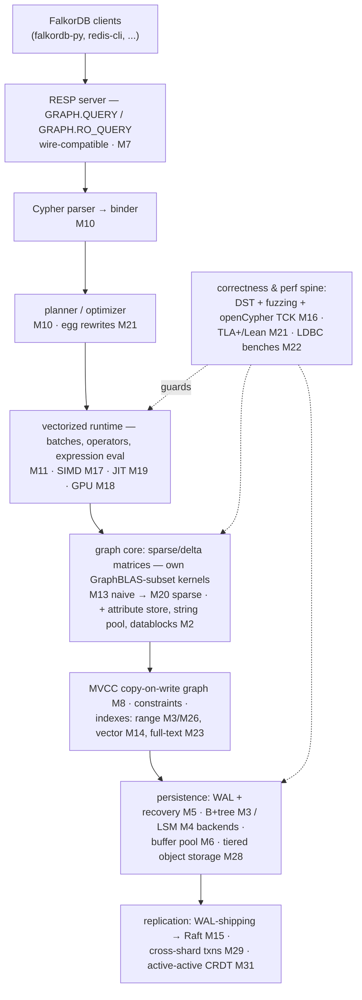
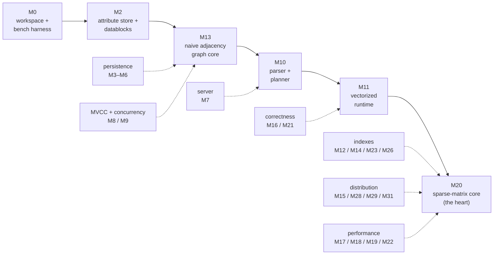

# Capstone — falkordb-rs-next-gen, from scratch

The capstone is a **clean-room rebuild of [falkordb-rs-next-gen](https://github.com/FalkorDB/falkordb-rs-next-gen)**:
a Cypher property-graph database in Rust, built one milestone per curriculum topic.
Working name: `falkordb-scratch` (rename at will).

Why rebuild something you already work on? Because on the real project you inherit
decisions; here you *make* every one — and benchmark it against the real thing. The
reference implementation lives at [`~/repos/falkordb-rs-next-gen`](https://github.com/FalkorDB/falkordb-rs-next-gen); every milestone ends
by comparing your design and numbers against the corresponding module there.

## Target architecture (mirrors the reference)

## Ground rules

- Cargo workspace; crates added as milestones demand, not upfront.
- **No peeking first**: design and build from the topic's concepts, *then* read the
  reference module and compare — the diff is where the learning is.
- Every milestone lands with: tests + a criterion benchmark + a `notes.md` entry
  comparing your approach vs the reference (design and numbers).
- Correctness bar grows over time: openCypher TCK subset (M16 onward) is the oracle.
- Unsafe allowed where the lesson requires it — with Miri runs.

## Milestone map

Milestones M0–M31 map 1:1 to curriculum topics 0–31 in `PLAN.md`; each topic's
"Capstone milestone" line defines the scope. Status lives in `PROGRESS.md`.

Rough dependency spine: M0 → M2 → M13 (naive adjacency graph) → M10/M11 (query engine)
→ M20 (sparse-matrix core replaces M13). Everything else attaches to that spine —
persistence (M3–M6), server (M7), MVCC/concurrency (M8/M9), indexes (M12/M14/M23),
distribution (M15), correctness (M16/M21), performance (M17/M18/M19/M22).

Workspace is created at M0 (topic 0). Nothing lives here until then.
