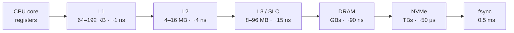
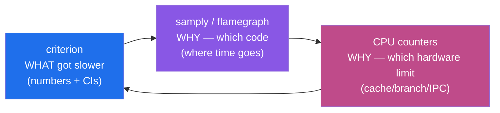

# Topic 0 — The Performance Toolbox

> Learn to measure before learning to build. Every topic after this one ends with a
> benchmark; this topic makes sure those benchmarks tell the truth.

## Outcomes

By the end you can:
1. Write a microbenchmark that isn't lying to you, and explain *why* it isn't.
2. Read a flamegraph and `perf stat`-style counters and name the bottleneck (CPU-bound,
   memory-bound, branch-miss-bound, syscall-bound).
3. Recite the memory-hierarchy latency ladder from registers to disk within 2x.
4. Report latency correctly (percentiles, not means) and explain coordinated omission.

---

## 1. Why microbenchmarks lie

The five classic failure modes — you will hit all of them this week on purpose:

- **Dead-code elimination:** the optimizer deletes your benchmarked work because the
  result is unused. Fix: `std::hint::black_box` on inputs *and* outputs.
- **Warmup & frequency scaling:** first iterations pay cold caches, page faults, and
  low CPU clocks. Criterion warms up for 3s by default — that's not superstition.
- **Variance & noise:** background processes, turbo boost, thermal throttling.
  Criterion runs many samples and does outlier detection; single-shot timing is fiction.
  On Apple Silicon: P-cores vs E-cores — pin expectations, not threads (macOS gives you
  no affinity API; keep the machine idle instead).
- **Wrong distribution:** benchmarking uniform random keys when production is Zipfian
  (redis workloads are heavily skewed). The workload generator you build in M0
  exists to fix this permanently.
- **Coordinated omission:** if you measure latency by sending request → wait → send
  next, a stall backs up your load generator and the stall *disappears from your data*.
  Gil Tene's "How NOT to Measure Latency" talk is mandatory. This is why
  `redis-benchmark` got `--latency` modes and why HdrHistogram exists.

```
Coordinated omission, on a timeline (each | is one request):

intended schedule   | | | | | | | | | | | | | | | | | |     constant rate
actual (closed loop)| | | | | |. . . . . . . .| | | | |     generator waits with the server
                               ^--- server stall ---^
what you record:    fast fast fast [ONE slow sample] fast    → "p99 looks great!"
what users felt:    every request due in the stall window waited up to the full stall

Fix: timestamp each request with its INTENDED send time; latency = completion − intended.
```

## 2. The memory hierarchy — the numbers that explain everything

Approximate, Apple M-series / modern x86, per access:

| Level | Size | Latency | ~Cycles |
|-------|------|---------|---------|
| Register | bytes | — | 0 |
| L1 | 64–192 KB | ~1 ns | 3–5 |
| L2 | 4–16 MB | ~3–5 ns | 12–20 |
| L3 / SLC | 8–96 MB | ~10–20 ns | 40–80 |
| DRAM | GBs | ~80–100 ns | 300–400 |
| NVMe read | TBs | ~20–100 µs | ~10⁵ |
| fsync (NVMe) | — | ~0.1–1 ms | ~10⁶ |

The same ladder on a log scale — each step down is roughly an order of magnitude:

```
               1ns    10ns   100ns    1µs    10µs   100µs    1ms
L1     ~1 ns   ●
L2     ~4 ns   ──●
SLC   ~15 ns   ────●
DRAM  ~90 ns   ───────●
NVMe  ~50 µs   ──────────────────────────●
fsync ~0.5 ms  ────────────────────────────────────────●
               └─ one DRAM miss ≈ 100 adds; one fsync ≈ 10,000 DRAM misses
```



Consequences you'll verify in the experiments:
- A DRAM miss costs ~100 sequential integer additions. **Databases are mostly
  memory-hierarchy management** — B-trees (page-sized nodes), LSM SSTs (sequential IO),
  vectorized execution (cache-resident batches), roaring bitmaps (fit in cache) are all
  answers to this table.
- Sequential beats random not because of "seek time" (that's spinning disks) but because
  of **prefetching** and cache-line granularity: touching 1 byte loads 64–128 bytes.
- Pointer chasing (linked lists, naive trees, neo4j-style record hopping) serializes
  misses: each next address depends on the previous load. Arrays let the CPU overlap
  many misses (memory-level parallelism). This single fact is why FalkorDB's
  matrix-based adjacency can beat pointer-based graph stores.

```
Why arrays beat pointer chasing — memory-level parallelism:

pointer chase (next address depends on previous load — misses serialize):
  load A ═══════►
                 load B ═══════►
                                load C ═══════►        3 × ~100 ns = ~300 ns

array scan (addresses known up front — misses overlap):
  load A ═══════►
  load B  ═══════►
  load C   ═══════►                                    ≈ ~110 ns total
```

## 3. Branches and the pipeline

Modern cores are ~8-wide and ~500 instructions deep in flight. A mispredicted branch
flushes the pipeline: ~15–20 cycles. A 50%-unpredictable branch in a per-row filter is
catastrophic; the fix is branchless/SIMD selection (topic 17). You'll measure the
sorted-vs-unsorted filter effect in experiment 3 — the classic 5–10x gap.

```
per-row filter `if x > t`, 50% unpredictable:

predict OK :  [fetch|decode|exec|...]───►  next row overlaps, ~1 row/cycle
mispredict :  [fetch|decode|exec|✗ FLUSH]  ~15–20 cycles of speculative work discarded
                                  └──► restart fetch from the correct path

branchless :  sum += (x > t) as u64 * x    no control dependence — nothing to predict
```

## 4. Tools on this machine (macOS ARM)

| Task | Tool |
|------|------|
| CPU profile + flamegraph | `samply record ./target/release/...` (opens Firefox Profiler UI), or `cargo flamegraph` |
| Microbenchmarks | criterion (stats, regression detection) |
| Hardware counters | Instruments → CPU Counters template (macOS has no `perf`); for real `perf stat` work use a Linux box/container |
| Allocations | Instruments → Allocations, or `dhat-rs` |
| Syscalls | Instruments → System Trace (`dtruss` needs SIP off) |
| Disk baseline | `fio` — know your NVMe's random-read IOPS and fsync latency before topic 5 |
| CLI-level timing | `hyperfine` |

Install: `cargo install samply flamegraph hyperfine; brew install fio`

**Habit to build:** criterion tells you *what* got slower, the profiler tells you *why*,
counters tell you *why* at the hardware level. Always use at least two of the three
before believing a conclusion.



## 5. Code reading (2–4 h)

- **criterion**: read `analysis/mod.rs` + how it uses warmup and outlier classification.
  Question to answer: why does it report a confidence interval rather than a minimum?
  → guided walkthrough: [`reading-criterion.md`](reading-criterion.md)
- **redis `redis-benchmark.c`**: how does it implement pipelining? What does it get
  wrong about coordinated omission?
  → guided walkthrough: [`reading-redis-benchmark.md`](reading-redis-benchmark.md)
- **RocksDB `tools/db_bench_tool.cc`** (skim): note the workload flags — this is the
  vocabulary of storage benchmarking (`fillseq`, `readrandom`, `overwrite`...).
  → guided walkthrough: [`reading-rocksdb-db-bench.md`](reading-rocksdb-db-bench.md)

## 6. Reading / watching

- Brendan Gregg, *Systems Performance* ch. 1–2 (methodologies — USE method).
- Gil Tene, "How NOT to Measure Latency" (talk) — lessons captured in [`notes.md`](notes.md).
- Raasveldt, Holanda, Gubner, Mühleisen — "Fair Benchmarking Considered Difficult:
  Common Pitfalls in Database Performance Testing" (DBTest '18, from the DuckDB authors)
  — the DB-specific companion to this topic's §1.
  → reading guide: [`reading-fair-benchmarking.md`](reading-fair-benchmarking.md)
- "What Every Programmer Should Know About Memory" (Drepper) — §3–4 only, skim the rest.
  → reading guide: [`reading-drepper.md`](reading-drepper.md)

## 7. Experiments (in `experiments/`)

1. **`cache_ladder`** — stride through arrays of 16KB → 512MB; plot ns/access. You
   should *see* L1/L2/SLC/DRAM as plateaus.
2. **`lookup_shootout`** — point lookups: `Vec` linear scan vs `Vec` binary search vs
   `HashMap` vs `BTreeMap`, sizes 1e2 → 1e7. Find the crossover where linear scan beats
   hashing (it exists, and it's bigger than you think).
3. **`branch_misprediction`** — sum elements `> threshold` over sorted vs shuffled data.
   Then make it branchless and watch the gap vanish.
4. Profile experiment 2 with samply; grab one flamegraph screenshot into `notes.md`.

## 8. Capstone milestone M0 (in `../../capstone/`)

- [x] Cargo workspace scaffolded
- [x] `workload` crate: seeded, Zipfian-skewed graph workload generator
      (node/edge inserts, point reads, 2-hop traversal patterns)
- [x] criterion harness wired up (generator smoke bench)
- [x] Baseline numbers from the reference `falkordb-rs-next-gen` recorded in
      `capstone/BASELINES.md` (run its bench suite; numbers to chase later)

## Done when

- All three experiments run and their results are *explained* in `notes.md` (numbers +
  why), the flamegraph screenshot is captured, and M0 checklist is complete.
