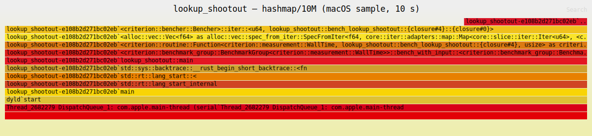

# Topic 0 — Notes

Numbers from this machine (Apple Silicon, macOS). Record *why*, not just what.

## Talk: Gil Tene — "How NOT to Measure Latency" (watched ✅)

Core thesis: almost everyone measures latency wrong, and the errors all point the
same direction — making systems look *better* than they are.

1. **Latency is a distribution, never a number.** Means and standard deviations are
   meaningless for latency (it's multi-modal, heavy-tailed, not normal). Always report
   percentiles — and the *whole* curve, not just p50/p99.
2. **The tail is what users experience.** A page load touching ~100 resources hits the
   p99 almost every time (1 − 0.99¹⁰⁰ ≈ 63%). "p99.9 doesn't matter" is backwards:
   the more requests per user interaction, the deeper the percentile that dominates UX.
3. **Coordinated omission** — the big one. If the load generator waits for a response
   before sending the next request, a server stall silences the generator exactly when
   things go bad: the bad results are *omitted* from the data, coordinated with the
   stall. A 100s test with one 50s pause can report "p99 < 1ms" while reality is
   ~25s average during half the test. The error is ~1000x+, not a rounding issue.
   - Fix: measure against the **intended send schedule** (constant-rate arrival), not
     the actual send time. If a request should have gone out at t=5s but went out at
     t=55s, its latency includes those 50s of wait.
   - This is why HdrHistogram has correction modes and why wrk2/redis-benchmark grew
     constant-throughput modes.
4. **Service time ≠ response time.** Service time = how long the server took once it
   started; response time = what the client experiences, including queueing. Load
   generators that back off measure service time and *call* it response time.
   Throughput-vs-latency plots made this way are fiction beyond saturation.
5. **"Sustainable throughput" framing.** Don't ask "what's the max throughput?" — ask
   "what's the max throughput at which we still meet the latency requirements?"
   Test by stating requirements first (e.g. p99.9 < 20ms, max < 200ms), then finding
   the highest load that passes. A benchmark without a latency requirement is a
   throughput benchmark, and throughput alone is easy to game.
6. **Beware the hockey stick you can't see.** Plotted percentile curves always bend up
   hard somewhere ("the hockey stick"); tests that stop at p99 just hide where. Plot to
   the max recorded value — the max is a real event that happened, not an outlier to trim.
7. **Never average percentiles** across intervals/machines — p99s don't average. Merge
   the histograms (HdrHistogram), then read percentiles off the merged data.

**Rules for this repo's benchmarks (from the talk):**
- Capstone server benches (M7+) must use a constant-rate open-loop load generator with
  coordinated-omission correction (HdrHistogram), never closed-loop request→wait→request.
- Report p50/p90/p99/p99.9/max + full percentile plot; never mean latency.
- Criterion is fine for CPU microbenches (throughput of kernels), but *not* an oracle
  for request latency — different tool for a different question.

## Experiment 3 — branch_misprediction (done, first pass)

| Variant | Sorted | Shuffled |
|---------|--------|----------|
| branchy | 338 µs (3.1 Gelem/s) | 2.75 ms (0.38 Gelem/s) |
| branchless | 70 µs (15.0 Gelem/s) | 71 µs (14.7 Gelem/s) |

- **8.1x** sorted→shuffled gap for the branchy version — the classic misprediction penalty.
  1M elements, ~50% unpredictable taken rate ⇒ ~500K flushes; (2750−338)µs / 500K ≈
  ~4.8 ns ≈ 15 cycles per miss at ~3.2 GHz. Matches the §3 estimate.
- **Surprise:** with plain `sum += x` in the branch, LLVM if-converts + auto-vectorizes
  and the gap *vanishes* (both ~70µs). Had to put `black_box(x)` inside the taken path
  to keep a real branch. Lesson: on modern compilers the famous StackOverflow
  sorted-array effect only reproduces if vectorization is defeated — always check the asm.
- Branchless = data dependence instead of control dependence ⇒ NEON select, 4.8x faster
  than even the perfectly-predicted branchy loop.

## Experiment 2 — lookup_shootout (done)

ns per lookup (median, 1024 shuffled probes, all hits):

| n | vec_linear | vec_binary_search | hashmap | btreemap |
|------|--------:|------:|-----:|-----:|
| 100 | 17.8 | 3.0 | 7.4 | 5.0 |
| 1e3 | 141 | 4.9 | 6.8 | 7.9 |
| 1e4 | 1,350 | 8.1 | 7.2 | 11.1 |
| 1e5 | 13,400 | 16.0 | 8.3 | 17.2 |
| 1e6 | — | 25.8 | 8.8 | 26.6 |
| 1e7 | — | 44.1 | 9.3 | 38.9 |

- **HashMap is almost flat (7→9.3 ns) even at 1e7** — a ~160MB table where a random
  probe "should" cost a ~100ns DRAM miss. The 1024 probes are *independent*, so the
  out-of-order window overlaps many misses (memory-level parallelism — §2's array-scan
  lesson applied to hashing). Single dependent lookups would be much slower; batch APIs
  exist precisely to expose this parallelism.
- **Binary search beats HashMap up to n ≈ 1e4** (3.0–8.1 ns): log₂(n) dependent
  compares, but the top of the tree stays cache-resident. Past 1e5 the deep levels miss
  and its dependent-load nature (no MLP within one search) makes it grow ~log(n) × miss
  cost.
- **BTreeMap overtakes binary search at 1e7** (38.9 vs 44.1 ns): ~11-key nodes mean
  fewer distinct cache lines touched than 23 scattered probes of `binary_search` —
  page-sized fanout is the whole point of B-trees (topic 3).
- **Study-guide claim busted:** `iter().find` linear scan *never* beats hashing at
  n ≥ 100 (17.8 vs 7.4 ns at n=100). Early-exit branchy scan averages n/2 compares;
  the real crossover sits somewhere below n ≈ 32, smaller than folklore says. A
  branchless/SIMD scan over a tiny array would move it — revisit in topic 17.

## Experiment 1 — cache_ladder (done — after fixing a lying benchmark)

**First version lied.** `chase` restarted at `idx = 0` every criterion iteration, so
every iteration re-walked the *same* 65,536 slots — an ~8MB hot path that fits in
L2/SLC no matter how big the array. The "DRAM" plateau read ~25 ns (mostly TLB misses,
since those 64K slots spread across the whole 512MB). Textbook §1 failure mode: the
benchmark measured cache residency created by the benchmark itself. Fix: carry `idx`
across iterations so the walk keeps visiting fresh lines.

ns per dependent access (median, fixed version):

| Working set | ns/access | Level |
|------------:|----------:|-------|
| 16KB–128KB | 1.02 | L1 (P-core L1d is 128KB — the plateau ends exactly there) |
| 512KB–1MB | 5.3–5.8 | L2 |
| 4–8MB | 7.6–9.0 | L2 (Apple's per-cluster L2 is huge — 16MB-class) |
| 16MB | 17.1 | falling out of L2 into SLC |
| 32MB | 59.6 | SLC → DRAM transition |
| 64MB | 87.4 | DRAM |
| 128–512MB | 104–113 | DRAM + growing TLB-miss share |

- Matches the §2 ladder within noise: ~1ns L1, ~5ns L2, ~100ns DRAM. One dependent
  DRAM access = ~110 sequential adds — verified, not folklore.
- Transitions are gradual, not steps (Drepper's question 1): random chains straddle
  levels probabilistically, and set-associativity evicts unevenly.
- The last rise (64MB → 512MB: 87 → 113 ns) is TLB reach, not cache: 512MB / 16KB
  pages = 32K pages ≫ TLB entries, so most steps add a page-walk on top of the miss.

## Flamegraph (done)

Captured from `lookup_shootout/hashmap/10000000` via macOS `sample` → `rustfilt` →
`inferno` (SVG committed next to these notes; `cargo flamegraph`'s xctrace path is
broken on current Xcode). For interactive profiling use:
`samply record ./target/release/deps/lookup_shootout-* --bench --profile-time 10 <filter>`

- **21% of samples are inside SipHash (`core::hash::sip::Hasher::write`)** — Rust's
  default DoS-resistant hasher costs a fifth of total lookup time even on u64 keys at a
  size (10M) where DRAM misses should dominate. Swapping in `FxHashMap`/`ahash` is the
  obvious first optimization for the capstone's internal (non-adversarial) maps.
- The remaining ~79% is the inlined probe loop (hashbrown's SIMD group probe + the
  memory stalls themselves) — invisible as separate frames because it's fully inlined
  into the bench closure. Sampling profilers attribute stalls to the instruction that
  waits; only counters (topic 0 §4) can split "executing" from "waiting on DRAM".

## M0 workload generator

- Seeded `StdRng` + `rand_distr::Zipf` (s=0.99, YCSB default), skewed toward low ids
  (oldest nodes = hubs, matching preferential attachment).
- Generation throughput: **~11 M ops/s** (9.1 ms / 100K ops) — fine for now; if engine
  benches ever exceed ~10 M ops/s, pre-generate op vectors outside the timed loop.
- Zipf sampling dominates cost (rejection sampling per draw). Alias-table or
  precomputed CDF is the known fix — note for later, not needed yet.
