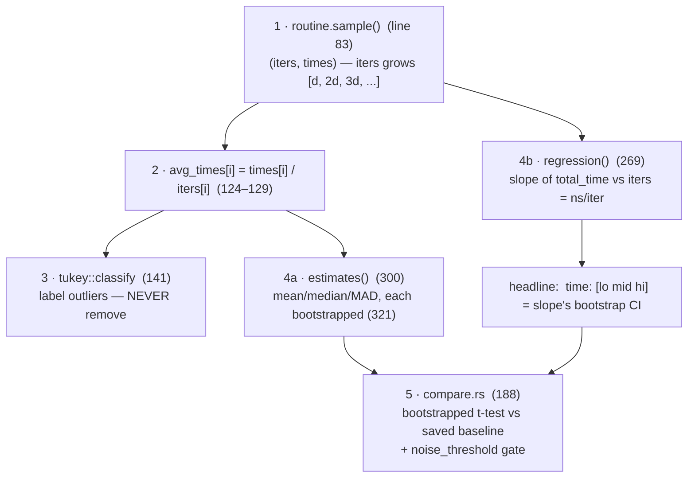

# How criterion turns noise into a number you can trust

Every benchmark in this curriculum runs through criterion, so before trusting
any of them it pays to know exactly what the tool does to raw timings. The
answer lives in one 370-line file, `analysis/mod.rs`: `common()` (line 39) is
a pipeline, and every line criterion prints during a bench run maps to a
specific step there. Before opening the crate, this chapter builds the
statistics from zero — why one timing lies, what warm-up really does, why
criterion fits a line instead of taking an average, and how it manufactures
a confidence interval without assuming anything about the noise. Then it
hands you the reading order through the code. Three ideas do all the work —
bootstrap instead of normality assumptions, slope instead of mean, label
outliers instead of dropping them.

## The problem in one sentence

Run the same 70 µs function twice on a laptop and the two timings can differ
by 40% — so how do you turn a pile of disagreeing measurements into a
statement like "70.1 µs, and we're 95% sure it's between 69.6 and 70.5"?

## The concepts, step by step

### Step 1 — one timing is meaningless

A single measurement of your function is not its cost; it is its cost *plus
whatever else the machine was doing at that instant*. The noise has real
sources, each big enough to swamp a microbenchmark:

- **Frequency scaling** — the CPU changes its own clock speed (boost when
  cool, throttle when hot). The same instruction stream can run 1.5× faster
  at the start of a run than two minutes in.
- **Interrupts and scheduling** — the OS steals the core for ~µs-to-ms slices
  (timer ticks, network packets, another process). A 70 µs function that eats
  one 1 ms preemption measures as 1070 µs — 15× off.
- **Allocator and cache state** — the first call finds cold caches and an
  allocator with no free lists; call 10,000 finds everything hot. Same code,
  different machine state, different time.
- **Clock granularity** — the timer itself has resolution limits; timing
  something that takes 20 ns with a clock you can read every ~20–40 ns is
  mostly measuring the clock.

Why it matters: any tool that reports one number from one run is reporting
noise. Everything that follows is machinery to measure *through* the noise.

### Step 2 — warm-up: get the machine into steady state first

Warm-up means running the benchmark unrecorded for a few seconds before
measuring, so the transient effects from Step 1 — cold caches, empty
allocator free lists, un-boosted clocks, lazy initialization — settle into a
steady state.

Criterion's warm-up lives in `routine.rs::warm_up`, and its *primary* job is
sneakier than cache-warming: it's **calibration**. Warm-up counts how many
iterations fit in the warm-up window, which tells criterion how many
iterations each measured sample must contain to fill the target measurement
time. Cold-cache mitigation is a side effect.

Why it matters: skip warm-up and your first samples measure a machine state
production code never runs in — and criterion wouldn't even know how big to
make its samples.

### Step 3 — sampling: time batches of iterations, never one

A **sample** is one timing measurement of a *batch* of iterations — e.g.
"5,000 iterations took 350 ms" — because a single iteration is both too noisy
and too short for the clock (Step 1). Criterion collects ~100 samples, and
with **linear sampling** the batch sizes grow arithmetically:

```
sample #      1     2     3     4    ...   100
iters[i]      d    2d    3d    4d   ...  100d      (d chosen by warm-up, Step 2)
times[i]     t₁    t₂    t₃    t₄   ...  t₁₀₀      (one wall-clock timing each)
```

In the code: `routine.sample(...)` (`analysis/mod.rs:83`) returns exactly
these two parallel arrays `(iters, times)`. Immediately after, lines 124–129
compute `avg_times[i] = times[i] / iters[i]` — per-iteration averages, the
dataset all the single-variable statistics below run on.

Why it matters: batching averages away clock granularity, and the deliberate
*linear growth* of `iters` is not an accident — it's the setup for Step 4.

### Step 4 — linear regression: the slope is the per-iteration cost

Every sample's total time is really `total_time = overhead + cost × iters`:
a fixed per-sample overhead (reading the clock, loop setup) plus the true
per-iteration cost times the batch size. Plot the 100 samples as points and
fit a straight line through them — the **slope** of that line is the
per-iteration cost, and the fixed overhead lands in the **intercept**, where
it can't contaminate the answer:

```
total_time                                 why slope beats mean-of-averages:
    │                          ×
    │                    ×                 slope  = ns per iteration  ← the answer
    │              ×
    │        ×
    │  ×
    ├─────────────────────────── iters
    ╵← intercept = fixed per-sample overhead
       (mean of averages absorbs it; the slope ignores it)
```

Compare the naive alternative: averaging the `avg_times` from Step 3 spreads
that fixed overhead across every sample and *inflates* the answer — worst for
the smallest batches. In the code this is `regression()`
(`analysis/mod.rs:269`); it's only valid when `iters` actually varies, so
criterion checks for linear sampling at line 152. The headline
`time: [lo mid hi]` criterion prints is built from this slope.

Why it matters: the slope is a per-iteration estimate that a constant
measurement tax cannot bias — the mean has no such immunity.

### Step 5 — outliers: label them, never delete them

An **outlier** is a sample far outside the bulk of the data — usually one of
Step 1's noise events (a preemption, a throttle step) landing inside a batch.
Criterion classifies them with **Tukey fences** (`tukey::classify`,
`analysis/mod.rs:141`): compute the quartiles, and flag anything beyond
1.5× the interquartile range as *mild*, beyond 3× as *severe*. That's the
"Found N outliers among 100 measurements" line in the output.

The crucial policy: outliers are **labeled and reported, never removed**.
Deleting the samples you don't like is how benchmarks lie — maybe that "noise"
is your allocator hitting a slow path every 64th call, i.e. real behavior.

Why it matters: you get told the data is contaminated *and* you get to see
by how much, instead of the tool silently editing reality.

### Step 6 — bootstrap resampling: a confidence interval with no assumptions

A **confidence interval (CI)** is a range — "95% CI [69.6, 70.5] µs" — meaning
the procedure that produced it captures the true value 95% of the time.
Textbook CIs assume the noise is normally distributed (the bell curve);
latency noise isn't (it's skewed — there's a floor but no ceiling). The
**bootstrap** sidesteps the assumption entirely: pretend your 100 samples
*are* the population, resample 100 values from them **with replacement**
(the same sample may be drawn twice, others not at all), recompute the
statistic, and repeat 100,000 times. The spread of those 100,000 recomputed
statistics is an empirical distribution *of the statistic itself* — read
the CI straight off its percentiles:

```rust
fn bootstrap_ci(sample: &[f64], nresamples: usize) -> (f64, f64) {
    let n = sample.len();
    let mut stats = Vec::with_capacity(nresamples);
    for _ in 0..nresamples {                       // 100_000 in criterion
        // resample WITH replacement, same size — pretend the sample IS the population
        let stat = mean((0..n).map(|_| sample[rand_below(n)]));
        stats.push(stat);                          // distribution OF THE STATISTIC
    }
    stats.sort_by(|a, b| a.partial_cmp(b).unwrap());
    (percentile(&stats, 2.5), percentile(&stats, 97.5))  // CI = its percentiles —
}                                                        // no normality assumed
```

Criterion bootstraps *everything*: `estimates()` (`analysis/mod.rs:300`)
bootstraps the mean/median/std-dev/MAD of the per-iteration averages
(line 321), and the headline `time: [lo mid hi]` is the **slope's** bootstrap
CI — resample the (iters, times) points, refit the line each time.

Why it matters: this is the engine under every bracketed range criterion
prints, and it works on ugly, skewed, real-world timing data.

### Step 7 — why a CI beats taking the minimum

The rival school (older Python `timeit` advice) says: noise only ever *adds*
time, so report the minimum — it's the closest to the true cost. Criterion
rejects that, for four reasons:

1. **Min answers the wrong question.** It estimates best-case-ever (all
   caches hot, zero interference) — a state production code never runs in.
   The CI estimates *typical* cost with honest uncertainty bounds.
2. **Noise isn't strictly additive.** Frequency scaling (Step 1) means early
   samples can run at a *higher* clock (pre-thermal-throttle) — the min can
   be an unrepresentatively lucky sample, and on modern laptops often is.
3. **Min is statistically fragile for comparison.** It's an extreme-value
   statistic with no usable sampling distribution — you can't compute a
   p-value on "min got 2% slower." Step 8's machinery only works because
   mean/slope have bootstrap distributions.
4. **A point estimate hides confidence.** `[69.6 70.1 70.5] µs` says the
   measurement is tight; a bare `69.6` hides whether the spread was 1% or 40%.

Why it matters: this is the study-guide question, and it's the philosophical
core — a benchmark result without an uncertainty estimate is an anecdote.

### Step 8 — regression detection: two gates, not one

Detecting "did my change make this slower?" needs two separate questions,
because a difference can be statistically real yet too small to care about,
or large but pure noise. Criterion (line 188 → `compare.rs`) loads the saved
baseline and applies two gates:

1. **Is the difference real?** A bootstrapped two-sample t-test
   (`compare.rs`, line 200: `p_value`) — bootstrap the "no difference"
   hypothesis and ask how often chance alone produces a gap this big.
2. **Is it big enough to care?** A bootstrapped relative-change estimate
   compared against `noise_threshold`.

Both must pass — e.g. `+3781% (p = 0.00 < 0.05)`: significant *and* large.

Why it matters: one gate alone produces either false alarms on every 0.3%
wobble or silence on real 5% regressions.

## Where each step lives in the code

The whole pipeline is `common()` in `analysis/mod.rs` (370 lines); every
step above maps to a call in it:



Suggested reading order in the crate:

1. `analysis/mod.rs::common` — the spine (Steps 3, 4, 5, 6 in sequence)
2. `stats/univariate/outliers/tukey.rs` — Step 5's fences, ~100 lines
3. `stats/bivariate/regression.rs` — `Slope::fit` is ~10 lines of
   least-squares (Step 4)
4. `analysis/compare.rs` + `stats/univariate/mixed.rs` — Step 8's
   bootstrapped t-test
5. `routine.rs::warm_up` — see that warm-up (Step 2) is really
   iteration-count calibration

## Takeaway

Criterion is built on three ideas: **bootstrap instead of normality assumptions, slope
instead of mean, label outliers instead of dropping them.**

## References

**Code**
- [criterion.rs](https://github.com/bheisler/criterion.rs)
  `src/analysis/mod.rs` (locally:
  `~/.cargo/registry/src/index.crates.io-*/criterion-0.5.1/src/analysis/mod.rs`,
  370 lines) — `common()` is the spine; follow the suggested reading
  order above through `tukey.rs`, `regression.rs`, `compare.rs`, and
  `routine.rs::warm_up`
