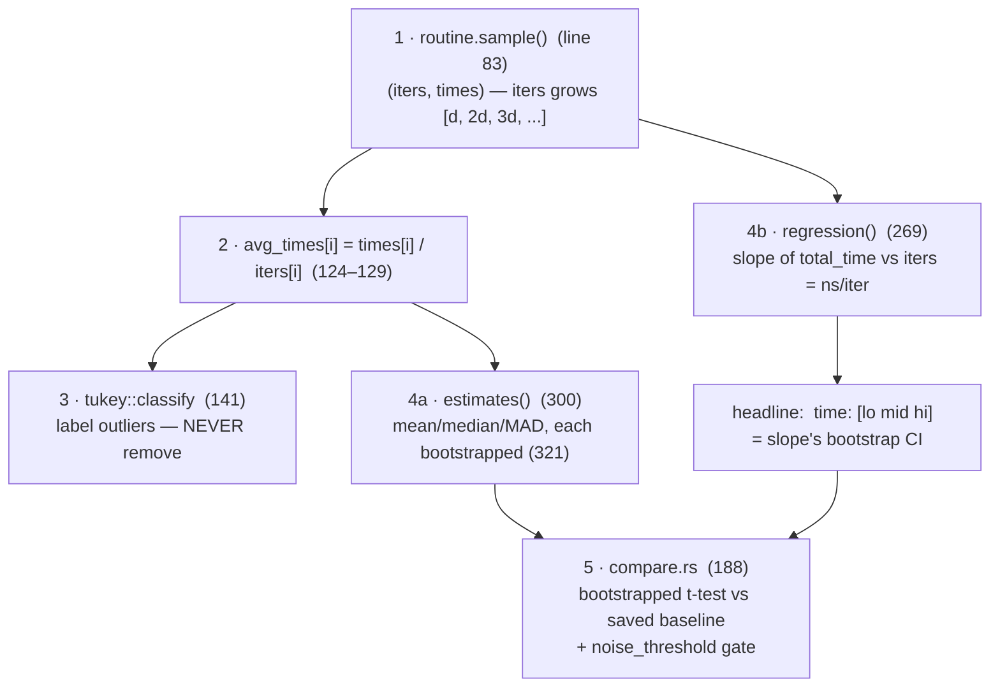

# Code reading — criterion `analysis/mod.rs`

Source: `~/.cargo/registry/src/index.crates.io-*/criterion-0.5.1/src/analysis/mod.rs` (370 lines).
This file is criterion's statistical spine; `common()` (line 39) is a pipeline, and every
line criterion prints during a bench run maps to a specific step here.

## The pipeline in `common()`



**1. Sampling (line 83)** — `routine.sample(...)` returns `(sampling_mode, iters, times)`:
two parallel arrays, e.g. 100 samples where sample *i* ran `iters[i]` iterations and took
`times[i]` total. Key trick: it never times a single iteration (too noisy, clock
granularity). With linear sampling, `iters` grows as `[d, 2d, 3d, ...]` — that shape
matters for step 4. Warmup lives in `routine.rs::warm_up`, *before* this — its real job
is calibrating how big `d` must be to fill the target time; cold-cache mitigation is a
side effect.

**2. Normalize (lines 124–129)** — `avg_times[i] = times[i] / iters[i]` → per-iteration
averages. This is the `Sample` all univariate stats run on.

**3. Outlier classification (line 141)** — `tukey::classify` labels each sample using
Tukey fences (quartiles ± 1.5×IQR / 3×IQR → mild/severe). Outliers are **labeled and
reported, never removed** — that's the "Found N outliers among 100 measurements" line.
Philosophy: deleting data you don't like is how benchmarks lie.

**4. Two independent estimators:**
- `estimates()` (line 300): mean/median/std-dev/MAD of `avg_times`, each
  **bootstrapped** (line 321): resample the sample with replacement `nresamples` (100k)
  times, recompute the stat each time → an empirical *distribution of the statistic* →
  read the CI off its percentiles. No normality assumption — which matters because
  latency isn't normal.
- `regression()` (line 269): fits `total_time = slope × iters` through the
  `(iters, times)` points — the slope *is* ns/iteration. Only valid for linear sampling
  (checked at line 152). The headline `time: [lo mid hi]` is the **slope's** bootstrap
  CI. Why slope beats mean-of-averages: constant per-sample overhead (measurement, loop
  setup) inflates every `avg_times[i]` but shows up as an *intercept* the slope ignores.

```
total_time                                 why slope beats mean-of-averages:
    │                          ×
    │                    ×                 slope  = ns per iteration  ← the answer
    │              ×
    │        ×
    │  ×
    ├─────────────────────────── iters
    ╵← intercept = fixed per-sample overhead
       (mean of averages absorbs it; the slope ignores it)
```

**5. Regression detection (line 188 → `compare.rs`)** — loads the saved baseline,
bootstraps a two-sample t-test (line 200: `p_value`) asking "is the difference real?",
then a bootstrapped relative-change estimate against `noise_threshold` asking "is it big
enough to care?". Both gates must pass — e.g. `+3781% (p = 0.00 < 0.05)`: significant
*and* large.

## Study-guide question: why a CI, not a minimum?

The "report the minimum" school (older Python `timeit` advice) argues noise is strictly
additive, so min = true cost. Criterion rejects that:

1. **Min answers the wrong question.** It estimates best-case-ever (all caches hot, zero
   interference) — a state production code never runs in. The CI estimates *typical*
   cost with honest uncertainty bounds.
2. **Noise isn't strictly additive.** Frequency scaling means early samples can run at a
   *higher* clock (pre-thermal-throttle) — the min can be an unrepresentatively lucky
   sample, and on modern laptops often is.
3. **Min is statistically fragile for comparison.** It's an extreme-value statistic with
   no usable sampling distribution — you can't compute a p-value on "min got 2% slower."
   The regression-detection machinery only works because mean/slope have bootstrap
   distributions.
4. **A point estimate hides confidence.** `[69.6 70.1 70.5] µs` says the measurement is
   tight; a bare `69.6` hides whether the spread was 1% or 40%.

## Suggested reading order in the crate

1. `analysis/mod.rs::common` — the spine
2. `stats/univariate/outliers/tukey.rs` — fences, ~100 lines
3. `stats/bivariate/regression.rs` — `Slope::fit` is ~10 lines of least-squares
4. `analysis/compare.rs` + `stats/univariate/mixed.rs` — the bootstrapped t-test
5. `routine.rs::warm_up` — see that warmup is really iteration-count calibration

## Takeaway

Criterion is built on three ideas: **bootstrap instead of normality assumptions, slope
instead of mean, label outliers instead of dropping them.**
