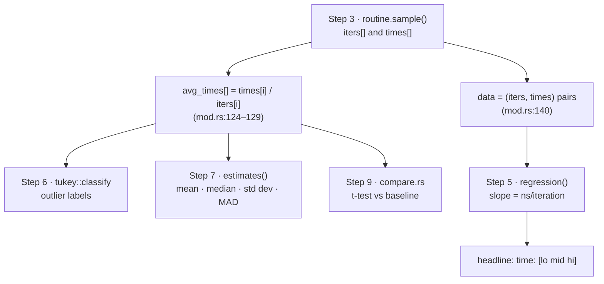
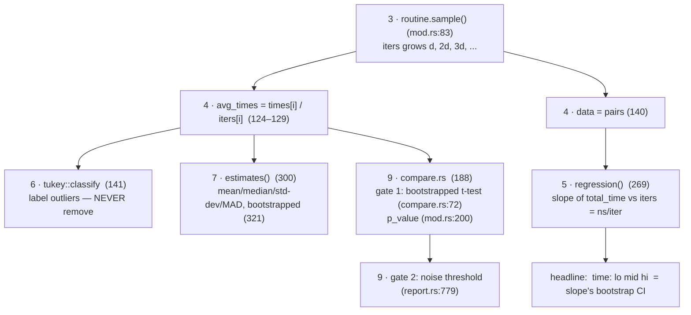

# How criterion turns noise into a number you can trust

Every benchmark in this curriculum runs through criterion, so before trusting
any of them it pays to know exactly what the tool does to raw timings. The
answer lives in one 370-line file, `analysis/mod.rs`: `common()` (line 39) is
a pipeline, and every line criterion prints during a bench run maps to a
specific step there. Before opening the crate, this chapter builds the
statistics from zero — why one timing lies, what warm-up really does, why
criterion fits a line instead of taking an average, which of the two datasets
it derives from a run each stage actually reads, and how it manufactures a
confidence interval without assuming anything about the noise. Then it hands
you the reading order through the code. Three ideas do all the work —
bootstrap instead of normality assumptions, slope instead of mean, label
outliers instead of dropping them.

Every anchor below is criterion **0.5.1**, the version this repo pins, quoted
with the line numbers the code occupies in that version.

## The problem in one sentence

Run the same 70 µs function twice on a laptop and the two timings can differ
by 40% — so how do you turn a pile of disagreeing measurements into a
statement like "70.1 µs, and we're 95% sure it's between 69.6 and 70.5"?

## The concepts, step by step

### Step 1 — one timing is meaningless

> **In:** nothing yet — this step is the motivation.
> **Out:** the reason every later step exists.

A **microbenchmark** is a timed run of one small piece of code in isolation.
A single measurement of your function is not its cost; it is its cost *plus
whatever else the machine was doing at that instant*. The noise has real
sources, each big enough to swamp a microbenchmark:

- **Frequency scaling** — the CPU changes its own clock speed (boost when
  cool, throttle when hot); the same instruction stream can run 1.5× faster
  at the start of a run than two minutes in.
- **Interrupts and scheduling** — the OS steals the core for ~µs-to-ms slices.
  A 70 µs function that eats one 1 ms preemption measures as 1070 µs, 15× off.
- **Allocator and cache state** — the first call finds cold caches and no free
  lists; call 10,000 finds everything hot. Same code, different time.
- **Clock granularity** — timing something that takes 20 ns with a clock you
  can read every ~20–40 ns is mostly measuring the clock.

Why it matters: any tool that reports one number from one run is reporting
noise. Everything that follows is machinery to measure *through* the noise.

### Step 2 — warm-up is really calibration

> **In:** your benchmark function.
> **Out:** one number, `met` — the **mean execution time**, criterion's rough
> first guess at how long a single iteration takes. Step 3 consumes it.

Warm-up means running the benchmark unrecorded for a few seconds before
measuring, so the transient effects from Step 1 — cold caches, empty
allocator free lists, un-boosted clocks, lazy initialization — settle into a
steady state.

But cache-warming is the *side effect*. `warm_up` is declared at
`routine.rs:257`; **the line to focus on is 277**, its only `return`:

```rust
// routine.rs:269–281 — the loop body of warm_up (blank lines 271, 273, 279 elided)
269    loop {
270        (*f)(&mut b, black_box(parameter));   // run it, record nothing
272        b.assert_iterated();
274        total_iters += b.iters;
275        elapsed_time += b.elapsed_time;
276        if elapsed_time > how_long {          // how_long = warm_up_time, default 3 s
277            return (elapsed_time.as_nanos() as u64, total_iters);   // ← the payload
278        }
280        b.iters = b.iters.wrapping_mul(2);    // 1, 2, 4, 8, 16, ... iterations
281    }
```

Line 277 is the whole argument of this step: what warm-up hands back is not a
warmed cache — you cannot return one — but **two counters**, a duration and an
iteration count. Line 280 is what makes them large enough to be worth dividing:
the batch doubles every pass, so three seconds of warm-up covers far more
iterations than three seconds of one-at-a-time timing would.

The caller divides those two numbers into one:

```rust
// routine.rs, inside Routine::sample
158    let met = wu_elapsed as f64 / wu_iters as f64;   // mean execution time, ns/iteration
```

That is the whole point: `met` is what lets criterion size its measurement
batches in Step 3.

Why it matters: skip warm-up and your first samples measure a machine state
production code never runs in — and criterion wouldn't even know how big to
make its samples.

### Step 3 — sampling: time batches, never one iteration

> **In:** `met` from Step 2.
> **Out:** two parallel arrays of 100 numbers each, `iters` and `times`.
> These are *the* raw data; every later step is downstream of them.

A **sample** here is one timing measurement of a *batch* of iterations — e.g.
"1,500 iterations took 105 ms" — because a single iteration is both too noisy
and too short for the clock (Step 1). Criterion collects `sample_size`
samples (default 100), and under **linear sampling** the batch sizes grow
arithmetically: batch *i* runs `i × d` iterations, for one step size `d`.

`d` is chosen so the whole ladder fills the measurement budget. The three
lines that matter sit in the `Linear` arm of `iteration_counts`
(`lib.rs:1402–1428`), with a warning block between 1409 and 1427 elided here:

```rust
// lib.rs, ActualSamplingMode::Linear arm — 1407, 1408 and 1428
1407    let total_runs = n * (n + 1) / 2;              // 1+2+...+n batches' worth
1408    let d = ((m_ns as f64 / met / total_runs as f64).ceil() as u64).max(1);
        // ... 1409–1427: expected_ns, and the d == 1 warning described below ...
1428    (1..(n + 1)).map(|a| a * d).collect::<Vec<u64>>()      // [d, 2d, 3d, ..., nd]
```

Worked through, for the 70.1 µs function in "the problem in one sentence",
with the defaults `n = 100` samples and `m_ns = 5 s` of measurement time:

```
total_runs = 100 × 101 / 2                      = 5,050
m_ns / met = 5e9 ns / 70,100 ns                 = 71,326 iterations affordable
d          = ceil(71,326 / 5,050)               = 15

iters  =    15,   30,   45,   60, ...,  1500     ← 100 batches, growing by 15
times  =    t₁,   t₂,   t₃,   t₄, ...,  t₁₀₀     ← one wall-clock timing each
                                                   total: 75,750 iters ≈ 5.3 s
```

In the code: `routine.sample(...)` (`analysis/mod.rs:83`) returns exactly
these two parallel arrays.

Two escape hatches worth knowing. If `d` comes out as 1 the ladder cannot fit
and criterion prints a warning suggesting a longer target time. And in `Auto`
mode, if the linear ladder would take more than **twice** the target time,
criterion switches to **flat sampling** — every batch the same size
(`lib.rs:1371–1382`). Flat sampling has no growing `iters`, which as Step 5
shows costs you the slope.

Why it matters: batching averages away clock granularity, and the deliberate
*linear growth* of `iters` is not an accident — it is the setup for Step 5.

### Step 4 — the fork: one sample, two datasets

> **In:** `iters` and `times` from Step 3.
> **Out:** *two* different datasets that the rest of the pipeline uses for
> *different* things. This step exists purely to say which is which.

This is the step the pipeline diagram hides. From the single sample of
Step 3, `common()` derives two separate things:

```rust
// analysis/mod.rs — 124–129 build one dataset, 140 the other
124    let avg_times = iters
125        .iter()
126        .zip(times.iter())
127        .map(|(&iters, &elapsed)| elapsed / iters)
128        .collect::<Vec<f64>>();
129    let avg_times = Sample::new(&avg_times);
       // ... 131–139: baseline directory bookkeeping ...
140    let data = Data::new(&iters, &times);
```

- **`avg_times`** — 100 numbers, one **per-iteration average** per sample
  (`times[i] / iters[i]`); one-dimensional.
- **`data`** — the same 100 `(iters, times)` *pairs*, untouched;
  two-dimensional, points on a plot.

They are not interchangeable, and each downstream stage takes exactly one:


```mermaid
flowchart TD
    S["Step 3 · routine.sample()<br/>iters[] and times[]"]
    S --> A["avg_times[] = times[i] / iters[i]<br/>(mod.rs:124–129)"]
    S --> D["data = (iters, times) pairs<br/>(mod.rs:140)"]
    A --> T["Step 6 · tukey::classify<br/>outlier labels"]
    A --> E["Step 7 · estimates()<br/>mean · median · std dev · MAD"]
    A --> C["Step 9 · compare.rs<br/>t-test vs baseline"]
    D --> R["Step 5 · regression()<br/>slope = ns/iteration"]
    R --> H["headline: time: [lo mid hi]"]
```

Note the asymmetry, because it surprises everyone: the **headline number you
read comes from `data`** (the slope), while the **regression detection that
tells you it got slower runs on `avg_times`** (the mean). Two different
statistics of the same run. Step 9 comes back to this.

Why it matters: "which numbers is this step actually looking at?" is the
question that makes the rest of the pipeline legible. Answer it once, here.

### Step 5 — the slope is the per-iteration cost

> **In:** `data`, the `(iters, times)` pairs from Step 4 — *not* `avg_times`.
> **Out:** one number: ns per iteration, plus (via Step 7) its interval.

Every sample's total time is really `total_time ≈ overhead + cost × iters`:
a fixed per-sample overhead (reading the clock, loop setup) plus the true
per-iteration cost times the batch size. **Linear regression** means fitting
a straight line to those points; the **slope** of the line — how much `y`
grows per unit of `x` — is the per-iteration cost.

**Least squares** picks the line that minimises the sum of squared vertical
distances from the points to it. Criterion's entire regression is four lines —
**focus on 27**, which is the estimate:

```rust
// stats/bivariate/regression.rs:20–28 (21–22 unpack xs/ys; 23 and 26 blank)
20     pub fn fit(data: &Data<'_, A, A>) -> Slope<A> {
24         let xy = crate::stats::dot(xs, ys);   // Σ xᵢyᵢ
25         let x2 = crate::stats::dot(xs, xs);   // Σ xᵢ²
27         Slope(xy / x2)                        // m = Σxᵢyᵢ / Σxᵢ²   ← the whole fit
28     }
```

Read the type first: `struct Slope<A>(pub A)` — **one** field. This is a fit
of `y = m·x`, a line **forced through the origin**. There is no intercept
term, so criterion is not estimating the per-sample overhead and setting it
aside; it is assuming it away. What saves the estimate is the shape of
`m = Σxᵢyᵢ / Σxᵢ²`: each point's influence is weighted by `xᵢ²`, so the
biggest batches dominate — and the biggest batches are exactly the ones where
a fixed overhead is proportionally smallest.

Compare the naive alternative, `mean(avg_times)`, on three points with a true
cost of 100 ns/iter and a 500 ns per-sample overhead:

```
iters      10      20      30
times    1500    2500    3500     ns        (= 100·iters + 500)
avg       150     125   116.67    ns/iter

mean(avg_times) = (150 + 125 + 116.67) / 3                   = 130.56 → +30.6%
slope = (10·1500 + 20·2500 + 30·3500) / (10² + 20² + 30²)     = 121.43 → +21.4%

same arithmetic on criterion's real ladder (d = 15, cost 70.1 µs, 1 µs overhead):
mean(avg_times) = 70,103.46 ns → +0.0049%   |   slope = 70,101.00 ns → +0.0014%
```

Neither is exact — that is the honest version of this story, and it follows
directly from there being no intercept. But the mean is dragged up hardest by
the *smallest* batch (the 150), where the overhead is a third of the
measurement, while the slope barely notices it; on the real ladder that leaves
the slope ~3.5× less biased.

This is why linear sampling matters: the fit is only meaningful when `iters`
actually varies, so criterion computes it only under linear sampling
(`analysis/mod.rs:152`). Under flat sampling `estimates.slope` stays `None`
and the headline silently falls back to the mean — `typical()` is
`self.slope.as_ref().unwrap_or(&self.mean)` (`estimate.rs:114`).

Why it matters: the slope is a per-iteration estimate that a constant
measurement tax barely moves, because the largest batches outvote the
smallest ones. The mean has no such defence.

### Step 6 — outliers: label them, never delete them

> **In:** `avg_times` from Step 4.
> **Out:** the same 100 values, each tagged with a label. Nothing is removed.

An **outlier** is a sample far outside the bulk of the data — usually one of
Step 1's noise events (a preemption, a throttle step) landing inside a batch.
To say "far outside" precisely you need three definitions:

- A **percentile** is the value below which a given share of the sorted data
  falls; the **median** is the 50th percentile.
- The **quartiles** are the 25th and 75th percentiles, written **q1** and
  **q3**. Between them sits the middle half of the data.
- The **interquartile range (IQR)** is `q3 − q1` — the width of that middle
  half, and a measure of spread that a few wild values cannot inflate.

**Tukey's method** (`stats/univariate/outliers/tukey.rs:254`) builds four
**fences** from those, and labels each point by which fences it falls outside:

```
inner fences:  q1 − 1.5·IQR   and   q3 + 1.5·IQR      outside → mild outlier
outer fences:  q1 − 3·IQR     and   q3 + 3·IQR        outside → severe outlier
```

Worked on nine sorted `avg_times` in µs (criterion interpolates percentiles,
but with 9 points the quartiles land exactly on data points):

```
sample   69.6  69.8  69.9  70.0  70.1  70.2  70.4  70.6  78.3
                      q1         median      q3
q1 = 69.9   q3 = 70.4   IQR = 0.5

inner fences   69.15 .......................... 71.15
outer fences   68.40 .......................... 71.90
                                                    78.3 → SEVERE (high)
```

That is the "Found N outliers among 100 measurements" line in the output
(`report.rs:463`).

The crucial policy: outliers are **labeled and reported, never removed**. The
classified sample flows onward with every point intact. Deleting the samples
you don't like is how benchmarks lie — maybe that "noise" is your allocator
hitting a slow path every 64th call, i.e. real behavior.

Why it matters: you get told the data is contaminated *and* by how much,
instead of the tool silently editing reality.

### Step 7 — bootstrap resampling: a confidence interval with no assumptions

> **In:** `avg_times` (Step 4) for the mean/median/spread estimates; `data`
> (Step 4) for the slope's interval.
> **Out:** for each statistic, a whole distribution of plausible values — from
> which the printed `[lo mid hi]` brackets are read.

Vocabulary first, because five terms arrive at once:

- The **population** is what you wish you could measure: every run your
  function could ever have. Your 100 samples are a **sample** from it.
- A **statistic** is any number computed from a sample — mean, median, slope.
- A **point estimate** is that single computed number; it says nothing about
  how much it would have wobbled had you run again.
- The **sampling distribution** is the spread you *would* see in that statistic
  across many repeat runs. Getting at it is the whole game.
- A **confidence interval (CI)** at **confidence level** 95% is a range
  produced by a procedure that captures the true value 95% of the time.

Textbook CIs get there by assuming the noise is normally distributed (the bell
curve). Latency noise isn't: it is skewed, because there is a floor on how
fast code can run but no ceiling on how slow. The **bootstrap** sidesteps the
assumption entirely — pretend your 100 samples *are* the population, and
simulate the repeat runs by drawing from them:

```rust
// ILLUSTRATION — not quoted from the crate; criterion's real loop is
// stats/univariate/resamples.rs:37–41, wrapped by Sample::bootstrap
let n = sample.len();
for _ in 0..nresamples {                       // 100_000 in criterion
    // resample WITH REPLACEMENT, same size — a value may be drawn twice and
    // others not at all; that variation IS the simulated re-run
    stats.push(mean((0..n).map(|_| sample[rand_below(n)])));
}                                              // stats = distribution OF THE STATISTIC
stats.sort_by(|a, b| a.partial_cmp(b).unwrap());
(percentile(&stats, 2.5), percentile(&stats, 97.5))   // 95% CI = its own percentiles;
                                                      // no normality assumed
```

Criterion bootstraps *everything*. `estimates()` (`analysis/mod.rs:300`)
resamples `avg_times` 100,000 times and recomputes four statistics each time
(line 321):

- the **mean** and the **standard deviation** (the square root of the average
  squared distance from the mean — the everyday measure of spread);
- the **median** and the **median absolute deviation (MAD)** — the median of
  each point's distance from the median, scaled by 1.4826 so that on normal
  data it lands on the same scale as the standard deviation
  (`stats/univariate/sample.rs:64`). Median and MAD are the outlier-resistant
  pair; mean and std dev are not.

Each of those four gets its own bootstrap distribution, and hence its own CI.
The **standard error** criterion also reports is just the standard deviation
*of the bootstrap distribution* — how much the statistic itself moves around
(`analysis/mod.rs:283`).

The slope gets the same treatment with one difference: `regression()`
(`analysis/mod.rs:269`) resamples the `(iters, times)` **pairs together**
— index `i` drags both coordinates along (`stats/bivariate/resamples.rs:36–41`)
— and refits the line on each resample. The headline `time: [lo mid hi]` is
that slope distribution's 2.5th, point, and 97.5th values.

Why it matters: this is the engine under every bracketed range criterion
prints, and it works on ugly, skewed, real-world timing data.

### Step 8 — why a CI beats taking the minimum

> **In:** Step 7's interval versus the rival proposal.
> **Out:** the reason this chapter exists.

The rival school (older Python `timeit` advice) says: noise only ever *adds*
time, so report the minimum — it's the closest to the true cost. Criterion
rejects that, for four reasons:

1. **Min answers the wrong question.** It estimates best-case-ever (all
   caches hot, zero interference) — a state production code never runs in.
   The CI estimates *typical* cost with honest uncertainty bounds.
2. **Noise isn't strictly additive.** Frequency scaling (Step 1) means early
   samples can run at a *higher* clock (pre-thermal-throttle) — the min can
   be an unrepresentatively lucky sample, and on modern laptops often is.
3. **Min is statistically fragile for comparison.** It is an **extreme-value
   statistic** — a statistic determined entirely by one observation, which
   makes its sampling distribution (Step 7) both wild and dependent on sample
   size. So you cannot put a number on how surprising "min got 2% slower" is —
   Step 9 does exactly that, and its machinery only works because mean and
   slope have well-behaved bootstrap distributions.
4. **A point estimate hides confidence.** `[69.6 70.1 70.5] µs` says the
   measurement is tight; a bare `69.6` hides whether the spread was 1% or 40%.

Why it matters: this is the study-guide question, and it's the philosophical
core — a benchmark result without an uncertainty estimate is an anecdote.

### Step 9 — regression detection: two gates, in order

> **In:** this run's `avg_times` (Step 4) **and** the baseline's `avg_times`,
> recomputed from the saved `sample.json` (`compare.rs:44–49`).
> **Out:** one of three verdicts — *no change detected*, *within noise
> threshold*, or *improved/regressed*.

First, the lineage trap from Step 4: the comparison runs on **`avg_times`**,
i.e. on means. The slope that produced your headline number is not what gets
compared. A benchmark can print a slope-based time while being judged on its
mean.

Detecting "did my change make this slower?" needs two separate questions,
because a difference can be statistically real yet too small to care about,
or large but pure noise.

**Gate 1 — is the difference real?** This is a **t-test**: given how much
each of two sets of numbers scatters internally, is the gap between their
averages bigger than that scatter can explain? The **t-statistic** is that
gap measured in units of its own uncertainty (`sample.rs:171`):

```
t = (x̄ − ȳ) / √(s²ₓ/nₓ + s²ᵧ/nᵧ)

  x̄, ȳ = the two means      s² = VARIANCE — the mean squared distance from
  nₓ, nᵧ = the two counts         the mean, with an n−1 divisor (sample.rs:187)
```

Worked on three new samples against three baseline samples, in µs:

```
new  = [70.1, 70.4, 69.8]     x̄ = 70.1000    s²ₓ = 0.090000
base = [69.2, 69.5, 69.1]     ȳ = 69.2667    s²ᵧ = 0.043333

numerator   = 70.1000 − 69.2667                        = 0.8333
denominator = √(0.090000/3 + 0.043333/3) = √0.044444    = 0.2108
t           = 0.8333 / 0.2108                          = 3.95
```

So the gap is about four times the size of its own uncertainty. Is four a
lot? A textbook would look that up in a table — which means assuming a
distribution, exactly what Step 7 refused to do. Criterion bootstraps instead.

The **null hypothesis** is the boring explanation: there is no real
difference, both sets came from the same population. `mixed::bootstrap`
(`mixed.rs:11`) *builds* that world and measures it:

```rust
// stats/univariate/mixed.rs — the pooling at 27–28, then the resample loop.
// Lines 66–70 are the non-rayon path; 38–42 are the identical rayon path.
27     c.extend_from_slice(a);
28     c.extend_from_slice(b);      // POOL both — erase which run each value came from
       // ... 29–65: wrap the pool as a Sample, then rayon/non-rayon dispatch ...
66         let resample = resamples.next();                   // draw n_a + n_b, w/ replacement
67         let a: &Sample<A> = Sample::new(&resample[..n_a]);  // arbitrarily call these "new"
68         let b: &Sample<A> = Sample::new(&resample[n_a..]);  // and these "base"
70         statistic(a, b)                                    // recompute t
```

Pooling then re-splitting at random is what makes it a null distribution:
the two halves now differ by chance alone. Running it 100,000 times shows
exactly how big a `t` chance alone produces.

The **p-value** is then just a rank — the share of those 100,000 chance-only
`t` values that are at least as extreme as the real one
(`stats/mod.rs:63`):

```rust
// stats/mod.rs, Distribution::p_value — 68–73 map Tails to 1 or 2
67    let hits = self.0.iter().filter(|&&x| x < t).count();
74    A::cast(cmp::min(hits, n - hits)) / A::cast(n) * tails    // tails = 2
```

`min(hits, n − hits)` takes whichever tail the observation sits in, and the
`× 2` makes it **two-tailed** — criterion asks "different?", not "slower?",
so a speed-up is as detectable as a regression. A p-value of 0.00 means
essentially none of the 100,000 chance-only worlds produced a gap this big.

The gate: **`p_value < significance_level`** (default 0.05,
`analysis/mod.rs:200` computes it, `report.rs:598` tests it). Fail, and
criterion prints `No change in performance detected.` and stops — gate 2 is
never consulted.

**Gate 2 — is it big enough to care?** Only reached if gate 1 passed. This
one ignores t entirely and looks at the bootstrapped **relative change** in
the mean — `a.mean() / b.mean() - 1.` resampled 100,000 times
(`compare.rs:108–121`) — and compares its *confidence interval* against the
**noise threshold**, the relative change below which you have declared you do
not care (default 0.01, i.e. 1%). From `report.rs:779`:

```rust
// report.rs:784–790, inside compare_to_threshold (declared at 779;
// 780–782 pull lb/ub off the confidence interval)
784    if lb < -noise && ub < -noise {          // ENTIRE interval below −1%
785        ComparisonResult::Improved
786    } else if lb > noise && ub > noise {     // ENTIRE interval above +1%
787        ComparisonResult::Regressed
788    } else {
789        ComparisonResult::NonSignificant     // "Change within noise threshold."
790    }
```

Note it tests **both bounds**, not the point estimate: an interval straddling
the threshold is not enough. So the three verdicts, in order:

| Gate 1 (`p < 0.05`) | Gate 2 (whole CI past ±1%) | Printed |
|---|---|---|
| fail | not evaluated | `No change in performance detected.` |
| pass | fail | `Change within noise threshold.` |
| pass | pass | `Performance has improved.` / `regressed.` |

A line like `+3781% (p = 0.00 < 0.05)` is a run that cleared both.

Why it matters: one gate alone produces either false alarms on every 0.3%
wobble or silence on real 5% regressions — and knowing they are sequential
tells you which message means which failure.

## The knobs and their defaults

All set in `lib.rs:427–433`, all overridable per-benchmark or on the CLI:

| Knob | Default | Step | What it controls |
|------|---------|------|------------------|
| `warm_up_time` | 3 s | 2 | how long the unrecorded calibration loop runs |
| `sample_size` | 100 | 3 | how many batches (`n` in the `d` formula) |
| `measurement_time` | 5 s | 3 | the budget the batch ladder is sized to fill |
| `nresamples` | 100,000 | 7 | bootstrap resamples per statistic |
| `confidence_level` | 0.95 | 7 | the width of every printed `[lo hi]` bracket |
| `significance_level` | 0.05 | 9 | gate 1's p-value cutoff |
| `noise_threshold` | 0.01 | 9 | gate 2's "too small to care" band |

## Where each step lives in the code

The whole pipeline is `common()` in `analysis/mod.rs` (370 lines); every
step above maps to a call in it:


```mermaid
flowchart TD
    S["3 · routine.sample()  (mod.rs:83)<br/>iters grows d, 2d, 3d, ..."]
    S --> N["4 · avg_times = times[i] / iters[i]  (124–129)"]
    S --> D["4 · data = pairs  (140)"]
    N --> T["6 · tukey::classify  (141)<br/>label outliers — NEVER remove"]
    N --> E["7 · estimates()  (300)<br/>mean/median/std-dev/MAD, bootstrapped (321)"]
    D --> R["5 · regression()  (269)<br/>slope of total_time vs iters = ns/iter"]
    R --> H["headline:  time: lo mid hi  = slope's bootstrap CI"]
    N --> C["9 · compare.rs  (188)<br/>gate 1: bootstrapped t-test (compare.rs:72)<br/>p_value (mod.rs:200)"]
    C --> G["9 · gate 2: noise threshold<br/>(report.rs:779)"]
```

Suggested reading order in the crate:

1. `analysis/mod.rs::common` — the spine; watch for the Step 4 fork at 124–140
2. `stats/bivariate/regression.rs` — `Slope::fit`, three lines; note the
   one-field struct (Step 5)
3. `stats/univariate/outliers/tukey.rs` — the fences, with an ASCII diagram in
   the module docs (Step 6)
4. `analysis/compare.rs` + `stats/univariate/mixed.rs` — the bootstrapped
   t-test; `mixed.rs` is where the pooling happens (Step 9)
5. `routine.rs::warm_up` — confirm that warm-up is really calibration (Step 2)

## Questions to answer

- Why does criterion report a confidence interval rather than a minimum?
  (Step 8 — the README's question for this chapter.)
- Your benchmark prints a headline time built from the slope, but the
  regression verdict is computed from the mean. Construct a sample where
  those two disagree about the direction of a change. What would the run
  print?
- `Slope::fit` has no intercept. What does that assume about the per-sample
  overhead, and which batch in the ladder is hurt most when it is wrong?
- Read `Slope::r_squared` (`regression.rs:33`). Line 48 assigns
  `ss_tot = ss_res + ...` where every other line accumulates. Is that a bug?
  Trace its callers (`report.rs:708`, `html/mod.rs:373`) and decide whether it
  can affect a reported *time* or only a plot label. This is the habit the
  chapter is really teaching: read the implementation, not the textbook
  description of the technique.

## Takeaway

Criterion is built on three ideas: **bootstrap instead of normality
assumptions, slope instead of mean, label outliers instead of dropping
them.** With the caveat you now know: the slope is what it *prints*, the mean
is what it *compares*.

## Done when

Answer each before unfolding it.

- [ ] You can explain why criterion times *batches* and fits a line, rather than timing one iteration.

  <details><summary>Answer</summary>

  One iteration is both too short and too noisy: the clock's own resolution is
  ~20–40 ns, so a short function mostly measures the timer, and any single
  reading carries whatever the machine was doing at that instant (Step 1).
  Timing a batch amortises both. The batch sizes then grow *linearly*
  (`d, 2d, …, 100d`) specifically so that plotting total time against batch
  size and fitting a line recovers ns-per-iteration as the **slope** — an
  estimate the largest batches dominate, so a fixed per-sample overhead barely
  moves it (Steps 3 and 5).

  </details>

- [ ] You can name, for each stage of the pipeline, whether it consumes `avg_times` or the raw `(iters, times)` pairs — and say why the headline and the regression verdict come from different ones.

  <details><summary>Answer</summary>

  `avg_times` feeds `tukey::classify` (Step 6), `estimates()` (Step 7) and the
  baseline comparison (Step 9). The raw `(iters, times)` pairs feed
  `regression()` (Step 5) and nothing else.

  The headline `time: [lo mid hi]` is the **slope's** bootstrap CI, because
  `typical()` returns the slope when it exists (`estimate.rs:114`). The
  regression verdict is a t-test on **`avg_times`**, i.e. on means. Same run,
  two different statistics — and under flat sampling there is no slope at all,
  so the headline silently falls back to the mean.

  </details>

- [ ] You can say what fitting through the origin assumes, and why the slope is still less biased than the mean of the per-iteration averages.

  <details><summary>Answer</summary>

  `Slope` is a one-field struct and `fit` returns `Σxᵢyᵢ / Σxᵢ²`, so the model
  is `y = m·x`: it assumes total time is *exactly* cost × iters, i.e. zero
  per-sample overhead. When overhead exists the slope is biased upward too —
  it is not immune, and the chapter's three-point example shows it landing at
  +21.4%.

  It is less biased because each point's influence is weighted by `xᵢ²`, so the
  largest batches — where a fixed overhead is proportionally smallest —
  dominate. `mean(avg_times)` weights every batch equally, so the *smallest*
  batch, where overhead is proportionally largest, drags it up hardest: +30.6%
  on the same three points.

  </details>

- [ ] You can give the reasons taking the minimum is the wrong estimator, not just a noisy one.

  <details><summary>Answer</summary>

  It estimates best-case-ever, a state production code never runs in. Noise is
  not purely additive — early samples can run at a *higher* pre-throttle clock,
  so the min can be an unrepresentatively lucky sample. It is an extreme-value
  statistic determined entirely by one observation, so its sampling
  distribution is wild and sample-size-dependent, which is why no p-value can
  be put on a change in it. And a bare point estimate hides whether the spread
  was 1% or 40%.

  </details>

- [ ] You can state what a bootstrapped confidence interval assumes about the distribution (nothing) and what it therefore cannot rescue you from.

  <details><summary>Answer</summary>

  It assumes nothing about the *shape* of the noise — that is the point of
  resampling the observed data instead of consulting a normal-distribution
  table. What it does assume is that your sample is representative of the
  population, and it cannot rescue you from a sample that isn't: a
  systematically throttled machine, a benchmark measuring the wrong thing,
  coordinated omission, or too few samples. Resampling a biased sample yields
  a confidently narrow interval around the wrong number.

  </details>

- [ ] You can explain how pooling two samples and re-splitting them at random manufactures a null hypothesis, and what the p-value counts.

  <details><summary>Answer</summary>

  Concatenating the new and baseline samples erases which run each value came
  from. Drawing `n_a + n_b` values from that pool with replacement and slicing
  them back into two groups produces a pair of samples that differ **by chance
  alone** — exactly the "there is no real difference" world. Recomputing `t`
  100,000 times over that world gives the distribution of `t` under the null.

  The p-value is then a rank, not a probability computed from a formula: the
  share of those chance-only `t` values at least as extreme as the observed
  one — `min(hits, n − hits) / n × 2`, doubled because the test is two-tailed
  (criterion asks "different?", not "slower?").

  </details>

- [ ] You can name criterion's two regression gates, say which one runs first, and map each of the three printed verdicts to the gate that produced it.

  <details><summary>Answer</summary>

  Gate 1 is the bootstrapped t-test: `p_value < significance_level` (0.05).
  Gate 2 is the bootstrapped relative mean-change CI with **both** bounds past
  ±`noise_threshold` (0.01). Gate 1 runs first and short-circuits.

  | Gate 1 | Gate 2 | Printed |
  |---|---|---|
  | fail | never evaluated | `No change in performance detected.` |
  | pass | fail | `Change within noise threshold.` |
  | pass | pass | `Performance has improved.` / `regressed.` |

  </details>

- [ ] You have run `cargo bench` in `experiments/` and can point at the warm-up, sample and outlier lines in its output.

  <details><summary>Answer</summary>

  Three lines to find, from `report.rs:506`, `:538` and `:463` respectively:
  `Benchmarking <name>: Warming up for …` (Step 2's calibration loop);
  `Benchmarking <name>: Collecting 100 samples in estimated …` — the iteration
  count in that line is `n(n+1)/2 × d` from Step 3; and
  `Found N outliers among 100 measurements (…%)` followed by the
  low/high × mild/severe breakdown, which is Step 6's Tukey fences reported,
  never applied.

  </details>

## References

**Code** — [criterion.rs](https://github.com/bheisler/criterion.rs) **v0.5.1**
(locally `~/.cargo/registry/src/index.crates.io-*/criterion-0.5.1/src/`). Every
line number in this chapter is from that version:

| File | Lines | What |
|------|-------|------|
| `analysis/mod.rs` | 83, 124–140, 141, 152, 188, 200, 269, 300 | `common()` — sampling, the fork, tukey, linear guard, comparison, p-value, `regression()`, `estimates()` |
| `routine.rs` | 257, 158 | `warm_up`'s doubling loop; `met` |
| `lib.rs` | 427–433, 1362–1428 | defaults; sampling mode and the `d` formula |
| `stats/bivariate/regression.rs` | 20 | `Slope::fit` — least squares through the origin |
| `stats/univariate/outliers/tukey.rs` | 254 | `classify` and the fences |
| `stats/univariate/sample.rs` | 64, 171, 187 | MAD, the t-statistic, variance |
| `stats/univariate/mixed.rs` | 11 | the pooled two-sample bootstrap |
| `stats/mod.rs` | 63 | `p_value` |
| `analysis/compare.rs` | 72 | `t_test` |
| `report.rs` | 463, 598, 779 | outlier line; gate 1's test; gate 2 |
