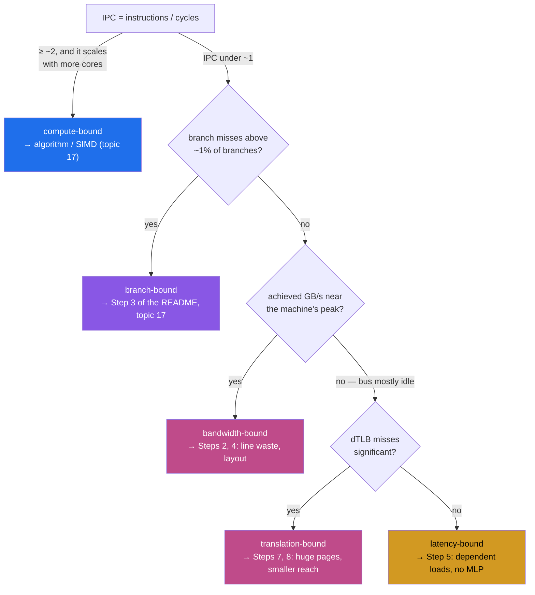

# CPU caches and TLBs: the constants aged, the structure didn't

Every latency table in topic 0 §2 is a compressed version of one 2007 paper —
Drepper's "What Every Programmer Should Know About Memory". Before you open
its 114 pages, this chapter builds the ten concepts the paper assumes, one
at a time — then hands you a section-by-section reading lens, and finally a
table mapping each concept to the counter and the experiment that identify it
in someone else's program. The DDR2 numbers are stale; the cache-organization
math, the prefetching rules, and the measurement methodology behind
`cache_ladder` are forever.

**Which numbers belong to which era.** Drepper measured on a Pentium 4, a
Pentium M and an early Core 2 in 2007. This repo measured on an Apple M3 Pro
in 2026. Both sets of numbers appear below and they are *never* mixed: a
figure sourced as **(§x.y)** or **(Fig x.y)** is Drepper's, quoted from
`cpumemory.pdf` version 1.0 (November 21, 2007) with the section, figure or
table it came from; a figure sourced as **(notes.md)** or **(FINDINGS row N)**
was measured by a lane in this repo on the M3 Pro on 2026-07-28. Where the repo
has measured the same quantity Drepper did, the repo's number is the one the
argument leans on, and his is kept beside it to show what changed.

## The problem in one sentence

The gap between an L1 hit and a DRAM access is a factor of **102×** on the
machine this repo runs on — `cache_ladder` measures 1.02 ns at a 16–128 KB
working set and 104 ns at 128 MB ([notes.md](notes.md)) — so a load that misses
everything costs about as much as a hundred loads that don't. Everything in
Drepper's paper is machinery to hide that gap, and every database trick in
later topics (columnar layouts, B-tree fanout, vectorized execution) is a way
of cooperating with that machinery.

## The concepts, step by step

### Step 1 — the speed gap, and why caches exist

> **In:** nothing yet — this step fixes the ladder every later step measures
> against, and separates Drepper's 2007 constants from this repo's 2026 ones.
> **Out:** two latency ladders, nineteen years apart, and the one number that
> did not change: the *ratio* between the top and the bottom.

Memory got bigger much faster than it got faster. The fix: put small, fast
memories *between* the core and DRAM, and keep recently-used data there. A
**cache hit** means the line was found at that level; a **cache miss** means go
down one level and wait. A **working set** is the set of bytes a program is
actively touching at a given moment — the quantity every graph in the paper
plots along its X axis.

Drepper's ladder, quoted exactly as §3.2 prints it (page 16, the unnumbered
table introduced with "These are the numbers Intel lists for a **Pentium M**"):

```
Drepper §3.2, page 16 — Intel's published Pentium M figures, 2007:

  To Where        Cycles
  Register         ≤ 1
  L1d             ~ 3
  L2              ~ 14
  Main Memory     ~ 240
```

This repo's ladder, measured by `cache_ladder` on an Apple M3 Pro
([notes.md](notes.md), "Experiment 1"):

| Working set | ns/access (measured) | Level, and how we know |
|------------:|---------------------:|------------------------|
| 16 KB–128 KB | **1.02** | L1 — the plateau ends exactly at 128 KB, the P-core L1d size |
| 512 KB–1 MB | **5.3–5.8** | L2 |
| 4–8 MB | **7.6–9.0** | still L2 — Apple's per-cluster L2 is 16 MB-class |
| 16 MB | **17.1** | falling out of L2 into the SLC |
| 32 MB | **59.6** | SLC → DRAM transition |
| 64 MB | **87.4** | DRAM |
| 128–512 MB | **104–113** | DRAM plus a growing TLB-miss share (Step 8) |

The **SLC** (system level cache) is Apple's shared last-level cache — the
structural replacement for the inclusive L3 in Drepper's Fig 3.2, sitting behind
every cluster's L2 rather than inside the CPU complex. Drepper's machines had no
level between L2 and DRAM at all, which is why his Fig 3.4 shows three plateaus
and the table above shows five.

The two ladders are not comparable unit-for-unit — one is cycles on 2007
hardware, the other is nanoseconds on a much wider core with a cache level
Drepper's machines did not have. What *is* comparable is the ratio across the
ladder. Drepper's: 240 ÷ 3 = **80×** from L1d to main memory. This repo's:
104 ÷ 1.02 = **102×**. Nineteen years and an instruction-set change later, the
shape is the same and the spread got slightly worse.

That is the sentence to carry into the rest of the paper: **the constants aged;
the ratio did not.** The whole game is what fraction of your loads hit near the
top.

### Step 2 — the cache line, and how much of it you actually use

> **In:** the ladder from Step 1, which priced *one access*.
> **Out:** the unit that access actually moves — a fixed-size line — and a
> utilization fraction that Steps 4 and 6 both consume.

Caches don't store individual bytes. They store **cache lines** — fixed-size
blocks, the smallest unit that ever moves between levels. Drepper §3.5.2 states
the sizes of his era plainly: "the cache line size is 64 or 128 bytes". His
measured machines all use **64 bytes** (he says so explicitly in §6.2.1: "with
64 bytes for the Core 2 processor"). Apple M-series uses **128 bytes** — a
number this repo did not take on faith but measured: topic 9 found that padding
contended counters to 64 B leaves them **1.8× slower** than padding to 128 B
([topic 9 notes.md](../09-concurrency/notes.md)), which only happens if the
coherence granule is 128.

Load one byte and the hardware fetches the whole line it lives in. So the
question that decides a data layout is not "how many bytes do I read?" but
"how many bytes did the machine move to give me them?"

**The formula.** For a loop that touches `e` bytes of every element, with
`s` bytes between the starts of consecutive touched elements (the **stride**),
on a machine with `L`-byte lines:

```
  n = max(1, floor(L / s))     elements whose bytes land inside one line
  U = (e × n) / L              fraction of each transferred line the loop uses

  e = bytes actually read per element
  s = stride, bytes between consecutive touched elements
  L = cache-line size (64 on Drepper's machines, 128 on Apple M-series)
  n = elements per line
  U = utilization — 1.0 means nothing was wasted
```

Worked on five concrete cases. The first two are Drepper's own matrix
multiplication from §6.2.1, which is the whole argument of §6.2 in two lines of
arithmetic:

```
1. §6.2.1 naive inner loop, mul2[k][j], N=1000 doubles, L=64:
     e = 8      (one double)
     s = 8 × 1000 = 8000   (the inner loop advances the ROW of mul2)
     n = max(1, floor(64 / 8000)) = max(1, 0) = 1
     U = (8 × 1) / 64 = 0.125           →  12.5% used, 87.5% of every line wasted

2. §6.2.1 after transposing mul2 into tmp[j][k], L=64:
     e = 8, s = 8
     n = floor(64 / 8) = 8
     U = (8 × 8) / 64 = 64 / 64 = 1.0   →  100% used

3. Fig 3.11 NPAD=7 — a list whose elements are one line wide, L=64:
     e = 8 (the `n` pointer), s = 64
     n = floor(64 / 64) = 1
     U = 8 / 64 = 0.125                 →  12.5%

4. Row layout on M-series: one 8-byte column of a 128-byte row, L=128:
     e = 8, s = 128, n = 1
     U = 8 / 128 = 0.0625               →  6.25% used, 93.75% wasted

5. Column layout on M-series: the same column stored contiguously, L=128:
     e = 8, s = 8
     n = floor(128 / 8) = 16
     U = (16 × 8) / 128 = 1.0           →  100% used
```

Cases 4 and 5 are topic 12 (columnar storage) in six lines of division: the
same filter, the same 8 bytes of answer, **16× fewer bytes moved**. Cases 1 and
2 are Drepper measuring the same effect on a Core 2 in 2007 — Table 6.2 records
the naive multiply at 16,765,297,870 cycles and the transposed one at
3,922,373,010, which is 23.4% of the original (the paper's own figure; the
division confirms 23.40%). The transpose *added* a full copy of a 1000×1000
matrix and still won by 4.3×, because it moved case 1's utilization to case 2's.

Two consequences to carry forward:

- **Utilization has a floor, not a slope.** Once `s ≥ L`, `n` is pinned at 1 and
  `U = e / L` no matter how much bigger the stride gets: 6.25% at stride 128 on
  M-series, and still 6.25% at stride 4096. Growing the stride past one line
  stops costing you *line* waste — after that it costs you prefetcher coverage
  (Step 4) and pages (Step 8) instead. That is the answer to Question 2.
- **Neighbours are free.** Once the line is in L1, the other 120 bytes cost
  nothing. Sequential scans exploit this; pointer chasing throws it away.

### Step 3 — where can a line live? Sets, ways, and conflict misses

> **In:** the cache line from Step 2, which now needs somewhere to go.
> **Out:** the address arithmetic that places it, and the third kind of miss —
> the one you can cause on purpose, which the profiler table's row 3 exploits.

A cache can't compare every line's address on every load — that would be too
slow. So it is organized like a hash table with fixed-size buckets: some middle
bits of the address pick a **set** (the bucket), and each set holds `N` lines.
`N` is the **associativity**, and a cache holding `N` lines per set is called
**N-way set-associative**. A new line evicts one of the `N` residents *of its
own set only*.

Drepper §3.3.1 gives the identity that connects the three:

```
Drepper §3.3.1, page 19:

  cache size = cache line size × associativity × number of sets

  O = log2(cache line size)      bits of the address used as the line offset
  S = log2(number of sets)       bits of the address used as the set index
```

**Worked on his own example** (§3.3.1 states the answers, so this checks both
the formula and the transcription):

```
Drepper's 4 MB, 64-byte-line, 8-way L2:
  number of sets = 4,194,304 / (64 × 8) = 4,194,304 / 512 = 8,192 sets
  S = log2(8,192) = 13 bits
     (§3.3.1, page 19, verbatim: "Given our 4MB/64B cache and 8-way set
      associativity the cache we are left with has 8,192 sets and only 13 bits
      of the tag are used in addressing the cache set.")
  8 tags compared in parallel per lookup (§3.3.1: "8 tags have to be compared")

The stride that thrashes it — the set-index period:
  period = number of sets × line size = 8,192 × 64 = 524,288 B = 512 KB
  ⇒ any two addresses exactly 512 KB apart share a set
  ⇒ nine addresses at that spacing overflow an 8-way set: 9 > 8, so every
    touch evicts one that will be needed again. The cache is 4 MB and the
    working set is nine lines = 576 bytes.

The same arithmetic for this repo's machine (L1d = 128 KB measured, notes.md;
128-byte lines measured, topic 9 notes.md; 8-way ASSUMED, not measured):
  number of sets = 131,072 / (128 × 8) = 128 sets
  period = 128 × 128 = 16,384 B = 16 KB
  ⇒ a row stride of exactly 16 KB is the pathological one to construct
```

That last block is where the profiler table's "pad the stride by one line
(4096 → 4096+128)" advice comes from: shifting every row by one line walks the
set index forward instead of repeating it.

This gives the three miss types their vocabulary:

- **Cold (compulsory)** — first touch of that line, unavoidable.
- **Capacity** — the working set is simply bigger than the cache.
- **Conflict** — the *set* is full even though the *cache* isn't, as in the
  576-byte working set above.

Drepper measures how much associativity buys, in Table 3.1 (L2 misses for a
`gcc` run, 32-byte lines). He asserts the trend; the divisions are ours:

```
Drepper Table 3.1, 8 MB cache, CL=32 — misses, and the saving from each doubling:

  direct → 2-way:   4,731,904 → 2,690,498   saved 2,041,406 / 4,731,904 = 43.1%
  2-way  → 4-way:   2,690,498 → 2,207,655   saved   482,843 / 2,690,498 = 17.9%
  4-way  → 8-way:   2,207,655 → 2,111,075   saved    96,580 / 2,207,655 =  4.4%
```

§3.3.1 calls the first step "almost 44%" — the division on his own table gives
43.1%, close enough that the rounding is the only disagreement. The three
numbers together are the honest version of his prose claim that "the successive
gains are much smaller": the second doubling is worth 2.4× less than the first,
and the third is worth 10× less. For the associativity levels of 2007, §3.3.1
says "Today processors are using associativity levels of up to 24 for L2 caches
or higher. L1 caches usually get by with 8 sets." — where "8 sets" is a slip for
*8 ways*, as the surrounding paragraph about comparators makes clear. Quote the
number, not the word.

### Step 4 — the prefetcher: hardware that bets on your next load

> **In:** the access pattern implied by Step 2's stride, laid out over Step 3's
> sets.
> **Out:** the measured size of the latency the hardware hides for free, and
> the exact list of patterns it cannot hide — the premise Step 5 removes.

**Prefetching** is the memory system speculatively fetching lines you have not
asked for, on the bet that your pattern will continue. Drepper §6.3.1 states
the rules his era's hardware followed, and they have not fundamentally changed:

- The trigger is "a sequence of **two or more** cache misses in a certain
  pattern" — one miss never starts a prefetch, because random accesses to
  globals are common and would waste bandwidth.
- Fixed strides are recognized, not just adjacent lines, but the recognition
  range is bounded: §6.3.1 says the range "has been increased over the years,
  but it probably does not make much sense to go beyond the 512 byte window
  which is often used today". Treat ~512 B as the outer edge of a stride the
  hardware will follow.
- "CPUs today can keep track of **eight to sixteen** separate streams" for the
  higher-level caches — and that budget is *shared* with every other core and
  hyper-thread on the same cache.
- "Prefetching has one big weakness: **it cannot cross page boundaries**",
  because a speculative fetch must never trigger a page fault the program did
  not ask for. So you take a miss at every page boundary regardless.
- "Currently prefetch units do not recognize non-linear access patterns."

**How much is it worth?** Drepper answers this with an accident of Fig 3.10 that
is easy to miss. On his Pentium 4 (16 kB L1d, 1 MB L2), a sequential walk over
a linked list costs about **4 cycles** per element inside L1d, and then — past
the 1 MB L2, where every access is going to main memory — it costs about
**9 cycles** per element. §3.3.2 spells out the comparison itself: "Before we
said that a main memory access takes 200+ cycles. Only with effective
prefetching is it possible for the processor to keep the access times as low as
9 cycles."

```
Drepper §3.3.2, Fig 3.10 — what sequential prefetching is worth, 2007:
  unhidden main-memory access   200+ cycles      (§3.3.2's own figure)
  measured sequential walk        9  cycles      (Fig 3.10, working set > L2)
  hidden                        200 / 9 = 22×
```

A second detail in the same figure is stranger and more instructive: in the L2
range the walk shows ~9 cycles per element when the L2's own access latency is
~14 (§3.2's table). The walk is *faster than the cache it is reading from*,
because the next line is already halfway loaded when the loop reaches it.
Prefetching does not just avoid the DRAM trip; it removes the L2 trip from the
critical path.

The bet fails on random access, and Fig 3.15 measures the failure:

```
Drepper Fig 3.15 (§3.3.2), same list, same machine, order shuffled:
  sequential, working set ≫ L2       ~9   cycles/element   (also Fig 3.10)
  random,     working set ≫ L2      450+  cycles/element
  gap                                450 / 9 = 50×

This repo, Apple M3 Pro, the same comparison in nanoseconds:
  streaming scan, topic 12 scan_bench:  800 MB / 0.014 s = 57.1 GB/s
    ⇒ one 128 B line every 128 / 57.1e9 = 2.24 ns
  dependent random chase, cache_ladder at 128 MB:     104 ns per line
  gap                                    104 / 2.24 = 46×
```

Two machines nineteen years apart, and the sequential-vs-random gap is 50× on
one and 46× on the other. This is the correction to a folk figure the earlier
version of this chapter repeated: the gap is **not** "about 10×". It is about
**50×**, and it has been about 50× since 2007.

Note what Drepper says about *why* random loses even when both are going to
DRAM: §3.3.2 attributes it to three stacked causes — no prefetch, a rising L2
miss ratio (Table 3.2 puts random at 13.4% miss at a 1 MB working set against
sequential's 0.94%, and 57.8% against 4.67% at 512 MB), and TLB misses (Step 8,
and Fig 3.17, where limiting the randomization to page-sized blocks recovers
"up to 38%").

### Step 5 — dependent loads: the one latency you cannot hide

> **In:** Step 4's finding that the prefetcher covers predictable patterns.
> **Out:** the cost of a miss when *nothing* can cover it — measured twice on
> the same machine, 11× apart — plus the instrument that measures it, which
> Steps 6 and 8 both reuse.

A load is **dependent** when the core cannot compute its address until an
earlier load has come back. `chain[idx]` where `idx` was itself loaded from
memory; `node->next->next`; a B-tree descent, where the child pointer lives
inside the parent node you are still waiting for.

Why that one word decides everything: an out-of-order core does not run one
load at a time. It keeps hundreds of instructions in flight and issues *every*
load whose address it already knows, so several misses sit in the memory system
simultaneously. This is **memory-level parallelism (MLP)** — the number of
outstanding misses the machine is servicing at once — and it means the cost of
a miss is not a property of the miss. It is a property of how many other misses
could keep it company. Drepper puts the same point at the head of §6.3: "To
cover the latency of main memory accesses, the command queue would have to be
incredibly long."

```
ILLUSTRATION — round numbers, not measurements. The measured version of this
diagram is the table immediately below it.

independent loads — a[0], a[1], a[2]: all three addresses computable right now

  load A  ├──────── ~100 ns ────────┤
  load B   ├──────── ~100 ns ────────┤        three misses overlap in the
  load C    ├──────── ~100 ns ────────┤       memory system
                                      └─► ~105 ns total ⇒ ~35 ns "per miss"

dependent loads — B's address IS the value A returned

  load A  ├──────── ~100 ns ────────┤
  load B                            ├──────── ~100 ns ────────┤
  load C                                                      ├─── ~100 ns ───┤
                                                                              └─► ~300 ns total ⇒ 100 ns each
```

This repo measured both sides of that diagram on the same machine
([notes.md](notes.md)):

| what | working set | ns per access |
|------|------------:|--------------:|
| `lookup_shootout` `hashmap` at n=1e7 — 1024 **independent** probes | ~160 MB | **9.3** |
| `cache_ladder` at 128 MB — a **dependent** chase | 128 MB | **104** |

Both are random DRAM accesses that "should" cost ~100 ns. 104 ÷ 9.3 = **11.2×**,
and the difference is overlap and nothing else. That is why the hash table
looked suspiciously flat at ten million keys (7.4 ns at n=100 to 9.3 ns at
n=1e7, [notes.md](notes.md)), and why a *single* isolated lookup in the capstone
would not enjoy the same number.

The chase is how you measure the un-hidable case. Three properties of
[`cache_ladder`](experiments/benches/cache_ladder.rs) do the work, and the file
is short enough to read whole:

```rust
// topics/00-performance-toolbox/experiments/benches/cache_ladder.rs — chase, 25-31
    25  fn chase(chain: &[usize], start: usize, steps: usize) -> usize {
    26      let mut idx = start;
    27      for _ in 0..steps {
    28          idx = chain[idx];
    29      }
    30      idx
    31  }
```

Line 28 is the entire experiment. The value loaded *is* the next address, so the
dependency lives in the data, not in the code: it cannot be reordered, hoisted
or speculated around by any compiler or any core, because the next address
genuinely does not exist yet. One miss in flight, always. Line 30 returns `idx`
so the loop is not dead code.

The second property is in the chain's construction:

```rust
// topics/00-performance-toolbox/experiments/benches/cache_ladder.rs — make_chain, 14-23
    14  fn make_chain(len: usize, rng: &mut StdRng) -> Vec<usize> {
    15      let mut order: Vec<usize> = (0..len).collect();
    16      order.shuffle(rng);
    17      let mut chain = vec![0usize; len];
    18      for w in order.windows(2) {
    19          chain[w[0]] = w[1];
    20      }
    21      chain[order[len - 1]] = order[0];
    22      chain
    23  }
```

Line 16 makes it **random**, which kills the prefetcher (Step 4 — no stride to
extrapolate, and no non-linear pattern is recognized at all). Line 21 makes it
**cyclic** — it closes the permutation into a single cycle covering every slot,
so no short sub-cycle can quietly live in L1 and flatter the big sizes. The
generator is seeded (`StdRng::seed_from_u64(42)`, line 36), so the chain is the
same on every run.

The third property is the one that was originally wrong:

```rust
// topics/00-performance-toolbox/experiments/benches/cache_ladder.rs — the bench closure, 50-57
    50              // Carry the position across iterations: restarting at 0 every iter
    51              // re-walks the same `steps` slots, which stay cached — at 512MB that
    52              // silently measures an ~8MB hot path instead of DRAM.
    53              let mut idx = 0usize;
    54              b.iter(|| {
    55                  idx = chase(black_box(chain), idx, steps);
    56                  black_box(idx)
    57              })
```

Line 53 sits *outside* `b.iter`, which is the whole fix. The first version of
this benchmark declared `idx` inside the closure, so every criterion iteration
re-walked the same 65,536 slots (`steps`, line 43) and reported **~25 ns** for
"DRAM" — it had measured an ~8 MB hot path that the benchmark itself created
([notes.md](notes.md), "First version lied"). The correct answer at 512 MB is
113 ns. A benchmark that creates the cache residency it then measures is topic
0's headline failure mode, and this file is where the repo committed it.

The readout is unusually direct: with no arithmetic between the loads,
`elapsed / steps` **is** the latency of one access at that working-set size.
Sweep the size from 16 KB to 512 MB (line 39-42) and the plateaus are the cache
levels. This is the same experiment as Drepper's Fig 3.4 — cycles per operation
against working-set size, with the levels readable off the plateaus — and it is
the only number in this repo you can compare to a datasheet without an argument.

The database consequence is the whole curriculum: pointer-chasing layouts
(linked lists, naive trees, record-per-node graph stores) pay full latency per
hop, while layouts that expose addresses up front (arrays, matrices,
page-sized nodes, batched lookup APIs) convert latency into throughput. When a
later topic says a design "exposes memory-level parallelism", it means: the
addresses are knowable early enough to overlap the waiting. Topic 3 is this
step's bill arriving — B-tree lookups climb **862 → 1101 ns** from 1e6 to 4e6
keys while the tree's height stays at 3 ([FINDINGS row 3](../../FINDINGS.md)).
Height sets how many pointers you chase; residency sets what each chase costs.

### Step 6 — latency and bandwidth are opposite questions

> **In:** the two measured numbers from Step 5 — 9.3 ns overlapped and 104 ns
> serialized — plus Step 2's utilization fraction.
> **Out:** the ratio that says which of the two walls a loop is against, run on
> four of this repo's lanes. The profiler table at the end of the chapter is
> this step applied to code you did not write.

Look again at Step 5's diagram and notice what it implies about the *bus*. A
dependent chase moves one line per 104 ns and then stops to think. That is
128 ÷ 104e-9 = **1.23 GB/s**, on a machine whose peak memory bandwidth is
150 GB/s ([topic 12 notes.md](../12-columnar-analytics/notes.md)). It is slow
while doing almost nothing. Nothing you can do about the bus will help it.

Two definitions, because these words get used interchangeably and must not be.
**Latency-bound** means the loop is waiting on the *round trip* of an access it
could not start earlier; the fix is more overlap (more independent addresses,
batched APIs, prefetch hints), and the bus is idle while it happens.
**Bandwidth-bound** means the loop has already saturated the *rate* at which
bytes can arrive; the fix is moving fewer bytes (Step 2's utilization), and more
overlap does nothing at all.

**Utilization: how close to the wall is this lane?**

```
  B_peak = 150 GB/s        this machine's peak memory bandwidth (topic 12 notes.md)
  B_ach  = Q / t           bytes the lane moved, divided by how long it took
  Util   = B_ach / B_peak  the fraction of the bus the lane is using

lane                                          Q / t                    B_ach     Util
topic 12 scan_bench, small-range random   800 MB / 0.014 s          57.1 GB/s   38.1%
topic 12 scan_bench, sorted low-card      800 MB / 0.033 s          24.2 GB/s   16.2%
topic 0  lookup_shootout hashmap n=1e7    128 B  / 9.3 ns           13.8 GB/s    9.2%
topic 0  cache_ladder at 128 MB           128 B  / 104 ns            1.23 GB/s   0.82%

  FINDINGS row 12 states the top two rows as the headline: "The scan floor is
  24–57 GB/s on a 150 GB/s machine."
```

(The two `lookup_shootout` and `cache_ladder` rows assume one 128-byte line per
access, which is a floor — a hash probe may touch a second line. All four `Q`
and `t` values come from [notes.md](notes.md) and
[topic 12 notes.md](../12-columnar-analytics/notes.md). The `B_ach` column is
this chapter's own division on the times those files print, so it differs from
the GB/s those files print by the rounding in `t`: 57.1 here against the lane's
57.0, and 24.2 against 24.4. Topic 12's notes also warn that repeat runs put
this lane anywhere from 24 to 76 GB/s depending on machine state, so treat the
utilization column as an order of magnitude, not a constant — which is all the
memory-bound-vs-latency-bound question needs.)

Read the column. The columnar scan at 38% of peak on a single core is against
the bandwidth wall; buying it more overlap is pointless, and topic 12 spends its
whole chapter moving fewer bytes instead. The pointer chase at 0.82% is against
the latency wall with 99% of the bus sitting idle; it does not need a better
layout, it needs more addresses known earlier. The hash probe at 9.2% is the
interesting one — already overlapping 11× better than the chase (Step 5), and
still using less than a tenth of the bus, which is why Question 4 asks you to
prove there is more MLP left in it.

**Arithmetic intensity: at what point does a loop stop being memory-bound?**

```
  W  = useful operations the kernel performs
  Q  = bytes it must move
  I  = W / Q              arithmetic intensity, operations per byte
  P  = ops/s the core can retire
  B  = bytes/s the memory system can sustain for this kernel
  I* = P / B              the RIDGE POINT — the machine's balance

  the loop is memory-bound  iff  I < I*
```

Run it on topic 12's `scan_bench` lane, which folds 100 M `u64` with
`wrapping_add`:

```
  W = 100,000,000 adds
  Q = 100,000,000 × 8 = 800,000,000 bytes
  I = 100e6 / 800e6 = 0.125 adds per byte

  B = 57.1 GB/s        the best single-core streaming bandwidth this repo has
                       MEASURED (topic 12 notes.md, small-range random lane)
  P = 16e9 adds/s      ASSUMED: 4 u64 adds per cycle at 4.0 GHz. This repo has
                       not measured peak scalar issue rate, so this is a stated
                       assumption, not a figure.

  I* = 16e9 / 57.1e9 = 0.28 adds per byte
  I  = 0.125  <  I* = 0.28    ⇒ memory-bound, by a factor of 0.28 / 0.125 = 2.24×

  What would it take to reach the ridge?
    ops per 8-byte element at the ridge = I* × 8 = 0.28 × 8 = 2.24
    the lane does 1. It would have to more than double its work per element
    before bandwidth stopped being the limit.

  Sensitivity, because P was assumed rather than measured:
    at 8 adds/cycle,  I* = 32e9 / 57.1e9 = 0.56  ⇒ still memory-bound, by 4.5×
    at 2 adds/cycle,  I* =  8e9 / 57.1e9 = 0.14  ⇒ still memory-bound, by 1.1×
  The conclusion does not flip anywhere in that range, which is the point of
  computing a ridge instead of asserting one.
```

That last block is topic 0 §4's roofline paragraph with the division actually
performed. It is also why the profiler flowchart below asks "achieved GB/s near
the machine's peak?" before it asks anything about TLBs: the answer to that one
question separates two diagnoses whose fixes are opposites.

### Step 7 — virtual memory: every address you use is fake

> **In:** every address Steps 1–6 loaded from, which they all quietly assumed
> was a real place in DRAM.
> **Out:** the translation those addresses need, priced in dependent loads —
> Step 5's chain, running in silicon in front of your access. Step 8 caches it.

Every pointer your program holds is a **virtual address** — a number meaningful
only inside your process. The physical DRAM location is decided by the OS,
which gives each process its own address space, maps pages lazily (your `Vec`
allocation may have no physical memory behind it until first touch), shares
pages between processes, and backs some of them with files. So *every* load
needs a translation: virtual page → physical frame. The map is the **page
table**, and it lives, awkwardly, in memory itself.

**Why a tree and not an array.** Drepper does this arithmetic in §4.2 for his
era: with 4 kB pages on a 32-bit machine the offset is 12 bits, leaving 20 bits
of page number, so a flat table is 2²⁰ entries × 4 bytes = **4 MB** per process —
and "with each process potentially having its own distinct page directory much
of the physical memory of the system would be tied up". The same arithmetic on
this machine is far worse:

```
  47-bit user address space, 16 KB pages (Apple M-series):
    pages   = 2^47 / 2^14 = 2^33 = 8,589,934,592 pages
    flat    = 2^33 × 8 bytes = 2^36 = 64 GB of page table, per process
```

Unaffordable, so it is a **radix tree**: the virtual address is chopped into
fixed-width slices, each slice indexes one level, and only the sub-tables that
actually have mappings are ever allocated. An idle process's page table is a
few KB. You pay for sparsity with depth — and depth here means *loads*.
Drepper's §4.2 puts the same trade in one sentence, typo and all: "The level
then form a huge, sparse page directory; address space regions which are not
actually used do not require allocated memory."

**How the address is chopped** (x86-64, 4 kB pages — the paper's case, Fig 4.2):

```
 47        39 38        30 29        21 20        12 11          0
┌────────────┬────────────┬────────────┬────────────┬─────────────┐
│  9 bits    │   9 bits   │   9 bits   │   9 bits   │  12 bits    │
│  L4 index  │  L3 index  │  L2 index  │  L1 index  │  offset     │
└─────┬──────┴─────┬──────┴─────┬──────┴─────┬──────┴──────┬──────┘
      │            │            │            │             └─ byte inside the page,
      ▼            ▼            ▼            ▼                never translated
   ┌──────┐    ┌──────┐    ┌──────┐    ┌──────┐
   │ PGD  │───►│ PUD  │───►│ PMD  │───►│ PTE  │───► physical frame number
   └──────┘    └──────┘    └──────┘    └──────┘             │
   ▲ load 1      load 2      load 3      load 4             ▼
   │                                              + offset ──► your data, at last
   └── CR3: physical address of this process's top table (swapped on context switch)

why 9 bits: one table is one 4 kB page = 4096 / 8 = 512 entries = 2⁹
  (Drepper §4.2: "on x86-64 with 4kB pages and 512 entries per directory")
why dependent: each entry holds the *physical address of the next table*, so
  load N+1's address is unknown until load N returns — Step 5's chain, in
  silicon, running BEFORE your actual access can even issue. §4.3: "These
  accesses cannot be parallelized since they depend on the previous lookup's
  result."
```

The same tree, three vocabularies for the same four levels — you will meet all
three while reading:

| level | x86 manuals | Linux source | ARMv8 |
|-------|-------------|--------------|-------|
| top   | PML4        | PGD          | L0    |
| ↓     | PDPT        | PUD          | L1    |
| ↓     | PD          | PMD          | L2    |
| leaf  | PT          | PTE          | L3    |

**Apple Silicon is shallower, because its pages are bigger.** With a 16 kB
granule a table holds 16384 / 8 = 2048 entries = **11 bits** of index, and the
offset takes 14 bits. So `14 + 11 + 11 + 11 = 47` — a 47-bit user address space
is covered in **three** levels, not four. Bigger pages buy a shorter walk *and*
4× the TLB reach (Step 8) from the same entry count. Drepper predicted exactly
this in §4.3.2: "There is a second effect of using larger page sizes: the number
of levels of the page table tree is reduced."

**What a walk costs.** §4.3 prices the best case in his own numbers, and the
paper states the answer, so this checks the transcription:

```
Drepper §4.3, page 38:
  "on a machine with four page table levels, require at the very least 12 cycles"
  ⇒ 4 levels × 3 cycles (§3.2's L1d figure) = 12 cycles, if every level hits L1d

The other end of the range, using §3.2's own Main Memory figure:
  4 levels × 240 cycles = 960 cycles, if every level misses to DRAM

The same two bounds on this machine, with three levels and MEASURED latencies
(notes.md):
  all-hit:  3 × 1.02 ns =   3.1 ns
  all-miss: 3 × 104  ns = 312   ns
```

**Four things keep this from being catastrophic**, and knowing them is the
difference between fearing the diagram and predicting it:

- **Hardware walks it, not the kernel.** The MMU's page-table walker does those
  loads in silicon, costing nanoseconds; Drepper §4.2 notes x86 and x86-64 "perform
  this operation in hardware". The kernel only gets involved when there is no
  valid entry — a **page fault**, which is microseconds. §6.2.4 makes the
  relative sizes explicit — and then immediately qualifies it, which is the part
  usually dropped: "Page faults are orders of magnitude more expensive than TLB
  misses but, if a program is running long enough and certain parts of the
  program are executed frequently enough, TLB misses can outweigh even page fault
  costs."
- **The tables are ordinary cacheable memory.** The upper levels are touched by
  every access in the region, so they normally sit in L1/L2 — which is what
  makes the 12-cycle bound the realistic one and the 960-cycle bound the
  pathological one.
- **There are dedicated page-walk caches** (x86 paging-structure caches, ARM
  walk caches) holding partial translations, so a walk often skips its first
  levels entirely. This is post-2007 hardware; the paper does not describe it.
- **Huge pages truncate the walk.** An entry at the PMD/L2 level can be a
  *block* descriptor pointing straight at 2 MB of contiguous physical memory
  (32 MB with a 16 kB granule) instead of at another table — one fewer load, and
  one TLB entry covering far more address space (Step 8 does that division).

So: worst case is three or four dependent DRAM loads *added in front of* your
access; typical case is far less. The measurement is in
[notes.md](notes.md) and it lands where this predicts:

```
  cache_ladder's tail, 64 MB → 512 MB:   87.4 → 113 ns
  added per access:                      113 − 87.4 = 25.6 ns
  as a fraction of a fully cold 3-level walk:  25.6 / 312 = 8.2%
```

Not the 312 ns of three cold DRAM loads, not zero either. 8.2% of a cold walk is
what it looks like when the upper levels are cached and the walk caches are
doing their job. That +25.6 ns *is* this diagram, priced.

### Step 8 — the TLB: a cache for translations, with tiny reach

> **In:** the walk from Step 7, which is far too expensive to do per access.
> **Out:** the reach arithmetic, and the second cliff it puts in Step 1's
> ladder — the one that explains `cache_ladder`'s last two rows.

Doing that three-or-four-load walk per access would be absurd, so completed
translations are cached in the **TLB** (translation lookaside buffer) — a small,
very fast cache holding virtual-page → physical-frame results. Drepper §4.3
describes what is stored precisely, and the detail matters: it is not the
directory entries that are cached but "the complete computation of the address
of the physical page", tagged by the virtual address minus its offset bits.

The catch is **reach** — the total amount of address space the TLB's entries can
cover at once:

```
  Reach = entries × page size

Drepper's measurement (§3.3.2, Fig 3.12 — one 64-byte list element per page):
  the spike appears when the working set reaches 2^13 bytes
  2^13 / 64 = 128 elements = 128 pages, against 2^12 / 64 = 64 pages just below
  §3.3.2's conclusion: "we can compute that the TLB cache has 64 entries"
  Reach = 64 × 4,096 = 262,144 B = 256 KB

This machine (notes.md), where the cliff is measured rather than the entry count:
  512 MB / 16 KB pages = 32,768 pages in the working set
   64 MB / 16 KB pages =  4,096 pages
  cache_ladder: 87.4 ns at 64 MB → 113 ns at 512 MB, i.e. +25.6 ns per access
  ⇒ reach lies somewhere between those two page counts, and the ladder's last
    two rows are the cost of exceeding it
```

Working sets beyond reach miss in the TLB *as well as* in the caches, and the
two penalties stack — Drepper §3.3.2 is explicit that "the address translation
penalties are additive to the memory access times", which is why Fig 3.11's
NPAD=31 curve exceeds the machine's own DRAM latency.

This is why databases care about **huge pages** — pages larger than the OS
default, which multiply reach without needing more TLB entries:

```
  4 kB → 2 MB pages:   2,097,152 / 4,096 = 512× the reach
  4 kB → 1 GB pages: 1,073,741,824 / 4,096 = 262,144× the reach
  4 kB → Apple's 16 kB base page: 16,384 / 4,096 = 4× the reach, for free,
    on every process, with no configuration at all
```

Drepper §4.3.2 lists the cost of the 2 MB version honestly and then names the
one workload it is worth it for: the pages "must be contiguous in physical
memory", which means "finding a free area with 512 contiguous pages ... can be
extremely difficult (or impossible) after the system runs for a while"; on Linux
of that era they had to be reserved at boot via `hugetlbfs`. His conclusion:
"huge pages are the way to go in situations where performance is a premium,
resources are plenty, and cumbersome setup is not a big deterrent. **Database
servers are an example.**"

### Step 9 — coherence: why a write is a bus event

> **In:** Step 1's observation that each core has its own L1/L2 — which Steps
> 2–8 never had to think about, because they were single-threaded.
> **Out:** the protocol that keeps those private caches consistent, and the
> message that makes a write expensive. Step 10 is what happens when you
> trigger it by accident.

Each core has its own L1 (and often L2), so the same line can exist in several
places at once. **Cache coherence** is the hardware guarantee that all those
copies agree: a program cannot observe two different values for one address.
Drepper §3.3.4 describes the protocol every mainstream machine uses, **MESI**,
named for the four states a line can be in:

- **Modified** — this core has changed the line; it is the only copy anywhere.
- **Exclusive** — unmodified, and known to be in no other core's cache.
- **Shared** — unmodified, and possibly present in other cores' caches.
- **Invalid** — unused.

The expensive transition has a name. When a core wants to write a line that
other cores may hold, it must first take exclusive ownership by broadcasting a
**Request For Ownership (RFO)** — a message that invalidates every other copy.
§3.3.4 calls it "the infamous ... (RFO) operation" — the elided words are
*Request For Ownership* in the paper's own quotation marks — and notes
that "performing this operation in the last level cache ... is comparatively
expensive". Two situations produce them: a thread migrating between cores, and a
line genuinely needed by two cores.

The consequence for a write-heavy multithreaded loop: §6.4.1 states it in one
line — "if multiple threads write to a memory location, the cache line must be
in 'E' (exclusive) state in the L1d of each respective core. This means that a
lot of RFO messages are sent, in the worst case one for each write access. So a
normal write will be suddenly very expensive."

Drepper also measures the aggregate effect on his four-processor box, Table 3.3
(speed-up at the largest working set, where the theoretical limits are 2 and 4):

```
Drepper Table 3.3 (§3.3.4) — measured speed-up, largest working set:

  #Threads    Seq Read   Seq Inc   Rand Add
     2          1.69       1.69      1.54
     4          2.98       2.07      1.65

  Random-access work scales 1.54× on two threads and 1.65× on four —
  §3.3.4: "it is almost not worth it to scale beyond two threads."
```

### Step 10 — false sharing: the pathology with no visible cause

> **In:** Step 9's RFO, plus Step 2's cache line as the unit of everything.
> **Out:** the one bug in this chapter that is invisible in the source code,
> and the padding constant this machine actually needs.

**False sharing** is the case where two threads write *different* variables that
happen to live in the same cache line. Nothing is shared at the language level;
everything is shared at the hardware level, because the line — not the variable
— is the unit the coherence protocol tracks (Step 2). Every write by one thread
invalidates the other's copy, so the line ping-pongs between cores and
multi-thread scaling collapses with no visible reason in the source.

Drepper measured it in §6.4.1 with the simplest possible program: N threads,
each incrementing its own memory location 500 million times, pinned to
individual processors on a four-P4 machine.

```
Drepper Fig 6.10 (§6.4.1) — same program, locations on one cache line vs on
separate cache lines. The overhead is "computed by dividing the time needed when
using one single cache line versus a separate cache line for each thread":

  2 threads:    390%
  3 threads:    734%
  4 threads:  1,147%
```

This repo's version of the same experiment, on Apple M-series
([topic 9 notes.md](../09-concurrency/notes.md), [FINDINGS row 9](../../FINDINGS.md)):

```
  packed (all counters in one line):  202.7 ms    197.4 M inc/s
  pad128 (one line each):              11.4 ms  3,502.9 M inc/s
  ratio: 202.7 / 11.4 = 17.8×, i.e. (17.8 − 1) × 100 = 1,680% overhead

  pad64 is STILL 1.8× slower than pad128 — `#[repr(align(64))]`, the x86
  default that most `CachePadded` types use, only HALF-fixes false sharing on
  this machine, because the coherence granule is 128 bytes.
```

1,680% on four Apple P-cores in 2026 against 1,147% on four Pentium 4s in 2007:
this is the one pathology in the whole paper that got *worse*, because cores got
faster relative to the interconnect.

One honest caveat that Drepper supplies himself and that is easy to over-claim
past. Figure 6.11 runs the identical program on a **single** quad-core package
(a Core 2 QX 6700) and finds no scaling problem at all — "there is a slight
overhead when using the same cache line more than once but it does not increase
with the number of cores." His 1,147% needed four separate *sockets*. So the
correct general claim is not "false sharing always costs 10×"; it is "false
sharing costs whatever the path between the two writers costs", which was
enormous across a 2007 front-side bus, negligible within one 2007 package, and
17.8× across the P-cluster of an M3 Pro. Measure it on the machine you have —
the differential in the profiler table takes about ten minutes.

Padding each thread's hot datum to its own line fixes it, at the cost of
footprint, which §6.4.1 flags as a genuine conflict with the rest of the paper's
advice. Quoted in full, because the elision people usually make hides *what* is
unacceptable: "There is a very simple 'fix' for the problem: put every variable
on its own cache line. This is where the conflict with the previously mentioned
optimization comes into play, specifically, the footprint of the application
would increase a lot. This is not acceptable." It is the footprint increase that
is unacceptable, not the padding itself — the blanket rule costs you everything
Steps 2 and 3 bought. Pad what is written by multiple threads; pack everything
else. (This pays off in topic 9, concurrency.)

## How to read the paper (with the concepts in hand)

The paper is 114 pages, version 1.0, dated November 21, 2007; §3–§4 are the
payload. The section numbers below were checked against the PDF's own headings.

- **§3.1–3.2** — skim; this is Steps 1–3 with 2007 diagrams. Do stop at the
  unnumbered cycles table at the end of §3.2 (page 16): ≤1 / ~3 / ~14 / ~240 is
  the ladder every later figure is denominated in. Fig 3.4 lives here too —
  "Access Times for Random Writes", the first working-set sweep in the paper and
  the same *shape* `cache_ladder` produces.
- **§3.3.1 — read carefully.** Associativity, the `size = line × ways × sets`
  identity, and Table 3.1. This is Step 3, and it is the only place in the paper
  that gives you the arithmetic to *construct* a conflict miss.
- **§3.3.2 — read most carefully of all.** The famous measurements, and the
  source of almost every number in this chapter: Fig 3.10 (sequential, ~4 and
  ~9 cycles), Fig 3.11 (the same walk with growing element sizes — Step 2's
  utilization, measured), Fig 3.12 (the TLB spike, and the 64-entry deduction),
  **Fig 3.15 (sequential vs random — the 50× gap)**, Table 3.2 (the miss ratios
  behind it) and Fig 3.17 (page-wise randomization, worth "up to 38%").
  Compare his plateau shapes with yours before explaining your numbers in
  `notes.md`. You now know why random loses even in DRAM: no prefetch (Step 4)
  + rising miss ratio + TLB misses (Step 8).
- **§3.3.4 — read carefully.** MESI, RFO, and the multi-thread scaling
  measurements (Figs 3.19–3.22, Table 3.3). This is Step 9.
- **§3.4** — instruction cache: skim (matters again at topic 19, JIT).
- **§3.5.1** — cache and memory bandwidth in bytes/cycle (Figs 3.24–3.29). Worth
  ten minutes for the method: he plots 16 B/cycle inside L1d falling to ~5.3
  B/cycle streaming from the FSB, with a visible step at 2¹⁸ bytes "due to the
  exhaustion of the DTLB cache". That is Step 6 and Step 8 in one graph.
- **§3.5.2** — critical word first / early restart: the CPU resumes as soon as
  the needed word arrives, before the rest of the line does. Note the measured
  size of the effect in Fig 3.30 — about **0.7%**. A famous mechanism with a
  tiny coefficient is a useful thing to have calibrated.
- **§4.1–4.3** — Steps 7–8. §4.2 is the radix tree, §4.3 prices the walk ("at
  the very least 12 cycles"), §4.3.1 covers TLB flushes on context switch, and
  §4.3.2 is huge pages, including the sentence that names database servers.
- **§4.4, §5** — virtualization and NUMA: skip until a NUMA box matters.
- **§6.2.1 — read carefully.** The matrix multiplication and Table 6.2. Note
  what it actually is: matrix *multiplication*, not a transpose benchmark, and
  the blocked version is **cache-aware, not cache-oblivious** — `SM` is defined
  as `CLS / sizeof(double)` with `CLS` supplied at compile time by
  `getconf LEVEL1_DCACHE_LINESIZE`. Table 6.2's four columns
  (100% → 23.4% → 17.3% → 9.47%) are the intellectual ancestor of
  blocked/vectorized execution (topic 11).
- **§6.2.2–6.2.4** — instruction cache, higher-level caches, and TLB usage;
  skim. §6.3.1 is worth reading in full — it is the only place the paper states
  the prefetcher's actual rules (Step 4).
- **§6.4.1 — read carefully.** False sharing, Figs 6.10 and 6.11. This is
  Step 10, *not* §3.5 — a mistake this chapter used to make.
- **§7** — memory performance tools: §7.1 (oprofile) and §7.2 (cachegrind) are
  the 2007 ancestors of the instrument list in the next section. The tool names
  aged; the two-instrument discipline did not.

What's stale vs. forever: DDR2 timings, front-side bus, and Pentium 4 details
aged; the organization math, miss taxonomy, and measurement method didn't. Keep
the Apple Silicon deltas in mind while reading: 128-byte lines (not 64), no
inclusive L3 (a shared SLC instead), much larger L1 (128 KB measured here), 16 kB
base pages, and a three-level page table.

## Finding these concepts in a real program

Steps 1–10 are visible in a microbenchmark you wrote on purpose. The harder
skill is spotting them in a program you did not write, where the pathology is
one loop among thousands. Three instruments, in the order you should reach for
them:

1. **A sampling profiler** (`samply`, `cargo flamegraph`, Instruments →
   Time Profiler) tells you *where* — which line owns the time. It cannot tell
   you *why*, and here is the trap that matters for this whole chapter: a
   sampling profiler attributes stall time to the instruction that is *waiting*.
   A memory-bound loop and a compute-bound loop look identical — one hot
   instruction — because "executing" and "blocked on DRAM" are the same sample.
   This repo hit exactly that: the `lookup_shootout` flamegraph in `notes.md`
   showed 21% in SipHash and ~79% in one inlined probe loop, and no amount of
   staring at it could split "hashing" from "waiting".
2. **Hardware counters** tell you *which wall*. This is the only instrument
   that distinguishes the ten concepts directly. On Linux: `perf stat`. On
   macOS there is no `perf` — Instruments → **CPU Counters** template gives you
   the events, and for real counter work run the same crate in a Linux VM or
   container. Drepper's §7.1 is the same idea with `oprofile`.
3. **A differential experiment** — change exactly one thing, re-measure —
   is the only fully portable instrument, and the one this repo leans on. Each
   row of the table below has one, because a counter tells you a number is high
   while a differential proves the *causal* link.

Start with the funnel: two counters (`instructions`, `cycles` → **IPC**, the
instructions the core retires per clock cycle) plus a branch-miss rate narrow
ten suspects to one or two.



The last branch is Step 6, and it is the one people get wrong: **latency-bound
and bandwidth-bound are opposites.** Both look "memory-bound" in a flamegraph,
and they have opposite fixes — more bandwidth-efficient layouts do nothing for a
pointer chase at 0.82% bus utilization, and more overlap does nothing for a scan
already at 38%.

| Concept | Signature in a profile | Counters (Linux `perf`) | Differential test that proves it |
|---|---|---|---|
| **1** Hierarchy at all | Low IPC, flat profile, time on loads | `cycles,instructions` | Shrink the dataset with the algorithm unchanged. Time/op drops sharply ⇒ you were paying the hierarchy, not the code. |
| **2** Cache-line waste | Hot loop touches one field of a wide struct | `cache-references,cache-misses`, plus achieved GB/s vs *useful* bytes | Split hot fields out (AoS→SoA) or shrink the struct. Faster with identical instruction count ⇒ you were paying for bytes you never read. Compute `U` first — Step 2's five cases take two minutes. |
| **3** Conflict misses | A cliff at a power-of-two size or stride, while the working set still "fits" | `L1-dcache-load-misses` high with a small working set | Pad the stride by one line (row stride 4096 → 4096+128). Faster ⇒ conflict, not capacity. Nothing else moves that. |
| **4** Prefetching | Sequential and random over the *same* data differ ~50× (Fig 3.15: 50×; this repo: 46×) | (vendor-specific prefetch events; weak) | Feed the same loop a sorted vs shuffled index array. The gap *is* the prefetcher's contribution. |
| **5** Dependent loads | One load instruction owns the samples, IPC ≪ 1, **and achieved bandwidth is low** — slow while the bus idles | `cycles,instructions`; on x86 the stall-on-memory events | Run k independent chases interleaved with k cursors. Per-step time falls ~k× until it saturates ⇒ you were latency-bound with spare MLP. Batched/vectorized lookup APIs exist to collect that k×. |
| **6** Which wall | Everything looks "memory-bound" | achieved GB/s ÷ peak GB/s | Compute the utilization table of Step 6 for your loop. Under ~10% of peak ⇒ latency; over ~30% ⇒ bandwidth. The two fixes are opposites, so guessing costs you a sprint. |
| **7–8** TLB / page walks | A *second*, later cliff after the DRAM plateau has flattened | `dTLB-loads,dTLB-load-misses` (x86: `dtlb_load_misses.walk_completed`) | Enable huge pages (`MADV_HUGEPAGE` / THP) or drop the working set under TLB reach. On macOS: compare above vs below reach — that is `cache_ladder`'s last two rows, 87.4 → 113 ns. |
| **9** Coherence / RFO | Time sits in *stores*; scaling flattens as soon as two threads write the same structure | `perf c2c`; on x86 the RFO / `mem_inst_retired` events | Make the shared structure per-thread and merge at the end. Scaling straightens ⇒ you were paying RFOs. |
| **10** False sharing | Multi-thread scaling collapses; time sits in a *store*; per-thread work is unchanged | `perf c2c` — the purpose-built tool | Pad each thread's datum to its own line (**128 B** on M-series — 64 B only half-fixes it here) and re-plot the scaling curve. Curve straightens ⇒ false sharing. |

Two habits that make this reliable:

- **Always pair a counter with a differential.** "Cache misses are high" is not
  a diagnosis; databases miss cache constantly and are fine. The differential
  answers the only question that matters — *would fixing it help?*
- **Compute the useful-bytes ratio by hand.** That is Step 2's `U`: bytes your
  algorithm needs ÷ bytes the machine moved. It needs no profiler, catches the
  waste instantly, and is the number that decides row-vs-column layouts in
  topic 12.

## Questions to answer in notes.md when done

1. Why does `cache_ladder` show *gradual* transitions between plateaus rather
   than steps? Drepper hit the same thing and diagnosed it in §3.3.2 — Fig 3.15's
   random curve "keeps on rising" instead of flattening, and Table 3.2 shows why.
   Which of his two causes apply to a random *cyclic* chain, and which does not?
2. Using Step 2's formula with `L = 128`, tabulate `U` for strides
   8, 16, 32, 64, 128, 256 and 4096 bytes over 8-byte elements. At what stride
   does `U` stop falling, and why does per-element time keep rising past that
   point anyway? Verify with a quick strided-read experiment.
3. How many memory accesses can a single TLB miss add on this machine's page
   table, and why is `cache_ladder`'s measured addition only 25.6 ns rather than
   the 312 ns of three cold DRAM loads? (Step 7's four mitigations; name the two
   that are doing most of the work.)
4. Take `lookup_shootout` at n=1e7 — 9.3 ns per probe over a ~160 MB table, 9.2%
   of the bus by Step 6's table — and prove with the Step 5 differential (not
   with reasoning) that it is latency-bound with spare MLP rather than
   bandwidth-bound: make the probes *dependent* (each key derived from the
   previous lookup's result) and report the new ns/probe. Which row of the
   profiler table did you just walk down?
5. Drepper's §6.2.1 blocking uses `SM = CLS / sizeof(double)` with `CLS` from
   `getconf LEVEL1_DCACHE_LINESIZE` — a cache-*aware* parameter, baked in at
   compile time. What breaks when that binary runs on a machine with 128-byte
   lines, and what would a cache-*oblivious* version do instead? (Table 6.2's
   17.3% column is what is at stake.)

## Takeaway

Every table in topic 0 §2 is a compressed version of this paper. Drepper's
method — plot access cost against working-set size and *explain every
inflection* — is the habit; the numbers you regenerate yourself on your own
machine. His constants are from 2007 and you should never quote them as
present-day figures; his ratios (80× across the ladder, 50× sequential-to-random,
22× of prefetch coverage) survived nineteen years and an instruction-set change
nearly unchanged, and that is the more surprising result.

## Done when

Answer each before unfolding it.

- [ ] You can recite the latency ladder — L1, L2, L3, DRAM — within 2×, and say which numbers from 2007 have aged and which have not.

  <details><summary>Answer</summary>

  This machine, measured by `cache_ladder` ([notes.md](notes.md)): **~1 ns** L1
  (1.02 at 16–128 KB), **~5 ns** L2 (5.3–5.8 at 512 KB–1 MB, and still 7.6–9.0
  out to 8 MB because Apple's per-cluster L2 is 16 MB-class), **~17 ns** at
  16 MB as it falls into the SLC, and **~104 ns** DRAM at 128 MB rising to
  113 ns at 512 MB.

  Drepper's, from the unnumbered table at the end of §3.2 (Intel's published
  Pentium M figures): Register ≤1, L1d ~3, L2 ~14, Main Memory ~240 — in
  *cycles*, on 2007 hardware, and never to be restated in nanoseconds
  or as a modern figure.

  What aged: every absolute constant, plus the entire structure around them —
  DDR2, the front-side bus, inclusive L3, 64-byte lines, 4 kB base pages. What
  did not: the ratio. His L1d-to-DRAM spread is 240 ÷ 3 = 80×; this machine's is
  104 ÷ 1.02 = 102×. Nineteen years of hardware progress made the gap slightly
  worse, not better, which is the reason the paper is still assigned.

  </details>

- [ ] You can compute what fraction of a cache line a strided loop actually uses, and run it on both a row layout and a column layout.

  <details><summary>Answer</summary>

  `U = (e × max(1, floor(L / s))) / L`, where `e` is the bytes read per element,
  `s` the stride between touched elements, and `L` the line size — 64 bytes on
  Drepper's machines (§6.2.1: "with 64 bytes for the Core 2 processor"), 128 on
  Apple M-series, which topic 9 established by measuring that 64-byte padding
  leaves contended counters 1.8× slower than 128-byte padding.

  Row layout, filtering on one 8-byte column of a 128-byte row: `s = 128 ≥ L`,
  so `n = 1` and `U = 8 / 128 = 6.25%` — 93.75% of every transfer discarded.
  Column layout, same filter: `s = 8`, `n = floor(128 / 8) = 16`,
  `U = 128 / 128 = 100%`. Same 8 bytes of answer, 16× fewer bytes moved.

  Drepper's version is the same arithmetic at `L = 64`: the naive
  `mul2[k][j]` inner loop of §6.2.1 has `s = 8 × 1000 = 8000`, so `U = 12.5%`;
  transposing to `tmp[j][k]` gives `s = 8` and `U = 100%`. Table 6.2 prices the
  difference at 16,765,297,870 → 3,922,373,010 cycles, or 23.4% of the original,
  *including* the cost of copying the whole matrix.

  </details>

- [ ] You can explain a conflict miss in terms of sets and ways, and construct a stride that causes one on purpose.

  <details><summary>Answer</summary>

  A cache holds `sets` buckets of `ways` lines each, and
  `size = line × ways × sets` (§3.3.1). Middle address bits pick the set, so a
  line can only be placed in *its* set; a **conflict miss** is an eviction from
  a full set while the cache as a whole is nearly empty.

  To construct one, find the set-index period, `sets × line size`, and stride by
  it. Drepper's own 4 MB, 8-way, 64-byte-line L2 has
  4,194,304 / (64 × 8) = 8,192 sets — he states this, along with the 13 bits of
  set index — so the period is 8,192 × 64 = 524,288 B = **512 KB**. Nine
  addresses spaced 512 KB apart use nine lines, 576 bytes total, and thrash a
  4 MB cache, because 9 > 8 ways.

  On this machine, using the measured 128 KB L1d and 128-byte line and *assuming*
  8-way: 131,072 / (128 × 8) = 128 sets, period 128 × 128 = 16 KB. That is why
  the profiler table's differential is "pad the row stride by one line" — 4096 →
  4096+128 walks the set index forward instead of landing on it repeatedly.
  Associativity is what buys this back: Table 3.1's 8 MB row goes 4,731,904 →
  2,690,498 misses from direct-mapped to 2-way, a 43.1% saving, and then only
  17.9% and 4.4% for the next two doublings.

  </details>

- [ ] You can say what the prefetcher can and cannot cover, and how much latency it hides when it works.

  <details><summary>Answer</summary>

  §6.3.1's rules: it needs **two or more** misses before it starts, it recognizes
  strides only within roughly a 512-byte window, it tracks eight to sixteen
  streams *shared across all cores on that cache*, it does not recognize
  non-linear patterns at all, and — the hard limit — "it cannot cross page
  boundaries", because a speculative fetch must never cause a page fault the
  program did not ask for. So even a perfect sequential scan takes a miss at
  every page boundary.

  How much it is worth: §3.3.2 says main memory costs "200+ cycles" on that
  machine, and Fig 3.10's sequential list walk past the 1 MB L2 costs about 9
  cycles per element. 200 ÷ 9 ≈ **22×** hidden. The same figure shows the walk at
  ~9 cycles inside the L2 range too, which is faster than the L2's own ~14-cycle
  latency (§3.2) — prefetching removes the L2 trip from the critical path, not
  just the DRAM trip.

  When it fails, Fig 3.15 measures the bill: the identical list, shuffled, costs
  450+ cycles per element against sequential's ~9 — a **50×** gap. This repo's
  equivalent pair is 2.24 ns per 128-byte line streaming (topic 12's 57.1 GB/s)
  against 104 ns per line chased (`cache_ladder` at 128 MB), a **46×** gap.
  Not the "~10×" this chapter used to claim.

  </details>

- [ ] You can say why a dependent-load chain is the one latency the prefetcher cannot hide, and why `cache_ladder` is built as a pointer chase for exactly that reason — including all three of its construction choices.

  <details><summary>Answer</summary>

  Because there is nothing to extrapolate *and* nothing to overlap. The
  prefetcher needs a pattern (Step 4) and the out-of-order core needs a
  computable address; in `idx = chain[idx]` the next address is the value the
  previous load is still fetching, so exactly one miss is ever in flight. Every
  other case in this chapter has some escape: a stride the prefetcher can follow,
  or several independent addresses the core can issue together.

  The measurement of the difference is on one machine, in one file: the
  `lookup_shootout` hashmap lane does 1024 *independent* random probes over a
  ~160 MB table at **9.3 ns** each, while `cache_ladder` does a *dependent* chase
  over 128 MB at **104 ns** each — 11.2× apart on the same DRAM
  ([notes.md](notes.md)).

  `cache_ladder`'s three choices, at
  [`experiments/benches/cache_ladder.rs`](experiments/benches/cache_ladder.rs):
  (1) line 28, `idx = chain[idx]` — the dependency is in the *data*, so no
  compiler and no core can reorder around it; (2) lines 16 and 21 — the chain is
  a random permutation closed into a *single* cycle (Sattolo), where random kills
  the prefetcher and cyclic stops a short sub-cycle from living in L1 and
  flattering the large sizes; (3) line 53 — `idx` is declared *outside*
  `b.iter`, carried across criterion iterations. Without (3) the benchmark
  re-walked the same 65,536 slots every iteration and reported ~25 ns for
  "DRAM", having measured an ~8 MB hot path it created itself.

  </details>

- [ ] You can state the difference between latency-bound and bandwidth-bound, name the one measurement that separates them, and say why a flamegraph never can.

  <details><summary>Answer</summary>

  Latency-bound: waiting on the round trip of an access that could not be started
  earlier; the bus is idle and the fix is more overlap. Bandwidth-bound: the
  bytes cannot arrive any faster; the bus is saturated and the fix is moving
  fewer bytes. The fixes are opposites, so the distinction is not academic.

  The measurement is achieved bandwidth as a fraction of peak. On this machine
  (peak 150 GB/s, [topic 12 notes.md](../12-columnar-analytics/notes.md)):
  `cache_ladder` at 128 MB moves one 128-byte line per 104 ns = 1.23 GB/s =
  **0.82%** of peak — latency-bound with 99% of the bus idle. Topic 12's
  `scan_bench` moves 800 MB in 0.014 s = 57.1 GB/s = **38%** of peak on a single
  core — bandwidth-bound. `lookup_shootout` at n=1e7 sits between them at
  13.8 GB/s = **9.2%**, which is Question 4.

  A flamegraph cannot separate them because a sampling profiler attributes a
  stall to the instruction that is waiting, and both cases produce the same
  picture: one hot load instruction with most of the samples. This repo has the
  worked example — the `lookup_shootout` flamegraph shows 21% in SipHash and
  ~79% in one inlined probe loop, and no amount of staring at it splits
  "hashing" from "waiting on DRAM".

  </details>

- [ ] You can compute a TLB's reach from entry count and page size, explain why exceeding it looks like a second, later cliff, and say what huge pages buy.

  <details><summary>Answer</summary>

  `Reach = entries × page size`. Drepper deduces both factors experimentally in
  §3.3.2: Fig 3.12 places one 64-byte list element per page, the cost spikes when
  the working set reaches 2¹³ bytes (128 pages, against 64 just below), and he
  concludes "the TLB cache has 64 entries". 64 × 4,096 = **256 KB** of reach.

  It is a *second* cliff because translation is a separate cache from the data
  caches and the penalties add rather than overlap — §3.3.2: "the address
  translation penalties are additive to the memory access times". So once the
  DRAM plateau has already flattened, a further rise can only be translation.
  That is exactly `cache_ladder`'s tail: 87.4 ns at 64 MB (4,096 pages of 16 KB)
  to 113 ns at 512 MB (32,768 pages), **+25.6 ns** per access with the data
  latency unchanged.

  Huge pages buy reach multiplicatively without more entries: 2 MB pages are
  2,097,152 / 4,096 = **512×** the reach of 4 kB pages, 1 GB pages are
  **262,144×**, and Apple's 16 kB base page is **4×** for free on every process.
  They also shorten the walk (§4.3.2). The price, per §4.3.2, is physical
  contiguity — "finding a free area with 512 contiguous pages ... can be
  extremely difficult (or impossible) after the system runs for a while" — which
  is why Drepper's list of workloads worth the setup cost is short, and
  "database servers" is on it.

  </details>

- [ ] You can explain false sharing in terms of the coherence protocol, and say what padding constant this machine actually needs.

  <details><summary>Answer</summary>

  MESI (§3.3.4) tracks state per *cache line*, not per variable. To write, a core
  must hold the line Exclusive, which means broadcasting a Request For Ownership
  that invalidates every other copy. Two threads writing two different variables
  that share one line therefore trade RFOs on every write, even though the
  program shares nothing — §6.4.1: "This means that a lot of RFO messages are
  sent, in the worst case one for each write access. So a normal write will be
  suddenly very expensive."

  Drepper's measurement (Fig 6.10, four P4 sockets, 500 M increments per thread,
  one line vs separate lines) is 390% / 734% / 1,147% overhead at 2 / 3 / 4
  threads. This repo's (topic 9) is packed 202.7 ms against pad128 11.4 ms —
  **17.8×**, i.e. 1,680% — so the pathology got worse, not better, as cores
  outran interconnects.

  The constant is **128 bytes** on M-series. `pad64` — which is what
  `#[repr(align(64))]` and most x86-derived `CachePadded` types give you — is
  still 1.8× slower than `pad128` here, because the coherence granule is 128.
  And the honest caveat is Drepper's own Fig 6.11: the identical program on a
  *single* quad-core Core 2 package showed no scaling penalty at all, so the
  right claim is "false sharing costs whatever the path between the writers
  costs", and the differential in the profiler table is how you find out what
  yours is.

  </details>

- [ ] Given a strange profile, you can name the counter *and* the differential experiment for each of the ten concepts, without re-reading the table.

  <details><summary>Answer</summary>

  The funnel first: IPC (`instructions` ÷ `cycles`) at ≥2 and scaling with cores
  is compute-bound; under ~1, check branch-miss rate; if branches are clean,
  check achieved GB/s against peak; if the bus is idle, check dTLB misses; if
  those are clean too, it is dependent loads.

  Counters, per concept: `cycles,instructions` for the hierarchy and for
  dependent loads; `cache-references,cache-misses` plus achieved-vs-useful bytes
  for line waste; `L1-dcache-load-misses` at a small working set for conflict
  misses; achieved GB/s ÷ peak for the which-wall question;
  `dTLB-loads,dTLB-load-misses` (x86: `dtlb_load_misses.walk_completed`) for
  translation; `perf c2c` for coherence and false sharing.

  Differentials, per concept: shrink the dataset (hierarchy); AoS→SoA or shrink
  the struct (line waste); pad the stride by one line, 4096 → 4096+128 (conflict);
  sorted vs shuffled index array over identical data (prefetching); run k
  interleaved cursors and watch per-step time fall ~k× (MLP); compute the
  utilization table (which wall); enable huge pages or drop under reach
  (translation); make the shared structure per-thread (RFO); pad each thread's
  datum to 128 B and re-plot the scaling curve (false sharing). Always pair a
  counter with a differential — "cache misses are high" is not a diagnosis,
  because databases miss cache constantly and are fine.

  </details>

- [ ] You wrote answers to all five questions in notes.md.

  <details><summary>Answer</summary>

  There is no shortcut here, but three of the five have most of their answer in
  this chapter and are really asking you to run the arithmetic yourself: Q2 is
  Step 2's `U` formula tabulated over seven strides, Q3 is Step 7's 25.6 ÷ 312 =
  8.2% and naming which mitigations explain it, and Q5 is Table 6.2's 17.3%
  column against a compile-time `CLS`.

  Q1 and Q4 need work at the keyboard. Q1 wants you to hold Drepper's §3.3.2
  explanation of the non-flattening random curve — rising L2 miss ratio
  (Table 3.2) plus TLB misses (Fig 3.17) — against a chain that is a *single
  cycle* over every slot, and decide which of his causes survives that
  construction. Q4 is a real edit to `lookup_shootout`: derive each key from the
  previous lookup's result, re-run, and report the new ns/probe against the
  9.3 ns baseline. If it lands near `cache_ladder`'s 104 ns you have proved the
  9.3 was overlap, and you have walked down row 5 of the profiler table.

  </details>

## References

**The paper**
- Ulrich Drepper — "What Every Programmer Should Know About Memory" (Red Hat,
  **version 1.0, November 21, 2007**, 114 pages) —
  [PDF](https://people.freebsd.org/~lstewart/articles/cpumemory.pdf).
  Every section, figure and table number in this chapter was checked against
  that PDF. Read §3.3.1–§3.3.4 and §4.1–§4.3 properly, §6.2.1, §6.3.1 and §6.4.1
  carefully, skim the rest.

| Section / Figure | What this chapter uses it for |
|---|---|
| §3.2, page 16 (unnumbered table) | Intel's Pentium M cycles: Register ≤1, L1d ~3, L2 ~14, Main Memory ~240 — Step 1's 2007 ladder |
| §3.2, Fig 3.4 | "Access Times for Random Writes" — the first working-set sweep; L1d at 2¹³ B, L2 at 2²⁰ B, <10 → ~28 → 480+ cycles. The *shape* `cache_ladder` reproduces |
| §3.3.1 | `size = line × ways × sets`, and the worked 4 MB/8-way/64 B → 8,192 sets, 13 index bits — Step 3 |
| §3.3.1, Table 3.1 | L2 misses vs size, associativity and line size; the 43.1% / 17.9% / 4.4% ladder of diminishing returns |
| §3.3.2, Fig 3.10 | Sequential walk: ~4 cycles in L1d, ~9 past L2 against "200+ cycles" unhidden — Step 4's 22× |
| §3.3.2, Fig 3.11 | The same walk at NPAD 0/7/15/31 (strides 8/64/128/256 B) — Step 2's utilization, measured |
| §3.3.2, Fig 3.12 | One element per page; the spike at 2¹³ B and the deduction "the TLB cache has 64 entries" — Step 8's reach |
| §3.3.2, Fig 3.15 | Sequential vs random, ~9 against 450+ cycles — the 50× gap that corrects this chapter's old "~10×" |
| §3.3.2, Table 3.2 | L2 miss ratios behind Fig 3.15: 0.94% vs 13.42% at 2²⁰, 4.67% vs 57.84% at 2²⁹ |
| §3.3.2, Fig 3.17 | Page-wise randomization; limiting TLB working set is worth "up to 38%" |
| §3.3.4, Fig 3.18 | MESI states and transitions, and the RFO — Step 9 |
| §3.3.4, Table 3.3 | Multi-thread efficiency: 1.69/1.69/1.54 at two threads, 2.98/2.07/1.65 at four |
| §3.5.1, Figs 3.24–3.29 | Bandwidth in bytes/cycle: 16 B/cycle in L1d, ~5.3 streaming, with a DTLB step at 2¹⁸ B |
| §3.5.2, Fig 3.30 | Critical word first / early restart — and the measured effect, about 0.7% |
| §4.2, Fig 4.2 | The four-level radix tree, 512 entries per 4 kB directory, and the 4 MB flat-table counterexample — Step 7 |
| §4.3 | "up to four memory accesses", "at the very least 12 cycles", and why the four loads cannot be parallelized |
| §4.3.2 | Huge pages: 2 MB/4 MB on x86-64, 512 contiguous pages, shorter walks, and "Database servers are an example" |
| §6.2.1, Table 6.2 | Matrix multiplication: 100% → 23.4% → 17.3% → 9.47%, with cache-*aware* blocking `SM = CLS / sizeof(double)` |
| §6.2.1, Fig 6.2 | Spreading one element over two cache lines: ~17% penalty in L2, ~27% in DRAM, 25–35% random |
| §6.3, §6.3.1 | The prefetcher's actual rules: two-miss trigger, ~512 B stride window, 8–16 shared streams, no page crossing, no non-linear patterns — Step 4 |
| §6.4.1, Figs 6.10, 6.11 | False sharing: 390% / 734% / 1,147% across four sockets — and *no* penalty within one quad-core package — Step 10 |
| §7.1, §7.2 | oprofile and cachegrind: the 2007 ancestors of the instrument list above |

**Measured in this repo** (Apple M3 Pro, 2026-07-28 — see
[FINDINGS.md](../../FINDINGS.md))

| Source | Number this chapter uses |
|---|---|
| [`notes.md`](notes.md), `cache_ladder` | The whole measured ladder, 1.02 ns at 16 KB to 113 ns at 512 MB; the 87.4 → 113 ns TLB tail; the ~25 ns lying first version |
| [`notes.md`](notes.md), `lookup_shootout` | 9.3 ns per independent probe at n=1e7 over ~160 MB — the 11.2× MLP fork against the chase |
| [`notes.md`](notes.md), flamegraph | 21% SipHash / ~79% inlined probe loop — why a flamegraph cannot answer Step 6 |
| [`experiments/benches/cache_ladder.rs`](experiments/benches/cache_ladder.rs) | Lines 14-23, 25-31 and 50-57 — the three construction choices |
| [topic 9 `notes.md`](../09-concurrency/notes.md) | packed 202.7 ms vs pad128 11.4 ms = 17.8×; pad64 still 1.8× slower — the 128-byte coherence granule |
| [topic 12 `notes.md`](../12-columnar-analytics/notes.md) | 800 MB folded in 0.014–0.033 s = 24.2–57.1 GB/s single core, against 150 GB/s peak |
| [FINDINGS row 3](../../FINDINGS.md) | B-tree lookups 862 → 1101 ns at constant height — residency, not height |
| [FINDINGS row 9](../../FINDINGS.md) | "Padding 'independent' counters to 128 B is worth **17.8×**; 64 B only half-fixes it on M-series" — Step 10 |
| [FINDINGS row 12](../../FINDINGS.md) | "The scan floor is **24–57 GB/s** on a 150 GB/s machine" — Step 6's utilization column |
| [FINDINGS row 0](../../FINDINGS.md) | "The DRAM latency ladder verified at ~1 / 5 / 100 ns … **21%** of a HashMap lookup is SipHash" — Steps 1 and 5 |

**Tools referenced above**
- Brendan Gregg — [perf examples](https://www.brendangregg.com/perf.html) —
  the counter-event cookbook behind the profiler table's middle column.
- [`perf c2c(1)`](https://man7.org/linux/man-pages/man1/perf-c2c.1.html) —
  purpose-built false-sharing detection (Steps 9–10); no macOS equivalent, so
  this is one of the cases worth a Linux VM.
- Instruments → **CPU Counters** template — the macOS substitute for
  `perf stat`; see topic 0 §4 for the full tool table on this machine.
