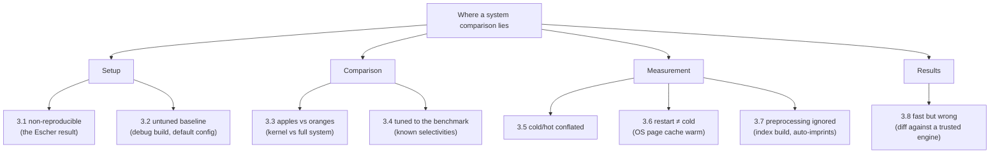

# Fair benchmarking: eight ways a system comparison lies

Criterion and Tene cover how a *single measurement* lies; this chapter — built
on a 6-page DBTest '18 paper from the future DuckDB authors — covers how a
*comparison between systems* lies. Before pointing you at the paper, it builds
the idea of a fair comparison from zero and then walks the eight pitfalls one
at a time: what each one is, a concrete example of how it lies, and how to
avoid it. It is the database-specific companion to topic 0 §1, and the paper's
Appendix A checklist is an artifact you will reuse against every capstone
comparison in this curriculum.

## The problem in one sentence

Van der Kouwe's survey found benchmarking crimes in **96%** of 50 top-tier
systems papers, and Purohith et al. showed SQLite throughput varies **28×**
on one configuration parameter that 0 of 16 surveyed papers reported — so
"system A is 3× faster than system B" is, by default, a statement about the
experimenters, not the systems.

## The concepts, step by step

### Step 1 — what a fair comparison even requires

A benchmark comparison is fair only when the *systems* are the only variable —
everything else (data, tuning effort, machine state, what gets timed, and
correctness of the answers) is held equal. That decomposes into four
requirements, and each of the eight pitfalls below is a failure of one of
them:

- **Setup** must be reproducible and *both* systems must be tuned with equal
  effort (pitfalls 3.1, 3.2).
- **Comparison** must pit like against like — same functionality, workloads
  neither system was specifically fitted to (3.3, 3.4).
- **Measurement** must control machine state — hot vs cold caches — and time
  *all* the work, including preparation (3.5, 3.6, 3.7).
- **Results** must be verified correct, because a wrong answer is free (3.8).

The paper's demonstrations all use one setup: mock TPC-H experiments
(TPC-H is the standard decision-support benchmark — fixed schema, 22 queries,
generated data at a scale factor; SF1 ≈ 1 GB) at SF1 against MariaDB,
PostgreSQL, SQLite, and MonetDB, single-threaded. Jain's classic distinction
frames the whole list: *mistakes* (accidental) vs *games* (deliberate) — the
checklist catches both.

### Step 2 — pitfall 3.1: non-reproducibility

A result is reproducible only if someone else can rerun it from the published
hardware description, configuration, code, and data — and most papers publish
none of these. The paper's demonstration is the **Escher result** (Fig. 2):
MariaDB < PostgreSQL < SQLite < MariaDB\* — a cycle where every measurement
is individually "true". The trick: MariaDB\* stored columns as DOUBLE instead
of DECIMAL — *both* allowed by the TPC-H spec, invisible unless the full
setup is published, and worth enough to reorder the ranking.

**How to avoid it:** publish hardware, all configuration parameters, scripts,
and data-generation steps. If a reader can't rebuild the experiment, the
number is an anecdote.

### Step 3 — pitfall 3.2: failure to optimize the baseline

The baseline system is *the author's competitor*, so nobody spends a week
tuning it — and defaults are terrible. The paper's numbers: MonetDB compiled
in debug mode runs TPC-H Q1 in 1.58 s vs 0.87 s for a release build (1.8×
from a compiler flag); PostgreSQL with default configuration runs Q9 in
0.47 s vs 0.27 s once its memory settings are configured (1.7×). "DBMS A
beats DBMS B" can literally be the same system measured twice.

**How to avoid it:** tune both systems with documented, comparable effort —
release builds, memory settings sized to the machine — and publish the
configs (Step 2).

### Step 4 — pitfall 3.3: apples vs oranges

Comparing a stripped-down kernel against a full system credits the kernel for
all the work it simply doesn't do. The paper hand-writes TPC-H Q1 as a
standalone C++ program ("TimDB"): 0.03 s vs MonetDB's 0.87 s — 29× "faster",
because it skips parsing, query optimization, transactions, overflow
checking, and concurrency control. Any research prototype missing features is
structurally TimDB.

**How to avoid it:** compare full system vs full system; where feature gaps
exist, state them explicitly next to the numbers; verify both produce
identical results.

### Step 5 — pitfall 3.4: overly-specific tuning

Tuning to the benchmark means fitting the *system* to the test's known
properties, so the number stops generalizing. TPC-H's selectivities (the
fraction of rows each filter keeps) and cardinalities (result sizes) are
published constants — so a join-order heuristic can be quietly tuned until
exactly those 22 queries win, while everything else regresses.

**How to avoid it:** also run queries *outside* the benchmark suite, and be
suspicious of any system whose advantage evaporates off-benchmark.

### Step 6 — pitfall 3.5: conflating cold and hot runs

A **cold run** starts with empty caches (first query after boot); a **hot
run** has data already cached from previous queries. They can differ by an
order of magnitude, and averaging them produces a number that describes
neither — first-query-of-the-morning and query-in-a-loop are different
user experiences.

**How to avoid it:** report cold and hot *separately*; for hot numbers,
discard the initial iterations — this is criterion's warm-up, formalized at
the system level.

### Step 7 — pitfall 3.6: restart ≠ cold

Subtler than Step 6: restarting the database server does **not** produce a
cold run, because the OS keeps its own file cache (the page cache) that
survives the process — the restarted server reads "disk" data straight from
the OS's RAM. True cold on Linux = stop server, `echo 3 >
/proc/sys/vm/drop_caches`, start server, run *one* query, repeat the whole
cycle per measurement. (Nearly impossible in the cloud — the hypervisor
caches too, and you can't flush it.)

**How to avoid it:** flush the OS cache explicitly per cold measurement, and
treat any cloud "cold" number as warm until proven otherwise.

### Step 8 — pitfall 3.7: ignoring preprocessing time

Excluding preparation work (index builds, data loading, format conversion)
from the timed window rewards systems that shift the most cost into it — an
expensive-to-build index looks free. The trap doubles with *automatic*
preprocessing: MonetDB builds imprints (a min/max index) on the first range
filter and dictionary-encodes strings at load time — so a "cold" first-query
timing silently *includes* that work for MonetDB while a competitor's
equivalent work happened invisibly at load.

**How to avoid it:** either time preprocessing and report it, or verify both
systems did equivalent preparation before the timed window opens.

### Step 9 — pitfall 3.8: incorrect code wins

A fast wrong answer beats every correct system, and nothing in a timing
harness notices. Skipped overflow handling, hardcoded group counts, missed
edge cases — each buys speed and produces plausible-looking output.

**How to avoid it:** diff every result set against a trusted engine, every
run. Correctness checking is part of the benchmark, not a separate activity.

## How to read the paper (with the concepts in hand)

Six pages, one evening:

- **§1–2** Intro + related work — skim, but note the gems: Jain's *mistakes
  vs games* distinction (Step 1); Hoefler & Belli's 12 HPC benchmarking
  rules; van der Kouwe's 96%-of-50-papers survey; Purohith et al.'s 28×
  SQLite parameter that 0 of 16 papers reported.
- **§3** The eight pitfalls (Steps 2–9), each with its mock TPC-H SF1
  experiment — read carefully; the numbers quoted above all live here.
- **§4 + Appendix A** Conclusions + **the checklist** — the artifact you'll
  reuse against every comparison in this repo.

Methodology to steal from the §3 preamble: their own reporting standard is
**median + non-parametric quantile-based 95% confidence intervals**, all
scripts/configs/plots public — the same philosophy as criterion's bootstrap
CIs, applied to system-level runs.

## Connections to this repo

- The capstone's M4 backend shootout and M22 LDBC 3-way FalkorDB comparison
  must pass Appendix A — especially 3.2 (tune the *reference* FalkorDB
  properly, Step 3) and 3.3 (a young engine missing features is structurally
  "TimDB", Step 4 — say so explicitly next to numbers).
- FalkorDB/benchmark audit overlaps: no warmup (3.5 / Step 6), timeout
  asymmetry (3.3-ish), uniform keys (3.4's cousin — tuning the *workload* to
  flatter caches).
- 3.7 (Step 8) is why M0's `workload` crate measures generation throughput
  separately from engine time.

## Questions to answer in notes.md

1. Which Appendix A checklist items does FalkorDB/benchmark currently fail? (I count at
   least four — list them.)
2. The paper reports medians + CIs; Tene demands full percentile curves + max. When is
   each right? (Hint: throughput-style repeated identical runs vs latency under load.)
3. Which "automatic preprocessing" (3.7) exists in FalkorDB that a fair Neo4j
   comparison must account for?

## Takeaway

Appendix A is a reusable review checklist: benchmarks chosen + justified; reproducible
(hardware, params, code, data); both systems optimized; same functionality; cold/hot
separated and correctly collected; preprocessing equalized; results verified; medians +
CIs over several runs. Pin it next to every capstone `notes.md` comparison.

## References

**Papers**
- Raasveldt, Holanda, Gubner, Mühleisen — "Fair Benchmarking Considered
  Difficult: Common Pitfalls in Database Performance Testing" (DBTest
  2018) —
  [PDF](https://hannes.muehleisen.org/publications/DBTEST2018-performance-testing.pdf)
  — 6 pages, one evening; read §3 carefully, Appendix A is the reusable
  artifact. (CWI — Raasveldt & Mühleisen later created DuckDB.)

**Code**
- [pholanda/FairBenchmarking](https://github.com/pholanda/FairBenchmarking)
  — the paper's experiment scripts and configs
