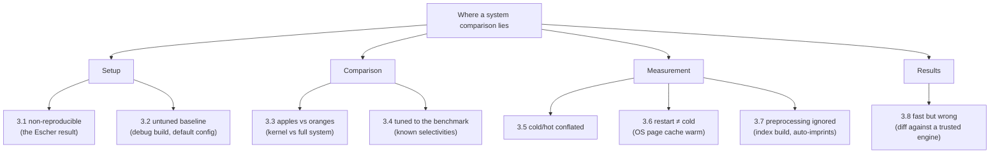

# Fair benchmarking: eight ways a system comparison lies

Criterion and Tene cover how a *single measurement* lies; this chapter — built
on a 6-page DBTest '18 paper from the future DuckDB authors — covers how a
*comparison between systems* lies. It is the database-specific companion to
topic 0 §1, and its Appendix A checklist is an artifact you will reuse
against every capstone comparison in this curriculum.

## Structure

- **§1–2** Intro + related work (skim, but note the gems): Jain's *mistakes vs games*
  distinction; Hoefler & Belli's 12 HPC benchmarking rules; van der Kouwe's survey
  finding benchmarking crimes in **96%** of 50 top-tier systems papers; Purohith et
  al.: SQLite throughput varies **28x** on one parameter, and 0 of 16 surveyed papers
  reported it.
- **§3** The eight pitfalls, each with a mock TPC-H SF1 experiment (MariaDB /
  PostgreSQL / SQLite / MonetDB, single-threaded) — this is the part to read carefully.
- **§4 + Appendix A** Conclusions + **the checklist** (the artifact you'll reuse).

## The eight pitfalls (§3)

1. **Non-reproducibility (3.1)** — the Escher result: Fig. 2 shows MariaDB < Postgres <
   SQLite < MariaDB\*, all "true". The trick: MariaDB\* used DOUBLE instead of DECIMAL
   columns — both allowed by the TPC-H spec, invisible unless the full setup is
   published.
2. **Failure to optimize (3.2)** — the baseline is *the author's competitor*, so nobody
   tunes it. MonetDB debug build vs release: 1.58s → 0.87s (Q1). Postgres default vs
   configured: 0.47s → 0.27s (Q9). "DBMS A vs B" can be the same system twice.
3. **Apples vs oranges (3.3)** — hand-written Q1 program ("TimDB") vs MonetDB: 0.03s
   vs 0.87s. A standalone kernel skips parsing, transactions, overflow checking,
   concurrency. Compare full system vs full system, and verify identical results.
4. **Overly-specific tuning (3.4)** — TPC-H's selectivities/cardinalities are known, so
   join heuristics can be tuned to the benchmark. Antidote: also run non-benchmark
   queries.
5. **Cold vs hot runs (3.5)** — report them *separately*; hot runs discard initial
   iterations (criterion's warmup, formalized).
6. **Cold vs warm runs (3.6)** — subtler: restarting the server is NOT a cold run; the
   OS page cache is still warm. True cold = stop server, `echo 3 >
   /proc/sys/vm/drop_caches`, start, one query, repeat. (Nearly impossible in cloud —
   the hypervisor caches too.)
7. **Ignoring preprocessing time (3.7)** — excluding index-build time rewards
   expensive-to-build indexes. Watch *automatic* preprocessing: MonetDB builds imprints
   on first range filter and dictionary-encodes strings at load — "cold" first-query
   timing silently includes/excludes work per system.
8. **Incorrect code (3.8)** — a fast wrong answer wins benchmarks (skipped overflow
   handling, hardcoded group counts). Always diff results against a trusted engine.

## Methodology to steal (§3 preamble)

Their own reporting standard: **median + non-parametric quantile-based 95% confidence
intervals**, all scripts/configs/plots public. Same philosophy as criterion (§ bootstrap
CIs), applied to system-level runs.

## Connections to this repo

- The capstone's M4 backend shootout and M22 LDBC 3-way FalkorDB comparison must pass
  Appendix A — especially 3.2 (tune the *reference* FalkorDB properly) and 3.3 (a young
  engine missing features is structurally "TimDB" — say so explicitly next to numbers).
- FalkorDB/benchmark audit overlaps: no warmup (3.5), timeout asymmetry (3.3-ish),
  uniform keys (3.4's cousin — tuning the *workload* to flatter caches).
- 3.7 is why M0's `workload` crate measures generation throughput separately from
  engine time.

## Questions to answer in notes.md

1. Which Appendix A checklist items does FalkorDB/benchmark currently fail? (I count at
   least four — list them.)
2. The paper reports medians + CIs; Tene demands full percentile curves + max. When is
   each right? (Hint: throughput-style repeated identical runs vs latency under load.)
3. Which "automatic preprocessing" (3.7) exists in FalkorDB that a fair Neo4j
   comparison must account for?

## Takeaway

Appendix A is a reusable review checklist: benchmarks chosen + justified; reproducible
(hardware, params, code, data); both systems optimized; same functionality; cold/hot
separated and correctly collected; preprocessing equalized; results verified; medians +
CIs over several runs. Pin it next to every capstone `notes.md` comparison.

## References

**Papers**
- Raasveldt, Holanda, Gubner, Mühleisen — "Fair Benchmarking Considered
  Difficult: Common Pitfalls in Database Performance Testing" (DBTest
  2018) —
  [PDF](https://hannes.muehleisen.org/publications/DBTEST2018-performance-testing.pdf)
  — 6 pages, one evening; read §3 carefully, Appendix A is the reusable
  artifact. (CWI — Raasveldt & Mühleisen later created DuckDB.)

**Code**
- [pholanda/FairBenchmarking](https://github.com/pholanda/FairBenchmarking)
  — the paper's experiment scripts and configs
