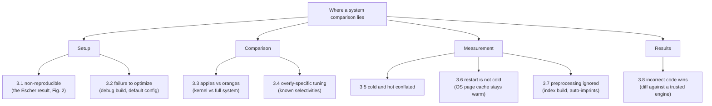

# Fair benchmarking: eight ways a system comparison lies

Criterion and Tene cover how a *single measurement* lies; this chapter — built
on a 6-page DBTest '18 paper from the future DuckDB authors — covers how a
*comparison between systems* lies. Before pointing you at the paper, it builds
the idea of a fair comparison from zero, pins down the one experimental setup
every demonstration in the paper reuses, and then walks the eight pitfalls one
at a time: what each is, the paper's own measured example of it lying, and how
to avoid it. It is the database-specific companion to topic 0 §1, and the
paper's Appendix A checklist is an artifact you will reuse against every
capstone comparison in this curriculum.

Every figure below is quoted from the paper with the section, figure or table
it appears in. Where this repo has measured the same failure mode itself, the
repo's number is cited instead of a borrowed one.

## The problem in one sentence

Van der Kouwe's survey found benchmarking crimes in **96%** of 50 top-tier
systems papers (§2.1), and Purohith et al. showed SQLite transaction
throughput varies by a factor of **28** on a single parameter setting that
**none of 16** surveyed papers reported (§2.2) — so "system A is 3× faster
than system B" is, by default, a statement about the experimenters, not the
systems.

## The concepts, step by step

### Step 1 — what a fair comparison even requires

> **In:** nothing yet — this step builds the frame the eight pitfalls hang on.
> **Out:** four requirements, each of which one or more pitfalls violates.
> Step 2 supplies the experimental setup that demonstrates them.

A benchmark comparison is fair only when the *systems* are the only variable —
everything else (the data, the tuning effort, the machine state, what gets
timed, and the correctness of the answers) is held equal. That decomposes into
four requirements:


```mermaid
flowchart TD
    Q["Where a system comparison lies"]
    Q --> SU["Setup"]
    Q --> CMP["Comparison"]
    Q --> MEA["Measurement"]
    Q --> RES["Results"]
    SU --> P1["3.1 non-reproducible<br/>(the Escher result, Fig. 2)"]
    SU --> P2["3.2 failure to optimize<br/>(debug build, default config)"]
    CMP --> P3["3.3 apples vs oranges<br/>(kernel vs full system)"]
    CMP --> P4["3.4 overly-specific tuning<br/>(known selectivities)"]
    MEA --> P5["3.5 cold and hot conflated"]
    MEA --> P6["3.6 restart is not cold<br/>(OS page cache stays warm)"]
    MEA --> P7["3.7 preprocessing ignored<br/>(index build, auto-imprints)"]
    RES --> P8["3.8 incorrect code wins<br/>(diff against a trusted engine)"]
```

- **Setup** must be reproducible, and *both* systems must be tuned with equal
  effort (pitfalls 3.1, 3.2 — Steps 3 and 4).
- **Comparison** must pit like against like: the same functionality, on
  workloads neither system was specifically fitted to (3.3, 3.4 — Steps 5, 6).
- **Measurement** must control machine state — hot against cold caches — and
  time *all* the work, including preparation (3.5, 3.6, 3.7 — Steps 7, 8, 9).
- **Results** must be verified correct, because a wrong answer is free (3.8 —
  Step 10).

Two definitions the paper leans on from the start. **TPC-H** is the standard
decision-support benchmark: a fixed schema, 22 queries, and generated data at
a chosen **scale factor** — SF1 means roughly 1 GB of data. And Jain's
distinction, quoted at §2.1, frames the whole list: **mistakes** are
"ill-advised but inadvertent choices", while **games** are "deliberate and
purposeful manipulation of the experiment to elicit a specific outcome". The
checklist catches both, which matters because you cannot tell them apart from
the outside — and you are far more likely to commit the first.

Why it matters: every pitfall below is a failure of exactly one of those four
requirements, which is what makes eight separate mistakes a single checklist.

### Step 2 — the one setup that produced every number in the paper

> **In:** the four requirements from Step 1.
> **Out:** the machine, the system versions and the reporting standard behind
> every figure quoted in Steps 3–10 — without which none of them mean
> anything, which is itself pitfall 3.1.

The paper practises what Step 3 preaches, and states its setup once (§3
preamble):

| Component | What |
|---|---|
| CPU | Intel i7-2600K at 3.40 GHz, **one** of its eight hardware threads used |
| Memory | 16 GB |
| OS | Fedora 26, Linux kernel 4.14 |
| Compiler | GCC 7.3.1 |
| Systems | MariaDB 10.2.13, MonetDB 11.27.13, SQLite 3.20.1, PostgreSQL 9.6.1 |
| Workload | mock TPC-H at SF1, single-threaded |
| Reporting | median with non-parametric, quantile-based 95% confidence intervals |
| Artifacts | scripts, results, configs and plotting code, all published |

Single-threaded is a deliberate fairness choice, stated in the preamble: not
every system supports intra-query parallelism, so giving all of them one
thread removes a variable rather than testing one.

Two terms in that last row. A **confidence interval** is a range that would
contain the true value in a stated fraction of repeated experiments — a 95% CI
means 95 of 100 repetitions. **Non-parametric** means it is computed without
assuming the measurements follow any particular distribution, here by taking
quantiles of the observed runs directly. That is the same philosophy as
criterion's bootstrap intervals, applied to whole-system runs instead of
function calls: do not assume normality of something you can resample.

The paper also states, in the same preamble, that including a system in these
experiments implies nothing about the papers that used it. The systems are
props.

Why it matters: Steps 3–10 quote a dozen timings. Every one of them is *this*
machine, *these* versions, SF1, one thread. A number from this paper carried
into an argument about your hardware is a fresh instance of pitfall 3.1.

### Step 3 — pitfall 3.1: non-reproducibility

> **In:** the setup from Step 2.
> **Out:** the Escher result — a ranking that cycles — and the size of the
> single hidden decision that produced it.

A result is reproducible only if someone else can rerun it from the published
hardware description, configuration, code and data. Most papers publish none
of these, and §3.1 notes the aggravating habit of anonymising systems as
"DBMS-X" to avoid a vendor's legal department: even a reader who owns every
system cannot tell which one was measured.

The demonstration is the **Escher result** (Fig. 2, TPC-H Q1 at SF1) — three
pairwise comparisons, every measurement individually true, that together form
a cycle:

```
Fig. 2, median seconds:   MariaDB  12.18
                          Postgres  9.73
                          SQLite    8.19
                          MariaDB*  4.70

panel 1:  Postgres  9.73 < MariaDB  12.18   →  P beats M   (12.18/9.73 = 1.25×)
panel 2:  SQLite    8.19 < Postgres  9.73   →  S beats P   ( 9.73/8.19 = 1.19×)
panel 3:  MariaDB*  4.70 < SQLite    8.19   →  M beats S   ( 8.19/4.70 = 1.74×)
```

So M < P, P < S, S < M: MariaDB is both the slowest system in the paper and
the fastest, "a contradiction similar to the famous paintings by M.C. Escher".

The hidden decision is one schema choice: MariaDB\* stored the `lineitem`
money columns as `DOUBLE` instead of `DECIMAL`, and MariaDB's decimal
implementation is inefficient. **Both spellings are allowed by the TPC-H
specification** (§3.1 cites [2, sec. 1.3]), so neither run is cheating. Do the
division the paper does not print:

```
one schema decision, same system:  12.18 / 4.70 = 2.59×
the largest gap it manufactures:    8.19 / 4.70 = 1.74×
```

The undisclosed choice is worth **more than any of the three system gaps it
was used to create**. That is the general shape of this pitfall: the
unpublished variable does not add noise to the comparison, it dominates it.

**How to avoid it:** publish the hardware, every configuration parameter, the
source or binaries, and the data-generation steps — §3.1's list also names the
OS, how the server was installed, and its version. If a reader cannot rebuild
the experiment, the number is an anecdote.

### Step 4 — pitfall 3.2: failure to optimize the baseline

> **In:** the Step 2 setup, now run twice per system — once as an author would
> configure their own system, once as they would configure a competitor's.
> **Out:** two measured gaps that are entirely artifacts of build and config.

The baseline system is *the author's competitor*, so nobody spends a week
tuning it. §3.2 states the incentive plainly: "the worse the state of the art
system does, the better the authors' system looks." Two measurements:

```
Fig. 3a  (Q1)   MonetDB  debug build     1.58 s
                MonetDB* release build   0.87 s     1.58 / 0.87 = 1.82×
Fig. 3b  (Q9)   Postgres default config  0.47 s
                Postgres* configured     0.27 s     0.47 / 0.27 = 1.74×
```

Both gaps are between a system and *itself*. The debug build is not merely
"unoptimized": §3.2 explains that MonetDB's debug mode enables sanity-checking
code that **scans entire columns** to verify invariants — work that has
nothing to do with answering the query. Postgres's default configuration
predates the machine it is running on and does not use the available memory.

An author who published either as "DBMS A beats DBMS B" would have published a
compiler flag.

**How to avoid it:** tune both systems with documented, comparable effort —
release builds, memory settings sized to the machine — and publish the configs,
which is Step 3's rule again. The Appendix A checklist splits this into exactly
two boxes, *compilation flags* and *system parameters*, because they fail
independently.

### Step 5 — pitfall 3.3: apples against oranges

> **In:** the Step 4 numbers, now compared against a program that is not a
> database at all.
> **Out:** the largest single gap in the paper, and the reason it is meaningless.

A comparison is fair only if both systems perform the same functionality.
§3.3 lists what a real DBMS carries that a standalone program does not:
arbitrary queries, transaction isolation, updates, and multiple concurrent
clients. The paper hand-writes TPC-H Q1 as a standalone program, names it
**TimDB**, and measures it against the fairly feature-complete MonetDB:

```
Fig. 3c  (Q1)   MonetDB (release)  0.87 s
                'TimDB'            0.03 s     0.87 / 0.03 = 29×
```

Note which MonetDB that is: the *tuned* 0.87 s from Fig. 3a, not the 1.58 s
debug build. The paper is being scrupulous — and the pitfalls still compound
if you are not:

```
debug MonetDB against a hand-written kernel:  1.58 / 0.03 = 52.7×
```

29× of that is pitfall 3.3 and a further 1.8× is pitfall 3.2, and a paper
committing both would report 53× without either being a lie about arithmetic.

§3.3 also names the subtle version: **overflow handling**. Guaranteeing correct
results regardless of the stored data requires either *overflow checking*
(test each arithmetic result) or *overflow prevention* (prove from the data's
range that none can occur). An implementation with neither is faster and is
not comparable. Any research prototype missing features is structurally TimDB.

**How to avoid it:** compare full system against full system; ideally integrate
the new algorithm into a complete system before measuring it. Where feature
gaps remain, state them next to the numbers, and verify both systems produce
identical results.

### Step 6 — pitfall 3.4: overly-specific tuning

> **In:** a standardized benchmark, whose every property is published.
> **Out:** a system whose advantage exists only on that benchmark.

Tuning to the benchmark means fitting the *system* to the test's known
properties, so the number stops generalizing. §3.4 lists what TPC-H and TPC-C
publish up front: the workload, the **cardinalities** of intermediate results
(how many rows each step produces), the data distributions, the
**selectivities** of predicates (the fraction of rows a filter keeps), and the
number of groups an aggregation creates. With all of that known, join-order
heuristics can be tuned until exactly those 22 queries win, and data can be
sharded so the work splits evenly *for this benchmark*.

The failure is invisible from inside the benchmark: the system is genuinely
faster on it, and genuinely slower on the similar queries the benchmark does
not contain.

**How to avoid it:** run more experiments than the standardized suite — §3.4's
advice is that the standard benchmark is a good *baseline* comparison, with a
set of different queries measured alongside it. Be suspicious of any advantage
that evaporates off-benchmark.

### Step 7 — pitfall 3.5: conflating cold and hot runs

> **In:** repeated runs of one query on one system.
> **Out:** two distinct populations of measurement that must not be pooled.

A **cold run** is the first execution, with nothing cached; a **hot run** has
the data already resident. §3.5 names all four reasons the first is slower:
data must be read from persistent storage, the query must be parsed and
compiled, the buffer pool is empty, and any plan cache is cold. Averaging the
two produces a number describing neither — first-query-of-the-morning and
query-in-a-loop are different user experiences, and both are real.

**How to avoid it:** report cold and hot *separately*. The checklist's box for
hot runs is "ignore initial runs", which is criterion's warm-up (Step 2 of the
criterion chapter) formalized at the system level: the same idea, one layer up.

### Step 8 — pitfall 3.6: restarting the server is not a cold run

> **In:** the cold-run protocol from Step 7.
> **Out:** what stays warm across a restart, and the only protocol that
> actually clears it.

Subtler than Step 7, and §3.6 gives it its own section because the usual
protocol is wrong. Restarting the database server does **not** produce a cold
run: the operating system uses spare main memory as a cache of disk blocks —
the **page cache** — and that cache belongs to the kernel, not to the process,
so it survives the restart entirely. A restarted server reads its "disk" data
out of RAM.

The paper's correct protocol, from §3.6 and its footnote 2:

```
per cold measurement:
    stop the database server
    echo 3 > /proc/sys/vm/drop_caches     # root, recent Linux
    start the server
    run and time exactly ONE query
    repeat
```

One query per cycle, because the second query is by definition hot again. §3.6
also notes the cloud problem: caching also happens on the virtualization host,
where you cannot drop it, so the only option may be to start a fresh virtual
machine — which makes honest cold numbers "very time-consuming and
inconvenient".

**How to avoid it:** flush the OS cache explicitly, per measurement, and treat
any cloud "cold" number as warm until proven otherwise.

### Step 9 — pitfall 3.7: ignoring preprocessing time

> **In:** the timed window from Steps 7 and 8.
> **Out:** the work that happens outside it, and the two ways a system gets it
> for free.

Excluding preparation — loading, format conversion, index construction — from
the timed window rewards whichever system shifts the most cost into it. §3.7's
statement of the bias: spending more time on index creation generally produces
a faster index, so discarding creation time gives expensive-to-build,
efficient indices an unfair advantage over cheap-to-build, less efficient ones.

The trap doubles when the preprocessing is *automatic*, and §3.7 gives two
MonetDB examples:

- **Imprints** — a lightweight per-column min/max index that MonetDB builds
  automatically the first time a range filter touches a column. Subsequent
  range queries on that column are significantly faster.
- **Dictionary encoding** — string columns are stored at load time as integer
  offsets into a heap with duplicates eliminated, so string equality in a query
  becomes integer comparison.

Both mean the *first* query pays for an index the later queries enjoy. Discard
the first query as a "cold run" (Step 7) and the index becomes free; keep it
and you charge MonetDB for work a competitor did invisibly at load time. The
two pitfalls interact, which is why they are adjacent in the paper.

**How to avoid it:** §3.7's rule is symmetry — either create indexes for both
systems or for neither — plus explicit wariness of automatic index creation.
Where preprocessing is timed, report it.

### Step 10 — pitfall 3.8: incorrect code wins

> **In:** every number produced by Steps 3–9.
> **Out:** the check that has to happen before any of them count.

A fast wrong answer beats every correct system, and nothing in a timing
harness notices. §3.8 separates two flavours. An outright bug produces wrong
results and is often *faster* because the bug means less data is touched — and
if the experiment is not reproducible (Step 3), nobody will ever find it. The
subtler flavour is a program correct only for the data it was tested on:
neglected overflow handling (Step 5's term), or hardcoding the number of
groups an aggregation produces.

**How to avoid it:** §3.8 is specific — compare output against reference
answers, taken either from the benchmark specification or from running the
same query on a well-tested RDBMS such as SQLite or PostgreSQL, and check that
the results stay correct **when the data changes**. Correctness checking is
part of the benchmark, not a separate activity.

## How to read the paper (with the concepts in hand)

Six pages, one evening:

- **§1–2** Intro and related work — skim, but note the gems: Jain's *mistakes
  against games* distinction (§2.1, Step 1); Hoefler and Belli's 12 HPC
  benchmarking rules, derived from issues in 120 HPC papers, including their
  point that averages are only valid when there is no variance — "which is
  almost never the case in benchmarking" (§2.1); van der Kouwe's 96%-of-50
  survey (§2.1); Purohith et al.'s factor-of-28 SQLite parameter that none of
  16 papers reported (§2.2).
- **§3 preamble** The setup of Step 2 — read it before any figure.
- **§3.1–3.8** The eight pitfalls (Steps 3–10), with the mock TPC-H SF1
  experiments in Figures 2 and 3. Every number quoted above lives here.
- **§4 and Appendix A** Conclusions and **the checklist** — the artifact you
  will reuse against every comparison in this repo.

Appendix A's eight groups, condensed:

| Group | Boxes |
|---|---|
| Choosing your benchmarks | covers the evaluation space; subset justified; stresses the relevant functionality |
| Reproducible | hardware config; DBMS parameters and version; source or binaries; data, schema and queries |
| Optimization | compilation flags; system parameters |
| Apples vs apples | similar functionality; equivalent workload |
| Comparable tuning | different data; various workloads |
| Cold/warm/hot runs | cold and hot differentiated; cold runs flush OS and CPU caches; hot runs ignore initial runs |
| Preprocessing | preprocessing equal between systems; aware of automatic index creation |
| Ensure correctness | verify results; test different data sets; corner cases work |
| Collecting results | several runs; check standard deviation; report robust metrics (median and CIs) |

## Connections to this repo

- The capstone's M4 backend shootout and M22 LDBC 3-way FalkorDB comparison
  must pass Appendix A — especially *optimization* (tune the *reference*
  FalkorDB properly, Step 4) and *apples vs apples* (a young engine missing
  features is structurally TimDB, Step 5 — say so explicitly next to the
  numbers).
- FalkorDB/benchmark audit overlaps: no warmup (3.5, Step 7), timeout
  asymmetry (3.3-ish), uniform keys (3.4's cousin — tuning the *workload* to
  flatter caches).
- 3.7 (Step 9) is why M0's `workload` crate measures generation throughput
  separately from engine time.
- This repo has caught two of these on itself, and both are in
  [FINDINGS.md](../../FINDINGS.md): topic 12's scan lane once printed
  **19,047,619 GB/s** from a hoisted timing loop — pitfall 3.8, a wrong answer
  that was very fast — and now reports **24–57 GB/s** on a 150 GB/s machine.
  Topic 6's mmap lane reports p50 **42 ns** against a max of **182 µs**, a
  4300× spread that a mean would have hidden — Hoefler and Belli's point about
  averages, measured locally.

## Questions to answer in notes.md

1. Which Appendix A checklist items does FalkorDB/benchmark currently fail? (I
   count at least four — list them, with the box each one misses.)
2. The paper reports medians with quantile-based CIs; Tene demands full
   percentile curves and the max. When is each right? (Hint: repeated identical
   runs of one query, against latency under sustained load.)
3. Which "automatic preprocessing" (3.7, Step 9) exists in FalkorDB that a fair
   Neo4j comparison must account for?
4. Step 3's arithmetic showed one undisclosed schema choice was worth 2.59×,
   more than any system gap it produced. Name an undisclosed variable in this
   repo's own lanes that could be worth more than the effect being measured,
   and say how you would publish it.
5. `verify.sh` publishes every lane's command and every generator is seeded.
   Which Appendix A boxes does that tick, and which does it leave open?

## Takeaway

Appendix A is a reusable review checklist: benchmarks chosen and justified;
reproducible (hardware, params, code, data); both systems optimized; same
functionality; cold/hot separated and correctly collected; preprocessing
equalized; results verified; medians and CIs over several runs. Pin it next to
every capstone `notes.md` comparison.

## Done when

Answer each before unfolding it.

- [ ] You can name all eight pitfalls without the paper open.

  <details><summary>Answer</summary>

  Grouped by what they break (Step 1): **setup** — 3.1 non-reproducibility,
  3.2 failure to optimize the baseline; **comparison** — 3.3 apples against
  oranges, 3.4 overly-specific tuning; **measurement** — 3.5 conflating cold
  and hot runs, 3.6 a restart is not a cold run, 3.7 ignoring preprocessing
  time; **results** — 3.8 incorrect code wins.

  The grouping is the recall aid: four requirements for a fair comparison, and
  eight ways to fail them.

  </details>

- [ ] You can explain why "failure to optimize the baseline" (3.2) is the one that invalidates a result rather than merely weakening it.

  <details><summary>Answer</summary>

  Because both sides of the comparison can be the *same system*. Fig. 3a
  measures MonetDB against MonetDB — 1.58 s debug against 0.87 s release, 1.82×
  — and Fig. 3b measures Postgres against Postgres, 0.47 s against 0.27 s,
  1.74×. Neither gap contains any information about a system's design. A paper
  reporting a 1.8× win over a baseline it built in debug mode has reported a
  compiler flag.

  It invalidates rather than weakens because the incentive runs one way. §3.2
  says it: the author has "very little incentive to properly optimize the
  current system", so the error is not noise around the truth, it is a bias
  that always points at the author's conclusion. A weakness makes a result less
  certain; a systematic bias makes it uninformative.

  </details>

- [ ] You can state the difference between a restarted process and a cold system (3.6), and name what stays warm across a restart.

  <details><summary>Answer</summary>

  Restarting drops everything the *process* owned — buffer pool, plan cache,
  any in-process state. It drops nothing the *kernel* owns, and the kernel owns
  the page cache: spare RAM holding recently read disk blocks. The restarted
  server therefore reads its data out of memory while believing it read from
  disk, and reports a "cold" number that is warm.

  The protocol that actually works (§3.6, footnote 2) is: stop the server,
  `echo 3 > /proc/sys/vm/drop_caches` as root, start the server, run and time
  exactly one query, repeat — one query per cycle, because the second is hot
  again. In a cloud VM even that fails, because the virtualization host caches
  too and you cannot reach it; the paper's only suggestion there is to start a
  fresh virtual machine.

  </details>

- [ ] You can identify which pitfall each of this repo's own lanes is most exposed to — start with topic 6's mmap handicap and topic 12's bandwidth variance.

  <details><summary>Answer</summary>

  Topic 6's mmap lane reports p50 **42 ns** and a max of **182 µs**
  ([FINDINGS.md](../../FINDINGS.md) row 6) — a 4300× spread that is almost
  entirely minor page faults. Its exposure is 3.5/3.6: whether the pages were
  already resident decides the whole distribution, so any figure from it that
  does not say which is a cold/hot conflation. It is also the case Hoefler and
  Belli warn about at §2.1 — a mean over that spread describes nothing.

  Topic 12's scan lane reports **24–57 GB/s** on a 150 GB/s machine, and the
  same lane once printed **19,047,619 GB/s** from a hoisted timing loop. That
  is pitfall 3.8 exactly: incorrect code was very fast, and only an
  implausibility check caught it. Its standing exposure now is 3.3 — a
  hand-written scan kernel measured against anything that also parses a query
  is TimDB.

  More generally: every lane that measures this repo's own code against a
  published number inherits 3.1, because the published number's setup (Step 2)
  is rarely stated in as much detail as `verify.sh` states ours.

  </details>

- [ ] You wrote answers to all five questions in notes.md, including the FalkorDB checklist audit.

  <details><summary>Answer</summary>

  There is no answer to unfold here — the checklist audit is the exercise. The
  bar: for each of the four requirements in Step 1, name the specific
  FalkorDB/benchmark behaviour that fails it and the Appendix A box it misses.
  An audit that finds nothing has usually confused "I could not reproduce their
  setup" (pitfall 3.1, a finding) with "their setup is fine".

  </details>

## References

**Papers**
- Raasveldt, Holanda, Gubner, Mühleisen — "Fair Benchmarking Considered
  Difficult: Common Pitfalls in Database Performance Testing" (DBTest 2018) —
  [PDF](https://hannes.muehleisen.org/publications/DBTEST2018-performance-testing.pdf)
  — 6 pages, one evening; read §3 carefully, Appendix A is the reusable
  artifact. (CWI — Raasveldt and Mühleisen later created DuckDB.)

| Section | What this chapter took from it |
|---|---|
| §2.1 | Jain's mistakes/games distinction; Hoefler & Belli's 12 rules over 120 HPC papers; van der Kouwe's 96% of 50 papers |
| §2.2 | Purohith et al.: SQLite throughput varies by 28×, none of 16 papers reported the parameter |
| §3 preamble | the hardware, versions, single-thread choice and median-with-95%-CI reporting standard (Step 2) |
| §3.1, Fig. 2 | the Escher result: 12.18 / 9.73 / 8.19 / 4.70 s, and the DOUBLE-instead-of-DECIMAL schema choice, both TPC-H-legal |
| §3.2, Fig. 3a-b | MonetDB 1.58 → 0.87 s (debug scans whole columns); Postgres 0.47 → 0.27 s |
| §3.3, Fig. 3c | MonetDB 0.87 s against hand-written 'TimDB' 0.03 s; overflow checking vs prevention |
| §3.4 | what a standardized benchmark publishes: selectivities, cardinalities, group counts |
| §3.5 | why the first run is slower: storage, parse/compile, buffer pool, plan cache |
| §3.6 + fn. 2 | the page cache survives a restart; `drop_caches`; the cloud has no equivalent |
| §3.7 | MonetDB's automatic imprints and load-time dictionary encoding |
| §3.8 | verify against a reference engine, and re-verify when the data changes |
| Appendix A | the checklist, condensed in the table above |

**Code**
- [pholanda/FairBenchmarking](https://github.com/pholanda/FairBenchmarking)
  — the paper's experiment scripts and configs, the artifact §3 preamble
  promises.
