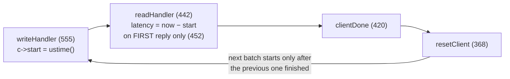

# redis-benchmark: a throughput tool wearing latency clothes

The load generator you'll imitate — and the mistake you'll avoid. In one
dependency-free file, redis-benchmark shows a masterclass in cheap pipelining
(one pre-built buffer, patched in place) and, in the same 2000 lines, the
canonical case of coordinated omission: a closed loop that measures service
time and calls it latency. This chapter builds the load-generation concepts
step by step — throughput vs latency, closed loops, pipelining, where the
histogram comes from, and exactly how the numbers go wrong — then hands you
the line-by-line map of the C file. Two questions drive the read: *how does
it implement pipelining, and what does it get wrong about coordinated
omission?*

## The problem in one sentence

When Redis stalls for 100 ms (a fork for a background save, say), a
closed-loop benchmark records *one* bad sample per client instead of the
thousands of delayed requests a real workload would have suffered — so the
reported p99 can be 100× better than what users would experience.

## The concepts, step by step

### Step 1 — throughput and latency answer different questions

**Throughput** is how many requests per second the server can complete
(capacity: "can Redis do 1M SET/s?"). **Latency** is how long *one* request
takes from the moment a client wants it done to the moment the answer
arrives (experience: "how slow is the p99?" — the p99 being the 99th
percentile, the time that 99% of requests beat and 1% exceed). They are not
two views of one number: a server can post 1M ops/s while some requests take
500 ms, and a load generator built to maximize the first is, as we'll see,
structurally unable to measure the second honestly.

Why it matters: redis-benchmark's design goal is throughput; every latency
figure it prints has to be read with that in mind.

### Step 2 — closed-loop load generation

A **closed loop** is the simplest possible client: send a request, wait for
the reply, send the next — the client and server take turns, and at most one
request (per client connection) is ever outstanding. The whole of
redis-benchmark is this cycle:



In the code: `clientDone` (line 420) → `resetClient` (line 368 — the closed
loop, in 8 lines) → re-arm the write handler → the next batch starts *after*
the previous one finished. Notice what does **not** exist anywhere in the
cycle: a target request rate or an intended send schedule. The client sends
exactly as fast as the server answers — no faster, and crucially, no matter
what, never *during* a server stall.

Why it matters: closed loops are trivial to write and great for finding peak
throughput, but the send rate is controlled by the *server* — hold that
thought for Step 5.

### Step 3 — pipelining: k requests in flight amortize the round trip

**Pipelining** means sending k requests back-to-back without waiting for
replies, then collecting all k answers — so one network round trip (the
~50–500 µs of wire and kernel time per exchange) is paid once per *batch*
instead of once per request. With a 100 µs round trip and a 1 µs command,
unpipelined throughput caps at ~10K ops/s per connection; `-P 100` lifts it
near 1M.

redis-benchmark's implementation is the elegant part — there is no request
queue at all, just one pre-built buffer:

```
c->obuf — the whole benchmark is one pre-built buffer, written over and over:

┌──────┬────────┬──────────────────────────┬──────────────────────────┬─ ─ ─
│ AUTH │ SELECT │ SET key:__0000000042__ v │ SET key:__0000000913__ v │ ×pipeline
└──────┴────────┴──────────▲───────────────┴──────────▲───────────────┴─ ─ ─
  trimmed after 1st reply  └── randptr[] patch digits in place — no re-serialization
```

`createClient` (line 625) copies the *same command bytes* `config.pipeline`
times into one output buffer `c->obuf`, sets `c->pending = config.pipeline`,
and the event loop just writes the whole buffer and counts replies back down
(`readHandler`, line 458: `while(c->pending)`). Randomized keys are patched
*in place* through saved pointers into the buffer (`randptr`, lines 377–393 —
writes digits directly into the command bytes, no re-serialization).
Auth/SELECT prefix commands ride in the same buffer once and are trimmed
after the first reply (lines 506–523).

Cost of the trick: within one batch every pipelined command has the *same*
key randomization per slot of the buffer, and — see Step 4 — the whole batch
becomes one timing unit.

Why it matters: this is the minimum possible work per event-loop tick, and
it's the part worth stealing for your own load generator.

### Step 4 — where the latency histogram comes from

A **latency histogram** counts how many requests fell into each time bucket,
so percentiles (p50, p99, p99.9) can be read off it afterward;
redis-benchmark uses HdrHistogram (a histogram with buckets sized to keep a
fixed relative error at every magnitude — two of them live in `struct
config`, lines 99–100). But a histogram is only as honest as the samples fed
into it, and here's exactly what gets fed:

- `writeHandler` line 574: `c->start = ustime()` when a batch begins writing.
- `readHandler` line 452: `if (c->latency < 0) c->latency = ustime() - c->start`
  — **on the first read event only**. So "latency" = batch send → first
  bytes of first reply. Deliberate (the comment says parsing overhead
  shouldn't count), but it means the last reply's extra wait is invisible.
- Lines 528–541: that *single* value is recorded into the HdrHistogram
  **once per reply** — all `pipeline` requests inherit the first reply's
  latency. With `-P 100`, one measurement pretends to be 100.

`showLatencyReport` (line 830+) then prints beautiful full percentiles — of
that sample.

Why it matters: the display machinery is state of the art; the *sampling* is
one clock read per batch, duplicated. Good percentiles of a biased sample
are still biased.

### Step 5 — coordinated omission: the closed loop under-samples the worst moments

**Coordinated omission** (Gil Tene's term) is the measurement error where the
load generator, by waiting for the server, silently *coordinates* with it —
requests that would have arrived during a stall are never sent, so the worst
moments are systematically under-sampled and the p99 lies. Steps 2–4 combine
into exactly this. In Tene's terms:

1. **No target rate exists.** The benchmark always sends as fast as the
   server answers, so a stall (fork for RDB save, AOF fsync, slow command)
   simply pauses the generator — requests that *would* have arrived during
   the stall are never sent, never measured. You get exactly one bad sample
   per client per stall instead of thousands.
2. **It measures service time and calls it latency.** Service time = how long
   the server took once it picked the request up; latency = service time
   *plus the queueing delay* a real open-world client would experience
   waiting behind the stall. The queueing delay never appears.
3. **HdrHistogram doesn't save it.** Redis added HdrHistogram (config lines
   99–100) and full percentile output (830+) — good display of a *biased*
   sample (Step 4). Correction would require an intended-arrival schedule,
   which doesn't exist here. (Compare wrk2, which was written to fix exactly
   this; memtier_benchmark has `--rate-limiting`.)
4. Small extra: `hdr_record_value` clamps at
   `CONFIG_LATENCY_HISTOGRAM_MAX_VALUE` (line 530) — the worst outliers are
   also truncated.

Both loops, distilled to their timing skeletons — the entire bug and the
entire fix is *where the clock starts*:

```rust
// closed loop (redis-benchmark): clock starts at SEND — a server stall
// pauses the generator, so the requests that would have queued up behind
// the stall are never sent, never measured.
loop {
    let start = now();
    send_batch_and_wait_all_replies();
    record(now() - start);              // one bad sample per stall
}

// open loop (the fix): clock starts at the INTENDED send time — the
// schedule advances whether or not the server keeps up.
let mut intended = now();
loop {
    intended += period;                 // target rate exists
    wait_until(intended);
    send_one();                         // reply handled async
    on_reply(move |t| record(t - intended));  // queueing delay is visible
}
```

Why it matters: worked example of the 100 ms fork stall from the problem
statement — a closed loop with 50 clients records 50 samples of ~100 ms; an
open loop at 100K req/s records ~10,000 samples spanning 0–100 ms of
queueing delay. Same server, same stall; only the second histogram tells the
truth about it.

## Where each step lives in the code

One file, `src/redis-benchmark.c`, readable top to bottom in an evening:

| Lines | What | Step |
|-------|------|------|
| 61–108 | `struct config` — all global state, incl. `pipeline`, two HdrHistograms (99–100) | 3, 4 |
| 110–130 | `struct _client` — note `start`, `latency`, `pending` | 2, 4 |
| 368–375 | `resetClient` — the closed loop, in 8 lines | 2 |
| 420–439 | `clientDone` — finished batch → `resetClient` (keepalive) or reconnect | 2 |
| 442–553 | `readHandler` — latency capture + histogram recording | 4, 5 |
| 555–602 | `writeHandler` — batch start, `c->start = ustime()` | 4 |
| 625+ | `createClient` — pipelining via buffer replication | 3 |
| 830+ | `showLatencyReport` — percentiles off HdrHistogram | 4 |
| 946 | `benchmark()` — sets up clients, runs the event loop | 2 |
| 1696 | `main` — test loop over SET/GET/INCR/... | 1 |

Suggested route: `main` (1696) → `benchmark()` (946) → `createClient` (625,
Step 3's buffer trick) → the Step 2 cycle (`writeHandler` 555 →
`readHandler` 442 → `clientDone` 420 → `resetClient` 368) — and as you trace
it, confirm for yourself that no intended-arrival schedule exists anywhere
(Step 5).

## Takeaway

redis-benchmark is a *throughput* tool with percentile decoration: buffer-replication
pipelining is a masterclass in doing the minimum work per event-loop tick, but the
closed loop means its latency numbers systematically flatter the server under stress.
For the capstone (M7+): keep the obuf trick, add an intended-send schedule.

## References

**Code**
- [redis](https://github.com/redis/redis) `src/redis-benchmark.c` (2028
  lines, pinned at Redis 8.6.2 / `a176d1225`) — one file, no dependencies
  beyond hiredis + the `ae` event loop; readable top to bottom in an
  evening
