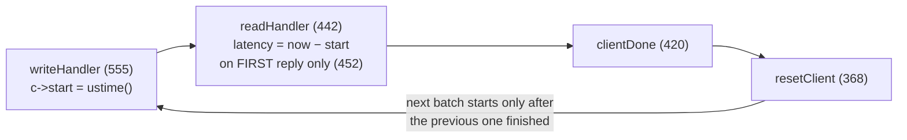

# redis-benchmark: a throughput tool wearing latency clothes

The load generator you'll imitate — and the mistake you'll avoid. In one
dependency-free file, redis-benchmark shows a masterclass in cheap pipelining
(one pre-built buffer, patched in place) and, in the same 2000 lines, the
canonical case of coordinated omission: a closed loop that measures service
time and calls it latency. Two questions drive the read: *how does it
implement pipelining, and what does it get wrong about coordinated omission?*

## Structure

| Lines | What |
|-------|------|
| 61–108 | `struct config` — all global state, incl. `pipeline`, two HdrHistograms (99–100) |
| 110–130 | `struct _client` — note `start`, `latency`, `pending` |
| 368–375 | `resetClient` — the closed loop, in 8 lines |
| 420–439 | `clientDone` — finished batch → `resetClient` (keepalive) or reconnect |
| 442–553 | `readHandler` — latency capture + histogram recording |
| 555–602 | `writeHandler` — batch start, `c->start = ustime()` |
| 625+ | `createClient` — pipelining via buffer replication |
| 830+ | `showLatencyReport` — percentiles off HdrHistogram |
| 946 | `benchmark()` — sets up clients, runs the event loop |
| 1696 | `main` — test loop over SET/GET/INCR/... |

## How pipelining works (the elegant part)

```
c->obuf — the whole benchmark is one pre-built buffer, written over and over:

┌──────┬────────┬──────────────────────────┬──────────────────────────┬─ ─ ─
│ AUTH │ SELECT │ SET key:__0000000042__ v │ SET key:__0000000913__ v │ ×pipeline
└──────┴────────┴──────────▲───────────────┴──────────▲───────────────┴─ ─ ─
  trimmed after 1st reply  └── randptr[] patch digits in place — no re-serialization
```

There is no request queue. `createClient` (625) copies the *same command bytes*
`config.pipeline` times into one output buffer `c->obuf`, sets
`c->pending = config.pipeline`, and the event loop just writes the whole buffer and
counts replies back down (`readHandler`, 458: `while(c->pending)`). Randomized keys are
patched *in place* through saved pointers into the buffer (`randptr`, 377–393 — writes
digits directly into the command bytes, no re-serialization). Auth/SELECT prefix
commands ride in the same buffer once and are trimmed after the first reply (506–523).

Cost of the trick: within one batch every pipelined command has the *same* key
randomization per slot of the buffer, and the whole batch is one timing unit.

## Where the latency numbers come from

- `writeHandler` 574: `c->start = ustime()` when a batch begins writing.
- `readHandler` 452: `if (c->latency < 0) c->latency = ustime() - c->start` — **on the
  first read event only**. So "latency" = batch send → first bytes of first reply.
  Deliberate (the comment says parsing overhead shouldn't count), but it means the
  last reply's extra wait is invisible.
- 528–541: that *single* value is recorded into the HdrHistogram **once per reply** —
  all `pipeline` requests inherit the first reply's latency. With `-P 100`, one
  measurement pretends to be 100.

## What it gets wrong about coordinated omission



The cycle above is the whole problem: it's **closed** — there is no intended-arrival
schedule anywhere, so a server stall pauses the generator itself. In detail:
`clientDone` (420) → `resetClient` (368) → re-arm write handler
→ next batch starts *after* the previous one finished. `c->start` is set at send time,
not against any intended schedule. Consequences, in Tene's terms:

1. **No target rate exists.** The benchmark always sends as fast as the server answers,
   so a stall (fork for RDB save, AOF fsync, slow command) simply pauses the generator —
   requests that *would* have arrived during the stall are never sent, never measured.
   You get exactly one bad sample per client per stall instead of thousands.
2. **It measures service time and calls it latency.** Queueing delay a real open-world
   client would experience never appears.
3. **HdrHistogram doesn't save it.** Redis added HdrHistogram (config lines 99–100) and
   full percentile output (830+) — good display of a *biased* sample. Correction would
   require an intended-arrival schedule, which doesn't exist here. (Compare wrk2, which
   was written to fix exactly this; memtier_benchmark has `--rate-limiting`.)
4. Small extra: `hdr_record_value` clamps at `CONFIG_LATENCY_HISTOGRAM_MAX_VALUE`
   (line 530) — the worst outliers are also truncated.

Both loops, distilled to their timing skeletons — the entire bug and the
entire fix is *where the clock starts*:

```rust
// closed loop (redis-benchmark): clock starts at SEND — a server stall
// pauses the generator, so the requests that would have queued up behind
// the stall are never sent, never measured.
loop {
    let start = now();
    send_batch_and_wait_all_replies();
    record(now() - start);              // one bad sample per stall
}

// open loop (the fix): clock starts at the INTENDED send time — the
// schedule advances whether or not the server keeps up.
let mut intended = now();
loop {
    intended += period;                 // target rate exists
    wait_until(intended);
    send_one();                         // reply handled async
    on_reply(move |t| record(t - intended));  // queueing delay is visible
}
```

## Takeaway

redis-benchmark is a *throughput* tool with percentile decoration: buffer-replication
pipelining is a masterclass in doing the minimum work per event-loop tick, but the
closed loop means its latency numbers systematically flatter the server under stress.
For the capstone (M7+): keep the obuf trick, add an intended-send schedule.

## References

**Code**
- [redis](https://github.com/redis/redis) `src/redis-benchmark.c` (2028
  lines, pinned at Redis 8.6.2 / `a176d1225`) — one file, no dependencies
  beyond hiredis + the `ae` event loop; readable top to bottom in an
  evening
