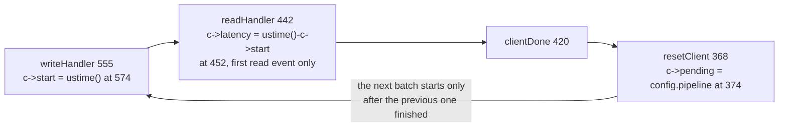

# redis-benchmark: a throughput tool wearing latency clothes

The load generator you'll imitate — and the mistake you'll avoid. In one
dependency-free file, redis-benchmark shows a masterclass in cheap pipelining
(one pre-built buffer, patched in place) and, in the same 2028 lines, the
canonical case of coordinated omission: a closed loop that measures service
time and calls it latency. This chapter builds the load-generation concepts
from zero — throughput against latency, closed loops, pipelining, where the
histogram's samples come from, and exactly how the numbers go wrong — then
hands you the line-by-line map of the C file. Two questions drive the read:
*how does it implement pipelining, and what does it get wrong about
coordinated omission?*

Every anchor below is Redis **8.6.2** (`src/version.h:1`), the commit
`a176d1225` this repo pins, quoted with the line numbers the code occupies in
that version.

## The problem in one sentence

When Redis stalls for 100 ms (a fork for a background save, say), a
closed-loop benchmark records *one* bad sample per client instead of the
thousands of delayed requests a real workload would have suffered — so the
reported p99.9 can be hundreds of times better than what users experience.

## The concepts, step by step

### Step 1 — throughput and latency answer different questions

> **In:** nothing yet — this step fixes the vocabulary every later step uses.
> **Out:** two words that are not two views of one number, and the reason the
> tool's design goal decides which of them it can measure.

**Throughput** is how many requests per second the server completes — a
capacity question, "can Redis do 1M SET/s?". **Latency** is how long *one*
request takes, from the moment a client wanted it done to the moment the
answer arrived — an experience question, "how slow is the p99?".

A **percentile** is the value a given fraction of samples falls below: the
**p99** is the time 99% of requests beat and 1% exceed; the **p99.9** is the
time 999 requests in 1000 beat. Percentiles are what latency is reported in
because the mean hides exactly the tail users complain about.

These are not two views of one number. A server can post 1M ops/s while some
requests take 500 ms — the 1M is an average over a second, the 500 ms is one
request's experience inside it. And a load generator built to maximize the
first is, as Steps 2 to 6 show, structurally unable to measure the second
honestly.

Why it matters: redis-benchmark's design goal is throughput. Every latency
figure it prints has to be read with that in mind.

### Step 2 — the closed loop: the server sets the send rate

> **In:** the vocabulary from Step 1.
> **Out:** the send cycle every later step is built on — and the fact that no
> target rate exists anywhere in it. Step 6 turns that absence into the bug.

A **closed loop** is the simplest possible client: send a request, wait for
the reply, send the next. Client and server take turns, so at most one request
per connection is ever outstanding (or one *batch* of them, once Step 3 adds
pipelining). An **event loop** — Redis's own `ae` library, reused here — is
the thing that drives it: a single thread that waits for file descriptors to
become readable or writable and calls a handler for each.

The whole of redis-benchmark is this cycle:


```mermaid
flowchart LR
    W["writeHandler 555<br/>c->start = ustime() at 574"] --> R["readHandler 442<br/>c->latency = ustime()-c->start<br/>at 452, first read event only"]
    R --> D["clientDone 420"]
    D --> RC["resetClient 368<br/>c->pending = config.pipeline at 374"]
    RC -->|"the next batch starts only<br/>after the previous one finished"| W
```

The closed loop itself is eight lines, and worth reading in full because the
absence in it is the point:

```c
// src/redis-benchmark.c — resetClient, the whole closed loop, 368-375
   368  static void resetClient(client c) {
   369      aeEventLoop *el = CLIENT_GET_EVENTLOOP(c);
   370      aeDeleteFileEvent(el,c->context->fd,AE_WRITABLE);
   371      aeDeleteFileEvent(el,c->context->fd,AE_READABLE);
   372      aeCreateFileEvent(el,c->context->fd,AE_WRITABLE,writeHandler,c);
   373      c->written = 0;
   374      c->pending = config.pipeline;
   375  }
```

Line 372 is the one that closes the loop: it re-arms the *write* handler, so
the next batch is sent the instant this one finished being read. `clientDone`
(420) calls it when `config.keepalive` is set (428-429), and reconnects
instead when it is not (430-437).

Now look for what is *not* there: no target request rate, no intended send
schedule, no clock the loop is trying to keep up with. The client sends
exactly as fast as the server answers — no faster, and, crucially, not at all
*during* a server stall.

Why it matters: closed loops are trivial to write and are the right tool for
finding peak throughput, but the send rate is controlled by the **server**.
Hold that thought for Step 6.

### Step 3 — pipelining: one pre-built buffer, k commands deep

> **In:** the send cycle from Step 2.
> **Out:** a batch of `config.pipeline` commands as the unit that gets sent —
> which Step 4 then treats as a single timing unit.

**Pipelining** means sending k requests back-to-back without waiting for
replies, then collecting all k answers. One **round trip** — the wire, kernel
and syscall time of a single send-and-receive exchange, ~50-500 µs on real
networks and ~10-50 µs on loopback — is then paid once per *batch* instead of
once per request.

The arithmetic, on a 100 µs round trip and a 1 µs command:

```
unpipelined:  1 command  / (100 µs RTT + 1 × 1 µs) = 1/101 µs   =   9,901 ops/s
-P 100:     100 commands / (100 µs RTT + 100 × 1 µs) = 100/200 µs = 500,000 ops/s
-P 1000:   1000 commands / (100 µs RTT + 1000 × 1 µs) = 1000/1100 µs = 909,091 ops/s
ceiling as k grows:                 1 / 1 µs                       = 1,000,000 ops/s
```

So `-P 100` is a 50× lift and gets you *half* way to the 1M/s ceiling, not to
it: the round trip is still half the batch's cost. The ceiling is the command
time alone, and you only approach it once `k × service ≫ RTT`. Topic 7
measures the real version of this curve on loopback with zero-work requests:
**44k ops/s at P=1 against 12.3M at P=256** ([FINDINGS.md](../../FINDINGS.md)
row 7).

redis-benchmark's implementation is the elegant part — there is no request
queue at all, just one pre-built buffer:

```
c->obuf — the whole benchmark is one pre-built buffer, written over and over:

┌──────┬────────┬──────────────────────────┬──────────────────────────┬─ ─ ─
│ AUTH │ SELECT │ SET key:__0000000042__ v │ SET key:__0000000913__ v │ ×pipeline
└──────┴────────┴──────────▲───────────────┴──────────▲───────────────┴─ ─ ─
  trimmed after 1st reply  └── randptr[] patch digits in place — no re-serialization
```

`createClient` (625) builds it. The replication is two lines, a hundred lines
into the function — this is the trick worth stealing:

```c
// src/redis-benchmark.c — inside createClient, 719-731
   719      c->prefixlen = sdslen(c->obuf);
   720      /* Append the request itself. */
   721      if (from) {
   722          c->obuf = sdscatlen(c->obuf,
   723              from->obuf+from->prefixlen,
   724              sdslen(from->obuf)-from->prefixlen);
   725      } else {
   726          for (j = 0; j < config.pipeline; j++)
   727              c->obuf = sdscatlen(c->obuf,cmd,len);
   728      }
   729
   730      c->written = 0;
   731      c->pending = config.pipeline+c->prefix_pending;
```

Line 727 is the whole of it: the *same command bytes* appended
`config.pipeline` times into one output buffer. Line 731 sets the reply
counter to match, and the read side just counts back down —
`while(c->pending)` at 458. Note that the counter is `config.pipeline` **plus**
`c->prefix_pending`, because AUTH, SELECT and HELLO 3 ride in the same buffer
(705-717) and are trimmed after their replies arrive (510-521).

Randomized keys are patched *in place* through saved pointers into that
buffer, so a new key costs twelve stores and no re-serialization:

```c
// src/redis-benchmark.c — randomizeClientKey, 377-393
   377  static void randomizeClientKey(client c) {
   378      size_t i;
   379
   380      for (i = 0; i < c->randlen; i++) {
   381          char *p = c->randptr[i]+11;
   382          size_t r = 0;
   383          if (config.randomkeys_keyspacelen != 0)
   384              r = random() % config.randomkeys_keyspacelen;
   385          size_t j;
   386
   387          for (j = 0; j < 12; j++) {
   388              *p = '0'+r%10;
   389              r/=10;
   390              p--;
   391          }
   392      }
   393  }
```

The line to look at is 388: it writes one decimal digit directly into the
command bytes. `c->randptr[i]` points at the `:rand:` placeholder inside
`c->obuf` itself, so there is no format string, no allocation, and no copy on
the hot path.

Cost of the trick: the buffer is rewritten once per batch (571, via
`writeHandler`), so every slot gets a fresh key, but all `config.pipeline`
commands in a batch are randomized together and sent together — and, as
Step 4 shows, timed together.

Why it matters: this is close to the minimum possible work per event-loop
tick, and it is the part worth stealing for your own load generator.

### Step 4 — one clock read per batch

> **In:** the batch of `config.pipeline` commands from Step 3.
> **Out:** exactly one number, `c->latency`, per batch — the sample Step 5
> feeds to the histograms.

The clock starts when a batch begins writing:

```c
// src/redis-benchmark.c — inside writeHandler, 561-576
   561      /* Initialize request when nothing was written. */
   562      if (c->written == 0) {
   // ... 563-568: stop if config.requests has already been issued ...
   570          /* Really initialize: randomize keys and set start time. */
   571          if (config.randomkeys) randomizeClientKey(c);
   // ... 572-573: cluster-mode hash tags and slot epoch ...
   574          c->start = ustime();
   575          c->latency = -1;
   576      }
```

Line 574 is the one that matters, and note the guard on 562: the clock is set
when the *first* byte of a batch is written, not on every partial write. Line
575 arms the sentinel that the read side tests.

It stops on the first byte of the first reply:

```c
// src/redis-benchmark.c — the top of readHandler, 449-452
   449      /* Calculate latency only for the first read event. This means that the
   450       * server already sent the reply and we need to parse it. Parsing overhead
   451       * is not part of the latency, so calculate it only once, here. */
   452      if (c->latency < 0) c->latency = ustime()-(c->start);
```

Line 452 is the whole measurement, and the `< 0` test is what makes it happen
once. So what redis-benchmark calls latency is precisely: **the interval from
"we started writing k commands" to "the first bytes of the first reply came
back"**. The comment on 449-451 says why parsing is excluded, and that
reasoning is sound. What it does not say is the consequence: the k-th reply's
extra wait is outside the interval entirely, and is never measured.

Why it matters: one `ustime()` pair per batch is the entire sampling
apparatus. Everything printed later is a rendering of these numbers.

### Step 5 — the fork: one sample, two histograms, k recordings

> **In:** the single `c->latency` value from Step 4.
> **Out:** two datasets — a cumulative HdrHistogram that
> `showLatencyReport` prints at the end, and a per-second one that drives the
> live line. Both are filled once per *reply*, not once per measurement.

A **latency histogram** counts how many samples fell into each time bucket, so
percentiles can be read off it afterwards without keeping every sample.
**HdrHistogram** is the standard implementation: its buckets are sized to hold
a fixed *relative* error at every magnitude, so 1 µs and 1 s are both recorded
to the same number of significant digits, in constant time and constant space.

Two of them live in `struct config` (99-100), and this is where the run's data
forks in two:

```c
// src/redis-benchmark.c — inside struct config, 99-100
    99      struct hdr_histogram* latency_histogram;
   100      struct hdr_histogram* current_sec_latency_histogram;
```

`latency_histogram` accumulates the whole run and is what `showLatencyReport`
(830) reads for the final percentiles (833-838). `current_sec_latency_histogram`
is reset every second and drives the live progress line. Same samples, two
consumers — so a claim about "the p99 redis-benchmark printed" is a claim
about the first one.

The recording is inside the reply loop:

```c
// src/redis-benchmark.c — inside readHandler's while(c->pending), 524-543
   524                  int requests_finished = 0;
   525                  atomicGetIncr(config.requests_finished, requests_finished, 1);
   526                  if (requests_finished < config.requests){
   527                          if (config.num_threads == 0) {
   528                              hdr_record_value(
   529                              config.latency_histogram,  // Histogram to record to
   530                              (long)c->latency<=CONFIG_LATENCY_HISTOGRAM_MAX_VALUE ? (long)c->latency : CONFIG_LATENCY_HISTOGRAM_MAX_VALUE);  // Value to record
   531                              hdr_record_value(
   532                              config.current_sec_latency_histogram,  // Histogram to record to
   533                              (long)c->latency<=CONFIG_LATENCY_HISTOGRAM_INSTANT_MAX_VALUE ? (long)c->latency : CONFIG_LATENCY_HISTOGRAM_INSTANT_MAX_VALUE);  // Value to record
   // ... 534-541: the same two calls again, hdr_record_value_atomic, when threads are on ...
   542                  }
   543                  c->pending--;
```

The load-bearing detail is *where* this sits: inside `while(c->pending)` (458),
which spins once per reply. `c->latency` was computed once, at 452, and is not
recomputed — so the same value is recorded `config.pipeline` times. Run with
`-P 100` and a million requests, and the histogram holds 1,000,000 entries
drawn from **10,000** clock readings. One measurement pretending to be a
hundred.

Line 530 adds a second distortion: `CONFIG_LATENCY_HISTOGRAM_MAX_VALUE` is
`3000000L` µs (line 50), so any sample above **3 s** is recorded *as* 3 s. The
worst outliers are truncated, not lost — which flatters the maximum.

`showLatencyReport` (830) then computes p50, p95, p99 and the max off this
histogram (834-837) and prints them to two decimal places. The display is
state of the art. The samples are one clock read per batch, duplicated.

Why it matters: good percentiles of a biased sample are still biased, and
nothing downstream of line 452 can recover what line 452 did not measure.

### Step 6 — coordinated omission: the closed loop under-samples the worst moments

> **In:** the rate-free cycle (Step 2), the batch as timing unit (Steps 3-4),
> and the histograms (Step 5).
> **Out:** the named defect, its size in requests, and the one structural
> change that fixes it.

**Service time** is how long the server took once it picked a request up.
**Queueing delay** is how long the request waited before that — behind other
work, or behind a stall. **Latency**, as a user experiences it, is the sum.
**Coordinated omission** (Gil Tene's term) is the measurement error where the
load generator, by waiting for the server, silently *coordinates* with it: the
requests that would have arrived during a stall are never sent, so the worst
moments are systematically under-sampled and the reported percentiles lie.

Steps 2 to 5 combine into exactly this, in four parts:

1. **No target rate exists.** Step 2 found no intended send schedule anywhere
   in the cycle. A stall — a fork for an RDB save, an AOF fsync, one slow
   `KEYS` — simply pauses the generator. Requests that *would* have arrived
   during the stall are never sent, so they are never measured.
2. **It measures service time and calls it latency.** Step 4's interval starts
   when the client writes, which for a closed loop is always *after* the
   previous reply. The queueing delay of Step 6's definition never appears,
   because the client was never queued.
3. **HdrHistogram does not save it.** Redis added two HdrHistograms (99-100)
   and full percentile output (830) — excellent display of the biased sample
   from Step 5. Correction needs an intended-arrival schedule, which does not
   exist here. (Compare wrk2, written specifically to fix this;
   memtier_benchmark has `--rate-limiting`.)
4. **The clamp truncates what survives.** Step 5's 3 s ceiling (line 50, used
   at 530) caps the few honest outliers a stall does produce.

Both loops, distilled to their timing skeletons — the entire bug and the
entire fix is *where the clock starts*:

```rust
// ILLUSTRATION — not quoted from Redis. The closed loop is the real cycle of
// src/redis-benchmark.c:368-375 with its clock reads at 574 and 452; the open
// loop is what the tool would need and does not have.

// closed loop (redis-benchmark): the clock starts at SEND, so a server stall
// pauses the generator and the requests that would have queued behind the
// stall are never sent, never measured.
loop {
    let start = now();
    send_batch_and_wait_all_replies();
    record(now() - start);                    // one bad sample per stall
}

// open loop (the fix): the clock starts at the INTENDED send time, and the
// schedule advances whether or not the server keeps up.
let mut intended = now();
loop {
    intended += period;                       // a target rate exists
    wait_until(intended);
    send_one();                               // reply handled asynchronously
    on_reply(move |t| record(t - intended));  // queueing delay is visible
}
```

Worked example — the 100 ms fork stall from the problem statement, on a run of
1,000,000 requests with 50 clients, against an open-loop generator running the
same server at a target 100,000 req/s:

```
closed loop:  50 clients × 1 stalled batch      =        50 samples of ~100 ms
              50 / 1,000,000                    = 0.005% of the histogram
              → first visible at the p99.995; p50, p99 and p99.9 are untouched

open loop:    100,000 req/s × 0.100 s           =    10,000 requests delayed
              10,000 / 1,000,000                =     1% of the histogram
              delays spread ~uniformly over 0-100 ms, so:
              p99.5 = the 5,000th of them       =   ~50 ms
              p99.9 = the 9,000th of them       =   ~90 ms
```

Same server, same 100 ms stall, one run each. The closed loop's p99.9 is a
normal healthy figure — a few hundred microseconds; the open loop's is ~90 ms,
two and a half orders of magnitude worse and correct. Only the second
histogram tells the truth about the stall.

Why it matters: this is not a bug you can fix downstream. No histogram, no
percentile estimator and no amount of sample count repairs a sample that was
never taken.

## Where each step lives in the code

One file, `src/redis-benchmark.c` (2028 lines at `a176d1225`), readable top to
bottom in an evening:

| Lines | What | Step |
|-------|------|------|
| 49-51 | `CONFIG_LATENCY_HISTOGRAM_*` — the 10 µs floor and the 3 s clamp | 5 |
| 61-108 | `struct config` — all global state, incl. `pipeline`, two HdrHistograms (99-100) | 3, 5 |
| 110-130 | `struct _client` — note `start` (120), `latency` (121), `pending` (122) | 2, 4 |
| 368-375 | `resetClient` — the closed loop, in 8 lines | 2 |
| 377-393 | `randomizeClientKey` — digits patched into the buffer in place | 3 |
| 420-439 | `clientDone` — finished batch → `resetClient` (429) or reconnect (430-437) | 2 |
| 442-553 | `readHandler` — latency capture (452), prefix trim (510-521), histogram recording (528-541) | 4, 5 |
| 555-602 | `writeHandler` — batch start, `c->start = ustime()` at 574 | 4 |
| 625-812 | `createClient` — pipelining by buffer replication (726-727) | 3 |
| 830-921 | `showLatencyReport` — percentiles off the cumulative histogram (833-838) | 5 |
| 946-982 | `benchmark()` — allocates both histograms (954-963), runs the event loop, calls the report (976) | 2, 5 |
| 1696 | `main` — the test loop over SET/GET/INCR/… | 1 |

Suggested route: `main` (1696) → `benchmark()` (946) → `createClient` (625,
for Step 3's buffer trick at 726-727) → then the Step 2 cycle in order,
`writeHandler` (555) → `readHandler` (442) → `clientDone` (420) →
`resetClient` (368). As you trace it, confirm for yourself that no
intended-arrival schedule exists anywhere — that absence is Step 6.

## Questions to answer in notes.md

1. `readHandler` computes `c->latency` at line 452 but records it inside the
   loop at 528. How many histogram entries does one `-P 100` batch produce,
   and how many `ustime()` calls paid for them?
2. The comment at 449-451 justifies measuring only the first read event
   ("parsing overhead is not part of the latency"). Is that reasoning right?
   What does it cost, for a batch of 100?
3. `c->pending` is set to `config.pipeline` in `resetClient` (374) but to
   `config.pipeline + c->prefix_pending` in `createClient` (731). Why the
   difference, and what happens to the prefix replies' latencies (506-523)?
4. If you added `--rate` to this tool, which of the two clock reads (574, 452)
   would have to move, and what new state would `struct _client` need?
5. Sketch what the histogram from Step 6's worked example looks like in each
   loop. Which percentile is the first to differ?

## Takeaway

redis-benchmark is a *throughput* tool with percentile decoration:
buffer-replication pipelining is a masterclass in doing the minimum work per
event-loop tick, but the closed loop means its latency numbers systematically
flatter the server under stress. For the capstone (M7+): keep the `obuf`
trick, add an intended-send schedule.

## Done when

Answer each before unfolding it.

- [ ] You can explain the difference between service time and latency, and say which one `redis-benchmark` reports.

  <details><summary>Answer</summary>

  Service time is how long the server took once it picked the request up;
  latency as a user experiences it is service time *plus* the queueing delay
  spent waiting to be picked up. redis-benchmark reports service time. Its
  clock starts at line 574, when the client begins writing a batch — and in a
  closed loop the client only begins writing after the previous reply landed,
  so by construction it was never queued. There is no moment in the cycle at
  which a request exists but has not been sent, which is exactly the interval
  queueing delay would occupy.

  </details>

- [ ] You can define coordinated omission and explain the mechanism by which a closed loop under-samples exactly the worst moments.

  <details><summary>Answer</summary>

  Coordinated omission is the error where the load generator waits for the
  server and thereby *coordinates* with it: the requests that would have
  arrived during a stall are never issued, so the stall is under-represented
  in the sample rather than over-represented as it is in production.

  The mechanism is `resetClient` (368-375). Line 372 re-arms the write handler
  only after the batch's last reply was consumed, so the send rate is a
  function of the server's completion rate. During a 100 ms stall each client
  contributes exactly one in-flight batch — 50 clients, 50 bad samples — where
  an open loop at 100,000 req/s would have issued 10,000 requests into it.
  The stall is 0.005% of the closed loop's histogram and 1% of the open loop's.

  </details>

- [ ] You can say why adding HdrHistogram to a closed-loop generator does not fix it.

  <details><summary>Answer</summary>

  Because HdrHistogram is a recording and rendering structure, and the defect
  is in the sampling. It buys constant-space storage at fixed relative error
  and lets `showLatencyReport` (830) compute exact percentiles at 833-838 —
  of whatever it was given. What it was given is one clock read per batch
  (452), replicated `config.pipeline` times (528-541), with the 10,000
  requests a stall would have delayed simply absent. Correcting it needs an
  intended-arrival schedule to subtract from, and no such timestamp exists in
  `struct _client` (110-130). The 3 s clamp at line 530 makes it slightly
  worse, capping the honest outliers that do survive.

  </details>

- [ ] You can predict what pipelining does to the reported figure, then check your prediction against topic 7's `loopback_bench` — 44k ops/s at P=1 against 12.3M at P=256.

  <details><summary>Answer</summary>

  Throughput rises steeply and then saturates, because the round trip is
  amortised over k commands while the per-command service time is not: at a
  100 µs RTT and a 1 µs command, P=1 gives 9,901 ops/s, P=100 gives 500,000,
  P=1000 gives 909,091, and the ceiling is 1,000,000. Topic 7's measured
  44k → 12.3M over P=1 → P=256 is the same curve with the per-request cost
  being syscalls rather than a network hop.

  The reported *latency* moves the other way and stops meaning what it says:
  the interval measured at 452 is now "send 256 commands, get the first reply
  back", and it is written into the histogram 256 times. A larger `-P` makes
  throughput look better, latency look worse, and the sample count look 256×
  more trustworthy than it is.

  </details>

- [ ] You can name what you would have to change in the tool to make its latency numbers trustworthy (a target rate, and the arithmetic that goes with it).

  <details><summary>Answer</summary>

  Three changes, in dependency order. First, `struct _client` (110-130) needs
  an `intended` timestamp alongside `start` (120), advanced by a fixed
  `period = 1/rate` regardless of when the previous reply arrived. Second, the
  measurement at 452 has to subtract `c->intended`, not `c->start`, so
  queueing delay is inside the interval. Third — and this is the part that
  makes it a rewrite rather than a patch — `resetClient` (368-375) must stop
  gating the next send on the previous reply, which means replies can no
  longer be counted down with `while(c->pending)` on a single in-flight batch;
  the client needs several batches outstanding and a way to match replies to
  their intended times.

  The pipelining machinery survives all of this: `c->obuf` and the
  `randptr` in-place patching (377-393) are orthogonal to when you decide to
  write the buffer.

  </details>

## References

**Code**
- [redis](https://github.com/redis/redis) `src/redis-benchmark.c` (2028 lines,
  pinned at Redis 8.6.2 / `a176d1225` — version confirmed in
  `src/version.h:1`) — one file, no dependencies beyond hiredis and the `ae`
  event loop; readable top to bottom in an evening.

| File | Lines | What |
|------|-------|------|
| `src/redis-benchmark.c` | 49-51 | histogram floor (10 µs) and clamp (3,000,000 µs) |
| `src/redis-benchmark.c` | 99-100 | the two HdrHistograms — the data fork of Step 5 |
| `src/redis-benchmark.c` | 368-375 | `resetClient`, the closed loop |
| `src/redis-benchmark.c` | 377-393 | `randomizeClientKey`, in-place digit patching |
| `src/redis-benchmark.c` | 449-452 | the only latency measurement in the tool |
| `src/redis-benchmark.c` | 528-541 | one sample recorded once per reply |
| `src/redis-benchmark.c` | 574 | `c->start = ustime()` — where the clock starts |
| `src/redis-benchmark.c` | 726-727 | pipelining, by appending the same bytes k times |
| `src/redis-benchmark.c` | 833-838 | the percentiles that get printed |

**Background**
- Gil Tene, *How NOT to Measure Latency* — the talk that named coordinated
  omission, and the source of the open-loop correction sketched in Step 6.
- [wrk2](https://github.com/giltene/wrk2) and
  [memtier_benchmark](https://github.com/RedisLabs/memtier_benchmark)
  (`--rate-limiting`) — load generators that carry the intended-arrival
  schedule redis-benchmark lacks.
