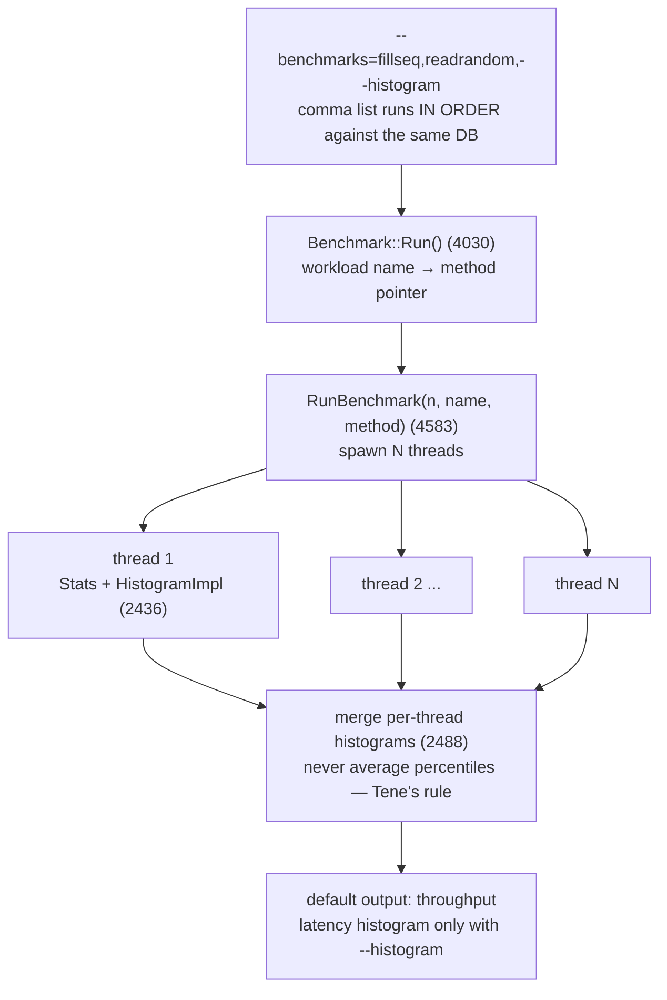

# db_bench: the shared vocabulary of storage benchmarking

`fillseq`, `readrandom`, `readwhilewriting` — these workload names started in
LevelDB, were extended by RocksDB, and now appear in every LSM paper since.
This chapter is a skim route through the 10,000-line tool that defines them —
but first it builds the concepts step by step: why a shared workload
vocabulary exists at all, how every workload reduces to picking an integer,
what each name actually stresses, and what to distrust in the numbers the
tool prints. The goal is the *vocabulary* and the measurement shape, not the
harness code. Name your own benchmarks in this language and your numbers
become comparable to two decades of published results.

## The problem in one sentence

"Our engine does 500K writes/s" is uninterpretable — sequential or random
keys? new inserts or overwrites? uniform or skewed? measured during
compaction or before it? — and each of those choices swings the number by
5–50×, so without a shared workload vocabulary no two papers' numbers can be
compared.

## The concepts, step by step

### Step 1 — why storage engines need a standard workload vocabulary

A storage engine's performance is not one number but a surface: it depends
on the operation mix (reads vs writes vs scans), the key order (sequential
vs random), whether keys are new or overwrite old ones, and what background
work is running. This matters most for **LSM engines** (log-structured
merge-trees: writes go to sorted files that are later merged — "compacted" —
in the background; **compaction** is that deferred merging work, and it
competes with foreground traffic for IO and CPU). The same LSM can absorb
sequential loads at disk bandwidth and collapse to a tenth of that under
random overwrites, purely because of compaction debt.

db_bench's fix: give each meaningful point on that surface a *name*, so
"we ran `fillrandom` then `readwhilewriting`" pins down the experiment as
precisely as a chess opening's name pins down twelve moves.

Why it matters: LevelDB shipped these names in 2011, RocksDB extended them,
and every LSM paper since reports in them — the vocabulary *is* the
comparability.

### Step 2 — every workload is "pick an integer, format it as a key"

Under every workload name sits the same skeleton: choose an integer, then
format it as a zero-padded fixed-width key. All the drama — sequential vs
random, insert vs overwrite — lives entirely in *how the next integer is
chosen* (`GenerateKeyFromInt` :3802, `WriteMode` :5869, `KeyGenerator`
:6088):

```rust
// every fill* workload reduces to how the next integer is chosen
fn next_key(mode: WriteMode, i: u64, n: u64, rng: &mut Rng, perm: &[u64]) -> Key {
    let int = match mode {
        WriteMode::Sequential   => i,                // fillseq: in-order, no
                                                     //   compaction debt
        WriteMode::Random       => rng.next() % n,   // fillrandom/overwrite:
                                                     //   duplicates → garbage
                                                     //   → compaction pressure
        WriteMode::UniqueRandom => perm[i as usize], // pre-shuffled permutation:
                                                     //   random order, no dups
    };
    generate_key_from_int(int)                       // zero-padded fixed width
}
```

The three modes differ in one property each: `Sequential` arrives in order;
`Random` draws with replacement, so ~37% of a full pass are duplicates —
each duplicate is an overwrite that turns an old value into garbage the
engine must compact away; `UniqueRandom` pre-shuffles `0..n` so arrival
order is random but every key appears exactly once — random placement
without garbage.

Why it matters: once you see this skeleton, the entire workload menu in
Steps 3–4 is just this function plus an operation type.

### Step 3 — the fill family: four ways to write

The `fill*` names are write workloads; each stresses a different part of the
write path:

- **`fillseq`** — sequential-order load (`Sequential` mode). The LSM fast
  path: sorted input means files never overlap, so there is no compaction
  debt. Papers use it to *build* the database before the real test — it's a
  setup step wearing a benchmark's name.
- **`fillrandom`** — random-order inserts. Files overlap, compaction runs
  continuously; this is the honest write-throughput number.
- **`overwrite`** — random writes to *existing* keys. Every write creates
  garbage (the old version) that compaction must reclaim — maximum
  compaction pressure, a different beast from `fillrandom` even though both
  are "random writes".
- **`fillsync`** — one fsync (the syscall that forces data to durable media,
  ~0.1–5 ms each) per write, run over N/1000 ops. Measures durability cost,
  not throughput — expect 3–4 orders of magnitude below `fillseq`.

Why it matters: a paper quoting "write throughput" without saying which of
these four it ran has told you almost nothing (a 5–50× spread, per Step 1).

### Step 4 — the read family: point, scan, and interference

The read-side names split along two axes — access shape, and whether writes
run concurrently:

- **`readrandom` / `readseq` / `readreverse`** — point lookups vs. iterator
  scans (forward/backward). Point lookups may probe several LSM levels;
  scans stream.
- **`seekrandom`** — the cost of positioning an iterator (Seek touches every
  level to set up merge order — a very different profile from a point Get).
- **`multireadrandom`** — MultiGet batching: many keys per call, amortizing
  per-call overhead.
- **`readwhilewriting`** — 1 writer + N readers: the "does compaction wreck
  my read tail?" test, and the closest thing in the menu to production. The
  `*whilemerging`/`*whilescanning` variants isolate other interference
  sources.

Why it matters: read-only numbers (`readrandom` on a freshly-compacted DB)
are the engine's best case; `readwhilewriting` is where LSM read/write
interference — the thing users actually hit — shows up.

### Step 5 — distribution knobs: uniform lies, skew is reality

By default the random modes draw keys **uniformly** (every key equally
likely), but production traffic is **skewed** — a few hot keys dominate,
classically modeled as a **Zipfian distribution** (popularity of the k-th
hottest key falls off as 1/k^s, so a small fraction of keys absorbs most of
the traffic). The difference is not cosmetic: uniform access defeats every
cache (no key is hot enough to stay resident), while skewed access lets
caches shine — the two can disagree on read throughput by an order of
magnitude.

db_bench's knobs: `read_random_exp_range` (:452) skews reads
exponentially, and **`mixgraph`** (:4133) is the industrial-strength
answer — it models Facebook's *measured* production distributions (the
"Characterizing, Modeling..." FAST'20 paper) with two-term-exponential key
ranges (`keyrange_dist_a..d`, :1708–1717) and Pareto-distributed value
sizes. Same motivation as the capstone's Zipfian `workload` crate: uniform
random keys are the wrong distribution.

Why it matters: a benchmark's key distribution silently decides whether the
cache hierarchy participates in the result.

### Step 6 — the comma list is the methodology

db_bench runs its benchmarks *in order against the same database*, so
earlier entries create the state later ones measure:

```
db_bench --benchmarks=fillseq,readrandom --num=10000000 --value_size=100 --histogram
              │        │
              │        └── measured against the DB fillseq just built
              └── builds a compaction-debt-free DB (Step 3)
```

`fillseq,readrandom` measures reads on a clean, fully-sorted DB;
`fillrandom,readrandom` measures reads on a fragmented one — same second
benchmark, very different numbers. That ordering **is** the methodology, and
it's the first thing to check when reproducing a published result.

Why it matters: two papers can both say "readrandom, 10M keys" and still be
measuring different databases.

### Step 7 — what to distrust in the reported numbers

Knowing how the numbers are produced tells you which claims they can and
cannot support:



- **Default output is throughput** (ops/s, MB/s). Per-op latency goes
  through `FinishedOps` (:2564) into a plain `HistogramImpl` — reported only
  with `--histogram`. A quoted latency without that flag didn't come from
  here.
- **It's a closed loop** (each thread issues the next op only after the
  previous completes — the same structure as redis-benchmark), so it suffers
  coordinated omission (the measurement error where the generator pauses
  during server stalls, under-sampling the worst moments): a compaction
  stall yields a handful of bad samples instead of the thousands a paced
  workload would record. There's a
  `--benchmark_write_rate_limit`/read-rate variant for paced writes, but no
  coordinated-omission correction — the redis-benchmark critique applies
  verbatim.
- **"Latency" here is service time by construction** — db_bench measures
  the *embedded* engine, no network, no queueing. Legitimate for engine
  work; misleading if quoted as user-facing latency.
- One thing it gets *right*: per-thread histograms are **merged** (:2488),
  never averaged — you cannot average percentiles (Tene's rule), and
  db_bench doesn't try.

Why it matters: db_bench numbers are honest answers to narrow questions;
distrust begins when they're quoted as answers to broad ones.

## Where each step lives in the code — the skim route (30–60 min)

`tools/db_bench_tool.cc` is a ~10,400-line flag-driven monolith — **do not
read it linearly**; hit these anchors:

| Lines | What | Step |
|-------|------|------|
| 115–170 | `DEFINE_string(benchmarks, ...)` — the full workload menu; read the help text below it (172+), it's the best documentation | 3, 4 |
| 275–458 | The knobs that define a workload: `num`, `threads`, `value_size`, `histogram`, `read_random_exp_range` (452) | 5, 7 |
| 1708–1717 | `keyrange_dist_a..d` — the mixgraph skew model | 5 |
| 2436 | `class Stats` — per-thread stats, `HistogramImpl` per op type | 7 |
| 2564 | `Stats::FinishedOps` — where each op's micros get recorded | 7 |
| 3802 | `GenerateKeyFromInt` — int → fixed-width key; all key distributions reduce to picking the int | 2 |
| 4030–4140 | `Benchmark::Run()` dispatch: `name == "fillseq"` → method pointer — the map from workload name to implementation | 3, 4, 6 |
| 4583 | `RunBenchmark(n, name, method)` — spawns N threads, merges per-thread `Stats` (histogram merge at 2488, same lesson as Tene: merge histograms, never average percentiles) | 7 |
| 5869 | `enum WriteMode { RANDOM, SEQUENTIAL, UNIQUE_RANDOM }` | 2 |
| 6088 | `class KeyGenerator` — how UNIQUE_RANDOM permutes the key space | 2 |

## Takeaway

db_bench's value is the workload taxonomy, not the harness. When topic 4 (LSM) and M4
(backend shootout) arrive, name capstone benches in this vocabulary (`fillseq`,
`readrandom`, `readwhilewriting`) so numbers are comparable against published RocksDB
results.

## References

**Papers**
- Cao, Dong, Vemuri, Du — "Characterizing, Modeling, and Benchmarking
  RocksDB Key-Value Workloads at Facebook" (FAST 2020) — the measured
  production distributions behind `mixgraph`; optional, skim §4-5

**Code**
- [rocksdb](https://github.com/facebook/rocksdb) `tools/db_bench_tool.cc`
  (~10,400 lines, shallow clone @ `7c80a5a`) — **do not read this
  linearly**; it's a flag-driven monolith — follow the skim route table
  above (30–60 min)
