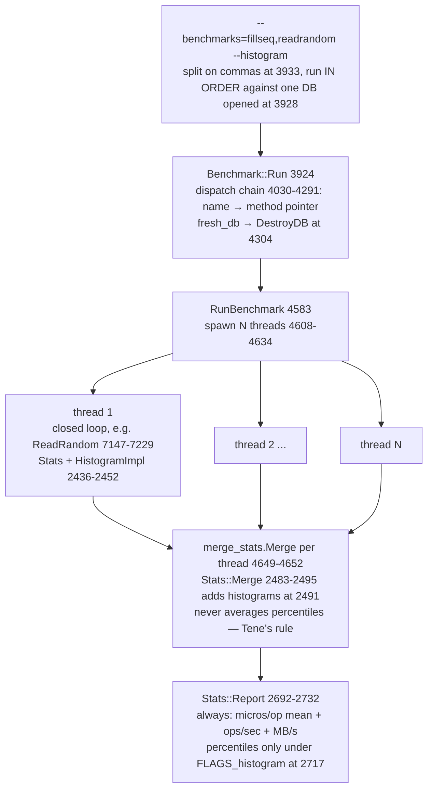

# db_bench: the shared vocabulary of storage benchmarking

`fillseq`, `readrandom`, `readwhilewriting` — these workload names started in
LevelDB, were extended by RocksDB, and now appear in every LSM paper since.
This chapter is a skim route through the 10,367-line tool that defines them —
but first it builds the concepts step by step: why a shared workload
vocabulary exists at all, how every workload reduces to picking an integer,
what each name actually stresses, and what to distrust in the numbers the
tool prints. The goal is the *vocabulary* and the measurement shape, not the
harness code. Name your own benchmarks in this language and your numbers
become comparable to two decades of published results.

Every anchor below is RocksDB at commit **`7c80a5a`**, the revision this repo
pins (`resources/codebases.md`, pin table), quoted with the line numbers the
code occupies in that revision. `tools/db_bench_tool.cc` is **10,367 lines**
there; it churns fast, so on any other commit re-grep before trusting a
number. `tools/pinned-source.py show rocksdb tools/db_bench_tool.cc -r
6107:6119` opens exactly what is quoted here.

## The problem in one sentence

"Our engine does 500K writes/s" is uninterpretable — sequential or random
keys? new inserts or overwrites? uniform or skewed? durable or buffered?
measured during compaction or before it? — and this repo has already measured
one of those axes on its own: the durability choice alone moves the ceiling
from **856,898/s** (buffered `write()`) to **44,109/s** (`fsync`) to
**337/s** (`F_FULLFSYNC`), a 2,542× spread
([FINDINGS.md](../../FINDINGS.md) row 5). Without a shared workload
vocabulary, no two papers' numbers name the same experiment.

## The concepts, step by step

### Step 1 — why storage engines need a standard workload vocabulary

> **In:** nothing yet — this step fixes the vocabulary and the units every
> later step uses.
> **Out:** the axes a benchmark name has to pin down, and the measured size of
> two of them. Step 2 then shows that all of the *key-order* axis reduces to
> one function.

A storage engine's performance is not one number but a surface: it depends on
the operation mix (reads vs writes vs scans), the key order (sequential vs
random), whether keys are new or overwrite old ones, whether each write is
made durable, and what background work is running.

Four terms, defined before anything leans on them:

- An **LSM engine** (log-structured merge-tree) buffers writes in memory, then
  writes them out as immutable sorted files that are later merged in the
  background.
- **Compaction** is that deferred merging: reading several sorted files and
  writing one merged file, discarding shadowed versions. It is real IO and CPU
  that competes with foreground traffic, and it happens *after* the write that
  caused it was already reported as fast.
- **Write amplification** is bytes actually written to storage ÷ bytes the
  application asked to write. It is the price of compaction. Topic 4's notes
  give the arithmetic: leveled compaction with size ratio `T` over `L` levels
  rewrites each byte about `T/2` times per level, so `T/2 × L` — at `T=10`,
  `L=4` that is **~20×** ([topic 4 notes](../04-lsm-deep-dive/notes.md)).
- **Space amplification** is bytes on disk ÷ logical bytes. Topic 1 measured
  it end to end on the same 108 MB of records: **0.45× for fjall** (an LSM,
  which compresses its sorted runs) against **63.28× for redb** (a
  copy-on-write B-tree under random-order inserts) — a 140× spread
  ([FINDINGS.md](../../FINDINGS.md) row 1).

So the same engine can absorb a sequential load near disk bandwidth and
collapse under random overwrites, purely because of compaction debt — and the
same *workload* can produce wildly different verdicts on two engine families.

db_bench's fix: give each meaningful point on that surface a *name*, so "we
ran `fillrandom` then `readwhilewriting`" pins down the experiment as
precisely as a chess opening's name pins down twelve moves. The menu of names
is one flag, `DEFINE_string(benchmarks, …)` at **115-170**, with its own help
text at **172-273** — that help text is the best documentation the tool has.

Why it matters: LevelDB shipped these names in 2011, RocksDB extended them,
and every LSM paper since reports in them — the vocabulary *is* the
comparability.

### Step 2 — every workload is "pick an integer, then lay it out as a key"

> **In:** the axes from Step 1, in particular key order.
> **Out:** the single function that decides key order for every `fill*`
> workload, and the duplicate rate it produces — the input to Step 3's four
> names.

Under every workload name sits the same skeleton: choose an integer, then lay
that integer out as a fixed-width key. All the drama — sequential vs random,
insert vs overwrite — lives entirely in *how the next integer is chosen*.
There are exactly three ways, and they are an enum:

```cpp
// tools/db_bench_tool.cc — the whole key-order axis, 5869
  5869    enum WriteMode { RANDOM, SEQUENTIAL, UNIQUE_RANDOM };
```

`KeyGenerator` (**6088-6134**) turns that enum into integers, and its `Next()`
is thirteen lines that contain everything Step 3 will name:

```cpp
// tools/db_bench_tool.cc — KeyGenerator::Next, 6107-6119
  6107      uint64_t Next() {
  6108        switch (mode_) {
  6109          case SEQUENTIAL:
  6110            return next_++;
  6111          case RANDOM:
  6112            return rand_->Next() % num_;
  6113          case UNIQUE_RANDOM:
  6114            assert(next_ < num_);
  6115            return values_[next_++];
  6116        }
  6117        assert(false);
  6118        return std::numeric_limits<uint64_t>::max();
  6119      }
```

The line that carries the argument is **6112**: `% num_` is a draw *with
replacement*, so the same key can come up twice. `values_` on 6115 is a
pre-shuffled permutation of `0..num_`, built once in the constructor:

```cpp
// tools/db_bench_tool.cc — inside the KeyGenerator constructor, 6093-6104
  6093        if (mode_ == UNIQUE_RANDOM) {
  // ... 6094-6097: a comment on the memory cost of materialising the vector ...
  6098          values_.resize(num_);
  6099          for (uint64_t i = 0; i < num_; ++i) {
  6100            values_[i] = i;
  6101          }
  6102          RandomShuffle(values_.begin(), values_.end(),
  6103                        static_cast<uint32_t>(*seed_base));
  6104        }
```

Line **6098** is the cost of the mode: `UNIQUE_RANDOM` materialises an 8-byte
slot per key before the first write, so `--num=1000000000` wants 8 GB of RAM
just for the permutation. Line 6103 is why the order reproduces: the shuffle
is seeded from `seed_base`.

**The integer then becomes a key** through `GenerateKeyFromInt`
(**3802-3842**) — and here the tidy story ("zero-padded fixed-width key") is
wrong. The code's own comment at 3797-3801 says what it does:

```cpp
// tools/db_bench_tool.cc — GenerateKeyFromInt's comment and its tail, 3797-3801 and 3830-3841
  3797    //   - If keys_per_prefix_ is 0, the key is simply a binary representation of
  3798    //     random number followed by trailing '0's
  3799    //     ----------------------------
  3800    //     |        key 00000         |
  3801    //     ----------------------------
  // ... 3802-3829: the signature, the --use_existing_keys shortcut, and the
  // ...            optional prefix block written when keys_per_prefix_ > 0 ...
  3830      int bytes_to_fill = std::min(key_size_ - static_cast<int>(pos - start), 8);
  3831      if (port::kLittleEndian) {
  3832        for (int i = 0; i < bytes_to_fill; ++i) {
  3833          pos[i] = (v >> ((bytes_to_fill - i - 1) << 3)) & 0xFF;
  3834        }
  3835      } else {
  3836        memcpy(pos, static_cast<void*>(&v), bytes_to_fill);
  3837      }
  3838      pos += bytes_to_fill;
  3839      if (key_size_ > pos - start) {
  3840        memset(pos, '0', key_size_ - (pos - start));
  3841      }
  3842    }
```

Line **3833** is the one to look at. The shift `(bytes_to_fill - i - 1) << 3`
emits the *most significant* byte first: the integer is written **big-endian
binary**, not decimal digits. The padding on 3840 is ASCII `'0'` (0x30) filling
the remaining `--key_size` bytes (default 16, line 388). Big-endian is the
load-bearing choice: RocksDB's default comparator orders keys byte by byte, so
big-endian layout makes byte order agree with numeric order, and that is
*why* `SEQUENTIAL` integers produce keys that arrive in sorted order.

**How many duplicates does `RANDOM` produce?** The guide's claim is "~37% of a
full pass", and it is worth deriving rather than asserting, because it is the
whole difference between `fillrandom` and `filluniquerandom`. Line 6112 draws
uniformly from `0..n-1` (up to negligible modulo bias, `n ≪ 2^64`), and
`DoWrite` runs `num_ops = num_` draws per thread (**6160**), each thread with
its own generator over the full key space (**6177-6181**). So, with
`--threads=1`:

```
symbols
  n   = FLAGS_num = the key space size AND the number of draws (6160, 6177)
  k   = a particular key in 0..n-1

  P(one draw misses k)      = 1 - 1/n            each draw is uniform (6112)
  P(all n draws miss k)     = (1 - 1/n)^n        draws are independent
  E[keys never written]     = n * (1 - 1/n)^n
  E[distinct keys written]  = n * (1 - (1 - 1/n)^n)
  E[duplicate writes]       = n - E[distinct] = n * (1 - 1/n)^n

worked on the guide's own --num=10000000, and on four smaller n to show the limit

  n = 10          (1-1/n)^n = 0.348678   ->  3.49 of 10 keys never written
  n = 100         (1-1/n)^n = 0.366032   ->  36.6 of 100
  n = 1000        (1-1/n)^n = 0.367695   ->  368 of 1000
  n = 1000000     (1-1/n)^n = 0.3678793  ->  367,879 of 1,000,000
  n = 10000000    (1-1/n)^n = 0.36787942 ->  3,678,794 of 10,000,000

  at n = 10,000,000:
    expected keys never written   = 3,678,794   (36.788%)
    expected distinct keys        = 6,321,206   (63.212%)
    expected duplicate writes     = 10,000,000 - 6,321,206 = 3,678,794  (36.788%)

  the limit: (1 - 1/n)^n -> 1/e = 0.36787944...   (already matched to 7 digits at n = 1e7)
```

Two counts fall out, and they are equal by conservation — every write is
either a key's first appearance or a repeat, so `n − distinct` repeats and
`n × (1−1/n)^n` never-written keys are the same number. So a 10 M-key
`fillrandom` writes **10 M records into 6.32 M distinct keys**, leaving 3.68 M
keys never touched and 3.68 M writes that are overwrites. Each of those
overwrites creates a dead version that compaction must later rewrite and drop
— write amplification (Step 1) with nothing to show for it.

`UNIQUE_RANDOM` exists precisely to remove that term: 6115 hands out each
integer exactly once, so arrival order is random but the duplicate count is
**zero**. That is the isolation experiment — random *placement* without random
*garbage*.

Why it matters: once you see this skeleton, the entire workload menu in
Steps 3-4 is this one function plus an operation type, and "random writes"
splits into two genuinely different experiments.

### Step 3 — the fill family: four ways to write

> **In:** the three key orders from Step 2, and the duplicate arithmetic.
> **Out:** four named write workloads, each pinning one more variable — the
> write-side half of the menu Step 6 composes into a methodology.

The `fill*` names are write workloads. `Benchmark::Run`'s dispatch chain turns
each name into a method pointer and a couple of flag mutations, and the
mutations are where the meaning lives:

```cpp
// tools/db_bench_tool.cc — the fill family's arms of the dispatch chain, 4030-4056
  4030      } else if (name == "fillseq") {
  4031        fresh_db = true;
  4032        method = &Benchmark::WriteSeq;
  // ... 4033-4036: fillbatch, the same but with entries_per_batch_ = 1000 ...
  4037      } else if (name == "fillrandom") {
  4038        fresh_db = true;
  4039        method = &Benchmark::WriteRandom;
  // ... 4040-4049: filluniquerandom, which forces num_threads to 1 ...
  4050      } else if (name == "overwrite") {
  4051        method = &Benchmark::WriteRandom;
  4052      } else if (name == "fillsync") {
  4053        fresh_db = true;
  4054        num_ /= 1000;
  4055        write_options_.sync = true;
  4056        method = &Benchmark::WriteRandom;
```

The two lines that carry the argument are **4050-4051**: `overwrite` and
`fillrandom` call the *same method*, `WriteRandom`. The entire difference is
that `fillrandom` sets `fresh_db = true` on 4038 and `overwrite` does not —
Step 6 shows what `fresh_db` does. So:

- **`fillseq`** — `SEQUENTIAL` mode (4032 → 5880 → `DoWrite(thread,
  SEQUENTIAL)`). The LSM fast path: keys arrive in the comparator's own order
  (Step 2's big-endian layout), so successive memtable flushes produce files
  with disjoint key ranges and there is nothing for compaction to merge.
  Papers use it to *build* the database before the real test — it is a setup
  step wearing a benchmark's name.
- **`fillrandom`** — random-order inserts into a fresh DB (4037-4039). Files
  overlap, compaction runs continuously, and Step 2's 3.68 M duplicate writes
  per 10 M ops add garbage on top. This is the honest write-throughput number.
- **`overwrite`** — the same random writes with **no** fresh DB (4050-4051),
  so it runs against whatever the previous entry in the comma list left
  behind. Against a DB that already holds the full key space, nearly every
  write shadows a live version, which is maximum compaction pressure — a
  different beast from `fillrandom` even though both are "random writes", and
  the one that matches a steady-state production database.
- **`fillsync`** — random writes with `write_options_.sync = true` (4055) over
  `num_ / 1000` ops (4054). The `/1000` is the tell: the author already knew
  this workload is far slower and shortened it so the run would finish.

**How much slower is `fillsync`?** Not a number to guess, and the tidy
folklore answer ("three to four orders of magnitude") is wrong. Two sources
settle it. First, what `sync = true` actually promises — RocksDB's own header
is unusually precise:

```cpp
// include/rocksdb/options.h — the WriteOptions::sync contract, 2502-2515
  2502    // If true, the write will be flushed from the operating system
  2503    // buffer cache (by calling WritableFile::Sync()) before the write
  2504    // is considered complete.  If this flag is true, writes will be
  2505    // slower.
  // ... 2506-2511: what is and is not lost when the process or machine dies ...
  2512    // In other words, a DB write with sync==false has similar
  2513    // crash semantics as the "write()" system call.  A DB write
  2514    // with sync==true has similar crash semantics to a "write()"
  2515    // system call followed by "fdatasync()".
```

Line **2515** is the one that decides the number: the promise is
`fdatasync`-grade, *not* a drive cache flush. Second, topic 5 measured that
exact ladder ([FINDINGS.md](../../FINDINGS.md) row 5, Apple M3 Pro / APFS):

```
per-call p50 and the implied single-threaded commit ceiling (topic 5, notes.md)

  write() only    1.17 µs   ->  856,898 commits/s   the fillseq/fillrandom rung
  fsync          22.67 µs   ->   44,109 commits/s   856,898 / 44,109 =    19.4x slower
  F_FULLFSYNC     2.97 ms   ->      337 commits/s   856,898 /    337 = 2,542x slower

  fillsync's rung, per options.h:2515                = the middle one
  so the expected gap is  ~19x  (1.3 orders of magnitude), not 3-4 orders
```

The "3-4 orders" figure belongs to the *bottom* rung — a `Sync()` that really
flushes the drive's volatile cache, which on macOS is `F_FULLFSYNC` and costs
2,542× (3.4 orders). Both rungs get called "fsync" in conversation and they
differ by 131×, so a `fillsync` number is uninterpretable until you know which
one your platform's `WritableFile::Sync()` reached. That is Step 1's point
applied to db_bench itself.

Why it matters: a paper quoting "write throughput" without saying which of
these four it ran has told you almost nothing — and the durability axis alone,
measured in this repo, spans 19× to 2,542× depending on a distinction the
benchmark name does not make.

### Step 4 — the read family: point, scan, and interference

> **In:** a database in whatever state the write workloads of Step 3 left it.
> **Out:** the read-side half of the menu, plus the one name whose reported
> number comes from a subset of its threads — which Step 7 revisits.

The read-side names split along two axes — access shape, and whether writes
run concurrently:

- **`readrandom` / `readseq` / `readreverse`** (dispatch at 4078, 4062, 4076)
  — point lookups versus iterator scans, forward and backward. A **point
  lookup** must consult the memtable and then every level that could hold the
  key, so it may touch several files; a **scan** positions once and then
  streams.
- **`seekrandom`** (4143) — the cost of positioning an iterator. `Seek` has to
  touch every level to build the merging iterator's min-heap before it can
  yield the first key (`table/merging_iterator.cc:23-39` states the invariant
  every `Seek*()` must restore), so its profile is unlike a point `Get`.
- **`multireadrandom`** (4086) — `MultiGet` batching: `entries_per_batch_`
  keys per call, amortising per-call overhead across the batch.
- **`readwhilewriting`** (4158-4160) — the "does compaction wreck my read
  tail?" test, and the closest thing in the menu to production. The
  `*whilemerging` / `*whilescanning` variants (4161-4166) isolate other
  interference sources.

`readwhilewriting` is worth one more level of detail, because its thread
arithmetic is not what the flag says:

```cpp
// tools/db_bench_tool.cc — the dispatch arm, 4158-4160, and the method, 8337-8343
  4158      } else if (name == "readwhilewriting") {
  4159        num_threads++;  // Add extra thread for writing
  4160        method = &Benchmark::ReadWhileWriting;

  8337    void ReadWhileWriting(ThreadState* thread) {
  8338      if (thread->tid > 0) {
  8339        ReadRandom(thread);
  8340      } else {
  8341        BGWriter(thread, kWrite);
  8342      }
  8343    }
```

Line **4159** adds one thread beyond `--threads`, and **8338** makes thread 0
the writer and threads 1..N readers. So `--threads=8 readwhilewriting` runs
nine threads: eight readers and one writer. And the writer removes itself from
the reported figure:

```cpp
// tools/db_bench_tool.cc — inside BGWriter, 8372-8373
  8372      // Don't merge stats from this thread with the readers.
  8373      thread->stats.SetExcludeFromMerge();
```

Line **8373** sets the flag that `Stats::Merge` honours at 2484-2486 (Step 7),
so the ops/s `readwhilewriting` prints is a *readers-only* number measured
while a writer ran. That is the right choice — mixing a writer's ops into a
read throughput figure would be meaningless — but it means the line tells you
nothing about what the writer achieved, and the writer's rate is a free
variable unless you also set `--benchmark_write_rate_limit` (1702-1705).

Why it matters: read-only numbers (`readrandom` on a freshly-compacted DB) are
the engine's best case; `readwhilewriting` is where LSM read/write
interference — the thing users actually hit — shows up, and it is reported
from only part of the run.

### Step 5 — distribution knobs: uniform lies, skew is reality

> **In:** the read workloads of Step 4, which so far draw keys uniformly.
> **Out:** the two skew models db_bench offers, and the property that separates
> them — a property Step 7's caveats depend on.

By default the random modes draw keys **uniformly** — every key equally
likely, which is exactly what line 6112's `% num_` gives. Production traffic is
**skewed**: a few hot keys absorb most of the requests. The classic model is a
**Zipfian distribution**, where the popularity of the k-th hottest key falls
off as `1/k^s` for some exponent `s`, so a small fraction of keys takes a large
fraction of the traffic. (The capstone's `workload` crate uses `s = 0.99`, the
YCSB default, for the same reason.)

The difference is not cosmetic. Uniform access over a key space larger than
memory defeats every cache — no key is hot enough to stay resident — while
skewed access lets the block cache serve most reads. The two can disagree on
read throughput by an order of magnitude on identical hardware.

db_bench offers two skew knobs, and they differ in a way that matters more
than the shape of the curve.

**`--read_random_exp_range`** (**452-456**) bends `readrandom`'s draw
exponentially:

```cpp
// tools/db_bench_tool.cc — GetRandomKey, 7103-7120
  7103    int64_t GetRandomKey(Random64* rand) {
  7104      uint64_t rand_int = rand->Next();
  7105      int64_t key_rand;
  7106      if (read_random_exp_range_ == 0) {
  7107        key_rand = rand_int % FLAGS_num;
  7108      } else {
  // ... 7109-7115: order = -(uniform in [0,1)) * read_random_exp_range_, then
  // ...            rand_num = exp(order) * FLAGS_num, which concentrates draws
  // ...            near 0 — larger flag value, sharper skew ...
  7116        // Map to a different number to avoid locality.
  7117        const uint64_t kBigPrime = 0x5bd1e995;
  7118        // Overflow is like %(2^64). Will have little impact of results.
  7119        key_rand = static_cast<int64_t>((rand_num * kBigPrime) % FLAGS_num);
  7120      }
```

The line to focus on is **7119**, and the comment above it on 7116 states the
intent: the hot key *IDs* are deliberately scattered across the key space by
multiplying by a large prime. So this flag gives you hotness **without**
key-space locality — the hot keys are hot, but they live in different SST
blocks. Hold that; it is the exact defect the FAST'20 paper measures.

**`mixgraph`** (dispatch at **4133**) is the industrial-strength answer. It
models Facebook's *measured* production workloads, from Cao et al.,
"Characterizing, Modeling, and Benchmarking RocksDB Key-Value Workloads at
Facebook" (FAST '20). §7.1 of that paper is the indictment: YCSB reproduces
the overall hotness distribution, but "the hot KV-pairs are actually randomly
distributed in the whole key-space", which makes a large number of data blocks
hot and triggers "an extremely large number of block reads" — and the paper
adds explicitly, "db_bench has a similar situation". §7.2 is the fix: partition
the key space into key-ranges sized at the average number of KV-pairs per SST
file, and model the *hotness of the ranges*, so hot keys sit near each other.

The paper's fitted models (§7.4, on UDB's Assoc workload) map onto db_bench's
flags almost one to one — with one discrepancy the paper wins:

| db_bench flag (lines) | form in the flag's help text | FAST '20 §7.4's fit |
|---|---|---|
| `keyrange_dist_a..d` (**1708-1719**) | `f(x)=a*exp(b*x)+c*exp(d*x)` — two-term **exponential** | "The average KV-pair access count of key-ranges can be better fit in a two-term **power** model" |
| `key_dist_a`, `key_dist_b` (**1723-1726**) | `f(x)=a*x^b` — simple power | "the distribution of KV-pair access counts follows a power-law that can be fit to the simple power model" ✓ |
| `value_theta/k/sigma` (**1727-1737**) | Generalized Pareto | "Generalized Pareto Distribution best fits the value sizes" ✓ |
| `iter_theta/k/sigma` (**1738-1748**) | Generalized Pareto | "…and Iterator scan length" ✓ |
| `sine_a..d` (**1691-1697**) | `f(x) = A sin(bx + c) + d` | "the QPS variation has a strong diurnal pattern… better fit to the Sine model with a 24-hour period" ✓ |

The Pareto value sizes are the paper's, confirmed at §7.4 (and §7.2 for
ZippyDB). The key-range model is **not** the paper's two-term power model:
db_bench implements a two-term *exponential*, and the code says so twice — the
help text on 1709-1710 and the call to `gen_exp.InitiateExpDistribution` at
**7944-7946**, guarded by "is any `keyrange_dist_*` non-zero" on 7941-7942.
Both are two-parameter-pair mixtures fitted to the same empirical curve, so
they are close in practice, but if you cite mixgraph as "the paper's model",
this is the term that is yours and not theirs. The `value_k = 0.2615` and
`value_sigma = 25.45` defaults, by contrast, are flagged in the source as
"reasonable defaults based on the mixgraph paper" (1730-1737).

The property that separates the two knobs: `read_random_exp_range` destroys
locality on purpose (7116-7119); `mixgraph` preserves it by construction
(7963-7965 routes the draw through the key-range distribution first). Same
hotness curve, opposite block-cache behaviour.

Why it matters: a benchmark's key distribution silently decides whether the
cache hierarchy participates in the result — and *where* the hot keys sit
decides it a second time, independently of how hot they are.

### Step 6 — the comma list is the methodology

> **In:** the named workloads of Steps 3-5, as strings.
> **Out:** the state each one runs against — the missing half of every
> published db_bench figure, and the thing Step 7 tells you to ask for.

`--benchmarks` is split on commas and run in order, against one database that
is opened once:

```cpp
// tools/db_bench_tool.cc — the top of Benchmark::Run, 3924-3935
  3924    void Run(ToolHooks& hooks) {
  3925      if (!SanityCheck()) {
  3926        ErrorExit();
  3927      }
  3928      Open(&open_options_, hooks);
  3929      PrintHeader(open_options_);
  3930      std::stringstream benchmark_stream(FLAGS_benchmarks);
  3931      std::string name;
  3932      std::unique_ptr<ExpiredTimeFilter> filter;
  3933      while (std::getline(benchmark_stream, name, ',')) {
  3934        // Sanitize parameters
  3935        num_ = FLAGS_num;
```

Line **3928** opens the DB *before* the loop on 3933, so by default every
entry inherits the previous entry's database. But — and this is the correction
that changes how you read a comma list — an entry that set `fresh_db = true`
in Step 3's dispatch destroys it first:

```cpp
// tools/db_bench_tool.cc — after the dispatch chain, 4295-4317
  4295        if (fresh_db) {
  4296          DbStateMutationGuard mutation(this);
  4297          if (FLAGS_use_existing_db) {
  4298            fprintf(stdout, "%-12s : skipped (--use_existing_db is true)\n",
  4299                    name.c_str());
  4300            method = nullptr;
  4301          } else {
  4302            if (db_.db != nullptr) {
  4303              db_.DeleteDBs();
  4304              DestroyDB(FLAGS_db, open_options_);
  4305            }
  // ... 4306-4315: the same destroy loop for the --num_multi_db case ...
  4316          Open(&open_options_, hooks);  // use open_options for the last accessed
  4317        }
```

Line **4304** is the one to look at: `DestroyDB`. Every `fill*` name except
`overwrite` sets `fresh_db` (4031, 4038, 4042, 4053, 4058), so it *wipes*
whatever came before it. So:

```
db_bench --benchmarks=fillseq,readrandom --num=10000000 --value_size=100 --histogram
              │        │
              │        └── measured against the DB fillseq just built
              └── fresh_db = true (4031) → DestroyDB (4304) → build 10M keys in order

fillseq,fillrandom,readrandom     fillrandom wipes fillseq's work (4038) — the
                                  first name contributed nothing at all
fillrandom,overwrite,readrandom   overwrite does NOT wipe (4050-4051), so it
                                  shadows fillrandom's 6.32M live keys and
                                  readrandom sees a DB thick with dead versions
```

`fillseq,readrandom` measures reads on a clean, fully-sorted DB;
`fillrandom,readrandom` measures reads on a fragmented one — same second
benchmark, very different numbers. And `--use_existing_db` (4297-4300) turns
the destroy into a *skip*, so the same command line means something different
again. That ordering **is** the methodology, and it is the first thing to
check when reproducing a published result.

Why it matters: two papers can both say "readrandom, 10M keys" and still be
measuring different databases — and a comma list you have not traced through
4295 may contain a name that did nothing.

### Step 7 — what to distrust in the reported numbers

> **In:** everything above — the workload, the state it ran against, and the
> threads that ran it.
> **Out:** a list of claims a db_bench figure can and cannot support, and the
> line of code behind each one.

Knowing how the numbers are produced tells you which claims they can support:


```mermaid
flowchart TD
    F["--benchmarks=fillseq,readrandom --histogram<br/>split on commas at 3933, run IN ORDER against one DB opened at 3928"]
    F --> RUN["Benchmark::Run 3924<br/>dispatch chain 4030-4291: name → method pointer<br/>fresh_db → DestroyDB at 4304"]
    RUN --> RB["RunBenchmark 4583<br/>spawn N threads 4608-4634"]
    RB --> T1["thread 1<br/>closed loop, e.g. ReadRandom 7147-7229<br/>Stats + HistogramImpl 2436-2452"]
    RB --> T2["thread 2 ..."]
    RB --> TN["thread N"]
    T1 --> M["merge_stats.Merge per thread 4649-4652<br/>Stats::Merge 2483-2495 adds histograms at 2491<br/>never averages percentiles — Tene's rule"]
    T2 --> M
    TN --> M
    M --> OUT["Stats::Report 2692-2732<br/>always: micros/op mean + ops/sec + MB/s<br/>percentiles only under FLAGS_histogram at 2717"]
```

- **Default output is throughput, plus a mean.** `Stats::Report` prints
  `micros/op`, `ops/sec`, elapsed seconds and MB/s on 2712-2716 — and the
  `micros/op` on 2715 is `seconds_ * 1e6 / done_`, an arithmetic mean.
  Percentiles appear only inside `if (FLAGS_histogram)` on **2717-2723**. A
  quoted p99 without that flag did not come from here.
- **The per-op clock is an inter-arrival time, not a service time.**
  `FinishedOps` (**2564-2584**) computes `micros = now - last_op_finish_`
  (2571) and then sets `last_op_finish_ = now` (2583). The interval it records
  is "since the previous op finished", so it includes everything the loop did
  between the two ops — key generation, the `GetRandomKey` call, the loop
  bookkeeping — not just the engine call.
- **It's a closed loop.** Each thread issues the next op only after the
  previous one completed — `ReadRandom`'s `while (!duration.Done(1))` at
  **7147** runs to `FinishedOps` at **7228** with nothing in between that
  waits for a clock. This is the same structure as redis-benchmark
  ([reading-redis-benchmark.md](reading-redis-benchmark.md)), so it suffers
  **coordinated omission**: the measurement error where the generator, by
  waiting for the server, stops issuing requests during a stall and therefore
  under-samples exactly the worst moments. A compaction stall yields a handful
  of bad samples instead of the thousands a paced workload would record. Topic
  34 measured the size of this on identical work: **closed-loop p99 = 1.0 µs
  against open-loop p99 = 90 ms**, a 90,000× understatement
  ([FINDINGS.md](../../FINDINGS.md) row 34).
- **The rate limiter does not fix it — it is explicitly excluded from the
  measurement.** `--benchmark_write_rate_limit` (1702-1705) does exist, and
  `RunBenchmark` builds the limiter at 4590-4598. But look at what `DoWrite`
  does immediately after waiting on it:

```cpp
// tools/db_bench_tool.cc — inside DoWrite, after the rate limiter's Request, 6524-6532
  6524        if (thread->shared->write_rate_limiter.get() != nullptr) {
  6525          thread->shared->write_rate_limiter->Request(
  6526              batch_bytes, Env::IO_HIGH, nullptr /* stats */,
  6527              RateLimiter::OpType::kWrite);
  6528          // Set time at which last op finished to Now() to hide latency and
  6529          // sleep from rate limiter. Also, do the check once per batch, not
  6530          // once per write.
  6531          thread->stats.ResetLastOpTime();
  6532        }
```

  Line **6531** calls `ResetLastOpTime` (2559-2562), whose whole body is
  `last_op_finish_ = clock_->NowMicros()`. The comment on 6528-6529 says the
  intent out loud: *hide* the pacing wait from the latency. So even the paced
  mode measures service time by construction — there is no intended-arrival
  timestamp anywhere in `Stats` to subtract from. Coordinated omission here is
  not an oversight, it is a documented design choice.
- **"Latency" here is service time by construction** for a second reason:
  db_bench measures the *embedded* engine — no network, no queueing, no client
  library. Legitimate for engine work; misleading if quoted as user-facing
  latency.
- **The histogram is coarse.** `HistogramImpl`'s buckets grow by **1.5×**
  (`monitoring/histogram.cc:23-42`, the `bucket_val = 1.5 * bucket_val` on
  line 28, rounded to two significant digits on 31-38), and `Percentile`
  interpolates *linearly* inside the chosen bucket
  (`monitoring/histogram.cc:130-160`, the interpolation on 137-147, clamped to
  the observed min and max on 148-155). A p99 that lands mid-bucket is
  therefore a linear guess across a range 50% wide. The printed set is fixed at
  P50/P75/P99/P99.9/P99.99 (`monitoring/histogram.cc:197-199`) — there is no
  p99.999, which is where Step 4's rare compaction stalls would have shown up.
- One thing it gets *right*: per-thread histograms are **merged**, never
  averaged. `RunBenchmark` folds each thread's `Stats` in at 4649-4652, and
  `Stats::Merge` (2483-2495) adds the *bucket counts* together at 2491. You
  cannot average percentiles (Tene's rule), and db_bench does not try. The
  same function honours `exclude_from_merge_` at 2484-2486, which is how
  Step 4's background writer drops out.

Why it matters: db_bench numbers are honest answers to narrow questions;
distrust begins when they are quoted as answers to broad ones.

## Where each step lives in the code — the skim route (30–60 min)

`tools/db_bench_tool.cc` is a **10,367-line** flag-driven monolith at `7c80a5a`
— **do not read it linearly**; hit these anchors:

| Lines | What | Step |
|-------|------|------|
| 115-170 | `DEFINE_string(benchmarks, …)` — the full workload menu; the help text at 172-273 is the best documentation the tool has | 1, 3, 4 |
| 275-458 | The knobs that define a workload: `num` (275), `threads` (328), `value_size` (337), `key_size` (388), `read_random_exp_range` (452-456), `histogram` (458) | 1, 5, 7 |
| 1691-1697 | `sine_a..d` — the diurnal QPS model, `f(x) = A sin(bx+c)+d` | 5 |
| 1702-1705 | `benchmark_write_rate_limit` — the paced-write flag whose wait is hidden at 6531 | 7 |
| 1708-1719 | `keyrange_dist_a..d` — mixgraph's two-term exponential key-range model | 5 |
| 1723-1748 | `key_dist_a/b` (power), `value_*` and `iter_*` (Generalized Pareto) — the rest of the mixgraph fit | 5 |
| 2436-2452 | `class Stats` — per-thread state; `hist_` is a map of `HistogramImpl` per op type (2450-2452) | 7 |
| 2483-2495 | `Stats::Merge` — histogram buckets added at 2491, `exclude_from_merge_` honoured at 2484-2486 | 4, 7 |
| 2559-2562 | `Stats::ResetLastOpTime` — one line, and the whole coordinated-omission story | 7 |
| 2564-2584 | `Stats::FinishedOps` — `micros = now - last_op_finish_` (2571), recorded only under `FLAGS_histogram` (2569) | 7 |
| 2692-2732 | `Stats::Report` — throughput always (2712-2716), percentiles only at 2717-2723 | 7 |
| 3797-3842 | `GenerateKeyFromInt` — big-endian binary at 3833, `'0'` padding at 3840, not decimal zero-padding | 2 |
| 3924-3935 | `Benchmark::Run` — `Open` once at 3928, comma split at 3933 | 6 |
| 4030-4291 | The dispatch chain: `name == "fillseq"` → method pointer. Fill family 4030-4061, read family 4062-4090, `mixgraph` 4133, `seekrandom` 4143, `readwhilewriting` 4158-4160, unknown-name error 4290-4292 | 3, 4, 5, 6 |
| 4295-4317 | `if (fresh_db)` → `DestroyDB` at 4304 — why some comma-list entries erase the ones before them | 6 |
| 4583-4652 | `RunBenchmark` — rate limiters 4590-4598, thread spawn 4608-4634, per-thread merge 4649-4652 | 7 |
| 5869 | `enum WriteMode { RANDOM, SEQUENTIAL, UNIQUE_RANDOM }` | 2 |
| 6088-6134 | `class KeyGenerator` — the shuffle at 6098-6103, `Next()` at 6107-6119 | 2 |
| 6158-6181 | `DoWrite` — one `KeyGenerator` per thread over the whole key space | 2, 3 |
| 6524-6532 | the write rate limiter, and `ResetLastOpTime` hiding its wait | 7 |
| 7103-7120 | `GetRandomKey` — exponential skew, then `kBigPrime` to destroy locality (7116-7119) | 5 |
| 7147-7229 | `ReadRandom`'s loop — a closed loop, `FinishedOps` at 7228 | 7 |
| 7941-7946 | mixgraph's `InitiateExpDistribution` — the two-term exponential, in code | 5 |
| 8337-8343 | `ReadWhileWriting` — tid 0 writes, the rest read | 4 |
| 8372-8373 | `SetExcludeFromMerge` — the writer drops out of the reported number | 4, 7 |

Suggested route: the menu (115-170) and its help text → `Benchmark::Run`
(3924) → the dispatch chain (4030-4291) for the three or four names you care
about → `fresh_db` (4295-4317) → `KeyGenerator::Next` (6107) →
`GenerateKeyFromInt` (3802) → `RunBenchmark` (4583) → `FinishedOps` (2564) and
`Report` (2692). As you trace it, look for an intended-arrival timestamp
anywhere in `Stats` (2436-2452); its absence is the last bullet of Step 7.

Three anchors live outside `db_bench_tool.cc` and are worth the detour:
`include/rocksdb/options.h:2502-2515` (what `sync = true` actually promises —
Step 3), `monitoring/histogram.cc:23-42` and `130-160` (how coarse every
printed percentile is — Step 7), and `table/merging_iterator.cc:23-39` (why
`seekrandom` costs what it does — Step 4).

## Questions to answer in notes.md

1. `fillrandom` and `overwrite` dispatch to the *same* method, `WriteRandom`
   (4039, 4051). Find the one line that differs, then say what
   `fillrandom,overwrite,readrandom` measures that `fillrandom,readrandom`
   does not.
2. `GenerateKeyFromInt` writes the integer big-endian at 3833. Rewrite line
   3833 as little-endian in your head: which of Step 3's four fill workloads
   changes character, and what happens to compaction under `fillseq`?
3. Step 2's arithmetic says a 10 M-op `fillrandom` touches 6.32 M distinct
   keys. Run the same derivation for `--num=1000 --writes=10000` (10 draws per
   key): what fraction of the key space is still never written, and why does
   the answer stop being 1/e?
4. `--benchmark_write_rate_limit` paces writes, and 6531 then hides the pacing
   wait from the histogram. If you wanted db_bench to report open-loop latency
   instead, which field would you add to `class Stats` (2436-2452), and which
   of 2571 and 6531 would have to change?
5. `readwhilewriting` with `--threads=8` runs nine threads and reports eight
   of them (4159, 8338, 8373). Design the smallest experiment using only the
   flags in 275-458 and 1702-1705 that tells you whether a p99 regression came
   from the writer's rate or from compaction.

## Takeaway

db_bench's value is the workload taxonomy, not the harness. When topic 4 (LSM)
and M4 (backend shootout) arrive, name capstone benches in this vocabulary
(`fillseq`, `readrandom`, `readwhilewriting`) so numbers are comparable against
published RocksDB results — and record the comma list, not just the name, since
Step 6 shows the list is the methodology.

## Done when

Answer each before unfolding it.

- [ ] You can explain why a shared workload vocabulary matters more than any single number db_bench prints.

  <details><summary>Answer</summary>

  Because a single number names a point on a surface without naming the point.
  The axes are operation mix, key order, insert-vs-overwrite, durability, and
  what background work was running, and this repo has measured two of them
  independently: the durability axis alone spans 856,898/s (buffered `write()`)
  to 44,109/s (`fsync`) to 337/s (`F_FULLFSYNC`), a 2,542× range
  ([FINDINGS.md](../../FINDINGS.md) row 5); the same 108 MB of records lands at
  0.45× space amplification on an LSM and 63.28× on a copy-on-write B-tree
  (row 1). A number without the axes is compatible with almost any engine
  quality.

  A name fixes the axes. `fillrandom` means `WriteRandom` into a destroyed and
  recreated DB (4037-4039 plus the `DestroyDB` at 4304); `overwrite` means the
  same method against inherited state (4050-4051); `fillsync` means
  `write_options_.sync = true` over `num_/1000` ops (4052-4056). Three names,
  one method pointer, three different experiments — and anyone who has read
  those twenty lines can reproduce yours.

  </details>

- [ ] You can name the four members of the fill family and say which one is the adversarial case for a B-tree — then check that against topic 1's measured 63.28× space amplification on redb.

  <details><summary>Answer</summary>

  `fillseq` (4030-4032, `SEQUENTIAL`), `fillrandom` (4037-4039, `RANDOM` into a
  fresh DB), `overwrite` (4050-4051, `RANDOM` into inherited state), `fillsync`
  (4052-4056, `RANDOM` with `sync = true` over `num_/1000` ops). A fifth,
  `filluniquerandom` (4040-4049), is the isolation experiment: random order,
  zero duplicates, single-threaded by force.

  `fillrandom` is the adversarial case for a B-tree, and topic 1 measured
  exactly it: 1.08 M records of 100 B in random key order, batched 1000 at a
  time, gave redb (a copy-on-write B-tree) **63.28× space amplification** —
  6,833.9 MB on disk for 108.0 MB of logical data — against fjall's 0.45×
  ([FINDINGS.md](../../FINDINGS.md) row 1,
  [topic 1 notes](../01-storage-engine-landscape/notes.md)). The mechanism in
  those notes is the same one Step 2 derives: random-order inserts touch a new
  leaf almost every time, and each batch commit copies every page on the path
  to the root without being able to free the old ones yet. Sequential order
  (`fillseq`) removes it, which is why using `fillseq` as your headline write
  number flatters both engine families and settles nothing.

  </details>

- [ ] You can explain why a uniform key distribution flatters almost every engine, and what changes under skew — including the difference between db_bench's two skew knobs.

  <details><summary>Answer</summary>

  Uniform is the default because line 6112 is `rand_->Next() % num_`, and it is
  the *hardest* case for caching: with the key space larger than memory, no key
  is requested often enough to stay resident, so the block cache hit rate
  collapses toward the ratio of cache size to data size. Real traffic is
  skewed — a Zipfian tail where popularity falls as `1/k^s` — so the same
  engine on the same hardware serves most reads from cache and posts an
  order-of-magnitude better number. Reporting uniform is not conservative; it
  measures a workload nobody runs.

  The two knobs differ in *where* the hot keys sit, not how hot they are.
  `--read_random_exp_range` (452-456, implemented at 7103-7120) skews the draw
  exponentially and then multiplies by `kBigPrime` at 7119, under a comment
  that says "Map to a different number to avoid locality" — hotness with the
  key-space locality deliberately removed. `mixgraph` (4133) does the opposite:
  it models the hotness of *key-ranges* first (7941-7946, 7963-7965), so hot
  keys share SST blocks. FAST '20 §7.1 is exactly this measurement — YCSB
  reproduces the hotness curve but scatters the hot keys, which triggers "an
  extremely large number of block reads", and the paper notes "db_bench has a
  similar situation".

  </details>

- [ ] You can read a db_bench comma list and reconstruct the methodology it encodes — including which entries erased the ones before them.

  <details><summary>Answer</summary>

  The list is split on commas at 3933 and run in order against a database
  opened once at 3928 — but every entry that set `fresh_db` in the dispatch
  chain hits `DestroyDB` at 4304 before it runs. `fillseq` (4031), `fillrandom`
  (4038), `filluniquerandom` (4042), `fillsync` (4053) and `fill100K` (4058)
  all do; `overwrite` (4050-4051) pointedly does not.

  So `fillseq,readrandom` reads a clean, fully-sorted, compaction-debt-free DB;
  `fillrandom,readrandom` reads a fragmented one holding ~6.32 M distinct keys
  out of 10 M writes (Step 2's arithmetic); `fillrandom,overwrite,readrandom`
  reads a DB thick with dead versions, because `overwrite` inherited
  `fillrandom`'s keys and shadowed them. And `fillseq,fillrandom,readrandom`
  contains a lie of omission: `fillrandom` destroyed everything `fillseq`
  built, so the first name contributed nothing but its own throughput line. One
  more flag changes it again — `--use_existing_db` (4297-4300) converts the
  destroy into a *skip*, so the fill entry prints "skipped" and the read runs
  against whatever was on disk.

  </details>

- [ ] You can name three things in a reported db_bench figure you would refuse to take at face value, and what you would ask for instead.

  <details><summary>Answer</summary>

  First, **a percentile without `--histogram`**. `Stats::Report` prints ops/s,
  MB/s and a mean `micros/op` (2712-2716); the percentile block is inside
  `if (FLAGS_histogram)` at 2717-2723, and `FinishedOps` does not even record
  the sample otherwise (2569). Ask for the full command line. Then ask which
  percentiles: the set is fixed at P50/P75/P99/P99.9/P99.99
  (`monitoring/histogram.cc:197-199`), the buckets grow by 1.5×
  (`monitoring/histogram.cc:23-42`), and `Percentile` interpolates linearly
  inside them (130-160), so a mid-bucket p99 is a guess across a 50%-wide range.

  Second, **any tail number at all**, because the loop is closed:
  `ReadRandom` runs 7147→7228 with nothing waiting on a clock, and even the
  paced mode hides the wait — `DoWrite` calls `ResetLastOpTime` right after the
  rate limiter (6531), under a comment that says the goal is to "hide latency
  and sleep from rate limiter" (6528-6529). Topic 34 measured what that costs
  on identical work: p99 of 1.0 µs closed-loop against 90 ms open-loop, a
  90,000× understatement ([FINDINGS.md](../../FINDINGS.md) row 34). Ask for an
  open-loop rerun, or treat the figure as service time only.

  Third, **the benchmark name without its comma list and its flags**, per
  Step 6: `readrandom` alone does not say whether `DestroyDB` ran at 4304
  before it, whether the keys were uniform or bent by
  `--read_random_exp_range` (452), or — for `readwhilewriting` — that the
  printed number came from `--threads` readers while a writer that
  `SetExcludeFromMerge`'d itself (8373) ran at an unstated rate. Ask for the
  whole invocation, not the name.

  </details>

- [ ] You can say what `fillsync` actually measures, and why "three to four orders of magnitude below fillseq" is the wrong number for it.

  <details><summary>Answer</summary>

  `fillsync` is `WriteRandom` with `write_options_.sync = true` (4055) over
  `num_ / 1000` ops (4053-4056) into a freshly destroyed DB — so it varies two
  things against `fillseq` at once, key order *and* durability, which already
  makes the comparison a poor isolation experiment. `fillrandom` is the right
  control.

  The size of the durability term is pinned by RocksDB's own header:
  `include/rocksdb/options.h:2512-2515` says a write with `sync == true` has
  "similar crash semantics to a `write()` system call followed by
  `fdatasync()`" — the `fdatasync` rung, not a drive cache flush. Topic 5
  measured that ladder on this hardware: `write()` p50 1.17 µs → 856,898
  commits/s, `fsync` p50 22.67 µs → 44,109/s, `F_FULLFSYNC` p50 2.97 ms →
  337/s ([FINDINGS.md](../../FINDINGS.md) row 5). 856,898 / 44,109 = **19.4×**,
  about 1.3 orders of magnitude. The 3–4 orders belongs to the bottom rung:
  856,898 / 337 = 2,542×, or 3.4 orders — and that rung costs 131× more than
  the one `sync = true` promises. So quote 19× unless you know the platform's
  `WritableFile::Sync()` reached the cache flush, and say which you mean.

  </details>

## References

**Papers**
- Cao, Dong, Vemuri, Du — "Characterizing, Modeling, and Benchmarking RocksDB
  Key-Value Workloads at Facebook", FAST '20
  ([PDF](https://www.usenix.org/system/files/fast20-cao_zhichao.pdf)) — the
  measured production distributions behind `mixgraph`. Read **§7.1** (why YCSB
  and db_bench mislead: hot keys scattered across the key space cause "an
  extremely large number of block reads"; "db_bench has a similar situation"),
  **§7.2** (key-range based modeling, and why the key-range size is the average
  number of KV-pairs per SST file), and **§7.4** (the fitted models: two-term
  *power* for key-range access counts, simple power within a range, Generalized
  Pareto for value sizes and iterator scan lengths, Sine for QPS). Note the
  mismatch flagged in Step 5: db_bench implements a two-term *exponential*
  where §7.4 reports a two-term *power* fit.

**Code**
- [rocksdb](https://github.com/facebook/rocksdb) `tools/db_bench_tool.cc`
  (**10,367 lines** at `7c80a5a`, the commit in `resources/codebases.md`'s pin
  table) — **do not read this linearly**; it is a flag-driven monolith. Follow
  the skim route above (30–60 min).

| File | Lines | What |
|------|-------|------|
| `tools/db_bench_tool.cc` | 115-170 | the workload menu, with its help text at 172-273 |
| `tools/db_bench_tool.cc` | 275-458 | the knobs: `num`, `threads`, `value_size`, `key_size`, `read_random_exp_range`, `histogram` |
| `tools/db_bench_tool.cc` | 1708-1748 | mixgraph's fitted-distribution flags |
| `tools/db_bench_tool.cc` | 2483-2495 | `Stats::Merge` — histograms added, never averaged |
| `tools/db_bench_tool.cc` | 2559-2562 | `ResetLastOpTime` — the pacing wait, hidden |
| `tools/db_bench_tool.cc` | 2564-2584 | `FinishedOps` — the only per-op clock |
| `tools/db_bench_tool.cc` | 2692-2732 | `Stats::Report` — throughput always, percentiles under a flag |
| `tools/db_bench_tool.cc` | 3802-3842 | `GenerateKeyFromInt` — big-endian binary, `'0'`-padded |
| `tools/db_bench_tool.cc` | 4030-4291 | the name → method dispatch chain |
| `tools/db_bench_tool.cc` | 4295-4317 | `fresh_db` → `DestroyDB` |
| `tools/db_bench_tool.cc` | 4583-4652 | `RunBenchmark` — spawn, join, merge |
| `tools/db_bench_tool.cc` | 5869 | `enum WriteMode` |
| `tools/db_bench_tool.cc` | 6088-6134 | `KeyGenerator` — the three key orders |
| `tools/db_bench_tool.cc` | 6524-6532 | the write rate limiter and its hidden wait |
| `tools/db_bench_tool.cc` | 7103-7120 | `GetRandomKey` — exponential skew, locality destroyed |
| `tools/db_bench_tool.cc` | 8337-8343 | `ReadWhileWriting` — tid 0 writes |
| `monitoring/histogram.cc` | 23-42 | 1.5× bucket growth — the resolution of every db_bench percentile |
| `monitoring/histogram.cc` | 130-160 | `Percentile` — linear interpolation inside a 50%-wide bucket |
| `monitoring/histogram.cc` | 197-199 | the fixed printed set: P50, P75, P99, P99.9, P99.99 |
| `include/rocksdb/options.h` | 2502-2515 | `WriteOptions::sync` — "similar crash semantics to a `write()` followed by `fdatasync()`", which is the rung `fillsync` lands on |
| `table/merging_iterator.cc` | 23-39 | the min-heap invariant every `Seek*()` restores — why `seekrandom` is not a point `Get` |

**Connections**
- [reading-redis-benchmark.md](reading-redis-benchmark.md) — the same
  closed-loop defect in a network load generator, with the open-loop fix
  sketched.
- [topic 34](../34-debugging/README.md) — coordinated omission measured:
  p99 1.0 µs closed-loop against 90 ms open-loop.
- [topic 5](../05-durability-wal/README.md) — the fsync ladder `fillsync`
  lands on.
- [topic 1](../01-storage-engine-landscape/README.md) — `fillrandom`'s space
  amplification, measured on two engine families.
