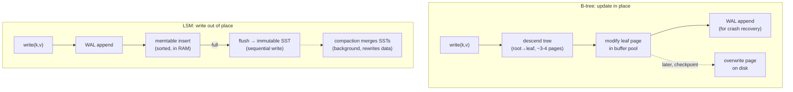

# Topic 1 — Storage Engine Landscape: B-Tree vs LSM

> The single most consequential design decision in a database. Every later topic —
> WAL, buffer pool, MVCC, compaction, columnar layout — is a refinement of the choice
> made here: **update in place, or write out of place?**

## Outcomes

By the end you can:
1. Draw the write path and read path of both engine families from memory.
2. Predict which family wins a given workload (write-heavy / point-read / scan /
   space-constrained) *before* benchmarking, then verify.
3. Explain any measured difference in terms of read/write/space amplification.
4. Recite the RUM conjecture and give one real engine as an example of each corner.

---

## 1. The two families

Everything on disk descends from two ideas:

- **Page-oriented, in-place (B-tree):** the database is a tree of fixed-size pages
  (4–16KB). Updates find the page and overwrite it. Reads are 1 tree descent.
  SQLite, Postgres, LMDB, InnoDB, redb.
- **Log-structured, out-of-place (LSM):** the database is a log. Updates append to a
  memtable + WAL; background jobs sort and merge immutable runs (SSTs). Reads must
  check *every* place a key could hide. RocksDB, LevelDB, Cassandra, fjall, Pebble.



The read paths mirror the write paths, inverted:

```
B-tree point read:                     LSM point read:
  root ──► inner ──► leaf                memtable?          ── miss ─┐
  (3-4 page reads, cached               sealed memtables?   ── miss ─┤
   upper levels ⇒ often 1 IO)           L0 SSTs (each one!) ── miss ─┤  bloom filters
                                        L1 SST              ── miss ─┤  exist to skip
                                        L2 SST              ── hit! ─┘  most of these
```

## 2. Amplification — the vocabulary of the whole field

For a logical write of `B` bytes / logical read of one key:

- **Write amplification (WA):** physical bytes written ÷ logical bytes. B-tree: whole
  page per dirty record (4KB page / 100B row ⇒ up to 40x, amortized by the buffer
  pool). LSM: each byte rewritten once *per level* by compaction (leveled ⇒ ~10x per
  level fanout... typical WA 10–30x). On SSDs, WA burns endurance and steals bandwidth.
- **Read amplification (RA):** physical reads ÷ logical reads. B-tree: tree height
  (~O(log_fanout n), mostly cached). LSM: number of sorted runs to check — memtable +
  L0 files + one per level; bloom filters cut the misses, not the final hit.
- **Space amplification (SA):** physical size ÷ logical size. B-tree: fragmentation +
  ~30% average page slack. LSM: obsolete versions awaiting compaction (tiered can sit
  at 2x+; leveled ~1.1x).

## 3. The RUM conjecture

> For Read, Update, and Memory (space) overhead: optimizing any two makes the third
> worse. You can pick where to sit, not escape the triangle.

```
                    Read-optimal
                        ▲
                       ╱ ╲
                      ╱   ╲          B-tree      → good R, ok U, poor M (slack)
                     ╱  ○  ╲         LSM leveled → good M, ok U, poor R
                    ╱ B-tree╲        LSM tiered  → good U, poor R, poor M
                   ╱         ╲       hash index  → best point-R, no scans
                  ╱ LSM-l     ╲      bitmap/bloom→ M-optimal, approximate R
                 ╱        LSM-t╲
                ▼───────────────▼
        Update-optimal      Memory-optimal
```

The conjecture's sharpest claim: engines are not "good" or "bad", they are *positions*.
Tuning knobs (compaction style, page fill factor, bloom bits/key) move you along the
edges continuously. Monkey (topic 4) is literally a Lagrange-multiplier walk on this
triangle.

## 4. Where each family wins

| Workload | Winner | Why (amplification argument) |
|----------|--------|------------------------------|
| Write-heavy, random keys | LSM | sequential IO only; B-tree dirties a random page per write |
| Point reads, hot working set | B-tree | 1 descent, upper levels cached; LSM pays run-check tax |
| Range scans | B-tree (usually) | leaves are one contiguous logical order; LSM merges k runs per scan |
| Space-constrained | LSM leveled | ~1.1x SA vs page slack + fragmentation |
| Cold-cache point reads | LSM + blooms | one bloom-guarded IO vs full-height descent |
| Mixed read/write at scale | it depends | this is why both families still exist — measure |

Hybrid reality check: Postgres (B-tree) has a WAL — a log. RocksDB (LSM) has block
indexes inside SSTs — little B-trees. The families differ in *what is authoritative*:
the pages, or the log.

## 5. Code reading (4–6 h)

Read the two Rust engines as protagonists, skim the other two for contrast:

- **fjall** (~/repos/fjall) — small, clean Rust LSM. Trace insert → journal → memtable
  → flush, and get → memtable → SSTs.
  → guided walkthrough: [`reading-fjall.md`](reading-fjall.md)
- **turso** (~/repos/turso) `core/storage/` — SQLite's B-tree re-implemented in Rust:
  slotted pages, cursor descent, balance, pager + WAL.
  → guided walkthrough: [`reading-turso-btree.md`](reading-turso-btree.md)
- **tidesdb** (~/repos/tidesdb) — LSM in plain C; nothing hidden behind abstractions.
  Skim to see memory ordering and disk layout made explicit.
  → guided walkthrough: [`reading-tidesdb.md`](reading-tidesdb.md)
- **RocksDB** (~/repos/rocksdb) — don't read it yet; *orient* in it. Directory map for
  topic 4 and beyond.
  → orientation: [`reading-rocksdb-layout.md`](reading-rocksdb-layout.md)

## 6. Papers (4–5 h)

- O'Neil et al., "The Log-Structured Merge-Tree" (1996) — the origin; read for the
  cost model, skim the component algebra.
  → reading guide: [`reading-lsm-paper.md`](reading-lsm-paper.md)
- Comer, "The Ubiquitous B-Tree" (1979) — still the cleanest B-tree intro ever written.
  → reading guide: [`reading-comer-btree.md`](reading-comer-btree.md)
- Athanassoulis et al., "Designing Access Methods: The RUM Conjecture" (EDBT 2016) —
  short, foundational framing paper.
  → reading guide: [`reading-rum-conjecture.md`](reading-rum-conjecture.md)
- Hellerstein, Stonebraker, Hamilton — "Architecture of a Database System" (2007) —
  read §1–2 + §6 now for the systems map; the rest is reference material for later topics.
  → reading guide: [`reading-architecture-of-a-dbms.md`](reading-architecture-of-a-dbms.md)

## 7. Experiment (in `experiments/`)

**`engine_shootout`** — fjall (LSM) vs redb (B-tree) on the same box, same data,
db_bench workload vocabulary (topic 0):

1. `fillrandom` — N random-key inserts, measure sustained insert throughput.
2. `fillseq` — same N, sequential keys (B-tree best case: no random page dirtying).
3. `readrandom` — Zipfian point reads (s=0.99, the M0 generator's skew) on the loaded DB.
4. `scan` — full-range iteration throughput.
5. Measure **on-disk size** after each fill (space amplification, directly).

Rules from topic 0: criterion for the timed loops, report medians, fsync settings
*identical* across engines (fair benchmarking §3.2 — durability parity), record
engine versions + config in notes.

Predict the winner of each workload *in writing* (notes.md) before running. Explaining
a wrong prediction is the whole point of the topic.

## 8. Capstone milestone M1 (in `../../capstone/`)

Define the **storage-backend abstraction** for falkordb-scratch:

- [ ] Design the trait *first*, no peeking at the reference: what operations does a
      graph engine need from storage? (point get/put, prefix/range scan, atomic batch,
      snapshot?) Write it down with rationale in `capstone/notes/m1-backend-design.md`.
- [ ] `storage` crate: trait + in-memory backend (`BTreeMap`-based is fine — it's the
      semantics contract, not the fast path).
- [ ] Wire the M0 workload generator through the trait; criterion smoke bench.
- [ ] *Then* read the reference `graph/src/storage/backend.rs` and write a comparison:
      what did they need that you didn't predict, and why?

## Done when

- Both experiments' results are in `notes.md` with amplification-based explanations,
  wrong predictions called out explicitly, M1 checklist complete, and you can sketch
  §1's two diagrams from memory.
