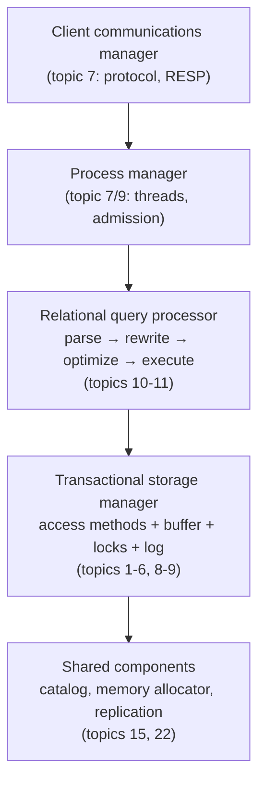

# Architecture of a DBMS: the five-box org chart

A database is five cooperating managers, and a storage engine is just one of
them. This chapter maps Hellerstein, Stonebraker & Hamilton's survey — the
curriculum's *atlas* — onto the topics ahead: read the map chapters this week,
then return per-topic as each box gets built. You are NOT reading all ~120
pages now; budget 2 h.

## Read NOW (topic 1)

- **§1 (main components)** — the five-box diagram of a DBMS. Memorize it; it's the
  table of contents for topics 3–16:

- **§2 (process models)** — process-per-worker vs thread-per-worker vs event/async;
  where admission control lives. Directly informs the capstone server (M7/M9).
- **§6 (storage management)** — spatial control (why DBs fight the filesystem),
  buffer pools vs OS page cache, the double-buffering problem. This is the section
  that justifies this topic's existence.

## Skim NOW, return LATER

| Section | Return at |
|---------|-----------|
| §3 parser/rewriter | topic 10 |
| §4 query processor internals | topics 10–11 |
| §5 transactions, ACID, locking | topics 8–9 |
| §7 shared components (catalog, replication) | topics 15–16 |

## Questions to answer in notes.md

1. §6 argues the DBMS should bypass OS caching (O_DIRECT). What are the *two*
   distinct problems with letting the OS cache pages? (Double buffering; the OS
   evicts/flushes with zero knowledge of WAL ordering.)
2. Which of the five §1 boxes does fjall implement? redb? (Neither has a query
   processor or client manager — "storage engine" ≠ "database". The capstone builds
   the other boxes on top, milestone by milestone.)
3. 2007 blind spots: name three things the paper couldn't see coming. (Candidates:
   NVMe erasing the seek-time mental model, cloud disaggregation — topic 28, columnar
   dominance for analytics — topic 12, LSM taking over write paths.)

## The one-line takeaway

A database is five cooperating managers, and a storage engine is just one of them —
this paper is the org chart for everything the capstone will build.

## References

**Papers**
- Hellerstein, Stonebraker, Hamilton — "Architecture of a Database
  System" (Foundations and Trends in Databases, 2007) —
  [PDF](https://dsf.berkeley.edu/papers/fntdb07-architecture.pdf) — read
  §1–2 + §6 now (2 h); §3–§5 and §7 are reference material to return to
  per the table above
