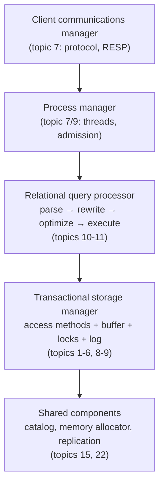

# Architecture of a DBMS: the five-box org chart

A database is five cooperating managers, and a storage engine is just one of
them. This chapter maps Hellerstein, Stonebraker & Hamilton's survey — the
curriculum's *atlas* — onto the topics ahead. Before you open the paper, it
builds the five boxes one at a time by following a single query on its way
through the system: what each box is in plain terms, what it does to your
query, and what breaks without it. Then it routes you through the paper:
read the map chapters this week, return per-topic as each box gets built.
You are NOT reading all ~120 pages now; budget 2 h.

## The problem in one sentence

PostgreSQL is ~1.5 million lines of C, and a single `SELECT name FROM users
WHERE id = 42` passes through five major subsystems on its way to one row —
without a map of those subsystems, every later topic in this curriculum is
a tree with no forest.

## The concepts, step by step

Follow the query. It arrives as bytes on a TCP socket and leaves as a row;
each step is the next box it passes through.

### Step 1 — the client communications manager: bytes in, rows out

The client communications manager is the code that speaks the **wire
protocol** — the byte format client and server agree on for shipping queries
in and results out. It accepts connections, authenticates them, frames the
incoming byte stream into discrete query messages, and streams result rows
back:

```
 client                          server
   │ ──  b"SELECT ... \0"  ────►  │   frame bytes into a query message
   │ ◄──  row │ row │ ... │ done  │   stream rows back — never buffer 10M
```

Concretely: PostgreSQL has its own binary protocol; Redis uses RESP (a
text-framed protocol the capstone adopts in topic 7 because it's ~1 page of
spec). The non-obvious job is **result streaming**: a 10-million-row result
must flow out incrementally, and a slow client must back-pressure the
executor instead of forcing the server to buffer everything.

Without this box there is no way in — and a naive version that buffers whole
results turns one big query into an out-of-memory crash.

### Step 2 — the process manager: who actually runs the query

The process manager decides which OS process or thread executes your query —
it is the mapping between N client connections and M workers. The paper's
taxonomy, still exhaustive today:

- **process-per-worker** — fork one OS process per connection (classic
  PostgreSQL): crash-isolated, but heavy.
- **thread-per-worker** — one thread per connection (MySQL): lighter, shares
  one address space.
- **event/async** — a small pool of threads multiplexes thousands of
  connections (Redis, most Rust servers): cheapest per connection, hardest
  to program.

The numbers that decide it: 10,000 connections × ~10 MB of per-process
overhead ≈ 100 GB just to hold idle sessions, versus an async pool of 8
threads. This box also owns **admission control** — deciding that a query
must *wait in a queue* rather than start, so an overloaded server degrades
into higher latency instead of thrashing (all queries slow, none finishing).

Without this box, the server accepts every request at once and collapses
under its own concurrency. The choice here directly shapes the capstone
server (M7/M9).

### Step 3 — the relational query processor: the database's compiler

The relational query processor turns declarative SQL — you say *what* rows
you want, never *how* to fetch them — into an executable plan. It is a
four-stage compiler pipeline:

1. **parser** — query text → syntax tree;
2. **rewriter** — expand views, fold constants, simplify;
3. **optimizer** — choose which indexes to use and what order to join
   tables in, using statistics about the data;
4. **executor** — run the chosen plan, typically as a tree of iterators
   each pulling rows from its children.

The stakes are not cosmetic: for `WHERE id = 42`, scanning a 1M-row table
reads ~everything, while descending an index touches 3–4 pages — the
optimizer's choice is routinely a **1000× latency difference** on identical
data.

Without this box you'd hand-write the access path for every query — which is
exactly what programming directly against a raw storage engine API is. This
is topics 10–11.

### Step 4 — the transactional storage manager: the box that owns the bytes

The transactional storage manager stores the data on disk, caches it in
memory, and guarantees that neither concurrent transactions nor a crash can
corrupt it. It is itself four cooperating sub-managers:

- **access methods** — the on-disk data structures (B-trees, heaps) that
  actually locate rows;
- **buffer pool** — the database's own cache of fixed-size disk pages in
  RAM, with its own eviction policy (topic 6);
- **lock manager** — coordinates concurrent transactions (topics 8–9);
- **log manager** — the write-ahead log that makes committed changes
  survive a crash (topic 5).

This one box is the subject of topics 1–6 and 8–9 — and it is *all* that
fjall and redb are. "Storage engine" names this box, not the database.

The paper's §6 adds the fight with the operating system: if the OS also
caches file pages, every hot page sits in RAM **twice** (buffer pool + OS
page cache — "double buffering", half your memory wasted), and the OS may
flush pages to disk in an order that violates the log manager's
write-ahead rule. Hence `O_DIRECT` and databases doing their own IO.

### Step 5 — shared components: the utilities everyone calls

The shared components are the services every other box depends on: the
**catalog** (the database's metadata — tables, columns, indexes, and
statistics, itself stored as ordinary tables), the memory allocator,
replication (topic 22), and admin/monitoring tools.

The catalog is the load-bearing one: Step 3's 1000× optimizer win is only
possible because the catalog stores row counts and value histograms for the
optimizer to cost plans with. Without it, nothing in the system even knows
what columns a table has.

### Step 6 — the assembled map

Put the five boxes together and you get the org chart the rest of the
curriculum fills in, box by box — the paper's §1 figure, annotated with
where each box gets built:



Memorize this diagram; it is the table of contents for topics 3–16. The
punchline for this topic: everything the engine-shootout benchmarks measure
lives inside one box (Step 4) — the capstone builds the other four around
it, milestone by milestone.

## How to read the paper (with the concepts in hand)

Read NOW (topic 1):

- **§1 (main components)** — the five-box diagram, i.e. Steps 1–6 in the
  authors' own words. Skim fast; you already have the picture — your job is
  to attach their vocabulary to it.
- **§2 (process models)** — Step 2 in depth: process- vs thread- vs
  event-per-worker, and where admission control lives. Directly informs the
  capstone server (M7/M9).
- **§6 (storage management)** — Step 4's fight with the OS: spatial control
  (why DBs fight the filesystem), buffer pools vs the OS page cache, the
  double-buffering problem. This is the section that justifies this topic's
  existence.

Skim NOW, return LATER:

| Section | Concept | Return at |
|---------|---------|-----------|
| §3 parser/rewriter | Step 3, stages 1–2 | topic 10 |
| §4 query processor internals | Step 3, stages 3–4 | topics 10–11 |
| §5 transactions, ACID, locking | Step 4's lock + log managers | topics 8–9 |
| §7 shared components (catalog, replication) | Step 5 | topics 15–16 |

## Questions to answer in notes.md

1. §6 argues the DBMS should bypass OS caching (O_DIRECT). What are the *two*
   distinct problems with letting the OS cache pages? (Double buffering; the OS
   evicts/flushes with zero knowledge of WAL ordering.)
2. Which of the five §1 boxes does fjall implement? redb? (Neither has a query
   processor or client manager — "storage engine" ≠ "database". The capstone builds
   the other boxes on top, milestone by milestone.)
3. 2007 blind spots: name three things the paper couldn't see coming. (Candidates:
   NVMe erasing the seek-time mental model, cloud disaggregation — topic 28, columnar
   dominance for analytics — topic 12, LSM taking over write paths.)

## The one-line takeaway

A database is five cooperating managers, and a storage engine is just one of them —
this paper is the org chart for everything the capstone will build.

## References

**Papers**
- Hellerstein, Stonebraker, Hamilton — "Architecture of a Database
  System" (Foundations and Trends in Databases, 2007) —
  [PDF](https://dsf.berkeley.edu/papers/fntdb07-architecture.pdf) — read
  §1–2 + §6 now (2 h); §3–§5 and §7 are reference material to return to
  per the table above
