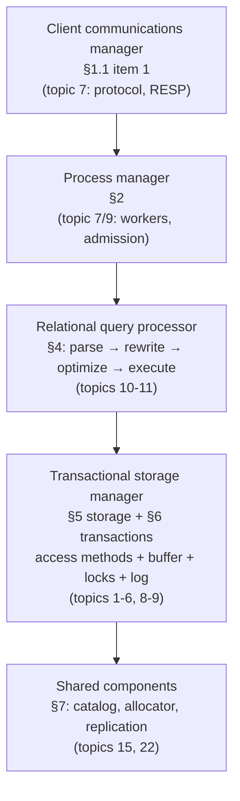

# Architecture of a DBMS: the five-box org chart

A database is five cooperating managers, and a storage engine is just one of
them. This chapter maps Hellerstein, Stonebraker & Hamilton's survey — the
curriculum's *atlas* — onto the topics ahead. Before you open the paper, it
builds the five boxes one at a time by following a single query on its way
through the system: what each box is in plain terms, what it does to your
query, and what breaks without it. Then it routes you through the paper:
read the map chapters this week, return per-topic as each box gets built.
You are NOT reading all ~120 pages now; budget 2 h.

Every section number below was checked against the PDF of *Foundations and
Trends® in Databases* Vol. 1, No. 2 (2007), pp. 141–259 — the version linked in
the References. **The previous version of this chapter had the section map
wrong**: storage management is §5, not §6, and §6 is transactions. The
corrected routing table is in "How to read the paper" below, and it matters,
because §6 is the section you would land in if you followed the old table
looking for the buffer pool.

## The problem in one sentence

The paper's own description of the systems it is surveying is "multi-million
line code bases, most of which are well over a decade old" (§1) — and a single
`SELECT name FROM users WHERE id = 42` passes through five major subsystems of
one of them on its way to one row, so without a map of those subsystems every
later topic in this curriculum is a tree with no forest.

## The concepts, step by step

Follow the query. It arrives as bytes on a TCP socket and leaves as a row;
each step is the next box it passes through. The paper follows the same query
in §1.1, using a gate agent at an airport clicking a form to request the
passenger list for a flight — one button click, one single-query transaction,
five boxes.

Two words the paper defines before it uses them, and so does this chapter. A
**DBMS client** is the library implementing the API an application calls
(JDBC, ODBC, or a driver speaking a proprietary protocol); a **DBMS worker**
is "the thread of execution in the DBMS that does work on behalf of a DBMS
Client" (§2, definitions), and the paper insists on a 1:1 mapping between the
two — one worker handles all SQL requests from one client. Everything in
Step 2 is about what a "worker" is made of.

### Step 1 — the client communications manager: bytes in, rows out

> **In:** nothing yet — an incoming TCP connection carrying an undelimited
> byte stream.
> **Out:** connection state (credentials, current SQL command) plus one framed
> query message, forwarded "deeper into the DBMS" (§1.1, item 1) to Step 2.

The client communications manager is the code that speaks the **wire
protocol** — the byte format client and server agree on for shipping queries
in and results out. The paper's statement of its job is deliberately narrow
(§1.1, item 1): "to establish and remember the connection state for the caller
(be it a client or a middleware server), to respond to SQL commands from the
caller, and to return both data and control messages (result codes, errors,
etc.) as appropriate."

**Framing** is the part that word "establish" hides: TCP delivers a stream with
no message boundaries, so the manager must decide where one query ends and the
next begins.

```
 client                          server
   │ ──  b"SELECT ... \0"  ────►  │   frame bytes into a query message
   │ ◄──  row │ row │ ... │ done  │   stream rows back — never buffer 10M
```

Concretely: PostgreSQL has its own binary protocol; Redis uses RESP (a
text-framed protocol the capstone adopts in topic 7 because it's ~1 page of
spec). The paper adds a tier count you will recognize: client→DBMS directly is
"two-tier", a web server or TP monitor in between makes it "three-tier", and an
application server between those makes four (§1.1, item 1) — which is why "a
typical DBMS needs to be compatible with many different connectivity
protocols".

The non-obvious job is **result streaming**: a large result must flow out
incrementally rather than being materialized in server memory. §1.1, item 5
states the mechanism — "for large result sets, the client typically will make
additional calls to fetch more data incrementally from the query, resulting in
multiple iterations through the communications manager, query executor, and
storage manager." §2.1.4 names the shape of that loop: "SQL is typically used
in a 'pull' model: clients consume result tuples from a query cursor by
repeatedly issuing the SQL FETCH request", and most systems work *ahead* of
that stream, using the client communications socket itself as the queue.

That last detail is where **back-pressure** — a slow consumer forcing the
producer to slow down instead of buffering without bound — comes from for free:
if the enqueue target is the socket, a client that stops reading eventually
fills the socket buffer and stalls the worker. A naive implementation that
buffers the whole result in the server's heap instead turns one big query into
an out-of-memory crash.

Without this box there is no way in.

### Step 2 — the process manager: who actually runs the query

> **In:** the framed SQL command and connection state from Step 1.
> **Out:** a DBMS worker — an OS process, an OS thread, or a slot in a pool —
> bound to that connection and *admitted* to run, which is the execution
> context Step 3's plan runs inside.

The process manager decides which unit of OS execution runs your query. The
paper's §1.1 item 2 puts the decision first: "the DBMS must assign a 'thread of
computation' to the command", and "the most important decision that the DBMS
needs to make at this stage in the query regards admission control".

Three definitions, all §2's, because the taxonomy is meaningless without them.
An **OS process** has a private address space and its own OS resource handles
and security context. An **OS thread** ("k-thread") has neither: it shares the
address space of every other thread in its process, and is scheduled by the
kernel. A **lightweight thread** is scheduled in *user space* by the
application, so switching one costs no kernel mode switch — at the price that
"any blocking operation such as a synchronous I/O by any thread will block all
threads in the process", which is why LWT packages must issue only
asynchronous I/O. A DBMS that ships its own LWT package calls them **DBMS
threads** (§2.2).

§2.1's taxonomy has exactly three entries, "from the simplest to the most
complex":

- **process per DBMS worker** — one OS process per connection. Crash-isolated
  and debugger-friendly, but the shared structures (buffer pool, lock table)
  have to be moved into OS shared memory, "which reduces some of the advantages
  of address space separation" (§2.1.1). PostgreSQL "runs the process per DBMS
  worker model exclusively on all supported operating systems" (§2.3).
- **thread per DBMS worker** — one multi-threaded process hosts every worker; a
  dispatcher thread accepts connections and hands each one a thread (§2.1.2).
  MySQL uses this, and DB2 defaults to it where OS threads are good (§2.3).
- **process pool** — "a central process holds all DBMS client connections and,
  as each SQL request comes in from a client, the request is given to one of
  the processes in the process pool" (§2.1.3). Bounded, often fixed size; a
  request arriving when every process is busy waits.

The third entry is the one an earlier version of this chapter got wrong: it
listed "event/async" as the paper's third model. It is not. The paper's third
model is the **process pool**, and its modern descendant is named in §2.3 as
the pool's thread-based variant: "DBMS workers multiplexed over a thread
pool — Microsoft SQL Server defaults to this model and over 99% of the SQL
Server installations run this way." An event loop over a small thread pool
(Redis, most Rust servers) is that row of the paper's table, not a fourth
family. The paper's own list of exotica is instead about *where the scheduler
lives*: DBMS threads on OS processes (Sybase, Informix) or DBMS threads on OS
threads (SQL Server's "Fibers", §2.3).

Why does the pool exist at all? §2.1.3 says only that "the memory overhead of
each connection requiring a full process is a clear disadvantage" and §2.1.1
that "a process has more state than a thread and consequently consumes more
memory" — the paper prints no per-process figure, and neither will this
chapter. But the shape of the argument is arithmetic, so state an assumption
and run it. Assume a per-worker private footprint of 2 MB for a process and
64 KB for a pooled worker's stack, and take §2.3's "tens of thousands of
concurrently connected users" at its low end, 10,000:

```
process per worker:  10,000 × 2 MB    = 20,000 MB = 19.5 GiB of private state
thread/process pool:    200 × 2 MB    =    400 MB  (200 pooled workers)
                    + 10,000 × 64 KB  =    625 MB  (idle connection state)
                                        ───────────
                                        ~1,025 MB = 1.0 GiB
ratio                                   20,000 / 1,025 = 19.5×
```

The 2 MB is an assumption, not a measurement; the point that survives any
plausible substitution is that the pool decouples *connections* from
*workers*, so the memory bill grows with the smaller of the two.

This box also owns **admission control** — refusing to start new work "unless
sufficient DBMS resources are available" (§2.4). Without it a system
**thrashes**: past its peak, throughput "will begin to decrease radically",
usually because the buffer pool cannot hold the working set and the system
"spends all its time replacing pages", sometimes because transactions
"continually deadlock with each other and need to be rolled back and
restarted". With it, §2.4 promises graceful degradation: "transaction latencies
will increase proportionally to the arrival rate, but throughput will remain at
peak." Note the shape of that promise — latency degrades, throughput does not.
Topic 35 measures what happens when it is missing: at 280 QPS against a 300 QPS
capacity, goodput **never recovers** after a 10 s outage ([FINDINGS.md](../../FINDINGS.md)
row 35).

§2.4 also says admission control is two-tier: a connection-count check in the
dispatcher, and a second controller *inside the query processor* that runs
"after the query is parsed and optimized" and uses the optimizer's estimate of
the query's memory footprint. That second tier is a dependency from Step 2 back
onto Step 3, and it is the reason the boxes are a graph and not a pipeline.

The choice here directly shapes the capstone server (M7/M9).

### Step 3 — the relational query processor: the database's compiler

> **In:** the SQL text from Step 1, running inside the worker Step 2 admitted.
> **Out:** a query plan — a dataflow graph of operators — executed so that its
> *leaves* issue the record-fetch calls Step 4 answers.

The relational query processor turns declarative SQL — you say *what* rows you
want, never *how* to fetch them — into an executable plan. §4 splits it into
four stages, one per subsection, and this is the mapping the routing table at
the bottom uses:

1. **parser** (§4.1) — query text → internal format. Its four tasks, quoted:
   "(1) check that the query is correctly specified, (2) resolve names and
   references, (3) convert the query into the internal format used by the
   optimizer, and (4) verify that the user is authorized to execute the query."
   Name resolution means **canonicalization** — expanding `users` into the
   four-part name `server.database.schema.table`, which requires the catalog of
   Step 5.
2. **rewriter** (§4.2) — expand views, fold constants, simplify.
3. **optimizer** (§4.3) — choose which indexes to use and in what order to
   join tables, using statistics about the data.
4. **executor** (§4.4) — run the chosen plan. The paper is specific about how:
   "most modern query executors employ the **iterator model** that was used in
   the earliest relational systems", where every operator is a subclass of one
   four-method interface (§4.4, Fig. 4.2):

```
// ILLUSTRATION — this is the paper's own Fig. 4.2 pseudocode (§4.4, p. 189),
// not code from any engine. Real instances of this interface in this repo:
// topic 11's Volcano executor and turso's `BTreeCursor` (see
// reading-turso-btree.md, core/storage/btree.rs).
class iterator {
    iterator &inputs[];
    void init();
    tuple get_next();
    void close();
}
```

§4.4.1 draws the consequence the guide's later topics lean on: `get_next()` is
an ordinary procedure call, so "a tuple is returned to a parent in the graph
exactly when control is returned. This implies that only a single DBMS thread
is needed to execute an entire query graph, and queues or rate-matching between
iterators are not needed." Dataflow and control flow are the same edge. Topic 11
measures what that costs: Volcano tops out at **103 M rows/s** and gets *slower*
as selectivity rises ([FINDINGS.md](../../FINDINGS.md) row 11).

The stakes of stage 3 are not cosmetic, and the arithmetic is worth doing
rather than asserting. Assume a 1,000,000-row table, 100-byte rows, 8 KB pages,
and a B+-tree index on `id` — the same 100-byte record size this topic's own
bench lane uses:

```
rows per page          8192 B / 100 B          =    81 rows
pages in a full scan   1,000,000 / 81          = 12,346 pages read
index descent          height 3 + 1 leaf       =     4 pages read
ratio                  12,346 / 4              = 3,087× fewer pages
```

So "the optimizer's choice is worth about 3,000× on this table" — a figure that
falls out of page size, row size and tree height, not out of folklore. It grows
linearly with the table and only logarithmically with the descent, which is why
the gap widens as data grows. Topic 3 measures the caveat: pages touched is not
the same as time, because lookups climb **862 → 1101 ns** from 1e6 to 4e6 keys
while height stays at 3 ([FINDINGS.md](../../FINDINGS.md) row 3).

Without this box you would hand-write the access path for every query — which
is exactly what programming directly against a raw storage engine API is. This
is topics 10–11.

### Step 4 — the transactional storage manager: the box that owns the bytes

> **In:** the record-fetch and record-modify calls issued by the leaves of
> Step 3's plan.
> **Out:** tuples, read from pages under locks, with log records written for
> anything modified — returned up the iterator stack to Step 3 and out through
> Step 1.

The transactional storage manager stores the data, caches it in memory, and
guarantees that neither concurrent transactions nor a crash can corrupt it.
§1.1, item 4 lists its parts, and the paper splits them across two whole
sections — **§5 Storage Management** and **§6 Transactions**:

- **access methods** (§4.5) — the on-disk structures that actually locate
  rows: "basic structures like tables and indexes" (§1.1). B-trees are topics
  1 and 3.
- **buffer pool** (§5.3) — "a large shared buffer pool in its own memory
  space", "organized as an array of frames, where each frame is a region of
  memory the size of a database disk block". Two pieces of per-frame metadata
  are worth memorizing now because topic 6 implements both: a **dirty bit**,
  set when the page changed since it was read, and a **pin count**, non-zero
  meaning "not eligible for participation in the page-replacement algorithm".
- **lock manager** (§6.3) — coordinates concurrent transactions (topics 8–9).
- **log manager** (§6.4) — the write-ahead log. §2.1.4 names its in-memory
  half, the **log tail**: an in-memory queue of log entries "periodically
  flushed to the log disk(s) in FIFO order", where "a transaction cannot be
  reported as successfully committed until a commit log record is flushed to
  the log device", and where **group commit** batches several transactions'
  commit records into one I/O. Topic 5 measures the price of that flush:
  `write()` **857k/s**, `fsync` **44k/s**, `F_FULLFSYNC` **337/s**
  ([FINDINGS.md](../../FINDINGS.md) row 5).

This one box is the subject of topics 1–6 and 8–9 — and it is *all* that fjall
and redb are. "Storage engine" names this box, not the database. It is also
the only box this topic's bench lane measures: the same 108 MB of records
costs fjall **48 MB** on disk and redb **6.8 GB**, space amplification 0.45×
against 63.28× ([FINDINGS.md](../../FINDINGS.md) row 1). Nothing in Steps 1, 2,
3 or 5 moved; the 140× is entirely inside this box.

§5 is the section that justifies this topic's existence, and it opens with the
two dimensions of control a storage manager is fighting for:

- **Spatial control** (§5.1) — *where* on the disk a block goes. The reason it
  matters is one of the paper's few hard ratios: "sequential bandwidth to and
  from disk is between 10 and 100 times faster than random access, and this
  ratio is increasing", because density doubles every 18 months and bandwidth
  rises as its square root while "disk arm movement... [improves] at about
  7%/year". The maximal answer is **raw-mode access** — bypass the filesystem
  and address the block device directly — but §5.1 then measures the
  alternative honestly and finds it nearly free: comparing raw access with one
  very large file on a mid-sized system, "only a 6% degradation when running
  the TPC-C benchmark", and "DB2 reports file system overhead as low as 1% when
  using Direct I/O (DIO)". The paper's own conclusion is that vendors "typically
  no longer recommend raw storage".
- **Temporal control** (§5.2) — *when* a write actually reaches the disk.

§5.2 is the section to read twice, because it names **three** distinct problems
with letting the OS buffer your writes, not two:

1. **Correctness.** "The DBMS cannot guarantee atomic recovery after software
   or hardware failure without explicitly controlling the timing and ordering
   of disk writes" — the write-ahead logging protocol requires log writes to
   precede the corresponding data writes, and OS buffering "can confound the
   intention of the DBMS logic by silently postponing or reordering writes".
2. **The prefetch mismatch.** OS read-ahead "depends on the contiguity of
   physical byte offsets in files", while the DBMS knows the *logical* future:
   the paper's example is scanning B+-tree leaves that are not physically
   contiguous, which the query plan can predict and the filesystem cannot.
3. **Double buffering and copy cost.** **Double buffering** is the same page
   living in the OS page cache and the DBMS buffer pool at once. §5.2 charges
   it twice: "it wastes system memory by effectively reducing the memory
   available for doing useful work", and "it wastes time and processing
   resources, by causing an additional copying step: on reads, data is first
   copied from the disk to the OS buffer, and then copied again to the DBMS
   buffer pool. On writes, both of these copies are required in reverse."

The escape hatches §5.2 names are `mmap`/`msync` and the platform DIO/CIO
interfaces — which is what `O_DIRECT` is on Linux. Topic 6 measures why the
`mmap` half of that answer is a trap: mmap page reads are p50 **42 ns** and max
**182 µs**, a 4300× spread that is entirely minor page faults the database
cannot see or schedule ([FINDINGS.md](../../FINDINGS.md) row 6). §5.2's third
problem is solved; its first is not, because a page fault is still the OS
choosing when to do I/O.

### Step 5 — shared components: the utilities everyone calls

> **In:** metadata and memory requests arriving from Steps 1, 3 and 4 — the
> parser asking whether a table exists, the optimizer asking how many rows it
> has, every operator asking for scratch memory.
> **Out:** catalog rows, memory contexts, replicated log records and admin
> surfaces — the services with no place in the query's linear path, which is
> why they are drawn beside it rather than in it.

§7's shared components are the services every other box depends on. Three of
them matter now.

The **catalog** (§7.1) is the database's metadata — "the names of basic
entities in the system (users, schemas, tables, columns, indexes, etc.) and
their relationships" — and the load-bearing design decision is that it "is
itself stored as a set of tables in the database". The paper's argument for
that is code reuse: "users can employ the same language and tools to
investigate the metadata that they use for other data, and the internal system
code for managing the metadata is largely the same as the code for managing
other tables", and it adds a warning from experience — "this code and language
reuse is an important lesson that is often overlooked in early stage
implementations, typically to the significant regret of developers later on."

The catalog is not small. §7.1's example: "one major Enterprise Resource
Planning application... has over 60,000 tables, with between 4 and 8 columns
per table, and typically two or three indexes per table." Work that out at the
paper's midpoints — 6 columns and 2.5 indexes per table — and the catalog
alone is 60,000 table rows, 360,000 column rows and 150,000 index rows before
a single user row exists. Which is why §7.1 also says high-traffic parts are
"materialized in main memory... in data structures that 'denormalize' the flat
relational structure of the catalogs into a main-memory network of objects".

The **memory allocator** (§7.2) is the second, and the paper's point is that
the textbook focus on the buffer pool is misleading: "database systems allocate
significant amounts of memory for other tasks as well" — Selinger-style
optimization builds dynamic-programming state, hash joins and sorts allocate at
runtime. The idiom is a **memory context**: a named region list you allocate
from and free *all at once*, which turns "did every operator free its
temporaries?" into one call.

Third, **replication services** (§7.4) — topic 15, where follower fsync policy
alone spans **59×** ([FINDINGS.md](../../FINDINGS.md) row 15) — and
**administration, monitoring and utilities** (§7.5).

The catalog is the one that closes the loop with Step 3: the 3,087× optimizer
win computed above is only possible because something stored the row count and
the fact that an index on `id` exists. Without the catalog, nothing in the
system even knows what columns a table has.

### Step 6 — the assembled map

> **In:** all five boxes, from Steps 1–5.
> **Out:** one diagram, and a reading order for the next thirty topics.

Put the five boxes together and you get the org chart the rest of the
curriculum fills in, box by box — the paper's Figure 1.1, annotated with where
each box gets built:


```mermaid
flowchart TB
    CM["Client communications manager<br/>§1.1 item 1<br/>(topic 7: protocol, RESP)"] --> PC["Process manager<br/>§2<br/>(topic 7/9: workers, admission)"]
    PC --> RP["Relational query processor<br/>§4: parse → rewrite → optimize → execute<br/>(topics 10-11)"]
    RP --> TS["Transactional storage manager<br/>§5 storage + §6 transactions<br/>access methods + buffer + locks + log<br/>(topics 1-6, 8-9)"]
    TS --> SC["Shared components<br/>§7: catalog, allocator, replication<br/>(topics 15, 22)"]
```

Memorize this diagram; it is the table of contents for topics 3–16. The
punchline for this topic: everything the engine-shootout benchmark measures
lives inside one box (Step 4) — the 140× space-amplification spread of
[FINDINGS.md](../../FINDINGS.md) row 1 is a fact about access methods and
buffering alone, with no query processor, no optimizer and no client protocol
anywhere near it. The capstone builds the other four around it, milestone by
milestone.

## How to read the paper (with the concepts in hand)

**The section numbers below are the corrected ones.** §5 is Storage
Management; §6 is Transactions; §3 is Parallel Architecture, which the old
version of this table did not mention at all.

Read NOW (topic 1):

- **§1 (introduction, esp. §1.1 the life of a query)** — the five-box
  Figure 1.1, i.e. Steps 1–6 in the authors' own words, told through the gate
  agent's passenger-list query. Skim fast; you already have the picture — your
  job is to attach their vocabulary to it.
- **§2 (process models)** — Step 2 in depth: the definitions block first
  (process / OS thread / lightweight thread / DBMS thread / client / worker),
  then §2.1's three models, §2.3's who-does-what table, and §2.4 admission
  control.
- **§5 (storage management)** — Step 4's fight with the OS: §5.1 spatial
  control and the 10–100× sequential/random ratio, §5.2 temporal control and
  the three problems with OS buffering, §5.3 the buffer pool's frames, dirty
  bits and pin counts. This is the section that justifies this topic's
  existence, and it is **not** §6.

Skim NOW, return LATER:

| Section | Concept | Return at |
|---------|---------|-----------|
| §3 parallel architecture (shared-memory / shared-nothing / shared-disk / NUMA) | not on the single-node query path at all | topics 36–37 |
| §4.1–4.2 parser, authorization, rewrite | Step 3, stages 1–2 | topic 10 |
| §4.3–4.4 optimizer, executor and the iterator model | Step 3, stages 3–4 | topics 10–11 |
| §4.5 access methods | Step 4's B-trees, from the query processor's side | topics 3, 11 |
| §6 transactions: ACID, serializability, locking, the log manager | Step 4's lock + log managers | topics 5, 8–9 |
| §7 shared components (catalog, allocator, replication) | Step 5 | topics 15–16 |

## Questions to answer in notes.md

1. §5.2 argues the DBMS should bypass OS caching. It gives **three** distinct
   groups of reasons, not two — name all three, and say which one `O_DIRECT`
   fixes and which one `mmap` leaves in place. (Connect the second answer to
   topic 6's measured 42 ns / 182 µs mmap spread.)
2. Which of the five §1.1 boxes does fjall implement? redb? Which do they
   deliberately not implement, and what does the capstone have to add to turn
   one into a database?
3. §5.1 measures raw-device access against one large file at "only a 6%
   degradation" on TPC-C, and DB2's DIO overhead "as low as 1%". Given that,
   why does §5.1 still spend two pages on spatial control? (Hint: what is the
   6% a measurement *of*, and what does §5.1 say has changed about "raw"
   devices since?)
4. §2.4 promises that admission control makes latency degrade proportionally
   while *throughput stays at peak*. Topic 35's lane shows goodput at zero for
   121 s after a 10 s outage. Which half of §2.4's promise broke, and what
   would have to exist in the loop for it to hold?
5. 2007 blind spots: name three things the paper could not see coming, and for
   each say which section would have to be rewritten. (Candidates: NVMe
   erasing §5.1's seek-time mental model; cloud disaggregation — topic 28
   measures S3 p50 at 14.17 ms against local NVMe at 0.10 ms; columnar
   dominance for analytics — topic 12; LSM taking over write paths — the rest
   of this topic.)

## The one-line takeaway

A database is five cooperating managers, and a storage engine is just one of
them — this paper is the org chart for everything the capstone will build.

## Done when

Answer each before unfolding it.

- [ ] You can draw the five boxes from memory and say which one owns the bytes on disk.

  <details><summary>Answer</summary>

  Client communications manager, process manager, relational query processor,
  transactional storage manager, and the shared components drawn beside all
  four (§1.1, Figure 1.1). The transactional storage manager owns the bytes:
  §1.1 item 4 says it "manages all data access (read) and manipulation (create,
  update, delete) calls", and it is the box holding the access methods, the
  buffer pool, the lock manager and the log manager.

  The check that you have the boundary right: fjall and redb are *only* that
  box. This topic's bench lane changes nothing else in the diagram — same
  records, same durability, same client — and still gets 48 MB against 6.8 GB
  on disk, 0.45× against 63.28× space amplification
  ([FINDINGS.md](../../FINDINGS.md) row 1). A 140× spread with four of the five
  boxes absent is the sharpest possible demonstration of where the bytes live.

  </details>

- [ ] You can trace one query through all five, naming the four stages inside the query processor.

  <details><summary>Answer</summary>

  Bytes arrive on a socket; the communications manager frames them into a SQL
  command and remembers the connection state (§1.1 item 1). The process manager
  assigns a "thread of computation" and decides admission (§1.1 item 2, §2.4).
  The query processor runs four stages, one per §4 subsection: parse and
  authorize (§4.1), rewrite (§4.2), optimize (§4.3), execute (§4.4). The
  executor's leaf operators call into the transactional storage manager, which
  takes locks, reads pages through the buffer pool and writes log records (§1.1
  item 4). Then §1.1 item 5's "unwinding the stack": tuples flow back up the
  iterator graph into the client communications buffer and out.

  The catalog is touched at three of those stages without appearing in the
  path: §4.1 calls it to canonicalize `users` into `server.database.schema.table`
  and to type-check expressions, and §4.3 needs its statistics to cost a plan
  at all. That is why §7's components are drawn to the side — every box calls
  them, no box passes through them.

  </details>

- [ ] You can state all three arguments §5.2 gives against letting the OS buffer writes — and say which section number that discussion is actually in.

  <details><summary>Answer</summary>

  It is **§5.2, Temporal Control: Buffering** — not §6, which is transactions.
  Getting this wrong costs you an hour in the wrong chapter, which is why the
  routing table above was corrected.

  The three: (1) *correctness* — WAL requires log writes to precede data
  writes and commits to return only after the commit record is on the log
  device, and OS buffering "can confound the intention of the DBMS logic by
  silently postponing or reordering writes"; (2) *the prefetch mismatch* — OS
  read-ahead reasons about physical contiguity, while the query plan knows the
  logical future, the paper's example being a scan of non-contiguous B+-tree
  leaves; (3) *double buffering and copy cost* — the same page in the OS cache
  and the buffer pool wastes memory outright and adds a copy in each direction,
  and §5.2 insists copies matter because "throughput in a well-tuned
  transaction processing DBMS is typically not I/O-bound".

  `O_DIRECT`/DIO fixes (3) and most of (1). `mmap` fixes (3) only: topic 6
  measures mmap page reads at p50 **42 ns** and max **182 µs**
  ([FINDINGS.md](../../FINDINGS.md) row 6), and every microsecond of that tail
  is the kernel deciding when to do I/O — exactly the control §5.2's first
  argument says the DBMS must keep.

  </details>

- [ ] You can say which of the five boxes fjall and redb implement, and which they deliberately do not.

  <details><summary>Answer</summary>

  Both implement Step 4 and nothing else. fjall has access methods (memtable,
  SSTs), a buffer/cache layer and a journal — the log manager of §6.4 in the
  form of a WAL. redb has access methods (a copy-on-write B-tree), a page
  cache and its own durability mechanism. Neither has a client communications
  manager (you call them in-process, so there is no wire protocol and no
  framing), a process manager (your threads are the workers; there is no
  admission control, which is why an unbounded write loop can thrash them), a
  relational query processor (no SQL, no plan, no optimizer — you *are* the
  access path, which is Step 3's "without this box" clause made literal), and
  no catalog beyond a keyspace/table-name registry.

  That is the whole shape of the capstone: M1 defines the storage trait over
  this box, and the later milestones add the other four — M7 the protocol
  (Step 1), M7/M9 the worker model and admission (Step 2), M10–M11 planning
  and execution (Step 3).

  </details>

- [ ] You wrote answers to all five questions in notes.md.

  <details><summary>Answer</summary>

  Nothing to unfold — the questions are the exercise, and they go under
  `## Papers → Architecture of a DBMS (2007)` in this topic's `notes.md`.

  The bar for question 1: three groups, named in §5.2's own order, with the
  `O_DIRECT`-versus-`mmap` split stated as a claim about *which* problem each
  solves rather than a preference. The bar for question 5: a blind spot is only
  a blind spot if you can name the section it invalidates. "The paper predates
  NVMe" is not an answer; "§5.1's whole spatial-control argument rests on arm
  movement improving at 7%/year, and an SSD has no arm" is.

  </details>

## References

**Papers**
- Hellerstein, Stonebraker, Hamilton — "Architecture of a Database System"
  (*Foundations and Trends® in Databases*, Vol. 1, No. 2, 2007, pp. 141–259) —
  [PDF](https://dsf.berkeley.edu/papers/fntdb07-architecture.pdf) — read §1,
  §2 and §5 now (2 h); §3, §4, §6 and §7 are reference material to return to
  per the routing table above.

| Section | What this chapter took from it |
|---|---|
| §1 | "multi-million line code bases, most of which are well over a decade old" |
| §1.1 | Figure 1.1's five components, and the gate agent's query walked through all of them; the communications manager's three jobs; incremental fetch for large result sets |
| §2 (definitions) | OS process / OS thread / lightweight thread / DBMS thread / DBMS client / DBMS worker, and the 1:1 client-to-worker mapping |
| §2.1.1–2.1.3 | the three process models: process per worker, thread per worker, process pool |
| §2.1.4 | shared buffer pool and lock table across process boundaries; the log tail and group commit; SQL's pull model and the socket as result queue |
| §2.3 | PostgreSQL is process-per-worker exclusively; MySQL and DB2 thread-per-worker; SQL Server defaults to a thread pool, "over 99% of installations"; Sybase/Informix DBMS threads on processes; SQL Server Fibers |
| §2.4 | admission control, thrashing, two-tier structure, and the "latency degrades, throughput stays at peak" promise |
| §4.1–4.4 | the parser's four tasks and four-part name canonicalization; the optimizer; the iterator model and Fig. 4.2's four-method interface; §4.4.1 on dataflow coupled to control flow |
| §5.1 | sequential 10–100× random and why the ratio grows (density ×2/18 months, bandwidth ~√density, arm movement 7%/year); raw device vs one large file at 6% on TPC-C; DB2 DIO overhead as low as 1% |
| §5.2 | the three problems with OS buffering: WAL ordering, prefetch mismatch, double buffering plus copy cost; mmap/msync and DIO/CIO as the escape hatches |
| §5.3 | the buffer pool as an array of frames, with a dirty bit and a pin count per frame |
| §6.3–6.4 | lock manager and log manager, as the transactional half of Step 4 |
| §7.1 | the catalog stored as ordinary tables, and the 60,000-table ERP example |
| §7.2 | memory contexts, and why the buffer pool is not the whole memory story |

**This repo's measurements cited above**
- [FINDINGS.md](../../FINDINGS.md) row 1 (this topic's own 0.45× vs 63.28×
  space amplification), row 3 (B-tree height vs cache residency), row 5 (fsync
  ladder), row 6 (mmap tail), row 11 (Volcano throughput), row 15 (follower
  fsync policy), row 28 (S3 vs local NVMe), row 35 (goodput after an outage).
