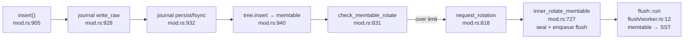

# fjall: the LSM lifecycle in clean Rust

The LSM protagonist of this topic — a codebase small enough that insert-to-SST
is traceable in an afternoon, and layered well enough to steal from. fjall is
the *keyspace/journal/scheduling* layer; the actual tree (memtable, SSTs,
blooms, block index) lives in the external `lsm-tree` crate (Cargo.toml:29).
Before touching the code, this chapter builds the LSM machine step by step —
why writes are buffered, what a memtable and journal are, what a flush
produces, how a read finds anything, and why compaction and tombstones exist.
Then it hands you the file and line anchors to watch each step happen.
Reading fjall shows you the LSM *lifecycle*; topic 4 descends into `lsm-tree`
itself.

## The problem in one sentence

Absorb hundreds of thousands of writes per second with *random* keys on a
device that is only fast for *sequential* IO — without losing an acknowledged
write on crash, and while still answering point reads in a handful of IOs.

## The concepts, step by step

### Step 1 — why buffer writes in memory: sequential beats random

Storage devices reward sequential access and punish random access. An NVMe
SSD streams sequential writes at ~2–5 GB/s, but random 4 KB writes top out
around 50–500K IOPS — and each small random write also forces the device to
rewrite a whole internal flash block (write amplification inside the drive).
An update-in-place engine (like the B-tree in the turso chapter) turns every
insert with a random key into a random page write. The LSM (log-structured
merge) idea inverts this: **never update in place**. Accumulate incoming
writes in RAM — where random access is free — until you have a few MB, then
write them to disk in one big sequential burst.

```
 update-in-place:   insert(k₉₃₁), insert(k₀₂), insert(k₅₅₀) ...
                    → 3 random 4 KB page writes, scattered across the file

 log-structured:    insert(k₉₃₁), insert(k₀₂), insert(k₅₅₀) ... × ~100K
                    → buffered in RAM, sorted, then ONE 8-64 MB sequential write
```

What it costs: the data on disk is now *many files written at different
times* instead of one tree — reads and space reclamation get harder. Steps
4–6 are the price being paid.

### Step 2 — the memtable and the journal: RAM for speed, a log for safety

The in-RAM buffer is the **memtable** — an in-memory *sorted* map (fjall's
`lsm-tree` uses a skip list) that absorbs every write and can be range-scanned
in key order. Sorted matters: when it's time to write to disk, the data must
come out in key order (Step 3), and reads must be able to search it.

RAM alone is a durability hole: crash before the buffer hits disk and the
writes are gone. The fix is the **journal** (also called a WAL, write-ahead
log): an append-only file on disk. The rule that gives it its name — every
write is appended to the journal *before* it enters the memtable. Appending
is sequential (the fast case from Step 1), so durability costs one sequential
append, not a random write. After a crash, replaying the journal rebuilds
the memtable.

fjall's `Keyspace::insert()` — `src/keyspace/mod.rs:905` — *is* this step,
de-sugared to ten lines:

```rust
fn insert(&self, key: &[u8], value: &[u8]) -> Result<()> {
    let journal = self.journal.lock();          // journal lock BEFORE memtable —
    journal.write_raw(key, value)?;             //   replay order must equal apply order
    journal.persist(self.durability)?;          // fsync per policy, not per write
    let bytes = self.tree.insert(key, value);   // memtable: sorted, in RAM
    self.write_buffer.fetch_add(bytes);         // atomic accounting → backpressure
    if self.memtable_over_size_limit() {
        self.rotate_memtable();                 // seal it + enqueue flush task —
    }                                           //   event-driven, no polling
    Ok(())
}
```

Two costs to notice: every write is written *twice* (journal + eventually an
SST — the first factor of **write amplification**, the ratio of bytes written
to disk per byte of user data), and the fsync policy on line 3 decides
whether durability is per-write or batched — the single biggest write-latency
knob in any LSM.

### Step 3 — flush: the memtable becomes an immutable sorted file

When the memtable reaches its size limit (typically 8–64 MB), it is
**rotated**: marked immutable ("sealed"), swapped for a fresh empty memtable,
and handed to a background thread that writes it out as an **SSTable**
(sorted string table; fjall calls them **segments**) — an *immutable* file of
key-value pairs in sorted order, plus two small helpers:

```
 one segment (SSTable) on disk:
 ┌───────────────────────────────┬──────────────┬──────────────┐
 │ data blocks (~4 KB each,      │ block index  │ bloom filter │
 │ sorted key-value pairs)       │ first key →  │ ~10 bits/key │
 │ [a..f][g..m][n..s][t..z] ...  │ block offset │ ≈1% false pos│
 └───────────────────────────────┴──────────────┴──────────────┘
   64 MB data                      ~tens of KB    ~80 KB per 64K keys
```

- The **block index** maps "first key of each ~4 KB block → file offset", so
  finding a key inside a segment costs one binary search in RAM plus **one**
  disk read.
- The **bloom filter** is a probabilistic set-membership structure (a bit
  array written to by k hash functions): "definitely not here" or "maybe
  here". At ~10 bits per key it answers "is key X in this file?" with ~1%
  false positives — for the cost of a few hashes, no IO.

Because the segment is immutable, it never needs locking and can be written
as one sequential stream. The journal entries covering the flushed memtable
can now be dropped. Cost: the same key may now exist in several segments
(old versions in older files) — nothing has been overwritten, only shadowed.

### Step 4 — the read path: newest wins, blooms skip the rest

A key can live in the active memtable, a sealed-but-not-yet-flushed memtable,
or any segment. Since newer always shadows older, a read checks locations
**newest-first** and returns the first hit:

```
 get(k):  active memtable → sealed memtables (newest first)
          → segments, newest first:
              bloom says "no"?  → skip, zero IO   (the common case)
              bloom says "maybe" → block index → read ONE block → found/miss
```

The number of places a single read might have to check is **read
amplification**. Bloom filters are what keep it tolerable: with 20 segments
and 1% false positives, a lookup for an absent key does ~0.2 disk reads
instead of 20. In fjall, `Keyspace::get()` — `src/keyspace/mod.rs:623` — is
two lines delegating to `tree.get(key, SeqNo::MAX)`; the whole
newest-first/bloom dance lives inside `lsm-tree`. But the bloom *policy* is
configured in fjall: `src/keyspace/config/filter.rs:8–43` (`BitsPerKey` vs
`FalsePositiveRate`, per-level policies — Monkey's idea productized; topic 4).

### Step 5 — compaction: merging files to bound read cost

Left alone, flushes pile up segments forever: read amplification grows
without bound and shadowed old versions waste disk (**space
amplification** — disk bytes used vs live data bytes). **Compaction** is the
background fix: pick several segments, merge-sort them (they're each sorted,
so this is a streaming k-way merge), keep only the newest version of each
key, and write one new segment; delete the inputs.

fjall's default policy is **leveled**: segments are organized into levels
L0, L1, L2… where each level is ~10x bigger than the previous and, below L0,
levels contain non-overlapping key ranges — so a read checks at most one
segment *per level*. A 100 GB dataset fits in ~4 levels: read amplification
is bounded at ~4 segment probes, most eliminated by blooms.

The cost is the LSM's defining trade: every key is rewritten once per level
it descends through — leveled compaction commonly costs **10–30x write
amplification**. LSMs buy cheap ingest and bounded reads by re-paying write
bandwidth in the background. Topic 4 is entirely about tuning this trade.

### Step 6 — tombstones: a delete is just another write

Immutable files mean you cannot erase a key in place — an older segment may
still hold it. So `delete(k)` *writes* a **tombstone** (a marker record
meaning "k is deleted"), which travels the same path as any write: journal →
memtable → flush → segment. Reads treat a tombstone as "found: not present"
and stop — newest-first ordering makes it shadow every older version.

The actual bytes are reclaimed only when compaction merges the tombstone
past every older version of the key; only at the bottom level can the
tombstone itself be dropped. Costs: deleted data occupies disk until
compaction catches up, and a range full of tombstones makes scans *slower*
(they must be read and skipped) — the classic "deleting data made my
database slower" LSM surprise.

## Where each step lives in the code

```
src/
 ├─ lib.rs               module map — start here
 ├─ keyspace/mod.rs      insert/get/memtable rotation — the heart (steps 2-4)
 ├─ journal/writer.rs    WAL writes (step 2)
 ├─ flush/worker.rs      sealed memtable → SST (step 3)
 ├─ compaction/worker.rs compaction runs (step 5)
 ├─ supervisor.rs        background orchestration
 ├─ worker_pool.rs       flume-channel thread pool
 └─ poison_dart.rs       panic guard
```

**Steps 2–3 — the write path.** Start at `Keyspace::insert()` —
`src/keyspace/mod.rs:905`. Read the whole function; it *is* the LSM
write-path diagram from the README:



**Step 4 — the read path.** `Keyspace::get()` — `src/keyspace/mod.rs:623`
(two-line delegation to `lsm-tree`); bloom configuration at
`src/keyspace/config/filter.rs:8–43`.

**Step 5 — compaction scheduling.**

- Strategies re-exported at `src/compaction/mod.rs:7`: `Leveled`, `Fifo`.
- Worker: `compaction/worker.rs:10` — thin: `tree.compact(strategy, gc_watermark)`.
- Trigger plumbing: `worker_pool.rs:141–145` sends `WorkerMessage::Compact`.

The interesting part is what fjall *doesn't* do: no compaction geometry here — it
delegates policy to `lsm-tree`, keeping fjall pure lifecycle/scheduling. Good
layering to steal for the capstone's storage crate.

**Aha spots** (worth a detour each):

1. **`poison_dart.rs:27–33`** — a `Drop` guard that poisons the whole keyspace if a
   background worker panics. Crash-*visibly* instead of serving from corrupt state.
2. **`ingestion.rs:37–51`** — comment explains holding the journal lock across
   `finish()` to prevent seqno inversion between writes and bulk ingest. Sequence
   numbers are the spine of LSM correctness (MVCC preview, topic 8).
3. **`snapshot_tracker.rs`** — open-snapshot seqno watermark gates GC: compaction
   can't drop a version some reader might still see. This exact problem returns in
   MVCC vacuuming (topic 8).
4. **`keyspace/mod.rs:746–750`** — rotation immediately enqueues the flush task; no
   polling anywhere. Event-driven background work via channels.

## Questions to answer while reading

- The journal lock is taken *before* the memtable insert. What ordering bug would
  reordering them create? (Hint: replay after crash — Step 2's "replay order must
  equal apply order".)
- `mod.rs:946` — write buffer accounting is an atomic counter. Where does backpressure
  actually happen when writers outrun flushing?
- What durability do you get *per insert* by default — fsync every write, or batched?
  Compare with what you'll set in the experiment (durability parity!).

## Done when

You can narrate insert-to-SST without looking, and you know which decisions live in
fjall vs `lsm-tree`.

## References

**Code**
- [fjall](https://github.com/fjall-rs/fjall) — `src/keyspace/mod.rs`
  (write/read paths), `src/journal/writer.rs`, `src/flush/worker.rs`,
  `src/compaction/worker.rs` (shallow clone at `~/repos/fjall`; line
  numbers from the clone — expect drift)
- the external [`lsm-tree`](https://github.com/fjall-rs/lsm-tree) crate
  holds the actual tree (memtable, SSTs, blooms, block index) — topic 4's
  territory
