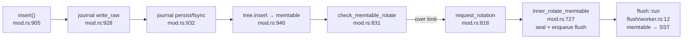

# Reading fjall — a clean Rust LSM

Repo: `~/repos/fjall` (shallow clone). Line numbers from the clone; expect drift.

fjall is the *keyspace/journal/scheduling* layer; the actual tree (memtable, SSTs,
blooms, block index) lives in the external `lsm-tree` crate (Cargo.toml:29). Reading
fjall shows you the LSM *lifecycle*; topic 4 descends into `lsm-tree` itself.

## Layout

```
src/
 ├─ lib.rs               module map — start here
 ├─ keyspace/mod.rs      insert/get/memtable rotation — the heart
 ├─ journal/writer.rs    WAL writes
 ├─ flush/worker.rs      sealed memtable → SST
 ├─ compaction/worker.rs compaction runs
 ├─ supervisor.rs        background orchestration
 ├─ worker_pool.rs       flume-channel thread pool
 └─ poison_dart.rs       panic guard
```

## 1. The write path

Start at `Keyspace::insert()` — `src/keyspace/mod.rs:905`. Read the whole function;
it *is* the LSM write path diagram from the README:



Questions to answer while reading:
- The journal lock is taken *before* the memtable insert. What ordering bug would
  reordering them create? (Hint: replay after crash.)
- `mod.rs:946` — write buffer accounting is an atomic counter. Where does backpressure
  actually happen when writers outrun flushing?
- What durability do you get *per insert* by default — fsync every write, or batched?
  Compare with what you'll set in the experiment (durability parity!).

## 2. The read path

`Keyspace::get()` — `src/keyspace/mod.rs:623` — is two lines: it delegates to
`tree.get(key, SeqNo::MAX)`. The run-checking (memtable → sealed → L0… blooms, block
index) is all inside `lsm-tree`. Note where bloom policy is *configured*:
`src/keyspace/config/filter.rs:8–43` (`BitsPerKey` vs `FalsePositiveRate`, per-level
policies — Monkey's idea productized; topic 4).

## 3. Compaction scheduling

- Strategies re-exported at `src/compaction/mod.rs:7`: `Leveled`, `Fifo`.
- Worker: `compaction/worker.rs:10` — thin: `tree.compact(strategy, gc_watermark)`.
- Trigger plumbing: `worker_pool.rs:141–145` sends `WorkerMessage::Compact`.

The interesting part is what fjall *doesn't* do: no compaction geometry here — it
delegates policy to `lsm-tree`, keeping fjall pure lifecycle/scheduling. Good
layering to steal for the capstone's storage crate.

## 4. Aha spots

1. **`poison_dart.rs:27–33`** — a `Drop` guard that poisons the whole keyspace if a
   background worker panics. Crash-*visibly* instead of serving from corrupt state.
2. **`ingestion.rs:37–51`** — comment explains holding the journal lock across
   `finish()` to prevent seqno inversion between writes and bulk ingest. Sequence
   numbers are the spine of LSM correctness (MVCC preview, topic 8).
3. **`snapshot_tracker.rs`** — open-snapshot seqno watermark gates GC: compaction
   can't drop a version some reader might still see. This exact problem returns in
   MVCC vacuuming (topic 8).
4. **`keyspace/mod.rs:746–750`** — rotation immediately enqueues the flush task; no
   polling anywhere. Event-driven background work via channels.

## Done when

You can narrate insert-to-SST without looking, and you know which decisions live in
fjall vs `lsm-tree`.
