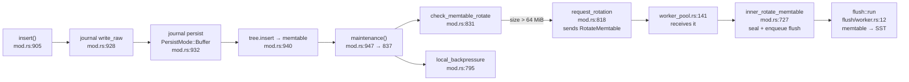

# fjall: the LSM lifecycle in clean Rust

The LSM protagonist of this topic — a codebase small enough that insert-to-SST
is traceable in an afternoon, and layered well enough to steal from. fjall is
the *keyspace/journal/scheduling* layer; the actual tree (memtable, SSTs,
blooms, block index) lives in the external `lsm-tree` crate, pinned at
`~3.1.6` in `Cargo.toml:29`. Before touching the code, this chapter builds the
LSM machine step by step — why writes are buffered, what a memtable and journal
are, what a flush produces, how a read finds anything, and why compaction and
tombstones exist. Then it hands you file and line anchors to watch each step
happen. Reading fjall shows you the LSM *lifecycle*; topic 4 descends into
`lsm-tree` itself.

**All line numbers below are from `fjall-rs/fjall@80cf6bc`** (crate version
3.1.6), the commit in this repo's pin table — check with
`python3 tools/pinned-source.py ref fjall`, and read any file at that commit
with `python3 tools/pinned-source.py show fjall <path> -r A:B`. One API caveat:
this topic's own experiment (`experiments/Cargo.toml:7`) pins **fjall 2.x**
(2.11.2 in the lockfile), where the type now called `Keyspace` was called
`Partition` and the type now called `Database` was called `Keyspace`. The
concepts are identical; the names moved in 3.0.

## The problem in one sentence

Absorb hundreds of thousands of writes per second with *random* keys on a
device that is only fast for *sequential* IO — without losing an acknowledged
write on crash, and while still answering point reads in a handful of IOs.

## The concepts, step by step

### Step 1 — why buffer writes in memory: sequential beats random

> **In:** a stream of inserts whose keys arrive in random order, and a block
> device with wildly asymmetric sequential and random throughput.
> **Out:** the reason every LSM starts with a RAM buffer, and the name of the
> cost that buys.

Storage devices reward sequential access and punish random access. An
**update-in-place** engine — one that modifies a record where it already lives,
like the B-tree in the turso chapter — turns every insert with a random key into
a random page write, because the target page is wherever the key sorts.

The LSM (log-structured merge) idea inverts this: **never update in place**.
Accumulate incoming writes in RAM — where random access is nearly free —
until you have tens of megabytes, then write them to disk in one big sequential
burst.

```text
 update-in-place:   insert(k₉₃₁), insert(k₀₂), insert(k₅₅₀) ...
                    → 3 random 4 KB page writes, scattered across the file

 log-structured:    insert(k₉₃₁), insert(k₀₂), insert(k₅₅₀) ... × ~600K
                    → buffered in RAM, sorted, then ONE 64 MiB sequential write
```

That 64 MiB is not a guess: fjall's default `max_memtable_size` is
`64 * 1_024 * 1_024` at `src/keyspace/options.rs:91`, and at this topic's
100-byte records that is 64 MiB / 100 B ≈ **671,000 records per flush**.

What it costs: the data on disk is now *many files written at different times*
instead of one tree — reads and space reclamation get harder. Steps 4–6 are the
price being paid, and [FINDINGS.md](../../FINDINGS.md) row 1 is what the trade
is worth on this topic's workload: on the same 108.0 MB of records, fjall's LSM
occupies **48.4 MB** (space amp 0.45×) against redb's copy-on-write B-tree at
**6,833.9 MB** (63.28×), a **140× spread**.

### Step 2 — the memtable and the journal: RAM for speed, a log for safety

> **In:** the decision to buffer writes in RAM.
> **Out:** the two structures that decision forces (a sorted in-memory map and
> an append-only log), the ordering rule between them, and fjall's actual
> `insert` from line 905.

The in-RAM buffer is the **memtable** — an in-memory *sorted* map (fjall's
`lsm-tree` uses a skip list) that absorbs every write and can be range-scanned
in key order. Sorted matters twice: the data must come out in key order when it
is written to disk (Step 3), and reads must be able to search it.

RAM alone is a durability hole: crash before the buffer hits disk and the writes
are gone. The fix is the **journal** (also called a WAL, write-ahead log): an
append-only file on disk. The rule that gives it its name — every write is
appended to the journal *before* it enters the memtable — is what makes replay
correct. Appending is sequential (the fast case from Step 1), so durability
costs one sequential append, not a random write.

Here is `Keyspace::insert` verbatim, with the doc comment and error paths
elided:

```rust
// src/keyspace/mod.rs at fjall-rs/fjall@80cf6bc — Keyspace::insert, lines 905-950,
// with the doc comment and two guard clauses (912-914, 921-924) elided.
905      pub fn insert<K: Into<UserKey>, V: Into<UserValue>>(
906          &self,
907          key: K,
908          value: V,
909      ) -> crate::Result<()> {
919          let mut journal_writer = self.supervisor.journal.get_writer();
926          let seqno = self.supervisor.seqno.next();
928          journal_writer.write_raw(self.id, &key, &value, lsm_tree::ValueType::Value, seqno)?;
930          if !self.config.manual_journal_persist {
931              journal_writer
932                  .persist(crate::PersistMode::Buffer)
937                  ?;
938          }
940          let (item_size, memtable_size) = self.tree.insert(key, value, seqno);
942          self.supervisor.snapshot_tracker.publish(seqno);
944          drop(journal_writer);
946          self.supervisor.write_buffer_size.allocate(item_size);
947          self.maintenance(memtable_size);
949          Ok(())
950      }
```

Five things this function tells you that prose would not:

1. **Line 919 takes the journal lock before anything else, and line 944 drops it
   only after the memtable insert.** That interval is what guarantees replay
   order equals apply order. The comment at line 921 explains a second reason —
   the poison flag must be checked *after* acquiring the mutex, otherwise
   TOCTOU.
2. **Line 926: a sequence number is allocated per write.** Seqnos are the spine
   of LSM correctness — they are how newest-wins is decided in Step 4 and how
   GC knows what is safe to drop in Step 5. Line 942 publishes it to the
   snapshot tracker.
3. **Line 932's default is `PersistMode::Buffer`, not an fsync.** The enum is at
   `src/journal/writer.rs:35`: `Buffer` (:41) hands bytes to the OS page cache
   only; `SyncData` (:46) calls `sync_data()` (:226); `SyncAll` (:49) calls
   `sync_all()` (:220). So out of the box fjall survives a *process* crash but
   not a *power* loss — the single biggest write-latency knob in any LSM, and
   the one you must match across engines before comparing them.
4. **Line 946 is accounting, not backpressure.** `write_buffer_size.allocate`
   just bumps a counter; the actual throttling is in `maintenance` (line 947).
5. **Every write is written twice** — once to the journal, later to a segment.
   That is the first factor of **write amplification**: bytes physically written
   to disk per byte of user data.

### Step 3 — flush: the memtable becomes an immutable sorted file

> **In:** a memtable that has hit 64 MiB.
> **Out:** what a segment file contains, why immutability is the point, and
> which fjall defaults set the layout.

When the memtable exceeds `max_memtable_size`, it is **rotated**: marked
immutable ("sealed"), swapped for a fresh empty memtable, and handed to a
background thread that writes it out as an **SSTable** (sorted string table;
fjall calls them **segments** or *tables*) — an *immutable* file of key-value
pairs in sorted order, plus two small helpers:

```text
 one segment (SSTable) on disk:
 ┌───────────────────────────────┬──────────────┬──────────────┐
 │ data blocks (4 KiB each,      │ block index  │ bloom filter │
 │ sorted key-value pairs)       │ first key →  │ 10 bits/key  │
 │ [a..f][g..m][n..s][t..z] ...  │ block offset │ ⇒ 0.82% FPR  │
 └───────────────────────────────┴──────────────┴──────────────┘
   64 MiB data                     ~tens of KB    ~840 KB / 671K keys
```

Every number in that box is a fjall default you can check:

- **4 KiB data blocks** — `data_block_size_policy: BlockSizePolicy::all(/* 4 KiB
  */ 4 * 1_024)` at `src/keyspace/options.rs:95`.
- The **block index** maps "first key of each block → file offset", so finding a
  key inside a segment costs one binary search in RAM plus **one** disk read.
  fjall pins the index blocks of the top two levels in memory
  (`index_block_pinning_policy: PinningPolicy::new([true, true, false])`,
  `options.rs:100`) and partitions them from level 3 down
  (`options.rs:103`).
- The **bloom filter** is a probabilistic set-membership structure — a bit array
  written by *k* hash functions — that answers "definitely not here" or "maybe
  here", never a false negative. At the standard optimal *k*, the false-positive
  rate for *m* bits per key is `0.6185^m`, so fjall's default of 10 bits/key
  gives `0.6185^10` = **0.82%**, and 671,000 keys × 10 bits = 839 KB of filter
  per segment. The policy is at `src/keyspace/options.rs:108–111` and Step 4
  explains why it is an *array*.

Because the segment is immutable it never needs locking and can be written as
one sequential stream; the journal entries covering the flushed memtable can
then be dropped. Cost: the same key may now exist in several segments — nothing
has been overwritten, only *shadowed* by a higher seqno.

### Step 4 — the read path: newest wins, blooms skip the rest

> **In:** a key that may live in the active memtable, a sealed memtable, or any
> segment on any level.
> **Out:** the newest-first search order, the arithmetic of what blooms save,
> and the one fjall default that is Monkey shipped as a product.

Since newer always shadows older, a read checks locations **newest-first** and
returns the first hit:

```text
 get(k):  active memtable → sealed memtables (newest first)
          → segments, newest first:
              bloom says "no"?  → skip, zero IO   (the common case)
              bloom says "maybe" → block index → read ONE block → found/miss
```

The number of places a single read might have to check is **read
amplification**. Blooms are what keep it tolerable. Concretely, with 20 segments
and fjall's default 10 bits/key (0.82% FPR), a lookup for an *absent* key does
20 × 0.0082 = **0.16 expected disk reads** instead of 20 — a 122× reduction, for
the cost of 20 in-memory hash probes.

In fjall the search itself is two lines:

```rust
// src/keyspace/mod.rs at fjall-rs/fjall@80cf6bc — Keyspace::get, lines 623-625.
// SeqNo::MAX means "read the newest version of everything" — a snapshot read
// would pass its own seqno here instead (topic 8's MVCC preview).
623      pub fn get<K: AsRef<[u8]>>(&self, key: K) -> crate::Result<Option<lsm_tree::UserValue>> {
624          Ok(self.tree.get(key, SeqNo::MAX)?)
625      }
```

The whole newest-first/bloom dance lives inside `lsm-tree`. What fjall keeps is
the *policy*, and its default is the interesting part:

```rust
// src/keyspace/options.rs at fjall-rs/fjall@80cf6bc — KeyspaceCreateOptions::default,
// lines 108-111 and 116. Both policies are ARRAYS indexed by LSM level.
108              filter_policy: FilterPolicy::new([
109                  FilterPolicyEntry::Bloom(BloomConstructionPolicy::FalsePositiveRate(0.0001)),
110                  FilterPolicyEntry::Bloom(BloomConstructionPolicy::BitsPerKey(10.0)),
111              ]),
116              data_block_compression_policy: CompressionPolicy::new([CompressionType::None, CompressionType::None, CompressionType::Lz4]),
```

Read line 108–111 carefully: **L0 gets a 0.01% false-positive rate; every deeper
level gets 10 bits/key.** Invert the bloom sizing formula
`m/n = −ln(p)/(ln 2)²` and the L0 budget is `−ln(0.0001)/0.4805` = **19.2
bits/key**, nearly double the deeper levels. That is Monkey's thesis —
non-uniform filter budgets, spend bits where probes are most frequent — shipped
as a library default. Topic 4 derives why.

Line 116 is the other half of this topic's headline. `CompressionPolicy::new([None,
None, Lz4])` means L0 and L1 are stored raw and **L2 and below are LZ4**, and
the `lz4` feature is on by default (`Cargo.toml:20`, `default = ["lz4"]`). That
is the mechanism behind fjall's measured **0.45× space amp**: 108.0 MB of
records ending up as 48.4 MB on disk is not the LSM defeating information
theory, it is LZ4 on compressible generated values, plus densely packed sorted
runs. Say that, not "LSMs are space-efficient".

### Step 5 — compaction: merging files to bound read cost

> **In:** a directory that accumulates one segment per flush, forever.
> **Out:** what compaction does, fjall's default geometry, where backpressure
> lives when compaction cannot keep up, and the write-amp bill.

Left alone, flushes pile up segments forever: read amplification grows without
bound and shadowed old versions waste disk (**space amplification** — bytes on
the device per byte of live data). **Compaction** is the background fix: pick
several segments, merge-sort them (each is already sorted, so this is a
streaming k-way merge), keep only the newest version of each key, write one new
segment, delete the inputs.

fjall's default is **leveled** — `compaction_strategy: Arc::new(Leveled::default())`
at `src/keyspace/options.rs:123–125`. Segments are organised into levels L0, L1,
L2…; each level is roughly an order of magnitude bigger than the previous and,
below L0, levels hold non-overlapping key ranges, so a read checks at most one
segment *per level*. The strategies fjall re-exports are at
`src/compaction/mod.rs:7`: `Fifo`, `Leveled`, `Levelled` (the last is an
alias — British and American spellings both work).

The write-amplification bill is the LSM's defining trade, and the LSM paper's
Theorem 3.1 prices it exactly: every key is rewritten once per level it
descends, so **write amp = K·(r+1)** for K disk levels at size ratio r — 4 × 11
= 44× for the usual four-levels-at-ten geometry. See
[reading-lsm-paper.md](reading-lsm-paper.md) Step 5 for the derivation. Topic 4
is entirely about tuning `K` and `r`.

What happens when ingest outruns compaction is worth reading, because it is
where "LSM absorbs writes fast" stops being true:

```rust
// src/keyspace/mod.rs at fjall-rs/fjall@80cf6bc — the backpressure path,
// lines 789-816. Called from maintenance() (line 839) on every single insert.
789      fn check_write_halt(&self) {
790          while self.tree.l0_run_count() >= 30 {
791              std::thread::sleep(Duration::from_millis(10));
792          }
793      }
795      pub(crate) fn local_backpressure(&self) -> bool {
796          let mut throttled = false;
798          let l0_run_count = self.tree.l0_run_count();
800          if l0_run_count >= 20 {
801              perform_write_stall(l0_run_count);
802              self.check_write_halt();
803              throttled = true;
804          }
806          while self.tree.sealed_memtable_count() >= 4 {
811              std::thread::sleep(Duration::from_millis(100));
812              throttled = true;
813          }
815          throttled
816      }
```

Three thresholds, all hard-coded: **stall at 20 L0 runs**, **halt at 30**, and
**halt while 4+ memtables are sealed and waiting to flush**, sleeping 100 ms a
turn. This is the "write stall" every LSM has, and it is why an LSM's latency
distribution has a long tail even when its mean looks excellent.

### Step 6 — tombstones: a delete is just another write

> **In:** immutable segments, and a user who calls `remove(k)`.
> **Out:** why a delete costs a *write*, when the bytes actually come back, and
> the scan pathology that follows.

Immutable files mean you cannot erase a key in place — an older segment may
still hold it, and you would have to rewrite that file to remove it. So
`remove(k)` *writes* a **tombstone**: a marker record meaning "k is deleted",
carried by the same path as any write — journal → memtable → flush → segment,
with its own seqno. fjall writes it as `lsm_tree::ValueType::Tombstone`, the
same call shape as the `ValueType::Value` on line 928 of Step 2. Reads treat a
tombstone as "found: not present" and stop, because newest-first ordering makes
it shadow every older version.

The actual bytes are reclaimed only when compaction merges the tombstone past
every older version of the key, and only at the bottom level can the tombstone
itself be dropped — until then dropping it could resurrect an older version
sitting below. Deciding when that is safe is what `snapshot_tracker` exists for:
compaction passes `snapshot_tracker.get_seqno_safe_to_gc()` into
`tree.compact(...)` at `src/compaction/worker.rs:34–37`, so no version an open
reader might still see is ever dropped. That exact problem returns as MVCC
vacuuming in topic 8.

Two costs follow. Deleted data occupies disk until compaction catches up — which
is a *space amplification* charge, i.e. the axis this topic measures. And a
range full of tombstones makes **scans slower**, because each tombstone must be
read and skipped: the classic "deleting data made my database slower" LSM
surprise.

## Where each step lives in the code

```text
src/
 ├─ lib.rs                       module map — start here
 ├─ keyspace/mod.rs (1113 lines) insert/get/rotation/backpressure (steps 2-5)
 ├─ keyspace/options.rs          every default in this guide (steps 3-5)
 ├─ journal/writer.rs            WAL writes + PersistMode (step 2)
 ├─ flush/worker.rs (42 lines)   sealed memtable → SST (step 3)
 ├─ compaction/worker.rs         compaction runs (step 5)
 ├─ worker_pool.rs               flume-channel thread pool
 ├─ ingestion.rs                 bulk load, and a seqno-race comment worth reading
 └─ poison_dart.rs (34 lines)    panic guard
```

**Steps 2–3 — the write path.** Start at `Keyspace::insert` —
`src/keyspace/mod.rs:905`. Read the whole function; it *is* the LSM write-path
diagram from the README:


```mermaid
flowchart LR
    I["insert()<br/>mod.rs:905"] --> J["journal write_raw<br/>mod.rs:928"]
    J --> P["journal persist<br/>PersistMode::Buffer<br/>mod.rs:932"]
    P --> M["tree.insert → memtable<br/>mod.rs:940"]
    M --> A["maintenance()<br/>mod.rs:947 → 837"]
    A --> C["check_memtable_rotate<br/>mod.rs:831"]
    A --> B["local_backpressure<br/>mod.rs:795"]
    C -- "size > 64 MiB" --> R["request_rotation<br/>mod.rs:818<br/>sends RotateMemtable"]
    R --> W["worker_pool.rs:141<br/>receives it"]
    W --> S["inner_rotate_memtable<br/>mod.rs:727<br/>seal + enqueue flush"]
    S --> F["flush::run<br/>flush/worker.rs:12<br/>memtable → SST"]
```

Note the hop through the worker pool: `request_rotation`
(`mod.rs:818–829`) only *sends* a `WorkerMessage::RotateMemtable`; a pool thread
receives it at `worker_pool.rs:141–145`, re-takes the journal lock, and calls
`inner_rotate_memtable`. The writing thread never blocks on the seal.

**Step 4 — the read path.** `Keyspace::get` — `src/keyspace/mod.rs:623–625`, a
two-line delegation to `lsm-tree`. Bloom policy at
`src/keyspace/options.rs:108–111`; its wire encoding at
`src/keyspace/config/filter.rs:8–44` (the `BitsPerKey`/`FalsePositiveRate`
variants are serialised there, but *defined* in `crate::config`).

**Step 5 — compaction scheduling.**

- Strategies re-exported at `src/compaction/mod.rs:7`: `Fifo`, `Leveled`,
  `Levelled`. Default chosen at `src/keyspace/options.rs:123–125`.
- Worker: `src/compaction/worker.rs:10` — thin, 60 lines; the real call is
  `tree.compact(strategy, snapshot_tracker.get_seqno_safe_to_gc())` at lines
  34–37.
- Backpressure: `src/keyspace/mod.rs:789–816`.

The interesting part is what fjall *doesn't* do: no compaction geometry lives
here — it delegates policy to `lsm-tree`, keeping fjall pure
lifecycle/scheduling. Good layering to steal for the capstone's storage crate.

**Aha spots** (worth a detour each):

1. **`poison_dart.rs:27–33`** — a `Drop` guard whose whole body is
   `if std::thread::panicking() { self.poison(); }`. If a background worker
   panics, the database is poisoned and every subsequent `insert` returns
   `Error::Poisoned` (checked at `mod.rs:922`). Crash *visibly* instead of
   serving from corrupt state. The entire file is 34 lines.
2. **`ingestion.rs:36–52`** — an ASCII interleaving diagram in a comment,
   explaining why `finish()` holds the journal lock: without it, a concurrent
   writer that already took seqno 1 could insert *after* the ingest registered
   seqno 2, inverting the ordering that newest-wins depends on.
3. **`worker_pool.rs:155`** — `if journal_writer.pos()? > 64_000_000` rotates
   the journal file. A second 64 MB threshold, independent of the memtable's.
4. **`snapshot_tracker`** — the open-snapshot seqno watermark gates GC;
   `mod.rs:757–758` pulls the watermark up on every rotation so a database with
   no open snapshots does not stall GC forever
   (the comment cites fjall discussion #85).

## Questions to answer while reading

1. The journal lock is taken at `mod.rs:919`, before the memtable insert at
   `:940`, and released at `:944`. Construct the concrete corruption that
   swapping lines 928 and 940 would allow, in terms of what journal replay
   would reconstruct after a crash.
2. `mod.rs:946` bumps an atomic counter, but backpressure is at `:795`. Read
   `local_backpressure` and say which of its three thresholds a writer hits
   first on this topic's workload (1.08 M records, batches of 1,000), and
   whether it stalls or halts.
3. `mod.rs:930–938` calls `persist(PersistMode::Buffer)` unless
   `manual_journal_persist` is set. What durability does that actually give you
   — against a process crash, and against power loss? Check what this topic's
   `experiments/src/lib.rs:57` and `:69` do, and why parity with redb's
   `Durability::None` was necessary before the shootout meant anything.
4. `options.rs:108–111` gives L0 a 0.0001 FPR and deeper levels 10 bits/key.
   Convert both to bits per key (`m/n = −ln p / (ln 2)²`), then explain why
   spending *more* bits on the *smallest* level is the right way round.
5. `options.rs:116` sets `[None, None, Lz4]`. Predict what the measured space
   amp would be if the whole array were `Lz4`, and what it would be if the
   `lz4` feature were off (`Cargo.toml:20`) — then say which of those two
   predictions you could test without changing fjall.

## Done when

Answer each before unfolding it.

- [ ] You can narrate insert-to-SST end to end, naming every function the write passes through and what each one is for.

<details>
<summary>Answer</summary>

`Keyspace::insert` (`mod.rs:905`) takes the journal writer lock (`:919`),
allocates a seqno (`:926`), appends to the journal (`write_raw`, `:928`),
persists in `PersistMode::Buffer` (`:932`), inserts into the memtable
(`tree.insert`, `:940`), publishes the seqno to the snapshot tracker (`:942`),
drops the journal lock (`:944`), accounts the bytes (`:946`) and calls
`maintenance` (`:947`). `maintenance` (`:837`) calls `check_memtable_rotate`
(`:831`), which — if `size > max_memtable_size`, default 64 MiB
(`options.rs:91`) — calls `request_rotation` (`:818`) to *send* a
`WorkerMessage::RotateMemtable`. A pool thread receives it (`worker_pool.rs:141`),
retakes the journal lock and calls `inner_rotate_memtable` (`:727`), which seals
the memtable, enqueues a `FlushTask` (`:746`) and sends `WorkerMessage::Flush`
(`:750`). `flush::run` (`flush/worker.rs:12`) calls `tree.flush(...)` and frees
the write-buffer bytes. `maintenance` also calls `local_backpressure` (`:795`).

</details>

- [ ] You know which decisions live in fjall and which live in `lsm-tree`, and can name two of each.

<details>
<summary>Answer</summary>

**fjall owns lifecycle and policy**: the journal and its `PersistMode`
(`journal/writer.rs:35`), memtable rotation and the worker-pool scheduling
(`mod.rs:818` → `worker_pool.rs:141`), backpressure thresholds
(`mod.rs:789–816`), the poison-on-panic guard (`poison_dart.rs:27`), and the
defaults in `keyspace/options.rs` — block size, filter policy, compression
policy, compaction strategy.

**`lsm-tree` owns the data structure**: the memtable (skip list), segment
format, block index, bloom implementation, the newest-first search inside
`tree.get`, and every compaction *geometry* — fjall's `compaction/worker.rs` is
60 lines that just call `tree.compact(strategy, gc_watermark)`, and
`compaction/mod.rs:7` merely re-exports `Fifo`/`Leveled`/`Levelled` from
`lsm_tree::compaction`. The dependency is pinned at `~3.1.6` in `Cargo.toml:29`.
That split is the layering worth stealing.

</details>

- [ ] You can state fjall's default durability and explain why it had to be matched before this topic's shootout meant anything.

<details>
<summary>Answer</summary>

Default is `PersistMode::Buffer` (`mod.rs:932`) — bytes go to the OS page cache
with no `fsync`. That survives a process crash but not power loss.
`PersistMode::SyncData` (`journal/writer.rs:46` → `sync_data()`, `:226`) and
`SyncAll` (`:49` → `sync_all()`, `:220`) are the durable modes.

It had to be matched because fsync dominates everything else in a write
benchmark. This topic's harness says so in its own header comment
(`experiments/src/lib.rs:5–7`): fjall runs `PersistMode::Buffer` and redb runs
`Durability::None`, with one `SyncAll` at the very end
(`experiments/src/lib.rs:69`), "so neither pays fsync per batch while the other
doesn't". Without that, the 140× space-amp spread would have been confounded by
a durability difference.

</details>

- [ ] You can explain fjall's measured 0.45× space amplification with a mechanism and a line number, rather than as "LSMs are compact".

<details>
<summary>Answer</summary>

[FINDINGS.md](../../FINDINGS.md) row 1: 108.0 MB of records occupy 48.4 MB —
space amp **0.45×**, against redb's 63.28×, a 140× spread. The mechanism is two
things, both checkable:

1. `data_block_compression_policy: CompressionPolicy::new([None, None, Lz4])` at
   `src/keyspace/options.rs:116`, with `default = ["lz4"]` at `Cargo.toml:20` —
   so everything that reaches L2 or below is LZ4-compressed, and the generated
   values are compressible.
2. Sorted runs are packed densely with no per-page fill-factor slack, unlike a
   B-tree's ~69% expected utilisation.

Below 1.0 is therefore not the LSM beating information theory — it is CPU being
spent to buy space, which the RUM paper explicitly puts *outside* its triangle
(see [reading-rum-conjecture.md](reading-rum-conjecture.md) Step 3).

</details>

- [ ] You can point at where an LSM's write latency tail actually comes from in this codebase.

<details>
<summary>Answer</summary>

`local_backpressure` at `src/keyspace/mod.rs:795–816`, called from
`maintenance` (`:839`) on *every insert*. Three hard-coded thresholds: a write
stall once L0 has ≥ 20 runs (`:800`), a hard halt looping on 10 ms sleeps once
it has ≥ 30 (`check_write_halt`, `:789–793`), and a halt looping on 100 ms
sleeps while 4 or more memtables are sealed and unflushed (`:806–813`). A writer
that outruns compaction therefore does not degrade smoothly; it hits a cliff and
sleeps in 10–100 ms units. That is the p99.9 in every LSM benchmark.

</details>

## References

**Code** (all line numbers at `fjall-rs/fjall@80cf6bc`, crate 3.1.6 — the pin
table entry; verify with `python3 tools/pinned-source.py ref fjall`)
- [fjall](https://github.com/fjall-rs/fjall) — `src/keyspace/mod.rs`
  (`insert:905`, `get:623`, rotation `:727/:818/:831`, backpressure `:789–816`),
  `src/keyspace/options.rs` (every default cited here: memtable size `:91`,
  block size `:95`, pinning `:100–101`, filter policy `:108–111`, compression
  `:116`, compaction strategy `:123`), `src/journal/writer.rs` (`PersistMode:35`),
  `src/flush/worker.rs:12`, `src/compaction/worker.rs:10`, `src/worker_pool.rs:141`,
  `src/poison_dart.rs:27`, `src/ingestion.rs:36`
- the external [`lsm-tree`](https://github.com/fjall-rs/lsm-tree) crate, pinned
  at `~3.1.6` in `Cargo.toml:29`, holds the actual tree (memtable, SSTs, blooms,
  block index) — topic 4's territory

**This repo**
- [FINDINGS.md](../../FINDINGS.md) row 1 — the 0.45× vs 63.28× measurement this
  guide explains; `./verify.sh 01`
- [notes.md](notes.md) — the baseline table and its caveats
- `experiments/src/lib.rs:1–7` — the durability-parity decision, in the
  harness's own words; note it pins fjall **2.x**, whose `Partition` is 3.x's
  `Keyspace`
- [reading-lsm-paper.md](reading-lsm-paper.md) — the `K·(r+1)` write-amp
  derivation Step 5 cites
- [reading-turso-btree.md](reading-turso-btree.md) — the update-in-place engine
  Step 1 contrasts against
