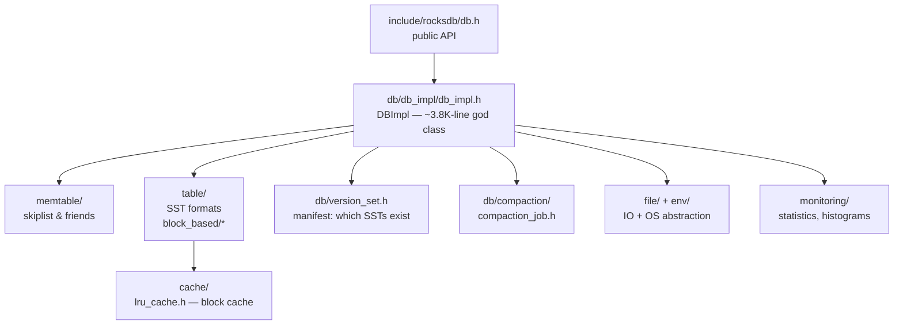

# RocksDB — orientation map (don't read it yet)

Repo: `~/repos/rocksdb` (shallow @ 7c80a5a). This is not a walkthrough — it's the map
you'll use in topic 4 (compaction), topic 6 (block cache), and topic 22 (db_bench).
Budget: 30 min of `ls` and skimming headers.

## Directory map

| Dir | What lives there | Anchor |
|-----|------------------|--------|
| `db/` | engine core: DBImpl, column families, versions, compaction | `db/db_impl/db_impl.h`, `db/column_family.h` |
| `table/` | SST file formats | `table/block_based/`, `table/format.h` |
| `memtable/` | memtable representations | `memtable/skiplist.h` |
| `cache/` | block/row cache | `cache/lru_cache.h` |
| `file/` | IO helpers, prefetch, filenames | `file/filename.h` |
| `util/` | blooms, hashing, compression | `util/bloom_impl.h` |
| `options/` | the infamous config surface | `options/db_options.h` |
| `env/` | OS abstraction | `env/env_posix.cc` |
| `monitoring/` | stats/histograms/perf context | `monitoring/statistics.h` |
| `utilities/` | transactions, backup, checkpoints | `utilities/transactions/` |

## The two entry points

- `DBImpl::Write()` — `db/db_impl/db_impl.h:256` (write path entry)
- `DBImpl::Get()` — `db/db_impl/db_impl.h:271` (read path entry)

Everything you traced in fjall/tidesdb exists here too, ~50x larger: journal ↔
`db/log_writer.cc`, keyspace ↔ column family, manifest ↔ `version_set`.

## Why orient now

When topic 4 asks "how does leveled compaction pick files?", you should already know
the answer lives in `db/compaction/` and version metadata in `db/version_set.h` —
navigation cost paid once, here.
