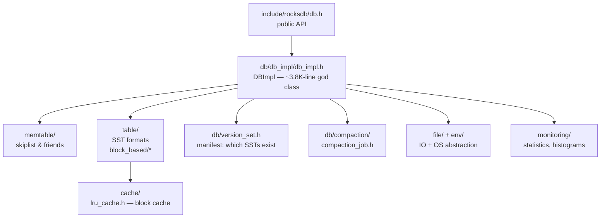

# RocksDB: buy the map before walking the territory

RocksDB is everything fjall and tidesdb do, ~50x larger — too big to read,
too important to skip. This chapter is not a walkthrough but an orientation
map: it first builds, step by step, the concept behind each major component
(so every directory name means something), then gives you the directory map
and two entry points. 30 minutes of `ls` and header-skimming now, so that
when topic 4 (compaction), topic 6 (block cache), and topic 22 (db_bench)
ask "where does X live?", you already know which directory holds the answer.

## The problem in one sentence

RocksDB runs the same LSM lifecycle you traced in fjall — log, memtable,
SST, compaction — but hardened for services at Meta storing hundreds of
terabytes; your problem, in the next 30 minutes, is to learn which of its
~10 top-level directories owns each piece of that lifecycle, so any future
question costs one `ls` instead of a day of grepping.

## The concepts, step by step

### Step 1 — the same machine, industrialized

RocksDB is an LSM (log-structured merge) engine: writes append to a
write-ahead log and land in an in-memory sorted buffer (the **memtable**);
full memtables are flushed to immutable sorted files (**SSTs**); background
**compaction** merges SSTs to keep reads bounded. Everything fjall does in
~10K lines of Rust, RocksDB does in hundreds of thousands of lines of C++ —
the extra mass is not a different algorithm, it's *options* (every knob
pluggable), *operability* (stats, backups, rate limiting), and *scale*
(column families, multi-threaded everything). So the map to build is: which
directory holds each lifecycle stage, plus which directories hold the
industrial padding.

### Step 2 — DBImpl and column families: where everything is wired together

`DBImpl` is the class that owns the whole engine — memtables, SST metadata,
background threads — and implements the public API. It lives in
`db/db_impl/db_impl.h` and is a ~3.8K-line god class: you never read it top
to bottom, you enter it at one method and follow one path. It also manages
**column families** (independent keyspaces — each with its own memtable,
SSTs, and options — that share one write-ahead log, so a batch spanning
several of them commits atomically; `db/column_family.h`). Column family ≈
fjall's *keyspace* — same concept, same reason to exist.

### Step 3 — `memtable/`: the write buffer is pluggable

In fjall and tidesdb the memtable is one fixed data structure. In RocksDB
it's an interface with several implementations — the default skip list
(`memtable/skiplist.h`), plus hash-based and vector variants for special
workloads. That is the RocksDB pattern in miniature: every component you
saw as a single choice elsewhere is a *directory of choices* here. Cost:
the option surface (Step 7) explodes combinatorially.

### Step 4 — `table/`: the SST file format

An SST here is the **block-based table** format: ~4 KB data blocks of
sorted key-value pairs, an index block mapping first-keys to block offsets,
a filter block (bloom or ribbon filter — "is this key maybe in this file?"
at ~10 bits/key), and a footer that locates the rest. Exactly tidesdb's
SSTable anatomy, productized with compression, checksums, and partitioned
indexes. The format lives in `table/block_based/` and `table/format.h` —
this is topic 4 and topic 6 territory (the block cache caches precisely
these blocks).

### Step 5 — versions and the MANIFEST: which files ARE the database

An LSM's file set changes constantly — every flush adds an SST, every
compaction adds some and deletes others. A **version** is one immutable
snapshot of "these exact SST files, at these levels, are the database right
now", and the **MANIFEST** is an append-only log of version *edits* (+file
/ −file records) so the current version survives a crash. This is the LSM's
answer to "what is authoritative?" — in a B-tree engine it's one file; here
it's a *list of files*, and that list needs its own durability story.
`db/version_set.h` owns it. Reads pin a version (so compaction can't delete
files under them) — the same lifetime problem tidesdb solved with refcounts.

### Step 6 — `db/compaction/`: picker (policy) vs job (mechanics)

RocksDB splits compaction in two, and the split is the thing to remember:
the **compaction picker** decides *which* files to merge (leveled,
universal, FIFO policies — the geometry that sets write amplification), and
the **compaction job** (`db/compaction/compaction_job.h`) does the k-way
merge and writes the outputs. When topic 4 asks "how does leveled
compaction pick files?", the answer is in the picker; when topic 22's
db_bench shows compaction stalls, the mechanics are in the job.

### Step 7 — the supporting cast: cache, IO, options, monitoring

The remaining directories are the industrial padding, each a one-liner:

- `cache/` — the **block cache** (`cache/lru_cache.h`): keeps hot SST data
  blocks in RAM so repeat reads skip the disk entirely (topic 6's subject).
- `file/` + `env/` — IO helpers and the OS abstraction layer
  (`env/env_posix.cc`); every read/write goes through here, which is how
  RocksDB runs on posix, Windows, and remote storage alike.
- `options/` — the infamous config surface (`options/db_options.h`):
  hundreds of knobs, most of them the pluggability from Steps 3–6.
- `monitoring/` — statistics, histograms, perf context
  (`monitoring/statistics.h`): how you *see* write stalls and read amp.
- `util/` — blooms, hashing, compression (`util/bloom_impl.h`).
- `utilities/` — transactions, backup, checkpoints
  (`utilities/transactions/` — topic 8 territory).

## Where each step lives in the code

| Dir | What lives there | Anchor | Step |
|-----|------------------|--------|------|
| `db/` | engine core: DBImpl, column families, versions, compaction | `db/db_impl/db_impl.h`, `db/column_family.h` | 2, 5, 6 |
| `table/` | SST file formats | `table/block_based/`, `table/format.h` | 4 |
| `memtable/` | memtable representations | `memtable/skiplist.h` | 3 |
| `cache/` | block/row cache | `cache/lru_cache.h` | 7 |
| `file/` | IO helpers, prefetch, filenames | `file/filename.h` | 7 |
| `util/` | blooms, hashing, compression | `util/bloom_impl.h` | 7 |
| `options/` | the infamous config surface | `options/db_options.h` | 7 |
| `env/` | OS abstraction | `env/env_posix.cc` | 7 |
| `monitoring/` | stats/histograms/perf context | `monitoring/statistics.h` | 7 |
| `utilities/` | transactions, backup, checkpoints | `utilities/transactions/` | 7 |

### The two entry points

- `DBImpl::Write()` — `db/db_impl/db_impl.h:256` (write path entry)
- `DBImpl::Get()` — `db/db_impl/db_impl.h:271` (read path entry)

Everything you traced in fjall/tidesdb exists here too, ~50x larger: journal ↔
`db/log_writer.cc`, keyspace ↔ column family, manifest ↔ `version_set`.

## Why orient now

When topic 4 asks "how does leveled compaction pick files?", you should already know
the answer lives in `db/compaction/` and version metadata in `db/version_set.h` —
navigation cost paid once, here.

## Done when

Given any lifecycle question — "where is the bloom filter built?", "what
records that an SST was deleted?" — you can name the directory (and usually
the header) without grepping.

## References

**Code**
- [rocksdb](https://github.com/facebook/rocksdb) (shallow clone @
  `7c80a5a` at `~/repos/rocksdb`) — don't read it yet; orient with the
  directory map above. Anchors: `db/db_impl/db_impl.h`,
  `db/version_set.h`, `db/compaction/`, `table/block_based/`,
  `memtable/skiplist.h`, `cache/lru_cache.h`
