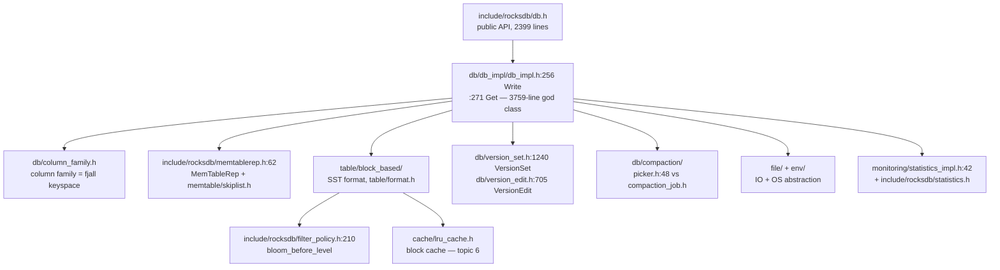

# RocksDB: buy the map before walking the territory

RocksDB is everything fjall and tidesdb do, an order of magnitude larger — too
big to read, too important to skip. This chapter is not a walkthrough but an
orientation map: it first builds, step by step, the concept behind each major
component (so every directory name means something), then gives you the
directory map and two entry points. Thirty minutes of header-skimming now, so
that when topic 4 (compaction), topic 6 (block cache), and topic 22 (db_bench)
ask "where does X live?", you already know which directory holds the answer.

**All paths and line numbers are at `facebook/rocksdb@7c80a5a`**, this repo's
pinned commit — check with `python3 tools/pinned-source.py ref rocksdb`, and
read any file at that commit with
`python3 tools/pinned-source.py show rocksdb <path> -r A:B`. Every anchor below
was verified against that commit; a few in earlier drafts of this guide were
not, and are corrected inline.

## The problem in one sentence

RocksDB runs the same LSM lifecycle you traced in fjall — log, memtable, SST,
compaction — but hardened for services storing hundreds of terabytes; your
problem, in the next thirty minutes, is to learn which of its ten top-level
directories owns each piece of that lifecycle, so any future question costs one
`ls` instead of a day of grepping.

## The concepts, step by step

### Step 1 — the same machine, industrialized

> **In:** the LSM lifecycle you already traced in fjall.
> **Out:** a measured sense of *where* the extra mass went, so you know what
> you are not reading.

RocksDB is an LSM (log-structured merge) engine: writes append to a write-ahead
log and land in an in-memory sorted buffer (the **memtable**); full memtables
are flushed to immutable sorted files (**SSTs**); background **compaction**
merges SSTs to keep reads bounded. Everything fjall does, RocksDB does — the
extra mass is not a different algorithm, it is *options* (every knob
pluggable), *operability* (stats, backups, rate limiting), and *scale* (column
families, multi-threaded everything).

Put a number on "larger" by comparing the two files that play the same role:

```text
                                 RocksDB @7c80a5a       fjall @80cf6bc
the class that owns the engine   db/db_impl/db_impl.h   src/keyspace/mod.rs
                                   3,759 lines
                                 db/db_impl/db_impl.cc
                                   8,238 lines
                                 ─────────────────────  ──────────────────
                                  11,997 lines           1,113 lines   10.8×

the public option surface        include/rocksdb/       src/keyspace/
                                   options.h              options.rs
                                   3,232 lines            742 lines     4.4×

the public API header            include/rocksdb/db.h   src/lib.rs
                                   2,399 lines
```

`include/rocksdb/options.h` alone — just the *declarations* of the knobs — is
three times the size of fjall's entire keyspace module. That is the shape of the
difference, and the reason this chapter is a map rather than a reading.

### Step 2 — DBImpl and column families: where everything is wired together

> **In:** a public `DB` interface and a request that has to reach a memtable.
> **Out:** the one class every path goes through, and RocksDB's name for
> fjall's keyspace.

`DBImpl` is the class that owns the whole engine — memtables, SST metadata,
background threads — and implements the public `DB` API declared in
`include/rocksdb/db.h` (2,399 lines). It lives in `db/db_impl/db_impl.h` and is
a 3,759-line god class declaration backed by an 8,238-line `.cc`: you never read
it top to bottom, you enter at one method and follow one path. The two entry
points worth bookmarking:

```cpp
// db/db_impl/db_impl.h at facebook/rocksdb@7c80a5a — the two entry points,
// lines 255-256 and 270-273. Everything else in this 3,759-line header is
// reachable from one of them.
255    using DB::Write;
256    Status Write(const WriteOptions& options, WriteBatch* updates) override;
270    using DB::Get;
271    Status Get(const ReadOptions& _read_options,
272               ColumnFamilyHandle* column_family, const Slice& key,
273               PinnableSlice* value, std::string* timestamp) override;
```

Note the `ColumnFamilyHandle*` on line 272. A **column family** is an
independent keyspace — its own memtable, its own SSTs, its own options — that
*shares one write-ahead log with its siblings*, so a `WriteBatch` spanning
several of them commits atomically. It lives in `db/column_family.h` (978
lines). Column family ≈ fjall's *keyspace*: same concept, same reason to exist,
and the shared-WAL detail is the same one that makes fjall take a single journal
lock across all keyspaces.

### Step 3 — `memtable/`: the write buffer is pluggable

> **In:** fjall's single fixed skip-list memtable.
> **Out:** the RocksDB pattern in miniature — one choice becomes a directory of
> choices — and what that costs.

In fjall and tidesdb the memtable is one fixed data structure. In RocksDB it is
an *interface*: `MemTableRep` at `include/rocksdb/memtablerep.h:62`, with
`MemTableRepFactory` at `:359`, and several implementations — the default skip
list (`memtable/skiplist.h`, 518 lines), plus hash-based and vector variants for
special workloads. `db/memtable.h` (1,042 lines) is the wrapper that holds one
of them plus the sequence-number and flush machinery.

That is the RocksDB pattern everywhere: every component you saw as a single
choice elsewhere is a directory of choices here. The cost is Step 7's option
surface, which explodes combinatorially — 3,232 lines of it.

### Step 4 — `table/`: the SST file format

> **In:** a sealed memtable that must become an immutable file.
> **Out:** the four parts of a block-based SST, with RocksDB's own defaults and
> its own filter arithmetic.

An SST here is the **block-based table** format: data blocks of sorted key-value
pairs, an index block mapping first-keys to block offsets, a filter block, and a
footer that locates the rest. Exactly tidesdb's and fjall's SSTable anatomy,
productised with compression, checksums, and partitioned indexes.

```text
 block-based table (table/block_based/, table/format.h):
 ┌──────────────────────┬─────────────┬──────────────┬─────────────┬────────┐
 │ data blocks          │ filter      │ index block  │ metaindex   │ footer │
 │ 4 KiB default        │ block       │ first key →  │ block       │        │
 │ (table.h:400)        │ bloom or    │ offset       │             │        │
 │ sorted KV pairs      │ ribbon      │ 4 KiB meta   │             │        │
 └──────────────────────┴─────────────┴──────────────┴─────────────┴────────┘
```

- `block_size = 4 * 1024` at `include/rocksdb/table.h:400`;
  `metadata_block_size = 4096` at `:423`.
- The reader is `table/block_based/block_based_table_reader.h` (981 lines); the
  writer is `table/block_based/block_based_table_builder.h` (245 lines);
  `table/format.h` (534 lines) is the footer and block-handle encoding.

The filter block is where RocksDB has gone furthest past fjall, and
`include/rocksdb/filter_policy.h` states the trade in its own numbers
(lines 169–173): a **Ribbon filter** "saves about 30% space compared to Bloom
filters, with similar query times but roughly 3-4x CPU time … if you pass in 10
for `bloom_equivalent_bits_per_key`, you'll get the same 0.95% FP rate as Bloom
filter but only using about 7 bits per key."

Work that: 10 bits/key → 0.95% false positives with Bloom; 7 bits/key → the same
0.95% with Ribbon; 3/10 = **30% of the filter memory given back, paid for in
3–4× filter-construction CPU**. And the header goes on (lines 175–188) to make
it a *per-level* decision via `bloom_before_level` (default `0`, signature at
`:210`): "the space savings of Ribbon filters makes sense for lower (higher
numbered; larger; longer-lived) levels of LSM, whereas the speed of Bloom
filters make sense for highest levels." That is the same Monkey-shaped idea as
fjall's per-level `FilterPolicy` array — see
[reading-fjall.md](reading-fjall.md) Step 4 — with a second dimension added.

### Step 5 — versions and the MANIFEST: which files ARE the database

> **In:** a file set that changes on every flush and every compaction.
> **Out:** the LSM's answer to "what is authoritative?", and why that answer
> needs its own durability story.

An LSM's file set is never stable — every flush adds an SST, every compaction
adds some and deletes others. A **version** is one immutable snapshot of "these
exact SST files, at these levels, are the database right now", and the
**MANIFEST** is an append-only log of version *edits* (+file / −file records) so
the current version survives a crash.

This is a genuinely different problem from the B-tree world. In a B-tree engine
the authoritative thing is one file and a root pointer inside it; here it is a
*list of files*, and lists do not fsync themselves. Hence a whole subsystem:

| class | file:line | role |
|---|---|---|
| `VersionEdit` | `db/version_edit.h:705` | one MANIFEST record: files added, files deleted |
| `VersionStorageInfo` | `db/version_set.h:131` | the per-level file layout of one version |
| `Version` | `db/version_set.h:914` | one immutable snapshot, refcounted |
| `VersionSet` | `db/version_set.h:1240` | the chain of versions + MANIFEST writer |

`db/version_edit.h` is 1,151 lines and `db/version_set.h` is 1,980 — this is not
a footnote, it is comparable in size to the memtable and table code combined.
Reads *pin* a version so compaction cannot delete files out from under them —
the same lifetime problem tidesdb solves with refcounts, and the same problem
fjall's `snapshot_tracker` solves with a seqno watermark.

### Step 6 — `db/compaction/`: picker (policy) vs job (mechanics)

> **In:** the write-amplification knob from the LSM paper.
> **Out:** the one architectural split in this directory worth memorising, and
> where each half lives.

RocksDB splits compaction in two, and the split is the thing to remember:

- the **compaction picker** decides *which* files to merge — this is the
  geometry that sets write amplification. Abstract base at
  `db/compaction/compaction_picker.h:48` (346 lines), with three concrete
  policies: `LevelCompactionPicker` (`compaction_picker_level.h:18`, a 35-line
  header — the policy declaration really is that small),
  `UniversalCompactionPicker` (`compaction_picker_universal.h:16`), and
  `FIFOCompactionPicker` (`compaction_picker_fifo.h:15`);
- the **compaction job** does the k-way merge and writes the outputs —
  `db/compaction/compaction_job.h` (743 lines), over the plan described by
  `db/compaction/compaction.h` (694 lines).

When topic 4 asks "how does leveled compaction pick files?", the answer is in
the picker; when topic 22's db_bench shows compaction stalls, the mechanics are
in the job. The write-amplification bill those pickers are trading against is
`K·(r+1)` — 44× for four levels at size ratio 10; see
[reading-lsm-paper.md](reading-lsm-paper.md) Step 5.

### Step 7 — the supporting cast: cache, IO, options, monitoring

> **In:** the six directories that are not the lifecycle.
> **Out:** one sentence and one verified anchor each, so none of them is ever
> a mystery again.

- `cache/` — the **block cache** (`cache/lru_cache.h`, 473 lines): keeps hot SST
  data blocks in RAM so repeat reads skip the disk entirely. Topic 6's subject,
  and it caches precisely the 4 KiB blocks from Step 4.
- `file/` + `env/` — IO helpers and the OS abstraction layer
  (`file/filename.h`, 200 lines; `env/env_posix.cc`, 532 lines). Every read and
  write goes through here, which is how RocksDB runs on POSIX, Windows and
  remote storage alike.
- `options/` — the config plumbing (`options/db_options.h`, 174 lines, holds
  `ImmutableDBOptions`). The *user-facing* surface is
  `include/rocksdb/options.h` at **3,232 lines** — that is the file people mean
  when they complain about RocksDB's knob count, and most of those knobs exist
  to select among the pluggable choices from Steps 3–6.
- `monitoring/` — statistics, histograms, perf context. **The anchor to use is
  `monitoring/statistics_impl.h:42` (`class StatisticsImpl : public
  Statistics`), plus the public `include/rocksdb/statistics.h` (957 lines) and
  `monitoring/perf_context_imp.h`.** There is no `monitoring/statistics.h` at
  this commit — an earlier version of this guide cited one, and it does not
  exist.
- `util/` — blooms, hashing, compression (`util/bloom_impl.h`, 489 lines); the
  policy-side glue is `table/block_based/filter_policy_internal.h` (347 lines).
- `utilities/` — transactions, backup, checkpoints
  (`utilities/transactions/pessimistic_transaction.h`, 369 lines — topic 8
  territory).

## Where each step lives in the code


```mermaid
flowchart TB
    API["include/rocksdb/db.h<br/>public API, 2399 lines"] --> DBI["db/db_impl/db_impl.h:256 Write<br/>:271 Get — 3759-line god class"]
    DBI --> CF["db/column_family.h<br/>column family = fjall keyspace"]
    DBI --> MEM["include/rocksdb/memtablerep.h:62<br/>MemTableRep + memtable/skiplist.h"]
    DBI --> TAB["table/block_based/<br/>SST format, table/format.h"]
    DBI --> VS["db/version_set.h:1240 VersionSet<br/>db/version_edit.h:705 VersionEdit"]
    DBI --> CMP["db/compaction/<br/>picker.h:48 vs compaction_job.h"]
    TAB --> FILT["include/rocksdb/filter_policy.h:210<br/>bloom_before_level"]
    TAB --> CACHE["cache/lru_cache.h<br/>block cache — topic 6"]
    DBI --> FILE["file/ + env/<br/>IO + OS abstraction"]
    DBI --> MON["monitoring/statistics_impl.h:42<br/>+ include/rocksdb/statistics.h"]
```

| Dir | What lives there | Verified anchor | Step |
|-----|------------------|--------|------|
| `db/` | engine core: DBImpl, column families, versions, compaction | `db/db_impl/db_impl.h:256`, `db/column_family.h`, `db/version_set.h:1240` | 2, 5, 6 |
| `table/` | SST file formats | `table/block_based/block_based_table_reader.h`, `table/format.h` | 4 |
| `memtable/` | memtable representations | `memtable/skiplist.h`, `include/rocksdb/memtablerep.h:62` | 3 |
| `cache/` | block/row cache | `cache/lru_cache.h` | 7 |
| `file/` | IO helpers, prefetch, filenames | `file/filename.h` | 7 |
| `util/` | blooms, hashing, compression | `util/bloom_impl.h` | 7 |
| `options/` | config plumbing (public surface is `include/rocksdb/options.h`) | `options/db_options.h` | 7 |
| `env/` | OS abstraction | `env/env_posix.cc` | 7 |
| `monitoring/` | stats/histograms/perf context | `monitoring/statistics_impl.h:42` | 7 |
| `utilities/` | transactions, backup, checkpoints | `utilities/transactions/pessimistic_transaction.h` | 7 |

### The two entry points

- `DBImpl::Write()` — `db/db_impl/db_impl.h:256` (write path entry)
- `DBImpl::Get()` — `db/db_impl/db_impl.h:271` (read path entry)

Everything you traced in fjall and tidesdb exists here too: fjall's journal ↔
`db/log_writer.h:75` (`class Writer`), fjall's keyspace ↔ column family, fjall's
`snapshot_tracker` version-pinning ↔ `VersionSet`. When topic 4 asks "how does
leveled compaction pick files?", you should already know the answer lives in
`db/compaction/compaction_picker_level.h` and the file metadata in
`db/version_set.h` — navigation cost paid once, here.

## Questions to answer in notes.md

These all require the source open; `python3 tools/pinned-source.py show rocksdb
<path> -r A:B` is the fastest way to answer them.

1. `db/db_impl/db_impl.h:256` declares `Write(const WriteOptions&, WriteBatch*)`
   but `:271`'s `Get` takes a `ColumnFamilyHandle*` and `Write` does not.
   Explain from `db/column_family.h` how a `WriteBatch` addresses multiple
   column families, and why that design forces them to share one WAL.
2. `include/rocksdb/filter_policy.h:169–188` claims Ribbon gives the same 0.95%
   FP rate at 7 bits/key that Bloom gives at 10, for 3–4× construction CPU, and
   recommends it for *deeper* levels via `bloom_before_level` (default 0 at
   `:210`). Work out the memory saved on a 100 GB LSM with 100-byte records at
   both settings, and say why "deeper levels get the cheaper-to-build filter"
   is the opposite of what you might guess from Monkey.
3. Open `db/version_edit.h:705` and list the fields of `VersionEdit`. Then
   answer: after a crash mid-compaction, what exactly makes the *old* input SSTs
   still authoritative? Name the record that would have made the new ones
   authoritative and when it is written.
4. `db/compaction/compaction_picker_level.h` is a 35-line header while
   `db/compaction/compaction_job.h` is 743 lines. Read enough of
   `db/compaction/compaction_picker.h:48` to explain the split, and say which of
   the two files you would open to change write amplification and which to
   change compaction *throughput*.
5. Compare `include/rocksdb/options.h` (3,232 lines) with fjall's
   `src/keyspace/options.rs` (742 lines). Pick three RocksDB options that have
   no fjall equivalent and, for each, name the Step-3-to-6 pluggability that
   made it necessary.

## Done when

Answer each before unfolding it.

- [ ] Given any lifecycle question — "where is the bloom filter built?", "what records that an SST was deleted?" — you can name the directory, and usually the header, without grepping.

<details>
<summary>Answer</summary>

Bloom/Ribbon filters: the policy is `include/rocksdb/filter_policy.h` (public)
and `table/block_based/filter_policy_internal.h`; the bit-twiddling is
`util/bloom_impl.h`; the block is written into the SST by
`table/block_based/block_based_table_builder.h`.

"An SST was deleted" is recorded by a `VersionEdit` (`db/version_edit.h:705`)
appended to the MANIFEST by `VersionSet` (`db/version_set.h:1240`). The file is
not unlinked until no live `Version` (`db/version_set.h:914`) still references
it.

</details>

- [ ] You can name the two entry points into `DBImpl` and say what each one is the head of.

<details>
<summary>Answer</summary>

`DBImpl::Write(const WriteOptions&, WriteBatch*)` at
`db/db_impl/db_impl.h:256` — head of the write path: WAL append via
`db/log_writer.h:75`, then memtable insert, then possibly a flush and
compaction schedule.

`DBImpl::Get(const ReadOptions&, ColumnFamilyHandle*, const Slice&,
PinnableSlice*, std::string*)` at `db/db_impl/db_impl.h:271` — head of the read
path: memtable, then immutable memtables, then the pinned `Version`'s SSTs level
by level, with filter and block-cache lookups in between.

Between them they reach every subsystem in the table above, which is why the map
is worth more than any single walkthrough.

</details>

- [ ] You can map every fjall concept you learned onto its RocksDB counterpart, with a file for each.

<details>
<summary>Answer</summary>

| fjall | RocksDB |
|---|---|
| `Keyspace` (`src/keyspace/mod.rs`) | column family, `db/column_family.h` |
| `Database` / supervisor | `DBImpl`, `db/db_impl/db_impl.h` |
| journal (`src/journal/writer.rs`) | WAL, `db/log_writer.h:75` |
| memtable (fixed skip list in `lsm-tree`) | `MemTableRep` interface, `include/rocksdb/memtablerep.h:62`; default `memtable/skiplist.h` |
| segment / SST | block-based table, `table/block_based/` |
| filter policy array (`options.rs:108`) | `FilterPolicy` + `bloom_before_level`, `include/rocksdb/filter_policy.h:210` |
| `snapshot_tracker` seqno watermark | pinned `Version`, `db/version_set.h:914` |
| — (no equivalent) | MANIFEST / `VersionEdit`, `db/version_edit.h:705` |
| `Leveled` strategy (`compaction/mod.rs:7`) | `LevelCompactionPicker`, `db/compaction/compaction_picker_level.h:18` |

The one row with no fjall equivalent is the MANIFEST, because fjall delegates
the entire file-set-durability problem to `lsm-tree`.

</details>

- [ ] You can explain the picker/job split and say which side you would touch to change write amplification.

<details>
<summary>Answer</summary>

The **picker** (`db/compaction/compaction_picker.h:48` and its three subclasses)
chooses *which* files to merge and therefore fixes the geometry — level count,
size ratio, how many files per job. That geometry *is* write amplification:
`K·(r+1)` from the LSM paper's Theorem 3.1. The **job**
(`db/compaction/compaction_job.h`, 743 lines) executes a chosen plan
(`db/compaction/compaction.h`) — the k-way merge, output file writing, rate
limiting, subcompaction parallelism — and therefore fixes compaction
*throughput*, not its total volume.

So: change write amp in the picker; change stall behaviour and CPU usage in the
job.

</details>

- [ ] You can state the Ribbon-vs-Bloom trade in RocksDB's own numbers and say where the option lives.

<details>
<summary>Answer</summary>

`include/rocksdb/filter_policy.h:169–173`: a Ribbon filter "saves about 30%
space compared to Bloom filters, with similar query times but roughly 3-4x CPU
time and 3x temporary space usage during construction" — 10
bloom-equivalent bits/key gives 0.95% FP rate at "about 7 bits per key".

The knob is `bloom_before_level`, default `0`, declared at `:210` and mutable at
runtime via `db->SetOptions({{"table_factory.filter_policy.bloom_before_level",
"3"}})` (`:192`). Lines 175–181 give the rationale: Bloom for the highest
(smallest, hottest, shortest-lived) levels where build speed matters, Ribbon for
the deeper long-lived levels where the 30% memory saving compounds.

</details>

- [ ] You checked at least one anchor in this guide yourself with `tools/pinned-source.py`, and know how to re-check the rest.

<details>
<summary>Answer</summary>

`python3 tools/pinned-source.py ref rocksdb` prints
`facebook/rocksdb@7c80a5a`. Then, for example:

```
python3 tools/pinned-source.py show rocksdb db/db_impl/db_impl.h -r 255:273
python3 tools/pinned-source.py grep rocksdb "class CompactionPicker" --glob 'db/compaction/*.h'
```

`show` prints the file's total line count in its header, which is how every
"N lines" figure in this guide was obtained. Do this before trusting any line
number in any guide, including this one — the previous version of this file
cited `monitoring/statistics.h`, which does not exist at this commit.

</details>

## References

**Code** (all at `facebook/rocksdb@7c80a5a` — this repo's pin table entry)
- [rocksdb](https://github.com/facebook/rocksdb) — don't read it yet; orient
  with the directory map above. Verified anchors: `db/db_impl/db_impl.h:256`
  (`Write`) and `:271` (`Get`), `db/column_family.h`, `db/version_set.h:131/914/1240`,
  `db/version_edit.h:705`, `db/compaction/compaction_picker.h:48`,
  `db/compaction/compaction_picker_level.h:18`, `db/compaction/compaction_job.h`,
  `db/log_writer.h:75`, `table/block_based/block_based_table_reader.h`,
  `table/format.h`, `include/rocksdb/table.h:400`,
  `include/rocksdb/filter_policy.h:169–210`,
  `include/rocksdb/memtablerep.h:62`, `memtable/skiplist.h`,
  `cache/lru_cache.h`, `util/bloom_impl.h`, `monitoring/statistics_impl.h:42`,
  `env/env_posix.cc`, `file/filename.h`,
  `utilities/transactions/pessimistic_transaction.h`

**This repo**
- [reading-fjall.md](reading-fjall.md) — the same lifecycle at 1/10 the size,
  with every default cited; read it first
- [reading-tidesdb.md](reading-tidesdb.md) — the same lifecycle in C, where the
  SST anatomy of Step 4 is small enough to read end to end
- [reading-lsm-paper.md](reading-lsm-paper.md) — the write-amplification model
  the pickers of Step 6 are trading against
- [FINDINGS.md](../../FINDINGS.md) row 1 — this topic's measured LSM-vs-B-tree
  space amplification (0.45× vs 63.28×), the number RocksDB's compaction knobs
  exist to move
