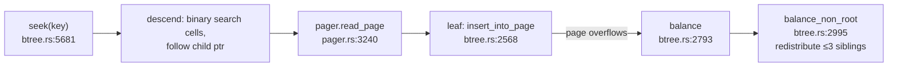

# Reading turso — SQLite's B-tree, in Rust

Repo: `~/repos/turso` (shallow clone). Line numbers from the clone; these files are
huge and move fast — expect drift, navigate by symbol name.

turso re-implements the SQLite file format, so this is a reading of *the* canonical
page-oriented engine, with Rust types instead of C macros. Two files carry the topic:

| File | Size | Role |
|------|------|------|
| `core/storage/btree.rs` | ~13K lines | B-tree cursor, slotted pages, balance |
| `core/storage/pager.rs` | ~6.6K lines | page cache, dirty tracking, IO |
| `core/storage/wal.rs` | ~10K lines | WAL frames + checkpoint |
| `core/storage/page_cache.rs` | — | SIEVE-eviction page cache |

## 1. The slotted page — read this first

`core/storage/btree.rs:76–124` has an ASCII diagram of the page layout in the source
itself. The shape to internalize:

```
 ┌────────────┬──────────────────────┬────────────┬─────────────────┐
 │ header     │ cell pointer array   │ free space │ cell content    │
 │ 8/12 bytes │ u16 offsets, →grows  │            │ ←grows, actual  │
 │            │ rightward            │            │ records         │
 └────────────┴──────────────────────┴────────────┴─────────────────┘
   two regions grow toward each other; a "full" page = they meet
```

- Cell parsing: `read_btree_cell()` — `core/storage/sqlite3_ondisk.rs:816`.
- Delete fragmentation + fix: `defragment_page()` — `btree.rs:8422`; pointer-array
  maintenance via `copy_within` in `shift_pointers_left()` — `btree.rs:9067`.

This layout is why B-trees have space amplification: the free gap in the middle of
every page is the price of in-place insertion.

## 2. The cursor — how every operation moves

Main types: `BTreeCursor` (`btree.rs:714`), `CursorContext` (`btree.rs:539`),
`PinGuard` (`btree.rs:375` — pins a page in the cache while the cursor points at it).

- Point lookup: `seek()` — `btree.rs:5681`. Trace one descent: root → interior cells
  binary-searched → child page id → pager fetch → leaf.
- Insert: `insert()` — `btree.rs:5779` → `insert_into_page()` — `btree.rs:2568`.



## 3. Balance ≠ naive split

`balance_non_root()` (`btree.rs:2995`) rebalances up to **three sibling pages at
once**, redistributing cells — not the textbook "split one node in two". This is
SQLite's fill-factor trick: fewer, fuller pages ⇒ lower space amplification and
shallower trees. Compare with `balance_root()` (`btree.rs:4774`) which grows the tree
by one level.

## 4. Pager + WAL — where "in place" becomes crash-safe

- `Pager` struct: `pager.rs:1335`. Reads: `read_page()` — `pager.rs:3240` (cache
  first), `read_page_no_cache()` — `pager.rs:3185`.
- Dirty tracking: `add_dirty()` — `pager.rs:3412`. **Aha:** the page is journaled to
  the WAL *before* modification — that's the write-ahead in write-ahead logging,
  visible in code.
- WAL: `WalFile` (`wal.rs:2593`), frames appended in `append_frames_vectored()`
  (`wal.rs:708`), and `checkpoint()` (`wal.rs:3795`) copies frames back into the main
  DB file. So even the in-place family writes out-of-place *first*, then reconciles —
  keep this in mind for the README's "what is authoritative" framing.
- Page cache: `page_cache.rs:99` — SIEVE eviction, default 2000 pages. Buffer-pool
  preview (topic 6).

## Questions to answer

1. How many pages does a point lookup touch on a 1M-row table (page 4KB, ~50 cells
   interior fanout)? Which of those are realistically cached?
2. Why does `balance_non_root` prefer redistribution over splitting? What does it do
   to write amplification (3 dirty pages vs 2)?
3. During checkpoint, what blocks writers? (Read `checkpoint()` far enough to answer.)

## Done when

You can draw the slotted page from memory and explain how one insert can dirty 1 page
(common), 3 pages (balance), or O(height) pages (root split).
