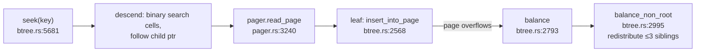

# Turso's B-tree: the canonical page engine, in Rust

turso re-implements the SQLite file format, so this is a reading of *the*
canonical page-oriented engine — with Rust types instead of C macros. It is
the B-tree protagonist opposite fjall's LSM. Before touching the code, this
chapter builds the machine step by step: why pages exist, how a tree of
pages finds a row, how one page stores variable-length rows, what one insert
does, and how the whole thing survives a crash. Then it hands you the file
and line anchors to watch each step happen.

## The problem in one sentence

Store a million sorted rows on disk so that finding one costs a handful of
disk reads and inserting one doesn't rewrite the file.

## The concepts, step by step

### Step 1 — the page: disks deal in blocks, so the engine does too

Disks and OSes transfer data in fixed-size blocks, and a crash-safe engine
wants a unit it can read, cache, and write atomically. So the database file
is an array of fixed-size **pages** (SQLite default 4 KB), and "one disk IO"
always means "one page". Every structure that follows is built out of pages
that point at each other by **page number** — a page number is disk's version
of a pointer.

### Step 2 — a tree of pages: fanout is everything

To find one row among a million with few page reads, arrange the pages as a
sorted tree. Each **interior page** holds ~50–500 separator keys and child
page numbers; each **leaf page** holds the actual rows. Because one page
holds *hundreds* of keys (not 2, like a binary tree node), the tree is
extremely flat — the height is log-base-*fanout*:

```
                    ┌────────── root (interior) ──────────┐
                    │  k₅₀ → pg7   k₁₀₀ → pg8   ... ×50   │
                    └──────────────────┬───────────────────┘
             ┌─────────────────────────┼──── ~50 children ────┐
        interior pg7              interior pg8               ...
        (50 keys each)            (50 keys each)
             │                         │
          leaves                    leaves        50×50×50 ≈ 125K leaves
                                                  × ~50 rows = millions

 1M rows, fanout 50 → height 3-4: a point lookup touches 3-4 pages,
 and the root + interiors are ~2% of the data — they stay cached.
```

That is the entire reason B-trees won: **the tree's shape is dictated by the
page size**, so the memory hierarchy's block transfers are never wasted.

### Step 3 — inside one page: the slotted layout

A leaf must hold *variable-length* rows, keep them *sorted*, and absorb
inserts and deletes *in place*. Storing rows back-to-back fails: inserting in
the middle would shift everything. The fix is one level of indirection — a
**slotted page**:

```
 ┌────────────┬──────────────────────┬────────────┬─────────────────┐
 │ header     │ cell pointer array   │ free space │ cell content    │
 │ 8/12 bytes │ u16 offsets, →grows  │            │ ←grows, actual  │
 │            │ rightward            │            │ records         │
 └────────────┴──────────────────────┴────────────┴─────────────────┘
   two regions grow toward each other; a "full" page = they meet
```

- The rows ("**cells**") are written wherever there's room, from the right.
- A small array of 2-byte offsets at the front — the **pointer array** — is
  kept in sorted-key order. Sorting means moving 2-byte pointers, never the
  rows themselves; binary search runs over the pointer array.
- Delete = remove the pointer, *leave the bytes*. The dead bytes are
  reclaimed lazily ("defragmentation") only when space runs out.

turso draws this exact diagram in the source at `core/storage/btree.rs:76–124`.
This layout is also why B-trees have space amplification: the free gap in
the middle of every page is the price of in-place insertion.

### Step 4 — one insert, mechanically

With Steps 1–3, an insert into a leaf is four small moves:

```rust
fn insert_cell(page: &mut Page, idx: usize, cell: &[u8]) -> Result<(), Full> {
    let ptrs_end = page.header_len() + 2 * (page.ncells + 1); // ptr array grows →
    let content_start = page.content_start - cell.len();      // content grows ←
    if content_start < ptrs_end {
        return Err(Full);                       // regions met: time to balance/split
    }
    page.buf[content_start..content_start + cell.len()].copy_from_slice(cell);
    page.shift_pointers_right(idx);             // open slot idx — keys stay sorted
    page.write_u16(page.ptr_slot(idx), content_start as u16);
    page.ncells += 1;
    page.content_start = content_start;
    Ok(())
}
// delete = remove the u16 pointer, LEAVE the bytes → fragmentation,
// reclaimed only by defragment_page() — cheap deletes, deferred cleanup
```

The common case dirties exactly **one page**. `Err(Full)` is the interesting
case — Step 5.

### Step 5 — when the page is full: balance, not naive split

The textbook answer is: split the full page into two half-full pages and add
a separator key to the parent. That works but leaves pages 50% full — space
amplification and a deeper tree.

SQLite (and turso, in `balance_non_root()`) does better: take the full page
**and up to two siblings**, pool all their cells, and redistribute them
evenly across the (possibly one more) pages. Fewer, fuller pages ⇒ shallower
tree. The costs to notice: a balance dirties ~3 pages instead of 1, and in
the rare worst case a split propagates upward until the root itself splits
(`balance_root()`) — the only operation that makes the tree taller.

So one insert dirties 1 page (common), ~3 pages (balance), or O(height)
pages (root split). Hold that gradient — it's question 2 below.

### Step 6 — surviving a crash: the pager and the WAL

Writing pages in place is exactly what makes crashes dangerous: die mid-write
and the old version is *gone*. Two components fix this:

- The **pager** owns all page IO: it caches pages in memory, hands them to
  the B-tree, and tracks which are **dirty** (modified but not yet written).
- The **WAL** (write-ahead log) is an append-only file. The rule that gives
  it its name: a page's new version is appended to the WAL *before* the
  database file is ever touched. Commit = the WAL append is durable.
  Later, a **checkpoint** copies WAL frames back into the main file and
  truncates the WAL.

The punchline for the topic's B-tree-vs-LSM framing: even the in-place
family writes out-of-place *first*, then reconciles. The difference is what
is **authoritative** — here the B-tree file is (the WAL is a temporary
patch); in an LSM the log-structured files are the database.

## Where each step lives in the code

These files are huge and move fast — expect line-number drift, navigate by
symbol name.

| File | Size | Role (steps) |
|------|------|------|
| `core/storage/btree.rs` | ~13K lines | cursor, slotted pages, balance (2–5) |
| `core/storage/pager.rs` | ~6.6K lines | page cache, dirty tracking, IO (6) |
| `core/storage/wal.rs` | ~10K lines | WAL frames + checkpoint (6) |
| `core/storage/page_cache.rs` | — | SIEVE-eviction page cache (6) |

- **Step 3 in code**: the layout diagram at `btree.rs:76–124`; cell parsing in
  `read_btree_cell()` — `core/storage/sqlite3_ondisk.rs:816`; delete
  fragmentation fixed by `defragment_page()` — `btree.rs:8422`; pointer-array
  maintenance via `copy_within` in `shift_pointers_left()` — `btree.rs:9067`.
- **Steps 2+4 in code — the cursor**: every operation moves via `BTreeCursor`
  (`btree.rs:714`), with `CursorContext` (`btree.rs:539`) and `PinGuard`
  (`btree.rs:375` — pins a page in the cache while the cursor points at it).
  Trace one descent in `seek()` (`btree.rs:5681`): root → binary search the
  cell pointer array → child page number → pager fetch → leaf. Insert:
  `insert()` (`btree.rs:5779`) → `insert_into_page()` (`btree.rs:2568`).



- **Step 5 in code**: `balance_non_root()` — `btree.rs:2995` (the ≤3-sibling
  redistribution); `balance_root()` — `btree.rs:4774` (grows the tree by one
  level).
- **Step 6 in code**: `Pager` struct — `pager.rs:1335`; reads via
  `read_page()` — `pager.rs:3240` (cache first) and `read_page_no_cache()` —
  `pager.rs:3185`. Dirty tracking in `add_dirty()` — `pager.rs:3412`; the
  page is journaled to the WAL *before* modification — the write-ahead rule,
  visible in code. WAL: `WalFile` (`wal.rs:2593`), frames appended in
  `append_frames_vectored()` (`wal.rs:708`), `checkpoint()` (`wal.rs:3795`)
  copies frames back into the main DB file. Page cache: `page_cache.rs:99` —
  SIEVE eviction, default 2000 pages (buffer-pool preview, topic 6).

## Questions to answer

1. How many pages does a point lookup touch on a 1M-row table (page 4KB, ~50 cells
   interior fanout)? Which of those are realistically cached?
2. Why does `balance_non_root` prefer redistribution over splitting? What does it do
   to write amplification (3 dirty pages vs 2)?
3. During checkpoint, what blocks writers? (Read `checkpoint()` far enough to answer.)

## Done when

You can draw the slotted page from memory and explain how one insert can dirty 1 page
(common), 3 pages (balance), or O(height) pages (root split).

## References

**Code**
- [turso](https://github.com/tursodatabase/turso) —
  `core/storage/btree.rs` (~13K lines: cursor, slotted pages, balance),
  `core/storage/pager.rs`, `core/storage/wal.rs`,
  `core/storage/page_cache.rs`, `core/storage/sqlite3_ondisk.rs`
  (shallow clone at `~/repos/turso`; line numbers drift — navigate by
  symbol name)
