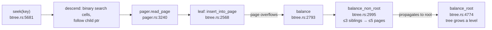

# Turso's B-tree: the canonical page engine, in Rust

turso re-implements the SQLite file format, so this is a reading of *the*
canonical page-oriented engine — with Rust types instead of C macros. It is the
B-tree protagonist opposite fjall's LSM. Before touching the code, this chapter
builds the machine step by step: why pages exist, how a tree of pages finds a
row, how one page stores variable-length rows, what one insert does, and how the
whole thing survives a crash. Then it hands you the file and line anchors to
watch each step happen.

Everything below is anchored at `tursodatabase/turso@dd775bc`, this repo's pin
(`python3 tools/pinned-source.py ref turso`). Read any file at that commit with
`python3 tools/pinned-source.py show turso core/storage/btree.rs -r A:B` — that
is more reliable than a local clone, because these files move fast.

## The problem in one sentence

Store a million sorted rows on disk so that finding one costs a handful of disk
reads and inserting one doesn't rewrite the file.

## The concepts, step by step

### Step 1 — the page: disks deal in blocks, so the engine does too

> **In:** a block device that transfers fixed-size chunks and an engine that
> must survive being killed mid-write.
> **Out:** the page as the universal unit — of IO, of caching, of the atomicity
> argument — and the page number as disk's pointer.

Disks and OSes transfer data in fixed-size blocks, and a crash-safe engine wants
a unit it can read, cache and write atomically. So the database file is an array
of fixed-size **pages** (SQLite's default is 4 KB), and "one disk IO" always
means "one page". Every structure that follows is built out of pages that point
at each other by **page number** — a page number is disk's version of a pointer,
and dereferencing one means asking the pager for that page.

Two consequences you will meet again in this guide. First, the *page cache* is
sized in pages, not bytes: turso's default is
`DEFAULT_PAGE_CACHE_SIZE_IN_PAGES = 2000` (`core/storage/page_cache.rs:14`, with
a separate 100,000 for wasm at `:16`) — 8.2 MB at 4 KB pages. Second, the tree
has a hard depth bound derived from page arithmetic:
`BTCURSOR_MAX_DEPTH = 20` (`core/storage/btree.rs:133`), justified in the comment
above it as "a maximum database size of 2^31 pages, a minimum fanout of 2 for a
root-node and 3 for all other internal nodes". Anything deeper is declared
corrupt rather than traversed.

### Step 2 — a tree of pages: fanout is everything

> **In:** a million sorted rows and a budget of a few page reads per lookup.
> **Out:** fanout computed from real SQLite cell sizes, the resulting height,
> and the fraction of the file that has to stay cached to make it work.

To find one row among a million with few page reads, arrange the pages as a
sorted tree. Each **interior page** holds separator keys and child page numbers;
each **leaf page** holds the actual rows. Because one page holds *hundreds* of
keys — not 2, like a binary tree node — the tree is extremely flat: the height
is log-base-*fanout*, not log-base-2.

"Hundreds" is not a hand-wave; it falls out of the page header layout turso
documents at `core/storage/btree.rs:76–124`. Write **P** for page size, **H**
for header bytes (12 interior, 8 leaf — stated on line 76), **s = 2** for a cell
pointer, and **c** for a cell's own bytes. Then

```text
  fanout = floor((P − H) / (c + s))

  Table-interior cell = 4 B child page number + varint rowid (3 B up to ~2 M)
      c = 7   ⇒  (4096 − 12) / (7 + 2)    = 453 children per interior page

  Table-leaf cell, 100-byte row
      = varint payload length (2 B) + varint rowid (3 B) + 100 B payload
      c = 105 ⇒  (4096 −  8) / (105 + 2)  =  38 rows per leaf page

  Index-interior cell, 16-byte key
      = 4 B child + varint payload length (1 B) + 16 B key
      c = 21  ⇒  (4096 − 12) / (21 + 2)   = 177 children per interior page
```

Now the tree for 1,000,000 rows of 100 bytes:

```text
  leaves      = ceil(1,000,000 / 38)  = 26,316 pages   ← 107.8 MB
  interior L1 = ceil(   26,316 / 453) =     59 pages
  root        = ceil(       59 / 453) =      1 page
  ─────────────────────────────────────────────────
  height 3: root → interior → leaf. A point lookup reads 3 pages.
  Interior total = 60 pages = 245.8 KB = 0.23% of the file.
```

That last line is the whole argument for why B-trees stay fast: the navigational
part of the structure is a quarter of a megabyte, so it lives in the page cache
permanently and only the final leaf read is a real IO. With turso's default
2000-page cache you hold all 60 interior pages *and* 1,940 leaves — 7.4% of the
leaf level — for 8.2 MB.

Note the old rule of thumb "fanout ≈ 50" is far too pessimistic for a rowid
table: 50 would require a ~70-byte separator. At fanout 50 the same 26,316
leaves need three interior levels (527 → 11 → 1) and the tree is height 4. So
**fanout is set by key size, and key size sets height** — which is exactly the
lever topic 3 measures. Its worked table for other key/value shapes is in
[topics/03-btree-internals/notes.md](../03-btree-internals/notes.md); topic 3's
own headline is that height stopping at 3 does *not* stop lookups getting
slower, because cache residency, not height, sets what a page touch costs.

That is the entire reason B-trees won: **the tree's shape is dictated by the
page size**, so the memory hierarchy's block transfers are never wasted.

### Step 3 — inside one page: the slotted layout

> **In:** one 4 KB page that must hold variable-length rows, keep them sorted,
> and absorb inserts and deletes in place.
> **Out:** the slotted-page layout, the header fields that implement it, and the
> reason B-trees have space amplification.

Storing rows back-to-back fails: inserting in the middle would shift everything
after it. The fix is one level of indirection — a **slotted page**:

```text
 ┌────────────┬──────────────────────┬────────────┬─────────────────┐
 │ header     │ cell pointer array   │ free space │ cell content    │
 │ 8/12 bytes │ u16 offsets, →grows  │            │ ←grows, actual  │
 │            │ rightward            │            │ records         │
 └────────────┴──────────────────────┴────────────┴─────────────────┘
   two regions grow toward each other; a "full" page = they meet
```

- The rows ("**cells**") are written wherever there's room, from the right. The
  source says why in as many words at `core/storage/btree.rs:112–114`: "SQLite
  strives to place cells as far toward the end of the b-tree page as it can, in
  order to leave space for future growth of the cell pointer array."
- A small array of 2-byte offsets at the front — the **cell pointer array** — is
  kept in sorted-key order. Sorting means moving 2-byte pointers, never the rows
  themselves; binary search runs over the pointer array.
- Delete = remove the pointer, *leave the bytes*. The dead bytes are reclaimed
  lazily ("defragmentation") only when space runs out.

turso spells the header out field by field, with an ASCII diagram, in the
`offset` module — read it, it is the file format in twenty lines:

```rust
// core/storage/btree.rs at tursodatabase/turso@dd775bc, lines 76-124
// (constants only; the doc comments on each are worth reading in full)
76  /// The B-Tree page header is 12 bytes for interior pages and 8 bytes for leaf pages.
84  pub mod offset {
86      pub const BTREE_PAGE_TYPE: usize = 0;               // u8
98      pub const BTREE_FIRST_FREEBLOCK: usize = 1;         // u16 — head of the freeblock chain
101     pub const BTREE_CELL_COUNT: usize = 3;              // u16 — how many pointers in the array
115     pub const BTREE_CELL_CONTENT_AREA: usize = 5;       // u16 — where content starts (moves LEFT)
120     pub const BTREE_FRAGMENTED_BYTES_COUNT: usize = 7;  // u8
123     pub const BTREE_RIGHTMOST_PTR: usize = 8;           // u32 — interior pages only
124 }
```

Two of those fields exist purely to manage the dead space deletes leave behind,
and the doc comments define them precisely. A **freeblock**
(`BTREE_FIRST_FREEBLOCK`, comment at `:90–97`) is a run of **at least 4 bytes**
inside the cell content area that is no longer in use, chained to the next one —
explicitly *not* the regular free gap in the middle of the page. **Fragments**
(`BTREE_FRAGMENTED_BYTES_COUNT`, `:119`) are "isolated groups of 1, 2, or 3
unused bytes" — too small to be worth chaining, so they are merely counted.
When the counter or the chain gets bad enough, `defragment_page()`
(`core/storage/btree.rs:8422`) compacts the content area.

This layout is also why B-trees have space amplification: the free gap in the
middle of every page, plus the freeblocks and fragments, is the price of
in-place insertion. [FINDINGS.md](../../FINDINGS.md) row 1 is that price
measured on this topic's workload — the same 108 MB of records occupies 48 MB
under fjall's LSM (space amp **0.45×**) and 6.8 GB under redb's copy-on-write
B-tree (**63.28×**), a **140× spread**. redb is not turso, and the mechanism
there is copy-on-write rather than slotted-page slack (per-batch commits copy
every page on the root path), but the direction is the same one this layout
sets up: the in-place family spends space to buy in-place updates.

### Step 4 — one insert, mechanically

> **In:** a cell to add, and a leaf page with its two regions.
> **Out:** the four moves that make the common case dirty exactly one page, and
> the single condition that escalates it.

With Steps 1–3, an insert into a leaf is four small moves:

```rust
// ILLUSTRATION — the shape of turso's insert, not its source. The real path is
// insert() core/storage/btree.rs:5779 → insert_into_page() :2568 →
// insert_into_cell() :8669; the overflow branch is balance() :2793.
1  fn insert_cell(page: &mut Page, idx: usize, cell: &[u8]) -> Result<(), Full> {
2      let ptrs_end = page.header_len() + 2 * (page.ncells + 1); // ptr array grows →
3      let content_start = page.content_start - cell.len();      // content grows ←
4      if content_start < ptrs_end {
5          return Err(Full);                     // regions met: time to balance/split
6      }
7      page.buf[content_start..content_start + cell.len()].copy_from_slice(cell);
8      page.shift_pointers_right(idx);           // open slot idx — keys stay sorted
9      page.write_u16(page.ptr_slot(idx), content_start as u16);
10     page.ncells += 1;
11     page.content_start = content_start;       // BTREE_CELL_CONTENT_AREA, offset 5
12     Ok(())
13 }
14 // delete = remove the u16 pointer, LEAVE the bytes → freeblocks + fragments,
15 // reclaimed only by defragment_page() (btree.rs:8422) — cheap deletes,
16 // deferred cleanup. The mirror of line 8 is shift_pointers_left() (:9067),
17 // which is a single copy_within over the 2-byte pointers.
```

Line 8 is the payoff of the whole layout: keeping the page sorted costs a
`copy_within` over 2-byte pointers, never a move of the records. Line 4 is the
only branch that can escalate — the common case dirties exactly **one page**.
`Err(Full)` is the interesting case, and it is Step 5.

### Step 5 — when the page is full: balance, not naive split

> **In:** a leaf whose two regions have met.
> **Out:** why SQLite redistributes across siblings instead of splitting, the
> two constants that bound the operation, and the resulting gradient of dirty
> pages per insert.

The textbook answer is: split the full page into two half-full pages and add a
separator key to the parent. That works, but it leaves pages 50% full — space
amplification and a deeper tree.

SQLite, and turso in `balance_non_root()` (`core/storage/btree.rs:2995`), does
better: take the full page **and up to two siblings**, pool all their cells, and
redistribute them evenly across the resulting pages. The bound is a named
constant — `MAX_SIBLING_PAGES_TO_BALANCE: usize = 3`
(`core/storage/btree.rs:136`) — and so is its consequence:

```rust
// core/storage/btree.rs at tursodatabase/turso@dd775bc, lines 135-139
135 /// Maximum number of sibling pages that balancing is performed on.
136 pub const MAX_SIBLING_PAGES_TO_BALANCE: usize = 3;
137
138 /// We only need maximum 5 pages to balance 3 pages, because we can guarantee that cells from 3 pages will fit in 5 pages.
139 pub const MAX_NEW_SIBLING_PAGES_AFTER_BALANCE: usize = 5;
```

Line 138 is a proof obligation stated as a comment, and it is worth checking
against Step 2's numbers: three full leaves hold at most 3 × 38 = 114 cells;
after balancing, those 114 cells plus the incoming one spread over at most 5
pages, i.e. 23 per page, comfortably inside the 38 a page can take. The reason
the bound is 5 rather than 4 is the divider cells that have to be pushed into
the parent.

Fewer, fuller pages ⇒ a shallower tree and less slack per page. The costs to
notice: a balance dirties ~3 pages instead of 1, and in the rare worst case a
split propagates upward until the root itself splits — `balance_root()`
(`core/storage/btree.rs:4774`), the only operation that makes the tree taller.

So one insert dirties:

```text
  1 page          common case — cell fits (Step 4, line 4 takes the happy path)
  ~3–5 pages      balance_non_root: 3 siblings pooled into ≤5, parent updated
  O(height)       balance_root: propagation reaches the root, tree grows a level
                  bounded above by BTCURSOR_MAX_DEPTH = 20 (btree.rs:133)
```

Hold that gradient — it is question 2 below, and it is the B-tree half of the
write-amplification story that [FINDINGS.md](../../FINDINGS.md) row 1 measures
from the other end.

### Step 6 — surviving a crash: the pager and the WAL

> **In:** an engine that writes pages in place, and a machine that can lose
> power between two of those writes.
> **Out:** the two components that fix it, the actual call sites, and one
> correction to the folk version of "the write-ahead rule".

Writing pages in place is exactly what makes crashes dangerous: die mid-write
and the old version is *gone*. Two components fix this.

The **pager** (`Pager`, `core/storage/pager.rs:1335`) owns all page IO: it caches
pages in memory, hands them to the B-tree, and tracks which are **dirty**
(modified but not yet written). Reads go through `read_page()`
(`core/storage/pager.rs:3240`, cache first) or `read_page_no_cache()` (`:3185`);
`add_dirty()` (`:3412`) marks a page modified.

The **WAL** (write-ahead log, `WalFile` at `core/storage/wal.rs:2593`) is an
append-only file. The rule that gives it its name: a page's new version is
appended to the WAL *before* the database file is ever touched. Commit = the WAL
append is durable. Later, a **checkpoint** (`core/storage/wal.rs:3795`) copies
WAL frames back into the main file — which is the only time the main file is
written at all.

One correction worth making, because the previous version of this guide got it
wrong and the mistake is instructive. `add_dirty()` does *not* write to the WAL.
Read it:

```rust
// core/storage/pager.rs at tursodatabase/turso@dd775bc, lines 3412-3420
3412     pub fn add_dirty(&self, page: &Page) -> Result<()> {
3413         turso_assert!(
3414             page.is_loaded(),
3415             "page must be loaded in add_dirty() so its contents can be subjournaled",
3416             { "page_id": page.get().id }
3417         );
3418         self.subjournal_page_if_required(page)?;
3419         let mut dirty_pages = self.dirty_pages.write();
3420         dirty_pages.insert(page.get().id as u32);
```

Line 3418 writes the page's *pre-image* to a **subjournal**
(`core/storage/subjournal.rs`, held at `pager.rs:1357`), which exists so a
`SAVEPOINT` or a failed statement can be rolled back *within* an open
transaction. That is a different mechanism from the WAL, with a different
lifetime. The WAL frames are appended later, on the commit path: `cacheflush()`
(`core/storage/pager.rs:3451`) collects the dirty set and calls
`wal.append_frames_vectored(pages, page_sz)` at `pager.rs:3704` (and again at
`:3901`), landing in `core/storage/wal.rs:4333`. So there are *two* journals
here — one for intra-transaction rollback, one for crash recovery — and reading
`add_dirty()` as "the write-ahead rule, visible in code" conflates them.

The punchline for the topic's B-tree-vs-LSM framing survives the correction, and
is in fact sharper for it: even the in-place family writes out-of-place *first*,
then reconciles. The difference is what is **authoritative** — here the B-tree
file is (the WAL is a temporary patch that `checkpoint()` folds back in); in an
LSM the log-structured files *are* the database and nothing is ever folded back.

## Where each step lives in the code

All at `tursodatabase/turso@dd775bc`. Line counts are that commit's; these files
move fast, so navigate by symbol name if you read a different revision.

| File | Lines | Role (steps) |
|------|-------|------|
| `core/storage/btree.rs` | 13,186 | cursor, slotted pages, balance (2–5) |
| `core/storage/wal.rs` | 10,064 | WAL frames + checkpoint (6) |
| `core/storage/pager.rs` | 6,614 | page cache, dirty tracking, IO (1, 6) |
| `core/storage/sqlite3_ondisk.rs` | 2,449 | cell parsing — the byte format (3) |
| `core/storage/page_cache.rs` | 1,872 | SIEVE-eviction page cache (1, 6) |

- **Step 1**: `DEFAULT_PAGE_CACHE_SIZE_IN_PAGES = 2000` —
  `page_cache.rs:14`; `BTCURSOR_MAX_DEPTH = 20` — `btree.rs:133`.
- **Step 3**: the header field map and its ASCII diagram — `btree.rs:76–124`;
  cell parsing in `read_btree_cell()` — `sqlite3_ondisk.rs:816`; delete
  fragmentation fixed by `defragment_page()` — `btree.rs:8422` (with
  `defragment_page_fast` at `:8273`, `_full` at `:8399`, `_for_insert` at
  `:8412`); pointer-array maintenance via `copy_within` in
  `shift_pointers_left()` — `btree.rs:9067`.
- **Steps 2 + 4 — the cursor**: every operation moves via `BTreeCursor`
  (`btree.rs:714`), with `CursorContext` (`btree.rs:539`, key enum at `:530`)
  and `PinGuard` (`btree.rs:375` — pins a page in the cache while the cursor
  points at it). Trace one descent in `seek()` (`btree.rs:5681`; trait
  declaration at `:653`): root → binary search the cell pointer array → child
  page number → pager fetch → leaf. Insert: `insert()` (`btree.rs:5779`) →
  `insert_into_page()` (`btree.rs:2568`) → `insert_into_cell()` (`btree.rs:8669`).


```mermaid
flowchart LR
    S["seek(key)<br/>btree.rs:5681"] --> D["descend: binary search cells,<br/>follow child ptr"]
    D --> PG["pager.read_page<br/>pager.rs:3240"]
    PG --> L["leaf: insert_into_page<br/>btree.rs:2568"]
    L -- page overflows --> B["balance<br/>btree.rs:2793"]
    B --> BNR["balance_non_root<br/>btree.rs:2995<br/>≤3 siblings → ≤5 pages"]
    BNR -- propagates to root --> BR["balance_root<br/>btree.rs:4774<br/>tree grows a level"]
```

- **Step 5**: `MAX_SIBLING_PAGES_TO_BALANCE = 3` — `btree.rs:136`;
  `MAX_NEW_SIBLING_PAGES_AFTER_BALANCE = 5` — `btree.rs:139`; `balance()` —
  `btree.rs:2793`; `balance_non_root()` — `btree.rs:2995`; `balance_root()` —
  `btree.rs:4774`.
- **Step 6**: `Pager` — `pager.rs:1335`; `read_page()` — `pager.rs:3240`;
  `read_page_no_cache()` — `pager.rs:3185`; `add_dirty()` — `pager.rs:3412`
  (**subjournal**, not WAL — see Step 6); the subjournal handle itself —
  `pager.rs:1357`. Commit path: `cacheflush()` — `pager.rs:3451`, which calls
  `append_frames_vectored` at `pager.rs:3704`. WAL: `WalFile` — `wal.rs:2593`
  (shared state `WalFileShared` — `wal.rs:2781`); `append_frames_vectored()`
  impl — `wal.rs:4333` (trait declaration `wal.rs:708`); `checkpoint()` impl —
  `wal.rs:3795` (trait declaration `wal.rs:715`). Page cache: `PageCache` —
  `page_cache.rs:99`, SIEVE eviction described at `:90–98`, `spill_threshold`
  at `:109` (buffer-pool preview, topic 6).

## Questions to answer in notes.md

Each needs the source open. `python3 tools/pinned-source.py show turso
core/storage/btree.rs -r A:B` is the fastest way in.

1. Redo Step 2's fanout arithmetic for a **16-byte index key** instead of a
   rowid table (index-interior cell = 4 B child + 1 B varint length + key). What
   height does 1M rows give, how many pages is the interior level, and how much
   of turso's default 2000-page cache does it consume? Then say which of those
   two numbers — height or cached fraction — topic 3 found actually predicts
   lookup latency.
2. Why does `balance_non_root()` (`btree.rs:2995`) prefer redistribution over
   splitting? Check the claim on `btree.rs:138` — that cells from 3 pages always
   fit in 5 — against your Step 2 cell sizes, and say what the choice does to
   write amplification (≈3–5 dirty pages per balance versus 2 for a naive
   split) *and* to space amplification.
3. During a checkpoint, what blocks writers? Read `checkpoint()`
   (`core/storage/wal.rs:3795`) far enough to name the mode enum
   (`CheckpointMode`, declared at `wal.rs:715`) and say which of its variants
   waits for readers.
4. `add_dirty()` (`pager.rs:3412`) subjournals a page; `cacheflush()`
   (`pager.rs:3451`) appends WAL frames. Write down, for a transaction that
   modifies one page and then hits a statement error, exactly which bytes each
   of the two journals holds and when each is discarded. Which one would you
   have to disable to get an honest write-amplification measurement?
5. `BTCURSOR_MAX_DEPTH = 20` (`btree.rs:133`) is justified by "2^31 pages,
   minimum fanout of 2 for a root and 3 for other internal nodes". Work that
   bound: what tree size does depth 20 at fanout 3 actually cover, and how far
   is that from the 2^31-page limit? What does the slack tell you about how
   defensive this constant is?

## Done when

Answer each before unfolding it.

- [ ] You can draw the slotted page from memory, name the six header fields, and say which two exist only to manage dead space.

<details>
<summary>Answer</summary>

Header (12 bytes interior, 8 leaf — `btree.rs:76`), then a rightward-growing
array of 2-byte cell pointers in key order, then free space, then the cell
content area growing leftward from the end of the page.

The six fields (`btree.rs:84–124`): `BTREE_PAGE_TYPE` (0, u8),
`BTREE_FIRST_FREEBLOCK` (1, u16), `BTREE_CELL_COUNT` (3, u16),
`BTREE_CELL_CONTENT_AREA` (5, u16), `BTREE_FRAGMENTED_BYTES_COUNT` (7, u8),
`BTREE_RIGHTMOST_PTR` (8, u32, interior pages only).

The two dead-space fields are `BTREE_FIRST_FREEBLOCK` — head of a chain of
unused runs of **at least 4 bytes** *inside* the content area, explicitly not
the free gap in the middle (`:90–97`) — and `BTREE_FRAGMENTED_BYTES_COUNT`,
which merely counts "isolated groups of 1, 2, or 3 unused bytes" (`:119`) too
small to chain. `defragment_page()` (`btree.rs:8422`) is what reclaims them.

</details>

- [ ] You can compute fanout from page size and cell size, and give the height of a 1M-row rowid table with 100-byte rows.

<details>
<summary>Answer</summary>

`fanout = floor((P − H) / (c + s))` with P = 4096, H = 12 interior / 8 leaf,
s = 2 for the cell pointer.

Interior (4 B child + 3 B varint rowid, c = 7): (4096 − 12)/9 = **453**.
Leaf (2 B varint length + 3 B varint rowid + 100 B, c = 105):
(4096 − 8)/107 = **38**.

1,000,000 / 38 = **26,316 leaves** (107.8 MB); 26,316 / 453 = **59** interior;
59 / 453 = **1** root. **Height 3** — a point lookup reads 3 pages. The 60
interior pages are 245.8 KB, **0.23%** of the file, so they stay resident in the
2000-page (8.2 MB) default cache along with 7.4% of the leaves.

</details>

- [ ] You can explain how one insert can dirty 1 page, 3–5 pages, or O(height) pages, and name the constant that bounds the middle case.

<details>
<summary>Answer</summary>

**1 page**: the cell fits — the pointer array and the content area have not met,
so the write is `copy_from_slice` into the content area plus a `copy_within` over
the 2-byte pointers.

**3–5 pages**: the regions met, so `balance_non_root()` (`btree.rs:2995`) pools
the full page with up to two siblings — `MAX_SIBLING_PAGES_TO_BALANCE = 3`,
`btree.rs:136` — and redistributes into at most
`MAX_NEW_SIBLING_PAGES_AFTER_BALANCE = 5` pages (`btree.rs:139`), updating the
parent's divider cells too.

**O(height)**: the balance propagates upward until `balance_root()`
(`btree.rs:4774`) splits the root, which is the only operation that makes the
tree taller. Bounded above by `BTCURSOR_MAX_DEPTH = 20` (`btree.rs:133`).

</details>

- [ ] You can state where a B-tree's space amplification comes from, and quote this repo's measured number for it.

<details>
<summary>Answer</summary>

Structurally: the free gap between the two regions on every page, plus the
freeblocks and fragments deletes leave behind — the price of in-place insertion.
Balancing across 3 siblings instead of splitting is the mitigation; it keeps
pages fuller than the 50% a naive split leaves.

Measured, from [FINDINGS.md](../../FINDINGS.md) row 1 (`./verify.sh 01`): the
same 108.0 MB of records occupies **48.4 MB** under fjall's LSM (space amp
**0.45×**, below 1.0 because sorted runs are LZ4'd) and **6,833.9 MB** under
redb's copy-on-write B-tree (**63.28×**) — a **140× spread**. redb's mechanism
is copy-on-write rather than page slack: per `topics/01-storage-engine-landscape/notes.md`,
each of 1080 batch commits copies every page on the path to the root under
random-order inserts. Same direction, harsher constant.

</details>

- [ ] You can distinguish turso's two journals and say which one implements the write-ahead rule.

<details>
<summary>Answer</summary>

The **subjournal** (`core/storage/subjournal.rs`, handle at `pager.rs:1357`,
written by `subjournal_page_if_required()` inside `add_dirty()`,
`pager.rs:3418`) holds page *pre-images* so a `SAVEPOINT` or a failed statement
can be undone **within** an open transaction. It is discarded when the
transaction ends.

The **WAL** (`WalFile`, `wal.rs:2593`) holds page *post-images* for crash
recovery. Frames are appended on the commit path — `cacheflush()`
(`pager.rs:3451`) → `append_frames_vectored` (`pager.rs:3704` → `wal.rs:4333`)
— and folded back into the main database file only by `checkpoint()`
(`wal.rs:3795`).

The write-ahead rule is the WAL's: the new version of a page reaches the log
before the main file is touched at all. Reading `add_dirty()` as the write-ahead
site conflates the two — a mistake this guide previously made.

</details>

## References

**Code** (all at `tursodatabase/turso@dd775bc` — this repo's pin table entry;
confirm with `python3 tools/pinned-source.py ref turso`)
- [turso](https://github.com/tursodatabase/turso) — `core/storage/btree.rs`
  (13,186 lines: header map `76–124`, `BTCURSOR_MAX_DEPTH:133`,
  `MAX_SIBLING_PAGES_TO_BALANCE:136`, `PinGuard:375`, `CursorContext:539`,
  `BTreeCursor:714`, `insert_into_page:2568`, `balance:2793`,
  `balance_non_root:2995`, `balance_root:4774`, `seek:5681`, `insert:5779`,
  `insert_into_cell:8669`, `defragment_page:8422`, `shift_pointers_left:9067`),
  `core/storage/wal.rs` (10,064 — `WalFile:2593`, `checkpoint:3795`,
  `append_frames_vectored:4333`), `core/storage/pager.rs` (6,614 —
  `Pager:1335`, `read_page:3240`, `add_dirty:3412`, `cacheflush:3451`),
  `core/storage/sqlite3_ondisk.rs` (2,449 — `read_btree_cell:816`),
  `core/storage/page_cache.rs` (1,872 — SIEVE, default 2000 pages at `:14`)

**This repo**
- [reading-fjall.md](reading-fjall.md) — the LSM protagonist opposite this one;
  read both before answering the topic's shootout predictions
- [reading-comer-btree.md](reading-comer-btree.md) — Comer 1979, where the
  fanout-and-height argument of Step 2 is proved rather than worked
- [topics/03-btree-internals/notes.md](../03-btree-internals/notes.md) — the
  same page arithmetic across other key/value shapes, and the measurement that
  height alone does not predict lookup latency
- [FINDINGS.md](../../FINDINGS.md) row 1 — LSM vs copy-on-write B-tree space
  amplification, 0.45× vs 63.28×; `./verify.sh 01`
