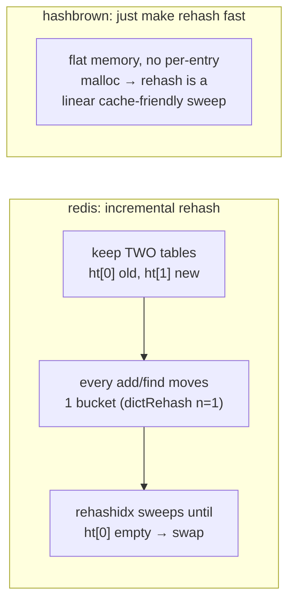

# Topic 2 — In-Memory Structures: Hash Tables, Skip Lists, Tries

> Redis's dict, RocksDB's memtable, Rust's HashMap — the workhorses of every
> in-memory database. This topic is where topic 0's cache lessons become design
> rules: every structure here is a different answer to "how do I avoid DRAM misses?"

## Outcomes

By the end you can:
1. Explain open addressing vs chaining in terms of cache lines, not textbook O(1).
2. Describe incremental rehashing (redis) and SIMD group probing (SwissTable) from
   memory, and say *which latency problem each one solves*.
3. Explain why LSM memtables use skip lists instead of hash tables or B-trees.
4. Implement a skip list and an incremental-rehash table, and measure yours honestly
   against hashbrown / crossbeam-skiplist.

---

## 1. Hash tables — the two families and their cache stories

```
chaining (classic, redis dict):        open addressing (SwissTable/hashbrown):

 buckets   entries (malloc'd)           control bytes      slots (inline)
 ┌───┐    ┌──────┐   ┌──────┐          ┌─┬─┬─┬─┬─┬─┬─┬─┐  ┌────┬────┬────┐
 │ ●─┼───►│k,v,●─┼──►│k,v,∅ │          │h│h│E│h│D│h│E│h│  │ kv │ kv │ kv │…
 ├───┤    └──────┘   └──────┘          └─┴─┴─┴─┴─┴─┴─┴─┘  └────┴────┴────┘
 │ ∅ │     each hop = pointer chase      1 SIMD load checks 8-16 slots at once
 ├───┤     = dependent cache miss        (16 × 7-bit tags in one NEON/SSE2 cmp)
 │ ●─┼───► ...
 └───┘
```

- **Chaining** (redis `dict`): simple, stable pointers, tolerates high load factors —
  but every collision hop is a dependent DRAM miss (topic 0's pointer-chase lesson).
- **Open addressing** (SwissTable): entries inline, probe by scanning *control bytes*
  — a separate array of 1-byte tags (7-bit hash + empty/deleted markers). One 16-byte
  SIMD compare filters 16 slots; you only touch the (cache-line-sized) slot data on a
  tag match. ~87.5% load factor with almost no probe cost.

**The latency-spike problem:** a plain table doubling at 100M entries stalls *one*
insert for the whole rehash — a giant hiccup in a server's p99.9. Two industrial fixes:



Redis amortizes the spike across operations (reads during rehash check *both* tables);
hashbrown accepts the spike but makes it a memcpy-speed sweep. You will *measure both
strategies* in the experiment — the spike is visible as a max-latency outlier.

## 2. Skip lists — the memtable's structure

A sorted linked list with probabilistic express lanes: node height ~ geometric(p).

```
L3 ──────────────────────────────► 42 ─────────────────────────► ∅
L2 ─────────► 17 ─────────────────► 42 ─────────► 71 ──────────► ∅
L1 ─► 8 ────► 17 ────► 29 ────────► 42 ─► 55 ───► 71 ─► 88 ────► ∅
      search 55: descend when next > target — O(log n) expected
```

Why memtables (RocksDB, tidesdb) use them instead of:
- **hash table** — no ordered iteration; flushing to a *sorted* SST needs sorted data.
- **B-tree** — needs node splits ⇒ complex latching; a skip list insert touches a
  handful of *independent* pointers, so it can be made **lock-free with CAS** per level.
- **the killer feature**: memtables are insert-only until frozen, then flushed.
  No deletes ⇒ no unlink logic ⇒ the lock-free variant stays simple (RocksDB's
  `InlineSkipList` supports concurrent writers with plain CAS loops).

Cache reality check: a skip list is still pointer chasing (topic 0 §2) — each level
step is a dependent miss. It wins on *concurrency + sortedness*, not raw lookup speed;
your benchmark will show hashbrown beating it by 5-10x on point lookups. That's fine —
different RUM position.

## 3. Tries / radix trees — when the key IS the index

```
radix tree (rax), keys "foo", "foobar", "footer":

        [f o o]  ← compressed run (iscompr): one node holds the shared prefix
           │
        (key: "foo")
         ┌─┴──┐
        [b]  [t]
         │    │
       [a r] [e r]   compressed tails
```

- Depth = key length, not log n; no hashing, no comparisons — branch on bytes.
- Redis's `rax` packs child bytes + unaligned pointers into one flexible array —
  a node is one cache line for small fanouts.
- **ART** (the paper) adds adaptive node sizes (Node4/16/48/256) so fanout adapts to
  density — Node16 is probed with SIMD like SwissTable. Used by DuckDB, HyPer for
  indexes. The graph-adjacent uses: prefix scans, IP routing, inverted-index terms
  (topic 23).

## 4. Cache-conscious layout — the recurring trick

Three structures in this topic all use the same move: **separate the "filter" data
from the payload so probing touches dense, small memory**:

| Structure | Dense filter | Payload touched only on match |
|-----------|-------------|-------------------------------|
| SwissTable | 1-byte control tags | inline kv slots |
| ART Node16 | 16-byte key array | child pointers |
| RocksDB skiplist | tower before node | key inline after node |

This is the topic 0 flamegraph lesson generalized: SipHash was 21% of lookup cost;
control-byte designs make the *other* 79% (memory stalls) smaller too.

## 5. Code reading (4–6 h)

- **redis `dict.c`** — the incremental rehash machine.
  → guided walkthrough: [`reading-redis-dict.md`](reading-redis-dict.md)
- **redis `t_zset.c`** — the skiplist behind sorted sets (spans + rank queries).
  → guided walkthrough: [`reading-redis-skiplist.md`](reading-redis-skiplist.md)
- **hashbrown** — SwissTable in Rust: control bytes, NEON group probing.
  → guided walkthrough: [`reading-hashbrown.md`](reading-hashbrown.md)
- **RocksDB `memtable/inlineskiplist.h`** — lock-free concurrent skiplist.
  → guided walkthrough: [`reading-rocksdb-memtable.md`](reading-rocksdb-memtable.md)
- **redis `rax.c`** — compressed radix tree (skim).
  → guided walkthrough: [`reading-redis-rax.md`](reading-redis-rax.md)

## 6. Papers / talks (3–4 h)

- Leis et al., "The Adaptive Radix Tree: ARTful Indexing for Main-Memory Databases"
  (ICDE 2013).
  → reading guide: [`reading-art-paper.md`](reading-art-paper.md)
- Matt Kulukundis, "Designing a Fast, Efficient, Cache-friendly Hash Table, Step by
  Step" (CppCon 2017 — the SwissTable talk).
  → watching guide: [`reading-swisstable-talk.md`](reading-swisstable-talk.md)

## 7. Experiments (in `experiments/`)

Implement (this is the topic's *build* work — the scaffold compiles with `todo!()`):

1. **`src/skiplist.rs`** — single-threaded skip list (insert, get, ordered iter).
2. **`src/incremental_map.rs`** — two-table incremental-rehash hash map, redis-style
   (migrate ≤ N buckets per operation).

Then bench (`benches/structures.rs`, harness provided):

- **point lookups + inserts** vs `hashbrown::HashMap`, `std::BTreeMap`,
  `crossbeam_skiplist::SkipMap`, sizes 1e3 → 1e7 (Zipfian probes, seed fixed).
- **`rehash_spike`** — the headline experiment: insert 10M keys one by one into (a)
  hashbrown and (b) your incremental map, recording **per-insert latency max/p99.9**
  (HdrHistogram, not criterion — this is a tail-latency question, topic 0 rules).
  Expect hashbrown to show doubling spikes; yours should flatten them.
- **ordered scan** — your skiplist vs BTreeMap iteration throughput (the memtable
  flush path in miniature).

## 8. Capstone milestone M2 (in `../../capstone/`)

- [ ] `attribute-store` crate: string pool (interning: str → u32 id, id → str) +
      attribute store keyed by (entity id, attr id) + node/edge ID datablocks.
- [ ] Design first, then compare with the reference's `attribute_store.rs` /
      `string_pool.rs` — same no-peeking rule as M1; write the comparison in notes.
- [ ] Hash policy decision recorded: default SipHash vs FxHash/ahash for internal
      maps — justify with topic 0's flamegraph finding (21% SipHash) + a bench.
- [ ] Wire into the workload generator; criterion smoke bench.

## Done when

Both structures pass their tests, the rehash-spike plot exists (max latency,
incremental vs doubling), benchmark results are explained in `notes.md` in
cache/RUM terms, and M2 is checked off with the reference comparison written.
