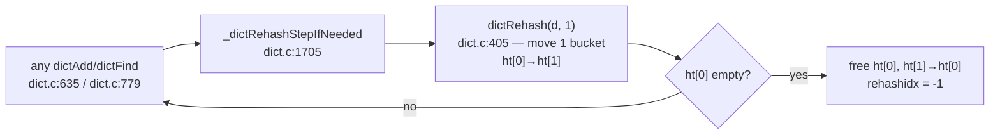

# Reading redis `dict.c` — the incremental rehash machine

Files: `~/repos/redis/src/dict.c`, `src/dict.h`. Line numbers from the local clone.

The problem this file solves: a hash table serving 100K ops/s cannot stop the world
to rehash 100M entries. Redis's answer: keep **two tables** and migrate one bucket at
a time, piggybacked on normal operations.

## 1. The two-table struct

`dict.h:143–159` — the whole design in one struct:

```c
struct dict {
    dictType *type;
    void **ht_table[2];        // ht[0] = old, ht[1] = new (during rehash)
    unsigned long ht_used[2];
    long rehashidx;            // -1 = not rehashing; else next bucket to migrate
    int16_t pauserehash;
    signed char ht_size_exp[2]; // sizes as exponents: size = 1 << exp
};
```



## 2. `dictRehash` — dict.c:405

Read the whole function (~50 lines):
- `empty_visits = n*10` (dict.c:406) — the cap on *empty* buckets visited per step.
  Question: why is this needed? (A sparse old table would otherwise make one "step"
  scan unboundedly far — the amortization guarantee would silently break.)
- Each migrated bucket's chain is walked and every entry re-hashed into ht[1]
  (dict.c:420–431). Note: entries move one *bucket* at a time, not one entry.

## 3. Who pays the rehash tax

- `dictAddRaw` — dict.c:635; `dictFind` — dict.c:779; `dictAddOrFind` — dict.c:1742.
  Every read and write does one step. During rehash, lookups must check **both**
  tables (new keys go only to ht[1]; the key you want may be in either).
- Cost model: rehash O(n) total, amortized O(1) per op, worst per-op ≈ one bucket
  chain + 10 empty visits. This is the design you'll replicate in the experiment.

## 4. Resize policy — dict.c:1638

- Grow at load factor 1.0 (`ht_used >= size`) when resizing is enabled;
  *forced* grow at `dict_force_resize_ratio` even when disabled (dict.c:1655 —
  resizing gets disabled during fork/BGSAVE to avoid COW page storms — a
  durability-meets-data-structure interaction worth pausing on).

## 5. `dictScan` — the reverse-binary trick (dict.c:1518)

How do you iterate a table that may *rehash under you* without missing or endlessly
duplicating keys? `dictScan` increments the cursor in **reversed bit order**
(dict.c:1579–1615). Read the long comment above it — one of the great comments in
open source. The property: buckets already visited at size 2^n map onto
already-visited buckets at size 2^(n+1). Guarantee: every key present for the whole
scan is returned ≥ once (duplicates possible, misses not).

## 6. Contrast: valkey's libvalkey client dict

`~/repos/valkey/deps/libvalkey/src/dict.c` — a *single-table*, full-rehash dict
(dict.c:103–150): no rehashidx, no two-table dance. Fine for a client's small maps;
unacceptable for a server's keyspace. Same structure, different RUM position —
latency requirements are part of the workload.

## Questions to answer in notes.md

1. During rehash, `dictAddRaw` inserts only into ht[1]. Why is inserting into ht[0]
   a correctness bug, not just a wasted move?
2. What does `pauserehash` exist for? (Hint: safe iterators.)
3. Redis caps `empty_visits` at 10n. What tail-latency guarantee does that give one
   operation, in buckets touched?

## Done when

You can implement the two-table scheme from memory — you'll do exactly that in this
topic's experiment.
