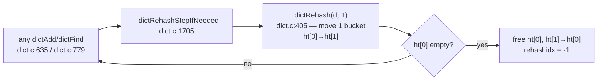

# redis dict: rehashing 100M keys without stopping the world

A hash table serving 100K ops/s cannot stop the world to rehash 100M entries
— the resulting p99.9 spike would be a service outage. This chapter walks
redis's answer, the topic's first industrial latency fix: keep **two tables**
and migrate one bucket at a time, piggybacked on normal operations. Before
opening `dict.c`, it builds the machine step by step — what a chained table
is, why it must resize, why the naive resize is an outage, and how the
two-table dance fixes it — then hands you the line anchors to watch each
piece in the source. It is also the design you'll replicate in this topic's
experiment.

## The problem in one sentence

Doubling a hash table is O(n) work done inside *one* insert — at 100M entries
and ~100 ns per entry moved, that single insert takes **~10 seconds** while
every other client waits.

## The concepts, step by step

### Step 1 — a chained hash table: buckets of linked lists

A hash table stores key→value pairs so that lookup costs ~constant time: run
the key through a **hash function** (a function mapping any key to a
well-scrambled fixed-size integer), keep the low bits as an index into an
array of **buckets**, and put the entry there. Two keys landing in the same
bucket is a **collision**; **chaining** resolves it by making each bucket a
linked list of entries:

```
 buckets            entries (each malloc'd separately)
 ┌───┐
 │ ●─┼───► [k,v,next ●]───► [k,v,next ∅]     ← a 2-long chain
 ├───┤
 │ ∅ │                                        ← empty bucket
 ├───┤
 │ ●─┼───► [k,v,next ∅]
 └───┘
 lookup = hash key → pick bucket → walk the chain comparing keys
```

The cache cost (topic 0): every hop down a chain is a **dependent load** —
the next address comes from the previous node — so each hop is a potential
~100 ns DRAM miss that nothing can prefetch. Chains must stay short.

### Step 2 — load factor: why the table must grow

The **load factor** is entries ÷ buckets. With a decent hash function, the
average chain length ≈ the load factor, so at load factor 1.0 a lookup walks
~1–2 nodes; at 10.0 it walks ~10 — ten dependent misses, ~1 µs per lookup.
The only fix is more buckets: allocate a bigger array (redis doubles: sizes
are powers of two, stored as exponents) and move every entry to its new
bucket. Moving is mandatory because the bucket index is `hash & (size − 1)`
— change the size and half the entries belong somewhere else. That move is
the **rehash**.

### Step 3 — the stop-the-world rehash is a latency outage

The textbook rehash happens inside whichever insert crosses the threshold:
that one operation allocates the new array and moves all n entries before
returning. Almost every insert costs ~100 ns; one insert costs ~10 s at 100M
entries. Throughput barely notices (the O(n) is amortized); **tail latency**
(the slowest percentiles — p99.9, max — the numbers a server promises its
clients) is destroyed. A redis instance frozen for 10 seconds has failed
every health check and dropped every client. The fix cannot be "rehash
faster"; it must be "never do all the work in one operation."

### Step 4 — the fix: two tables and a migration cursor

Redis keeps **both** the old and new bucket arrays alive during the resize
and migrates gradually. `dict.h:143–159` — the whole design in one struct:

```c
struct dict {
    dictType *type;
    void **ht_table[2];        // ht[0] = old, ht[1] = new (during rehash)
    unsigned long ht_used[2];
    long rehashidx;            // -1 = not rehashing; else next bucket to migrate
    int16_t pauserehash;
    signed char ht_size_exp[2]; // sizes as exponents: size = 1 << exp
};
```

`rehashidx` is a cursor sweeping ht[0] from bucket 0 upward: everything below
it has already moved to ht[1], everything above hasn't. Every normal
operation nudges the cursor forward one bucket:



The O(n) rehash still happens — but as n tiny installments, each attached to
an operation that was paying a hash-table visit anyway.

### Step 5 — one migration step, and why its work is bounded

A step moves one bucket: walk its chain, re-hash every entry into ht[1]
(entries move a *bucket* at a time, not one entry). The subtle hazard is a
**sparse** old table — if most buckets are empty, "move one bucket" could
scan thousands of empty slots looking for a non-empty one, silently breaking
the bounded-work-per-operation guarantee. Redis caps that scan at 10 empty
buckets per requested bucket (`empty_visits`, dict.c:406). The whole machine,
distilled:

```rust
fn rehash_step(d: &mut Dict, mut buckets: usize) {
    let mut empty_visits = buckets * 10;         // cap the sparse-table scan
    while buckets > 0 && d.used[0] > 0 {
        while d.ht[0].bucket(d.rehashidx).is_empty() {
            d.rehashidx += 1;
            empty_visits -= 1;
            if empty_visits == 0 { return; }     // bounded work per op — the point
        }
        for entry in d.ht[0].take_bucket(d.rehashidx) {
            let idx = entry.hash & d.mask[1];    // re-hash into the NEW table only
            d.ht[1].push_bucket(idx, entry);
        }
        d.rehashidx += 1;
        buckets -= 1;
    }
    if d.used[0] == 0 { d.swap_tables(); d.rehashidx = -1; }
}
// every dictAdd/dictFind calls rehash_step(d, 1) — and during the migration,
// every lookup must check BOTH tables
```

Worst case per operation: one bucket chain moved + 10 empty visits. That is
the tail-latency guarantee, in buckets.

### Step 6 — correctness during the migration: who pays the tax

While `rehashidx != -1` the key you want may legitimately be in either table,
so **every lookup checks both** (old first, then new) — the read tax. Writes
follow one rule: **new keys go only to ht[1]**. Inserting into ht[0] would be
a correctness bug, not just waste — if the entry lands in a bucket the cursor
has already passed, it will never be migrated and vanishes when ht[0] is
freed. When ht[0] empties, it is freed, ht[1] becomes ht[0], and the dict is
back to single-table operation. Cost model: rehash O(n) total, amortized O(1)
per op, and no operation ever stalls for more than one chain + 10 empty
visits.

### Step 7 — the resize policy, and a durability interaction

Growth triggers at load factor 1.0 (`ht_used >= size`, dict.c:1638) when
resizing is enabled. The interesting wrinkle: redis *disables* resizing
during fork-based persistence (BGSAVE), because a fork shares memory pages
copy-on-write (parent and child share physical pages until one writes; a
write copies the whole page) — and a rehash touches every entry, forcing a
copy storm of nearly the entire dataset. But an un-resizable table under
write load degrades (Step 2), so a *forced* grow still fires at
`dict_force_resize_ratio` (dict.c:1655). A data-structure knob tuned by a
durability mechanism — worth pausing on.

### Step 8 — iterating a table that rehashes under you: dictScan

The last piece: SCAN must iterate the keyspace across many calls, while
buckets migrate and the table may grow between calls. `dictScan`
(dict.c:1518) increments its cursor in **reversed bit order**
(dict.c:1579–1615). The property that makes it work: because bucket index is
the hash's low bits, the entries of bucket `b` at size 2^n split across
buckets `b` and `b + 2^n` at size 2^(n+1) — and reverse-binary increment
visits those siblings adjacently, so buckets already visited at one size map
onto already-visited buckets at the next. Guarantee: every key present for
the whole scan is returned ≥ once (duplicates possible, misses not). Read
the long comment above the function — one of the great comments in open
source.

## Where each step lives in the code

- **Step 4** — the struct: `dict.h:143–159`; the piggyback hook
  `_dictRehashStepIfNeeded` — dict.c:1705.
- **Step 5** — `dictRehash` — dict.c:405; read the whole function (~50
  lines): `empty_visits = n*10` at dict.c:406, the per-bucket chain walk and
  re-hash into ht[1] at dict.c:420–431.
- **Step 6** — the payers: `dictAddRaw` — dict.c:635; `dictFind` —
  dict.c:779; `dictAddOrFind` — dict.c:1742. Verify both rules in the source:
  lookups probe both tables, inserts go to ht[1] only.
- **Step 7** — resize policy — dict.c:1638; forced grow at
  `dict_force_resize_ratio` — dict.c:1655.
- **Step 8** — `dictScan` — dict.c:1518; the reverse-binary increment at
  dict.c:1579–1615, spec'd by the comment above it.
- **Contrast case**: valkey's client-side dict —
  [`~/repos/valkey/deps/libvalkey/src/dict.c`](https://github.com/valkey-io/valkey),
  dict.c:103–150 — a *single-table*, full-rehash dict: no rehashidx, no
  two-table dance. Fine for a client's small maps; unacceptable for a
  server's keyspace. Same structure, different RUM position — latency
  requirements are part of the workload.

## Questions to answer in notes.md

1. During rehash, `dictAddRaw` inserts only into ht[1]. Why is inserting into ht[0]
   a correctness bug, not just a wasted move?
2. What does `pauserehash` exist for? (Hint: safe iterators.)
3. Redis caps `empty_visits` at 10n. What tail-latency guarantee does that give one
   operation, in buckets touched?

## Done when

You can implement the two-table scheme from memory — you'll do exactly that in this
topic's experiment.

## References

**Code**
- [redis](https://github.com/redis/redis) `src/dict.c`, `src/dict.h` —
  line numbers from the local clone; the `dictScan` comment
  (dict.c:1518) is one of the great comments in open source
- [valkey](https://github.com/valkey-io/valkey)
  `deps/libvalkey/src/dict.c` — the single-table, full-rehash contrast
  case
