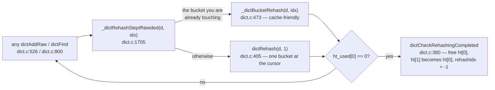

# redis dict: rehashing 100M keys without stopping the world

A hash table serving 100K ops/s cannot stop the world to rehash 100M entries
— the resulting p99.9 spike would be a service outage. This chapter walks
redis's answer, the topic's first industrial latency fix: keep **two tables**
and migrate one bucket at a time, piggybacked on normal operations. Before
opening `dict.c`, it builds the machine step by step — what a chained table
is, why it must resize, why the naive resize is an outage, and how the
two-table dance fixes it — then hands you the line anchors to watch each
piece in the source. It is also the design you'll replicate in this topic's
experiment.

Every anchor below is Redis **8.6.2** (`src/version.h:1`), the commit
`a176d1225` this repo pins, quoted with the line numbers the code occupies in
that version. Re-check any of them yourself with
`tools/pinned-source.py show redis src/dict.c -r 405:434`.

## The problem in one sentence

Doubling a hash table is O(n) work done inside *one* insert — and this repo
has measured what that feels like: hashbrown's `rehash_spike` lane inserts
10 M keys one at a time and reports p50 **42 ns** with a max of **58.4 ms**
([FINDINGS.md](../../FINDINGS.md) row 2), a 1.4-millionfold spread inside a
single operation type, on a table 12× smaller than the 100M-key case redis
has to survive.

## The concepts, step by step

### Step 1 — a chained hash table: buckets of linked lists

> **In:** nothing yet — this step fixes the vocabulary and the cost model
> every later step reasons with.
> **Out:** the structure redis actually implements, and the one number
> (chain length) that decides what a lookup costs. Step 2 turns that number
> into the reason the table must grow.

A hash table stores key→value pairs so that lookup costs ~constant time: run
the key through a **hash function** (a function mapping any key to a
well-scrambled fixed-size integer), keep the low bits as an index into an
array of **buckets** (the fixed-size slot array; each slot holds the head of
whatever landed there), and put the entry there. Two keys landing in the same
bucket is a **collision**; **chaining** resolves it by making each bucket a
linked list of entries:

```
 buckets            entries (each malloc'd separately)
 ┌───┐
 │ ●─┼───► [k,v,next ●]───► [k,v,next ∅]     ← a 2-long chain
 ├───┤
 │ ∅ │                                        ← empty bucket
 ├───┤
 │ ●─┼───► [k,v,next ∅]
 └───┘
 lookup = hash key → pick bucket → walk the chain comparing keys
```

The cache cost (topic 0): every hop down a chain is a **dependent load** —
the address of the next node is only known once the current node has arrived,
so nothing can prefetch it and nothing can overlap two hops. Topic 0's
`cache_ladder` measured that ladder at ~1 ns (L1) / ~5 ns (L2) / ~100 ns
(DRAM) on this machine ([FINDINGS.md](../../FINDINGS.md) row 0), so a chain
hop that misses to DRAM costs ~100 ns and a chain of three costs ~300 ns that
no amount of instruction-level parallelism can hide. Chains must stay short.

### Step 2 — load factor: why the table must grow

> **In:** the chained table from Step 1.
> **Out:** the growth trigger (`ht_used[0] >= size`), and the arithmetic that
> says what a lookup costs at each load factor. Step 3 prices the growth
> itself.

The **load factor** — written α — is entries ÷ buckets: α = n/m for n entries
in m buckets. With a hash function that spreads keys evenly, the expected
number of entries examined by a *successful* lookup in a chained table is

```
E[entries examined] = 1 + α/2

  symbols:  α = n/m, the load factor
            n = entries stored          m = buckets allocated
  reading:  you always examine the one you find (the 1), plus on average
            half of the others sharing its bucket (α/2)
```

Worked on redis's two thresholds, with the ~100 ns dependent-miss cost from
Step 1 and one extra miss for the bucket array itself:

```
α = 1.0   (the normal grow trigger, dict.c:1653)
    entries examined = 1 + 1.0/2 = 1.5
    misses           = 1 (bucket array) + 1.5 (chain) = 2.5
    cold cost        = 2.5 × 100 ns = 250 ns

α = 4.0   (dict_force_resize_ratio, dict.c:45 — the ceiling redis tolerates
           while a fork child is alive, Step 7)
    entries examined = 1 + 4.0/2 = 3.0
    misses           = 1 + 3.0 = 4.0
    cold cost        = 4.0 × 100 ns = 400 ns

α = 10.0  (an un-resizable table left to degrade)
    entries examined = 1 + 5.0 = 6.0
    misses           = 7.0        cold cost = 700 ns
```

So the penalty is linear in α, not catastrophic — chaining degrades
gracefully, which is exactly why redis can afford to let α reach 4 during a
fork. But 700 ns against 250 ns is still a 2.8× lookup regression, and the
only fix is more buckets: allocate a bigger array (redis doubles — sizes are
powers of two, stored as *exponents* in `ht_size_exp`, so "size" is
`1 << exp`) and move every entry to its new bucket. Moving is mandatory
because the bucket index is `hash & (size − 1)`: change the size and half the
entries belong somewhere else. That move is the **rehash**.

### Step 3 — the stop-the-world rehash is a latency outage

> **In:** the obligation to move all n entries, from Step 2.
> **Out:** the cost of doing it inside one operation, in seconds, on two
> different per-entry assumptions — the number Step 4's design exists to
> avoid.

The textbook rehash happens inside whichever insert crosses the threshold:
that one operation allocates the new array and moves all n entries before
returning. **Tail latency** — the slowest percentiles, p99.9 and max, the
numbers a server actually promises its clients — is what this destroys, while
throughput barely notices, because the O(n) is amortized over the n inserts
that preceded it.

Put a number on it. This repo's `rehash_spike` lane gives a *measured*
per-entry cost for the friendliest possible case — hashbrown's flat,
malloc-free array, swept linearly. Assume the 58.4 ms maximum
([FINDINGS.md](../../FINDINGS.md) row 2, eighth decile) is the doubling that
happens when the table crosses 2²³ = 8,388,608 buckets, which at hashbrown's
7/8 load rule holds 7,340,032 live entries when it fires:

```
measured spike           58.4 ms = 58,400,000 ns
entries moved            2²³ × 7/8 = 7,340,032
per entry                58,400,000 / 7,340,032 = 7.96 ns

redis's dict at 100M entries, same 7.96 ns/entry (optimistic — this assumes
chained nodes sweep as cheaply as a flat array, which they do not):
                         100,000,000 × 7.96 ns  = 0.796 s

redis's dict at 100M entries, one dependent DRAM miss per chained node
(Step 1's ~100 ns, the honest number for malloc'd chain nodes):
                         100,000,000 × 100 ns   = 10.0 s
```

Both are outages. Almost every insert costs ~100 ns; this one costs between
0.8 and 10 seconds. A redis instance frozen for even the optimistic 0.8 s has
blown through every sane health-check timeout; at 10 s it has dropped every
client. The fix cannot be "rehash faster" — a 12× speedup still leaves an
0.8 s stall. It must be "never do all the work in one operation."

### Step 4 — the fix: two tables and a migration cursor

> **In:** the outage from Step 3, and the load-factor trigger from Step 2.
> **Out:** the five fields of `struct dict` that make a half-migrated table a
> legal state — the state Steps 5 and 6 operate on.

Redis keeps **both** the old and new bucket arrays alive during the resize
and migrates gradually. The whole design is visible in one struct:

```c
// src/dict.h — struct dict, 143-159 (the whole design; every field matters)
   143  struct dict {
   144      dictType *type;
   145
   146      dictEntry **ht_table[2];
   147      unsigned long ht_used[2];
   148
   149      long rehashidx; /* rehashing not in progress if rehashidx == -1 */
   150
   151      /* Note: pauserehash is a full unsigned so iterator increments
   152       * don't perform RMW on the same storage unit as other bitfields. */
   153      unsigned pauserehash; /* If >0 rehashing is paused */
   154
   155      /* Keep small vars at end for optimal (minimal) struct padding */
   156      signed char ht_size_exp[2]; /* exponent of size. (size = 1<<exp) */
   157      int16_t pauseAutoResize;  /* If >0 automatic resizing is disallowed (<0 indicates coding error) */
   158      void *metadata[];
   159  };
```

The line to look at is 149. `rehashidx` is a cursor sweeping ht[0] from
bucket 0 upward: every bucket *below* it has already moved to ht[1], every
bucket at or above it has not, and `-1` means no migration is in progress at
all. Line 146 is the pair of bucket arrays (ht[0] = old, ht[1] = new during a
rehash), 147 their live counts, 156 their sizes as exponents. Line 153's
`pauserehash` is the "hold still, someone is iterating me" brake (Step 8).

Every normal operation nudges the cursor forward:


```mermaid
flowchart LR
    OP["any dictAddRaw / dictFind<br/>dict.c:526 / dict.c:800"] --> HOOK["_dictRehashStepIfNeeded(d, idx)<br/>dict.c:1705"]
    HOOK -- "the bucket you are<br/>already touching" --> BR["_dictBucketRehash(d, idx)<br/>dict.c:473 — cache-friendly"]
    HOOK -- "otherwise" --> RH["dictRehash(d, 1)<br/>dict.c:405 — one bucket at the cursor"]
    BR --> DONE{"ht_used[0] == 0?"}
    RH --> DONE
    DONE -- yes --> SWAP["dictCheckRehashingCompleted<br/>dict.c:380 — free ht[0],<br/>ht[1] becomes ht[0], rehashidx = -1"]
    DONE -- no --> OP
```

Note the fork at the hook, which the old version of this chapter missed: if
the bucket your operation is *already* going to touch still lives in ht[0],
redis migrates *that* bucket (dict.c:1709-1712) rather than the one under the
cursor, because that memory is about to be in cache anyway. Only when the
visited bucket is already migrated or empty does it fall back to
`dictRehash(d,1)` at the cursor (dict.c:1716).

The O(n) rehash still happens — but as n tiny installments, each attached to
an operation that was paying a hash-table visit anyway.

### Step 5 — one migration step, and why its work is bounded

> **In:** the half-migrated two-table state from Step 4.
> **Out:** a hard bound on the work one operation can be charged, in buckets
> — the tail-latency guarantee that replaces Step 3's 0.8-to-10-second stall.

A step moves one *bucket*: walk its chain, re-hash every entry into ht[1].
The subtle hazard is a **sparse** old table — if most buckets are empty,
"move one bucket" could scan thousands of empty slots looking for a non-empty
one, silently breaking the bounded-work guarantee. Redis caps that scan:

```c
// src/dict.c — dictRehash, 405-434 (the whole bounded-work loop)
   405  int dictRehash(dict *d, int n) {
   406      int empty_visits = n*10; /* Max number of empty buckets to visit. */
   // ... 407-419: the DICT_RESIZE_FORBID / DICT_RESIZE_AVOID gates of Step 7 ...
   420      while(n-- && d->ht_used[0] != 0) {
   // ... 421-423: assert rehashidx is still inside ht[0] ...
   424          while(d->ht_table[0][d->rehashidx] == NULL) {
   425              d->rehashidx++;
   426              if (--empty_visits == 0) return 1;
   427          }
   428          /* Move all the keys in this bucket from the old to the new hash HT */
   429          rehashEntriesInBucketAtIndex(d, d->rehashidx);
   430          d->rehashidx++;
   431      }
   432
   433      return !dictCheckRehashingCompleted(d);
   434  }
```

Line 426 is the one that carries the guarantee: after ten fruitless bucket
loads the function gives up and returns 1 ("still rehashing"), having done
bounded work. Line 406 sets the budget at `n*10` for a request of n buckets,
so the single-bucket call every operation makes (`dictRehash(d,1)`,
dict.c:469 and dict.c:1716) can touch at most ten empty buckets plus one
chain.

The actual moving is one level down, and it is worth reading because of what
it does *not* do:

```c
// src/dict.c — rehashEntriesInBucketAtIndex, 336-352 and 368-377
   336  static void rehashEntriesInBucketAtIndex(dict *d, uint64_t idx) {
   337      dictEntry *de = d->ht_table[0][idx];
   // ... 338-339: locals ...
   340      while (de) {
   341          nextde = dictGetNext(de);
   342          void *storedKey = dictGetKey(de);
   343          /* Get the index in the new hash table */
   344          if (d->ht_size_exp[1] > d->ht_size_exp[0]) {
   345              const void *key = dictStoredKey2Key(d, storedKey);
   346              h = dictGetHash(d, key) & DICTHT_SIZE_MASK(d->ht_size_exp[1]);
   347          } else {
   348              /* We're shrinking the table. The tables sizes are powers of
   349               * two, so we simply mask the bucket index in the larger table
   350               * to get the bucket index in the smaller table. */
   351              h = idx & DICTHT_SIZE_MASK(d->ht_size_exp[1]);
   352          }
   // ... 353-370: the no_value key-inlining cases; all end at ht_table[1][h] ...
   371          d->ht_table[1][h] = de;
   372          d->ht_used[0]--;
   373          d->ht_used[1]++;
   374          de = nextde;
   375      }
   376      d->ht_table[0][idx] = NULL;
```

Line 371 is the move: the entry is *relinked*, not copied — chaining's one
structural gift, since the payload never changes address. Note the asymmetry
at 344-352: growing re-hashes the key (346, and that recomputation is why the
per-entry cost is nearer Step 3's 100 ns than its 8 ns), while **shrinking
just masks the old index** (351), because a smaller power-of-two mask is a
prefix of a larger one. Line 376 empties the source bucket, which is what
makes the cursor's "everything below me has moved" invariant true.

The machine, distilled to the shape you will re-implement:

```rust
// ILLUSTRATION — not quoted from redis. The real loop is dict.c:405-434 and
// the per-bucket move is dict.c:336-377; this is the same algorithm with the
// entry-encoding cases (dict.c:353-370) removed.
fn rehash_step(d: &mut Dict, mut buckets: usize) {
    let mut empty_visits = buckets * 10;         // dict.c:406
    while buckets > 0 && d.used[0] > 0 {
        while d.ht[0].bucket(d.rehashidx).is_empty() {
            d.rehashidx += 1;
            empty_visits -= 1;
            if empty_visits == 0 { return; }     // dict.c:426 — the bound
        }
        for entry in d.ht[0].take_bucket(d.rehashidx) {
            let idx = entry.hash & d.mask[1];    // dict.c:346 — NEW table only
            d.ht[1].push_bucket(idx, entry);
        }
        d.rehashidx += 1;
        buckets -= 1;
    }
    if d.used[0] == 0 { d.swap_tables(); d.rehashidx = -1; }   // dict.c:380-394
}
```

Now price the guarantee against Step 3's stall, at α = 1.0 (so a non-empty
chain holds ~1.5 entries, Step 2):

```
worst case for one operation = 10 empty bucket loads + 1 chain of ~1.5 entries
                             ≈ 11.5 dependent misses × 100 ns ≈ 1.15 µs

against the one-shot rehash's measured 58.4 ms:
                             58,400,000 ns / 1,150 ns ≈ 50,800× smaller
```

The bill does not disappear, it is *spread*. Migrating a 2²³-bucket table one
bucket per operation needs 8,388,608 operations to finish; at the 100K ops/s
of the opening sentence that is 8,388,608 / 100,000 = **83.9 seconds** during
which the dict is in the two-table state and every lookup pays Step 6's tax.
That is the trade: a 58 ms cliff becomes 84 seconds of a slightly slower
table.

### Step 6 — correctness during the migration: who pays the tax

> **In:** the partially migrated table Step 5 leaves behind, with `rehashidx`
> somewhere in the middle of ht[0].
> **Out:** the two rules — where reads look, where writes land — that make
> that state safe, and what each costs.

**Rule 1: a read may have to check both tables.** The key you want could
legitimately be in either. The lookup path is `dictFindLinkInternal`, and the
loop is more careful than "check ht[0], then ht[1]":

```c
// src/dict.c — inside dictFindLinkInternal, 778-796
   778      /* Rehash the hash table if needed */
   779      _dictRehashStepIfNeeded(d,idx);
   780
   781      int tables = (dictIsRehashing(d)) ? 2 : 1;
   782      for (table = 0; table < tables; table++) {
   783          if (table == 0 && (long)idx < d->rehashidx) continue;
   784          idx = hash & DICTHT_SIZE_MASK(d->ht_size_exp[table]);
   785
   786          link = &(d->ht_table[table][idx]);
   787          if (bucket) *bucket = link;
   788          while(link && *link) {
   // ... 789-794: compare the stored key, walk to the next link ...
   795          }
   796      }
```

Line 783 is the line to focus on, and it corrects the simple story: ht[0] is
skipped entirely when the target bucket sits *below* the cursor, because
everything below the cursor has already been migrated (Step 5's invariant, at
dict.c:376). So the read tax is not "always two lookups" — it is two lookups
only for keys whose ht[0] bucket the cursor has not yet reached, and it
shrinks to zero as the migration advances. Line 781 is the other half: when
`rehashidx == -1` the loop runs once and there is no tax at all.

**Rule 2: a new key goes only into ht[1].** This is not an optimization, it
is a correctness requirement:

```c
// src/dict.c — inside dictInsertKeyAtLink, 545-549
   545      /* If rehashing is ongoing, we insert in table 1, otherwise in table 0.
   546       * Assert that the provided bucket is the right table. */
   547      int htidx = dictIsRehashing(d) ? 1 : 0;
   548      assert(bucket >= &d->ht_table[htidx][0] &&
   549             bucket <= &d->ht_table[htidx][DICTHT_SIZE_MASK(d->ht_size_exp[htidx])]);
```

Line 547 decides it, and `dictFindLinkForInsert` hands over a bucket in the
same table (dict.c:1766). Why a bug and not merely waste: if a new entry
landed in an ht[0] bucket the cursor had already passed, nothing would ever
migrate it — `rehashidx` only moves forward — and `dictCheckRehashingCompleted`
frees ht[0] wholesale at dict.c:386 the moment `ht_used[0]` hits zero. The
key would be silently lost. (`ht_used[0]` would also never be decremented for
it, so in practice the dict would instead never *finish* rehashing; either
way the invariant "below the cursor, ht[0] is empty forever" is what the rule
protects.)

When ht[0] empties, `dictCheckRehashingCompleted` (dict.c:380-394) frees it,
copies ht[1] into slot 0, and sets `rehashidx = -1`. Cost model for the whole
scheme: O(n) total rehash work, amortized O(1) per operation, and no single
operation ever stalls for more than one chain plus ten empty visits.

### Step 7 — the resize policy, and a durability interaction

> **In:** the load-factor trigger from Step 2 and the migration machine from
> Steps 4-6.
> **Out:** the three-state global policy that decides *when* a migration is
> allowed to start at all — and the reason a persistence mechanism gets a
> vote on a data-structure parameter.

The growth decision lives in one function:

```c
// src/dict.c — inside dictExpandIfNeeded, 1648-1661
   1648      /* If we reached the 1:1 ratio, and we are allowed to resize the hash
   1649       * table (global setting) or we should avoid it but the ratio between
   1650       * elements/buckets is over the "safe" threshold, we resize doubling
   1651       * the number of buckets. */
   1652      if ((dict_can_resize == DICT_RESIZE_ENABLE &&
   1653           d->ht_used[0] >= DICTHT_SIZE(d->ht_size_exp[0])) ||
   1654          (dict_can_resize != DICT_RESIZE_FORBID &&
   1655           d->ht_used[0] >= dict_force_resize_ratio * DICTHT_SIZE(d->ht_size_exp[0])))
   1656      {
   1657          if (dictTypeResizeAllowed(d, d->ht_used[0] + 1))
   1658              dictExpand(d, d->ht_used[0] + 1);
   1659          return DICT_OK;
   1660      }
   1661      return DICT_ERR;
```

Line 1653 is the normal trigger: α ≥ 1.0. Line 1655 is the escape hatch:
even when resizing is discouraged, α ≥ `dict_force_resize_ratio` (= 4,
dict.c:45) forces it anyway — Step 2's arithmetic says that is a 400 ns
lookup against 250 ns, a degradation redis will tolerate but not exceed.

What sets `dict_can_resize` is the interesting part, and it is not in dict.c
at all:

```c
// src/server.c — updateDictResizePolicy, 778-785
   778  void updateDictResizePolicy(void) {
   779      if (server.in_fork_child != CHILD_TYPE_NONE)
   780          dictSetResizeEnabled(DICT_RESIZE_FORBID);
   781      else if (hasActiveChildProcess())
   782          dictSetResizeEnabled(DICT_RESIZE_AVOID);
   783      else
   784          dictSetResizeEnabled(DICT_RESIZE_ENABLE);
   785  }
```

Three states, not two — the old version of this chapter said redis "disables
resizing during BGSAVE", and line 782 says otherwise. **Copy-on-write** is
the mechanism behind it: `fork()` gives the child a logical copy of the
parent's memory by sharing the physical pages read-only, and the kernel
copies a page only when one side writes to it. A rehash writes to nearly
every page holding entries, so a resize during a background save can force a
copy of most of the dataset — the parent's RSS balloons toward 2× while the
child writes an RDB file.

So: line 780, inside the forked child itself, resizing is **forbidden**
outright (the child is a snapshot; there is nothing to gain). Line 782, in
the *parent* while any child runs, it is **avoided** — meaning the α ≥ 1.0
trigger at 1653 is switched off but the α ≥ 4 force at 1655 stays live, and
`dictRehash` refuses to advance a migration that would not have qualified
under the same rule (dict.c:413-418). A durability mechanism tuning a
data-structure knob, with a bounded degradation (Step 2: 250 ns → 400 ns)
chosen as the price. Worth pausing on.

### Step 8 — iterating a table that rehashes under you: dictScan

> **In:** everything above — a table that may be half-migrated *and* may
> change size between two calls of the iterator.
> **Out:** the reverse-binary cursor and the exact guarantee it buys
> (every key present throughout is returned at least once; duplicates are
> possible).

SCAN must iterate the keyspace across many separate calls, holding no state
between them but a single integer cursor, while buckets migrate and the table
may double or halve in between. Redis's answer, designed by Pieter Noordhuis
and explained in the comment at dict.c:1434-1517, is to increment the cursor
in **reversed bit order** — reverse the bits, add one, reverse back:

```c
// src/dict.c — inside dictScanDefrag, the non-rehashing branch, 1574-1587
   1574      if (!dictIsRehashing(d)) {
   1575          htidx0 = 0;
   1576          m0 = DICTHT_SIZE_MASK(d->ht_size_exp[htidx0]);
   1577          dictScanDefragBucket(d, fn, defragfns, privdata, &d->ht_table[htidx0][v & m0]);
   1578
   1579          /* Set unmasked bits so incrementing the reversed cursor
   1580           * operates on the masked bits */
   1581          v |= ~m0;
   1582
   1583          /* Increment the reverse cursor */
   1584          v = rev(v);
   1585          v++;
   1586          v = rev(v);
   1587
```

Lines 1584-1586 are the whole trick (`rev` itself is dict.c:1424-1432). The
property that makes it work: because a bucket index is the hash's *low* bits,
the entries of bucket `b` at size 2ⁿ split across exactly buckets `b` and
`b + 2ⁿ` at size 2ⁿ⁺¹ — and a reverse-binary increment visits `b` and
`b + 2ⁿ` adjacently, so a bucket already visited at one size maps onto
already-visited buckets at the next.

Work the four-bit case the comment describes (mask 1111, size 16), counting
in reverse-binary order:

```
normal counting:   0000 0001 0010 0011 0100 …   (low bit varies fastest)
reverse counting:  0000 1000 0100 1100 0010 …   (HIGH bit varies fastest)

grow 16 → 64 after visiting 1100:
  the keys of bucket 1100 are now in 001100, 011100, 101100, 111100
  reverse counting from 1100 never re-emits a cursor ending in 1100,
  because those two low bits are the LAST ones it will vary
  ⇒ already-scanned work is never repeated, and nothing is skipped
```

The rehashing branch (dict.c:1588-1615) reduces the two-table case to the
one-table case: scan the smaller table's bucket, then every bucket of the
larger table that is an expansion of it (1605-1615). And line 1572 explains
`pauserehash`'s other job — the scan pauses rehashing across the callback, in
case the callback itself calls `dictFind` and moves buckets underneath the
iterator.

Guarantee, stated at dict.c:1443-1445: every element present in the dict for
the whole scan is returned **at least once**; some may be returned more than
once. Read the full comment (1434-1517) — one of the great comments in open
source.

## Where each step lives in the code

`src/dict.c` is 2340 lines at `a176d1225`; you need about 400 of them.

| Lines | What | Step |
|-------|------|------|
| `dict.h:143-159` | `struct dict` — two tables, `rehashidx`, `pauserehash`, sizes as exponents | 4 |
| `dict.h:193-194` | `DICT_HT_INITIAL_EXP` = 2, so a fresh table has 4 buckets | 2 |
| `dict.h:214-216` | `dictPauseRehashing` / `dictResumeRehashing` / `dictIsRehashingPaused` | 8 |
| `dict.c:44-45` | `dict_can_resize`, `dict_force_resize_ratio` = 4 | 7 |
| `dict.c:336-377` | `rehashEntriesInBucketAtIndex` — the actual chain relink; re-hash on grow (346), mask on shrink (351) | 5 |
| `dict.c:380-394` | `dictCheckRehashingCompleted` — free ht[0], promote ht[1], `rehashidx = -1` | 5, 6 |
| `dict.c:405-434` | `dictRehash` — the bounded loop; `empty_visits = n*10` (406), the bail-out (426) | 5 |
| `dict.c:446-458` | `dictRehashMicroseconds` — the *other* client, a time-budgeted rehash from the server cron | 5 |
| `dict.c:468-470` | `_dictRehashStep` — `dictRehash(d,1)`, skipped while paused | 4 |
| `dict.c:473-490` | `_dictBucketRehash` — migrate the bucket you are already touching | 4 |
| `dict.c:526-536` | `dictAddRaw` — the insert path (was cited as 635 here; it is 526) | 6 |
| `dict.c:542-549` | `dictInsertKeyAtLink` — `htidx = rehashing ? 1 : 0`, the write rule | 6 |
| `dict.c:613-617` | `dictAddOrFind` (was cited as 1742; that line is inside `dictFindLinkForInsert`) | 6 |
| `dict.c:761-798` | `dictFindLinkInternal` — the two-table read, and the skip at 783 | 6 |
| `dict.c:800-804` | `dictFind` (was cited as 779) | 6 |
| `dict.c:1149-1157`, `1173-1197` | safe iterators: pause on first `dictNext` (1179), resume on reset (1153) | 8 |
| `dict.c:1424-1432` | `rev()` — the bit-reversal itself | 8 |
| `dict.c:1434-1517` | the `dictScan` comment — read it in full | 8 |
| `dict.c:1518-1524`, `1560-1621` | `dictScan` → `dictScanDefrag`; reverse increments at 1584-1586 and 1608-1612 | 8 |
| `dict.c:1638-1662` | `dictExpandIfNeeded` — α ≥ 1.0 (1653), forced α ≥ 4 (1655) | 7 |
| `dict.c:1705-1718` | `_dictRehashStepIfNeeded` — the piggyback hook and its bucket/cursor fork | 4 |
| `dict.c:1733-1768` | `dictFindLinkForInsert` — same two-table walk, returns an ht[1] bucket (1766) | 6 |
| `server.c:778-785` | `updateDictResizePolicy` — FORBID / AVOID / ENABLE | 7 |

Suggested route: the struct (`dict.h:143`) → `dictRehash` (405) →
`rehashEntriesInBucketAtIndex` (336) → the hook (1705) → the two payers,
`dictFindLinkInternal` (761) and `dictInsertKeyAtLink` (542) → the policy
(1638, then `server.c:778`) → `dictScan`'s comment (1434) last, on its own.

**Contrast case**: valkey's *client-side* dict at
`deps/libvalkey/src/dict.c:103-150` (valkey `8891441ab`) — `dictExpand` there
allocates the new table and moves every entry in one `for` loop (123-143),
asserts the old table is empty (144), frees it (145) and swaps (148). No
`rehashidx`, no second table, no cursor: the entire Step 4 machine is absent.
That is the right call for a client library's small maps and unacceptable for
a server's keyspace — same structure, different RUM position, because latency
requirements are part of the workload.

## Questions to answer in notes.md

1. During rehash, `dictInsertKeyAtLink` (dict.c:547) inserts only into ht[1].
   Why is inserting into ht[0] a correctness bug, not just a wasted move?
   Trace what `dictCheckRehashingCompleted` (dict.c:380-394) would do to that
   entry.
2. What does `pauserehash` exist for? Find its two users (dict.c:1179 and
   dict.c:1572) and say what breaks in each if the brake is removed.
3. Redis caps `empty_visits` at `n*10` (dict.c:406). What tail-latency
   guarantee does that give one operation, in buckets touched — and redo
   Step 5's ~1.15 µs bound for a table that is being *shrunk* rather than
   grown, where chains are longer and empty buckets rarer.
4. Line 783 skips ht[0] when `idx < rehashidx`. Sketch the read tax over the
   life of a migration: what fraction of lookups touch two tables when the
   cursor is 10% / 50% / 90% through ht[0]?
5. `dictRehashMicroseconds` (dict.c:446) rehashes on a *time* budget instead
   of a bucket budget, from the server's cron. Which of the two budgets would
   you give your own implementation, and what does the other one get wrong?

## Takeaway

The two-table dict is a latency structure, not a throughput structure: it
does strictly *more* total work than a stop-the-world rehash (two-table
lookups, a cursor, ten-empty-bucket scans) in exchange for never letting one
operation pay more than a bounded slice of it. That is the shape of almost
every fix in this curriculum — trade mean for max — and you are about to
build it in `experiments/src/incremental_map.rs`.

## Done when

Answer each before unfolding it.

- [ ] You can say what `rehashidx` means, including what `-1` means and what is true of every bucket below it.

  <details><summary>Answer</summary>

  `rehashidx` (dict.h:149) is the index of the next bucket of ht[0] to
  migrate. `-1` means no migration is in progress, which is what
  `dictIsRehashing` tests and what makes the read path a single-table walk
  (dict.c:781).

  The invariant is that every bucket of ht[0] strictly below `rehashidx` is
  empty and will stay empty: `rehashEntriesInBucketAtIndex` sets
  `d->ht_table[0][idx] = NULL` at dict.c:376 after relinking the chain, the
  cursor only ever moves forward (dict.c:425, 430), and new keys are never
  written into ht[0] while rehashing (dict.c:547). That invariant is exactly
  what licenses the read-path shortcut at dict.c:783 — if `idx < rehashidx`,
  looking in ht[0] cannot find anything.

  </details>

- [ ] You can explain why inserting a new key into ht[0] during a migration is a correctness bug rather than a wasted move.

  <details><summary>Answer</summary>

  Because the cursor never goes back. If the new entry lands in an ht[0]
  bucket below `rehashidx`, no future `dictRehash` step will visit that
  bucket — the `while` loop at dict.c:420-431 starts from `d->rehashidx` and
  only increments — so the entry is never moved into ht[1].

  What happens next depends on the bookkeeping. `dictCheckRehashingCompleted`
  (dict.c:380-394) fires when `ht_used[0]` reaches 0 and calls
  `zfree(d->ht_table[0])` at dict.c:386, taking the orphaned entry's bucket
  with it; if the insert also bumped `ht_used[0]`, the counter never reaches 0
  and the dict simply never finishes rehashing, holding both tables forever.
  Either outcome is a bug, which is why dict.c:547 makes the table choice a
  single unconditional expression and dict.c:548-549 asserts the caller handed
  over a bucket from that table.

  </details>

- [ ] You can state the bounded-work guarantee one operation gets, in buckets, and price it against the one-shot rehash this repo measured.

  <details><summary>Answer</summary>

  One operation triggers at most `dictRehash(d,1)`, which is `empty_visits =
  1*10` (dict.c:406) plus one non-empty bucket: **at most ten empty bucket
  loads and one chain**. Line 426 returns as soon as the tenth empty visit is
  spent, so the work is bounded even on a table that is 99.9% empty.

  Priced with topic 0's ~100 ns dependent DRAM miss and a ~1.5-entry chain at
  α = 1.0, that is about 11.5 × 100 ns ≈ 1.15 µs worst case. The one-shot
  alternative was measured in this repo at **58.4 ms**
  ([FINDINGS.md](../../FINDINGS.md) row 2) for a 7.34 M-entry table — about
  50,800× larger, and that was hashbrown's flat array, which sweeps at 7.96 ns
  per entry rather than chasing malloc'd chain nodes.

  </details>

- [ ] You can say what a read costs while a migration is in flight, and why "it always checks both tables" is not quite right.

  <details><summary>Answer</summary>

  `dictFindLinkInternal` sets `tables = 2` only while rehashing
  (dict.c:781), and then line 783 skips ht[0] whenever the key's ht[0] bucket
  index is below `rehashidx`, because Step 5's invariant guarantees that
  bucket is empty. So the tax applies only to keys whose old bucket the cursor
  has not reached yet, and it falls linearly as the cursor advances: roughly
  90% of lookups pay it when the cursor is 10% through, and roughly 10% when
  it is 90% through.

  The cost when it does apply is one extra bucket-array load plus that
  bucket's chain — Step 2's arithmetic makes it about 250 ns rather than
  125 ns for the second probe at α = 1.0. Cheap per operation, and paid for
  the whole 83.9 seconds it takes 100K ops/s to walk a 2²³-bucket table one
  bucket at a time.

  </details>

- [ ] You can explain why a fork for BGSAVE changes the resize policy, and what the parent is still allowed to do.

  <details><summary>Answer</summary>

  `fork()` shares the parent's pages with the child copy-on-write, so a page
  is duplicated only when someone writes it. A rehash relinks nearly every
  entry (dict.c:371) and therefore writes nearly every page holding entries,
  which would force the kernel to copy most of the dataset and roughly double
  resident memory while the child is writing its RDB.

  `updateDictResizePolicy` (server.c:778-785) therefore has three states, not
  two. Inside the forked child, `DICT_RESIZE_FORBID` (780) — no resizing at
  all. In the parent while any child runs, `DICT_RESIZE_AVOID` (782), which
  switches off the α ≥ 1.0 trigger at dict.c:1653 but leaves the forced grow
  at dict.c:1655 live, so a table whose load factor reaches
  `dict_force_resize_ratio` = 4 still expands. `dictRehash` applies the same
  test before advancing an in-flight migration (dict.c:413-418). The bounded
  price of that tolerance is Step 2's arithmetic: 3.0 chain entries examined
  instead of 1.5, roughly 400 ns instead of 250 ns per cold lookup.

  </details>

- [ ] You can implement the two-table scheme from memory — which is exactly what `experiments/src/incremental_map.rs` asks for.

  <details><summary>Answer</summary>

  There is no answer to unfold: the implementation is the exercise. The bar,
  in the order the code needs it — two bucket arrays and a cursor
  (dict.h:143-159); a migration step that moves one bucket and gives up after
  ten empty ones (dict.c:405-434); a read that consults ht[1] and consults
  ht[0] only when the cursor has not passed the key's old bucket
  (dict.c:781-783); a write that lands in ht[1] whenever a migration is in
  flight (dict.c:547); and a completion check that frees the old table,
  promotes the new one and resets the cursor to −1 (dict.c:380-394).

  The measurement that says you got it right is in
  [notes.md](notes.md): hashbrown's row is p50 42 ns / max 58.4 ms. Yours
  should keep the p50 within a few nanoseconds of that and move the max into
  microseconds. If your max is still in milliseconds, the usual cause is a
  step that migrates a *chain* rather than a *bucket*, or an `empty_visits`
  cap that was never wired up.

  </details>

## References

**Code**
- [redis](https://github.com/redis/redis) `src/dict.c` (2340 lines),
  `src/dict.h` (319 lines), `src/server.c` — pinned at Redis 8.6.2 /
  `a176d1225`, version confirmed in `src/version.h:1`.

| File | Lines | What |
|------|-------|------|
| `src/dict.h` | 143-159 | `struct dict` — the two-table state |
| `src/dict.h` | 214-216 | the `pauserehash` macros |
| `src/dict.c` | 45 | `dict_force_resize_ratio = 4` |
| `src/dict.c` | 336-377 | `rehashEntriesInBucketAtIndex` — one bucket moved |
| `src/dict.c` | 380-394 | completion: free ht[0], promote ht[1] |
| `src/dict.c` | 405-434 | `dictRehash` — the bounded step |
| `src/dict.c` | 426 | the `empty_visits` bail-out — the tail-latency guarantee |
| `src/dict.c` | 547 | `htidx = rehashing ? 1 : 0` — the write rule |
| `src/dict.c` | 783 | the read that skips an already-migrated ht[0] bucket |
| `src/dict.c` | 1434-1517 | the `dictScan` design comment |
| `src/dict.c` | 1584-1586 | the reverse-binary cursor increment |
| `src/dict.c` | 1653, 1655 | α ≥ 1.0, and the forced grow at α ≥ 4 |
| `src/dict.c` | 1705-1718 | the piggyback hook, with its bucket/cursor fork |
| `src/server.c` | 778-785 | FORBID / AVOID / ENABLE, decided by fork state |

- [valkey](https://github.com/valkey-io/valkey) (`8891441ab`)
  `deps/libvalkey/src/dict.c:103-150` — the single-table, full-rehash
  contrast case: one loop, every entry, inside one call.

**Measured in this repo**
- [FINDINGS.md](../../FINDINGS.md) row 2 — hashbrown insert p50 42 ns, max
  58.4 ms, the stop-the-world rehash this whole design avoids.
- [FINDINGS.md](../../FINDINGS.md) row 0 — the ~1 / 5 / 100 ns cache ladder
  every cost estimate above is priced with.
- [notes.md](notes.md) — the per-decile maxima, showing the spikes land
  exactly where the table crossed a power of two.
