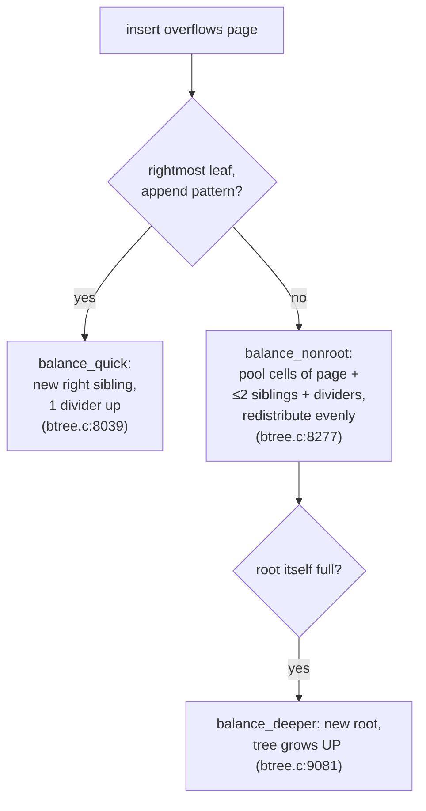

# Topic 3 — B-Tree Internals & Paged Storage

> Pages are how disks think. SQLite's btree.c, turso's Rust re-implementation,
> and LMDB's copy-on-write variant are three answers to the same question:
> how do you keep a sorted map in fixed-size blocks that survive power loss?

## Outcomes

By the end you can:
1. Draw a slotted page from memory: header, cell pointer array, cell content
   area, freeblock chain — and explain why the two regions grow toward each other.
2. Narrate a node split (SQLite's 3-sibling balance) and say why it's ≤3.
3. Explain LMDB's no-WAL commit (COW + double meta page) and its costs.
4. Build a disk B+tree with 4KB slotted pages and bench it honestly vs redb.

---

## 1. The slotted page — one picture to rule the topic

```
 4096-byte page (SQLite/turso format):

 ┌──────────────┬─────────────────┬─────────▼── grows down ──┬──────────────┐
 │ header 8/12B │ cell ptr array  │      free space          │ cell content │
 │ type,frag,   │ [u16,u16,u16..] │                          │ (cells added │
 │ freeblock,   │  sorted by KEY  │   freeblocks chained     │  right→left, │
 │ ncell,cstart │  grows up ▲     │   through here too       │  any order)  │
 └──────────────┴─────────────────┴──────────────────────────┴──────────────┘

 binary search touches ONLY the ptr array (dense) → then one jump to the cell
 delete = remove ptr + add freeblock; insert = find slot (allocateSpace) or defrag
```

The indirection is the whole trick: **cells never move on insert/delete of
others** (pointers do), so binary search stays cheap and deletion is O(1) +
freeblock bookkeeping. This is the dense-filter/fat-payload pattern (topic 2 §4)
on disk: the pointer array is the filter.

Header fields (turso `btree.rs:76–124`, spec in SQLite `btreeInt.h:1–215`):
byte 0 page type; 1–2 first freeblock; 3–4 cell count; 5–6 content-area start;
7 fragmented bytes; 8–11 rightmost child pointer (interior only).

## 2. The four cell types (SQLite family)

| Cell | Format |
|------|--------|
| table interior | left_child u32 ∥ rowid varint |
| table leaf | payload_size varint ∥ rowid varint ∥ payload |
| index interior | left_child u32 ∥ payload_size varint ∥ payload |
| index leaf | payload_size varint ∥ payload |

Payload > `maxLocal` spills to an **overflow chain**: keep
`minLocal + (n − minLocal) % (usable − 4)` bytes local, rest in a linked list of
overflow pages (last 4 local bytes = first overflow page number). The formulas
(`maxLocal = (usable−12)·64/255 − 23`, etc.) look arbitrary — they guarantee
each page holds ≥4 cells so the tree keeps fanout even with fat keys.

## 3. Splits and balancing — where the complexity lives



- `NB = 3` (btree.c:7552): balance pools at most 3 sibling pages. SQLite's
  comment: the right-bias tweak alone made the whole database "about 25% faster"
  — splits are hot.
- Deletion from an interior node: swap with the predecessor from the leaf level,
  then rebalance the leaf (btree.c:9873) — interior deletes reduce to leaf deletes.
- Tree grows **up** (new root), never down — parent pointers stay implicit in
  the cursor stack.

## 4. LMDB — the copy-on-write counterpoint

```
 commit N (writes pages 7',3',root'):          the two meta pages:

     meta0(txn N-2)  meta1(txn N-1)            ┌───────────────────────────┐
          │               │ ◄─ readers          │ commit = write dirty pages │
          ▼               ▼                     │        + fsync             │
        [root]         [root']                  │        + write meta[N%2]   │
        /    \         /    \                   │        + fsync             │
      [3]    [7]     [3']   [7']                │ crash anywhere ⇒ old meta │
              ▲ old pages still valid           │ still valid. NO WAL.      │
                (readers may hold them)         └───────────────────────────┘
```

- Never overwrite: `mdb_page_touch` (mdb.c:3015) copies any clean page before
  the first write in a txn; the whole root-to-leaf path gets new page numbers.
- Commit = flush dirty pages, fsync, write the *other* meta page, fsync
  (mdb_env_write_meta, mdb.c:4847, slot `txnid & 1`). Torn writes can't corrupt:
  the previous meta still points at a complete old tree.
- Old pages are recycled through a **freelist DB** once the oldest reader
  (mdb_find_oldest, mdb.c:2640) has moved past them — MVCC GC as a data problem.
- Cost: write amp (whole path copied per commit), single writer, and the reader
  table pins pages (a stuck reader = unbounded growth). Same trade the reference
  capstone's cow_btree makes in memory — compare deliberately in M3 notes.

## 5. Code reading (5–7 h)

- **turso `core/storage/btree.rs`** — deep dive: slotted page ops, balance state
  machines, overflow, freelist.
  → chapter: [`reading-turso-btree-deep.md`](reading-turso-btree-deep.md) — Inside
  the slotted page: freeblocks, overflow, balance
- **SQLite `src/btree.c`** — the classic (11.6K lines; guided skim).
  → chapter: [`reading-sqlite-btree.md`](reading-sqlite-btree.md) — btree.c: twenty
  years of production scars
- **LMDB `libraries/liblmdb/mdb.c`** — COW, double meta, no WAL.
  → chapter: [`reading-lmdb.md`](reading-lmdb.md) — LMDB: recovery is choosing a
  root pointer

## 6. Papers / docs (3–4 h)

- Graefe, "Modern B-Tree Techniques" (Foundations & Trends 2011) — the survey;
  read selectively.
  → chapter: [`reading-graefe-survey.md`](reading-graefe-survey.md) — Modern B-tree
  techniques: height is the metric, fanout is the lever
- SQLite database file format (official doc) — read alongside the code.
  → chapter: [`reading-sqlite-file-format.md`](reading-sqlite-file-format.md) — The
  SQLite file format: decode a row by hand

## 7. Experiments (in `experiments/`)

Implement a **slotted-page disk B+tree**, fixed 4KB pages (scaffold compiles
with `todo!()`; page-format helpers + tests provided):

1. `src/page.rs` — slotted page: header, cell ptr array, insert/delete/defrag.
2. `src/btree.rs` — B+tree on a page file: search, insert with leaf split,
   range scan via leaf sibling links.

Then bench (`benches/disk_btree.rs`):
- **point lookups + range scans** vs `redb`, 1M keys, cold-ish (drop your page
  cache between runs is impractical — note it; compare warm numbers honestly).
- **prefix truncation experiment**: keys = 32-byte strings sharing 24-byte
  prefixes. Measure fanout (keys/page) and lookup speed with full keys vs
  suffix-truncated separators in interior pages. Predict first: fanout ratio ⇒
  height change at 1M keys?

## 8. Capstone milestone M3 (in `../../capstone/`)

- [ ] Disk-backed B+tree behind the M1 storage trait: properties + range indexes.
- [ ] Design the page format FIRST (no peeking), then compare with the reference
      `cow_btree` (in-memory Arc-page COW) — write up: what changes when pages
      live on disk vs in Arc? (Free-space mgmt, splits, checksums vs refcounts.)
- [ ] Range-index smoke bench wired into the workload generator.

## Done when

Your B+tree passes the crash-free tests, the redb comparison + prefix-truncation
numbers are in `notes.md` with predictions, and you can draw the slotted page +
LMDB commit diagrams from memory.
