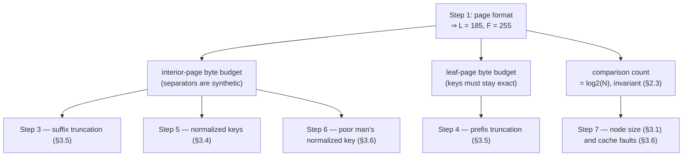

# Modern B-tree techniques: height is the metric, fanout is the lever

Every "B-trees are simple" take dies in Graefe's ~200-page survey of what
production B-trees actually do — compression, latching, logging interactions,
bulk loads. **Do not read it all.** This chapter builds the survey's core
ideas one step at a time — the fanout arithmetic first, then what that
arithmetic does *not* buy, then the four key-compression tricks that move it —
and then hands you the ~45 pages that matter for this topic and the capstone
(budget: 3 h); you'll come back for more in topics 5 (logging), 8/9
(latching), and 12 (columnar).

Every section number below is Graefe, *Modern B-Tree Techniques*,
**Foundations and Trends in Databases Vol. 3, No. 4 (2010), pp. 203–402**,
© 2011, DOI `10.1561/1900000028` — the 203-page PDF, whose section numbers and
figure numbers are the ones cited here. Each claim names the section it came
from, because in a survey this long an unsourced number is unfindable.

Every *measured* number below is this repo's own, from
[`notes.md`](notes.md) (Apple M3 Pro, 2026-07-28) or
[FINDINGS.md](../../FINDINGS.md) row 3. Nothing in the survey was measured on
your machine, and Graefe measures almost nothing at all — it is a survey, and
its own numbers are illustrative calculations (Fig. 3.1) rather than
experiments.

## The problem in one sentence

A B-tree lookup pays one page read per level, so every byte shaved off the
keys stored in *interior* pages raises fanout and can cost the tree a whole
level — on this repo's own 4 KiB page format, cutting a 32-byte separator to
4 bytes lifts fanout from **102 to 340** and drops the tree holding 10⁹ keys
from height 5 to height 4, one page read saved on every lookup forever.

## The concepts, step by step

### Step 1 — height is priced in page reads

> **In:** nothing yet — a page size, a key size and a record count, which is
> all the survey needs to price a lookup.
> **Out:** two numbers per key shape — leaf capacity `L` and interior fanout
> `F` — plus the height they imply. Step 2 forks these into an interior-page
> budget and a leaf-page budget, which the compression steps then spend.

A B-tree stores its keys in fixed-size **pages** — disk blocks, 4–8 KB in
traditional designs (§2.2). **Leaf pages** hold the records; **branch nodes**
(Graefe's word; also called internal, intermediate or *interior* nodes, §1.1)
hold **separator keys** plus child-page pointers. A point lookup reads one
page per level from root to leaf. The **fanout** `F` is the number of children
per branch node — "sometimes only in the tens, typically in the hundreds, and
sometimes in the thousands" (§2.2). The **height** is the number of levels;
Graefe warns the word is ambiguous (§2.2: "the height of this B-tree is 2
(levels above the leaves) or 3 (levels including the leaves)"), so this
chapter always means *levels including the leaf*, which is what a lookup pays.

The survey's formula, quoted as §2.2 states it:

```
§2.2:  N   records in the tree
       L   records per leaf
       F   average children per parent (the fanout)

       leaf nodes   = N / L
       branch levels = log_F (N / L)        "this expression is rounded up"
```

Symbols: `N` is the row count, `L` is how many records fit in one leaf page,
`F` is how many child pointers fit in one branch page. Both `L` and `F` come
out of the page format — that is the entire lever.

Work it on the format this topic's experiments actually use, so the numbers
are checkable rather than round. The format is fixed in
`experiments/src/bin/btree_baseline.rs`:

```rust
// topics/03-btree-internals/experiments/src/bin/btree_baseline.rs, 29-38
    29  /// Cells per leaf and interior fanout for the page format documented in
    30  /// src/page.rs. Arithmetic, not measurement — labelled as such in the output.
    31  fn geometry(key_len: usize, val_len: usize) -> (usize, usize) {
    32      // leaf cell:     key_len u16 ∥ val_len u16 ∥ key ∥ val   (+ 2 for its ptr)
    33      let leaf_cell = 2 + 2 + key_len + val_len + 2;
    34      // interior cell: child u32 ∥ key_len u16 ∥ key           (+ 2 for its ptr)
    35      let interior_cell = 4 + 2 + key_len + 2;
    36      let usable = PAGE_SIZE - HEADER;
    37      (usable / leaf_cell, usable / interior_cell)
    38  }
```

Lines 33 and 35 are the two that matter: they say exactly what a byte of key
costs in each region of the tree. `PAGE_SIZE` is 4096 and `HEADER` is 8
(`btree_baseline.rs:25-26`), so `usable` = 4088. Run it on an 8-byte key with
an 8-byte value:

```
leaf cell   = 2 + 2 + 8 + 8 + 2 =  22 bytes  ⇒ L = 4088 / 22  = 185.8  → 185
interior    = 4 + 2 + 8     + 2 =  16 bytes  ⇒ F = 4088 / 16  = 255.5  → 255

N = 1,000,000:  leaves        = ⌈1000000 / 185⌉ = 5406
                branch levels = log_255(5406)   = 8.5951 / 5.5413 = 1.551 → 2
                height        = 2 + 1 (the leaf level)            = 3
N = 1,000,000,000:
                leaves        = ⌈1e9 / 185⌉     = 5,405,406
                branch levels = log_255(5405406) = 15.503 / 5.5413 = 2.798 → 3
                height        = 3 + 1                              = 4
```

Those are exactly the `185`, `255`, `3`, `4` in the first row of
[`notes.md`](notes.md)'s fanout table and in
[README.md](README.md)'s measured block — the baseline binary is running
Graefe §2.2's formula, rounded up, plus one for the leaf level.

Why it matters: height is the number of *page touches* a lookup pays, it moves
in whole units, and every technique in the rest of this survey is ultimately a
lever on `L` or `F`, hence on height.

### Step 2 — the fork: two byte budgets, and the one number fanout cannot move

> **In:** `L` and `F` from Step 1, and the page format that produced them.
> **Out:** two separate byte budgets — the **interior-page budget**, spent by
> Steps 3, 5 and 6, and the **leaf-page budget**, spent by Step 4 — plus a
> third result Step 7 needs: the comparison count is invariant, so every
> CPU-side win must come from cache faults, not from comparisons.

The two divisors in `geometry()` are different expressions, and that is the
fork. A branch node stores `child u32 ∥ key_len u16 ∥ key`, so a byte of
separator costs one interior slot byte. A leaf stores
`key_len ∥ val_len ∥ key ∥ val`, so a byte of key costs one leaf slot byte
*and the record must stay exact* — a leaf key **is** the data. Two budgets,
two different sets of techniques:



The third output is the one most readings of this survey miss. A **comparison**
here means one key-versus-key test inside a page's binary search. §2.3 counts
them for a whole root-to-leaf search:

```
§2.3:  comparisons = log_F (N/L) × log_2(F)  +  log_2(L)
                     ╰─ levels ─╯  ╰ per branch ╯  ╰ in the leaf ╯

       "the product term simplifies to log_2(N/L) and then the entire
        expression simplifies to log_2(N)"
```

Check it on Step 1's numbers, N = 10⁶, L = 185, F = 255:

```
log_255(1000000/185) = log_255(5405.4) = 8.5951 / 5.5413  =  1.5511
log_2(255)                                                =  7.9944
log_2(185)                                                =  7.5314

1.5511 × 7.9944 + 7.5314 = 12.4002 + 7.5314                = 19.9316
log_2(1000000)                                             = 19.9316   ✓
```

Identical to four decimal places, because the algebra is exact. So: **raising
fanout buys you page touches, and buys you exactly zero comparisons.** A
bigger page means fewer levels and more comparisons per level, and the two
cancel. §2.3 puts it as "the record count is the only primary influence on the
number of comparisons in a root-to-leaf search".

That is not a footnote — it is why this topic's headline finding looks the way
it does. [FINDINGS.md](../../FINDINGS.md) row 3 records lookups climbing
**862 → 1101 ns** from 1e6 to 4e6 keys with height pinned at 3. Height did not
move and, by §2.3, the comparison count moved by only
log₂(4×10⁶) − log₂(10⁶) = 2 comparisons. Neither of the two things this
chapter's title names changed. What changed is the third channel, and §3.6
names it: "cache faults contribute a substantial fraction to the cost of
searching within a B-tree page", and "a cache fault may waste 100s of CPU
cycles" (§3.6 summary). A **cache fault** is a memory reference that misses
CPU cache and has to go to DRAM.

Why it matters: keep two columns, not one. Fanout controls how many pages you
touch; residency controls what a touch costs. The survey has a section for
each, and this topic measured the second one beating the first.

### Step 3 — separators are synthetic: suffix truncation

> **In:** the interior-page byte budget from Step 2 — `4 + 2 + key_len + 2`
> bytes per branch slot.
> **Out:** a smaller `key_len` in that expression, and therefore a larger `F`
> feeding back into Step 1's height formula. Step 4 does the same trick on the
> other budget.

A branch node never needs to store real keys. **Suffix truncation** (§3.5)
means: when a leaf splits and a new separator must be posted to the parent,
choose not the highest key of the left leaf nor the lowest of the right, but
*the shortest string that separates them*. §3.5 states the rule and then the
part that people get wrong:

> "Any letter can be chosen that is larger than J and not larger than S. **It
> is not required that the letter actually occurs in the current key values.**"
> — §3.5, on Fig. 3.6

So the constraint is an ordering constraint, not a shortening constraint: the
separator must satisfy `max(left leaf) < separator ≤ min(right leaf)` under
the inclusive-upper-bound convention §2.3 assumes. Being *short* is the payoff,
not the requirement. §3.5's Fig. 3.6 example: splitting between
`Johnson, Lucy` and `Smith, Eric`, a separator at the exact centre would need
"at least 9 letters, including the first letter of the given name", but if any
split point between the arrows is acceptable, "a single letter suffices" —
because the two candidate keys differ in their first byte.

```rust
// ILLUSTRATION — not quoted from the survey, which gives no code. The
// experiment hook where you will actually implement this is
// experiments/src/page.rs:73 (`split_into`), whose todo!() at :75 reads
// "try suffix-truncating the separator here and measure fanout".
fn shortest_separator(left: &[u8], right: &[u8]) -> Vec<u8> {
    let mut i = 0;
    while i < left.len() && i < right.len() && left[i] == right[i] {
        i += 1;                       // skip the shared prefix
    }
    // one byte past divergence: strictly > every key in `left`'s leaf,
    // and <= `right` because it is a prefix of `right`.
    right[..=i.min(right.len() - 1)].to_vec()
}
```

Two honest caveats the tidy version hides. First, this returns a *prefix of
`right`*, which is one legal answer but not the only one — §3.5 says any
byte in the open interval works, so a real implementation can often stop a
byte earlier by picking `left[i] + 1` when that is still ≤ `right[i]`. Second,
it needs the length guards on both sides; the version without them panics when
one key is a prefix of the other.

Now spend the budget. Interior slot = `4 + 2 + key_len + 2` = `8 + key_len`,
over `usable` = 4088:

```
key_len = 32 (full key)        slot = 40  ⇒  F = 4088 / 40 = 102.2 → 102
key_len =  4 (truncated sep)   slot = 12  ⇒  F = 4088 / 12 = 340.6 → 340
                                              lift = 340 / 102 = 3.33×
```

The `102` is [`notes.md`](notes.md)'s measured-format row for a 32-byte key,
so the left-hand column is not invented. Feed both into Step 1's height
formula, with leaf capacity unchanged at `L` = 88 (leaves keep the whole key —
that is Step 4's problem, not this one):

```
N = 10⁶,  L = 88  ⇒  leaves = ⌈10⁶/88⌉ = 11,364
   F = 102:  ⌈11364/102⌉ = 112 → ⌈112/102⌉ = 2 → ⌈2/102⌉ = 1     height 4
   F = 340:  ⌈11364/340⌉ =  34 → ⌈ 34/340⌉ = 1                   height 3

N = 10⁹,  L = 88  ⇒  leaves = 11,363,637
   F = 102:  111,408 → 1,093 → 11 → 1                            height 5
   F = 340:   33,423 →    99 →  1                                height 4
```

**One whole level at both scales.** That is the prediction
[README.md](README.md) §7 asks you to write down before you run the truncation
experiment ("Predict first: fanout ratio ⇒ height change at 1M keys?"). It is
arithmetic on the stated page format, not a measurement — and Step 2 is the
reason you should not expect the lookup time to fall by a third when you
measure it.

§3.5 also kills the obvious follow-up: do **not** apply suffix truncation when
splitting a *branch* node. Fig. 3.7 is titled "Incorrect suffix truncation" and
shows a shortened separator `g` routing a search for key `gh` into the wrong
subtree, "obviously incorrectly". Graefe adds the reason not to care: "if 99%
of all B-tree nodes are leaves and 99% of the remaining nodes are immediate
parents of leaves, additional truncation could benefit at most 1% of 1% of all
nodes."

Why it matters: **height is the metric; fanout is the lever; interior key size
is what you control.** This is your experiment for this topic.

### Step 4 — prefix truncation: store the shared prefix once

> **In:** the leaf-page byte budget from Step 2 — `2 + 2 + key_len + val_len + 2`
> per leaf slot, with the key required to stay exact.
> **Out:** a larger `L`, which shrinks `N/L` inside Step 1's log and so shrinks
> height from the other end.

Leaf keys **are** the data, so they cannot be replaced with a synthetic
separator. **Prefix truncation** (§3.5) is the compression that survives that
constraint: "analyzes the keys in a B-tree node and stores the common prefix
only once, truncating it from all keys stored in the node." §3.5's Fig. 3.5
shows a node of `Smith, Jack` / `Smith, Jane` / `Smith, Jason` / … stored
instead as `Prefix = Smith, J` plus `ack` / `ane` / `ason` / ….

§3.5 names two benefits and one design decision:

- Space: "permits increasing the number of records per leaf and increasing the
  fan-out of branch nodes" — it applies to both regions, unlike Step 3.
- CPU: "the truncated key bytes do not need to be considered in comparisons
  during a search."
- The decision: truncate against the *actual* keys currently in the page, or
  against the **maximal possible key range** the page could ever hold? §3.5
  argues for the second, "in particular for insertions": with actual-key
  truncation, "insertion of a new key might force reformatting all existing
  keys. In an extreme case, a new record might be much smaller than the free
  space in a B-tree page yet its insertion might force a page split."

The possible range is captured by **fence keys** — copies of the separator
keys posted to the parent when this page was split, retained in the page
itself (§3.5; illustrated in Fig. 4.11 in §4.4). The bytes shared by a page's
two fence keys are shared by every key the page can ever hold, now or later.
Note the circularity that makes the whole scheme work: Step 3's suffix
truncation is what keeps fence keys short, and short fence keys are what keep
their overhead affordable — §3.5 says exactly that.

§3.5 also gives a version that needs **no format change at all**, which is
worth stealing: **dynamic prefix truncation**. While binary-searching a branch
node, the two separator keys flanking the chosen child pointer are already
compared against the search key. If they agree on some leading bytes, every
key under that pointer agrees on them too, so those bytes can be skipped in
all later comparisons — and "dynamic prefix truncation can be exploited
without adding comparison steps to a root-to-leaf search."

Cost, from the same section: with actual-key truncation the prefix must be
recomputed whenever a split or merge changes the page's key range; with
fence-key truncation it need not, which is the argument for fence keys.

Why it matters: same lever, opposite end of the tree. Step 3 shrinks `F`'s
divisor; Step 4 shrinks `N/L` inside the log. Only Step 4 can help a tree whose
keys are already short separators.

### Step 5 — normalized keys: comparison becomes one hardware instruction

> **In:** the interior-page budget again, plus the fact from Step 2 that the
> comparison *count* is fixed — so the only thing left to attack is the cost of
> one comparison.
> **Out:** keys as plain byte strings, which is the precondition Steps 3, 4 and
> 6 all quietly assumed.

A **normalized key** (§3.4) is a re-encoding of a typed, possibly multi-column
key into a single binary string "such that simply binary comparisons suffice"
— the byte order of the string equals the intended sort order. The string
encodes "multiple columns, their sort direction (e.g., descending) and
collation including local characters (e.g., case-insensitive German), string
length or string termination" (§3.4).

Fig. 3.4's worked row: the tuple `(2, "flow", "error")` becomes

```
§3.4, Fig. 3.4:   1  0…0 0000 0000 0010   1 flow\0   1 error\0
                  ▲                        ▲          ▲
                  │                        └──────────┴─ 1 = column present
                  └─ 1 = leading column is not null, so nulls (0) sort first
```

Three details §3.4 insists on, each of which is a bug if you skip it:

1. Strings are terminated (`\0`), never length-prefixed: "A length indicator,
   for example, would destroy the main value of normalized keys, namely
   sorting with simple binary comparisons."
2. Signed integers and floats need bits flipped: "Signed integers require
   reversing some bits to ensure the proper sort order, just like floating
   point values require proper treatment of exponent, mantissa, and the two
   sign bits."
3. Normalization can be **lossy** — a case-insensitive collation maps two
   distinct strings to one key — so §3.4 lists three fixes, of which the third
   is the B-tree-specific one: "employ normalized keys only in branch nodes;
   recall that key values in branch nodes merely guide the search to the
   correct child but do not contain user data."

That third fix is the same observation as Step 3's, reused. And §3.4's closing
bullet reports it is what production does: "Some systems employ normalized keys
in branch nodes but not in leaf nodes" — because (§3.4) normalized keys "tend
to be longer than the original string values", which is a fanout cost you only
want to pay where the key is synthetic anyway.

You have met this idea before: it is the binary-comparable encoding of ART
(topic 2). §3.5 opens by pointing out the dependency in the other direction —
"Once keys have been normalized into a simple binary string, another B-tree
optimization becomes much easier to implement, namely prefix and suffix
truncation" — so Step 5 is logically *upstream* of Steps 3 and 4 even though
you meet it later.

Why it matters: §3.6 explains the payoff in the currency Step 2 said was the
only one left. Typed comparison "can require a large amount of code whereas two
normalized keys can be compared by a single hardware instruction" — so
normalization removes *instruction* cache faults, not comparisons. Topic 17
widens the same byte compare with SIMD.

### Step 6 — poor man's normalized key: a filter inside the indirection vector

> **In:** normalized keys from Step 5 and the slotted-page layout §3.3 calls an
> **indirection vector** (the sorted array of per-record slots; this repo's
> READMEs call it the cell pointer array).
> **Out:** a binary search that usually decides without dereferencing any
> record — the last of the three interior-budget techniques.

§3.6: "After prefix truncation has been applied, many comparisons in a binary
search are decided by the first few bytes. Even where normalized keys are not
used in the records, e.g., in B-tree leaves, storing a few bytes of the
normalized key can speed up comparisons. If only those few bytes are stored,
not the entire normalized key, such that they can decide many but not all
comparisons, they are called **poor man's normalized keys**."

The placement is the whole trick: put those bytes "as an additional field in
the elements of the indirection vector", not in the record. Fig. 3.8 shows a
page of European countries with a single letter cached per slot:

```
§3.6, Fig. 3.8 (page of Belgium / France / Luxemburg):

  indirection vector          records (variable size)
  ┌───┬───┬───┐               ┌──────────────┬────────────┬──────────────┐
  │ B │ F │ L │  ──────────▶  │ 7, "elgium"  │ 6, "rance" │ 9,"uxemburg" │
  └───┴───┴───┘               └──────────────┴────────────┴──────────────┘
   one cached byte per slot     size + the REST of the key lives here

  search "Denmark": B < D < F  — decided by the vector alone, zero record touches
  search "Finland": ties with F — must dereference and find "France"
```

§3.6's own two cases, verbatim in substance: a search for "Denmark" "can
eliminate all records by the poor man's normalized keys without incurring
cache faults for the main records"; a search for "Finland" "can rely on the
poor man's normalized key for the binary search but eventually must access the
main record for 'France'."

How many bytes? §3.6 says one letter is only the figure's simplification:
"2 or 4 bytes seem more appropriate, depending on the page size … in a small
database page optimized for flash storage and its fast access latency, 2 bytes
might be optimal; whereas in large database pages optimized for traditional
disks and their fast transfer bandwidth, 4 bytes might be optimal."

There is a matching *subtraction* in the same section, and it is the better
lesson: §3.6 argues the record *size* should be moved **out** of the slot and
into the record, "because the record length is hardly ever accessed without
access to the related record". Cache-line budget is zero-sum — you earn the
bytes for a filter by evicting a field nobody reads on its own.

This is the dense-filter pattern this curriculum keeps meeting: the same move
as SwissTable's `h2` byte and the skiplist tower (topic 2), and the same
principle Question 3 below asks you to write in one sentence. Why it matters:
the indirection vector is contiguous and hot; the records are scattered across
the page — and by Step 2, avoided cache faults are the only CPU win left on
the table.

### Step 7 — node size is a trade, not a constant

> **In:** everything above — `L`, `F`, the invariant comparison count, and the
> cache-fault channel.
> **Out:** the one parameter that moves all of them at once, and the survey's
> two answers for the two devices.

Nothing makes 4 KB sacred. §3.1 gives a one-line heuristic: pick the node size
at which **access latency equals transfer time**, computed by multiplying the
two. It "guarantees a sustained transfer bandwidth at least half of the
theoretical optimum as well as an I/O rate at least half of the theoretical
optimum". Its two worked cases:

```
§3.1:  disk   5 ms latency  × 200 MB/s  =  1 MB     node size
       flash  0.1 ms        × 100 MB/s  = 10 KB     node size
```

Check the first: 0.005 s × 200 × 10⁶ B/s = 1.0 × 10⁶ B. And the second:
1 × 10⁻⁴ s × 100 × 10⁶ B/s = 1.0 × 10⁴ B. Both divisions come out as printed.

§3.1's Fig. 3.1 then optimizes properly, maximizing "the number of comparisons
per unit of I/O time" — the **node utility** being log₂ of the records per
page, i.e. the comparisons one page read buys. Its assumptions are stated:
pages 70% full, 20-byte records, 5 ms access, 200 MB/s burst:

```
§3.1, Fig. 3.1:
  page KB   records/page   utility   I/O ms   utility/time
        4            143     7.163    5.020          1.427
       16            573     9.163    5.080          1.804
       64          2,294    11.163    5.320          2.098
      128          4,588    12.163    5.640          2.157   ← best
      256          9,175    13.163    6.280          2.096
    1,024         36,700    15.163   10.120          1.498
    4,096        146,801    17.163   25.480          0.674
```

§3.1's conclusion is blunter than most textbooks': "Historically common disk
pages of 4 KB are far from optimal for B-tree indexes on traditional disk
drives." Note that the *heuristic* said 1 MB and the *optimization* said 128 KB;
Graefe reports both and does not reconcile them, and the 1,024 KB row's
utility/time of 1.498 is below the 4 KB row's 1.427 only barely — the curve is
flat and broad between 64 and 256 KB, which is the real finding.

The resolution for the CPU side is §3.6's, not §3.1's: keep the big node for
the device and put a **cache-conscious structure inside it** — "organizes the
indirection vector not as a linear array but as a B-tree of cache lines … The
size of each node in this B-tree is equal to a single cache line or a small
number of them", for which §3.6 reports "search time and cache faults within a
B-tree page may be cut in half compared to node formats not optimized for CPU
caches" (§3.6, citing [24]). That is a *cited* claim, not one Graefe measured;
treat it as a pointer to a paper, not as a number.

Why it matters: your capstone picks a page size once and lives with it. Hold
this section when topic 12 makes columnar pages megabytes wide, and hold §3.6's
answer for what has to go *inside* them.

## How to read the paper (with the concepts in hand)

The section numbers in the table below are this edition's; a previous version
of this chapter cited several of them wrongly (see the note at the end of this
section). ~45 pages total.

Read now (this topic):

| Section | Pages | Why |
|---|---|---|
| §2.1–2.3 Data structures, sizes, algorithms | 213–221 | Steps 1–2 — the `log_F(N/L)` formula and the `log_2(N)` comparison invariant |
| §3.1 Node size | 232–233 | Step 7; Fig. 3.1's utility table — 4 KB "far from optimal" for disk |
| §3.3 Variable-length records | 235–237 | the slotted page you already read twice, as the survey states it: indirection vector + records growing toward each other |
| **§3.4 Normalized keys** | 237–239 | Step 5; Fig. 3.4's encoding, and why a length prefix would break it |
| **§3.5 Prefix B-trees** | 239–243 | Steps 3–4; Fig. 3.5 prefix, Fig. 3.6 separator choice, Fig. 3.7 *incorrect* suffix truncation. This is your experiment |
| §3.6 CPU caches | 244–246 | Steps 2, 6, 7; poor man's normalized keys (Fig. 3.8), and the cache-fault channel this topic measured |
| §3.11 Splitting nodes | 258–259 | skim — the split policy the above compression interacts with |

Defer (note where, come back later):

- **§4.1 Latching and locking**, **§4.6 B^link-trees**, **§4.8 latch coupling**
  (265–289) → topic 9 (concurrency)
- **§4.2 Ghost records**, **§4.9 physiological logging**,
  **§4.4 fence keys at leaf boundaries** (268–293) → topic 5 (durability/WAL)
- **§6.1 Index creation**, **§6.4 bulk insertions**, **§6.6 defragmentation**
  (344–363) → topics 12 and 22
- **§7.4 Column stores**, **§7.5 large values** (381–390) → topics 12 and,
  for the overflow story, this topic's SQLite chapters

Corrections to the previous edition of this chapter, all verified against the
PDF's table of contents (pp. 203–402): truncation is **§3.5**, not §3.1–3.3
(§3.1 is node size, §3.2 interpolation search, §3.3 variable-length records);
poor man's normalized keys are **§3.6**, not §3.5; node sizes are **§3.1**, not
§5.1–5.2 (§5.1 is disk-order scans, §5.2 fetching rows); latching is **§4**,
not §6 (§6 is B-tree utilities); logging and ghost records are **§4**, not §7
(§7 is advanced key structures); bulk load and index creation are **§6**, not
§8 (§8 is the two-page conclusion). Only "§3.4 normalized keys" and "§2 basic
techniques" survived unchanged.

## Questions to answer in notes.md

1. Why does suffix truncation apply to interior separators but prefix truncation
   mostly to leaf pages? (Separators are synthetic; leaf keys must be exact.)
   Then extend it: §3.5's Fig. 3.7 forbids suffix truncation when splitting a
   *branch* node — say why, and why Graefe thinks it does not matter.
2. SQLite/turso do neither. Given SQLite's design goals (simplicity, robustness,
   integer rowids as the common key), argue whether that's the right call. Use
   Step 3's arithmetic: for an 8-byte rowid the interior slot is 16 bytes, so
   what is the largest fanout truncation could possibly buy?
3. Poor man's normalized key = SwissTable h2 = skiplist tower = pointer-array-as-
   filter. Write the general principle in one sentence for the capstone notes.
4. §2.3 proves the comparison count is `log_2(N)` whatever the fanout, yet this
   topic measured 862 → 1101 ns from 1e6 to 4e6 keys at constant height. Using
   §3.6's vocabulary, name the cost channel that moved and say which section of
   the survey you would read to attack it.

## Done when

Answer each before unfolding it.

- [ ] You can do the fanout→height arithmetic cold: given a page size, a header size, a key size and a record count, produce `L`, `F` and the height, with the logarithm actually evaluated.

  <details><summary>Answer</summary>

  The formula is §2.2's: `leaves = N / L`, `branch levels = log_F(N/L)`,
  rounded up, and the height a lookup pays is that plus one for the leaf level.
  `L` and `F` come from the page format, and the only skill is counting the
  per-slot bytes correctly — including the slot pointer itself.

  On this repo's format (`experiments/src/bin/btree_baseline.rs:31-38`,
  `PAGE_SIZE` 4096, `HEADER` 8, so 4088 usable): an 8-byte key with an 8-byte
  value gives a leaf cell of `2 + 2 + 8 + 8 + 2 = 22` bytes ⇒ `L` = 4088/22 =
  185, and an interior cell of `4 + 2 + 8 + 2 = 16` ⇒ `F` = 4088/16 = 255. At
  N = 10⁶: leaves = ⌈10⁶/185⌉ = 5406, log₂₅₅(5406) = 8.5951/5.5413 = 1.551 → 2
  branch levels, height 3. At N = 10⁹: leaves = 5,405,406,
  log₂₅₅(5405406) = 15.503/5.5413 = 2.798 → 3, height 4. Those are the `185`,
  `255`, `3`, `4` printed in `notes.md`'s fanout table.

  </details>

- [ ] You can say what a separator key is legally required to be, and what suffix truncation therefore buys — with the fanout numbers for a 32-byte key before and after.

  <details><summary>Answer</summary>

  A separator is required only to *sort strictly between* the two leaves it
  divides: `max(left) < separator ≤ min(right)`. §3.5 is explicit that it need
  not be a real key at all — "It is not required that the letter actually
  occurs in the current key values." Shortness is the payoff, not the rule.

  On this repo's format the interior slot is `4 + 2 + key_len + 2 = 8 + key_len`
  bytes over 4088 usable. A full 32-byte key gives a 40-byte slot and
  `F` = 102 — the number in `notes.md`'s second row. A 4-byte separator gives a
  12-byte slot and `F` = 340, a 3.33× lift. With leaf capacity unchanged at
  `L` = 88, that is height 4 → 3 at 10⁶ keys (11,364 leaves: 112 → 2 → 1 versus
  34 → 1) and height 5 → 4 at 10⁹.

  One caveat §3.5 makes loudly: this applies when splitting *leaves* only.
  Fig. 3.7, "Incorrect suffix truncation", shows a shortened branch-level
  separator `g` routing a search for `gh` into the wrong subtree.

  </details>

- [ ] You can explain why a bigger fanout does not reduce the number of key comparisons a lookup performs, and name what it does reduce.

  <details><summary>Answer</summary>

  §2.3 counts a whole root-to-leaf search as
  `log_F(N/L) × log_2(F) + log_2(L)`: fewer levels, but proportionally more
  comparisons per level, and the two cancel exactly —
  "the entire expression simplifies to `log_2(N)`". Numerically, at N = 10⁶,
  L = 185, F = 255: 1.5511 × 7.9944 + 7.5314 = 19.9316, and
  log₂(10⁶) = 19.9316.

  What fanout reduces is **page touches** — height, which is one page read (or
  at best one page-cache hit plus a pointer chase) per level. That is the
  quantity worth paying for when a touch is expensive, and it is why this
  chapter is titled the way it is. It is also why the topic's measured ladder
  is not a step function: at 4e6 keys and 270 MB, `notes.md` records 1101
  ns/lookup against 862 at 1e6 keys with height pinned at 3, because the pages
  stopped fitting in CPU cache. §3.6 is the section that owns that cost:
  "a cache fault may waste 100s of CPU cycles."

  </details>

- [ ] You can state where a poor man's normalized key is stored, why that location and not another, and how many bytes the survey recommends.

  <details><summary>Answer</summary>

  In the **indirection vector** — §3.3's name for the sorted per-record slot
  array, this repo's "cell pointer array" — as an extra field in each slot,
  never in the record. §3.6's reason is cache faults, not space: the vector is
  a small contiguous run that the binary search walks anyway, whereas the
  records are scattered across the page, so a comparison decided from the slot
  costs no additional cache line. Fig. 3.8's example: searching a page of
  Belgium/France/Luxemburg for "Denmark" is settled by the cached first bytes
  alone; searching for "Finland" ties against `F` and must dereference the
  "France" record.

  §3.6 recommends **2 or 4 bytes**, "depending on the page size" — 2 for small
  flash-sized pages, 4 for large disk-sized pages; the single letter in
  Fig. 3.8 is the figure's simplification. The same section pays for those
  bytes by moving the record *length* out of the slot and into the record,
  "because the record length is hardly ever accessed without access to the
  related record".

  </details>

- [ ] You can say what page size §3.1's own numbers point at, and why 4 KB survives anyway.

  <details><summary>Answer</summary>

  Two answers that do not agree. §3.1's heuristic — set node size so access
  latency equals transfer time, i.e. multiply them — gives 5 ms × 200 MB/s =
  1 MB for a disk and 0.1 ms × 100 MB/s = 10 KB for flash. §3.1's Fig. 3.1
  optimizes utility (comparisons bought) per I/O millisecond instead and peaks
  at **128 KB**, with 2.157 against 4 KB's 1.427; §3.1's verdict on the
  historical default is "Historically common disk pages of 4 KB are far from
  optimal for B-tree indexes on traditional disk drives."

  4 KB survives because the disk is no longer the only cost. §3.6 is the
  counterweight: binary search over a very large page is a sequence of cache
  faults, "a cache fault may waste 100s of CPU cycles", and §2.3 already
  proved a bigger page buys zero comparisons. The survey's resolution is not
  "pick a small page" but "pick the page the device wants and give it internal
  structure" — an indirection vector organized as a B-tree of cache lines,
  for which §3.6 cites a halving of in-page search time and cache faults. That
  is also exactly the split this topic measured: fanout is one lever,
  residency is the other.

  </details>

## References

**Papers**
- Goetz Graefe — "Modern B-Tree Techniques", *Foundations and Trends in
  Databases* Vol. 3, No. 4 (2010), pp. 203–402, © 2011,
  DOI [10.1561/1900000028](https://doi.org/10.1561/1900000028) — ~200 pages;
  do NOT read it all, follow the section table above.

| Section | Pages | What this chapter took from it |
|---|---|---|
| §2.2 | 215–216 | `branch levels = log_F(N/L)`, rounded up; node sizes 4–8 KB; ">99% of all nodes are leaves"; 70% average utilization |
| §2.3 | 216–218 | `log_F(N/L) × log_2(F) + log_2(L) = log_2(N)` — the comparison count fanout cannot move |
| §3.1 | 232–233 | latency × bandwidth heuristic (1 MB disk, 10 KB flash); Fig. 3.1's utility table peaking at 128 KB |
| §3.3 | 235–237 | the indirection vector, and the two regions growing toward each other |
| §3.4, Fig. 3.4 | 237–239 | normalized keys; null bits, `\0` termination, why a length prefix breaks it; branch-only normalization |
| §3.5, Figs. 3.5–3.7 | 239–243 | prefix truncation, fence keys, dynamic prefix truncation, shortest separators, and Fig. 3.7's *incorrect* suffix truncation |
| §3.6, Fig. 3.8 | 244–246 | cache faults as a first-class cost; poor man's normalized keys in the indirection vector, 2–4 bytes |

**This repo**
- [`notes.md`](notes.md) — the fanout table (185/255, 88/102, 35/255) and the
  height ladder these steps compute against, Apple M3 Pro, measured 2026-07-28.
- [FINDINGS.md](../../FINDINGS.md) row 3 — 862 → 1101 ns at constant height:
  §2.3's invariant and §3.6's cache faults, measured.
- `experiments/src/bin/btree_baseline.rs:29-50` — `geometry()` and `height()`,
  the two functions that implement §2.2's formula.
