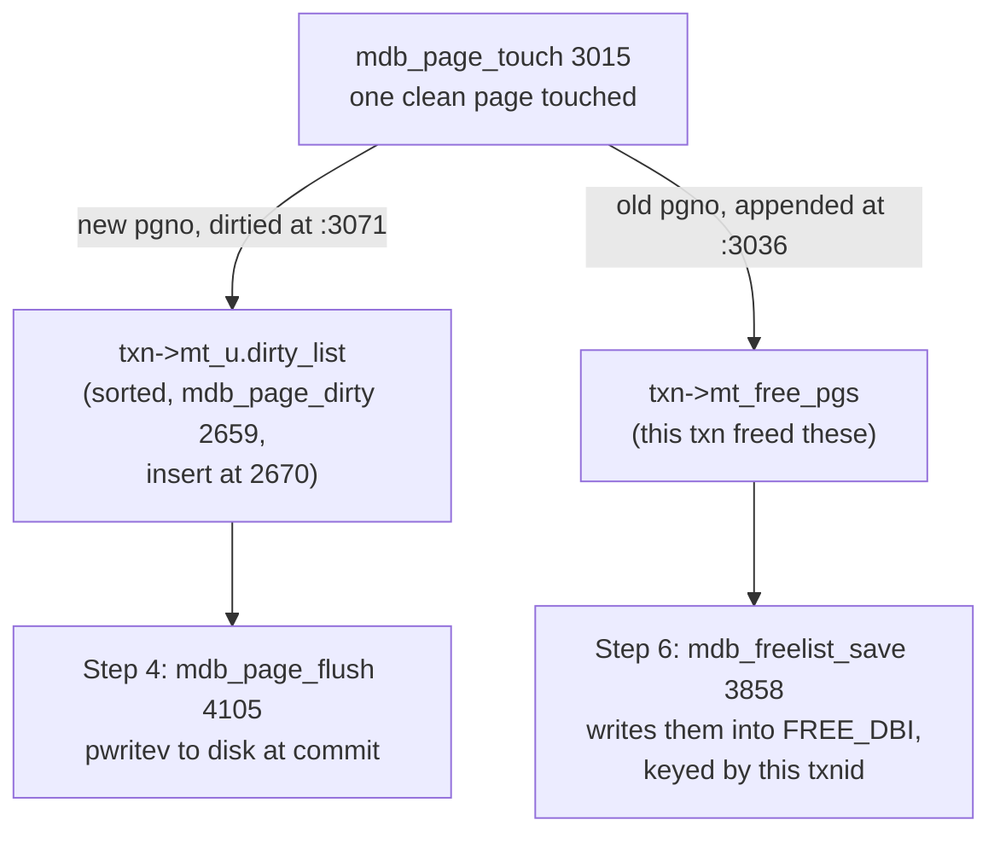

# LMDB: recovery is choosing a root pointer

LMDB is the anti-SQLite: no WAL, no page cache of its own, no free-space-
within-page — just copy-on-write pages over one big mmap, with crash recovery
reduced to picking the newer of two meta pages. This chapter builds that
design one step at a time — the mmap, copy-on-write, the two lists one page
touch produces, the two-meta commit protocol, page reuse, and the reader table
— then hands you the anchors to read its single 12,846-line file as a *design*,
skimming the code (2 h). It is also the on-disk twin of the capstone
reference's in-memory `cow_btree`, which is exactly M3's comparison exercise.

Every anchor below is `libraries/liblmdb/mdb.c` at the commit this repo pins,
**`LMDB/lmdb@704dc70`** (confirm with `tools/pinned-source.py ref lmdb`), and
the file is 12,846 lines at that revision. Line numbers are the ones the code
occupies there; re-check any you carry elsewhere.

## The problem in one sentence

A crash can strike between any two of the hundreds of page writes in a
commit, yet reopening an LMDB database afterwards costs exactly **two reads of
a meta-page-sized buffer** — `mdb_env_read_header` (mdb.c:4673) loops
`NUM_METAS` = 2 times over a `pread` at :4718 and keeps the larger valid
`mm_txnid` at :4749 — with no log to replay and no repair step to run.

## The concepts, step by step

### Step 1 — one big mmap: the OS page cache IS the cache

> **In:** nothing yet — a file on disk and an `open()`.
> **Out:** an address range, `env->me_map`, that every later step reads
> through; plus a page size, `env->me_psize`, that Step 2's copy cost and
> Step 4's arithmetic are both denominated in.

A **page** is the fixed-size block LMDB reads, writes and copies as a unit, and
**mmap** is the system call that makes a file addressable as ordinary memory.
`mdb_env_map` (mdb.c:5040) maps the environment once, at open:

```c
// libraries/liblmdb/mdb.c — inside mdb_env_map, the POSIX branch, 5095-5118
  5095  	int mmap_flags = MAP_SHARED;
  5096  	int prot = PROT_READ;
  5097  	if (flags & MDB_WRITEMAP)
  5098  		prot |= PROT_WRITE;
  // ... 5099-5116: MAP_NOSYNC on FreeBSD, the MDB_VL32 partial-map branch,
  //                and ftruncate when MDB_WRITEMAP is on ...
  5117  	env->me_map = mmap(addr, env->me_mapsize, prot, mmap_flags,
  5118  		env->me_fd, 0);
```

Line 5096 is the one that carries the design: the default protection is
`PROT_READ` and nothing else. A read is then a pointer dereference into the
map — zero-copy, no buffer pool, no page cache of LMDB's own. Writes do *not*
go through the map by default: `mdb_page_flush` (mdb.c:4105) writes dirty
pages with `pwrite`/`pwritev` (mdb.c:4237, :4240) through `env->me_fd`
(:4122). A writable map is opt-in, via `MDB_WRITEMAP` at :5097.

Two corrections to the folklore, both visible in the code:

- **The page size is not 4 KB by default; it is the OS page size.** For a new
  environment `mdb_env_open` sets `env->me_psize = env->me_os_psize`
  (mdb.c:5520), capped at `MAX_PAGESIZE`; for an existing one it takes the
  size recorded in the file, `env->me_psize = meta.mm_psize` (:5527). That is
  4096 on x86-64 Linux and **16384 on the Apple Silicon machine this repo
  measures on**, so every "4 KB page" below is an assumption you should state
  when you reuse it.
- **It maps `me_mapsize`, not the file size** (:5117). `me_mapsize` is a
  configured maximum, defaulting to `DEFAULT_MAPSIZE` = 1,048,576 bytes
  (mdb.c:788) and normally raised with `mdb_env_set_mapsize`. This is why LMDB
  makes you choose a ceiling up front and why `MDB_MAP_FULL` exists — the
  address range is fixed at open, and growth past it is an error, not a
  remap.

Why it matters: topic 6's mmap-considered-harmful paper will argue mmap is
dangerous for *writes*, because the application has no control over write-back
order. Line 5096 is LMDB's answer: the map is read-only, and ordering is
enforced by the explicit `pwrite` sequence of Step 4.

### Step 2 — copy-on-write: never overwrite a live page

> **In:** the mmap and `me_psize` from Step 1, plus a write transaction and a
> cursor sitting on some page.
> **Out:** for each page the write touches, a *new* page at a *new* page
> number, with the parent repointed at it. Step 3 collects the two lists this
> produces.

**Copy-on-write** (COW) means a transaction never modifies a page that any
committed version of the tree can still reach. The first write to such a page
inside a transaction copies it to a fresh page number, and the parent's child
pointer is updated to point at the copy. `mdb_page_touch` (mdb.c:3015) is the
whole mechanism, and the interesting half is eighteen lines:

```c
// libraries/liblmdb/mdb.c — inside mdb_page_touch, 3024-3044
  3024  	if (IS_SUBP(mp) || IS_WRITABLE(txn, mp))
  3025  		return MDB_SUCCESS;
  3026
  3027  	if (!IS_MUTABLE(txn, mp)) {
  3028  		/* Page from an older snapshot */
  3029  		if ((rc = mdb_midl_need(&txn->mt_free_pgs, 1)) ||
  3030  			(rc = mdb_page_alloc(mc, 1, &np)))
  3031  			goto fail;
  3032  		pgno = np->mp_pgno;
  // ... 3033-3035: a debug print and an assertion that the pgno really changed ...
  3036  		mdb_midl_xappend(txn->mt_free_pgs, mp->mp_pgno);
  3037  		/* Update the parent page, if any, to point to the new page */
  3038  		if (mc->mc_top) {
  3039  			MDB_page *parent = mc->mc_pg[mc->mc_top-1];
  3040  			MDB_node *node = NODEPTR(parent, mc->mc_ki[mc->mc_top-1]);
  3041  			SETPGNO(node, pgno);
  3042  		} else {
  3043  			mc->mc_db->md_root = pgno;
  3044  		}
```

The line to focus on is **3041**: the parent's child pointer is edited *in
place*. That is only legal because the parent was itself touched earlier in
the same descent — a cursor walks root-to-leaf, so by the time the leaf is
touched every ancestor already sits at a new page number. Line 3043 is the
base case: no parent means this is the root, so the new page number goes into
`md_root`, which is the field a meta page carries.

Line 3025's early return is the reason the cost is a *path*, not a *tree*: a
page already writable in this transaction is touched once and reused. The copy
itself happens at :3071 (`mdb_page_copy`), `me_psize` bytes at a time.

```
 modify one key in a tree of depth 4:

 before:  root₀ → branch₀ → branch₀' → leaf₀     (all shared, read-only)
 after:   root₁ → branch₁ → branch₁' → leaf₁     (4 NEW pages written)
          root₀ → branch₀ → branch₀' → leaf₀     (old path still intact,
                                                  readers may hold it)
```

The tree's depth is not a guess: LMDB records it in `MDB_db.md_depth`
(mdb.c:1330), which lives in the meta page (`mm_dbs`, :1374) and is what
`mdb_stat` prints.

Compare with the capstone reference's in-memory `cow_btree`: same path copy,
but `Arc` refcounts replace Step 6's freelist, and "commit" is an atomic root
swap instead of Step 4's meta write. Write this comparison in notes — it's
M3's core.

### Step 3 — the fork: one page touch, two lists

> **In:** the new and old page numbers produced by every `mdb_page_touch` call
> in Step 2.
> **Out:** two separate lists that go to two different places — `dirty_list`,
> which Step 4's commit writes to disk, and `mt_free_pgs`, which Step 6's
> allocator eventually recycles. Confusing them is the classic misreading of
> LMDB.

Look again at the block above. It produces two facts per touched page, and
they are consumed by code that has nothing to do with each other:



A **dirty page** is a page this transaction has written and must flush.
`mdb_page_dirty` (mdb.c:2659) records it, and line 2670's `mdb_mid2l_insert`
keeps `dirty_list` sorted by page number — which is why Step 4's flush can
coalesce runs of adjacent pages into one `pwritev` (:4240) instead of one
syscall per page.

A **freed page** is the *old* copy, appended to `txn->mt_free_pgs` at :3036.
It is emphatically not garbage yet: readers pinned to older transactions may
still be walking it (Step 5). `mdb_freelist_save` (mdb.c:3858), called from
the commit path at :4571, writes this list into the freelist database keyed by
this transaction's id — which is the *entire* record of when a page became
reusable.

Why it matters: the write amplification of Step 4 and the unbounded growth of
Step 6 are the same event seen from two sides. One touched page costs one page
written now and one page number owed to the future.

### Step 4 — the commit protocol: two meta pages, two durability barriers

> **In:** `dirty_list` from Step 3, plus a transaction id.
> **Out:** a durable, complete new version of the tree reachable from one meta
> page — and, whatever happens mid-way, the *previous* version still reachable
> from the other. Step 5's readers pick between them.

A **meta page** stores the root page number of every database in the
environment plus the id of the transaction (**txnid**) that produced them —
the entry point to one complete, immutable version of the tree. LMDB keeps
exactly two, and the comment above the struct is the whole design:

```c
// libraries/liblmdb/mdb.c — NUM_METAS and the MDB_meta comment, 1351-1358
  1351  	/** Number of meta pages - also hardcoded elsewhere */
  1352  #define NUM_METAS	2
  1353
  1354  	/** Meta page content.
  1355  	 *	A meta page is the start point for accessing a database snapshot.
  1356  	 *	Pages 0-1 are meta pages. Transaction N writes meta page #(N % 2).
  1357  	 */
  1358  typedef struct MDB_meta {
```

Line 1356 is the invariant: **pages** 0 and 1 (not byte offsets 0 and 1 — they
sit at byte 0 and byte `me_psize`), and txn N writes meta `N % 2`, so the
previously committed meta is never the one being overwritten.
`mdb_env_write_meta` implements the toggle in one line, :4863,
`toggle = txn->mt_txnid & 1`.

The ordering, quoted from the commit path:

```c
// libraries/liblmdb/mdb.c — inside mdb_txn_commit, 4571-4599
  4571  	rc = mdb_freelist_save(txn);
  // ... 4572-4582: error handling and a MDB_DEBUG-only mdb_audit() ...
  4583  	if ((rc = mdb_page_flush(txn, 0)))
  4584  		goto fail;
  // ... 4585-4588: assert the loose-page count matches dirty_list ...
  4589  	if (!F_ISSET(txn->mt_flags, MDB_TXN_NOSYNC) &&
  4590  		(rc = mdb_env_sync0(env, 0, txn->mt_next_pgno)))
  4591  		goto fail;
  // ... 4592-4596: the MDB_TXN_PREPARE early return ...
  4597  prepared:
  4598  	if ((rc = mdb_env_write_meta(txn)))
  4599  		goto fail;
```

Read it as four events: record the freed pages (4571), write the data pages
(4583), **barrier one** (4590, `mdb_env_sync0` — a real `fsync`/`msync`, and
skippable with `MDB_NOSYNC`), then write the meta (4598).

**Barrier two is not a second `fsync`, and the previous edition of this
chapter said it was.** `mdb_env_write_meta` gets durability from the file
descriptor instead:

```c
// libraries/liblmdb/mdb.c — inside mdb_env_write_meta, 4918-4937
  4918  	off = offsetof(MDB_meta, mm_mapsize);
  4919  	ptr = (char *)&meta + off;
  4920  	len = sizeof(MDB_meta) - off;
  4921  	off += (char *)mp - env->me_map;
  4922
  4923  	/* Write to the SYNC fd unless MDB_NOSYNC/MDB_NOMETASYNC.
  4924  	 * (me_mfd goes to the same file as me_fd, but writing to it
  4925  	 * also syncs to disk.  Avoids a separate fdatasync() call.)
  4926  	 */
  4927  	mfd = (flags & (MDB_NOSYNC|MDB_NOMETASYNC)) ? env->me_fd : env->me_mfd;
  // ... 4928-4935: the Windows OVERLAPPED WriteFile branch ...
  4936  retry_write:
  4937  	rc = pwrite(mfd, ptr, len, off);
```

Line 4927 is the correction: `me_mfd` is a second descriptor onto the same
file, opened `MDB_O_META = O_WRONLY|MDB_DSYNC` (mdb.c:5318), so the `pwrite`
at 4937 *is* the barrier. The comment at 4924-4925 says so. There is one
platform exception, at :4964-4968: on `__APPLE__` LMDB does issue an explicit
`MDB_FDATASYNC(env->me_mfd)`, because Darwin's `O_DSYNC` does not reach the
platter. So "two fsyncs" is true on macOS and false on Linux; "two durability
barriers, independently disableable" is true everywhere —
`MDB_NOSYNC` is documented as "don't fsync after commit" and `MDB_NOMETASYNC`
as "don't fsync metapage after commit" (`lmdb.h:354`, `:358`).

Lines 4918-4920 also carry a detail worth its own sentence: the meta write is
a **partial-struct write**, starting at `mm_mapsize` and running to the end of
`MDB_meta`. On a 64-bit build that is
`8 (mm_mapsize) + 2 × 48 (mm_dbs) + 8 (mm_last_pg) + 8 (mm_txnid)` =
**120 bytes** — the `48` being `MDB_db` (mdb.c:1327-1336: `4 + 2 + 2` then five
8-byte fields). `mm_magic` and `mm_version` are deliberately *not* rewritten,
because they never change. 120 bytes fits inside a single 512-byte sector, and
that — not a checksum — is the atomicity LMDB depends on. There is no checksum
on a meta page; validation at open is only the `P_META` flag (:4730), the
magic (:4738) and the version (:4743).

```
 crash timeline:                                recovery = nothing:
 pages ─ fsync(4590) ─ meta pwrite(4937, O_DSYNC)
   ▲crash: old meta wins    ▲crash: old meta wins
    (new pages unreachable)  (the other slot is untouched)

 open: mdb_env_read_header 4673 — two preads (4718), keep larger mm_txnid (4749)
 then, per read txn: mdb_env_pick_meta 4990 — one comparison, no I/O
```

Recovery really is one expression:

```c
// libraries/liblmdb/mdb.c — mdb_env_pick_meta in full, 4985-4995
  4985  /** Check both meta pages to see which one is newer.
  4986   * @param[in] env the environment handle
  4987   * @return newest #MDB_meta.
  4988   */
  4989  static MDB_meta *
  4990  mdb_env_pick_meta(const MDB_env *env)
  4991  {
  4992  	MDB_meta *const *metas = env->me_metas;
  4993  	return metas[ (metas[0]->mm_txnid < metas[1]->mm_txnid) ^
  4994  		((env->me_flags & MDB_PREVSNAPSHOT) != 0) ];
  4995  }
```

Line 4993 is the entire redo log of this database: a comparison of two
integers. (The `^` on 4994 is the `MDB_PREVSNAPSHOT` debugging flag, which
deliberately picks the *older* meta — proof that the older one is still a
complete, mountable tree.) No WAL, no redo, no undo.

Price it, because "free recovery" is not free. Assume 4096-byte pages (state
this — Step 1 showed it is the OS page size, so it is 16384 on Apple Silicon),
a tree of depth 4, and one key changed:

```
COW path copy      4 pages × 4096  = 16,384 B   (Step 2)
freelist DB page  ≥1 page  × 4096  =  4,096 B   (mdb_freelist_save 3858 —
                                                 FREE_DBI is itself a COW tree)
meta write            120 B         =    120 B  (mdb_env_write_meta 4918-4920)
                                    ─────────
                                    ≥ 20,600 B  for one key

a WAL engine's equivalent: one ~100 B log record, appended, then one fsync
                                    ≥ 20,600 / 100 = 206× the bytes
```

Why it matters: recovery is a root-pointer choice precisely *because* commit
paid for it in advance, 206× over in this example. Step 7 shows the same trade
simplifying the split code.

### Step 5 — readers never block writers

> **In:** the two meta pages Step 4 maintains.
> **Out:** a frozen `txnid` per active reader, published in a shared table —
> which is simultaneously what makes reads lock-free and the input Step 6's
> allocator must respect.

A **read transaction** is just a claim on one version of the tree. It picks a
txnid, records it in a **reader slot** — one `MDB_reader` (mdb.c:869) per
reader in a shared lock file — and from then on follows pointers through pages
that, by Step 2's rule, nobody will ever modify. There are no locks on data
pages, ever.

`mdb_txn_renew0` (mdb.c:3285) does the setup, and it has two paths. The
previous edition of this chapter cited only the first:

- **No lock table** (`MDB_NOLOCK`, or a read-only env with no `ti`): :3294-3298
  calls `mdb_env_pick_meta` at :3296 and takes `meta->mm_txnid` directly.
- **The normal path**: :3349-3358 publishes the shared
  `ti->mti_txnid` into the slot first — `do r->mr_txnid = ti->mti_txnid; while
  (r->mr_txnid != ti->mti_txnid);` at :3349-3351, a retry loop against a racing
  committer — and only then derives the meta from it,
  `meta = env->me_metas[r->mr_txnid & 1]` at :3356.

The ordering in the normal path is the load-bearing part: **publish, then
read**. A writer that commits between the two sees the reader's slot already
claiming the older txnid, so Step 6's allocator will not recycle the pages
that reader is about to walk.

Writes are the opposite extreme: a single writer mutex allows exactly one
write transaction at a time. LMDB does not pretend otherwise.

Why it matters: readers cost nothing to run and nothing to writers, which is
what makes LMDB's read path famous — but each reader's frozen txnid becomes a
liability in Step 6.

### Step 6 — page reuse: garbage collection as a database

> **In:** `mt_free_pgs` from Step 3, now persisted into `FREE_DBI` and keyed by
> the txnid that freed each page; plus the reader slots from Step 5.
> **Out:** page numbers the allocator may hand out again — and, when a reader
> stalls, a file that grows without bound.

COW keeps producing dead pages (every superseded path), so LMDB stores freed
page ids in a **freelist database** — an internal B-tree, `FREE_DBI` = 0
(mdb.c:1345), keyed by the txn that freed them. `mdb_page_alloc` (mdb.c:2693)
reuses a freed page only if it was freed by a transaction older than the oldest
active reader; the gate is a `break` out of the freelist scan:

```c
// libraries/liblmdb/mdb.c — inside mdb_page_alloc's freeDB scan, 2800-2810
  2800  		last++;
  2801  		/* Do not fetch more if the record will be too recent */
  2802  		if (oldest <= last) {
  2803  			if (!found_old) {
  2804  				oldest = mdb_find_oldest(txn);
  2805  				env->me_pgoldest = oldest;
  2806  				found_old = 1;
  2807  			}
  2808  			if (oldest <= last)
  2809  				break;
  2810  		}
```

`last` is the txnid key of the freeDB record being considered; line 2808 stops
the moment that key reaches `oldest`. The same guard repeats at :2818-2826 for
the record actually fetched. And `oldest` is a linear scan of the reader table:

```c
// libraries/liblmdb/mdb.c — mdb_find_oldest in full, 2638-2655
  2638  /** Find oldest txnid still referenced. Expects txn->mt_txnid > 0. */
  2639  static txnid_t
  2640  mdb_find_oldest(MDB_txn *txn)
  2641  {
  2642  	int i;
  2643  	txnid_t mr, oldest = txn->mt_txnid - 1;
  2644  	if (txn->mt_env->me_txns) {
  2645  		MDB_reader *r = txn->mt_env->me_txns->mti_readers;
  2646  		for (i = txn->mt_env->me_txns->mti_numreaders; --i >= 0; ) {
  2647  			if (r[i].mr_pid) {
  2648  				mr = r[i].mr_txnid;
  2649  				if (oldest > mr)
  2650  					oldest = mr;
  2651  			}
  2652  		}
  2653  	}
  2654  	return oldest;
  2655  }
```

Line 2650 is the whole GC policy: a `min` over every reader slot with a live
pid. One process that opened a read transaction and forgot to close it holds
`mr_txnid` at its snapshot forever, so line 2808 breaks on the very first
freeDB record, and *every* page version since that snapshot stays unreusable.
The file grows without bound. (This is the infamous LMDB long-lived-reader
footgun; the reference `cow_btree` has the identical failure as `Arc`-pinned
snapshots — an unreleased handle keeps every superseded node alive.)

Note also `mdb_find_oldest` costs an O(`mti_numreaders`) scan and the result is
cached in `env->me_pgoldest` (:2805), refreshed at most once per allocation
(`found_old` at :2803).

Why it matters: LMDB has no compaction and no vacuum. This freed-by-txn
bookkeeping is the *only* thing standing between COW and unbounded growth, and
one forgotten read transaction defeats it.

### Step 7 — search, split and delete: COW pays for simpler page code

> **In:** everything above — a single-writer transaction, a path already being
> copied, and no in-page free list to maintain.
> **Out:** the reason LMDB's page code is a fraction of `btree.c`'s size, and
> the one place it is *not* simpler.

Search is the standard descent: `mdb_page_search` (mdb.c:7535) walks root to
leaf, calling `mdb_node_search` (mdb.c:6689) to binary-search each page.

Splits promote the median key: `mdb_page_split` (mdb.c:10662) allocates one
right sibling at :10688 and chooses `split_indx = (nkeys+1) / 2` at
**:10742**. There is one fast path, and it is opt-in rather than detected —
`if (nflags & MDB_APPEND)` at :10735 sets `split_indx = newindx; nkeys = 0;`,
so an append puts the new key alone into the fresh sibling and moves nothing.
(SQLite detects the same case itself, in `balance_quick`; see
[`reading-sqlite-btree.md`](reading-sqlite-btree.md).)

There is no sibling redistribution *on split*, and Step 2 is the reason: the
root-to-leaf path is being copied anyway, so "redistribute in place to avoid
dirtying a neighbour" saves nothing that has not already been spent.

Nor is there any free-space structure inside a page. A **freeblock chain** —
SQLite's linked list of reusable holes threaded through the dead bytes — has no
counterpart here, because `mdb_node_del` (mdb.c:9434) compacts immediately:

```c
// libraries/liblmdb/mdb.c — the end of mdb_node_del, 9467-9481
  9467  	ptr = MP_PTRS(mp)[indx];
  9468  	for (i = j = 0; i < numkeys; i++) {
  9469  		if (i != indx) {
  9470  			MP_PTRS(mp)[j] = MP_PTRS(mp)[i];
  9471  			if (MP_PTRS(mp)[i] < ptr)
  9472  				MP_PTRS(mp)[j] += sz;
  9473  			j++;
  9474  		}
  9475  	}
  9476
  9477  	base = (char *)mp + MP_UPPER(mp) + PAGEBASE;
  9478  	memmove(base + sz, base, ptr - MP_UPPER(mp));
  9479
  9480  	MP_LOWER(mp) -= sizeof(indx_t);
  9481  	MP_UPPER(mp) += sz;
```

Line 9478 is the trade: one `memmove` slides every cell below the deleted one
up by `sz` bytes, and 9470-9472 fix the surviving pointers by the same amount.
A page therefore has exactly one free region, between `MP_LOWER` and
`MP_UPPER` — no chain, no fragment counter, no `defragmentPage`. The cost is
paid at delete time instead of amortised, which is affordable *because* the
page was going to be copied wholesale anyway (Step 2).

The one place LMDB is not simpler is the delete side. `mdb_rebalance`
(mdb.c:10297) *does* redistribute with a neighbour: a leaf below
`FILL_THRESHOLD` — 250 tenths of a percent, i.e. **25% full**
(mdb.c:1130-1136) — or with fewer than `minkeys` entries triggers
`mdb_node_move` (called at :10457) or a merge. So "COW makes redistribution
pointless" holds for splits and not for underflow: emptiness is a property of
the *tree*, not of the write path, and no amount of path copying fixes it.

Why it matters: Step 4 bought recovery with write amplification; this step
shows the same purchase bought page-format simplicity. Both are the same
decision — "the path is being rewritten anyway" — cashed in twice.

## Where each step lives in the code

One file, `libraries/liblmdb/mdb.c`, 12,846 lines at `704dc70`. Read it as a
design and skim the code; the `MDB_meta` comment and the reader table carry the
whole model.

| Lines | What | Step |
|---|---|---|
| 788 | `DEFAULT_MAPSIZE` 1,048,576 — the ceiling you must raise | 1 |
| 869-879 | `MDB_reader` — one cache-line-padded slot, `mr_txnid` + `mr_pid` | 5 |
| 1130-1136 | `PAGEFILL` and `FILL_THRESHOLD` 250 (= 25%) | 7 |
| 1327-1336 | `MDB_db` — 48 bytes, incl. `md_depth` and `md_root` | 2, 4 |
| 1345 | `FREE_DBI` 0 — the freelist is database 0 | 6 |
| 1351-1358 | `NUM_METAS` 2 and the comment: "Transaction N writes meta page #(N % 2)" | 4 |
| 2638-2655 | `mdb_find_oldest` — min over live reader slots | 6 |
| 2659-2673 | `mdb_page_dirty` — sorted insert at :2670 | 3 |
| 2693 | `mdb_page_alloc` — the freeDB scan; the `oldest` gate at :2800-2810 and :2818-2826 | 6 |
| 3015-3074 | `mdb_page_touch` — COW; parent repointed at :3041, old pgno freed at :3036, copy at :3071 | 2, 3 |
| 3285 | `mdb_txn_renew0` — reader setup; no-lock path :3296, normal path :3349-3358 | 5 |
| 3858 | `mdb_freelist_save` — `mt_free_pgs` → `FREE_DBI`, called at :4571 | 3, 6 |
| 4105-4240 | `mdb_page_flush` — `pwrite` (:4237) / `pwritev` (:4240) over the sorted dirty list | 3, 4 |
| 4571-4599 | the commit ordering: freelist → pages → `mdb_env_sync0` → meta | 4 |
| 4673-4753 | `mdb_env_read_header` — two `pread`s (:4718), larger txnid wins (:4749) | 4 |
| 4847-4982 | `mdb_env_write_meta` — toggle `& 1` at :4863, partial write at :4918-4920, `me_mfd` at :4927, Apple fdatasync at :4964 | 4 |
| 4985-4995 | `mdb_env_pick_meta` — recovery, in one comparison | 4 |
| 5040-5118 | `mdb_env_map` — `PROT_READ` at :5096, `me_mapsize` at :5117 | 1 |
| 5318 | `MDB_O_META = O_WRONLY|MDB_DSYNC` — why barrier two needs no fsync | 4 |
| 5520, 5527 | `me_psize` = OS page size (new) or `meta.mm_psize` (existing) | 1 |
| 6689 | `mdb_node_search` — binary search within a page | 7 |
| 7535 | `mdb_page_search` — the root-to-leaf descent | 7 |
| 9434-9482 | `mdb_node_del` — immediate compaction, `memmove` at :9478 | 7 |
| 10297-10457 | `mdb_rebalance` — the redistribution that *does* exist, on underflow | 7 |
| 10662-10742 | `mdb_page_split` — new right sibling :10688, `MDB_APPEND` fast path :10735, median :10742 | 7 |

Suggested route: the `MDB_meta` comment (1354-1356) → `mdb_page_touch` (3015)
→ the commit ordering (4571-4599) → `mdb_env_write_meta` (4847) →
`mdb_env_pick_meta` (4990) → `mdb_find_oldest` (2640) → `mdb_node_del` (9434).
Seven stops, and you have the design.

## Questions to answer in notes.md

1. Why does LMDB's split not bother with SQLite-style sibling redistribution?
   (COW already dirties the path; also no freeblocks — `mdb_node_del` :9478
   compacts on the spot.) Then say why `mdb_rebalance` (:10297) exists anyway,
   given the same argument.
2. Double meta + the two barriers: which of them could you drop, under what
   hardware assumption, and what breaks on consumer SSDs? Name the flag that
   drops each (`lmdb.h:354`, `:358`) and say what the 120-byte meta write at
   :4918-4920 assumes about sector atomicity.
3. Price a 1-key commit at tree depth 4, 4 KB pages: bytes written for LMDB vs
   a WAL engine (≈ record + fsync). Redo it for the 16 KB pages an Apple
   Silicon machine would give you (Step 1, mdb.c:5520). When does LMDB's model
   win anyway? (Read-heavy, batch-committed writes.)
4. `mdb_txn_renew0` publishes `r->mr_txnid` at :3350 *before* reading the meta
   at :3356. Construct the interleaving that would lose data if those two lines
   were swapped, using `mdb_find_oldest` (:2646) and the `oldest <= last` gate
   at :2808.

## Done when

Answer each before unfolding it.

- [ ] You can narrate a crash at any point in the commit sequence and say which root survives.

  <details><summary>Answer</summary>

  Three windows, from the ordering at mdb.c:4571-4599. A crash *before* the
  data pages are durable (during `mdb_page_flush` at :4583, or before
  `mdb_env_sync0` at :4590 returns) leaves new pages that no meta references —
  garbage in the unallocated tail, and meta `(N-1) % 2` still points at a
  complete tree. A crash *between* the barrier at :4590 and the meta write at
  :4598 leaves the new pages fully durable but unreachable: the same outcome,
  because reachability runs through the meta. A crash *during* the meta write
  itself is the interesting one, and it is safe by the toggle at :4863 —
  `txn->mt_txnid & 1` selects the slot the *previous* commit did not use, so
  the other slot is untouched by construction.

  Recovery then reads both slots (`mdb_env_read_header`, two `pread`s at
  :4718), rejects anything whose `P_META` flag (:4730), magic (:4738) or
  version (:4743) is wrong, and keeps the larger `mm_txnid` (:4749). Note what
  is *not* checked: there is no checksum. The meta write is only 120 bytes
  (:4918-4920, `offsetof(MDB_meta, mm_mapsize)` to the end of the struct), and
  the safety argument is that a sub-sector write is atomic on the device. That
  is the assumption question 2 asks you to attack.

  </details>

- [ ] You can state where the second durability barrier actually is, and why it is not a second `fsync` on Linux.

  <details><summary>Answer</summary>

  It is the `pwrite` at mdb.c:4937 itself. Line 4927 chooses the descriptor:
  `mfd = (flags & (MDB_NOSYNC|MDB_NOMETASYNC)) ? env->me_fd : env->me_mfd`,
  and `me_mfd` is opened `MDB_O_META = O_WRONLY|MDB_DSYNC` (mdb.c:5318). The
  comment at 4923-4925 states the intent: "me_mfd goes to the same file as
  me_fd, but writing to it also syncs to disk. Avoids a separate fdatasync()
  call."

  The first barrier *is* a conventional one — `mdb_env_sync0` at :4590, guarded
  by `MDB_NOSYNC`. The exception is Apple: :4964-4968 issues an explicit
  `MDB_FDATASYNC(env->me_mfd)` after the meta write, because Darwin's `O_DSYNC`
  does not flush the drive cache. So on macOS there really are two syscalls; on
  Linux there is one `fsync` plus one synchronous write. Either way there are
  two *barriers*, separately disableable via `MDB_NOSYNC` and `MDB_NOMETASYNC`
  (`lmdb.h:354`, `:358`) — which is the knob question 2 is about.

  </details>

- [ ] You can state the reader-pins-pages problem, name the two lines that cause it, and give its capstone twin.

  <details><summary>Answer</summary>

  A read transaction freezes a txnid in its slot (`mdb_txn_renew0` :3350) and
  never releases it until the transaction ends. `mdb_find_oldest` (mdb.c:2640)
  takes a minimum over every slot with a live pid — the comparison is line
  2650 — and `mdb_page_alloc` refuses to consume any freeDB record whose txnid
  key has reached that minimum: `if (oldest <= last) break;` at line **2808**
  (repeated at :2824).

  So a process that opens a read transaction and forgets it holds `oldest`
  fixed, the `break` fires on the first record, and no freed page from any
  later transaction is ever reused. Since every write copies its whole
  root-to-leaf path (Step 2), the file grows by roughly `depth` pages per
  commit forever. LMDB has no compaction or vacuum to recover from this — the
  fix is `mdb_reader_check` or ending the transaction.

  The capstone twin is the reference `cow_btree`: `Arc`-pinned snapshots have
  the identical shape, with the refcount playing the reader slot's role. A
  retained snapshot handle keeps every superseded node reachable, and memory
  grows for exactly the same reason.

  </details>

- [ ] You can price a 1-key commit and say what LMDB bought with those bytes.

  <details><summary>Answer</summary>

  Assume 4096-byte pages and a tree of depth 4 (`md_depth`, mdb.c:1330).
  `mdb_page_touch` copies one page per level, so the path costs
  4 × 4096 = 16,384 bytes. `mdb_freelist_save` (:3858, called at :4571) must
  record the four freed page numbers into `FREE_DBI`, which is itself a
  copy-on-write B-tree, so add at least one more page: 4,096 bytes. The meta
  write adds 120 bytes (:4918-4920). Total ≥ 20,600 bytes to change one key.
  A WAL engine writes one ~100-byte record and one `fsync`, so this is ≥ 206×
  the bytes. On Apple Silicon, where `me_psize` is the 16,384-byte OS page
  (:5520), multiply the page terms by four.

  What it bought: recovery is `mdb_env_pick_meta` (:4990), one integer
  comparison at line 4993 — no log to replay, no undo, no repair utility, and
  a reader that started before the commit still walks a complete, consistent
  tree because none of its pages were touched. It also bought page-format
  simplicity (Step 7's single free region, no freeblock chain) and lock-free
  reads (Step 5). The model wins when reads dominate and writes are batched:
  the 20,600 bytes are per *commit*, not per key, so a transaction updating a
  thousand keys amortises the path copies over all of them.

  </details>

- [ ] You can draw the LMDB commit diagram from memory and say what is *not* in it.

  <details><summary>Answer</summary>

  In it: two meta pages at page numbers 0 and 1 (mdb.c:1356), a tree hanging
  off each root, a fresh root-to-leaf path written to new page numbers, then
  `pages → fsync (:4590) → meta[txnid & 1] (:4863) → O_DSYNC pwrite (:4937)`.

  Not in it, and this is the point: no write-ahead log, no undo log, no
  checkpoint, no page LSNs, no torn-page detection, no per-page checksum, and
  no in-page freeblock chain (Step 7 — `mdb_node_del` compacts with one
  `memmove` at :9478 instead). Also absent, and easy to forget: any bound on
  file growth. The freelist database (`FREE_DBI`, :1345) is the only
  reclamation mechanism, and Step 6 showed a single stalled reader disables it
  at line 2808.

  </details>

## References

**Code**
- [LMDB](https://github.com/LMDB/lmdb) `libraries/liblmdb/mdb.c` — one file,
  12,846 lines, pinned at `LMDB/lmdb@704dc70`. Read it as a design, skim the
  code; the `MDB_meta` comment (:1354-1356) and the reader table
  (`MDB_reader` :869) carry the whole model.
- `libraries/liblmdb/lmdb.h:344-370` — the environment flag block:
  `MDB_NOSYNC` (:354), `MDB_NOMETASYNC` (:358), `MDB_WRITEMAP` (:360),
  `MDB_NOLOCK` (:366). Each one names a guarantee this chapter's steps rely
  on.

| File | Lines | What |
|---|---|---|
| `mdb.c` | 1351-1358 | `NUM_METAS` 2; "Transaction N writes meta page #(N % 2)" |
| `mdb.c` | 3024-3044 | `mdb_page_touch` — COW, parent repointed at :3041 |
| `mdb.c` | 3036 | the old page number joins `mt_free_pgs` — Step 3's fork |
| `mdb.c` | 4571-4599 | the commit ordering, all four events |
| `mdb.c` | 4918-4937 | the 120-byte meta write, through the `O_DSYNC` descriptor |
| `mdb.c` | 4985-4995 | `mdb_env_pick_meta` — recovery in one comparison |
| `mdb.c` | 2638-2655 | `mdb_find_oldest` — the reader-table minimum |
| `mdb.c` | 2800-2810 | the `oldest <= last` gate that stalled readers jam |
| `mdb.c` | 9467-9481 | `mdb_node_del` — why LMDB has no freeblock chain |

**In this curriculum**
- [`reading-sqlite-btree.md`](reading-sqlite-btree.md) — the opposite design:
  freeblocks, three balance paths, and a WAL underneath.
- [README.md](README.md) §4 — the commit diagram to reproduce from memory, and
  the M3 comparison against the reference `cow_btree`.
