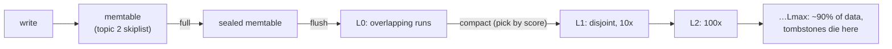

# Topic 4 — LSM-Tree Deep Dive

> You know the memtable (topic 2) and the B-tree alternative (topic 3). This
> topic is the rest of the LSM machine: SST anatomy, bloom filters, and
> compaction — a scheduling problem wearing a storage-engine costume.

## Outcomes

By the end you can:
1. Draw an SST from blocks to trailer and explain restart points + prefix truncation.
2. Derive write amplification for leveled vs tiered compaction and check it by
   measurement on your own mini-LSM.
3. Explain Monkey's bloom-bit allocation argument in one paragraph.
4. Say when a write stalls in RocksDB and why stalls are load-shedding, not bugs.

---

## 1. The lifecycle (the map for everything below)



Reads run the same path in reverse: memtable → sealed → L0 (every run!) → one
segment per deeper level (disjoint ⇒ binary search by key range). Every skipped
disk probe is a bloom filter earning its bits.

## 2. Inside an SST

```
 ┌─────────────┬─────────────┬──────┬─────────────┬────────┬─────────┐
 │ data block  │ data block  │  …   │ filter block│ index  │ trailer │
 │ (~4KB, LZ4) │             │      │ (bloom)     │ block  │ /meta   │
 └─────────────┴─────────────┴──────┴─────────────┴────────┴─────────┘
   inside a data block (restart interval 16):
   [FULL key ∥ v][shared=5,rest ∥ v][shared=7,rest ∥ v]…[FULL key]…[restart offsets]
    ▲ binary search over restart points, linear decode between them
```

Prefix truncation *inside* blocks (vs topic 3's B-tree pages which stored full
keys) works because blocks are immutable — write once, no in-place updates to
break the delta chain. Immutability is the LSM superpower: checksums per block,
whole-file bloom filters, compression — all trivial when nothing mutates.

## 3. Compaction — the actual design space

| Strategy | Merge trigger | Write amp | Read amp | Space amp |
|---|---|---|---|---|
| **Leveled** | level size > target (10x ratio) | high: ~10 per level ⇒ O(10·L) | low: 1 run/level | low (~1.1) |
| **Tiered** | K runs of similar size | low: ~1 per level | high: K runs/level | high (~K) |
| **FIFO** | size cap | 1 | n/a | 1 | 
| Lazy hybrids (Dostoevsky) | tiered upper, leveled last | between | between | between |

RocksDB's leveled score: `L0: files/trigger; L1+: level_bytes/target_bytes`
(compaction_picker_level.cc:229–233) — highest score compacts first. **Write
stalls** are the back-pressure valve: L0 ≥ 20 files ⇒ slowdown, ≥ 36 ⇒ stop
(column_family.cc:1019–1043). No stall mechanism ⇒ unbounded compaction debt ⇒
reads degrade forever. Stalls are the honest choice.

```
 write amp intuition, leveled, ratio T=10:
 a key is rewritten ~once per level it descends through, but each merge into
 level i drags ~T bytes of level-i data per byte of level-(i-1) data:
 WA ≈ T/2 · levels ≈ 5 · log_T(n/memtable)      ← measure this in your mini-LSM
```

## 4. Filters: paying DRAM to skip IO

- Classic rule of thumb: 10 bits/key ⇒ ~1% false positives, k≈7 hashes.
- **Monkey's insight**: uniform bits/key is suboptimal — a false positive at a
  big bottom level costs the same IO as one at a tiny upper level, but the
  bottom level has ~T× more keys per filter bit. Optimal: **more bits/key at
  smaller levels**, exponentially decreasing down the tree; same total DRAM,
  ~2× fewer false positives.
- RocksDB ships bloom (cache-local, FastLocalBloom) and **ribbon** filters
  (~30% smaller, slower to build — CPU-for-DRAM trade; filter_policy.cc:658).

## 5. Code reading (5–7 h)

- **lsm-tree crate** (the engine under fjall — read it all, it's small).
  → guided walkthrough: [`reading-lsm-tree.md`](reading-lsm-tree.md)
- **RocksDB `db/compaction/` + `table/block_based/`** — the industrial version.
  → guided walkthrough: [`reading-rocksdb-compaction.md`](reading-rocksdb-compaction.md)

## 6. Papers (4–6 h)

- "Monkey: Optimal Navigable Key-Value Store" (SIGMOD '17).
  → reading guide: [`reading-monkey.md`](reading-monkey.md)
- "Dostoevsky: Better Space-Time Trade-Offs for LSM-Tree Based Key-Value Stores
  via Adaptive Removal of Superfluous Merging" (SIGMOD '18).
  → reading guide: [`reading-dostoevsky.md`](reading-dostoevsky.md)
- "RocksDB: Evolution of Development Priorities in a Key-value Store Serving
  Large-scale Applications" (TODS '21).
  → reading guide: [`reading-rocksdb-tods.md`](reading-rocksdb-tods.md)
- "Constructing and Analyzing the LSM Compaction Design Space" (VLDB '21).
  → reading guide: [`reading-compaction-design-space.md`](reading-compaction-design-space.md)

## 7. Experiments (in `experiments/`)

Build a **mini-LSM** (scaffold compiles; `todo!()` where the learning is).
Optionally follow skyzh/mini-lsm alongside — but the point here is the *measurement*:

1. `src/memtable.rs` — wrap your topic-2 skiplist (or BTreeMap to start).
2. `src/sst.rs` — block-based SST writer/reader: 4KB blocks, restart points
   every 16, per-block xxhash, whole-file bloom (10 bits/key).
3. `src/lsm.rs` — put/get/scan, flush at 1MB, **pluggable compaction**:
   `Leveled` (ratio 10) and `Tiered` (K=4).
4. **The experiment** (`src/bin/write_amp.rs`): load 10M keys (uniform random
   overwrite, 3 passes), count bytes written to disk / bytes of user data —
   write amp per strategy. Also record: read amp (segments probed per get,
   bloom hits/misses), space amp (dir size / live data). Fill the RUM table
   with MEASURED numbers.

## 8. Capstone milestone M4 (in `../../capstone/`)

- [ ] LSM-backed persistence alternative: graph snapshots/deltas as SSTs behind
      the M1 storage trait.
- [ ] Bench B+tree (M3) vs LSM backends: graph-mutation stream (edge inserts,
      property updates) and bulk-load; report write amp + p99 with tail-latency
      discipline (topic 0 rules).
- [ ] Note where FalkorDB's actual persistence (redis RDB/AOF fork-snapshot)
      sits relative to both — neither B-tree nor LSM; that comparison seeds topic 5.

## Done when

Mini-LSM passes tests; the write-amp table (leveled vs tiered, measured vs
predicted) is in `notes.md`; you can explain Monkey's allocation and the stall
triggers without looking.
