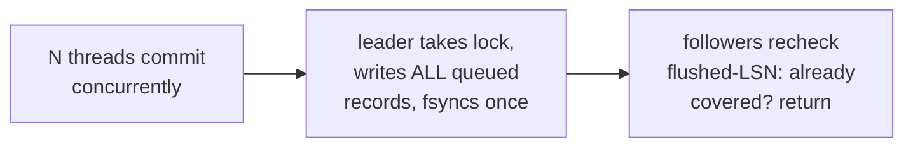

# Topic 5 — Durability: WAL, fsync, Crash Recovery

> The hardest part to get right, because the failure you're defending against
> deletes the evidence. Four systems, four durability designs: postgres (ARIES-
> style redo), turso/SQLite (WAL with checksum chain), LMDB (topic 3: no log at
> all), redis (AOF command log + fork snapshots).

## Outcomes

By the end you can:
1. State the WAL rule (log reaches disk before the page it protects) and derive
   why each system's recovery works from it.
2. Explain torn pages and the two industrial fixes (full-page writes, double-write).
3. Measure the fsync ladder on your own SSD and design group commit from it.
4. Ship a WAL + crash recovery for your topic-3 B+tree that survives `kill -9`.

---

## 1. The problem and the rule

A 4KB page write is not atomic (power loss mid-sector-train = **torn page**),
and the kernel lies about write completion until fsync. The fix is one
invariant:

```
 WAL rule: log record describing a change is durable BEFORE the changed page.
 commit rule: commit record durable before acknowledging the client.

 write path:            crash recovery:
 1. append log record   1. find last valid log record (checksums!)
 2. fsync log           2. redo forward from last checkpoint
 3. ack client          3. undo losers (if update-in-place; ARIES)
 4. page write LATER       — or skip undo entirely (COW/append-only designs)
```

## 2. Four designs on one axis

```
 no log ◄──────────────────────────────────────────────► log is the database
 LMDB              turso WAL              postgres            redis AOF
 COW + meta flip   frames = page imgs     ARIES redo +        the command
 (topic 3)         appended, checkpoint   FPI after ckpt,     stream itself,
                   moves them home        undo via MVCC       replayed on boot
```

- **turso/SQLite WAL**: every commit appends whole page images as *frames*;
  a frame with `db_size != 0` marks a commit. Reads check the WAL first
  (page→frame map), the DB file second. Checkpoint = copy frames back.
  Recovery = scan frames, verify the **checksum chain**, stop at the last
  valid commit. No undo, ever — uncommitted frames are simply ignored.
- **postgres**: logical/physiological records, not page images — except the
  **first touch of each page after a checkpoint writes a full-page image**
  (torn-page defense). Recovery = redo from checkpoint; undo is MVCC's job
  (dead tuples), not the log's.
- **redis AOF**: log = the commands. `appendfsync everysec` trades ≤1s of
  acknowledged writes for throughput — a *policy* choice the others don't offer.
  RDB = fork + COW snapshot (durability by checkpoint only).
- **RocksDB WAL**: LevelDB record format — 32KB blocks, records fragmented
  as FULL/FIRST/MIDDLE/LAST with per-fragment CRC (`db/log_format.h:22,54`,
  `log_writer.cc:87 AddRecord → EmitPhysicalRecord`). Block-aligned so a torn
  tail never hides an earlier record. Memtable + WAL replaces undo entirely.

## 3. The fsync ladder (measure it — experiment 1)

| Call | Guarantees | Typical cost (SSD) |
|---|---|---|
| `write()` | nothing (page cache) | ~µs |
| `fdatasync()` | data + size metadata | ~50–500µs consumer, ~10µs enterprise |
| `fsync()` | + all metadata | ≥ fdatasync |
| macOS `fsync()` | **drive cache NOT flushed** | fast and weak |
| macOS `F_FULLFSYNC` | drive cache flushed | ms-scale — measure it! |
| `O_DIRECT` + own buffering | bypass page cache | topic 6 |

Group commit exists because of this ladder: if fsync costs 1ms, one fsync per
commit caps you at 1K commits/s — but one fsync can cover N commits.



Postgres does exactly this: `XLogFlush` rechecks `LogwrtResult.Flush` after
acquiring the lock (xlog.c:2885) — most backends find their work already done.

## 4. Code reading (5–7 h)

- **postgres `xlog.c`** (10K lines — guided skim).
  → guide: [`reading-postgres-xlog.md`](reading-postgres-xlog.md)
- **turso WAL** — frame format, checksum chain, checkpoint, recovery.
  → guide: [`reading-turso-wal.md`](reading-turso-wal.md)
- **redis `aof.c` vs `rdb.c`** — command log vs fork snapshot (the FalkorDB
  reality today).
  → guide: [`reading-redis-aof-rdb.md`](reading-redis-aof-rdb.md)

## 5. Papers (3–5 h)

- Mohan et al., "ARIES" (TODS '92) — summary first, then selected sections.
  → guide: [`reading-aries.md`](reading-aries.md)
- "Aether: A Scalable Approach to Logging" (VLDB '10) — group commit +
  log-contention analysis on multicore.
  → guide: [`reading-aether.md`](reading-aether.md)

## 6. Experiments (in `experiments/`)

1. **`src/bin/fsync_ladder.rs`** (provided, runs now) — measure write/
   fdatasync/fsync/F_FULLFSYNC latency on YOUR disk. HdrHistogram; the numbers
   feed every design decision below.
2. **`src/wal.rs`** — WAL for the topic-3 B+tree: record format
   (LSN, page_no, before/after or page image — your call, justify in notes),
   CRC per record, group-commit API (`commit_many`).
3. **`src/bin/crash_test.rs`** — crash injection: child process inserts keys,
   parent `kill -9`s it at a random moment, reopens, verifies: every
   acknowledged key present, no torn state, unacked keys either fully in or out.
   Run 100 rounds.
4. **`benches/commit_throughput.rs`** — fsync-per-commit vs group commit
   (batch 8/64/512) vs `appendfsync everysec`-style. Plot commits/s vs
   durability window.

## 7. Capstone milestone M5 (in `../../capstone/`)

- [ ] WAL + crash recovery for graph mutations (node/edge/property ops as
      logical records) behind the storage trait.
- [ ] Crash-injection suite (the `crash_test` harness, pointed at the graph).
- [ ] Contrast written up: your WAL vs FalkorDB-on-redis (RDB fork snapshot +
      AOF command replay) — what's the durability window of each config?

## Done when

100/100 crash rounds pass; the fsync ladder table and commit-throughput plot
are in `notes.md`; you can explain why turso needs no undo and postgres needs
no logged undo either (MVCC), while ARIES needs both.
