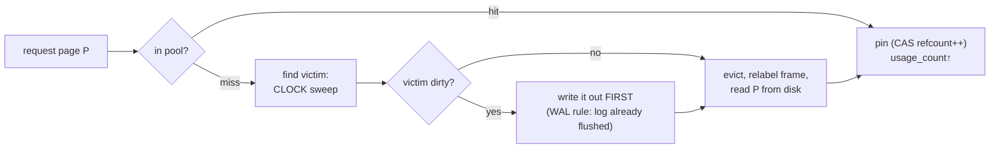

# Topic 6 — Buffer Pool & Memory Management

> Who decides which pages live in RAM? Four answers: postgres (CLOCK over a
> shared array), DuckDB (approximate-LRU queue with lazy purging), LeanStore
> (pointer swizzling — no mapping table at all on the hot path), and mmap
> (let the kernel decide — the CIDR '22 paper on why that's usually wrong).
> Plus redis's answer to a different question: not page caching but
> *allocator accounting* (zmalloc + jemalloc + active defrag).

## Outcomes

By the end you can:
1. Walk a page request through hash-lookup → pin → CLOCK victim search and
   say where every atomic and lock is.
2. Explain why mmap loses to a buffer pool (TLB shootdowns, no write
   ordering, page-fault stalls you can't schedule around) and when it's fine.
3. Explain pointer swizzling and the cooling stage — how LeanStore makes an
   in-memory hit cost ~0 extra instructions.
4. Build a CLOCK buffer pool for your topic-3 B+tree and beat mmap on a
   larger-than-RAM workload (or measure exactly why you don't).

---

## 1. The translation problem

Every buffer pool is a map `page_id → frame`, and every design is a stance on
who pays for the translation:

```
                     lookup cost per hot-page hit
 hash table (postgres, DuckDB)     ~1 hash probe + partition lock/atomics
 swizzling  (LeanStore)            0 — the parent's pointer IS the frame ptr
 page table (mmap/OS)              0-ish until a TLB miss / minor fault
                                   ... then the kernel takes over your latency
```



## 2. Eviction: three shapes of approximate-LRU

- **postgres CLOCK** — one `nextVictimBuffer` atomic ticks around a fixed
  array; each buffer has a 4-bit `usage_count` (max 5). Sweep decrements;
  a buffer survives up to 5 laps. Pinned buffers are skipped. No linked
  lists, no per-hit list surgery — a hit is just a saturating increment.
- **DuckDB eviction queue** — unpinning enqueues `(weak_ptr, seq_num)` into a
  concurrent FIFO. Re-pinning doesn't remove the entry (too expensive);
  it bumps the handle's sequence number so the stale entry becomes a **dead
  node**, purged in bulk every 4096 insertions. Approximate LRU where the
  cleanup is amortized, not per-op — same move as topic 2's incremental rehash.
- **LeanStore cooling stage** — no global order at all: random buffer frames
  get *unswizzled* into a cooling FIFO (~10% of pool). A cool page touched
  again is re-swizzled cheaply (second chance); reach the FIFO's end and
  you're evicted. Randomness replaces bookkeeping.

## 3. Pointer swizzling (LeanStore) in one diagram

```
 swip = one u64 in the PARENT node          (bit 63: evicted, bit 62: cool)
 ┌─────────────────────────────────────────────────────────┐
 │ HOT      00…pointer…   direct BufferFrame* — deref it   │
 │ COOL     01…pointer…   frame in cooling FIFO — CAS back │
 │                        to HOT, done (no I/O, no map)    │
 │ EVICTED  10…page id…   page fault: alloc frame, read,   │
 │                        swizzle pointer                  │
 └─────────────────────────────────────────────────────────┘
```

Consequence: a page can only be referenced by ONE parent (else two swips to
re-swizzle) — fine for B-trees, awkward for arbitrary graphs. Worth pondering
for the capstone: matrix blocks form a tree of tiles, so swizzling applies.

## 4. Why mmap is (usually) wrong — the CIDR '22 checklist

1. **No write ordering** — the kernel flushes dirty pages whenever; WAL's
   "log before page" needs `msync` gymnastics or is simply unenforceable.
2. **TLB shootdowns** — evicting a page means IPIs to every core that might
   cache the mapping; scales *worse* with more cores.
3. **Page-fault stalls** — a fault blocks the thread; no async I/O, no
   admission control, no prefetch you control.
4. **Error handling** — I/O errors arrive as SIGBUS mid-instruction.

But: LMDB (topic 3) ships on mmap happily — read-mostly, single-writer,
COW keeps ordering trivial. The paper's "usually" is doing real work.
vmcache (SIGMOD '23) is the synthesis: virtual memory *assisted* — mmap the
address space, but the DB keeps explicit control of residency and eviction.

## 5. redis: the other memory management

No pages — redis manages *allocations*. `zmalloc` wraps jemalloc with
per-thread cache-line-aligned `used_memory` counters (the maxmemory
enforcement input), and active defrag literally re-allocates values whose
jemalloc bins are underutilized and updates every pointer. FalkorDB's
matrices live inside this world: GraphBLAS blocks are zmalloc'd, counted
against maxmemory, and *opaque* to redis defrag.

## 6. Code reading (5–7 h)

- **postgres `bufmgr.c` + `freelist.c`** — packed atomic state, CLOCK,
  buffer rings. → [`reading-postgres-bufmgr.md`](reading-postgres-bufmgr.md) — postgres bufmgr: a buffer's life in one atomic word
- **DuckDB buffer manager** — eviction queue with dead nodes, memory
  reservations, spill-to-temp. → [`reading-duckdb-buffer.md`](reading-duckdb-buffer.md) — DuckDB's buffer pool: eviction by queue of hints
- **LeanStore** — swips, cooling stage, hybrid latches.
  → [`reading-leanstore.md`](reading-leanstore.md) — LeanStore in code: swips, cooling, hybrid latches
- **redis `zmalloc.c`** (+ turso's CLOCK page cache as a bonus).
  → [`reading-redis-zmalloc.md`](reading-redis-zmalloc.md) — zmalloc: memory management when there are no pages

## 7. Papers (4–6 h)

- "Are You Sure You Want to Use MMAP in Your DBMS?" (CIDR '22).
  → [`reading-mmap-paper.md`](reading-mmap-paper.md) — mmap is not a buffer pool
- "LeanStore: In-Memory Data Management Beyond Main Memory" (ICDE '18) +
  vmcache (SIGMOD '23) as the sequel. → [`reading-leanstore-paper.md`](reading-leanstore-paper.md) — LeanStore & vmcache: pay only on the miss

## 8. Experiments (in `experiments/`)

1. **`src/buffer_pool.rs`** — CLOCK buffer pool: fixed frame array,
   `page_id → frame` map, pin/unpin with usage counts, dirty-page write-back
   on eviction. Tests fix the contract (pinned pages never evicted, dirty
   pages written before reuse, capacity respected).
2. **`src/bin/pool_vs_mmap.rs`** — same random-read workload over a file 4×
   larger than the pool/RAM budget: your pool vs mmap. HdrHistogram —
   compare p50 AND p99.9 (the mmap story is in the tail).
3. **`benches/eviction.rs`** — CLOCK vs strict-LRU (linked list) vs FIFO on
   Zipf-skewed access: hit rate AND ns/lookup. Shows why nobody ships strict
   LRU (per-hit list surgery costs more than the hit-rate gain).

## 9. Capstone milestone M6 (in `../../capstone/`)

- [ ] Buffer pool under the persistent backends — graphs larger than RAM.
- [ ] Decide: per-backend pools or one shared pool with MemoryTag-style
      accounting (DuckDB)? Write the tradeoff down.
- [ ] Reproduce mmap write-back unpredictability once, on your Mac, with
      numbers in notes.

## Done when

Your pool beats mmap at p99.9 on the larger-than-RAM benchmark (or you can
explain the exact kernel behavior that prevented it); the eviction bench
table is in notes.md; you can explain a swip and a dead node from memory.
