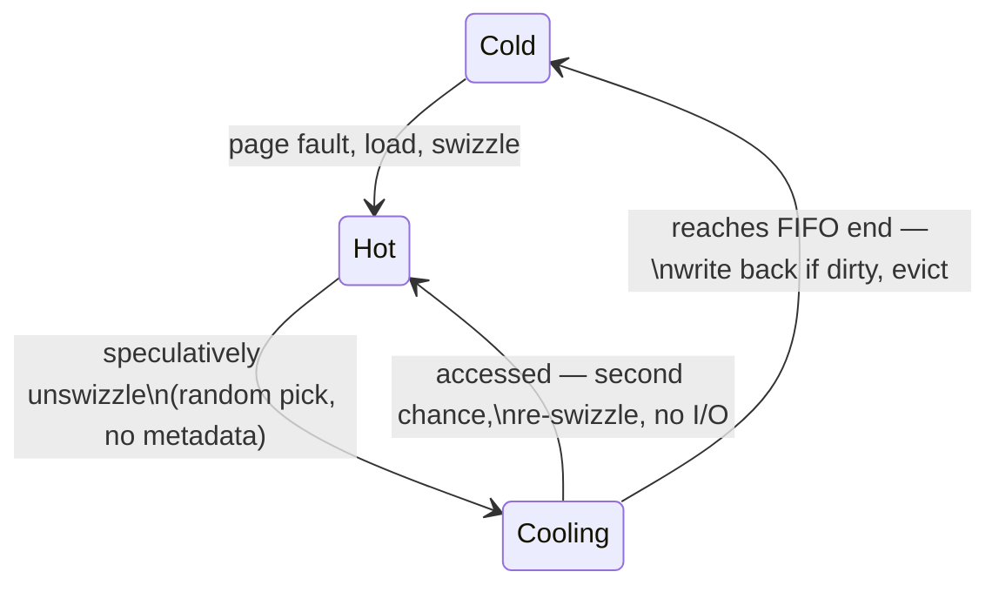

# LeanStore & vmcache: pay only on the miss

Two papers, one arc: how to make a buffer-managed system as fast as an
in-memory one. LeanStore (ICDE '18) eliminates the per-access costs with
pointer swizzling, a cooling stage, and optimistic latches; vmcache
(SIGMOD '23), from the same group, is "what we'd do differently five years
later" — same goal, mechanism moved into the MMU. This chapter builds the
ideas one at a time — the tax a classic pool charges on every hit, then the
three LeanStore ingredients that zero it out, then what the ablation actually
measured, then vmcache as the retraction-and-fix — before pointing you at the
sections that matter.

Section numbers below are Leis, Haubenschild, Kemper, Neumann,
*"LeanStore: In-Memory Data Management Beyond Main Memory"* (ICDE 2018,
12 pages), and Leis, Alhomssi, Ziegler, Loeck, Dietrich,
*"Virtual-Memory Assisted Buffer Management"* (SIGMOD 2023, 14 pages). Every
number carries the section, figure or table it came from. The vmcache code
quoted in Step 8 is the authors' reference implementation
[`viktorleis/vmcache`](https://github.com/viktorleis/vmcache) at commit
`1157828`, with the line numbers it occupies there.

## The problem in one sentence

A classic buffer pool charges a hash lookup plus a latch plus a pin-count
update on *every page access, even when the page is already in RAM* — and the
LeanStore authors' own ablation puts a number on it: rebuilding LeanStore
with a translation hash table, LRU and traditional latches drops
single-threaded TPC-C from **67K to 30K transactions/s**, and ten-threaded
TPC-C from **597K to 18K** (LeanStore Fig. 7), which is why in-memory systems
like HyPer simply deleted the buffer manager and gave up larger-than-RAM data
to get the speed back.

## The concepts, step by step

### Step 1 — the per-access tax of a classic buffer pool

> **In:** nothing yet — this step fixes the vocabulary and prices the thing
> the whole design is trying to delete.
> **Out:** three named costs (translation, replacement bookkeeping, pinning),
> each of which Steps 2, 4 and 5 remove in turn.

A **buffer pool** is the fixed-size in-memory cache of disk pages the engine
manages itself. It exists to answer one question on every access: given a
**page id** — the page's number in the file, its permanent name — find the
**frame**, the RAM slot currently holding it. In the canonical design (§I,
citing Effelsberg and Härder) that means a hash table lookup per access, and
in typical implementations the structures involved are protected by several
**latches** — short-lived locks over in-memory structures, as opposed to
transactional locks over data.

Three costs, then, on the hot path of every hit:

1. **Translation** — hash the page id, take the partition latch, probe.
2. **Replacement bookkeeping** — LRU list surgery, or a Second Chance bit
   to set. §III-B: "for frequently accessed pages (e.g., B-tree roots),
   updating access tracking information … sometimes becomes a scalability
   bottleneck."
3. **Pinning** — `pinPage` increments a per-page reference count so eviction
   cannot take the frame while you hold a pointer into it; `unpinPage`
   decrements. §III-C counts the damage in Shore-MT: **15 latch acquisitions
   for a single-row update transaction**, and names the mechanism —
   "cacheline ping-pong", where a line holding a hot latch bounces between
   cores because cache coherency must serialize writes to it.

How big is that? Two measurements, from the two papers.

LeanStore's Fig. 7 ablation, single-threaded and ten-threaded TPC-C, 100
warehouses, 16 KB pages, on an Intel Xeon E5-2687W v3 (10 cores, 20 threads):

```
                     baseline   +swizzling   +lean evict   +opt. latch
 1 thread              30K         48K           62K           67K
10 threads             18K         23K          109K          597K

 what the classic design costs, as division (LeanStore Fig. 7):
   1 thread:  1 − 30/67   = 55% of the achievable throughput given up
  10 threads: 597/18      = 33× — and note 18K < 30K: the traditional
                             design got SLOWER with ten threads than one
```

vmcache's Table 2 prices the same tax as a microbenchmark of pure hits —
average instructions, cache misses and latency for a random 4 KB page access,
over 128 GB of data:

```
                            instructions   cache misses   time
  plain memory read              3.3            1.0       219 ns
  vmcache full access logic     10.4            2.0       236 ns
  hash table (unsynchronized)   27.9            2.6       336 ns

  hash table over a plain read:  336/219 = 1.53×,  +117 ns per access
  hash table over vmcache:       336/236 = 1.42×,  +100 ns per access
  instruction ratio:            27.9/10.4 = 2.7×
```

The paper's own caveat matters: "our hash table implementation is not
synchronized, and the shown overhead is therefore actually a lower bound for
the true cost of any hash table based design" (§5.4). The 100 ns is what a
*single-threaded, latch-free* hash table costs.

LeanStore's goal (§I) is to pay for translation and replacement **only on
misses**. Three ingredients, each killing one of the three costs:

```
 1. pointer swizzling   translation cost → 0    (parent holds a raw pointer)
 2. cooling stage       replacement cost → 0    (no per-access bookkeeping;
                        random candidates + a second-chance FIFO)
 3. optimistic latches  pinning cost → 0        (readers validate versions,
                        write nothing)
```

Why it matters: those three lines are the paper's whole structure, and Step 7
checks each against the ablation that measured it.

### Step 2 — pointer swizzling: the parent's pointer IS the translation

> **In:** the translation cost from Step 1.
> **Out:** the **swip** — the 8-byte reference that is either a pointer or a
> page id — which Steps 3 and 4 then have to evict, and which Step 8's
> vmcache deletes again.

**Pointer swizzling** means storing, in the slot where a page id would go,
the actual in-memory pointer to the frame. Following a B-tree parent-to-child
link is then one dereference and zero lookups. The paper's name for that slot
is a **swip**: "the reference, i.e. the 8-byte memory location referring to a
page" (§IV-B). A swip is **swizzled** when it holds an in-memory pointer and
**unswizzled** when it holds an on-disk page id, and §III-A says exactly how
the two are told apart: "We use pointer tagging (one bit of the 8-byte
reference) to distinguish between these two states."

One bit, one branch. §III-A's summary sentence is the design in a line: "the
buffer management overhead of accessing a hot page merely consists of one
conditional statement that checks this bit." Or §I, less formally: "accessing
an in-memory page merely involves a simple, well-predicted if statement
rather than a costly hash table lookup."

The consequence for the architecture is bigger than the branch. The
translation table has not been made faster; it has been **deleted and
scattered into the data structure itself** (§IV-A: "a traditional page
translation table is not needed because its state is embedded in the
buffer-managed data structures"). Note the detail in §III-A that keeps
recovery possible: swizzled pages still have page identifiers, they are just
stored in the frame rather than in the reference.

Why it matters: a hot access now costs what an in-memory system charges. The
cost has moved entirely onto the miss, where a disk read dwarfs it anyway.

### Step 3 — the price of swizzling: one owning swip, bottom-up eviction

> **In:** the swip from Step 2.
> **Out:** two structural constraints — a page has exactly one incoming
> reference, and parents are evicted after children — that decide whether a
> given data structure can live on this design at all. Step 9 asks that
> question about matrix tiles.

If two swips pointed at the same page, one could be swizzled and the other
unswizzled at the same time, and there is no central table to reconcile them
with. §IV-B works the example: a page `Px` referenced by `Py` and `Pz` "can
be referenced by one swizzled and one unswizzled swip at the same time.
Maintaining consistency, in particular without using global latches, is very
hard and inefficient." So LeanStore imposes the rule: **each page has a
single owning swip**, and the buffer pool "in its entirety a forest of
pages."

The same reasoning forces **bottom-up eviction**: "we never unswizzle (and
therefore never evict) a page that has swizzled children" (§IV-B). The reason
is not policy but correctness — an evicted parent's swip slot is written to
disk, and if it held a memory pointer, "pages containing memory pointers
might be written out to disk, which would be a major problem because a
pointer is only valid during the current program execution."

The mechanism is §IV-E's **iteration callback**: every buffer-managed data
structure registers a function that iterates the swips on one of its pages
(a no-op for leaves), and each page carries a marker saying which callback it
belongs to. When a randomly picked inner page turns out to have a swizzled
child, the buffer manager does not give up — Fig. 5: it "will try to unswizzle
one of the encountered swizzled child pages (randomly picking one of these)",
which "implicitly prioritizes inner pages over leaf pages during
replacement", i.e. inner nodes tend to stay resident. Finding the parent to
un-swizzle *through* uses parent pointers stored in the frame, which are
cheap to maintain precisely because children are always unswizzled first and
the pointers are never persisted.

Two honest caveats the guide's usual summary drops. First, §IV-B says the
single-swip rule "is not a fundamental limitation of our approach" and
sketches two escapes: several parent pointers per frame (enough for
B+tree inter-leaf links), or "fat" swips carrying both a page identifier and
a pointer. Second, the rule is not original to LeanStore — §IV-B credits
Graefe et al.'s swizzling-based buffer manager with the same decision.

Why it matters: this is the constraint that decides admissibility. A B-tree
is a forest of single-parent pages and fits. A graph, or a matrix tile
referenced by both a row index and a column index, does not — which is
question 4 below, and the reason Step 8's vmcache exists.

### Step 4 — the cooling stage: replacement with zero per-access work

> **In:** the swizzled/unswizzled distinction from Step 2 and the
> bottom-up rule from Step 3.
> **Out:** a replacement policy that writes nothing on a hit — and the
> measured hit-rate bill for that, which Step 7 spends.

Every classic policy does bookkeeping on *each access* so it can know what is
cold later. §III-B refuses, and states the change of perspective precisely:
"Instead of tracking frequently accessed pages in order to avoid evicting
them, our replacement strategy identifies infrequently-accessed pages."

The mechanism is speculative un-swizzling. Pick a **random** page in the pool
— no metadata is consulted, because none is maintained — and unswizzle its
reference *without* evicting the page. It is now **cooling**: unswizzled but
still in RAM. Cooling pages sit in a FIFO queue, most recently unswizzled at
the front, and are evicted (after a write-back if dirty) when they reach the
end. Touch one before then and it is pulled out of the queue and re-swizzled,
with no I/O at all: §III-B calls this the **second chance**, "a grace period
before it is evicted", which is what makes a policy this crude survivable.

Fig. 3's state machine, which is worth being able to draw:



`Hot` = in RAM, swip swizzled. `Cooling` = in RAM, swip *unswizzled*.
`Cold` = on SSD, swip unswizzled. Note that `Cooling` and `Cold` are
indistinguishable from the swip alone — that is what the next bullet is
about.

Four implementation details the summaries usually lose, all from §IV-C:

- **The cooling stage is a FIFO *plus a hash table*.** A cooling page's swip
  is unswizzled — it holds a page id, not a tag pointing at the frame — so
  an accessor cannot tell "cooling" from "on disk" by looking at the swip.
  It looks the page id up in the cooling stage's hash table, which maps page
  ids to queue entries; a hit there means the page is still in RAM, and it is
  removed from both the hash table and the queue before being swizzled.
- **Nothing cools until memory runs short.** "The cooling stage is only used
  when the free pages in the buffer pool are running out."
- **The unswizzling is done by worker threads, synchronously, not by a
  background thread.** §IV-C considers both and chooses: "We use the second
  option in order to avoid the risk of background threads being too slow."
  Whenever a thread requests an empty page or swizzles one, it checks whether
  the cooling percentage is below the threshold and unswizzles a page if
  needed. (The modern LeanStore *code* does use dedicated page-provider
  threads — the vmcache paper §5.1 configures it with 8 of them — so if you
  read the repo expecting the paper's design, this is where they diverge.)
- **One global latch protects the cooling stage**, and the paper defends it:
  the latch is only taken on the cold path, where I/O costs "orders of
  magnitude more than a latch acquisition" anyway.

The target is ~10% of the pool in the cooling state (§III-B), and §VI-B
justifies the number rather than asserting it: throughput was measured with
the cooling stage swept from 1% to 50% across Zipf factors (Fig. 11),
"performance is very stable … in particular for reasonable settings between
5% and 20%". Only around skew 1.6 — where the working set is close to the
buffer pool size — does the setting cost more than 10%.

Why it matters: randomness replaces bookkeeping. The hot path writes nothing
at all, which is the only way to satisfy §III-C's rule that "programs that
frequently write to memory locations accessed by multiple threads do not
scale."

### Step 5 — optimistic latches: readers that hold nothing

> **In:** the pinning cost from Step 1.
> **Out:** readers that write no shared state — and the safety hole that
> creates, which Step 6 closes.

Pinning exists so eviction cannot yank a page mid-read, but a pin is a write
to a shared cache line on every access, which is the ping-pong of Step 1.
§IV-F replaces it with an **optimistic latch**: the latch is an update
counter incremented after every modification, and "readers can proceed
without acquiring any latches, but validate their reads using the version
counters instead". Read the version, do the work, re-read the version — equal
means the read was consistent, changed means retry.

The protocol built on top is **Optimistic Lock Coupling** (§IV-F, citing
Leis et al.), which "ensures consistent reads in tree data structures without
physically acquiring any latches during traversal". Writers usually latch
only the page they modify; only structure-modification operations such as
splits latch several. §III-C states the resulting shape: "lookups on swizzled
pages do not acquire any latches at all".

Why it matters: this is the ingredient that makes swizzling *safe* rather
than merely fast. A reader holding no pin cannot block eviction — but it also
cannot stop it, which is the problem Step 6 exists to solve.

### Step 6 — epoch-based reclamation: how a page is safely reused

> **In:** Step 5's readers, which hold nothing, and Step 4's cooling queue.
> **Out:** the rule that decides *when* a cooling page's memory may actually
> be handed to someone else — the piece most retellings of this paper drop.

If readers neither latch nor pin, what stops the buffer manager from reusing
a frame while a thread is still reading it? §IV-G's answer is **epoch-based
reclamation**, borrowed from latch-free data structures: one global epoch
counter that grows periodically, plus a local epoch per thread.

The protocol (Fig. 6): before touching any buffer-managed structure, a thread
copies the global epoch into its local one — it has "entered" that epoch —
and on finishing sets its local epoch to ∞, meaning it holds nothing. When a
page is unswizzled into the cooling stage it is tagged with the global epoch
at that moment. Right before it is actually evicted, the buffer manager
checks the *minimum* local epoch across all threads: only when every thread
has moved past the page's epoch can no thread still hold a pointer into it,
and only then may the memory be reused. Note the economy — the paper points
it out — that only cooling pages carry an epoch, never hot ones, so the hot
path again writes nothing.

Why it matters: "readers hold nothing" is not free; the cost was moved from a
per-access atomic to a per-eviction epoch comparison, which is paid on the
cold path where Step 4 already spends a latch.

### Step 7 — what the three ingredients actually bought

> **In:** the three ingredients (Steps 2, 4, 5–6).
> **Out:** the measured in-memory parity, the measured hit-rate loss, and
> the measured out-of-memory behaviour — the evidence Step 8's redesign had
> to preserve.

**In-memory (§V-B).** Single-threaded TPC-C, 100 warehouses (10 GB), buffer
pool large enough for all of it: LeanStore 67K txns/s against an in-memory
B-tree at 69K — `67/69 = 97%` of a system with no buffer manager at all —
while BerkeleyDB manages 10K and WiredTiger 16K (Fig. 1). The comparison is
clean by construction: §V-A says the in-memory and buffer-managed B-trees
"have the same page layout and synchronization protocol", so the 3% is
buffer management and nothing else. Scaling on the
10-core machine (Fig. 8): BerkeleyDB peaks at 20K with 5 threads (2.4×),
WiredTiger reaches 8.8× at 20 threads, LeanStore 8.8× at 10 threads and 12.6×
with HyperThreading. Fig. 7's ablation, quoted in Step 1, says which
ingredient bought what: single-threaded, swizzling and lean eviction are the
big two (30K → 62K, roughly 2×) and optimistic latches add little because
one thread contends with nobody; at ten threads all three are required, and
missing any one collapses the result.

**The hit-rate bill (§VI-B).** This is the number to know, because it is the
honest cost of replacing bookkeeping with randomness. The authors traced all
page accesses and simulated other policies — 5 GB data set, 1 GB buffer pool,
Zipf factor 1.0:

```
 Random  FIFO   LeanEvict(5%/10%/20%/50%)   LRU    2Q     OPT
 92.5%   92.5%   92.7  92.8  92.9  93.0     93.1%  93.8%  96.3%

 LeanEvict at its recommended 10% against LRU:
   hit rate:  93.1 − 92.8            = 0.3 percentage points
   miss rate:  7.2% vs  6.9%         = 4.3% more misses, relative
   against the theoretical optimum:  96.3 − 92.8 = 3.5 points
```

Nobody is far from anybody except OPT, which is unimplementable. §VI-B draws
the conclusion the arithmetic supports: "the page hit rates do not directly
translate into performance, as more complex strategies like LRU and 2Q would
also result in a higher runtime overhead" — you pay 4.3% more misses to make
every hit free.

**Out-of-memory (§VI).** With a 20 GB pool and TPC-C growing from 10 GB to
50 GB (Fig. 9), LeanStore "stays close to the in-memory performance although
around 500 MB/sec are written out to the SSD in the background", while the
in-memory B-tree left to Linux swapping "drops severely and is highly
unstable". Fig. 10's lookup benchmark (5 GB data, 1 GB pool, 20 threads)
shows the shape of graceful degradation across skew: 92K lookups/s at 76K
I/Os per second under a uniform distribution, up to 143M lookups/s with zero
I/Os at the highest skew — a 1,554× range set entirely by how much of the
working set the replacement strategy manages to keep.

Why it matters: "as fast as an in-memory system" is a claim about the hot
path, and these are the three measurements that pin it — parity in memory, a
0.3-point hit-rate loss, and no cliff when the data stops fitting.

### Step 8 — vmcache: keep the goal, drop the swizzling

> **In:** everything above — and specifically Step 3's one-swip constraint,
> which is the thing being paid to remove.
> **Out:** the same "pay only on the miss" property with translation done by
> the MMU, and a page-state array that replaces both the swip and the latch.

Swizzling works but *infects the whole codebase*: every data structure must
know about swips, honour one-parent, and cooperate with cooling. vmcache
(SIGMOD '23) keeps the goal and moves translation into the hardware.

- **The mapping is virtual memory.** vmcache reserves an **anonymous**
  mapping — `mmap` with `MAP_ANONYMOUS`, backed by no file, so CIDR '22's
  trap ([`reading-mmap-paper.md`](reading-mmap-paper.md)) does not apply
  because the kernel never learns which file the bytes belong to — at least
  as large as the storage. Page *pid* always lives at `virtMem + pid`, and
  the **MMU**, the address-translation hardware, does the lookup for free.
- **Residency stays with the DBMS.** A page is brought in with an explicit
  `pread` *into that fixed address* (§3.1), and thrown out with
  `madvise(…, MADV_DONTNEED)`, having been written back with `pwrite`/libaio
  first if dirty. Nothing happens that the buffer manager did not ask for.
- **A page-state array replaces the swip.** One 64-bit word per page: 8 bits
  of lock state and 56 bits of version counter (§3.6), so the word *is*
  Step 5's optimistic latch. The states are Unlocked, a shared-reader count,
  Locked, **Marked** and Evicted.
- **Any page may have any number of references.** Step 3's constraint is
  gone, so graphs are fine — which is Table 1's `graphs: yes` column, and the
  reason this design matters for a graph-store capstone.

The state machine is small enough to read in full. This is the authors'
reference implementation, not pseudocode:

```cpp
// viktorleis/vmcache@1157828 — vmcache.cpp, PageState's constants, 74-81
    74  struct PageState {
    75     atomic<u64> stateAndVersion;
    76
    77     static const u64 Unlocked = 0;
    78     static const u64 MaxShared = 252;
    79     static const u64 Locked = 253;
    80     static const u64 Marked = 254;
    81     static const u64 Evicted = 255;
```

Line 75 is the whole idea: one atomic word holds the state *and* the version,
so a reader validates residency and consistency in a single load. Values
0–252 double as the shared-reader count, which is why the special states
start at 253.

```cpp
// viktorleis/vmcache@1157828 — vmcache.cpp, BufferManager::fixX, 682-702
   682  Page* BufferManager::fixX(PID pid) {
   683     PageState& ps = getPageState(pid);
   684     for (u64 repeatCounter=0; ; repeatCounter++) {
   685        u64 stateAndVersion = ps.stateAndVersion.load();
   686        switch (PageState::getState(stateAndVersion)) {
   687           case PageState::Evicted: {
   688              if (ps.tryLockX(stateAndVersion)) {
   689                 handleFault(pid);
   690                 return virtMem + pid;
   691              }
   692              break;
   693           }
   694           case PageState::Marked: case PageState::Unlocked: {
   695              if (ps.tryLockX(stateAndVersion))
   696                 return virtMem + pid;
   697              break;
   698           }
   699        }
   700        yield(repeatCounter);
   701     }
   702  }
```

The line to look at is **690**, and then 696: both return `virtMem + pid`.
The address does not depend on whether the page was resident — there is
nothing to translate, ever. The only difference between a hit and a miss is
whether `handleFault` (675-680: `ensureFreePages`, `readPage`, insert into
the resident set) ran first. That is "pay only on the miss", expressed as
control flow.

Replacement is **CLOCK**, not a cooling FIFO: §3.4 marks Unlocked pages
`Marked` ahead of need, any access clears the mark, and pages still marked
when the evictor comes round are taken. Note where the mark lives — in the
same word as the latch, so clearing it is something an access does anyway.
Eviction runs in batches of 64 through the five numbered steps of §3.4, which
are literally the comments in the code (`0. find candidates` at 760,
`1. write dirty pages` at 783, `4. remove from page table` at 804 where the
`madvise(MADV_DONTNEED)` sits at 814).

The bill for all this is a page-state array plus page tables: §3.6 computes
8.016 bytes of page table per 4 KB of storage, plus 8 bytes of page state —
about **16 bytes of DRAM per 4 KB on disk**, so 4 GB for a 1 TB SSD, or
`1/256` of capacity.

And the honest weakness, §5.3: basic vmcache is bound by the kernel's
page-table manipulation once misses are frequent. Out-of-memory random
lookups run about **60% faster with the exmap kernel module** than without,
and without exmap vmcache is "substantially slower than LeanStore" on that
workload, though still ahead of WiredTiger and the mmap-based LMDB. For
TPC-C the gap is small "because even vmcache manages to become I/O bound".

### Step 9 — the map of the design space

> **In:** all three designs (classic pool, LeanStore, vmcache) and the mmap
> chapter's fourth.
> **Out:** the table you should be able to reconstruct from memory, and the
> question it answers for the capstone.

```
 classic:    translation in a HASH TABLE (a lookup on every hit)
 LeanStore:  translation in POINTERS     (swips; invasive; tree-shaped data)
 vmcache:    translation in the MMU      (virtual addressing; any ref graph)
 mmap:       translation in the MMU      — but RESIDENCY in the kernel too
 LeanStore + vmcache: replacement and residency decided by the DB, never the OS
```

vmcache's own Table 1 lays the same comparison out over six designs, and the
two rows that matter for a graph store are `graphs` (mmap yes, traditional
yes, pointer swizzling **no**, vmcache yes) and `control` (mmap: OS;
everything else: DBMS). The CIDR '22 mmap paper
([`reading-mmap-paper.md`](reading-mmap-paper.md)) is the missing middle:
mmap with *kernel*-controlled residency is the trap, and vmcache is
mmap-style addressing with DB-controlled residency.

Why it matters: the capstone's data is matrix tiles addressed by row *and*
column. Step 3 says that is not a forest, so the swizzling column is closed
to it, and this table is where you find out which columns are still open.

## How to read the papers (with the concepts in hand)

Read LeanStore first, then vmcache as the retraction-and-fix. You have read
the code ([`reading-leanstore.md`](reading-leanstore.md)), so in the LeanStore
paper focus on:

| Section | How to read it | Step |
|---|---|---|
| §I–II | The problem statement and Fig. 1's four bars. Skim; Step 1 has it. | 1 |
| §III-A | Pointer swizzling in one page. The sentence to keep: hot-page overhead is "one conditional statement". | 2 |
| §III-B | **Read carefully.** The change of perspective — identify *cold* pages instead of tracking hot ones — and the 10% cooling target. | 4 |
| §III-C | Why latches, not I/O, are the bottleneck: 15 latch acquisitions per Shore-MT row update, and cacheline ping-pong. | 1, 5 |
| §IV-B | **Read carefully.** The single-owning-swip rule and why eviction is bottom-up. Note the two escapes it offers (multiple parent pointers, "fat" swips). | 3 |
| §IV-C | The cooling stage as implemented: FIFO **plus a hash table**, unswizzling done synchronously by worker threads, one global latch defended. | 4 |
| §IV-E, Fig. 5 | The iteration callback, and why replacement implicitly favours inner pages. | 3 |
| §IV-F–G | Optimistic latches, then epoch-based reclamation — the second is what makes the first safe. | 5, 6 |
| §V-B, Fig. 7 | The ablation. Read the 10-thread row before the 1-thread row. | 7 |
| §VI-B | The hit-rate table (LeanEvict 92.8% vs LRU 93.1% vs OPT 96.3%) and Fig. 11's cooling-size sweep. | 4, 7 |

In vmcache: §3.1–3.2 (the primitives and the page-state machine — Step 8's
code is its skeleton), §3.4 (clock over the state array, batched eviction),
§3.6 (why an extra cache miss for the state word is nearly free: both
addresses are known upfront, so the CPU issues them in parallel), Table 1 and
Table 2, then §5.3 for what exmap is actually worth.

## Questions to answer in notes.md

1. Reproduce LeanStore Fig. 1's argument as arithmetic: hash probe (topic-0
   DRAM numbers) + latch CAS per access, × accesses per TPC-C txn — what
   fraction of in-memory runtime is the classic pool?
2. Why does the cooling stage need to be a FIFO and not a stack? (Second
   chance requires *time* between cool and evict.)
3. vmcache's page-state word vs postgres's packed buffer state
   (buf_internals.h) — same bits, different home. What does colocating
   state-with-translation (vmcache) buy over a separate descriptor array?
4. For the capstone: GraphBLAS matrix tiles referenced by row and column
   indexes = a DAG, not a tree. Which of the two designs is even admissible,
   and what would the swizzling workaround cost?

## Takeaway

Three ingredients, three deleted costs: swizzling deletes translation,
the cooling stage deletes replacement bookkeeping, optimistic latches (plus
epochs) delete pinning. The measured result is 97% of an in-memory B-tree's
single-threaded TPC-C for 0.3 hit-rate points against LRU. vmcache keeps the
property and pays for it in DRAM (16 bytes per 4 KB page) instead of in
invasiveness — which is the trade a graph-shaped capstone has to take.

## Done when

Answer each before unfolding it.

- [ ] You can state what each of the three LeanStore ingredients eliminates, and which of them the ablation says matters most — at one thread, and at ten.

  <details><summary>Answer</summary>

  Pointer swizzling eliminates **translation**: the parent's swip holds the
  frame pointer, so §III-A's "one conditional statement that checks this bit"
  replaces a hash probe under a partition latch. The cooling stage eliminates
  **replacement bookkeeping**: nothing is written on a hit, because cold
  pages are found by random sampling plus a second chance rather than by
  tracking hot ones (§III-B). Optimistic latches eliminate **pinning**:
  readers validate a version counter instead of incrementing a shared
  reference count (§IV-F).

  Fig. 7 measures which matters. At one thread: 30K baseline → 48K with
  swizzling → 62K with lean eviction → 67K with optimistic latches, so
  swizzling and eviction are ~2× together and the latches add ~8%, because a
  single thread contends with nobody. At ten threads: 18K → 23K → 109K →
  597K, a 33× swing, and all three are required — the baseline at ten threads
  (18K) is *slower* than the baseline at one (30K), which is what a
  contended global hash table and a single LRU list do to scaling.

  </details>

- [ ] You can explain the one-owning-swip rule and derive bottom-up eviction from it, rather than remembering it.

  <details><summary>Answer</summary>

  §IV-B's argument: if a page `Px` were referenced by both `Py` and `Pz`, one
  swip could be swizzled and the other unswizzled at the same instant, and
  since swizzling deleted the central translation table there is nothing to
  reconcile them with — "maintaining consistency, in particular without using
  global latches, is very hard and inefficient". So every page has exactly
  one incoming reference and the buffer pool is a forest.

  Bottom-up eviction falls out of the same fact. A parent's swip slot is
  *part of the page*, so evicting a parent writes its swips to disk. If a
  child were still swizzled, the value written would be a raw memory pointer,
  and "a pointer is only valid during the current program execution" — the
  child would be unreachable after restart. Hence §IV-B: never unswizzle a
  page with swizzled children. §IV-E implements it with a per-data-structure
  iteration callback, and when an inner page is picked but has a swizzled
  child, it unswizzles a randomly chosen child instead — which implicitly
  keeps inner nodes resident (Fig. 5).

  </details>

- [ ] You can say what a cooling page's swip contains, and how an accessor discovers the page is still in RAM.

  <details><summary>Answer</summary>

  It contains a **page id**, not a pointer: cooling means *unswizzled but
  still resident* (§III-B, Fig. 3). So the swip alone cannot distinguish
  "cooling in RAM" from "cold on SSD" — checking the tag bit says only "not
  swizzled".

  The discovery happens in the cooling stage, which §IV-C says is a FIFO
  queue *and* a hash table mapping page identifiers to queue entries. An
  accessor that finds an unswizzled swip looks the page id up there; a hit
  means the page is in memory, and it is removed from the hash table and from
  the queue, then swizzled — no I/O. That is the second chance. A miss means
  a real page fault. This is the detail that separates the paper from the
  later code, where the frame reference carries a "cool" tag bit and the
  lookup goes away.

  </details>

- [ ] You can price the cooling stage's randomness against LRU with the paper's own hit rates, and say why the trade is worth taking.

  <details><summary>Answer</summary>

  §VI-B's traced simulation, 5 GB data set, 1 GB buffer pool, Zipf 1.0:
  random 92.5%, FIFO 92.5%, LeanEvict 92.8% at the recommended 10% cooling,
  LRU 93.1%, 2Q 93.8%, OPT 96.3%. So LeanEvict gives up 0.3 percentage points
  of hit rate to LRU — in miss terms, 7.2% against 6.9%, which is 4.3% more
  misses.

  It is worth taking because the cost is paid on the miss path, where a page
  fault costs microseconds, and the saving is paid on the hit path, where
  vmcache's Table 2 measures a hash-table access at 336 ns against 236 ns and
  27.9 instructions against 10.4 — for an *unsynchronized* table, i.e. a
  lower bound. §VI-B's own conclusion: hit rates "do not directly translate
  into performance, as more complex strategies like LRU and 2Q would also
  result in a higher runtime overhead".

  </details>

- [ ] You can explain in two sentences why vmcache can drop swizzling without giving back the hot-path win — and name what it pays instead.

  <details><summary>Answer</summary>

  Because the translation that swizzling avoided is done by hardware anyway:
  every page lives at the fixed address `virtMem + pid` in an anonymous
  mapping, so the MMU resolves it during the load itself and both `fixX`'s
  returns are the same expression (`vmcache.cpp:690` and `:696`) whether the
  page was resident or not. The DBMS keeps the part mmap gets wrong —
  residency — by faulting with an explicit `pread` and evicting with
  `madvise(MADV_DONTNEED)` (`vmcache.cpp:814`).

  It pays in DRAM and in kernel time. §3.6: about 16 bytes of DRAM per 4 KB
  of storage (8.016 bytes of page table plus an 8-byte page state), which is
  4 GB for a 1 TB SSD. And §5.3: page-table manipulation becomes the
  bottleneck when misses are frequent — out-of-memory random lookups are
  about 60% faster with the exmap kernel module, and without it vmcache is
  substantially slower than LeanStore on that workload. What it buys for that
  price is Step 3's constraint: any page may have any number of incoming
  references.

  </details>

- [ ] You wrote answers to all four questions in notes.md, including the admissibility verdict for matrix tiles.

  <details><summary>Answer</summary>

  There is no answer to unfold — the verdict is the exercise. The bar: decide
  whether a tile addressed by both a row index and a column index has one
  owning reference or two, and if two, say which of §IV-B's escapes you would
  take ("fat" swips carrying both id and pointer, or several parent pointers
  per frame) and what it costs in bytes per frame and in eviction complexity.
  "Use vmcache instead" is a legitimate answer, but only with the DRAM
  arithmetic from §3.6 attached.

  </details>

## References

**Papers**
- Leis, Haubenschild, Kemper, Neumann — *"LeanStore: In-Memory Data
  Management Beyond Main Memory"* (ICDE 2018, 12 pages) —
  [PDF](https://db.in.tum.de/~leis/papers/leanstore.pdf)
- Leis, Alhomssi, Ziegler, Loeck, Dietrich — *"Virtual-Memory Assisted Buffer
  Management"* (vmcache/exmap, SIGMOD 2023, 14 pages) —
  [PDF](https://www.cs.cit.tum.de/fileadmin/w00cfj/dis/papers/vmcache.pdf) —
  read after LeanStore, as the retraction and the fix

| Where | What this chapter took from it |
|---|---|
| LeanStore §I, Fig. 1 | 67K (LeanStore) vs 69K (in-memory B-tree) vs 16K (WiredTiger) vs 10K (BerkeleyDB) single-threaded TPC-C |
| LeanStore §III-A | swips, pointer tagging with **one** bit, "one conditional statement" per hot access |
| LeanStore §III-B | identify cold pages instead of tracking hot ones; random candidates; the second chance; ~10% cooling |
| LeanStore §III-C | 15 latch acquisitions per Shore-MT single-row update; cacheline ping-pong |
| LeanStore §IV-B | the single owning swip; never unswizzle a page with swizzled children; the two escapes from the rule |
| LeanStore §IV-C | the cooling FIFO *and* its hash table; unswizzling done synchronously by worker threads; the global cooling latch |
| LeanStore §IV-E, Fig. 5 | the iteration callback; inner pages implicitly favoured |
| LeanStore §IV-F–G, Fig. 6 | optimistic latches; epoch-based reclamation, and that only cooling pages carry an epoch |
| LeanStore §V-A | the machine: Xeon E5-2687W v3, 10 cores, 64 GB, Linux 4.8, 16 KB pages, ~4K lines of C++ |
| LeanStore §V-B, Fig. 7 | the ablation: 30/48/62/67K at 1 thread, 18/23/109/597K at 10 |
| LeanStore §V-B, Fig. 8 | scaling: BerkeleyDB 2.4×, WiredTiger 8.8×, LeanStore 8.8× at 10 threads / 12.6× with SMT |
| LeanStore §VI-A, Fig. 9 | 20 GB pool, data growing 10 → 50 GB, ~500 MB/s written back, swapping unstable |
| LeanStore §VI-B, Figs. 10–11 | 92K → 143M lookups/s across skew; the hit-rate table; the 1–50% cooling sweep |
| vmcache §3.1–3.2 | anonymous mapping, `pread` into the fixed address, `MADV_DONTNEED`, the four page states |
| vmcache §3.4 | clock via the Marked state; batched eviction in five steps |
| vmcache §3.6 | 8.016 B page table + 8 B page state per 4 KB ≈ 16 B/page; parallel access to state and data |
| vmcache Table 1 | the six-design comparison; `graphs: no` for pointer swizzling |
| vmcache Table 2 | 219 / 236 / 336 ns and 3.3 / 10.4 / 27.9 instructions per random page access |
| vmcache §5.1, §5.3 | the setup (EPYC 7713, 128 GB pool, 1 TB workloads); exmap worth ~60% on out-of-memory random lookups |

**Code**
- [viktorleis/vmcache](https://github.com/viktorleis/vmcache) at `1157828` —
  the paper's reference implementation, a single 1855-line `vmcache.cpp`.

| File | Lines | What |
|---|---|---|
| `vmcache.cpp` | 74-81 | `PageState`: one atomic word, states Unlocked/shared/Locked/Marked/Evicted |
| `vmcache.cpp` | 675-680 | `handleFault` — ensure free pages, read, insert into the resident set |
| `vmcache.cpp` | 682-702 | `fixX` — the state machine of Step 8; both returns are `virtMem + pid` |
| `vmcache.cpp` | 755-825 | batched eviction, its five numbered steps as code comments |
| `vmcache.cpp` | 814 | `madvise(MADV_DONTNEED)` — the eviction primitive itself |
