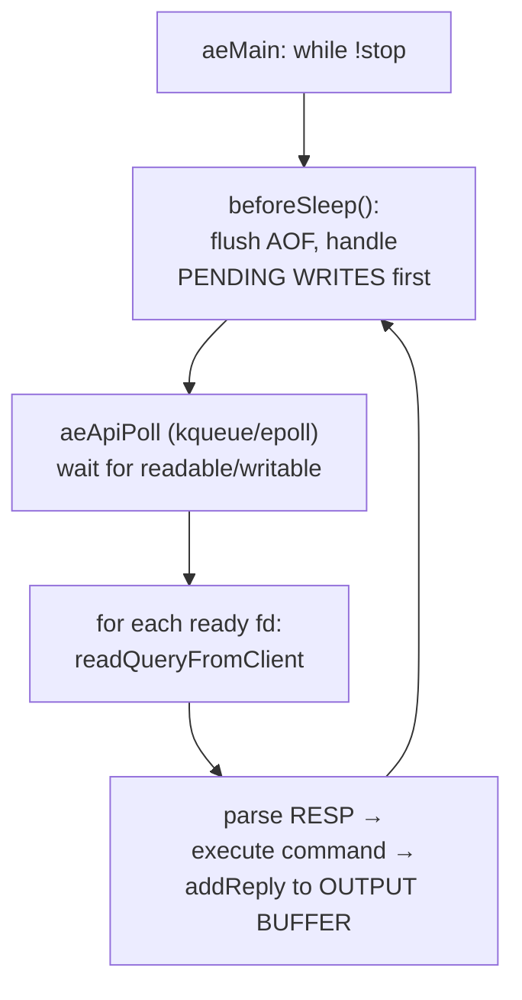

# Topic 7 — Networking, Protocols & Event Loops

> Redis's speed is as much about `ae.c` and RESP as about data structures.
> You know FalkorDB's module side — this topic is about owning the server
> side: one loop, many sockets, and a protocol designed to be parsed with
> `memchr`.

## Outcomes

By the end you can:
1. Parse and generate RESP2/RESP3 from memory, and explain each design
   choice (length prefixes, CRLF, type-first bytes) in parser terms.
2. Narrate one full redis event-loop iteration: poll → read → parse →
   execute → queue reply → write, and say what beforeSleep does.
3. Explain the three threading models (single loop, io-threads, thread-per-
   core) and what each serializes.
4. Ship a tokio RESP server that survives `redis-benchmark`, and read its
   flamegraph.

---

## 1. RESP: a protocol optimized for the parser

```
 client:  *2\r\n $3\r\n GET\r\n $3\r\n foo\r\n
          │      │                └ bulk string, length-prefixed: read(3)
          │      └ each arg: $<len> — NO scanning for terminators
          └ array header: argc up front — allocate argv once

 server:  $3\r\n bar\r\n         +OK\r\n        :42\r\n      -ERR msg\r\n
          bulk                   simple          integer      error
```

Why it's fast to parse:
- **Length prefixes everywhere** — the parser never scans payload bytes; it
  reads a small integer, then `memcpy`s exactly that many. Binary-safe for
  free. (Contrast: HTTP/1 header parsing scans for `\r\n\r\n`.)
- **argc first** — `*N` lets the server size `argv[]` before reading args.
- **First byte = type** — a one-byte dispatch, no lookahead.
- RESP3 adds typed replies (maps `%`, sets `~`, doubles `,`, push `>`) so
  clients stop guessing structure from context — same wire discipline.

Inline commands (`PING\r\n`) exist purely so you can debug with `nc`.

## 2. The event loop



The two non-obvious moves:
- **Replies are buffered, not written** — `addReply` appends to a per-client
  buffer and the *next* beforeSleep writes everything with one `write()` per
  client (`handleClientsWithPendingWrites`). Batching by loop iteration.
- **Pipelining falls out for free** — the input buffer may hold 100 commands;
  `processInputBuffer` loops until the buffer is drained, and all 100 replies
  coalesce into one write. This is why `redis-benchmark -P 64` is ~10× -P 1:
  same work, 1/64th the syscalls.

## 3. Three threading models, one question: what's serialized?

| Model | Command execution | I/O + parsing | Example |
|---|---|---|---|
| single loop | serial | serial, same thread | redis ≤5, our M7 v1 |
| io-threads | **serial** (main thread) | parallel | redis 6+, valkey 8 (rewritten) |
| thread-per-core | parallel (keyspace sharded) | parallel, no cross-core locks | DragonflyDB, ScyllaDB, Glauber's essays |

io-threads keep redis's contract (commands are atomic, no locks in data
structures) and parallelize only the syscall+parse layer — valkey 8's rework
made the main thread hand *batches* over SPSC queues and prefetch dict
entries before executing (memory stalls, topic-0 style, hidden by batching).
Thread-per-core abandons the shared keyspace instead: hash-partition keys to
cores, cross-slot ops become messages. FalkorDB inherits redis's model: one
graph = one keyspace entry ⇒ module-level locking is the concurrency story.

## 4. Backpressure — the part everyone forgets

- Input side: `PROTO_IOBUF_LEN` 16KB reads (server.h:188), max query buffer
  size; a client streaming faster than execution grows `querybuf` → kill.
- Output side: `PROTO_REPLY_CHUNK_BYTES` 16KB chunks (server.h:189); a slow
  reader (or a `KEYS *` on 10M keys) grows the reply list →
  client-output-buffer-limit → kill. **A database is a flow-control device**:
  a graph query returning 1M rows must either stream with backpressure
  (pgwire's row-at-a-time) or buffer-and-die (redis's approach).
- pgwire contrast: postgres streams `DataRow` messages inside a
  Simple/Extended Query dance with per-portal row limits — the protocol
  itself has backpressure hooks RESP lacks.

## 5. Bolt: the third answer (RESP vs pgwire vs Bolt)

Three protocols, three answers to the same three questions:

| | framing | typing | streaming |
|---|---|---|---|
| RESP | length-prefixed text markers | strings + ints (client re-parses) | none — full reply or die |
| pgwire | typed binary messages | per-column OIDs, text/binary | portal row limits (pull-ish) |
| Bolt | chunked messages of PackStream structs | full type system incl. Node/Relationship/Path on the wire | **explicit pull**: client sends `PULL {n}` / `DISCARD` |

Bolt is what a protocol looks like when the *data model* lives in the
protocol: PackStream has markers for maps, lists — and graph types
(Node 0x4E, Relationship 0x52, Path 0x50), so a driver hands you a graph
object, not a string table. And streaming is client-driven: after `RUN`,
records flow only when the client asks (`PULL {n:1000}`) — backpressure
designed in, not bolted on (section 4's problem, solved at the protocol
layer). Versioned handshake: 4 bytes magic `0x6060B017` + four proposed
versions; the server picks. →
[`reading-bolt-packstream.md`](reading-bolt-packstream.md) — Bolt &
PackStream: the graph in the type system

## 6. Code reading (5–7 h)

- **redis `ae.c` + `networking.c`** — the loop, the parse path, pending
  writes. → [`reading-redis-ae-networking.md`](reading-redis-ae-networking.md) — The redis event loop: pipelining for free
- **valkey io-threads rework** — SPSC job queues, command-batch prefetch.
  → [`reading-valkey-iothreads.md`](reading-valkey-iothreads.md) — valkey io-threads: parallelize the majority, nothing else
- **pgwire (Rust) + qdrant's tonic setup** — what a protocol crate looks
  like; gRPC as the anti-RESP. → [`reading-pgwire-qdrant.md`](reading-pgwire-qdrant.md) — pgwire & tonic: sessions, portals, and protocols you don't write
- **FalkorDB's removed Bolt server** — `git show 0b11a00b3^:src/bolt/` (it
  was deleted in #2170; the tree one commit back is a complete, compact
  Bolt 5.x implementation). → [`reading-bolt-packstream.md`](reading-bolt-packstream.md) — Bolt & PackStream: the graph in the type system

## 7. Reading (2–3 h)

- "The C10K problem" (Kegel) — the historical why of event loops.
  → [`reading-c10k-thread-per-core.md`](reading-c10k-thread-per-core.md) —
  C10K to thread-per-core: what is a server thread for? (covers Glauber
  Costa's thread-per-core essays + valkey multithreading blog posts in the
  same guide)

## 8. Experiments (in `experiments/`)

1. **`src/resp.rs`** — RESP2 parser/encoder (your build; tests fix the
   format incl. partial-input resumption — the hard part of any wire parser).
2. **`src/bin/server.rs`** — tokio GET/SET/PING/DEL server over your parser
   + a sharded `HashMap`. Compiles against your resp.rs.
3. **Bench protocol** (in notes.md): `redis-benchmark -t get,set -P 1` and
   `-P 64` against (a) your server, (b) real redis on this Mac. Flamegraph
   your server under load; name the top 3 entries.

## 9. Capstone milestone M7 (in `../../capstone/`)

- [ ] RESP server exposing `GRAPH.QUERY` / `GRAPH.RO_QUERY`, wire-compatible
      with falkordb-py (the client must not know it's not FalkorDB).
- [ ] Bench falkordb-py against yours vs real FalkorDB; document the gap.
- [ ] Decide + write down: single loop, io-threads, or thread-per-core — and
      what your choice serializes.
- [ ] Stretch: a Bolt listener on a second port so neo4j drivers connect —
      PackStream encoding of the graph result types (Node/Relationship/Path).

## Done when

Your server handles `redis-benchmark -P 64` without protocol errors; you can
write `*3\r\n$3\r\nSET\r\n…` from memory; you can explain why pipelining
multiplies throughput without touching command execution.
