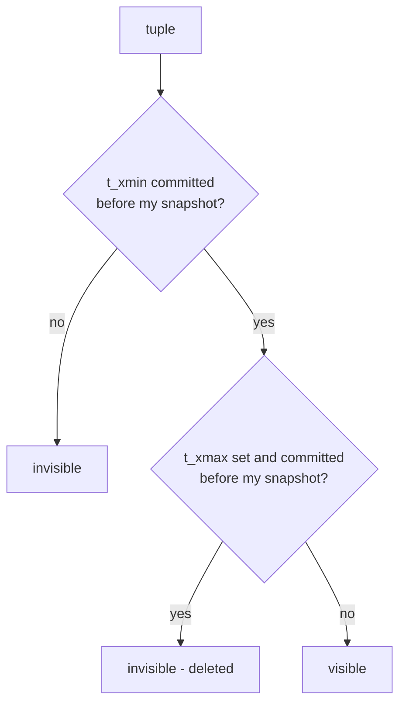

# Topic 8 — Transactions & MVCC

The intellectual core of OLTP. Everything here is one question asked five
ways: *when two transactions touch the same data, who sees what, and who
must die?*

Budget: ~12 h. Order: §1 anomalies → §2 three concurrency schools →
§3 postgres on-disk MVCC → §4 in-memory MVCC → experiments → M8.

## 1. Isolation levels are defined by their bugs

Read the levels bottom-up, as "which anomalies are permitted":

| Anomaly | Shape | RC | RR/SI | Serializable |
|---|---|---|---|---|
| dirty read | read uncommitted write | blocked | blocked | blocked |
| non-repeatable read | re-read sees new commit | **allowed** | blocked | blocked |
| phantom | re-scan sees new rows | **allowed** | blocked* | blocked |
| lost update | r-m-w over another's write | **allowed** | blocked | blocked |
| write skew | disjoint writes, overlapping reads | **allowed** | **allowed** | blocked |

\* postgres RR = snapshot isolation, so phantoms don't appear on re-read —
but SI is *not* serializable, which is the whole point of Berenson '95.

Write skew, the one everyone forgets (and your test suite will demonstrate):

```
 invariant: at least one doctor on call        T1              T2
 oncall = {alice: true, bob: true}       read alice,bob   read alice,bob
                                         (both true)      (both true)
                                         set alice=false  set bob=false
                                         commit ✓         commit ✓
 result: oncall = {} — invariant broken, yet no write-write conflict:
 the write SETS are disjoint; the danger is in the read→write overlap.
```

## 2. Three schools of concurrency control

| | 2PL (pessimistic) | OCC (optimistic) | MVCC |
|---|---|---|---|
| readers block writers | yes | no | **no** |
| writers block readers | yes | no | **no** |
| conflict handling | wait (deadlock detect) | validate at commit, abort | first-committer-wins abort |
| cost center | lock manager traffic | wasted work on abort | version storage + GC |
| shines when | high contention | low contention | read-heavy mixes |
| code you'll read | RocksDB pessimistic txn | RocksDB optimistic txn | postgres, surrealdb |

MVCC's bargain: writes never overwrite — they append a new version. Readers
pick the version visible to their snapshot. You pay in space (dead versions)
and in a background debt collector (vacuum / GC). Sound familiar? It's the
LSM bargain (topic 4) applied to time instead of keys.

## 3. Postgres: MVCC on disk

Every heap tuple carries its own visibility metadata (htup_details.h:124–161):

```
 HeapTupleHeader
 ┌──────────┬──────────┬──────────┬─────────────────────┐
 │ t_xmin   │ t_xmax   │ t_ctid   │ infomask hint bits  │
 │ creator  │ deleter  │ next ver │ XMIN_COMMITTED etc. │
 │ xact id  │ (0=live) │ (chain)  │ (cached clog lookups)│
 └──────────┴──────────┴──────────┴─────────────────────┘
 UPDATE = insert new version + set old tuple's t_xmax + link t_ctid.
 DELETE = set t_xmax. Nothing is removed until VACUUM.
```

A snapshot is `(xmin, xmax, xip[])` (snapshot.h:138–165): all xids < xmin
visible, ≥ xmax invisible, in-progress list `xip[]` invisible. Visibility =
pure function of (tuple header, snapshot) — `HeapTupleSatisfiesMVCC`.



HOT updates: if no indexed column changed and the new version fits on the
same page, skip all index updates — index points at the chain head, readers
walk t_ctid within the page. This is why "UPDATE = INSERT+DELETE" is only
*half* true in postgres.

The debt: vacuum. Dead versions accumulate; `heap_page_prune_opt` does
opportunistic per-page cleanup during reads; `heap_vacuum_rel` does the
full pass. XID wraparound is the failure mode that pages DBAs at 3am.

## 4. In-memory MVCC (Hekaton school)

Hekaton flips the postgres layout: versions live in a chain hanging off a
lock-free index; timestamps (begin_ts, end_ts) replace xmin/xmax; commit
processing validates reads (serializable OCC over versions); GC is
cooperative — every thread cleans as it walks.

Wu/Pavlo VLDB'17 measured the design space (version storage: append-only vs
delta vs time-travel; ordering: newest-to-oldest wins; GC: cooperative wins)
— read it as a menu with benchmark-backed prices.

## 5. Code to read (guides in this dir)

| Guide | What you'll trace |
|---|---|
| reading-postgres-heapam.md | tuple headers, SatisfiesMVCC, HOT, prune/vacuum |
| reading-rocksdb-transactions.md | OCC validate-at-commit vs 2PL TryLock, same base class |
| reading-surrealdb-tx.md | txn layer over pluggable KV, versioned reads as API |
| reading-ansi-critique.md | Berenson '95 — why ANSI's definitions were broken |
| reading-ssi-postgres.md | SSI: rw-antidependency pyramids, VLDB'12 |
| reading-inmemory-mvcc.md | Wu/Pavlo empirical evaluation + Hekaton |

Further references: Kung & Robinson "On Optimistic Methods for
Concurrency Control" (TODS 1981) — the OCC school's founding paper
(read/validate/write phases; RocksDB's OptimisticTransaction is this,
verbatim); one of the most-cited DB papers of all time.

## 6. Experiments (`experiments/`)

`src/mvcc.rs` — YOU implement MVCC with snapshot isolation over an in-memory
KV store. The tests fix the contract:
- snapshots are stable; uncommitted writes invisible; read-your-own-writes
- write-write conflict → first-committer-wins abort
- `write_skew_happens_under_si` — a test that PASSES when the anomaly
  occurs (you must be able to produce the bug before you prevent it)
- `Mode::Serializable` prevents it (track read sets; abort on rw-conflict)
- GC drops versions older than the oldest active snapshot

`src/bin/txn_bench.rs` — provided; runs once mvcc.rs compiles: threaded
throughput of your MVCC vs a single `Mutex<HashMap>`, read-heavy (95/5) and
write-heavy (50/50) mixes. Predict the crossover in notes.md first.

## 7. M8 checklist (capstone)

- [ ] Design the MVCC graph: copy-on-write matrices + versioned reads.
      Key question: the version unit — whole matrix? tile? delta? (A graph
      txn touching 1% of a matrix shouldn't copy 100% of it. Delta matrices
      from topic 20 ARE pending versions.)
- [ ] Single-writer/multi-reader first (FalkorDB's actual model) — write
      down what that buys (no write-write conflicts, no validation) and
      what it costs (write throughput ceiling)
- [ ] Then study the reference's `mvcc_graph.rs`/`cow.rs` and diff against
      your design in notes.md
