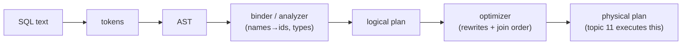

# Topic 10 — Query Engines I: Parsing, Planning, Optimization

The optimizer is the database's brain — and the part that fails most
gracefully-looking while costing 100×. Directly relevant to Cypher
planning in FalkorDB.

Budget: ~12 h. Order: §1 pipeline → §2 rewrites → §3 join ordering →
§4 cardinality (where it all goes wrong) → §5 architectures → code →
experiments → M10.

## 1. The pipeline



Logical vs physical, the distinction everything hangs on:
- **logical** = WHAT: `Join(A, B, a.x = b.y)` — algebra, no algorithm
- **physical** = HOW: `HashJoin(build=B, probe=A)` — algorithm + costs

One logical plan → many physical plans. The optimizer's job is a search
problem: rewrite the logical plan (safe, always-good transformations),
then pick among physical alternatives with a cost model.

## 2. Rewrite rules (the always-wins)

- **Predicate pushdown** — filter as close to the scan as possible; every
  row filtered early is a row every later operator never sees.
- **Projection pushdown / unused-column elimination** — don't carry
  columns nobody reads (decisive for columnar engines, topic 12).
- **Constant folding, expression simplification** — `1+1=2` at plan time.
- **Cross-join → inner join** — a filter mentioning both sides of a cross
  product IS a join predicate; recognize it or enumerate disaster.
- **Subquery decorrelation** — turn correlated subqueries into joins
  (DuckDB's deliminator; the hardest rewrite family in the pipeline).

These are heuristic ("always good") — no cost model needed. Join ORDER
is the opposite: nothing is always good.

## 3. Join ordering — the combinatorial core

n tables → Catalan-many trees × orderings: 20-way join ≈ 10¹⁸ plans.

- **Selinger DP (1979, still the answer)**: best plan for a SET of
  relations is composed of best plans for its subsets. DP over subsets,
  sized 1..n. O(3ⁿ) worst case but connected-subgraphs-only in practice.
  Keep "interesting orders" (sorted outputs) as separate DP entries.
- **Fallbacks when n is big**: postgres switches to a genetic algorithm
  at `geqo_threshold` (12); DuckDB exits DP for greedy when the pair
  count explodes (plan_enumerator.cpp:234).
- Left-deep vs bushy: Selinger searched left-deep only (pipelining +
  smaller space); modern engines (DuckDB) search bushy — graph pattern
  queries especially want bushy plans.

## 4. Cardinality estimation — where it all goes wrong

Cost models rank plans by estimated CARDINALITIES. The estimates rest on
three lies:

| Assumption | Reality | Blowup |
|---|---|---|
| uniformity (1/NDV per value) | skew: one hot value = 50% of rows | 100× |
| independence: sel(a)×sel(b) | correlated columns (city↔country) | 1000× |
| containment for joins | fk distributions vary | 10× per join |

Errors are MULTIPLICATIVE up the plan tree — "How Good Are Query
Optimizers, Really?" (VLDB '15) measured real systems mis-estimating by
10⁴–10⁶ on the (real-data) JOB benchmark, and showed cardinality error
dwarfs cost-model error. postgres's shrug when it knows nothing:
`DEFAULT_EQ_SEL = 0.005` (selfuncs.h:34) — a constant guess powering
million-dollar plan choices.

Graph angle: a 3-hop Cypher pattern is a 3-way self-join on the edge
relation — cardinality = sparse matrix-product size estimation. Same
problem, different clothes (M10/M20 will meet it as nnz estimation).

## 5. Two optimizer architectures

- **Selinger / bottom-up**: rewrite first, then DP join search with one
  cost model. postgres, DuckDB, your experiment. Simple, predictable.
- **Cascades / top-down (Graefe '95)**: everything — rewrites AND
  physical choices — is a RULE firing in a memo of equivalence groups;
  search is goal-driven with pruning. SQL Server, CockroachDB, DataFusion
  aspires. Pay complexity, get extensibility + on-demand exploration.

```
 memo:  G1 = {Join(G2,G3), Join(G3,G2), HashJoin(G2,G3), ...}
        G2 = {Scan(A), IndexScan(A)}     groups = equivalence classes,
        G3 = {Scan(B)}                   members share cardinality
```

## 6. Code to read (guides in this dir)

| Guide | What you'll trace |
|---|---|
| reading-duckdb-optimizer.md | The readable optimizer: DuckDB's pass pipeline and join-order DP |
| reading-postgres-optimizer.md | Postgres's optimizer: Selinger '79, still in production |
| reading-rust-planner-stack.md | The Rust planner stack: Pratt parsing, rule traits, lazy frames |
| reading-selinger-cascades.md | Selinger and Cascades: the two optimizer architectures |
| reading-how-good-optimizers.md | Cardinality is the whole ballgame: the JOB audit |

Further references:
- "Apache Calcite" (SIGMOD 2018) — the optimizer as a *library*
  (rules + cost model, no storage, no executor); what DataFusion is to
  Rust, Calcite is to the JVM world.
- "Spark SQL: Relational Data Processing in Spark" (SIGMOD 2015) —
  Catalyst: plans as trees, rules as Scala pattern matches; the most
  widely deployed rewrite-rule engine in existence.
- Learned query optimization: "Learned Cardinalities" (Kipf et al.,
  CIDR 2019) attacks §4's problem with a model; "Neo" (VLDB 2019) and
  "Bao" (SIGMOD 2021, Marcus et al.) steer the whole planner — Bao
  picks among hint sets so the classical optimizer stays as the safety
  net. Read after the VLDB'15 paper: they are its direct descendants.

## 7. Experiments (`experiments/`)

Mini planner: sqlparser-rs parses; YOU build the logical plan, pushdown,
join reordering, and cardinality estimation. Tests fix the contract
(filters sink into scans, join order flips when stats flip, estimates
multiply). `explain` binary prints before/after plans — compare with
DuckDB's `EXPLAIN` on the same queries (bench protocol in notes.md).

## 8. M10 checklist (capstone)

- [ ] Cypher-subset grammar: MATCH pattern, WHERE, RETURN — parser +
      binder (var→id, label→matrix)
- [ ] logical plan tree: NodeScan / Expand / Filter / Project — note that
      Expand(direction, label) is your Join
- [ ] rewrite rules: push WHERE into NodeScan; anchor selection (start
      from the most selective label — that's join ordering!)
- [ ] after the fact: diff against the reference's parser/ + planner/ +
      optimizer dirs
