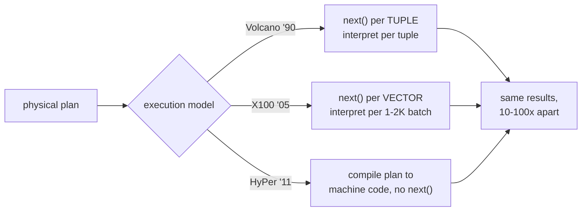

# Topic 11 — Query Engines II: Execution Models

Volcano vs vectorized vs compiled — the defining performance battle of
modern analytics. Topic 10 chose the plan; this topic is about how fast
you can RUN it. The gap between tuple-at-a-time and vectorized execution
is one to two orders of magnitude, and you will measure it yourself.



## 1. The Volcano (iterator) model

Every operator implements `open() / next() / close()`; `next()` returns
ONE tuple. Elegant: operators compose arbitrarily, demand-driven, bounded
memory.

```
 Project.next()
   └─ calls Agg.next()
        └─ calls Filter.next()      per-tuple costs, PER TUPLE:
             └─ calls Scan.next()   - virtual call (indirect branch) x depth
                                    - interpretation of the expression tree
                                    - tuple is gone from registers between calls
```

Postgres still runs this (`ExecProcNode` — a function pointer per node),
and for OLTP it's fine: a point query touches 3 rows; who cares about
per-tuple overhead. The disaster is analytics: 100M rows × 5 operators ×
~20 ns of interpretation overhead = minutes spent NOT computing.

## 2. Vectorized execution (MonetDB/X100 → DuckDB)

Same iterator shape, but `next()` returns a BATCH (DuckDB: `DataChunk`,
2048 rows). All the per-call overhead amortizes over the batch, and the
inner loops become tight `for` over columnar arrays — the compiler
auto-vectorizes, the prefetcher streams, branches disappear.

```
 per-TUPLE model:   overhead × N_rows
 per-VECTOR model:  overhead × (N_rows / 2048)  +  tight loops over arrays
```

Two supporting tricks (both in DuckDB, both worth stealing for M11):

- **Selection vectors**: a filter doesn't copy survivors — it produces an
  index array `sel[]` over the same vectors. Downstream kernels take
  `(data, sel, count)`. Zero copies until materialization is forced.
- **Vector type flags**: a vector can be FLAT, CONSTANT (one value —
  arithmetic with a constant never expands it), DICTIONARY (selection
  over a dictionary — compressed data flows through the engine). Kernels
  dispatch on the combination.

Why 1–2K rows? Big enough to amortize call overhead, small enough that a
chunk's working set stays in L1/L2 between operators. It's the cache
ladder of topic 0 turned into an engine design parameter.

## 3. Compiled execution (HyPer)

Skip interpretation entirely: fuse each PIPELINE (chain of operators
between materialization points) into one tight loop and JIT it — the
tuple stays in CPU registers from scan to sink.

```
 for (row in fact_table)              // one compiled loop = whole pipeline
     if (row.f < 50)                  // filter: a branch, not an operator
         ht[row.k] += row.v;          // agg: an add, not a next() chain
```

VLDB'18 ("Everything You Always Wanted to Know…") raced the two champions:
**roughly equal on aggregation-heavy work; compilation wins complex
expressions and tight OLTP; vectorization wins compile-time (ms vs
100s of ms), profiling, and adaptivity.** DuckDB chose vectors partly for
engineering reasons — no LLVM dependency, debuggable C++ kernels. Topic 19
revisits compilation; M11 goes vectorized.

## 4. Morsel-driven parallelism (SIGMOD'14)

How to parallelize pipelines: break the input into MORSELS (~100K rows),
workers PULL morsels dynamically instead of getting static partitions.

- NUMA-aware: a worker prefers morsels on its socket.
- Elastic: skew doesn't strand workers (no "thread 3 got the hot
  partition"); a slow morsel just means that worker pulls fewer.
- DuckDB: source operators hand out row-group-sized work units
  (122880 rows = 60 vectors); `MaxThreads` on the source caps fan-out.
  polars-stream literally names its unit `Morsel` and pairs it with a
  sequence token so order-sensitive sinks can reassemble.

```
        ┌ morsel queue ┐
 scan:  [m0][m1][m2][m3][m4]...
          ▲    ▲         ▲
        w0 pulls, w1 pulls, w2 pulls   (dynamic — no static split)
 each worker runs the WHOLE pipeline on its morsel:
 scan → filter → probe → partial agg (thread-local HT)
 then: combine partial HTs (the sink's Combine/Finalize phase)
```

## 5. Hash joins and aggregation, vectorized

The two operators where analytics time actually goes.

- **Hash join** (DuckDB `join_hashtable.cpp`): build side materializes
  into row-format tuple data, partitioned by hash radix; the hash table
  stores 8-byte entries = pointer + SALT bits (topic 2's bit-smuggling:
  compare salt before chasing the pointer — most misses never touch the
  tuple). Probe is vectorized: hash 2048 keys, gather 2048 buckets,
  compare salts, chase survivors via selection vector.
- **Hash aggregation**: same skeleton, plus two-phase: threads build
  thread-local partial HTs (no contention), then radix-partitioned
  merge (`RadixPartitionedHashTable`). DataFusion's
  `GroupedHashAggregateStream` interns group keys → dense group index →
  aggregate states live in flat columnar arrays indexed by group id
  (not per-group heap objects).

## Experiments (`experiments/`)

One query, three engines — `SELECT k, SUM(v) WHERE f < t GROUP BY k`:

1. `volcano.rs` — PROVIDED: tuple-at-a-time iterators, dyn dispatch. The
   honest 1990 baseline.
2. `vectorized.rs` — YOU implement: 1024-row batches, columnar arrays,
   selection vectors, group-by into a flat array (k is dense).
3. `kernels.rs` — YOU implement: branchless/SIMD-friendly single-pass
   fused kernel (what a compiled engine would emit for this pipeline).

`cargo test` checks all three agree with a scalar oracle;
`cargo run --release --bin exec_bench` prints rows/s for each — the gap
IS the lesson. Predict the two ratios in notes.md first.

## Reading guides

| guide | what it walks |
|---|---|
| [reading-duckdb-execution.md](reading-duckdb-execution.md) | DuckDB's execution engine: 2048 rows at a time |
| [reading-postgres-executor.md](reading-postgres-executor.md) | Volcano in production: postgres's executor, warts and wisdom |
| [reading-rust-execution-stack.md](reading-rust-execution-stack.md) | Vectorized in Rust: polars-stream morsels and DataFusion streams |
| [reading-x100.md](reading-x100.md) | X100: the vectorization manifesto |
| [reading-compiled-vs-vectorized.md](reading-compiled-vs-vectorized.md) | Compiled vs vectorized: the fair fight ends in a near-tie |
| [reading-morsel-parallelism.md](reading-morsel-parallelism.md) | Morsel-driven parallelism: workers pull, skew dissolves |

Further references: "Photon" (SIGMOD 2022) — Databricks' vectorized
C++ engine, notable for *why not compilation*: easier to build, debug,
and roll out than codegen at their scale; "Velox" (VLDB 2022) — Meta's
reusable execution library (the executor as a component, like Calcite
for topic 10); "GAMMA" (1986) — where exchange-operator parallelism
came from, if you want the pre-history of §4.

## Capstone M11

Vectorized runtime for the graph engine (reference mirror:
`runtime/batch.rs`, `vectorized.rs`, `eval.rs`):

- [ ] batch type: fixed-capacity columnar chunk (node ids, properties) +
      selection vector — pick the batch size by measuring, not by copying
      DuckDB's 2048
- [ ] operator pipeline: source (label scan) → expand → filter → project,
      each `fn next(&mut self, out: &mut Batch)`
- [ ] expression eval over batches (property predicates) — no per-row dyn
      dispatch
- [ ] the FalkorDB angle: Expand over a sparse matrix IS a vectorized
      kernel already (one GraphBLAS call per batch of source nodes);
      decide where matrix ops end and row-ish batches begin
- [ ] bench: M11 runtime vs M10's naive interpreter on the same plan
