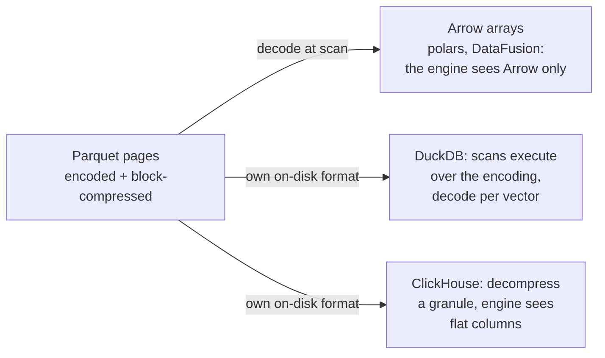

# Arrow & Parquet: the layout compute wants, the bytes disk wants

Two open formats split the columnar world: Arrow is "the layout kernels
compute on" (in memory, O(1) random access, almost no encoding), Parquet is
"the layout bytes rest in" (on disk, encoded then block-compressed, statistics
for pruning). Before you open arrow-rs — one Rust repo, both crates — this
chapter builds each format's design one concept at a time, works the encoding
arithmetic on a single concrete column so the ratios are numbers rather than
adjectives, and then examines the boundary between the two formats, which is
where engines actually still differ.

Every code anchor below is **arrow-rs 59.1.0**, the commit `fed7862` this repo
pins (`Cargo.toml:71` carries the version), quoted with the line numbers the
code occupies in that revision. Every claim about the *format* rather than this
implementation is cited to the specification at
**`apache/parquet-format@apache-parquet-format-2.11.0`**, by section name and
line, because a Rust crate's defaults are not the standard and this chapter is
careful about which is which.

## The problem in one sentence

Compute kernels want every value reachable in O(1) with zero decode, while
disks and networks want the fewest possible bytes — one layout cannot be both
(a delta-encoded value cannot be read without its predecessors), so the
ecosystem standardised TWO layouts and one question: where do you decode?

## The concepts, step by step

### Step 1 — two jobs, two formats

> **In:** nothing yet — this step fixes the vocabulary and the one axis every
> later step is positioned on.
> **Out:** the memory-format/file-format split, and the rule that decides which
> side any given design choice belongs to. Step 2 starts building the memory
> side.

A **row store** keeps all of a row's columns adjacent, so reading one row is
one contiguous read and reading one column of a million rows touches a million
scattered places. A **column store** does the opposite: each column's values
are contiguous, so a query that names 3 of 100 columns reads only those 3.
Reading only the named columns is called **projection** — the relational
operator that drops columns, and in a column store the physical act of never
fetching them. (C-Store's 2005 paper uses "projection" for a completely
different thing — a sorted stored copy of the table; that clash is flagged in
[reading-cstore-compression.md](reading-cstore-compression.md).)

Both formats here are column stores. What separates them is what they are
column stores *for*:

- A **memory format** is a contract about where bytes sit in RAM so that
  independently written code — a Rust kernel, a Python library, a JVM reader —
  can compute over the same buffers with no conversion. Arrow is one.
- A **file format** is a contract about bytes at rest, so data survives, ships,
  and can be read selectively. Parquet is one.

The design pressures are opposite. Arrow forbids anything that breaks O(1)
random access, because a kernel must be able to jump straight to value
173,205. Parquet embraces any encoding that shrinks bytes, because the cost it
optimises is bytes fetched from a disk or an object store.

Why it matters: every "why does Arrow/Parquet do X" question in this chapter
resolves to which side of this split X lives on, and the two formats disagree
on almost every choice below precisely because they are answering different
questions.

### Step 2 — an Arrow array is a recipe of buffers

> **In:** the memory-format side of Step 1.
> **Out:** `ArrayData` — a descriptor plus a list of flat buffers — which is
> the object Steps 3, 4 and 5 each add one buffer kind or one consumer to.

Arrow represents a column (an "array") as a small descriptor plus a fixed list
of raw, contiguous **buffers** — a buffer being an untyped, reference-counted
byte region with no internal structure. There are no per-value objects and no
pointers between values. Every array type is just a different recipe over the
same primitive:

```
 Int64Array      [validity bitmap][values i64 * n]
 StringArray     [validity][offsets i32 * (n+1)][utf8 bytes]
 DictionaryArray [keys array][values array]        <- topic 11's
 ListArray       [validity][offsets][child array]     DICTIONARY vector
```

The descriptor is one struct, and it is worth reading in full because its field
list *is* the contract:

```rust
// arrow-data/src/data.rs — ArrayData, the whole struct, 208-254
   208  pub struct ArrayData {
   209      /// The data type
   210      data_type: DataType,
   211
   212      /// The number of elements
   213      len: usize,
   214
   // ... 215-218: doc comment — the offset applies to buffers and child_data,
   // ...           but explicitly NOT to nulls ...
   219      offset: usize,
   220
   // ... 221-232: doc comment — which buffers a type uses is per-type, and the
   // ...           buffer may be larger than `len` needs ...
   233      buffers: Vec<Buffer>,
   234
   // ... 235-243: doc comment — non-empty only for nested types ...
   244      child_data: Vec<ArrayData>,
   245
   246      /// The null bitmap.
   247      ///
   248      /// `None` indicates all values are non-null in this array.
   // ... 249-252: the rest of the comment — NullBuffer always covers exactly
   // ...           `len` elements even when internally sliced ...
   253      nulls: Option<NullBuffer>,
   254  }
```

The line to look at is 233: `buffers: Vec<Buffer>`. Everything else in the
struct is metadata *about* those bytes — type (210), element count (213), a
starting offset (219), children for nested types (244), and nulls (253).

One correction to make while the struct is open, because an earlier version of
this chapter got it wrong: `ArrayData` does **not** store a null *count*. It
stores `nulls: Option<NullBuffer>` (253), and `None` is the encoding of "no
nulls at all" (248). A count is derivable from the buffer; it is not a field.

A 1M-row `Int64Array` is therefore exactly two allocations: 1,000,000 × 8 B =
8,000,000 B of values, and 1,000,000 bits = 125,000 B of validity bitmap.

Why it matters: "layout as contract" is the whole product. Kernels — topic 11's
polars-compute among them — run on these buffers directly, from any language,
with zero conversion, because there is nothing to convert.

### Step 3 — validity bitmaps: nulls without branches or holes

> **In:** the `ArrayData` buffer list from Step 2, specifically `nulls` (253).
> **Out:** the rule that value *i* always sits at byte offset `i × width`,
> which is the property Steps 4 and 5 both depend on and the thing Parquet's
> encodings in Step 7 give up.

Arrow marks NULLs with a **validity bitmap** — one bit per row, 1 meaning the
value is present — kept in a separate buffer rather than encoded as a sentinel
value or as an omitted slot. Null slots still occupy their full width in the
values buffer.

That costs 125 KB of bitmap per million rows regardless of how many nulls there
are, plus 8 bytes of dead space per null in an Int64 column. It buys the
property that makes kernels branch-free: value *i* is at offset `i × 8` no
matter what precedes it, so a kernel can compute over every slot unconditionally
and mask the nulls afterwards (polars's masked `float_sum`, topic 11).

Why it matters: the "wasted" bytes buy unconditional O(1) addressing. This is
Step 1's memory-side priority chosen explicitly over compactness, and it is the
first place the two formats visibly diverge — Parquet stores nulls as
run-length-encoded definition levels precisely because it does *not* have to
support random addressing.

### Step 4 — offset-based strings: two buffers for a million strings

> **In:** the buffer discipline of Steps 2–3.
> **Out:** the variable-length recipe — one bytes buffer plus one offsets
> buffer — completing the set of buffers that Step 5 then hands to two
> different consumers.

Variable-length data avoids per-value allocation by concatenating all bytes
into ONE buffer and adding an **offsets** buffer of n+1 integers; string *i* is
`bytes[offsets[i] .. offsets[i+1]]`:

```
 values  "ab", "", "xyz":
 offsets [0, 2, 2, 5]
 bytes   [a b x y z]        1M strings = 2 allocations, not 1M
```

The empty string at index 1 is visible as the repeated `2` — no special case,
no sentinel. Compare redis SDS (topic 2): the same "length-prefixed,
cache-friendly" instinct, applied to a million values at once rather than one.

The offsets buffer costs 4 bytes per row for `StringArray` (i32 offsets), which
is why a 1M-row string column carries 4,000,004 B of offsets before a single
character of payload — the same trade as Step 3, bytes spent to keep addressing
unconditional.

Why it matters: this is the last buffer kind, and it completes the claim that
an Arrow array is *only* flat buffers. Everything in Step 5 follows from there
being no pointers to fix up.

### Step 5 — the fork: the same buffers serve slices and the wire

> **In:** the complete buffer set from Steps 2–4.
> **Out:** two consumers of those identical bytes — in-process slices, and the
> IPC wire format — which is why Arrow's layout choices are load-bearing twice.

The buffers built in Steps 2–4 now fork, and the fork is worth its own step
because the two branches are used by different readers and neither copies:

```
                       the SAME Arc'd buffers
                                │
        ┌───────────────────────┴───────────────────────┐
        │                                               │
  in-process slices                                 IPC / Flight
  ArrayData::slice — offset+len over                 write the buffers
  shared buffers, no allocation                      as-is: serialise = memcpy
  (data.rs:605-643)                                  (arrow-ipc/)
```

**Zero-copy slicing**: an array is an `offset` (219) plus a `len` (213) over
shared, atomically reference-counted buffers, so a slice allocates nothing:

```rust
// arrow-data/src/data.rs — ArrayData::slice, the non-nested branch, 605-643
   605      /// Creates a zero-copy slice of itself. This creates a new
   606      /// [`ArrayData`] pointing at the same underlying [`Buffer`]s with a
   607      /// different offset and len
   // ... 608-611: panic documentation ...
   612      pub fn slice(&self, offset: usize, length: usize) -> ArrayData {
   // ... 613-617: checked add, and the assert that the slice is in bounds ...
   618          if let DataType::Struct(_) = self.data_type() {
   // ... 619-633: the nested case — recurse into child_data so the offset
   // ...           propagates down to children ...
   634          } else {
   635              let mut new_data = self.clone();
   636
   637              new_data.len = length;
   638              new_data.offset = offset + self.offset;
   639              new_data.nulls = self.nulls.as_ref().map(|x| x.slice(offset, length));
   // ... 640-643: return new_data ...
```

Lines 637-638 are the whole mechanism: a clone that changes two integers. The
`Vec<Buffer>` cloned at 635 is a vector of `Arc`s, so the byte regions are
shared, not duplicated.

**IPC** — inter-process communication, Arrow's wire format, in `arrow-ipc/` —
is the second consumer: it ships those same buffers as-is, so serialisation is
a length-prefixed `memcpy` rather than an encode. The whole point of
standardising a *memory* layout is that it is already the wire format.

Why it matters: Steps 3 and 4 spent bytes to keep addressing unconditional, and
this step is where that spending is repaid twice — once for every kernel that
slices, once for every process boundary that would otherwise have serialised.

### Step 6 — Parquet: a hierarchy built for selective reading

> **In:** nothing from Arrow — this step crosses to the file-format side of
> Step 1 and starts again from the disk's cost model.
> **Out:** the file → row group → column chunk → page hierarchy, and the footer,
> which Step 7 fills with encodings and Step 8 fills with statistics.

A Parquet file splits data twice before storing anything. The specification's
glossary is three sentences long and defines all of it (`README.md:72-85`):

- a **row group** is "a logical horizontal partitioning of the data into rows"
  containing exactly one column chunk per column (`README.md:72-74`);
- a **column chunk** is "a chunk of the data for a particular column", living
  in one row group and "guaranteed to be contiguous in the file"
  (`README.md:76-77`);
- a **page** is the subdivision of a column chunk, "conceptually an indivisible
  unit (in terms of compression and encoding)" (`README.md:79-81`).

The **footer** is the file metadata, and the spec's layout diagram
(`README.md:95-111`) shows exactly where it sits: the file ends with the
metadata, then a 4-byte little-endian length of that metadata, then the magic
`PAR1`. It is at the *end* so that a writer can stream data in one pass and
still record every chunk's location (`README.md:118`), which means every reader
starts by seeking to the last 8 bytes.

```
 file
 └─ row group                            RowGroupMetaData  (metadata/mod.rs:630)
    └─ column chunk (1 col x 1 rg)       ColumnChunkMetaData          (:808)
       └─ pages                          encoding chosen per page
 footer: thrift metadata + statistics, then a 4-byte length, then "PAR1"
```

The sizes are worth pinning down, because the spec and this implementation do
not agree and both numbers get quoted as if they were one:

| quantity | value | where |
|---|---|---|
| recommended row group size | 512 MB – 1 GB | spec `README.md:280` |
| recommended data page size | 8 KB | spec `README.md:289` |
| arrow-rs default row group | 1024 × 1024 = 1,048,576 rows | `properties.rs:48` |
| arrow-rs default page size limit | 1024 × 1024 = 1 MiB | `properties.rs:30` |
| arrow-rs default page row limit | 20,000 rows | `properties.rs:42` |

The spec argues for small pages because "smaller data pages allow for more fine
grained reading (e.g. single row lookup)" and for large row groups because they
"allow for larger column chunks which makes it possible to do larger sequential
IO" (`README.md:278-289`). arrow-rs ships a 1 MiB page limit anyway — a
128× larger page than the spec recommends — which tells you the modern reader
is assumed to be scanning, not doing single-row lookups.

The hierarchy exists so a reader can grab *pieces*. Want 3 columns of 2 row
groups out of a 500-column, 1000-row-group file? Read the footer, then exactly
6 column chunks. The spec makes the intended parallelism explicit
(`README.md:87-90`): file/row group for MapReduce, column chunk for IO, page
for encoding and compression.

Why it matters: on disk or in an object store the unit of cost is bytes
fetched, and every level of this hierarchy exists so that most bytes are never
fetched at all.

### Step 7 — page encodings, and the RLE/bit-packing hybrid

> **In:** one page's worth of values from the column chunk of Step 6.
> **Out:** that page's bytes, encoded — the first of the two compression layers
> Step 8 stacks, and the input to the decode loop every Parquet scan runs.

Each page's values are encoded with a scheme from a fixed, enumerated menu.
That menu is one Rust enum, and it is the shortest complete statement of what
Parquet can do:

```rust
// parquet/src/basic.rs — enum Encoding, doc comments elided, 388-452
   388  enum Encoding {
   // ... 389-396: PLAIN's per-type byte layout ...
   397    PLAIN = 0;
   // ... 398-403: the deprecated PLAIN_DICTIONARY = 2 ...
   405    /// Group packed run length encoding.
   406    ///
   407    /// Usable for definition/repetition levels encoding and boolean values.
   408    RLE = 3;
   // ... 409-425: the deprecated BIT_PACKED = 4, with its bit-order warning ...
   426    /// Delta encoding for integers, either INT32 or INT64.
   427    ///
   428    /// Works best on sorted data.
   429    DELTA_BINARY_PACKED = 5;
   // ... 430-438: DELTA_LENGTH_BYTE_ARRAY = 6, DELTA_BYTE_ARRAY = 7 ...
   439    /// Dictionary encoding.
   440    ///
   441    /// The ids are encoded using the RLE encoding.
   442    RLE_DICTIONARY = 8;
   // ... 443-450: BYTE_STREAM_SPLIT's doc — K byte-streams, K = sizeof(type) ...
   451    BYTE_STREAM_SPLIT = 9;
   452  }
```

Four of these are the working set, and each is a term this curriculum uses
everywhere, so define them here once:

- **Run-length encoding (RLE)** stores each maximal run of equal values as one
  `(value, count)` pair instead of repeating the value. In Parquet it is
  deliberately *not* general: line 407's comment restricts it, and the spec is
  blunter — RLE is supported only "for repetition and definition levels,
  dictionary indices, [and] boolean values in data pages"
  (`Encodings.md:122-127`).
- **Bit-packing** stores each integer in exactly `w` bits rather than its
  natural 32 or 64, where `w` is the smallest width that fits the largest
  value.
- **Dictionary encoding** stores each distinct value once in a dictionary page
  and replaces the column with integer ids into it. The spec puts the two
  halves in different pages: dictionary page in PLAIN, data page as RLE-encoded
  ids (`Encodings.md:57-60`), and it "will fall back to the plain encoding" if
  the dictionary grows too large (`Encodings.md:53-54`).
- **Delta encoding** stores each value's difference from its predecessor; the
  enum's own comment says it "works best on sorted data" (428), and the crate's
  header warning (`basic.rs:381-385`) is that delta encodings "sacrifice encode
  and decode performance for improved storage efficiency", particularly for
  record skipping under predicate pushdown.

`BYTE_STREAM_SPLIT` is the odd one and the most interesting: it does not shrink
anything. The spec is explicit — "this encoding does not reduce the size of the
data but can lead to a significantly better compression ratio and speed when a
compression algorithm is used afterwards" (`Encodings.md:342-343`). It creates
K streams for a K-byte type and scatters each value's *i*-th byte to the *i*-th
stream (`Encodings.md:345-351`), so that the exponent bytes of a million
doubles — which barely vary — end up adjacent. That is the columns-beat-rows
argument applied one level down, to the bytes inside a value.

#### The hybrid, and the arithmetic on one concrete column

The workhorse called "RLE" in the enum is really a **hybrid** that alternates,
group by group, between run-length runs and bit-packed literals. The
specification's grammar (`Encodings.md:71-87`, copied verbatim into
`parquet/src/encodings/rle.rs:18-35`) is the whole format:

```
bit-packed-header := varint-encode(<bit-pack-scaled-run-len> << 1 | 1)
rle-header        := varint-encode( (rle-run-len) << 1)
repeated-value    := value repeated, using round-up-to-next-byte(bit-width)
```

The low bit of each header selects the world. arrow-rs's decoder is the
grammar, executed:

```rust
// parquet/src/encodings/rle.rs — RleDecoder::reload, 610-638
   610      #[inline]
   611      fn reload(&mut self) -> Result<bool> {
   // ... 612-615: take the BitReader, or error out ...
   617          if let Some(indicator_value) = bit_reader.get_vlq_int() {
   // ... 618-623: fastparquet writes zero padding at page end; treat
   // ...           indicator 0 as end-of-data rather than an error ...
   624              if indicator_value & 1 == 1 {
   625                  self.bit_packed_left = ((indicator_value >> 1) * BIT_PACK_GROUP_SIZE as i64) as u32;
   626              } else {
   627                  self.rle_left = (indicator_value >> 1) as u32;
   628                  let value_width = bit_util::ceil(self.bit_width as usize, u8::BITS as usize);
   629                  self.current_value = bit_reader.get_aligned::<u64>(value_width);
   // ... 630-632: error if the page ended mid-value ...
   633              }
   634              Ok(true)
   // ... 635-637: no varint left — the page is exhausted ...
   638      }
```

Line 624 is the whole dispatch: one bit of one varint decides whether the next
group is bit-packed or a run. Line 625 multiplies by `BIT_PACK_GROUP_SIZE`,
which is 8 (`rle.rs:48`) because the spec always packs a multiple of 8 values;
line 628 rounds the run's stored value up to a whole number of bytes, which is
where "round-up-to-next-byte(bit-width)" from the grammar lives in code.

The decode itself is `RleDecoder::get_batch` (`rle.rs:426-461`), and its two
branches are why this is called **vectorized decompression** — decoding a batch
of values with a handful of wide instructions instead of a branch per value. An
RLE run at 434 is `buffer[..].fill(repeated_value)`, a memset; a bit-packed run
at 445 defers to `BitReader::get_batch` (`parquet/src/util/bit_util.rs:696`),
the batch unpacker that is the tight loop under every Parquet scan you will
ever profile.

Now the arithmetic, on one column carried through the rest of this topic's
chapters. **The column:** 1,000,000 INT64 values; 200 distinct values; average
run length 8, hence 1,000,000 / 8 = 125,000 runs; and every value lies in
[1,000,000,000 … 1,000,000,899], so `max − min + 1` = 900.

First the two widths, evaluated rather than asserted:

```
dictionary width = ceil(log2(distinct)) = ceil(log2(200)) = 8 bits
                   because 2^7 = 128 < 200 <= 256 = 2^8

frame width      = ceil(log2(max - min + 1)) = ceil(log2(900)) = 10 bits
                   because 2^9 = 512 < 900 <= 1024 = 2^10
```

Then the sizes:

```
PLAIN (basic.rs:397)
    1,000,000 x 8 B                                  = 8,000,000 B    1.00x

RLE_DICTIONARY, every group bit-packed (the pessimistic bound)
    codes      1,000,000 x 8 bits = 8,000,000 bits   = 1,000,000 B
    headers    1,000,000 / 512 -> 1,954 groups x 2 B =     3,908 B
    dict page  200 x 8 B                             =     1,600 B
                                                       -----------
                                                       1,005,508 B    7.96x

RLE_DICTIONARY, every group a run (the optimistic bound)
    headers    125,000 x 1 B   varint(8 << 1) = 16   =   125,000 B
    values     125,000 x 1 B   round-up-to-byte(8)   =   125,000 B
    dict page  200 x 8 B                             =     1,600 B
                                                       -----------
                                                         251,600 B   31.80x

frame of reference + bit-packing (not a Parquet page encoding — this is what
DuckDB and BtrBlocks do to the raw values; it is here for comparison)
    payload    1,000,000 x 10 bits = 10,000,000 bits = 1,250,000 B
    the frame  one stored minimum                    =         8 B
                                                       -----------
                                                       1,250,008 B    6.40x
```

**Frame of reference** is the encoding named in that last block: store the
group's minimum once, then bit-pack each value's offset from it. The 512 in the
pessimistic bound is `MAX_GROUPS_PER_BIT_PACKED_RUN` = `1 << 6` = 64 groups
(`rle.rs:51`) × 8 values per group, and 1,000,000 / 512 = 1953.125 → 1,954
headers of 2 bytes each, because the ULEB128 encoding of `64 << 1 | 1` = 129
does not fit in one byte.

Read the two dictionary bounds together: the same encoding on the same column
spans 7.96× to 31.8× depending only on how the values are ordered. Sorting the
column does not change one byte of the dictionary — it changes which side of
line 624 the decoder spends its time on.

The pessimistic bound also answers the worst-case question directly. Pure RLE
on non-repeating data would emit one 1-byte header plus one value per row —
worse than PLAIN. The hybrid's floor is instead 1 byte per 8-bit code plus 2
bytes per 512 codes, i.e. 1,005,508 / 1,000,000 = **1.0055× the packed payload**,
an 0.55% overhead. That is why the format alternates instead of committing.

Why it matters: this decode loop is where a Parquet scan spends its time, and
the arithmetic above is the entire reason anyone tolerates it — an 8× smaller
column is 8× fewer bytes off the disk.

### Step 8 — two compression layers, and statistics as cross-file zone maps

> **In:** the encoded pages of Step 7 and the footer skeleton of Step 6.
> **Out:** a fully written file — bytes twice-compressed and annotated with
> min/max statistics — plus the honest accounting of what "GB/s" means once
> bytes on disk and bytes processed differ by 8×.

Parquet compresses twice:

1. the **semantic** layer — Step 7's encodings, which a scan can still make
   sense of, because a dictionary id is still an id and a bit-packed integer is
   still an integer;
2. an optional **block** layer — a general-purpose byte compressor (snappy,
   zstd, gzip) applied to the whole encoded page. A **block compressor** treats
   its input as opaque bytes and achieves better ratios than any encoding, at
   the price that nothing inside a block is readable until the whole block is
   inflated.

Only the first layer is scannable. The second buys ratio at rest and is exactly
what DuckDB refuses for its own storage, for the `fetch_row` reason set out in
[reading-duckdb-compression.md](reading-duckdb-compression.md).

On top of both, Parquet keeps min/max statistics — **zone maps**, also called
min-max indexes: a per-region summary of the values in that region, used to
prove that no row in it can match a predicate, so the region is never read.
Parquet keeps them at two granularities, in two different structures, and this
chapter previously conflated them:

```rust
// parquet/src/file/metadata/mod.rs — the per-chunk statistics, inside
// ColumnChunkMetaData, 808-841 (most fields elided)
   808  pub struct ColumnChunkMetaData {
   // ... 809-819: descriptor, encodings, file path/offset, num_values,
   // ...           compression codec, sizes, page offsets ...
   820      statistics: Option<Statistics>,
   // ... 821-840: geo statistics, encoding stats, bloom filter and page index
   // ...           offsets, level histograms, encryption fields ...
   841  }
```

```rust
// parquet/src/file/metadata/mod.rs — the per-page index, 1455-1461
  1455  pub struct ColumnIndexBuilder {
  1456      column_type: Type,
  1457      null_pages: Vec<bool>,
  1458      min_values: Vec<Vec<u8>>,
  1459      max_values: Vec<Vec<u8>>,
  1460      null_counts: Vec<i64>,
  1461      boundary_order: BoundaryOrder,
```

Line 820 is the footer's per-column-chunk summary — one min and one max for a
whole chunk. Lines 1458-1459 are the **PageIndex** (the doc comment at
1451-1454 links the spec's `PageIndex.md`): one min and one max *per page*, in
parallel vectors. A reader prunes row groups with the first and pages within a
surviving chunk with the second. A `WHERE ts >= '2026-01-01'` on a date-sorted
file skips most row groups for the cost of reading a footer measured in
kilobytes — predicate pushdown across a file, or an S3, boundary.

For string columns those statistics are stored **truncated**: arrow-rs's
default is 64 bytes (`properties.rs:54`, `DEFAULT_COLUMN_INDEX_TRUNCATE_LENGTH
= Some(64)`). Truncating a minimum is safe — a prefix of the true minimum is
still ≤ every value. Truncating a maximum is not, so the writer increments it:

```rust
// parquet/src/column/writer/mod.rs — increment, 1860-1874
  1860  /// Try and increment the bytes from right to left.
  1861  ///
  1862  /// Returns `None` if all bytes are set to `u8::MAX`.
  1863  fn increment(mut data: Vec<u8>) -> Option<Vec<u8>> {
  1864      for byte in data.iter_mut().rev() {
  1865          let (incremented, overflow) = byte.overflowing_add(1);
  1866          *byte = incremented;
  1867
  1868          if !overflow {
  1869              return Some(data);
  1870          }
  1871      }
  1872
  1873      None
  1874  }
```

Line 1868 carries the argument: the first byte that does not overflow ends the
loop, and the result is a valid upper bound. Line 1873 is the failure case —
all bytes were `0xFF`, no upper bound of that length exists — and
`truncate_max_value` (`:1218`) handles it by falling back to the untruncated
value (`:1233`). The UTF-8 path (`increment_utf8`, `:1844`) additionally refuses
to widen a code point (`:1849`), so it can also fail and fall back. A writer
that truncated the max and *forgot* to increment would produce a max smaller
than a real value in the page, and a reader would prune a page containing
matches — a silently wrong query result.

#### Which GB/s?

The measured floor in this topic is a raw fold: 800,000,000 bytes in 0.014 s,
which is 57 GB/s, on a machine whose peak memory bandwidth is 150 GB/s
([FINDINGS.md](../../FINDINGS.md) row 12, and the same table in
[notes.md](notes.md)). Apply the 7.96× from Step 7 to the same column and the
accounting forks:

```
bytes actually read   800,000,000 / 7.96                = 100,500,000 B
time, if the machine still moves 57 GB/s of real bytes  =     0.00176 s
"bandwidth", logical  800,000,000 / 0.00176             =    454 GB/s
"bandwidth", physical 100,500,000 / 0.00176             =     57 GB/s
```

Both figures describe the same run. 454 GB/s is three times the machine's peak
and is *not* a lie — it counts the logical bytes the query is defined over.
57 GB/s counts the bytes that crossed the bus. A "GB/s" number with no stated
denominator is unusable, and the difference is exactly the compression ratio.
(The 454 also ignores decode cost, so it is a ceiling, not a prediction: every
instruction spent in `get_batch` moves the real number down.)

This is also the sanity check that caught this topic's own worst bug. The
`scan_bench` lane once printed **19,047,619 GB/s**, which is 19,047,619 / 150 =
about 127,000× the machine's peak — impossible under *either* denominator,
since neither logical nor physical bytes can exceed the bus by five orders of
magnitude. It was a hoisted timing loop, fixed with `black_box`; the story is
recorded in [FINDINGS.md](../../FINDINGS.md) row 12 on purpose.

Why it matters: compression makes throughput ambiguous, and the ambiguity is
where the impossible numbers hide.

### Step 9 — the boundary: where do you decode?

> **In:** a written Parquet file (Steps 6–8) and Arrow's in-memory contract
> (Steps 2–5).
> **Out:** the one design decision the formats do not standardise — and the
> reason engines still differ after agreeing on both layouts.

Reading Parquet into Arrow is a decode from the disk layout to the compute
layout, and *when* to perform it is the **late materialization** decision:
keeping data in its compact, encoded form as deep into the query plan as
possible, and reconstructing full values only for the rows that survive.

Two shortcuts exist, and both are narrow:

- A Parquet dictionary page can map straight onto an Arrow `DictionaryArray`
  with no decode. arrow-rs's `make_byte_array_dictionary_reader`
  (`parquet/src/arrow/array_reader/byte_array_dictionary.rs:77`) does this, but
  its own doc comment states the two conditions that break it (`:70-73`): a
  read that spans multiple column chunks, or a chunk containing any
  non-dictionary-encoded page. The recommended workaround (`:75-76`) is to make
  the read batch size a divisor of the row group size.
- RLE-encoded definition levels decode straight into a validity bitmap, because
  Step 3's bitmap and the level encoding agree on one bit per row.

Beyond those, somebody decodes:



Decode too early and every operator in the plan moves full-width values;
decode too late and every operator must understand every encoding — which is
the maintainability problem SIGMOD '06 solved with a properties API, Step 7 of
[reading-cstore-compression.md](reading-cstore-compression.md).

Why it matters: the formats are standardised and the boundary is not. That is
where the engines in this topic still compete, and where your own engine has a
choice to make.

## Where each step lives in the code

One repo — [arrow-rs](https://github.com/apache/arrow-rs) at `fed7862`
(59.1.0) — carries both crates; a fresh shallow clone is enough. The spec is a
second, much smaller repo.

| Anchor | What | Step |
|---|---|---|
| `arrow-data/src/data.rs:208-254` | `ArrayData` — the whole memory contract in one struct | 2 |
| `arrow-data/src/data.rs:233` | `buffers: Vec<Buffer>` — the field everything else describes | 2 |
| `arrow-data/src/data.rs:253` | `nulls: Option<NullBuffer>` — `None` means no nulls; there is no count field | 3 |
| `arrow-data/src/data.rs:605-643` | `ArrayData::slice` — zero copy, two integers change | 5 |
| `arrow-ipc/` | the wire format: the same buffers, memcpy'd | 5 |
| `parquet/src/basic.rs:388-452` | `enum Encoding` — the complete page-encoding menu | 7 |
| `parquet/src/encodings/rle.rs:18-35` | the hybrid grammar, copied from the spec into the source | 7 |
| `parquet/src/encodings/rle.rs:48,:51` | `BIT_PACK_GROUP_SIZE` = 8, `MAX_GROUPS_PER_BIT_PACKED_RUN` = 64 | 7 |
| `parquet/src/encodings/rle.rs:610-638` | `reload` — line 624 is the run/literal dispatch | 7 |
| `parquet/src/encodings/rle.rs:426-461` | `get_batch` — `fill()` for runs (434), `BitReader` for literals (445) | 7 |
| `parquet/src/util/bit_util.rs:696` | `BitReader::get_batch` — the batch bit-unpacker under everything | 7 |
| `parquet/src/file/properties.rs:30,:42,:48,:54` | writer defaults: 1 MiB page, 20k rows/page, 1,048,576 rows/row group, 64-byte stat truncation | 6, 8 |
| `parquet/src/file/metadata/mod.rs:630` | `RowGroupMetaData` | 6 |
| `parquet/src/file/metadata/mod.rs:808-841` | `ColumnChunkMetaData`; `statistics` at 820 | 6, 8 |
| `parquet/src/file/metadata/mod.rs:1455-1461` | `ColumnIndexBuilder` — per-*page* min/max, the PageIndex | 8 |
| `parquet/src/column/writer/mod.rs:1187,:1218` | `truncate_min_value` / `truncate_max_value` | 8 |
| `parquet/src/column/writer/mod.rs:1844,:1863` | `increment_utf8`, `increment` — making a truncated max a valid bound | 8 |
| `parquet/src/arrow/array_reader/byte_array_dictionary.rs:66-77` | dictionary preservation, and the two cases that defeat it | 9 |

And in the specification, `apache/parquet-format@apache-parquet-format-2.11.0`:

| Anchor | What | Step |
|---|---|---|
| `README.md:64-85` | the glossary: row group, column chunk, page | 6 |
| `README.md:87-90` | unit of parallelisation per level | 6 |
| `README.md:92-118` | the file layout, and why the footer is last | 6 |
| `README.md:277-289` | recommended row group (512 MB–1 GB) and page (8 KB) sizes | 6 |
| `Encodings.md:26` | Plain (PLAIN = 0) | 7 |
| `Encodings.md:50-63` | Dictionary encoding, and the fallback to PLAIN | 7 |
| `Encodings.md:66-144` | the RLE/bit-packing hybrid: grammar (71-87), bit order (89-111), where RLE is legal (122-127) | 7 |
| `Encodings.md:175` | Delta encoding (DELTA_BINARY_PACKED = 5) | 7 |
| `Encodings.md:338-365` | Byte Stream Split, with its worked 3-float example | 7 |

Read order: `data.rs` first (the memory contract is one struct), then the
spec's `README.md` glossary and file layout, then `basic.rs` for the encoding
menu, then `Encodings.md:66-144` beside `rle.rs` until the hybrid is obvious,
then the metadata module for the statistics.

## Questions for notes.md

1. Why does Arrow have almost NO encodings (just dictionary and run-end) while
   Parquet has nine? Take `DELTA_BINARY_PACKED` specifically: what does it
   break for a kernel that assumes value *i* is at offset `i × 8`
   (`data.rs:208-254`)?
2. Parquet's RLE hybrid alternates runs with bit-packed groups instead of using
   pure RLE. Work the worst case for both on the Step 7 column: what does pure
   RLE cost on 1M non-repeating 8-bit codes, and what does the hybrid cost
   (`rle.rs:48,:51` give you the group sizes)?
3. `BYTE_STREAM_SPLIT` does not shrink anything (`Encodings.md:342-343`) yet it
   is in the menu. Why does scattering a double's 8 bytes into 8 streams help
   the block compressor of Step 8, and how is that the same argument as
   columns-beat-rows one level down?
4. Statistics on a string column are truncated to 64 bytes by default
   (`properties.rs:54`). Walk `increment` (`:1863`) on the truncated prefix of
   `"zzz…z\xff\xff"`: what does it return, what does `truncate_max_value`
   (`:1218`) do with that, and what would go wrong if a writer truncated the
   max without incrementing it?
5. M12: property columns for FalkorDB — Arrow-style validity bitmaps for
   optional properties (Step 3: 125 KB per million rows, always), or a separate
   presence structure such as a roaring bitmap keyed by node id? Compute both
   at 1% and at 99% density for a million nodes and say which you would ship.

## Takeaway

Arrow spends bytes to keep addressing unconditional; Parquet spends CPU to keep
bytes few. Neither is a compromise, because they are answering different
questions — and the only unstandardised part, where you decode between them, is
the part that still decides an engine's performance.

## Done when

Answer each before unfolding it.

- [ ] You can draw both hierarchies — Arrow's buffer recipes and Parquet's file → row group → column chunk → page — and say what sits in the footer and why it is at the end of the file.

  <details><summary>Answer</summary>

  Arrow: an `ArrayData` (`arrow-data/src/data.rs:208-254`) is a data type
  (210), a length (213), an offset (219), a `Vec<Buffer>` (233), child arrays
  for nested types (244) and `nulls: Option<NullBuffer>` (253). Each type is a
  recipe over that buffer list: `Int64Array` is [validity][values],
  `StringArray` is [validity][offsets i32 × (n+1)][utf8 bytes], `ListArray` is
  [validity][offsets][child]. A 1M-row Int64 column is exactly two allocations,
  8,000,000 B of values and 125,000 B of bitmap.

  Parquet: a file holds row groups, each holding exactly one column chunk per
  column, each chunk divided into pages that are indivisible for encoding and
  compression (spec `README.md:72-85`). The footer holds the thrift metadata —
  `RowGroupMetaData` (`metadata/mod.rs:630`), `ColumnChunkMetaData` (`:808`)
  with its `statistics` (`:820`) — followed by a 4-byte little-endian length
  and the magic `PAR1` (`README.md:109-111`).

  It is last because metadata "is written after the data to allow for single
  pass writing" (`README.md:118`): the writer cannot know a chunk's byte offset
  until it has written the chunk. The cost is that every reader begins with a
  seek to the end of the file, which is why footer size, not file size, is what
  a wide-schema reader complains about.

  </details>

- [ ] You can explain the two compression layers, say which one a scan can still make sense of, and name the constraint that makes DuckDB refuse the second for its own storage.

  <details><summary>Answer</summary>

  Layer one is semantic: the page encodings of `enum Encoding`
  (`parquet/src/basic.rs:388-452`) — PLAIN, RLE_DICTIONARY, DELTA_BINARY_PACKED,
  BYTE_STREAM_SPLIT. After this layer a dictionary id is still an id, so a
  filter can compare ids without materialising strings, and an RLE run can be
  decoded with `fill()` (`rle.rs:434`) or skipped whole.

  Layer two is a block compressor — snappy or zstd over the entire encoded page.
  It treats bytes as opaque and gives up all of the above: no value in the page
  is readable until the whole page is inflated.

  DuckDB refuses layer two by default because its compression contract requires
  every encoding to serve `fetch_row`, a single-row random access — see
  [reading-duckdb-compression.md](reading-duckdb-compression.md). A block codec
  turns "give me row 1907" into "inflate 100 KB", so zstd survives there only as
  a last-resort fallback for columns nothing else catches.

  </details>

- [ ] You can compute, for a column of 1M INT64s with 200 distinct values and average run length 8, the dictionary bit width and the encoded size under both bounds of the RLE hybrid — and say what turns one into the other.

  <details><summary>Answer</summary>

  The width is `ceil(log2(200))` = 8 bits, because 2^7 = 128 < 200 ≤ 256 = 2^8;
  the spec stores it as one byte at the head of the data page
  (`Encodings.md:59-60`).

  All-bit-packed: 1,000,000 × 8 bits = 1,000,000 B of codes, plus one header
  per 512 values — 64 groups (`rle.rs:51`) × 8 values (`rle.rs:48`) — so
  1,000,000/512 → 1,954 headers × 2 B = 3,908 B, plus a 200 × 8 B = 1,600 B
  dictionary page: 1,005,508 B, or 7.96× against PLAIN's 8,000,000 B.

  All-runs: 125,000 runs, each a 1-byte header (`varint(8 << 1)` = 16) and a
  1-byte value (`round-up-to-next-byte(8 bits)`), plus the same 1,600 B
  dictionary: 251,600 B, or 31.80×.

  What turns one into the other is the *order* of the rows, nothing else. The
  dictionary is identical either way. Sorting the column moves the decoder from
  the bit-packed branch of `reload` (`rle.rs:625`) to the run branch (`:627`),
  and multiplies the ratio by four on this column.

  </details>

- [ ] You can say why a "GB/s" figure for a compressed scan is ambiguous, and use that ambiguity to explain how this topic's 19,047,619 GB/s was caught.

  <details><summary>Answer</summary>

  Because two different byte counts are in play. The topic's raw fold moves
  800,000,000 B in 0.014 s = 57 GB/s on a 150 GB/s machine
  ([FINDINGS.md](../../FINDINGS.md) row 12). Encode the same column at the
  7.96× above and it occupies 100,500,000 B; at the same 57 GB/s of *real*
  traffic that is 0.00176 s. Divide the logical 800,000,000 B by that time and
  you get 454 GB/s — three times the machine's peak, and honest, because it
  counts bytes the query is defined over rather than bytes that crossed the
  bus. Divide the compressed bytes by the same time and you get 57 GB/s again.
  Both are "the bandwidth"; neither means anything unless the denominator is
  stated.

  19,047,619 GB/s survives neither reading. Against the machine's 150 GB/s peak
  it is about 127,000× too fast, and no compression ratio available on
  1M-value columns is anywhere near five orders of magnitude. The cause was a
  timing loop that let the compiler hoist the fold out of its own repetition
  loop, so two of three repetitions measured nothing; `black_box` on the input
  fixed it. The lesson kept in [FINDINGS.md](../../FINDINGS.md) row 12 is that
  the number was caught by its own implausibility, which only works if you know
  what the hardware's ceiling is.

  </details>

- [ ] You can name where the Parquet → Arrow decode happens in polars/DataFusion against DuckDB, and state the two conditions under which arrow-rs cannot preserve a dictionary across that boundary.

  <details><summary>Answer</summary>

  polars and DataFusion decode at the scan: the reader turns pages into Arrow
  arrays and every operator above sees Arrow only. DuckDB does not use Parquet
  as its own storage at all — its segments carry their own encodings and its
  operators execute over them, decoding per 2,048-value vector, so the
  equivalent boundary sits inside the executor rather than at the file edge.
  ClickHouse likewise decompresses a granule and hands flat columns up.

  arrow-rs can skip the decode entirely for dictionary-encoded byte arrays:
  `make_byte_array_dictionary_reader`
  (`parquet/src/arrow/array_reader/byte_array_dictionary.rs:77`) hands the ids
  straight to a `DictionaryArray`. Its doc comment (`:70-73`) names the two
  conditions that defeat it: a single read spanning multiple column chunks
  (each chunk has its own dictionary page, so the ids mean different things),
  and a column chunk containing any non-dictionary-encoded page (the writer
  fell back to PLAIN, as `Encodings.md:53-54` allows when the dictionary grows
  too big). The documented mitigation for the first is to choose a read batch
  size that divides the row group size (`:75-76`).

  </details>

## References

**Specification**
- [parquet-format](https://github.com/apache/parquet-format) at
  `apache-parquet-format-2.11.0` — `README.md` for the glossary (64-85), the
  file layout (92-118) and the size recommendations (277-289); `Encodings.md`
  for every page encoding, in particular the RLE/bit-packing hybrid grammar
  (66-144) and Byte Stream Split (338-365)

**Code**
- [arrow-rs](https://github.com/apache/arrow-rs) at `fed7862` (59.1.0) — one
  repo, both crates: `arrow-data/src/data.rs` (`ArrayData`, the layout
  contract, and `slice`), `arrow-ipc/` (zero-copy shipping),
  `parquet/src/basic.rs` (the encoding enum),
  `parquet/src/encodings/rle.rs` + `parquet/src/util/bit_util.rs` (the hybrid
  and its batch unpacker), `parquet/src/file/metadata/mod.rs` (footer and page
  statistics), `parquet/src/file/properties.rs` (writer defaults),
  `parquet/src/column/writer/mod.rs` (statistic truncation); a fresh shallow
  clone is enough

**Papers**
- Melnik et al. — "Dremel: Interactive Analysis of Web-Scale Datasets"
  (VLDB 2010) — optional; the repetition/definition-level encoding for nested
  data that Parquet adopted wholesale, skipped here because graphs are flat

**Measurements in this repo**
- [FINDINGS.md](../../FINDINGS.md) row 12 — the scan floor of 24–57 GB/s on a
  150 GB/s machine, and the 19,047,619 GB/s that preceded it
- [notes.md](notes.md) — the same table with the per-shape timings
