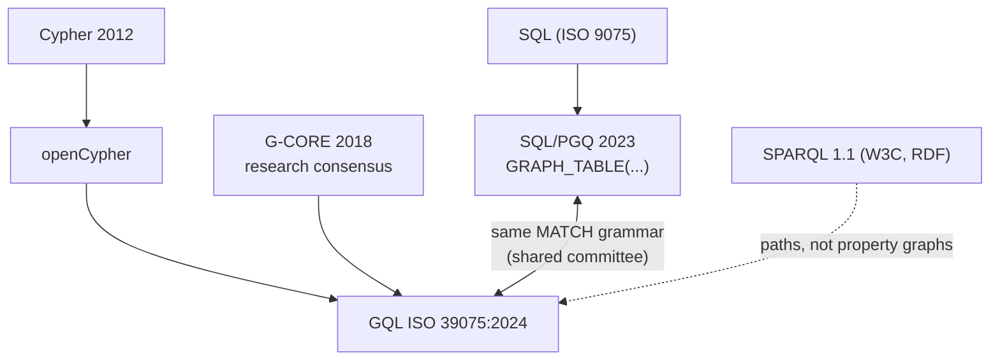

# Graph query languages: semantics, not syntax

Six languages query graphs, and the differences that matter are not
surface syntax but three fault lines: data model, matching semantics,
and composability. The same two-hop pattern returns three different
counts depending on semantics the language may not even let you spell.
This chapter maps the family tree — Cypher through GQL (the first new
ISO database language since SQL) — and what each language lets a
planner do; keep kuzu's `src/antlr4/Cypher.g4` open as the concrete
grammar (a full Cypher in 690 lines).

## One pattern, three answers

```
graph: a triangle  1 ──► 2 ──► 3 ──► 1

query: MATCH (a)-[]->(b)-[]->(c)   — count the 2-paths

homomorphism (nodes+edges may repeat): 1-2-3, 2-3-1, 3-1-2,
                                       and a=c ones like 1-2-1? no edge 2→1 — but
                                       add a back-edge and a=c matches appear
isomorphism  (no repeated nodes):      only node-distinct walks
trail        (no repeated edges):      Cypher's [*] var-length rule
```

This is the SIGMOD'22 paper's core: **matching semantics is a language
parameter, not folklore**. GQL/SQL-PGQ make it syntax — `MATCH ALL TRAIL
(a)-[]->{1,5}(b)` — with restrictors (TRAIL/ACYCLIC/SIMPLE) and
selectors (ANY SHORTEST, ALL SHORTEST, ANY k). Cypher fixed one hybrid
(homomorphism for nodes, trail for var-length edges) in 2012 and every
engine since has had to reverse-engineer the corner cases.

## The family tree



- **SQL/PGQ**: property graphs as *views over tables*; MATCH returns a
  table you join like any other. DuckDB ships it (duckpgq); Oracle too.
- **GQL**: standalone language, same pattern grammar, plus graph DDL,
  graph-to-graph queries, and quantified path patterns as first-class.
- **SPARQL**: pattern = basic graph pattern over triples; edge
  properties need reification or RDF-star (`<< :a :knows :b >> :since 2019`).
- **Gremlin**: the traversal IS the plan — `g.V().out().out()` names an
  execution order; optimizers can only peephole it.
- **Datalog**: the composability ceiling — every rule's output is a
  relation usable by any other rule; recursion is native (semi-naive
  evaluation, topic 27's incremental cousin). What Cypher's `CALL {}`
  subqueries chase.

## What each language lets the planner do

- Cypher/GQL/PGQ declare *what*; planner picks join order, direction,
  index — kuzu's WCOJ (reading-wcoj.md) is legal because MATCH is
  declarative.
- Gremlin's imperative order forbids most of that.
- SPARQL's triple-at-a-time model tends to plan as many small self-joins
  (the "SPARQL is 10 joins where Cypher is 2 expands" effect).
- Datalog exposes recursion to the optimizer (magic sets, demand
  transformation) — no other family can rewrite *through* a fixpoint.

## Questions

1. Count the 2-paths in the triangle above under each of homomorphism /
   isomorphism / edge-trail. Then check FalkorDB's actual answer — which
   semantics does it implement, and where is that decided in the code?
2. Write `filtered 2-hop` (this topic's experiment query) in Cypher,
   GQL, SPARQL, and Gremlin. Which versions *force* a plan shape rather
   than describe a result?
3. RDF reification: model `(:alice)-[:KNOWS {since: 2019}]->(:bob)` as
   plain triples. How many triples? What does the `since > 2015` filter
   look like, and what index does it now need?
4. GQL's quantified path pattern `(a)(-[:R]->){2,4}(b)` with TRAIL — why
   does naive expansion explode on supernodes (hop_bench's high-degree
   tail), and what does the restrictor let the engine prune?
5. Datalog can express "friend-of-friend excluding direct friends" as
   two rules with negation. What ordering constraint does negation
   impose (stratification), and what's the Cypher equivalent's cost?
6. **M13 mapping**: the capstone keeps the AST GQL-shaped — quantified
   path patterns + explicit path-mode. Sketch the enum/struct for a
   path pattern that can represent Cypher's `[*1..5]` AND GQL's
   `ALL ACYCLIC (a)(-[:R]->){1,5}(b)` without a parser rewrite.

## References

**Papers**
- Deutsch et al. — "Graph Pattern Matching in GQL and SQL/PGQ"
  (SIGMOD 2022, [arXiv:2112.06217](https://arxiv.org/abs/2112.06217))
  — the matching-semantics-as-parameter argument
- Angles et al. — "G-CORE: A Core for Future Graph Query Languages"
  (SIGMOD 2018, [arXiv:1712.01550](https://arxiv.org/abs/1712.01550))
  — the research consensus GQL absorbed
- GQL overview at [gqlstandards.org](https://www.gqlstandards.org)

**Code**
- [kuzu](https://github.com/kuzudb/kuzu) `src/antlr4/Cypher.g4` — a
  full Cypher grammar in one 690-line file; keep it open while reading
